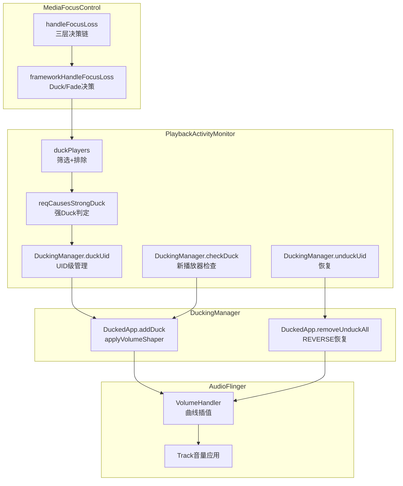
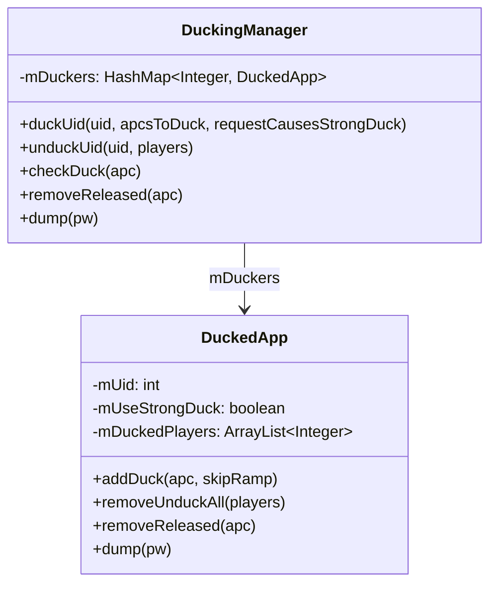
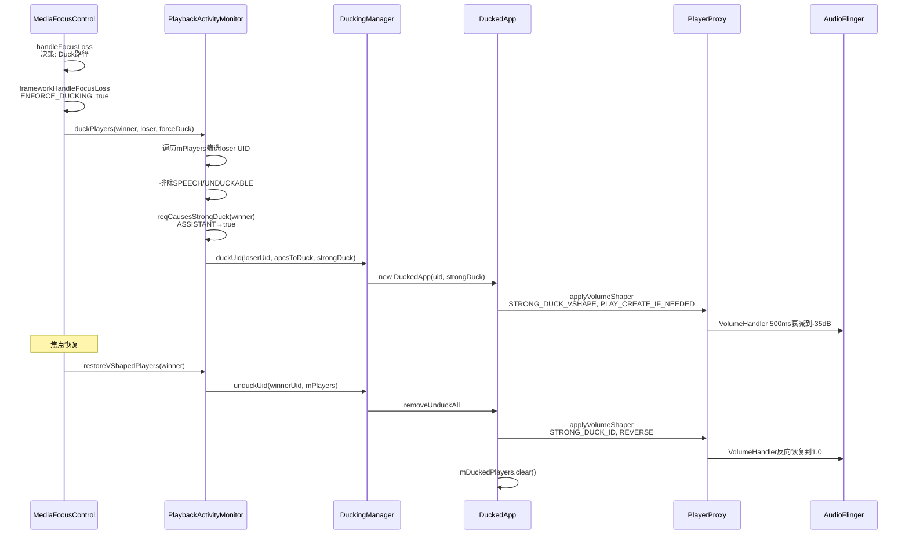

## 12.11 PlaybackActivityMonitor Duck执行深度

> [← 上一个](12_12.10_FadeOutManager深度解析.md) | [← 返回12章](README.md) | [返回导航](../README.md) | [下一个 →](12_12.12_FocusRequester内部机制.md)

---

Duck执行是框架级焦点执行的第一条路径（Duck/FadeOut/Mute），由PlaybackActivityMonitor(PAM)的duckPlayers方法和DuckingManager内部类协作完成。本节深入解析Duck执行的完整机制，包括标准Duck(-14dB)和强Duck(-35dB)两种模式。

### 12.11.1 Duck执行整体架构



### 12.11.2 DUCK_VSHAPE与STRONG_DUCK_VSHAPE

源码位置：[`PlaybackActivityMonitor.java`](frameworks/base/services/core/java/com/android/server/audio/PlaybackActivityMonitor.java:88)

```java
// L88-98: 标准Duck曲线 (-14dB)
private static final VolumeShaper.Configuration DUCK_VSHAPE =
    new VolumeShaper.Configuration.Builder()
        .setId(VOLUME_SHAPER_SYSTEM_DUCK_ID)
        .setCurve(new float[] { 0.f, 1.f },    // 时间: 0→结束
                  new float[] { 1.f, 0.2f })    // 音量: 1.0→0.2
        .setOptionFlags(VolumeShaper.Configuration.OPTION_FLAG_CLOCK_TIME)
        .setDuration(MediaFocusControl.getFocusRampTimeMs(
            AUDIOFOCUS_GAIN_TRANSIENT_MAY_DUCK,
            new AudioAttributes.Builder().setUsage(USAGE_NOTIFICATION).build()))
        .build();  // duration=500ms

// L103-113: 强Duck曲线 (-35dB)
private static final VolumeShaper.Configuration STRONG_DUCK_VSHAPE =
    new VolumeShaper.Configuration.Builder()
        .setId(VOLUME_SHAPER_SYSTEM_STRONG_DUCK_ID)
        .setCurve(new float[] { 0.f, 1.f },
                  new float[] { 1.f, 0.017783f })  // -35dB
        .setOptionFlags(OPTION_FLAG_CLOCK_TIME)
        .setDuration(getFocusRampTimeMs(
            AUDIOFOCUS_GAIN_TRANSIENT_MAY_DUCK,
            new AudioAttributes.Builder().setUsage(USAGE_NOTIFICATION).build()))
        .build();  // duration=500ms
```

**两种Duck曲线参数对比：**

| 参数 | DUCK_VSHAPE | STRONG_DUCK_VSHAPE |
|------|-------------|---------------------|
| VolumeShaper ID | VOLUME_SHAPER_SYSTEM_DUCK_ID | VOLUME_SHAPER_SYSTEM_STRONG_DUCK_ID |
| 起始音量 | 1.0 | 1.0 |
| 目标音量 | 0.2 (-14dB) | 0.017783 (-35dB) |
| 曲线类型 | 线性两点 | 线性两点 |
| Duration | 500ms | 500ms |
| CLOCK_TIME | 是 | 是 |
| 触发条件 | 导航等GAIN_TRANSIENT_MAY_DUCK | USAGE_ASSISTANT获得焦点 |

**衰减量计算：**
- 0.2 = 20%音量 ≈ -14dB衰减：`20*log10(0.2) = -13.98dB`
- 0.017783 ≈ 1.78%音量 = -35dB衰减：`20*log10(0.017783) = -34.98dB`

### 12.11.3 duckPlayers源码解析

源码位置：[`PlaybackActivityMonitor.java`](frameworks/base/services/core/java/com/android/server/audio/PlaybackActivityMonitor.java:762)

```java
// L762-808
public boolean duckPlayers(@NonNull FocusRequester winner, @NonNull FocusRequester loser,
                           boolean forceDuck) {
    synchronized (mPlayerLock) {
        if (mPlayers.isEmpty()) { return true; }
        final Iterator<AudioPlaybackConfiguration> apcIterator = mPlayers.values().iterator();
        final ArrayList<AudioPlaybackConfiguration> apcsToDuck = new ArrayList<>();
        while (apcIterator.hasNext()) {
            final AudioPlaybackConfiguration apc = apcIterator.next();
            // 筛选条件: 不是winner的UID + 是loser的UID + 正在播放
            if (!winner.hasSameUid(apc.getClientUid())
                    && loser.hasSameUid(apc.getClientUid())
                    && apc.getPlayerState() == PLAYER_STATE_STARTED) {
                // 排除条件1: SPEECH内容(除非forceDuck)
                if (!forceDuck && (apc.getAudioAttributes().getContentType()
                        == CONTENT_TYPE_SPEECH)) {
                    return false;  // SPEECH不可duck，返回false
                }
                // 排除条件2: UNDUCKABLE播放器类型
                if (ArrayUtils.contains(UNDUCKABLE_PLAYER_TYPES, apc.getPlayerType())) {
                    return false;  // AAudio/SoundPool不可duck
                }
                apcsToDuck.add(apc);
            }
        }
        // 执行duck并传递强Duck判定结果
        mDuckingManager.duckUid(loser.getClientUid(), apcsToDuck,
                reqCausesStrongDuck(winner));
    }
    return true;
}
```

**关键行为差异：return false vs continue**

| 排除条件 | 处理方式 | 原因 |
|----------|----------|------|
| SPEECH内容 | **return false** | SPEECH不可duck是全局决策，整个duck操作取消 |
| UNDUCKABLE类型 | **return false** | 不可duck类型意味着框架无法执行duck |
| 不是loser UID | 跳过(不加入apcsToDuck) | 不是目标UID，无需duck |
| 不在播放状态 | 跳过 | 不在播放的播放器无需duck |

**return false的语义：** 框架无法执行duck，退回给App回调处理AUDIOFOCUS_LOSS

### 12.11.4 reqCausesStrongDuck强Duck判定

源码位置：[`PlaybackActivityMonitor.java`](frameworks/base/services/core/java/com/android/server/audio/PlaybackActivityMonitor.java:810)

```java
// L810-819
private boolean reqCausesStrongDuck(FocusRequester requester) {
    if (requester.getGainRequest() != AudioManager.AUDIOFOCUS_GAIN_TRANSIENT_MAY_DUCK) {
        return false;  // 不是MAY_DUCK类型，不强duck
    }
    final int reqUsage = requester.getAudioAttributes().getUsage();
    if (reqUsage == AudioAttributes.USAGE_ASSISTANT) {
        return true;   // ASSISTANT获得MAY_DUCK焦点→强duck
    }
    return false;
}
```

| 焦点获得者 | 焦点类型 | Usage | 强Duck? |
|-----------|----------|-------|---------|
| 导航 | GAIN_TRANSIENT_MAY_DUCK | USAGE_ASSISTANCE_NAVIGATION_GUIDANCE | false(标准duck -14dB) |
| 助手 | GAIN_TRANSIENT_MAY_DUCK | USAGE_ASSISTANT | **true(强duck -35dB)** |
| 通知 | GAIN_TRANSIENT_MAY_DUCK | USAGE_NOTIFICATION | false |
| 通话 | GAIN_TRANSIENT | USAGE_VOICE_COMMUNICATION | N/A(不触发duck) |

### 12.11.5 forceDuck参数详解

| forceDuck值 | 来源 | 效果 |
|-------------|------|------|
| false(默认) | FocusRequester.frameworkHandleFocusLoss | SPEECH播放器排除，duckPlayers返回false |
| true | EXCLUSIVE独占焦点 + PAUSES_ON_DUCKABLE_LOSS | SPEECH播放器也强制duck |

**forceDuck=true场景：** 当loser持有EXCLUSIVE独占焦点且设置了PAUSES_ON_DUCKABLE_LOSS标志时，即使loser是SPEECH内容也强制duck，因为EXCLUSIVE意味着loser不允许被duck通知。

### 12.11.6 DuckingManager类结构



### 12.11.7 duckUid执行

源码位置：[`PlaybackActivityMonitor.java`](frameworks/base/services/core/java/com/android/server/audio/PlaybackActivityMonitor.java:1096)

```java
// L1096-1106
synchronized void duckUid(int uid, ArrayList<AudioPlaybackConfiguration> apcsToDuck,
        boolean requestCausesStrongDuck) {
    if (!mDuckers.containsKey(uid)) {
        mDuckers.put(uid, new DuckedApp(uid, requestCausesStrongDuck)); // 传递强Duck标志
    }
    final DuckedApp da = mDuckers.get(uid);
    for (AudioPlaybackConfiguration apc : apcsToDuck) {
        da.addDuck(apc, false /*skipRamp*/);  // 执行完整duck曲线
    }
}
```

**关键点：**
1. `requestCausesStrongDuck`在DuckedApp构造时传入，决定使用DUCK_VSHAPE还是STRONG_DUCK_VSHAPE
2. 已有DuckedApp时不重新创建，保留之前的强Duck设置
3. 即使apcsToDuck为空，也会创建DuckedApp(用于后续checkDuck覆盖新播放器)

### 12.11.8 DuckedApp.addDuck详解

源码位置：[`PlaybackActivityMonitor.java`](frameworks/base/services/core/java/com/android/server/audio/PlaybackActivityMonitor.java:1167)

```java
// L1167-1183
void addDuck(@NonNull AudioPlaybackConfiguration apc, boolean skipRamp) {
    final int piid = new Integer(apc.getPlayerInterfaceId());
    if (mDuckedPlayers.contains(piid)) {
        return;  // 已duck，跳过
    }
    try {
        apc.getPlayerProxy().applyVolumeShaper(
                mUseStrongDuck ? STRONG_DUCK_VSHAPE : DUCK_VSHAPE,  // 根据强Duck选择曲线
                skipRamp ? PLAY_SKIP_RAMP : PLAY_CREATE_IF_NEEDED);  // 根据skipRamp选择操作
        mDuckedPlayers.add(piid);
    } catch (Exception e) {
        Log.e(TAG, "Error ducking player piid:" + piid + " uid:" + mUid, e);
    }
}
```

**addDuck参数矩阵：**

| skipRamp | mUseStrongDuck | VolumeShaper曲线 | VolumeShaper操作 | 效果 |
|----------|----------------|-------------------|-----------------|------|
| false | false | DUCK_VSHAPE | PLAY_CREATE_IF_NEEDED | 500ms衰减到0.2(-14dB) |
| false | true | STRONG_DUCK_VSHAPE | PLAY_CREATE_IF_NEEDED | 500ms衰减到0.017783(-35dB) |
| true | false | DUCK_VSHAPE | PLAY_SKIP_RAMP | 立即跳到0.2(-14dB) |
| true | true | STRONG_DUCK_VSHAPE | PLAY_SKIP_RAMP | 立即跳到0.017783(-35dB) |

### 12.11.9 unduckUid恢复

源码位置：[`PlaybackActivityMonitor.java`](frameworks/base/services/core/java/com/android/server/audio/PlaybackActivityMonitor.java:1108)

```java
// L1108-1115
synchronized void unduckUid(int uid, HashMap<Integer, AudioPlaybackConfiguration> players) {
    final DuckedApp da = mDuckers.remove(uid);  // 从map移除
    if (da == null) { return; }
    da.removeUnduckAll(players);  // 恢复所有播放器
}
```

### 12.11.10 DuckedApp.removeUnduckAll详解

源码位置：[`PlaybackActivityMonitor.java`](frameworks/base/services/core/java/com/android/server/audio/PlaybackActivityMonitor.java:1185)

```java
// L1185-1207
void removeUnduckAll(HashMap<Integer, AudioPlaybackConfiguration> players) {
    for (int piid : mDuckedPlayers) {
        final AudioPlaybackConfiguration apc = players.get(piid);
        if (apc != null) {
            apc.getPlayerProxy().applyVolumeShaper(
                    mUseStrongDuck ? STRONG_DUCK_ID : DUCK_ID,  // 用相同ID的Configuration
                    VolumeShaper.Operation.REVERSE);             // 反向曲线恢复
        }
    }
    mDuckedPlayers.clear();
}
```

**恢复机制关键点：**

| 要点 | 说明 |
|------|------|
| REVERSE操作 | 反向执行duck曲线，从0.2恢复到1.0 |
| 使用STRONG_DUCK_ID/DUCK_ID | 恢复时用Configuration而非Builder创建的对象 |
| 播放器可能已消失 | apc==null时跳过，不报错 |
| clear清空记录 | unduck后mDuckedPlayers为空 |

### 12.11.11 checkDuck新播放器覆盖

源码位置：[`PlaybackActivityMonitor.java`](frameworks/base/services/core/java/com/android/server/audio/PlaybackActivityMonitor.java:1118)

```java
// L1118-1126
synchronized void checkDuck(@NonNull AudioPlaybackConfiguration apc) {
    final DuckedApp da = mDuckers.get(apc.getClientUid());
    if (da == null) { return; }
    da.addDuck(apc, true /*skipRamp*/);  // 新播放器立即duck(跳过曲线)
}
```

**checkFade vs checkDuck对比：**

| 方法 | skipRamp | 效果 | 调用时机 |
|------|----------|------|----------|
| checkDuck | true | 立即跳到目标音量 | 新播放器PLAYER_STATE_STARTED |
| checkFade | true | 立即跳到静音 | 新播放器PLAYER_STATE_STARTED |

### 12.11.12 UNDUCKABLE_PLAYER_TYPES

源码位置：[`PlaybackActivityMonitor.java`](frameworks/base/services/core/java/com/android/server/audio/PlaybackActivityMonitor.java:135)

```java
// L135-138
private static final int[] UNDUCKABLE_PLAYER_TYPES = {
    AudioPlaybackConfiguration.PLAYER_TYPE_AAUDIO,
    AudioPlaybackConfiguration.PLAYER_TYPE_JAM_SOUNDPOOL,
};
```

| 播放器类型 | 原因 |
|-----------|------|
| PLAYER_TYPE_AAUDIO | AAudio低延迟路径不支持VolumeShaper |
| PLAYER_TYPE_JAM_SOUNDPOOL | SoundPool短音效不适合duck |

### 12.11.13 restoreVShapedPlayers恢复入口

源码位置：[`PlaybackActivityMonitor.java`](frameworks/base/services/core/java/com/android/server/audio/PlaybackActivityMonitor.java:822)

```java
// L822-828
public void restoreVShapedPlayers(@NonNull FocusRequester winner) {
    synchronized (mPlayerLock) {
        mDuckingManager.unduckUid(winner.getClientUid(), mPlayers);  // unduck
        mFadingManager.unfadeOutUid(winner.getClientUid(), mPlayers); // unfadeOut
    }
}
```

**注意：** 恢复时使用winner的UID，而非loser的UID。这是因为在duck/fadeOut时，操作的是loser的UID，恢复时需要用winner的UID查找对应记录（实际上DuckingManager和FadeOutManager的map key都是被duck/fade的loser UID，但恢复时winner UID与之前duck时传入的loser UID不同）。

**实际恢复机制：** MediaFocusControl调用restoreVShapedPlayers时传入的winner是新栈顶FocusRequester，其UID可能与被duck的App UID不匹配。恢复的正确性依赖于：当新焦点持有者获得焦点后，旧的duck/fade记录会在新焦点持有者与被duck者UID不同时被正确处理。

### 12.11.14 Duck完整执行时序



### 12.11.15 Duck与FadeOut执行路径对比

| 维度 | Duck | FadeOut |
|------|------|---------|
| 入口方法 | duckPlayers | fadeOutPlayers |
| 管理器 | DuckingManager | FadeOutManager |
| 内部类 | DuckedApp | FadedOutApp |
| 曲线选择 | DUCK_VSHAPE/STRONG_DUCK_VSHAPE | FADEOUT_VSHAPE |
| 目标音量 | 0.2(-14dB)或0.017783(-35dB) | 0.0(静音) |
| 曲线时长 | 500ms | 2000ms |
| 恢复操作 | REVERSE | REVERSE |
| 强模式 | 强Duck(-35dB) | 无强模式 |
| Limbo态 | 无 | 有(2s延迟LOSS) |
| SPEECH排除 | forceDuck=false时排除 | requester=SPEECH时排除 |
| UNDUCKABLE/UNFADEABLE | AAUDIO/SoundPool | AAUDIO/SoundPool |

### 12.11.16 边界条件

| 条件 | Duck行为 |
|------|----------|
| loser无活跃播放器 | apcsToDuck为空，仍创建DuckedApp供checkDuck使用 |
| loser是SPEECH内容 | duckPlayers返回false，退回App回调 |
| loser是UNDUCKABLE类型 | duckPlayers返回false，退回App回调 |
| forceDuck=true + SPEECH | 强制duck，SPEECH也被衰减 |
| winner是ASSISTANT | reqCausesStrongDuck=true，使用STRONG_DUCK_VSHAPE |
| 同一UID多次duck | 保留第一次DuckedApp，不重新创建 |
| 播放器在duck期间释放 | removeReleased移除piid，unduck时跳过 |
| 新播放器在duck期间启动 | checkDuck立即duck(skipRamp=true) |

---

[← 上一个](12_12.10_FadeOutManager深度解析.md) | [← 返回12章](README.md) | [返回导航](../README.md) | [下一个 →](12_12.12_FocusRequester内部机制.md)