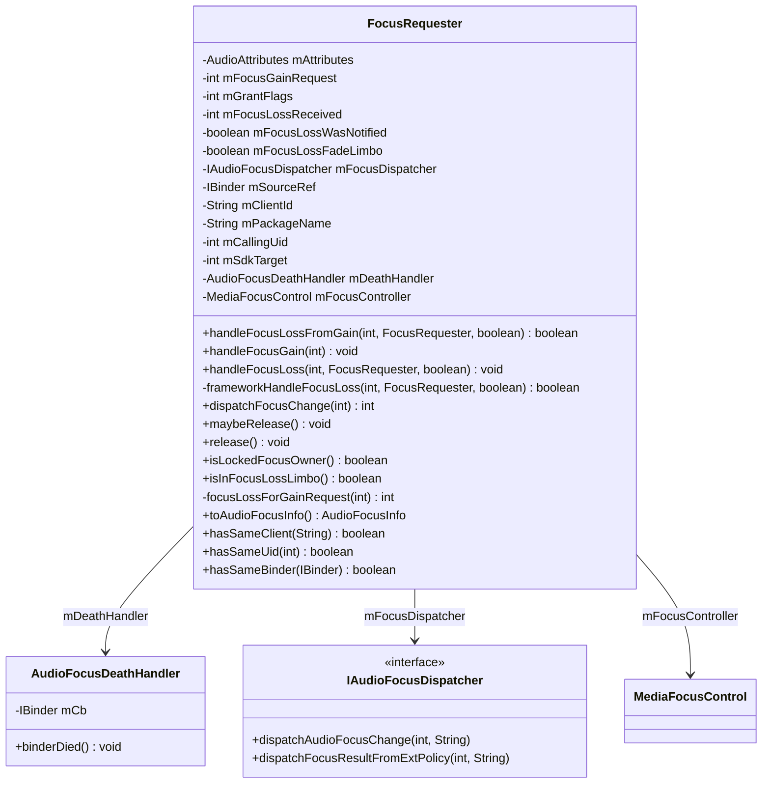
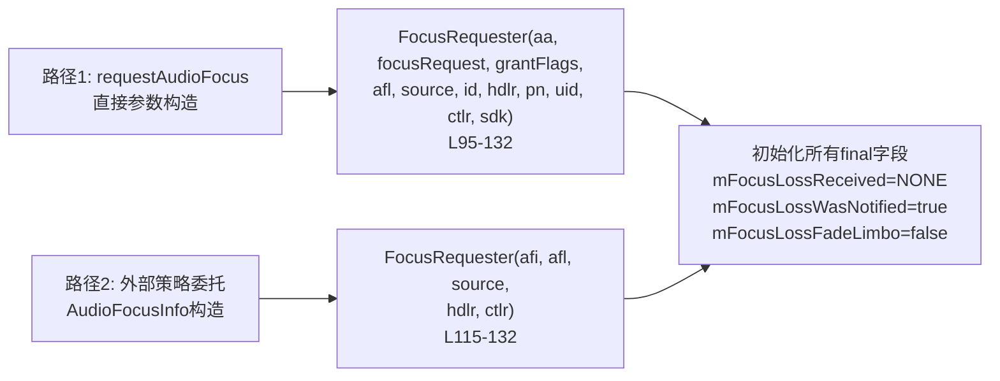
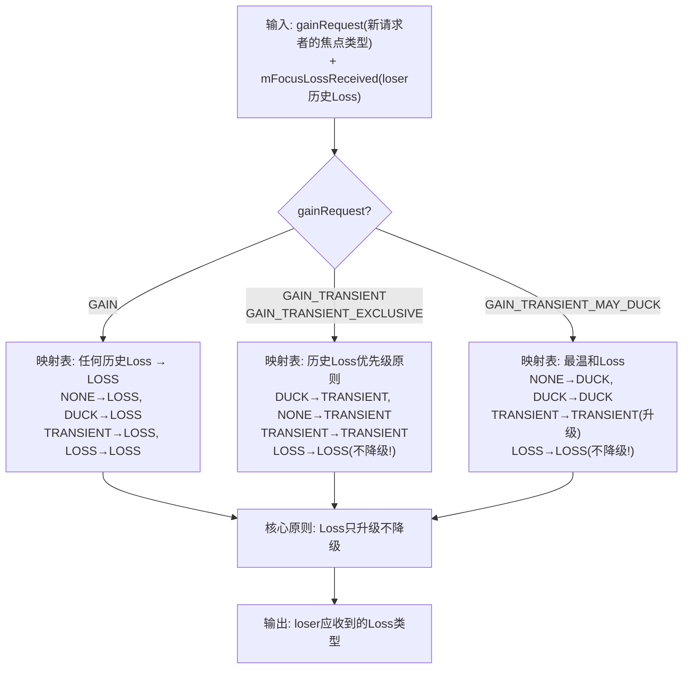
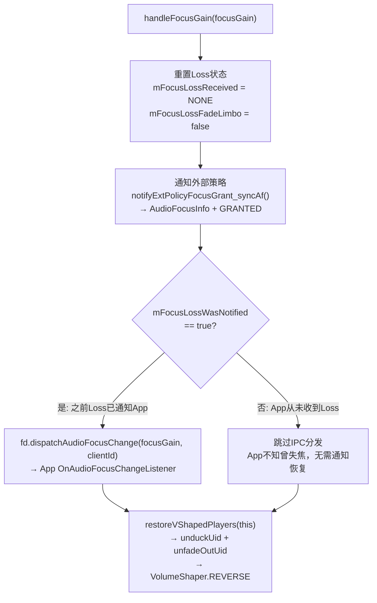
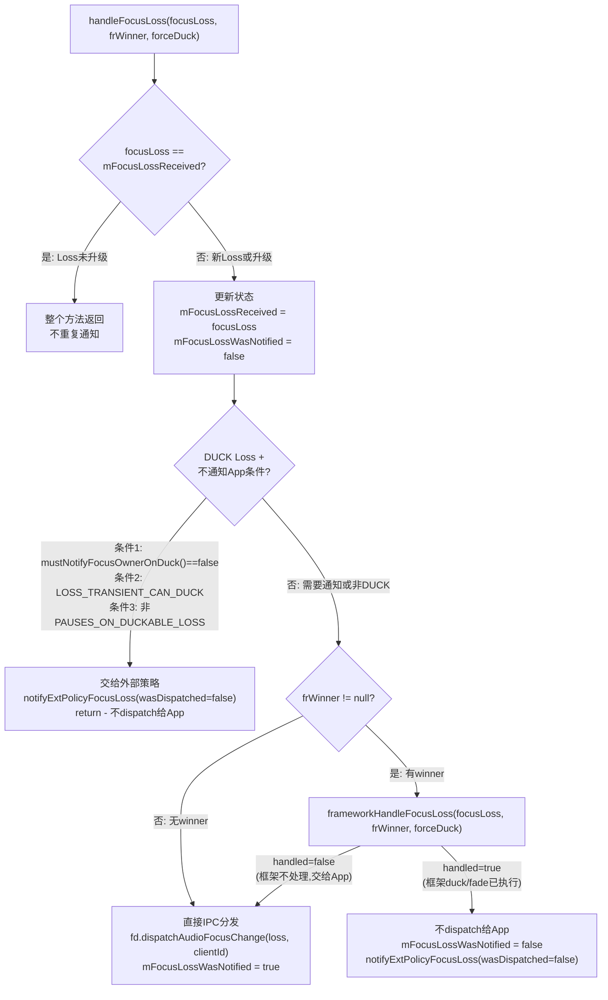
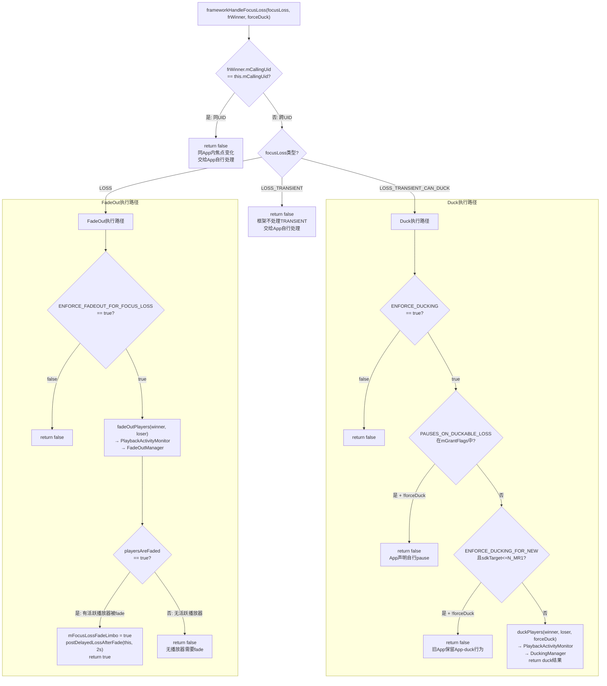
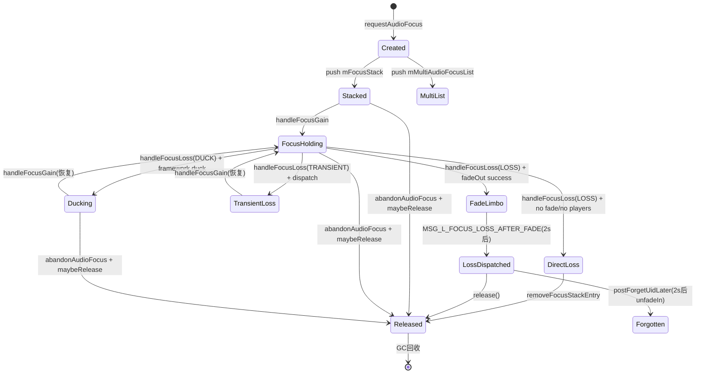
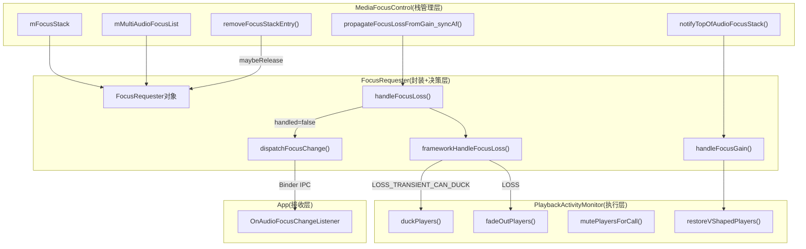

## 12.12 FocusRequester内部机制

[← 上一个](12_12.11_PlaybackActivityMonitor_Duck执行深度.md) | [← 返回12章](README.md) | [返回导航](../README.md) | [下一个 →](12_12.13_多用户焦点隔离.md)

---

`FocusRequester`是焦点栈`mFocusStack`中每个条目的封装对象，记录焦点请求者的全部身份信息、请求参数、Loss状态，并负责焦点Loss/Gain的IPC分发与框架级执行决策（Duck/FadeOut/Mute）。它是Audio Focus系统从"栈管理"到"执行落地"的关键桥梁。

**源码**: [`FocusRequester.java`](frameworks/base/services/core/java/com/android/server/audio/FocusRequester.java) (540行)

### 12.12.1 类结构总览



### 12.12.2 核心字段详解与内存布局

[`FocusRequester`](frameworks/base/services/core/java/com/android/server/audio/FocusRequester.java:39)的字段分为三组：**身份标识组**、**请求参数组**、**Loss状态组**。

#### 身份标识组（final，构造时确定）

| 字段 | 类型 | 源码行号 | 说明 |
|------|------|----------|------|
| [`mClientId`](frameworks/base/services/core/java/com/android/server/audio/FocusRequester.java:48) | `String` | L48 | 客户端唯一标识，用于栈中查找/移除，由App生成 |
| [`mPackageName`](frameworks/base/services/core/java/com/android/server/audio/FocusRequester.java:49) | `String` | L49 | 请求者包名，权限检查+日志 |
| [`mCallingUid`](frameworks/base/services/core/java/com/android/server/audio/FocusRequester.java:50) | `int` | L50 | 请求者UID，duck/fade/mute的播放器匹配核心维度 |
| [`mSourceRef`](frameworks/base/services/core/java/com/android/server/audio/FocusRequester.java:47) | `IBinder` | L47 | App进程Binder引用，DeathRecipient监控对象 |
| [`mSdkTarget`](frameworks/base/services/core/java/com/android/server/audio/FocusRequester.java:52) | `int` | L52 | targetSdkVersion，决定duck/fade策略分水岭 |

#### 请求参数组（final，构造时确定）

| 字段 | 类型 | 源码行号 | 说明 |
|------|------|----------|------|
| [`mAttributes`](frameworks/base/services/core/java/com/android/server/audio/FocusRequester.java:80) | `AudioAttributes` | L80 | 音频属性(Usage/ContentType)，决定duck/fade资格 |
| [`mFocusGainRequest`](frameworks/base/services/core/java/com/android/server/audio/FocusRequester.java:57) | `int` | L57 | 请求的焦点类型：GAIN/GAIN_TRANSIENT/GAIN_TRANSIENT_MAY_DUCK/GAIN_TRANSIENT_EXCLUSIVE |
| [`mGrantFlags`](frameworks/base/services/core/java/com/android/server/audio/FocusRequester.java:62) | `int` | L62 | 授予标志位掩码：DELAY_OK(0x1)/LOCK(0x2)/PAUSES_ON_DUCKABLE_LOSS(0x4) |

#### Loss状态组（动态，随焦点变化更新）

| 字段 | 类型 | 初始值 | 源码行号 | 说明 |
|------|------|--------|----------|------|
| [`mFocusLossReceived`](frameworks/base/services/core/java/com/android/server/audio/FocusRequester.java:67) | `int` | NONE | L67 | 当前收到的最高Loss类型，只升级不降级 |
| [`mFocusLossWasNotified`](frameworks/base/services/core/java/com/android/server/audio/FocusRequester.java:71) | `boolean` | true | L71 | 焦点Loss是否已通过IPC通知App |
| [`mFocusLossFadeLimbo`](frameworks/base/services/core/java/com/android/server/audio/FocusRequester.java:76) | `boolean` | false | L76 | FadeOut悬停态：已失焦但2s内不释放，等待淡出完成 |

**关键设计**: `mFocusLossReceived`只升不降——一旦收到`LOSS`，后续即使只应收到`LOSS_TRANSIENT_CAN_DUCK`，实际Loss仍为`LOSS`。这是[`focusLossForGainRequest()`](frameworks/base/services/core/java/com/android/server/audio/FocusRequester.java:288)的核心原则。

### 12.12.3 构造函数双路径

`FocusRequester`有两个构造函数，对应两种创建场景：



**路径1** ([`L95-113`](frameworks/base/services/core/java/com/android/server/audio/FocusRequester.java:95)): 标准`requestAudioFocus()`流程，由[`MediaFocusControl.requestAudioFocus()`](frameworks/base/services/core/java/com/android/server/audio/MediaFocusControl.java:952)直接传入各参数创建。

**路径2** ([`L115-132`](frameworks/base/services/core/java/com/android/server/audio/FocusRequester.java:115)): 外部焦点策略(`mFocusPolicy`)场景，`AudioFocusInfo`由外部策略回调创建，再拆包为FocusRequester各字段。

两个构造函数共享相同的字段初始化逻辑（L108-112），确保`mFocusLossReceived=NONE`、`mFocusLossWasNotified=true`、`mFocusLossFadeLimbo=false`的一致初始状态。

### 12.12.4 focusLossForGainRequest() Loss类型映射核心算法

[`focusLossForGainRequest()`](frameworks/base/services/core/java/com/android/server/audio/FocusRequester.java:288)是焦点Loss类型映射的核心算法——根据新请求者的`gainRequest`和当前loser的`mFocusLossReceived`历史，计算出loser应收到的Loss类型。



**完整映射表**（源码[`L288-322`](frameworks/base/services/core/java/com/android/server/audio/FocusRequester.java:288)）：

| 新请求者gainRequest | loser历史Loss → 计算Loss |
|-----|------|
| `GAIN` | NONE→**LOSS**, DUCK→**LOSS**, TRANSIENT→**LOSS**, LOSS→**LOSS** |
| `GAIN_TRANSIENT` / `GAIN_TRANSIENT_EXCLUSIVE` | NONE→**TRANSIENT**, DUCK→**TRANSIENT**, TRANSIENT→**TRANSIENT**, LOSS→**LOSS** |
| `GAIN_TRANSIENT_MAY_DUCK` | NONE→**DUCK**, DUCK→**DUCK**, TRANSIENT→**TRANSIENT**, LOSS→**LOSS** |

**关键洞察**: 当loser历史`mFocusLossReceived=LOSS`时，无论新请求者是什么类型，loser都收到`LOSS`。这防止了"先永久失焦又变回临时失焦"的逻辑错误——App已经停止播放，不应再被通知为临时失焦。

### 12.12.5 handleFocusLossFromGain() 确定性Loss判定

[`handleFocusLossFromGain()`](frameworks/base/services/core/java/com/android/server/audio/FocusRequester.java:331)是`focusLossForGainRequest()`的封装入口，同时返回`isDefinitiveLoss`布尔值：

```java
// L330-336
boolean handleFocusLossFromGain(int focusGain, final FocusRequester frWinner, boolean forceDuck) {
    final int focusLoss = focusLossForGainRequest(focusGain);
    handleFocusLoss(focusLoss, frWinner, forceDuck);
    return (focusLoss == AudioManager.AUDIOFOCUS_LOSS); // 仅LOSS是确定性
}
```

`isDefinitiveLoss=true`意味着loser收到的是`AUDIOFOCUS_LOSS`（永久失焦），[`propagateFocusLossFromGain_syncAf()`](frameworks/base/services/core/java/com/android/server/audio/MediaFocusControl.java:296)会将确定性Loss的FocusRequester从栈中移除（`clientsToRemove`列表）。

### 12.12.6 handleFocusGain() 焦点获得完整处理

[`handleFocusGain()`](frameworks/base/services/core/java/com/android/server/audio/FocusRequester.java:339)执行三个关键操作：



**源码关键逻辑** ([`L339-359`](frameworks/base/services/core/java/com/android/server/audio/FocusRequester.java:339))：

```java
void handleFocusGain(int focusGain) {
    try {
        mFocusLossReceived = AudioManager.AUDIOFOCUS_NONE;  // 重置
        mFocusLossFadeLimbo = false;                        // 退出limbo
        mFocusController.notifyExtPolicyFocusGrant_syncAf(toAudioFocusInfo(), GRANTED);
        final IAudioFocusDispatcher fd = mFocusDispatcher;
        if (fd != null) {
            if (mFocusLossWasNotified) {   // 仅当App曾收到Loss时才通知Gain
                fd.dispatchAudioFocusChange(focusGain, mClientId);
            }
        }
        mFocusController.restoreVShapedPlayers(this);  // 恢复duck/fade播放器
    } catch (android.os.RemoteException e) { ... }
}
```

**设计要点**: `mFocusLossWasNotified`门控——如果框架已执行duck（`mFocusLossWasNotified=false`），App从未收到Loss回调，恢复时也不通知Gain。这避免了"App不知道被duck又被通知恢复"的混乱。

### 12.12.7 handleFocusLoss() 分发决策链

[`handleFocusLoss()`](frameworks/base/services/core/java/com/android/server/audio/FocusRequester.java:369)是FocusRequester最复杂的方法，包含三层决策：重复Loss检查→DUCK通知策略→框架执行决策。



**源码关键段落** ([`L369-425`](frameworks/base/services/core/java/com/android/server/audio/FocusRequester.java:369))：

```java
void handleFocusLoss(int focusLoss, @Nullable final FocusRequester frWinner, boolean forceDuck) {
    try {
        if (focusLoss != mFocusLossReceived) {           // 第一层: Loss升级检查
            mFocusLossReceived = focusLoss;
            mFocusLossWasNotified = false;
            // 第二层: DUCK Loss不通知App检查
            if (!mFocusController.mustNotifyFocusOwnerOnDuck()
                    && mFocusLossReceived == AUDIOFOCUS_LOSS_TRANSIENT_CAN_DUCK
                    && (mGrantFlags & AUDIOFOCUS_FLAG_PAUSES_ON_DUCKABLE_LOSS) == 0) {
                mFocusController.notifyExtPolicyFocusLoss_syncAf(toAudioFocusInfo(), false);
                return;
            }
            // 第三层: 框架执行决策
            boolean handled = false;
            if (frWinner != null) {
                handled = frameworkHandleFocusLoss(focusLoss, frWinner, forceDuck);
            }
            if (handled) {
                mFocusController.notifyExtPolicyFocusLoss_syncAf(toAudioFocusInfo(), false);
                return; // mFocusLossWasNotified = false
            }
            // 最终: IPC分发给App
            final IAudioFocusDispatcher fd = mFocusDispatcher;
            if (fd != null) {
                mFocusLossWasNotified = true;
                fd.dispatchAudioFocusChange(mFocusLossReceived, mClientId);
            }
        }
    } catch (android.os.RemoteException e) { ... }
}
```

### 12.12.8 frameworkHandleFocusLoss() 框架级执行决策

[`frameworkHandleFocusLoss()`](frameworks/base/services/core/java/com/android/server/audio/FocusRequester.java:435)是焦点Loss从"通知"到"执行"的关键决策点。



**源码完整实现** ([`L435-485`](frameworks/base/services/core/java/com/android/server/audio/FocusRequester.java:435))：

```java
private boolean frameworkHandleFocusLoss(int focusLoss, @NonNull final FocusRequester frWinner,
                                         boolean forceDuck) {
    // 同UID: 交给App自行处理
    if (frWinner.mCallingUid == this.mCallingUid) { return false; }

    if (focusLoss == AUDIOFOCUS_LOSS_TRANSIENT_CAN_DUCK) {
        if (!MediaFocusControl.ENFORCE_DUCKING) { return false; }
        if (!forceDuck && ((mGrantFlags & AUDIOFOCUS_FLAG_PAUSES_ON_DUCKABLE_LOSS) != 0)) {
            return false; // App声明自行pause
        }
        if (!forceDuck && (ENFORCE_DUCKING_FOR_NEW
                && this.getSdkTarget() <= DUCKING_IN_APP_SDK_LEVEL)) {
            return false; // 旧SDK保留App-duck
        }
        return mFocusController.duckPlayers(frWinner, this, forceDuck);
    }

    if (focusLoss == AUDIOFOCUS_LOSS) {
        if (!MediaFocusControl.ENFORCE_FADEOUT_FOR_FOCUS_LOSS) { return false; }
        boolean playersAreFaded = mFocusController.fadeOutPlayers(frWinner, this);
        if (playersAreFaded) {
            mFocusLossFadeLimbo = true;                       // 进入limbo悬停态
            mFocusController.postDelayedLossAfterFade(this,   // 延迟2s派发LOSS
                    FadeOutManager.FADE_OUT_DURATION_MS);
            return true;
        }
    }
    return false;
}
```

**决策矩阵汇总**：

| Loss类型 | 条件 | 框架行为 | App是否收到IPC |
|----------|------|----------|----------------|
| DUCK | ENFORCE_DUCKING + 新SDK + 非PAUSES | `duckPlayers()` → VolumeShaper -14dB/-35dB | 否(mFocusLossWasNotified=false) |
| DUCK | PAUSES_ON_DUCKABLE_LOSS | 不执行，交给App | 是(App自行pause) |
| DUCK | 旧SDK(<=N_MR1) | 不执行，保留旧行为 | 是(App自行duck) |
| LOSS | ENFORCE_FADEOUT + 有活跃播放器 | `fadeOutPlayers()` → VolumeShaper 1→0 | 否(进入Limbo，2s后dispatch) |
| LOSS | ENFORCE_FADEOUT + 无活跃播放器 | 不执行 | 是(直接dispatch LOSS) |
| LOSS | !ENFORCE_FADEOUT | 不执行 | 是(直接dispatch LOSS) |
| TRANSIENT | 任何 | 不执行 | 是(App自行处理) |
| 任何 | winner/loser同UID | 不执行 | 是(App内部自行处理) |

### 12.12.9 dispatchFocusChange() IPC派发机制

[`dispatchFocusChange()`](frameworks/base/services/core/java/com/android/server/audio/FocusRequester.java:487)是焦点变化通过Binder IPC派发到App的唯一出口：

```java
// L487-515
int dispatchFocusChange(int focusChange) {
    final IAudioFocusDispatcher fd = mFocusDispatcher;
    if (fd == null) { return AUDIOFOCUS_REQUEST_FAILED; }    // dispatcher已release
    if (focusChange == AUDIOFOCUS_NONE) { return REQUEST_FAILED; } // 无效变化
    // Gain类型校验: 派发的Gain必须与请求的Gain一致
    if ((focusChange == GAIN || GAIN_TRANSIENT || ...) && (mFocusGainRequest != focusChange)) {
        Log.w(TAG, "focus gain was requested with " + mFocusGainRequest + ", dispatching " + focusChange);
    }
    // Loss类型: 更新mFocusLossReceived
    if (focusChange == LOSS || LOSS_TRANSIENT || LOSS_TRANSIENT_CAN_DUCK) {
        mFocusLossReceived = focusChange;
    }
    try {
        fd.dispatchAudioFocusChange(focusChange, mClientId);  // Binder IPC调用
    } catch (RemoteException e) { return REQUEST_FAILED; }
    return AUDIOFOCUS_REQUEST_GRANTED;
}
```

**关键调用场景**: `MSG_L_FOCUS_LOSS_AFTER_FADE`消息处理中 ([`MediaFocusControl L1298-1310`](frameworks/base/services/core/java/com/android/server/audio/MediaFocusControl.java:1298))：

```java
case MSG_L_FOCUS_LOSS_AFTER_FADE:
    synchronized (mAudioFocusLock) {
        final FocusRequester loser = (FocusRequester) msg.obj;
        if (loser.isInFocusLossLimbo()) {
            loser.dispatchFocusChange(AudioManager.AUDIOFOCUS_LOSS); // 派发LOSS
            loser.release();                                         // 释放对象
            postForgetUidLater(loser.getClientUid());                // 延迟2s unfadeIn
        }
    }
```

### 12.12.10 FocusRequester生命周期与Limbo状态



**Limbo状态核心逻辑** ([`L258-262`](frameworks/base/services/core/java/com/android/server/audio/FocusRequester.java:258))：

```java
void maybeRelease() {
    if (!mFocusLossFadeLimbo) {    // 非limbo → 立即释放
        release();
    }
    // limbo → 不释放，等待MSG_L_FOCUS_LOSS_AFTER_FADE
}
```

**Limbo生命周期时序**：

| 时间点 | 事件 | mFocusLossFadeLimbo | mFocusLossWasNotified |
|--------|------|---------------------|----------------------|
| T0 | `frameworkHandleFocusLoss(LOSS)` → fadeOut成功 | true | false |
| T0+2s | `MSG_L_FOCUS_LOSS_AFTER_FADE` → `dispatchFocusChange(LOSS)` | true→release后清 | true |
| T0+4s | `MSL_L_FORGET_UID` → `forgetUid()` → unfadeOutUid | N/A | N/A |

### 12.12.11 AudioFocusDeathHandler 进程死亡清理

[`AudioFocusDeathHandler`](frameworks/base/services/core/java/com/android/server/audio/MediaFocusControl.java:570)是`IBinder.DeathRecipient`的内部类实现，当App进程意外死亡时自动清理焦点：

```java
// L570-596
protected class AudioFocusDeathHandler implements IBinder.DeathRecipient {
    private IBinder mCb;
    public void binderDied() {
        synchronized(mAudioFocusLock) {
            if (mFocusPolicy != null) {
                removeFocusEntryForExtPolicyOnDeath(mCb);  // 外部策略路径
            } else {
                removeFocusStackEntryOnDeath(mCb);          // 标准栈路径
                // 多焦点模式清理
                if (mMultiAudioFocusEnabled && !mMultiAudioFocusList.isEmpty()) {
                    Iterator<FocusRequester> it = mMultiAudioFocusList.iterator();
                    while (it.hasNext()) {
                        FocusRequester fr = it.next();
                        if (fr.hasSameBinder(mCb)) { it.remove(); fr.release(); }
                    }
                }
            }
        }
    }
}
```

[`release()`](frameworks/base/services/core/java/com/android/server/audio/FocusRequester.java:264)清理操作：

```java
// L264-274
void release() {
    final IBinder srcRef = mSourceRef;
    final AudioFocusDeathHandler deathHdlr = mDeathHandler;
    try {
        if (srcRef != null && deathHdlr != null) {
            srcRef.unlinkToDeath(deathHdlr, 0);  // 解除死亡监控
        }
    } catch (NoSuchElementException e) { }
    mDeathHandler = null;
    mFocusDispatcher = null;                      // 清空Binder引用
}
```

### 12.12.12 辅助方法与标识匹配

FocusRequester提供多个标识匹配方法，供`MediaFocusControl`在栈操作中使用：

| 方法 | 源码行号 | 用途 |
|------|----------|------|
| [`hasSameClient(String)`](frameworks/base/services/core/java/com/android/server/audio/FocusRequester.java:134) | L134 | `removeFocusStackEntry()`按clientId移除 |
| [`hasSameUid(int)`](frameworks/base/services/core/java/com/android/server/audio/FocusRequester.java:165) | L165 | `duckPlayers()/fadeOutPlayers()`按UID匹配播放器 |
| [`hasSameBinder(IBinder)`](frameworks/base/services/core/java/com/android/server/audio/FocusRequester.java:149) | L149 | `binderDied()`死亡清理匹配 |
| [`hasSameDispatcher(IAudioFocusDispatcher)`](frameworks/base/services/core/java/com/android/server/audio/FocusRequester.java:153) | L153 | `requestAudioFocus()`重注册检测 |
| [`isLockedFocusOwner()`](frameworks/base/services/core/java/com/android/server/audio/FocusRequester.java:138) | L138 | `canReassignAudioFocus()`锁定焦点判定 |
| [`isInFocusLossLimbo()`](frameworks/base/services/core/java/com/android/server/audio/FocusRequester.java:145) | L145 | `MSG_L_FOCUS_LOSS_AFTER_FADE`limbo检查 |
| [`toAudioFocusInfo()`](frameworks/base/services/core/java/com/android/server/audio/FocusRequester.java:536) | L536 | 外部策略回调数据打包 |

### 12.12.13 FocusRequester与其他组件的交互关系



**交互关键路径**：
1. **Loss传播**: `propagateFocusLossFromGain_syncAf()` → 遍历栈中每个`FocusRequester.handleFocusLossFromGain()` → `handleFocusLoss()` → `frameworkHandleFocusLoss()` → `duckPlayers()/fadeOutPlayers()`
2. **Gain恢复**: `notifyTopOfAudioFocusStack()` → `handleFocusGain()` → `restoreVShapedPlayers()` → `unduckUid()/unfadeOutUid()`
3. **Limbo延迟**: `frameworkHandleFocusLoss(LOSS)` → `mFocusLossFadeLimbo=true` → 2s后`MSG_L_FOCUS_LOSS_AFTER_FADE` → `dispatchFocusChange(LOSS)` → `release()` → 2s后`MSL_L_FORGET_UID` → `forgetUid()`

[← 上一个](12_12.11_PlaybackActivityMonitor_Duck执行深度.md) | [← 返回12章](README.md) | [返回导航](../README.md) | [下一个 →](12_12.13_多用户焦点隔离.md)