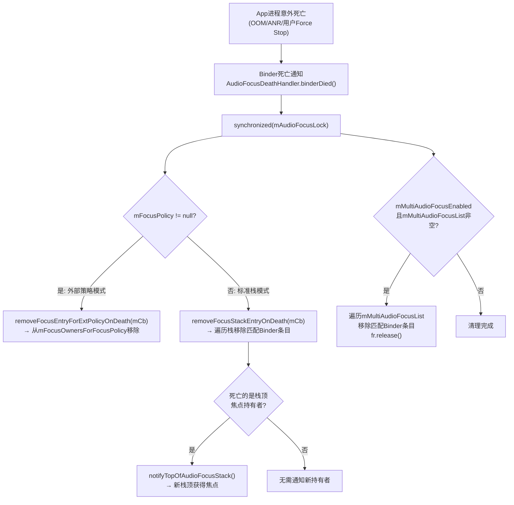
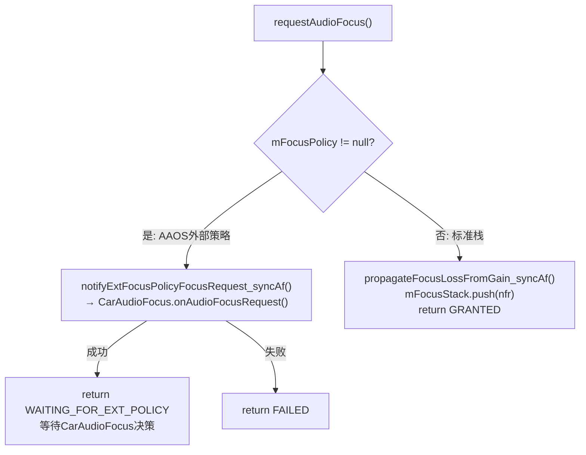
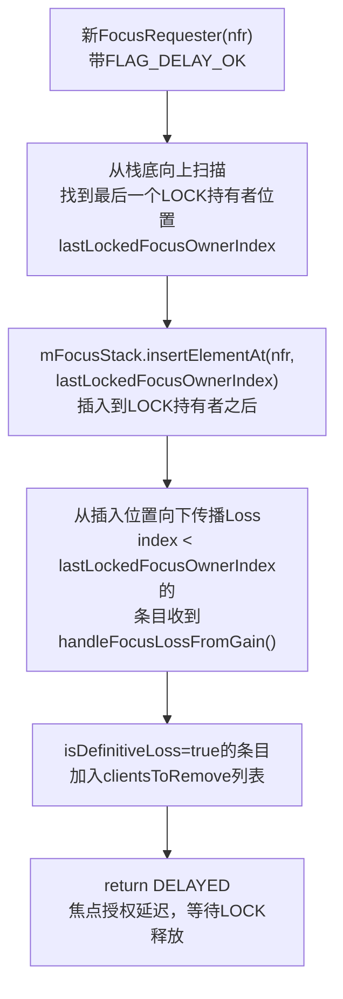
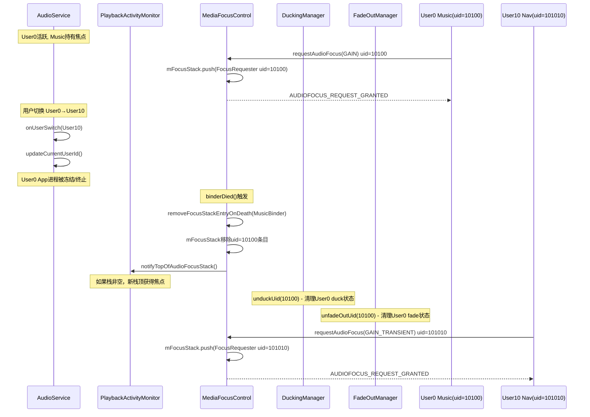

## 12.13 多用户焦点隔离

[← 上一个](12_12.12_FocusRequester内部机制.md) | [← 返回12章](README.md) | [返回导航](../README.md) | [下一个 →](12_12.14_焦点与音量的联动机制.md)

---

Android音频焦点系统在多用户环境下通过**UID隔离**、**Binder死亡监控**、**外部焦点策略委托**和**AAOS多焦点模式**四层机制确保用户间焦点独立性。本章从源码级别深度解析每一层隔离机制的实现细节。

**核心源码**: [`MediaFocusControl.java`](frameworks/base/services/core/java/com/android/server/audio/MediaFocusControl.java) (1360行)

### 12.13.1 多用户焦点隔离架构总览

```mermaid
flowchart TB
    subgraph "用户0空间(uid=10100系列)"
        APP0["User0 App<br>uid=1010034"]
        PLAYER0["User0 Player<br>piid=15<br>uid=1010034"]
    end

    subgraph "用户10空间(uid=101010系列)"
        APP10["User10 App<br>uid=10101034"]
        PLAYER10["User10 Player<br>piid=22<br>uid=10101034"]
    end

    subgraph "系统服务空间"
        MFC["MediaFocusControl<br>mFocusStack全局栈"]
        PAM["PlaybackActivityMonitor<br>mPlayers全局Map"]
        DM["DuckingManager<br>mDuckedApps: HashMap uid→DuckedApp"]
        FOM["FadeOutManager<br>mFadedApps: HashMap uid→FadedOutApp"]
    end

    APP0 -->|"requestAudioFocus<br>uid=1010034"| MFC
    APP10 -->|"requestAudioFocus<br>uid=10101034"| MFC
    MFC -->|"duckPlayers(loser.uid=1010034)"| PAM
    PAM -->|"loser.hasSameUid(apc.getClientUid())"| DM
    DM -->|"duckUid(1010034)<br>仅duck uid=1010034的播放器"| PLAYER0

    PAM -->|"不匹配uid=10101034<br>User10播放器不受影响"| PLAYER10

    APP0 -->|"Binder死亡<br>binderDied()"| MFC : "自动清理"
```

**核心原则**: 焦点栈`mFocusStack`是全局单栈，但所有执行操作(duck/fade/mute)严格按UID维度匹配——不同用户的App拥有不同UID，天然形成隔离边界。

### 12.13.2 UID维度隔离机制详解

#### 12.13.2.1 UID在焦点栈中的角色

[`FocusRequester`](frameworks/base/services/core/java/com/android/server/audio/FocusRequester.java:50)的`mCallingUid`字段是所有隔离操作的核心维度：

```java
// FocusRequester.java L50
private final int mCallingUid;  // 由Binder.getCallingUid()获取
```

在[`requestAudioFocus()`](frameworks/base/services/core/java/com/android/server/audio/MediaFocusControl.java:952)中，UID通过Binder RPC自动获取：

```java
// MediaFocusControl.java L969-970
final int uid = (flags == AudioManager.AUDIOFOCUS_FLAG_TEST)
        ? testUid : Binder.getCallingUid();  // 从Binder调用上下文获取真实UID
```

Android UID编码规则：`uid = userId * 100000 + appId`，例如：
- User0的com.example.app: `uid = 0 * 100000 + 10034 = 10034`
- User10的com.example.app: `uid = 10 * 100000 + 10034 = 10101034`

这意味着不同用户即使安装相同App，UID也不同，形成天然隔离。

#### 12.13.2.2 UID隔离在Duck执行中的体现

[`duckPlayers()`](frameworks/base/services/core/java/com/android/server/audio/PlaybackActivityMonitor.java:762)严格按UID匹配loser的播放器：

```java
// PlaybackActivityMonitor.java L778-781
if (!winner.hasSameUid(apc.getClientUid())       // 不是winner的播放器
        && loser.hasSameUid(apc.getClientUid())  // 是loser UID的播放器
        && apc.getPlayerState() == PLAYER_STATE_STARTED) // 正在播放
{
    apcsToDuck.add(apc);  // 仅duck loser UID的播放器
}
```

**隔离效果**: 如果User0的Music App被duck，仅uid=1010034的播放器被duck，User10(uid=10101034)的同名App播放器完全不受影响。

#### 12.13.2.3 UID隔离在FadeOut执行中的体现

[`fadeOutPlayers()`](frameworks/base/services/core/java/com/android/server/audio/PlaybackActivityMonitor.java:904)同样按UID匹配：

```java
// PlaybackActivityMonitor.java L927-930
if (!winner.hasSameUid(apc.getClientUid())
        && loser.hasSameUid(apc.getClientUid())
        && apc.getPlayerState() == PLAYER_STATE_STARTED) {
    apcsToFadeOut.add(apc);
}
```

#### 12.13.2.4 UID隔离在通话Muting中的体现

[`mutePlayersForCall()`](frameworks/base/services/core/java/com/android/server/audio/PlaybackActivityMonitor.java:831)按Usage而非UID匹配——但实际效果等同于按用户隔离，因为`USAGES_TO_MUTE_IN_RING_OR_CALL`仅包含`USAGE_MEDIA`和`USAGE_GAME`，这些Usage在不同用户空间中的播放器拥有不同UID：

```java
// PlaybackActivityMonitor.java L847-854
final int playerUsage = apc.getAudioAttributes().getUsage();
boolean mute = false;
for (int usageToMute : usagesToMute) {
    if (playerUsage == usageToMute) { mute = true; break; }
}
if (mute) {
    apc.getPlayerProxy().setVolume(0.0f);
    mMutedPlayers.add(piid);
}
```

#### 12.13.2.5 同UID豁免规则

[`frameworkHandleFocusLoss()`](frameworks/base/services/core/java/com/android/server/audio/FocusRequester.java:437)的第一条检查就是同UID豁免：

```java
// FocusRequester.java L437-440
if (frWinner.mCallingUid == this.mCallingUid) {
    // 同App内焦点变化，框架不duck/fade，交给App自行处理
    return false;
}
```

**设计意图**: 同一App内的多个播放器（如Music App的前台Service和通知播放器）焦点竞争不应触发框架级duck/fade——App内部自行协调即可。

### 12.13.3 Binder死亡监控与自动清理

[`AudioFocusDeathHandler`](frameworks/base/services/core/java/com/android/server/audio/MediaFocusControl.java:570)是`IBinder.DeathRecipient`实现，当App进程意外死亡时自动清理焦点栈条目：



**源码实现** ([`L570-596`](frameworks/base/services/core/java/com/android/server/audio/MediaFocusControl.java:570))：

```java
protected class AudioFocusDeathHandler implements IBinder.DeathRecipient {
    private IBinder mCb;
    public void binderDied() {
        synchronized(mAudioFocusLock) {
            if (mFocusPolicy != null) {
                removeFocusEntryForExtPolicyOnDeath(mCb);  // 外部策略路径
            } else {
                removeFocusStackEntryOnDeath(mCb);          // 标准栈路径
                // 多焦点模式清理
                if (mMultiAudioFocusEnabled && !mMultiAudioFocusList.isEmpty()) {
                    Iterator<FocusRequester> it = mMultiAudioFocusList.iterator();
                    while (it.hasNext()) {
                        FocusRequester fr = it.next();
                        if (fr.hasSameBinder(mCb)) { it.remove(); fr.release(); }
                    }
                }
            }
        }
    }
}
```

**用户切换场景中的死亡清理**: Android多用户切换时，非活跃用户的App进程可能被冻结(Stop)或终止。此时：

1. 旧用户App进程终止 → Binder死亡 → `binderDied()`自动清理焦点栈条目
2. 栈顶被清理 → `notifyTopOfAudioFocusStack()` → 新栈顶（可能是新用户App）获得焦点
3. `mMultiAudioFocusList`同步清理 → 多焦点模式中旧用户条目移除

[`removeFocusStackEntryOnDeath()`](frameworks/base/services/core/java/com/android/server/audio/MediaFocusControl.java:425)的实现：

```java
// L425-453
private void removeFocusStackEntryOnDeath(IBinder cb) {
    boolean isTopOfStackForClientToRemove = !mFocusStack.isEmpty()
            && mFocusStack.peek().hasSameBinder(cb);
    Iterator<FocusRequester> stackIterator = mFocusStack.iterator();
    while(stackIterator.hasNext()) {
        FocusRequester fr = stackIterator.next();
        if(fr.hasSameBinder(cb)) {
            stackIterator.remove();
            fr.release();
        }
    }
    if (isTopOfStackForClientToRemove) {
        notifyTopOfAudioFocusStack();  // 栈顶变化 → 通知新持有者
    }
}
```

### 12.13.4 外部焦点策略委托(mFocusPolicy)

AAOS通过注册外部`AudioPolicy`替代标准栈模式，实现Car Audio焦点管理。

#### 12.13.4.1 mFocusPolicy注册与存储

[`mFocusPolicy`](frameworks/base/services/core/java/com/android/server/audio/MediaFocusControl.java:651)是`IAudioPolicyCallback`接口的Binder引用：

```java
// L650-657
@GuardedBy("mAudioFocusLock")
@Nullable private IAudioPolicyCallback mFocusPolicy = null;
@GuardedBy("mAudioFocusLock")
@Nullable private IAudioPolicyCallback mPreviousFocusPolicy = null;
```

[`setFocusPolicy()`](frameworks/base/services/core/java/com/android/server/audio/MediaFocusControl.java:665)和[`unsetFocusPolicy()`](frameworks/base/services/core/java/com/android/server/audio/MediaFocusControl.java:677)管理策略注册：

```java
// L665-691
void setFocusPolicy(IAudioPolicyCallback policy, boolean isTestFocusPolicy) {
    synchronized (mAudioFocusLock) {
        if (isTestFocusPolicy) { mPreviousFocusPolicy = mFocusPolicy; }
        mFocusPolicy = policy;
    }
}

void unsetFocusPolicy(IAudioPolicyCallback policy, boolean isTestFocusPolicy) {
    synchronized (mAudioFocusLock) {
        if (mFocusPolicy == policy) {
            if (isTestFocusPolicy) { mFocusPolicy = mPreviousFocusPolicy; }
            else { mFocusPolicy = null; }
        }
    }
}
```

**AAOS场景**: `CarAudioService`注册`CarAudioFocus`作为外部策略，`mFocusPolicy != null`时焦点请求不再走标准栈流程。

#### 12.13.4.2 mFocusOwnersForFocusPolicy HashMap

当使用外部策略时，焦点持有者不再存储在`mFocusStack`中，而是通过[`mFocusOwnersForFocusPolicy`](frameworks/base/services/core/java/com/android/server/audio/MediaFocusControl.java:662)管理：

```java
// L662-663
private HashMap<String, FocusRequester> mFocusOwnersForFocusPolicy =
        new HashMap<String, FocusRequester>();  // clientId → FocusRequester
```

**关键差异**: 标准栈模式使用`Stack<FocusRequester>`（LIFO有序），外部策略模式使用`HashMap<String, FocusRequester>`（无序，由外部策略决定焦点归属）。

#### 12.13.4.3 外部策略下的请求流程

[`requestAudioFocus()`](frameworks/base/services/core/java/com/android/server/audio/MediaFocusControl.java:1027)中，外部策略拦截标准流程：

```java
// L1027-1036
if (mFocusPolicy != null) {
    if (notifyExtFocusPolicyFocusRequest_syncAf(afiForExtPolicy, fd, cb)) {
        // 焦点请求交由外部策略处理，返回WAITING_FOR_EXT_POLICY
        return AudioManager.AUDIOFOCUS_REQUEST_WAITING_FOR_EXT_POLICY;
    } else {
        return AudioManager.AUDIOFOCUS_REQUEST_FAILED;
    }
}
// mFocusPolicy == null → 继续标准栈流程
```



#### 12.13.4.4 外部策略下的死亡清理

[`removeFocusEntryForExtPolicyOnDeath()`](frameworks/base/services/core/java/com/android/server/audio/MediaFocusControl.java:461)专门处理外部策略模式下的Binder死亡：

```java
// L461-483
private void removeFocusEntryForExtPolicyOnDeath(IBinder cb) {
    final Set<Entry<String, FocusRequester>> owners = mFocusOwnersForFocusPolicy.entrySet();
    final Iterator<Entry<String, FocusRequester>> ownerIterator = owners.iterator();
    while (ownerIterator.hasNext()) {
        final Entry<String, FocusRequester> owner = ownerIterator.next();
        final FocusRequester fr = owner.getValue();
        if (fr.hasSameBinder(cb)) {
            ownerIterator.remove();
            fr.release();
            notifyExtFocusPolicyFocusAbandon_syncAf(fr.toAudioFocusInfo());
            break;
        }
    }
}
```

### 12.13.5 AAOS多焦点模式(mMultiAudioFocusList)

#### 12.13.5.1 启用机制

[`mMultiAudioFocusEnabled`](frameworks/base/services/core/java/com/android/server/audio/MediaFocusControl.java:97)通过`Settings.System`持久化配置：

```java
// L97 + L109-112
private boolean mMultiAudioFocusEnabled = false;

// 构造函数中读取配置
mMultiAudioFocusEnabled = Settings.System.getIntForUser(cr,
        Settings.System.MULTI_AUDIO_FOCUS_ENABLED, 0, cr.getUserId()) != 0;
```

[`updateMultiAudioFocus()`](frameworks/base/services/core/java/com/android/server/audio/MediaFocusControl.java:1215)动态切换：

```java
// L1215-1233
public void updateMultiAudioFocus(boolean enabled) {
    mMultiAudioFocusEnabled = enabled;
    Settings.System.putIntForUser(cr, MULTI_AUDIO_FOCUS_ENABLED, enabled ? 1 : 0, cr.getUserId());
    if (!mFocusStack.isEmpty()) {
        final FocusRequester fr = mFocusStack.peek();
        fr.handleFocusLoss(AudioManager.AUDIOFOCUS_LOSS, null, false);  // 当前栈顶先Loss
    }
    if (!enabled) {
        // 禁用时：所有多焦点成员收到LOSS，清空列表
        for (FocusRequester multifr : mMultiAudioFocusList) {
            multifr.handleFocusLoss(AudioManager.AUDIOFOCUS_LOSS, null, false);
        }
        mMultiAudioFocusList.clear();
    }
}
```

#### 12.13.5.2 多焦点请求流程

[`requestAudioFocus()`](frameworks/base/services/core/java/com/android/server/audio/MediaFocusControl.java:1078)中的多焦点分支：

```java
// L1078-1103
if (mMultiAudioFocusEnabled
        && (focusChangeHint == AudioManager.AUDIOFOCUS_GAIN)) {  // 仅GAIN类型可多焦点
    if (enteringRingOrCall) {
        // 通话/铃声进入：多焦点成员全部Loss
        for (FocusRequester multifr : mMultiAudioFocusList) {
            multifr.handleFocusLossFromGain(focusChangeHint, nfr, forceDuck);
        }
    } else {
        // 非通话场景：同UID已在列表则不重复添加
        boolean needAdd = true;
        for (FocusRequester multifr : mMultiAudioFocusList) {
            if (multifr.getClientUid() == Binder.getCallingUid()) { needAdd = false; break; }
        }
        if (needAdd) { mMultiAudioFocusList.add(nfr); }
        nfr.handleFocusGainFromRequest(AUDIOFOCUS_REQUEST_GRANTED);
        return AUDIOFOCUS_REQUEST_GRANTED;
    }
}
```

**设计规则**: 只有`AUDIOFOCUS_GAIN`类型的请求可以进入多焦点列表，`GAIN_TRANSIENT/MAY_DUCK`类型的请求仍然走标准栈流程。

#### 12.13.5.3 多焦点与Loss传播的交互

[`propagateFocusLossFromGain_syncAf()`](frameworks/base/services/core/java/com/android/server/audio/MediaFocusControl.java:296)同时遍历栈和多焦点列表：

```java
// L311-319
if (mMultiAudioFocusEnabled && !mMultiAudioFocusList.isEmpty()) {
    for (FocusRequester multifocusLoser : mMultiAudioFocusList) {
        final boolean isDefinitiveLoss =
                multifocusLoser.handleFocusLossFromGain(focusGain, fr, forceDuck);
        if (isDefinitiveLoss) {
            clientsToRemove.add(multifocusLoser.getClientId());
        }
    }
}
```

**注意**: 多焦点列表中的成员通常不会被Loss（因为AAOS交互矩阵返回CONCURRENT），但如果交互结果是EXCLUSIVE，多焦点成员也会收到Loss并被移除。

#### 12.13.5.4 多焦点恢复通知

[`notifyTopOfAudioFocusStack()`](frameworks/base/services/core/java/com/android/server/audio/MediaFocusControl.java:273)同时恢复栈顶和多焦点列表中的LOCK持有者：

```java
// L281-287
if (mMultiAudioFocusEnabled && !mMultiAudioFocusList.isEmpty()) {
    for (FocusRequester multifr : mMultiAudioFocusList) {
        if (isLockedFocusOwner(multifr)) {  // 仅LOCK持有者被通知
            multifr.handleFocusGain(AudioManager.AUDIOFOCUS_GAIN);
        }
    }
}
```

### 12.13.6 FLAG_DELAY_OK延迟焦点授权

#### 12.13.6.1 锁定焦点阻塞场景

[`canReassignAudioFocus()`](frameworks/base/services/core/java/com/android/server/audio/MediaFocusControl.java:493)检测是否有LOCK焦点持有者阻塞新请求：

```java
// L493-504
private boolean canReassignAudioFocus() {
    if (!mFocusStack.isEmpty() && isLockedFocusOwner(mFocusStack.peek())) {
        return false;  // 栈顶是LOCK持有者 → 无法立即授权
    }
    return true;
}

private boolean isLockedFocusOwner(FocusRequester fr) {
    return (fr.hasSameClient(AudioSystem.IN_VOICE_COMM_FOCUS_ID) || fr.isLockedFocusOwner());
}
```

**两种LOCK场景**: 
1. 通话焦点`IN_VOICE_COMM_FOCUS_ID`——通话期间栈顶被锁定
2. `AUDIOFOCUS_FLAG_LOCK`标志——App主动声明锁定焦点（如导航App持续播报）

#### 12.13.6.2 pushBelowLockedFocusOwnersAndPropagate()延迟插入

[`pushBelowLockedFocusOwnersAndPropagate()`](frameworks/base/services/core/java/com/android/server/audio/MediaFocusControl.java:519)将新请求者插入到LOCK持有者之后：



```java
// L519-564
private int pushBelowLockedFocusOwnersAndPropagate(FocusRequester nfr) {
    int lastLockedFocusOwnerIndex = mFocusStack.size();
    for (int index = mFocusStack.size() - 1; index >= 0; index--) {
        if (isLockedFocusOwner(mFocusStack.elementAt(index))) {
            lastLockedFocusOwnerIndex = index;
        }
    }
    mFocusStack.insertElementAt(nfr, lastLockedFocusOwnerIndex);

    // 向下传播Loss
    final List<String> clientsToRemove = new LinkedList<String>();
    for (int index = lastLockedFocusOwnerIndex - 1; index >= 0; index--) {
        final boolean isDefinitiveLoss =
                mFocusStack.elementAt(index).handleFocusLossFromGain(nfr.getGainRequest(), nfr, false);
        if (isDefinitiveLoss) {
            clientsToRemove.add(mFocusStack.elementAt(index).getClientId());
        }
    }
    for (String clientToRemove : clientsToRemove) {
        removeFocusStackEntry(clientToRemove, false, true);
    }
    return AudioManager.AUDIOFOCUS_REQUEST_DELAYED;
}
```

**栈结构示例**:

```
延迟授权前:
[Music(uid=10100), Navigation(uid=10102,LOCK), Phone(uid=10103,IN_VOICE_COMM)]
 ←栈底                                 ←栈顶

安全提示(uid=10104, DELAY_OK)请求:
[Music(uid=10100), SafetyAlert(uid=10104), Navigation(uid=10102,LOCK), Phone(uid=10103)]
 ←栈底           ←插入位置         ←LOCK区域        ←栈顶

Phone通话结束(abandon) → Navigation获得焦点 → SafetyAlert随后获得焦点
```

### 12.13.7 焦点追随者(Focus Followers)

[`mFocusFollowers`](frameworks/base/services/core/java/com/android/server/audio/MediaFocusControl.java:612)是`IAudioPolicyCallback`列表，用于通知第三方策略所有焦点变化：

```java
// L612
private ArrayList<IAudioPolicyCallback> mFocusFollowers = new ArrayList<>();
```

[`addFocusFollower()`](frameworks/base/services/core/java/com/android/server/audio/MediaFocusControl.java:614)注册追随者时立即通知当前焦点状态：

```java
// L614-632
void addFocusFollower(IAudioPolicyCallback ff) {
    synchronized(mAudioFocusLock) {
        for (IAudioPolicyCallback pcb : mFocusFollowers) {
            if (pcb.asBinder().equals(ff.asBinder())) { found = true; break; }
        }
        if (!found) {
            mFocusFollowers.add(ff);
            notifyExtPolicyCurrentFocusAsync(ff);  // 通知当前焦点状态
        }
    }
}
```

**AAOS使用场景**: `CarAudioFocus`既是`mFocusPolicy`（决策者），也是`mFocusFollowers`（观察者），双重角色确保所有焦点变化都被车载系统感知。

### 12.13.8 mNotifyFocusOwnerOnDuck与外部策略协调

[`mNotifyFocusOwnerOnDuck`](frameworks/base/services/core/java/com/android/server/audio/MediaFocusControl.java:604)控制DUCK Loss是否通知App：

```java
// L604
private boolean mNotifyFocusOwnerOnDuck = true;  // 默认通知App

// L606-610
protected void setDuckingInExtPolicyAvailable(boolean available) {
    mNotifyFocusOwnerOnDuck = !available;  // 外部策略可用 → 不通知App
}
boolean mustNotifyFocusOwnerOnDuck() { return mNotifyFocusOwnerOnDuck; }
```

**三种模式对比**：

| 模式 | mNotifyFocusOwnerOnDuck | mFocusPolicy | DUCK Loss处理方式 |
|------|-------------------------|--------------|-------------------|
| 标准Android | true | null | 框架duck → 不通知App（`mFocusLossWasNotified=false`） |
| AAOS外部策略 | false | CarAudioFocus | 外部策略duck → 不通知App → DSP执行 |
| 无框架duck（旧SDK） | true | null | 通知App → App自行duck |

### 12.13.9 用户切换焦点迁移完整时序



**关键**: 用户切换不主动操作焦点栈——而是依赖Binder死亡机制自动清理旧用户条目，新用户App通过正常`requestAudioFocus()`流程获取焦点。

### 12.13.10 隔离机制对比总结

| 隔离维度 | 标准Android | AAOS车载 |
|----------|-------------|----------|
| 焦点栈 | 全局单栈`mFocusStack` | 单栈 + `mMultiAudioFocusList` + `mFocusOwnersForFocusPolicy` |
| UID隔离 | duck/fade/mute按UID匹配 | 同上 + CarAudioFocus按音频区(zone)隔离 |
| 多焦点 | 不支持 | `mMultiAudioFocusEnabled=true`，GAIN类型可并发 |
| 焦点决策 | 标准栈算法 | `mFocusPolicy`委托给CarAudioFocus |
| DUCK通知 | 框架duck不通知App | 外部策略duck不通知App + DSP硬件duck |
| Binder死亡 | `removeFocusStackEntryOnDeath()` | `removeFocusEntryForExtPolicyOnDeath()` |
| LOCK焦点 | FLAG_LOCK/IN_VOICE_COMM | 同上 + CarAudioFocus可自定义LOCK |
| 延迟授权 | FLAG_DELAY_OK | 同上 + CarAudioFocus可决定是否接受延迟 |

[← 上一个](12_12.12_FocusRequester内部机制.md) | [← 返回12章](README.md) | [返回导航](../README.md) | [下一个 →](12_12.14_焦点与音量的联动机制.md)