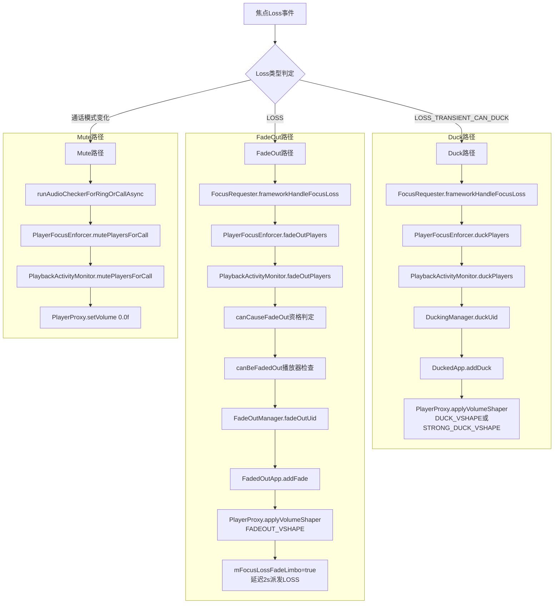
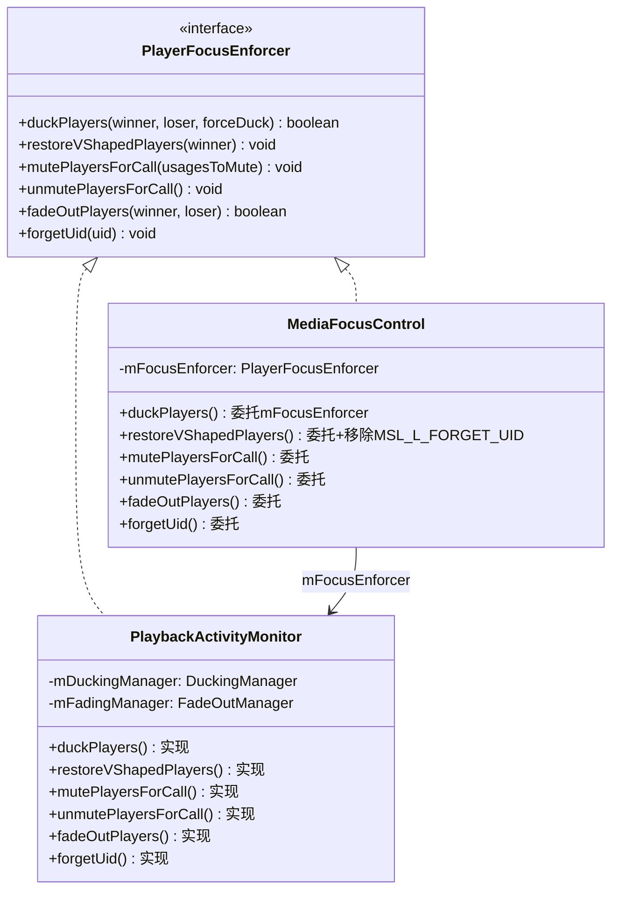
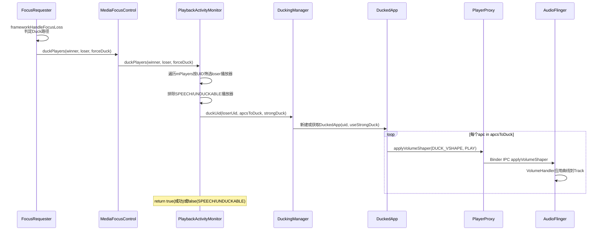
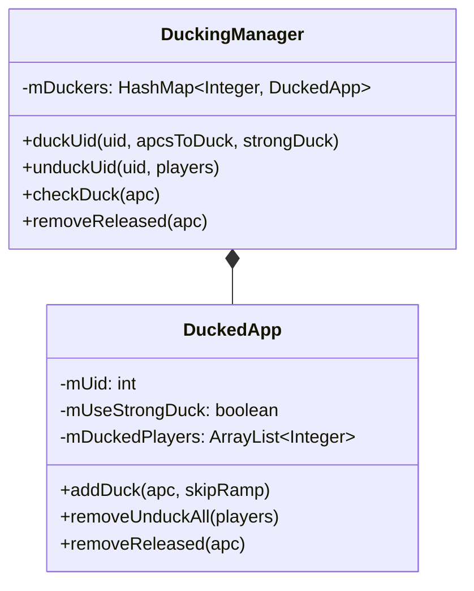
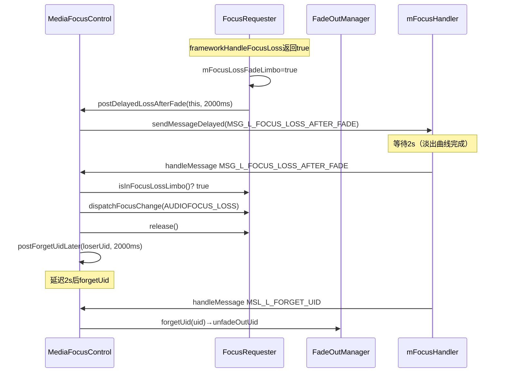
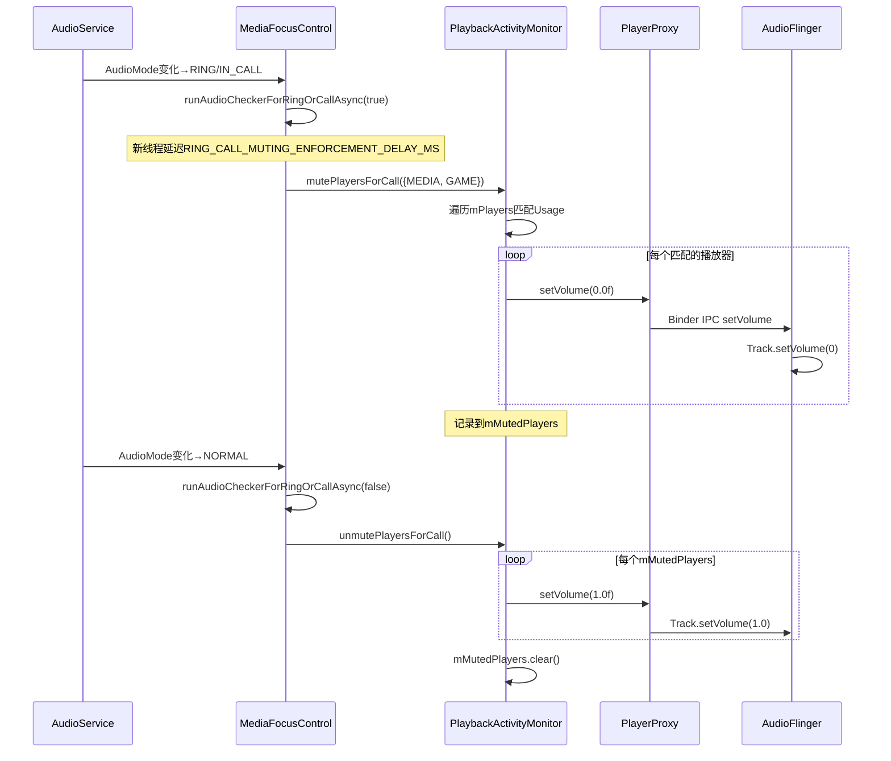
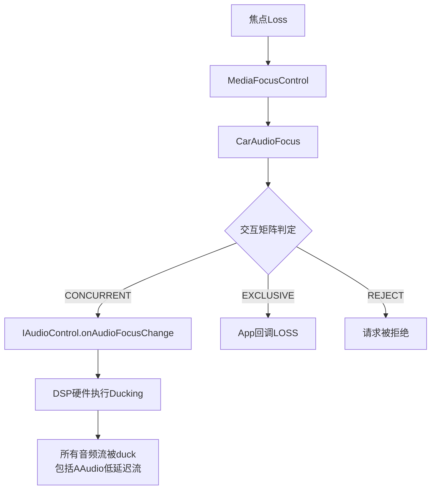
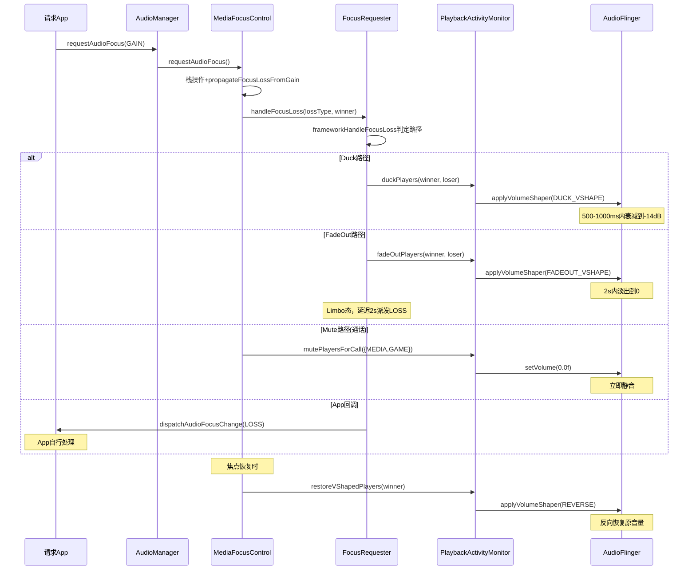

## 12.14 焦点与音量的联动机制

> [← 上一个](12_12.13_多用户焦点隔离.md) | [← 返回12章](README.md) | [返回导航](../README.md) | [下一个 →](../13_Volume_Device_Deep_Dive/README.md)

---

焦点Loss事件通过三条路径影响播放器音量：**Duck路径**（-14dB/-35dB衰减）、**FadeOut路径**（2s淡出至0）、**Mute路径**（通话静音直接置0）。从[`FocusRequester.frameworkHandleFocusLoss()`](frameworks/base/services/core/java/com/android/server/audio/FocusRequester.java:435)决策入口，经[`PlaybackActivityMonitor`](frameworks/base/services/core/java/com/android/server/audio/PlaybackActivityMonitor.java)执行器，到AudioFlinger VolumeHandler完成音量曲线应用，形成完整的框架级执行链路。

### 12.14.1 三条音量联动路径架构总览



### 12.14.2 决策入口：frameworkHandleFocusLoss()

[`frameworkHandleFocusLoss()`](frameworks/base/services/core/java/com/android/server/audio/FocusRequester.java:435)是焦点Loss到音量联动的**唯一决策入口**，由[`handleFocusLoss()`](frameworks/base/services/core/java/com/android/server/audio/FocusRequester.java:369)在焦点Loss状态变化时调用。

#### 源码解析（L435-485）

```java
// FocusRequester.java L435-485
private boolean frameworkHandleFocusLoss(int focusLoss,
        @NonNull final FocusRequester frWinner, boolean forceDuck) {
    // 规则1：同UID不干预——同一App内的焦点变化不触发框架执行
    if (frWinner.mCallingUid == this.mCallingUid) {
        return false;  // 不拦截，让App自行处理
    }

    // 路径A：Duck路径
    if (focusLoss == AudioManager.AUDIOFOCUS_LOSS_TRANSIENT_CAN_DUCK) {
        if (!MediaFocusControl.ENFORCE_DUCKING) { return false; }  // 开关关闭
        // 排除：loser声明PAUSES_ON_DUCKABLE_LOSS（App自行暂停）
        if (!forceDuck && ((mGrantFlags
                & AudioManager.AUDIOFOCUS_FLAG_PAUSES_ON_DUCKABLE_LOSS) != 0)) {
            return false;
        }
        // 排除：老SDK App（<=N_MR1），保持兼容行为
        if (!forceDuck && (MediaFocusControl.ENFORCE_DUCKING_FOR_NEW
                && this.getSdkTarget() <= MediaFocusControl.DUCKING_IN_APP_SDK_LEVEL)) {
            return false;
        }
        // 执行Duck
        return mFocusController.duckPlayers(frWinner, this, forceDuck);
    }

    // 路径B：FadeOut路径
    if (focusLoss == AudioManager.AUDIOFOCUS_LOSS) {
        if (!MediaFocusControl.ENFORCE_FADEOUT_FOR_FOCUS_LOSS) { return false; }
        boolean playersAreFaded = mFocusController.fadeOutPlayers(frWinner, this);
        if (playersAreFaded) {
            mFocusLossFadeLimbo = true;  // 进入Limbo悬停态
            mFocusController.postDelayedLossAfterFade(this,
                    FadeOutManager.FADE_OUT_DURATION_MS);  // 延迟2s派发LOSS
            return true;  // 框架已处理，不派发给App
        }
    }
    return false;  // 框架未处理，走App回调路径
}
```

#### 决策矩阵

| Loss类型 | ENFORCE开关 | 排除条件 | 执行路径 | 返回值 |
|----------|-------------|----------|----------|--------|
| LOSS_TRANSIENT_CAN_DUCK | ENFORCE_DUCKING=true | 同UID/PAUSES_ON_DUCKABLE_LOSS/老SDK | duckPlayers() | true/false |
| LOSS | ENFORCE_FADEOUT_FOR_FOCUS_LOSS=true | 同UID/无活跃播放器 | fadeOutPlayers()+Limbo | true/false |
| LOSS_TRANSIENT | 无框架执行 | - | App回调 | false |
| 其他 | - | - | App回调 | false |

### 12.14.3 PlayerFocusEnforcer接口与委托链

[`PlayerFocusEnforcer`](frameworks/base/services/core/java/com/android/server/audio/PlayerFocusEnforcer.java:21)定义了6个焦点执行方法，构成框架级焦点执行的完整接口：



**委托链路**：`FocusRequester` → `MediaFocusControl`(委托) → `PlaybackActivityMonitor`(实际执行)

[`MediaFocusControl`](frameworks/base/services/core/java/com/android/server/audio/MediaFocusControl.java:125)的委托实现中，`restoreVShapedPlayers()`（L134-141）额外移除`MSL_L_FORGET_UID`消息，避免恢复后又被延迟forgetUid回退。

### 12.14.4 VolumeShaper四种配置详解

[`PlaybackActivityMonitor`](frameworks/base/services/core/java/com/android/server/audio/PlaybackActivityMonitor.java:88)定义了四种系统级VolumeShaper配置，每种对应不同的音量曲线和用途：

#### 1. DUCK_VSHAPE（标准Duck，-14dB）

```java
// PlaybackActivityMonitor.java L88-98
private static final VolumeShaper.Configuration DUCK_VSHAPE =
    new VolumeShaper.Configuration.Builder()
        .setId(VOLUME_SHAPER_SYSTEM_DUCK_ID)
        .setCurve(new float[] { 0.f, 1.f },      // times: 0→1
            new float[] { 1.f, 0.2f })            // volumes: 1→0.2 (-14dB)
        .setOptionFlags(OPTION_FLAG_CLOCK_TIME)    // 真实时间轴
        .setDuration(getFocusRampTimeMs(           // Usage维度ramp时间
            AUDIOFOCUS_GAIN_TRANSIENT_MAY_DUCK,
            USAGE_NOTIFICATION))                   // 默认500ms
        .build();
```

**音量曲线**：t=0时vol=1.0（原音量），t=1时vol=0.2（衰减14dB）。线性插值，ramp时间由[`getFocusRampTimeMs()`](frameworks/base/services/core/java/com/android/server/audio/MediaFocusControl.java:905)决定。

#### 2. STRONG_DUCK_VSHAPE（强Duck，-35dB）

```java
// PlaybackActivityMonitor.java L102-113
private static final VolumeShaper.Configuration STRONG_DUCK_VSHAPE =
    new VolumeShaper.Configuration.Builder()
        .setId(VOLUME_SHAPER_SYSTEM_STRONG_DUCK_ID)
        .setCurve(new float[] { 0.f, 1.f },
            new float[] { 1.f, 0.017783f })       // 1→0.017783 (-35dB)
        .setOptionFlags(OPTION_FLAG_CLOCK_TIME)
        .setDuration(getFocusRampTimeMs(...))      // 同DUCK_VSHAPE
        .build();
```

**触发条件**：winner的Usage为`USAGE_ASSISTANT`（语音助手），由[`reqCausesStrongDuck()`](frameworks/base/services/core/java/com/android/server/audio/PlaybackActivityMonitor.java:810)判定。语音助手需要更深度的衰减以确保语音识别不受背景音干扰。

#### 3. FADEOUT_VSHAPE（淡出，2s三段曲线）

```java
// FadeOutManager.java L53-60
private static final VolumeShaper.Configuration FADEOUT_VSHAPE =
    new VolumeShaper.Configuration.Builder()
        .setId(VOLUME_SHAPER_SYSTEM_FADEOUT_ID)
        .setCurve(new float[]{0.f, 0.25f, 1.0f},  // times: 0→0.25→1
            new float[]{1.f, 0.65f, 0.0f})         // volumes: 1→0.65→0
        .setOptionFlags(OPTION_FLAG_CLOCK_TIME)
        .setDuration(FADE_OUT_DURATION_MS)          // 2000ms
        .build();
```

**三段曲线**：
- 0→0.25（0-500ms）：vol从1.0缓降到0.65（-3.8dB），听觉上音量轻微下降
- 0.25→1.0（500-2000ms）：vol从0.65急降至0.0（-∞dB），快速淡出至静音
- 总时长2s，先缓后急的曲线避免听觉突兀感

#### 4. MUTE_AWAIT_CONNECTION_VSHAPE（连接等待静音）

```java
// PlaybackActivityMonitor.java L122-132
private static final VolumeShaper.Configuration MUTE_AWAIT_CONNECTION_VSHAPE =
    new VolumeShaper.Configuration.Builder()
        .setId(VOLUME_SHAPER_SYSTEM_MUTE_AWAIT_CONNECTION_ID)
        .setCurve(new float[] { 0.f, 1.f },
            new float[] { 1.f, 0.f })              // 1→0 直接静音
        .setOptionFlags(OPTION_FLAG_CLOCK_TIME)
        .setDuration(UNMUTE_DURATION_MS)            // 100ms（仅用于unmute）
        .build();
```

此配置用于AudioDevice连接过渡期（如蓝牙A2DP连接中），mute时使用`PLAY_SKIP_RAMP`跳过ramp直接静音，unmute时100ms恢复。

#### VolumeShaper配置汇总表

| 配置名 | 曲线点 | 衰减量 | 时长 | 用途 |
|--------|--------|--------|------|------|
| DUCK_VSHAPE | (0,1)→(1,0.2) | -14dB | 500-1000ms | 标准Duck |
| STRONG_DUCK_VSHAPE | (0,1)→(1,0.0178) | -35dB | 500-1000ms | 语音助手强Duck |
| FADEOUT_VSHAPE | (0,1)→(0.25,0.65)→(1,0) | -∞dB | 2000ms | 焦点Loss淡出 |
| MUTE_AWAIT_VSHAPE | (0,1)→(1,0) | -∞dB | 100ms | 设备连接静音 |

#### getFocusRampTimeMs()：Usage维度ramp时间

[`getFocusRampTimeMs()`](frameworks/base/services/core/java/com/android/server/audio/MediaFocusControl.java:905)根据AudioAttributes Usage返回不同的ramp时间：

| Usage类别 | ramp时间 | 包含的Usage |
|-----------|----------|-------------|
| 媒体/游戏 | 1000ms | USAGE_MEDIA, USAGE_GAME |
| 高优先级 | 700ms | USAGE_ALARM, USAGE_NOTIFICATION_RINGTONE, USAGE_ASSISTANT, USAGE_ASSISTANCE_ACCESSIBILITY, USAGE_ASSISTANCE_NAVIGATION_GUIDANCE, USAGE_ANNOUNCEMENT |
| 通信/通知 | 500ms | USAGE_VOICE_COMMUNICATION, USAGE_NOTIFICATION, USAGE_ASSISTANCE_SONIFICATION等 |
| 紧急/安全 | 0ms | USAGE_EMERGENCY, USAGE_SAFETY, USAGE_UNKNOWN |

### 12.14.5 Duck路径完整执行链

Duck路径是焦点系统最频繁使用的音量联动路径，当loser收到`LOSS_TRANSIENT_CAN_DUCK`时触发。

#### 执行链时序图



#### duckPlayers()源码解析（L762-808）

```java
// PlaybackActivityMonitor.java L762-808
public boolean duckPlayers(FocusRequester winner, FocusRequester loser, boolean forceDuck) {
    synchronized (mPlayerLock) {
        if (mPlayers.isEmpty()) { return true; }
        final Iterator<AudioPlaybackConfiguration> apcIterator = mPlayers.values().iterator();
        final ArrayList<AudioPlaybackConfiguration> apcsToDuck = new ArrayList<>();
        while (apcIterator.hasNext()) {
            final AudioPlaybackConfiguration apc = apcIterator.next();
            // UID匹配：仅duck loser同UID的活跃播放器
            if (!winner.hasSameUid(apc.getClientUid())
                    && loser.hasSameUid(apc.getClientUid())
                    && apc.getPlayerState() == PLAYER_STATE_STARTED) {
                // 排除1：SPEECH内容类型（ducking使语音不可理解）
                if (!forceDuck && (apc.getAudioAttributes().getContentType()
                        == CONTENT_TYPE_SPEECH)) {
                    return false;  // 返回false→框架不处理，交由App
                }
                // 排除2：UNDUCKABLE播放器类型（AAudio/JamSoundPool）
                if (ArrayUtils.contains(UNDUCKABLE_PLAYER_TYPES, apc.getPlayerType())) {
                    return false;
                }
                apcsToDuck.add(apc);
            }
        }
        // 委托DuckingManager执行（即使apcsToDuck为空也标记UID为ducked）
        mDuckingManager.duckUid(loser.getClientUid(), apcsToDuck,
                reqCausesStrongDuck(winner));
    }
    return true;
}
```

**关键设计**：
1. **UID维度隔离**：只duck loser UID的播放器，winner UID不受影响
2. **SPEECH豁免**：语音内容duck后不可理解，返回false让App自行处理
3. **空列表也标记**：即使当前无活跃播放器，也标记UID为ducked，后续新播放器通过`checkDuck()`自动duck
4. **强Duck判定**：[`reqCausesStrongDuck()`](frameworks/base/services/core/java/com/android/server/audio/PlaybackActivityMonitor.java:810)检查winner是否为`USAGE_ASSISTANT`

#### DuckingManager内部类（L1093-1213）



**DuckedApp.addDuck()**（L1167-1183）核心执行：

```java
// PlaybackActivityMonitor.java L1167-1183
void addDuck(AudioPlaybackConfiguration apc, boolean skipRamp) {
    final int piid = apc.getPlayerInterfaceId();
    if (mDuckedPlayers.contains(piid)) { return; }  // 防重复
    apc.getPlayerProxy().applyVolumeShaper(
        mUseStrongDuck ? STRONG_DUCK_VSHAPE : DUCK_VSHAPE,  // 选择曲线
        skipRamp ? PLAY_SKIP_RAMP : PLAY_CREATE_IF_NEEDED);  // skipRamp: 跳到曲线末端
    mDuckedPlayers.add(piid);
}
```

**skipRamp语义**：
- `skipRamp=false`：首次duck，从曲线起点开始ramp（平滑衰减）
- `skipRamp=true`：`checkDuck()`发现新播放器，直接跳到曲线末端（立即duck到目标音量）

#### checkDuck()：新播放器自动duck

当被duck UID的新播放器开始播放时，[`PlaybackActivityMonitor.playerEvent()`](frameworks/base/services/core/java/com/android/server/audio/PlaybackActivityMonitor.java)检测到`PLAYER_STATE_STARTED`事件，调用`DuckingManager.checkDuck(apc)`（L1118-1126），自动对新播放器应用duck，`skipRamp=true`。

### 12.14.6 FadeOut路径完整执行链

FadeOut路径在loser收到`AUDIOFOCUS_LOSS`（永久Loss）时触发，先淡出2s再派发Loss给App。

#### fadeOutPlayers()源码解析（L904-951）

```java
// PlaybackActivityMonitor.java L904-951
public boolean fadeOutPlayers(FocusRequester winner, FocusRequester loser) {
    boolean loserHasActivePlayers = false;
    synchronized (mPlayerLock) {
        if (mPlayers.isEmpty()) { return false; }
        // 资格判定1：winner能否触发fadeout
        if (!FadeOutManager.canCauseFadeOut(winner, loser)) { return false; }
        final Iterator<AudioPlaybackConfiguration> apcIterator = mPlayers.values().iterator();
        final ArrayList<AudioPlaybackConfiguration> apcsToFadeOut = new ArrayList<>();
        while (apcIterator.hasNext()) {
            final AudioPlaybackConfiguration apc = apcIterator.next();
            if (!winner.hasSameUid(apc.getClientUid())
                    && loser.hasSameUid(apc.getClientUid())
                    && apc.getPlayerState() == PLAYER_STATE_STARTED) {
                // 资格判定2：播放器是否可被fadeout
                if (!FadeOutManager.canBeFadedOut(apc)) { return false; }
                loserHasActivePlayers = true;
                apcsToFadeOut.add(apc);
            }
        }
        if (loserHasActivePlayers) {
            mFadingManager.fadeOutUid(loser.getClientUid(), apcsToFadeOut);
        }
    }
    return loserHasActivePlayers;
}
```

#### canCauseFadeOut()：请求者资格判定（L93-106）

```java
// FadeOutManager.java L93-106
static boolean canCauseFadeOut(FocusRequester requester, FocusRequester loser) {
    // 语音焦点不触发fadeout（语音不能被淡出打断）
    if (requester.getAudioAttributes().getContentType() == CONTENT_TYPE_SPEECH) {
        return false;
    }
    // loser声明PAUSES_ON_DUCKABLE_LOSS→App自行暂停，不需要fadeout
    if ((loser.getGrantFlags() & AUDIOFOCUS_FLAG_PAUSES_ON_DUCKABLE_LOSS) != 0) {
        return false;
    }
    return true;
}
```

#### canBeFadedOut()：播放器资格判定（L113-133）

```java
// FadeOutManager.java L113-133
static boolean canBeFadedOut(AudioPlaybackConfiguration apc) {
    // 检查1：播放器类型（AAudio/JamSoundPool不支持VolumeShaper）
    if (ArrayUtils.contains(UNFADEABLE_PLAYER_TYPES, apc.getPlayerType())) { return false; }
    // 检查2：内容类型（SPEECH不能被淡出）
    if (ArrayUtils.contains(UNFADEABLE_CONTENT_TYPES, apc.getAudioAttributes().getContentType())) {
        return false;
    }
    // 检查3：Usage（仅MEDIA和GAME可被淡出）
    if (!ArrayUtils.contains(FADEABLE_USAGES, apc.getAudioAttributes().getUsage())) {
        return false;
    }
    return true;
}
```

#### FadeOut资格矩阵

| 条件 | 检查对象 | 通过条件 | 失败后果 |
|------|----------|----------|----------|
| canCauseFadeOut | winner请求者 | contentType≠SPEECH | return false，不fadeout |
| canCauseFadeOut | loser失焦者 | 无PAUSES_ON_DUCKABLE_LOSS | return false，App自行暂停 |
| canBeFadedOut | 播放器 | playerType∉{AAudio,JamSoundPool} | return false，整个fadeout取消 |
| canBeFadedOut | 播放器 | contentType≠SPEECH | return false |
| canBeFadedOut | 播放器 | usage∈{MEDIA,GAME} | return false |

**注意**：`canBeFadedOut()`返回false会导致**整个fadeOutPlayers()返回false**，即一个不可淡出的播放器会阻止同UID所有播放器的淡出。

#### FadeOutManager.fadeOutUid()与FadedOutApp（L150-159, L216-288）

```java
// FadeOutManager.java L150-159
synchronized void fadeOutUid(int uid, ArrayList<AudioPlaybackConfiguration> players) {
    if (!mFadedApps.containsKey(uid)) {
        mFadedApps.put(uid, new FadedOutApp(uid));
    }
    final FadedOutApp fa = mFadedApps.get(uid);
    for (AudioPlaybackConfiguration apc : players) {
        fa.addFade(apc, false /*skipRamp*/);  // 首次fade，完整曲线
    }
}
```

**FadedOutApp.addFade()**（L239-258）：

```java
void addFade(AudioPlaybackConfiguration apc, boolean skipRamp) {
    final int piid = apc.getPlayerInterfaceId();
    if (mFadedPlayers.contains(piid)) { return; }  // 防重复
    apc.getPlayerProxy().applyVolumeShaper(
        FADEOUT_VSHAPE,
        skipRamp ? PLAY_SKIP_RAMP : PLAY_CREATE_IF_NEEDED);
    mFadedPlayers.add(piid);
}
```

#### Limbo状态与延迟LOSS派发

当`fadeOutPlayers()`返回true后，`frameworkHandleFocusLoss()`执行：

```java
// FocusRequester.java L473-480
mFocusLossFadeLimbo = true;  // 标记为Limbo悬停态
mFocusController.postDelayedLossAfterFade(this,
        FadeOutManager.FADE_OUT_DURATION_MS);  // 延迟2000ms
```

**Limbo时序**：



**关键**：Limbo期间（2s），loser不收到任何焦点回调，播放器被淡出。2s后派发`AUDIOFOCUS_LOSS`，App收到Loss后可自行停止播放。再过2s执行`forgetUid()`清理FadeOutManager记录。

### 12.14.7 Mute路径完整执行链

Mute路径独立于焦点Loss传播，由**AudioMode变化**（RING/IN_CALL）触发，直接将指定Usage的播放器音量置0。

#### 触发入口：runAudioCheckerForRingOrCallAsync()

```java
// MediaFocusControl.java L1192-1213
private void runAudioCheckerForRingOrCallAsync(final boolean enteringRingOrCall) {
    new Thread() {
        public void run() {
            if (enteringRingOrCall) {
                try {
                    Thread.sleep(RING_CALL_MUTING_ENFORCEMENT_DELAY_MS);  // 延迟执行
                } catch (InterruptedException e) {}
            }
            synchronized (mAudioFocusLock) {
                if (mRingOrCallActive) {
                    mFocusEnforcer.mutePlayersForCall(USAGES_TO_MUTE_IN_RING_OR_CALL);
                } else {
                    mFocusEnforcer.unmutePlayersForCall();
                }
            }
        }
    }.start();
}
```

**关键设计**：
1. **异步执行**：在新线程中执行，避免持有mAudioFocusLock阻塞焦点操作
2. **延迟mute**：进入RING/CALL模式时先等待`RING_CALL_MUTING_ENFORCEMENT_DELAY_MS`，给铃声自身播放时间
3. **二次检查**：延迟后重新检查`mRingOrCallActive`，可能模式已恢复

#### 静音目标：USAGES_TO_MUTE_IN_RING_OR_CALL

```java
// MediaFocusControl.java L896-897
private final static int[] USAGES_TO_MUTE_IN_RING_OR_CALL =
    { AudioAttributes.USAGE_MEDIA, AudioAttributes.USAGE_GAME };
```

通话/响铃期间仅静音`USAGE_MEDIA`和`USAGE_GAME`，其他Usage（通知、导航等）不受影响。

#### mutePlayersForCall()源码解析（L831-867）

```java
// PlaybackActivityMonitor.java L831-867
public void mutePlayersForCall(int[] usagesToMute) {
    synchronized (mPlayerLock) {
        final Set<Integer> piidSet = mPlayers.keySet();
        final Iterator<Integer> piidIterator = piidSet.iterator();
        while (piidIterator.hasNext()) {
            final Integer piid = piidIterator.next();
            final AudioPlaybackConfiguration apc = mPlayers.get(piid);
            if (apc == null) { continue; }
            final int playerUsage = apc.getAudioAttributes().getUsage();
            boolean mute = false;
            for (int usageToMute : usagesToMute) {
                if (playerUsage == usageToMute) { mute = true; break; }
            }
            if (mute) {
                apc.getPlayerProxy().setVolume(0.0f);  // 直接置0，无ramp
                mMutedPlayers.add(piid);  // 记录被mute的播放器
            }
        }
    }
}
```

**与Duck/FadeOut的区别**：Mute使用`setVolume(0.0f)`直接置0，**不使用VolumeShaper**，无ramp曲线，立即静音。

#### unmutePlayersForCall()源码解析（L869-893）

```java
// PlaybackActivityMonitor.java L869-893
public void unmutePlayersForCall() {
    synchronized (mPlayerLock) {
        if (mMutedPlayers.isEmpty()) { return; }
        for (int piid : mMutedPlayers) {
            final AudioPlaybackConfiguration apc = mPlayers.get(piid);
            if (apc != null) {
                apc.getPlayerProxy().setVolume(1.0f);  // 直接恢复1.0
            }
        }
        mMutedPlayers.clear();
    }
}
```

#### Mute路径时序图



### 12.14.8 焦点恢复时音量恢复链路

当焦点恢复（GAIN/abandon）时，需要逆向恢复所有被duck/fadeout/mute修改的音量。

#### restoreVShapedPlayers()（L822-828）

```java
// PlaybackActivityMonitor.java L822-828
public void restoreVShapedPlayers(FocusRequester winner) {
    synchronized (mPlayerLock) {
        mDuckingManager.unduckUid(winner.getClientUid(), mPlayers);
        mFadingManager.unfadeOutUid(winner.getClientUid(), mPlayers);
    }
}
```

**MediaFocusControl层额外处理**（L134-141）：

```java
// MediaFocusControl.java L134-141
public void restoreVShapedPlayers(FocusRequester winner) {
    mFocusEnforcer.restoreVShapedPlayers(winner);
    // 移除延迟的MSL_L_FORGET_UID消息，避免恢复后又被forget
    mFocusHandler.removeEqualMessages(MSL_L_FORGET_UID,
            new ForgetFadeUidInfo(winner.getClientUid()));
}
```

#### Duck恢复：DuckedApp.removeUnduckAll()（L1185-1207）

```java
void removeUnduckAll(HashMap<Integer, AudioPlaybackConfiguration> players) {
    for (int piid : mDuckedPlayers) {
        final AudioPlaybackConfiguration apc = players.get(piid);
        if (apc != null) {
            apc.getPlayerProxy().applyVolumeShaper(
                mUseStrongDuck ? STRONG_DUCK_ID : DUCK_ID,  // 同ID的Configuration
                VolumeShaper.Operation.REVERSE);             // 反向操作
        }
    }
    mDuckedPlayers.clear();
}
```

**REVERSE操作**：VolumeShaper的`REVERSE`操作从当前曲线位置反向播放，音量从duck目标值平滑恢复到1.0。使用同ID的Configuration（`DUCK_ID`/`STRONG_DUCK_ID`）确保匹配正确的VolumeShaper实例。

#### FadeOut恢复：FadedOutApp.removeUnfadeAll()（L260-283）

```java
void removeUnfadeAll(HashMap<Integer, AudioPlaybackConfiguration> players) {
    for (int piid : mFadedPlayers) {
        final AudioPlaybackConfiguration apc = players.get(piid);
        if (apc != null) {
            apc.getPlayerProxy().applyVolumeShaper(
                FADEOUT_VSHAPE,
                VolumeShaper.Operation.REVERSE);  // 反向淡入
        }
    }
    mFadedPlayers.clear();
}
```

**FadeIn曲线**：REVERSE操作将FADEOUT_VSHAPE反向播放——从0→0.65→1.0，先急后缓，2s内恢复原音量。

#### forgetUid()与延迟Forget机制

```java
// PlaybackActivityMonitor.java L954-960
public void forgetUid(int uid) {
    final HashMap<Integer, AudioPlaybackConfiguration> players;
    synchronized (mPlayerLock) {
        players = (HashMap<Integer, AudioPlaybackConfiguration>) mPlayers.clone();
    }
    mFadingManager.unfadeOutUid(uid, players);
}
```

`forgetUid()`由`MSL_L_FORGET_UID`消息触发（延迟`DELAY_FADE_IN_OFFENDERS_MS=2000ms`），在Limbo LOSS派发后2s执行。其目的是在"违规App"（未及时停止播放的App）场景中，延迟恢复淡出效果，给予App额外时间处理Loss。

### 12.14.9 VolumeShaper在AudioFlinger中的执行

`PlayerProxy.applyVolumeShaper()`通过Binder IPC传递到AudioFlinger层执行：


**执行机制**：
1. **VolumeHandler**：AudioFlinger的`PlaybackThread`为每个Track维护一个`VolumeHandler`实例
2. **曲线插值**：`VolumeHandler`在每次`mix()`操作中，根据当前时间在VolumeShaper曲线上插值计算音量乘数
3. **叠加乘数**：VolumeShaper的音量乘数与Track的原音量相乘，**不修改Track的volume字段本身**
4. **REVERSE操作**：反向播放曲线，音量从当前值恢复到1.0
5. **PLAY_SKIP_RAMP**：`setXOffset(1.0f)`跳到曲线末端，立即应用目标音量

**VolumeShaper生命周期**：
- PLAY：从t=0开始正向播放曲线
- REVERSE：从当前位置反向播放
- STOP：停止曲线，保持当前音量
- REMOVE：移除VolumeShaper实例

### 12.14.10 AAOS路径：AudioControl HAL执行

AAOS车载系统中，焦点Loss可通过另一条路径执行——**DSP硬件级Ducking**：



**AAOS DSP Ducking优势**：

| 特性 | 框架VolumeShaper | DSP Ducking |
|------|------------------|-------------|
| 延迟 | ramp时间(500-1000ms) | 近零延迟 |
| 适用范围 | 仅支持VolumeShaper的播放器 | 所有音频流（含AAudio） |
| 音量精度 | 曲线插值精度 | 硬件级精度 |
| 实现复杂度 | 框架Java层 | HAL+DSP固件 |
| 独立于App | 是 | 是 |

**CarAudioFocus交互矩阵**决定焦点交互结果：
- **CONCURRENT**：两应用同时播放，通过`IAudioControl.onAudioFocusChange()`通知HAL执行DSP ducking
- **EXCLUSIVE**：新焦点独占，旧焦点收到LOSS回调
- **REJECT**：新焦点请求被拒绝

### 12.14.11 完整焦点Loss→音量联动时序



### 12.14.12 三条路径对比总结

| 维度 | Duck路径 | FadeOut路径 | Mute路径 |
|------|----------|-------------|----------|
| **触发条件** | LOSS_TRANSIENT_CAN_DUCK | LOSS(永久) | AudioMode=RING/IN_CALL |
| **衰减量** | -14dB或-35dB | -∞dB(→0) | -∞dB(=0) |
| **衰减方式** | VolumeShaper曲线 | VolumeShaper三段曲线 | setVolume直接置0 |
| **时间** | 500-1000ms ramp | 2000ms淡出 | 立即 |
| **恢复方式** | REVERSE操作 | REVERSE操作(2s淡入) | setVolume(1.0f) |
| **执行器** | DuckingManager | FadeOutManager | mMutedPlayers |
| **数据结构** | HashMap<UID, DuckedApp> | HashMap<UID, FadedOutApp> | HashSet<piid> |
| **SPEECH豁免** | 是(返回false) | 是(canBeFadedOut) | 否(Usage匹配) |
| **UNDUCKABLE豁免** | 是(AAudio/JamSoundPool) | 是(UNFADEABLE_PLAYER_TYPES) | 否 |
| **App通知** | 不通知(框架处理) | 延迟2s通知(Limbo) | 不通知 |
| **AAOS DSP路径** | 可选 | 无 | 无 |
| **ENFORCE开关** | ENFORCE_DUCKING | ENFORCE_FADEOUT_FOR_FOCUS_LOSS | ENFORCE_MUTING_FOR_RING_OR_CALL |

---

[← 上一个](12_12.13_多用户焦点隔离.md) | [← 返回12章](README.md) | [返回导航](../README.md) | [下一个 →](../13_Volume_Device_Deep_Dive/README.md)