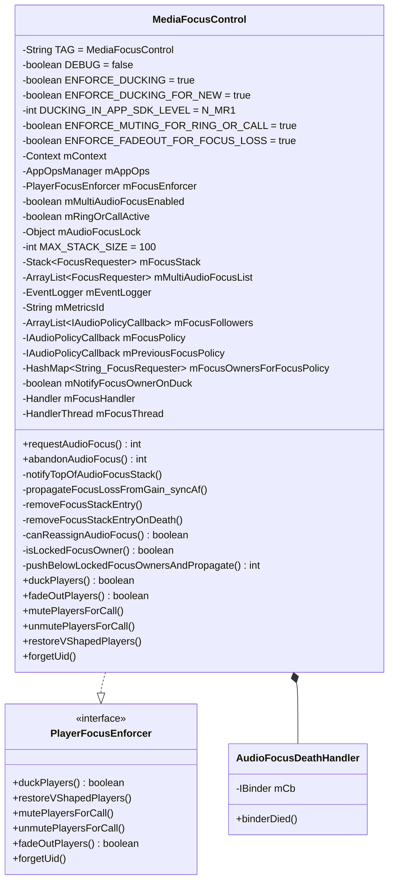
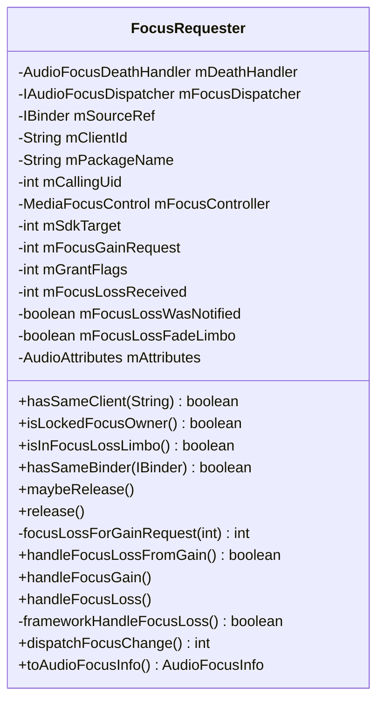
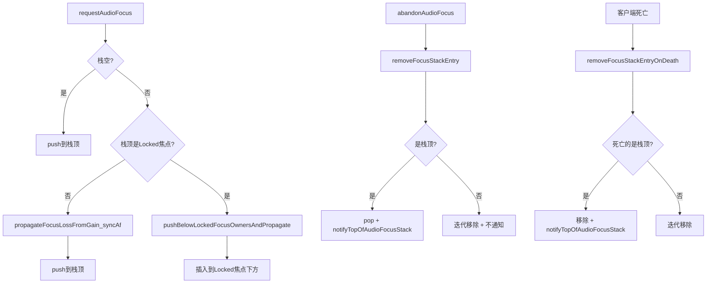
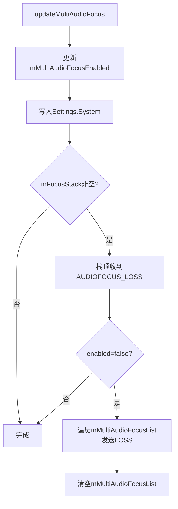
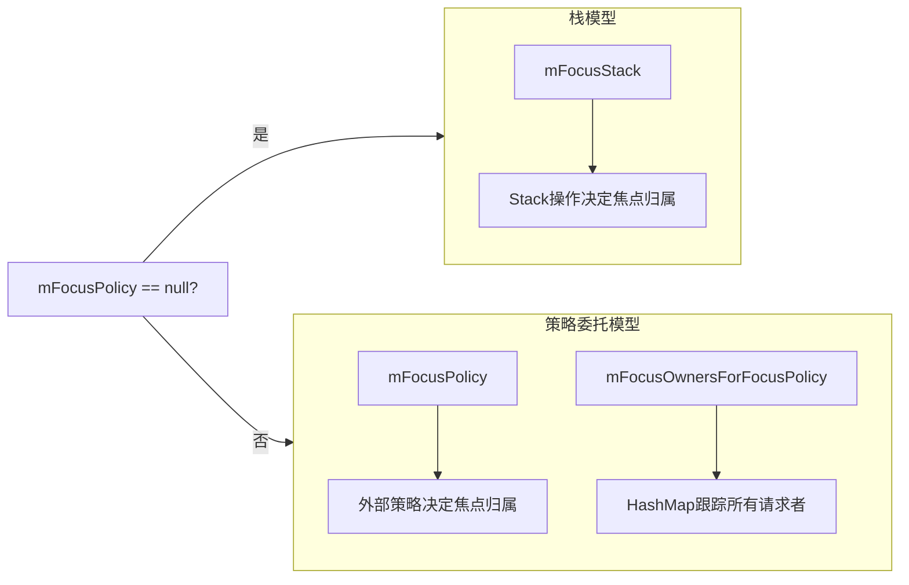
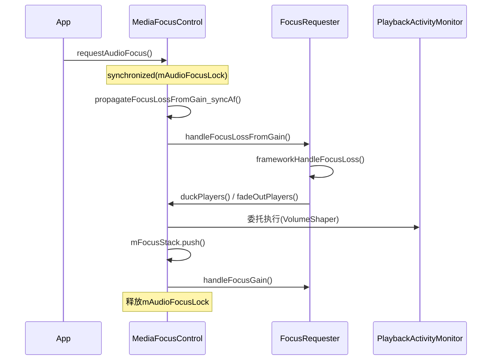
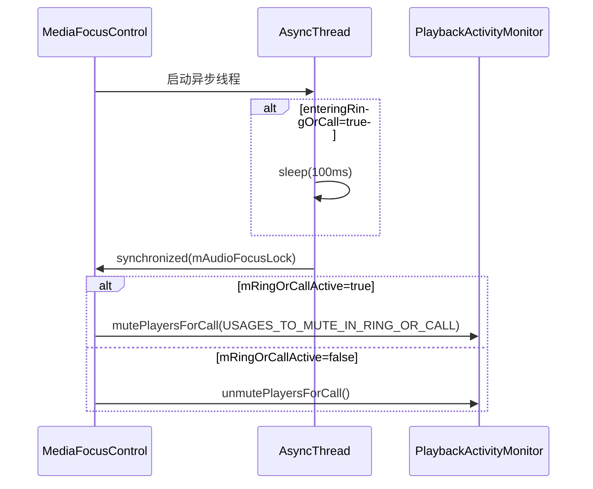
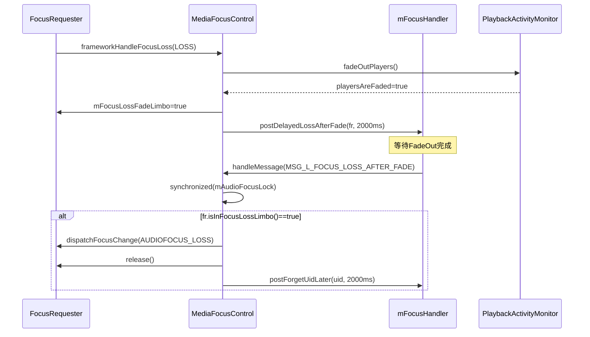
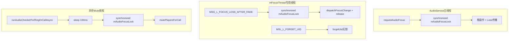

## 12.1 Focus栈模型与核心数据结构

> [← 上一个](../11_Vendor_Layer/README.md) | [← 返回12章](README.md) | [返回导航](../README.md) | [下一个 →](12_12.2_完整焦点状态机含Fade_Limbo状态.md)

---

## 12.1.1 MediaFocusControl类完整结构

[`MediaFocusControl`](frameworks/base/services/core/java/com/android/server/audio/MediaFocusControl.java:61)是Android音频焦点系统的核心控制器，实现[`PlayerFocusEnforcer`](frameworks/base/services/core/java/com/android/server/audio/MediaFocusControl.java:61)接口，负责焦点栈的维护、焦点请求/释放的调度、以及框架级焦点执行（Duck/Mute/Fade）的委托。



### 核心常量语义

| 常量 | 值 | 含义 |
|------|-----|------|
| [`ENFORCE_DUCKING`](frameworks/base/services/core/java/com/android/server/audio/MediaFocusControl.java:70) | `true` | 框架自行执行Duck，不通知应用LOSS_TRANSIENT_CAN_DUCK |
| [`ENFORCE_DUCKING_FOR_NEW`](frameworks/base/services/core/java/com/android/server/audio/MediaFocusControl.java:75) | `true` | 仅对新SDK目标应用执行框架Duck |
| [`DUCKING_IN_APP_SDK_LEVEL`](frameworks/base/services/core/java/com/android/server/audio/MediaFocusControl.java:81) | `N_MR1(25)` | SDK≤25的旧应用仍由应用自行处理Duck |
| [`ENFORCE_MUTING_FOR_RING_OR_CALL`](frameworks/base/services/core/java/com/android/server/audio/MediaFocusControl.java:86) | `true` | 来电/通话时框架自动Mute媒体和游戏 |
| [`ENFORCE_FADEOUT_FOR_FOCUS_LOSS`](frameworks/base/services/core/java/com/android/server/audio/MediaFocusControl.java:92) | `true` | 非瞬态焦点丢失时框架执行FadeOut |
| [`MAX_STACK_SIZE`](frameworks/base/services/core/java/com/android/server/audio/MediaFocusControl.java:172) | `100` | 焦点栈最大容量，防止OOM |

---

## 12.1.2 FocusRequester类完整结构

[`FocusRequester`](frameworks/base/services/core/java/com/android/server/audio/FocusRequester.java:39)是焦点栈中的基本元素，封装了单个焦点请求者的全部信息，包括请求参数、当前Loss状态、IPC回调通道和生命周期管理。



### 字段详解

| 字段 | 类型 | 初始值 | 生命周期 | 含义 |
|------|------|--------|----------|------|
| [`mFocusGainRequest`](frameworks/base/services/core/java/com/android/server/audio/FocusRequester.java:57) | `int` | 构造参数 | 永久(final) | 请求的焦点Gain类型(GAIN/GAIN_TRANSIENT/GAIN_TRANSIENT_MAY_DUCK/GAIN_TRANSIENT_EXCLUSIVE) |
| [`mGrantFlags`](frameworks/base/services/core/java/com/android/server/audio/FocusRequester.java:62) | `int` | 构造参数 | 永久(final) | 授予标志位(FLAG_DELAY_OK/FLAG_PAUSES_ON_DUCKABLE_LOSS/FLAG_LOCK) |
| [`mFocusLossReceived`](frameworks/base/services/core/java/com/android/server/audio/FocusRequester.java:67) | `int` | `AUDIOFOCUS_NONE` | 动态 | 当前收到的Loss类型，随焦点竞争实时更新 |
| [`mFocusLossWasNotified`](frameworks/base/services/core/java/com/android/server/audio/FocusRequester.java:71) | `boolean` | `true` | 动态 | Loss是否已通知给应用，用于判断是否需要重新dispatch |
| [`mFocusLossFadeLimbo`](frameworks/base/services/core/java/com/android/server/audio/FocusRequester.java:76) | `boolean` | `false` | 动态 | FadeOut悬停态：已失去焦点但延迟通知，等待Fade完成 |
| [`mAttributes`](frameworks/base/services/core/java/com/android/server/audio/FocusRequester.java:80) | `AudioAttributes` | 构造参数 | 永久(final) | 关联的音频属性(Usage/ContentType) |
| [`mClientId`](frameworks/base/services/core/java/com/android/server/audio/FocusRequester.java:48) | `String` | 构造参数 | 永久(final) | 唯一客户端标识，用于栈中查找和去重 |
| [`mFocusDispatcher`](frameworks/base/services/core/java/com/android/server/audio/FocusRequester.java:46) | `IAudioFocusDispatcher` | 构造参数 | release时置null | IPC回调通道，通知应用焦点变化 |
| [`mDeathHandler`](frameworks/base/services/core/java/com/android/server/audio/FocusRequester.java:45) | `AudioFocusDeathHandler` | 构造参数 | release时置null | 客户端死亡监控，触发栈清理 |

---

## 12.1.3 焦点栈模型详解

### 栈数据结构

焦点栈[`mFocusStack`](frameworks/base/services/core/java/com/android/server/audio/MediaFocusControl.java:327)是Java `Stack<FocusRequester>`，遵循后进先出(LIFO)语义：

- **栈顶(peek)**：当前焦点持有者，拥有最高优先级
- **栈底**：最早入栈的请求者，优先级最低
- **遍历方向**：从栈顶到栈底，优先级递减

```
mFocusStack (Stack<FocusRequester>)
┌──────────────────────────────┐
│  栈顶 → FocusRequester_N     │ ← 当前焦点持有者(最高优先级)
│         FocusRequester_N-1   │
│         ...                  │
│         FocusRequester_2     │
│  栈底 → FocusRequester_1     │ ← 最早入栈(最低优先级)
└──────────────────────────────┘
```

### 栈操作核心流程



### MAX_STACK_SIZE保护机制

[`MAX_STACK_SIZE = 100`](frameworks/base/services/core/java/com/android/server/audio/MediaFocusControl.java:172)是焦点栈的硬上限，在[`requestAudioFocus()`](frameworks/base/services/core/java/com/android/server/audio/MediaFocusControl.java:952)中检查：

- 当`mFocusStack.size() >= MAX_STACK_SIZE`时，新请求直接返回`AUDIOFOCUS_REQUEST_FAILED`
- 防止恶意应用通过大量焦点请求导致AudioService进程OOM
- 正常场景下栈深度极少超过5-10个条目

### 栈顶语义与焦点重分配

栈顶拥有`AUDIOFOCUS_GAIN`语义。当栈顶变化时，[`notifyTopOfAudioFocusStack()`](frameworks/base/services/core/java/com/android/server/audio/MediaFocusControl.java:273)负责通知新栈顶获得焦点：

```java
// L273-288: 栈顶通知逻辑
private void notifyTopOfAudioFocusStack() {
    if (!mFocusStack.empty()) {
        if (canReassignAudioFocus()) {          // 检查是否可重分配
            mFocusStack.peek().handleFocusGain(AUDIOFOCUS_GAIN);
        }
    }
    // 多焦点模式：通知mMultiAudioFocusList中的Locked焦点持有者
    if (mMultiAudioFocusEnabled && !mMultiAudioFocusList.isEmpty()) {
        for (FocusRequester multifr : mMultiAudioFocusList) {
            if (isLockedFocusOwner(multifr)) {
                multifr.handleFocusGain(AUDIOFOCUS_GAIN);
            }
        }
    }
}
```

关键点：`canReassignAudioFocus()`检查栈顶是否为Locked焦点持有者，若是则不通知Gain（焦点被锁定，新请求需等待）。

---

## 12.1.4 核心数据结构详解

### MediaFocusControl核心字段

| 字段 | 类型 | 初始值 | 保护锁 | 含义 |
|------|------|--------|--------|------|
| [`mFocusStack`](frameworks/base/services/core/java/com/android/server/audio/MediaFocusControl.java:327) | `Stack<FocusRequester>` | `new Stack()` | `mAudioFocusLock` | 焦点栈，核心数据结构 |
| [`mMultiAudioFocusList`](frameworks/base/services/core/java/com/android/server/audio/MediaFocusControl.java:329) | `ArrayList<FocusRequester>` | `new ArrayList()` | `mAudioFocusLock` | 多焦点模式列表 |
| [`mAudioFocusLock`](frameworks/base/services/core/java/com/android/server/audio/MediaFocusControl.java:167) | `Object` | `new Object()` | — | 全局焦点同步锁 |
| [`mFocusEnforcer`](frameworks/base/services/core/java/com/android/server/audio/MediaFocusControl.java:96) | `PlayerFocusEnforcer` | 构造参数 | — | 实际执行Duck/Mute/Fade的委托对象(PlaybackActivityMonitor) |
| [`mRingOrCallActive`](frameworks/base/services/core/java/com/android/server/audio/MediaFocusControl.java:99) | `boolean` | `false` | `mAudioFocusLock` | 来电/通话状态标记 |
| [`mNotifyFocusOwnerOnDuck`](frameworks/base/services/core/java/com/android/server/audio/MediaFocusControl.java:604) | `boolean` | `true` | — | 是否在Duck Loss时通知焦点持有者 |
| [`mEventLogger`](frameworks/base/services/core/java/com/android/server/audio/MediaFocusControl.java:174) | `EventLogger` | `new EventLogger(50)` | — | 事件日志，保留最近50条焦点事件 |

### 焦点类型常量体系（AudioManager）

| 常量 | 值 | 语义 |
|------|-----|------|
| `AUDIOFOCUS_NONE` | `0` | 无焦点状态 |
| `AUDIOFOCUS_GAIN` | `1` | 永久焦点获取 |
| `AUDIOFOCUS_GAIN_TRANSIENT` | `2` | 瞬态焦点获取 |
| `AUDIOFOCUS_GAIN_TRANSIENT_MAY_DUCK` | `3` | 瞬态焦点获取，允许其他Duck |
| `AUDIOFOCUS_GAIN_TRANSIENT_EXCLUSIVE` | `4` | 瞬态独占焦点获取 |
| `AUDIOFOCUS_LOSS` | `-1` | 永久焦点丢失 |
| `AUDIOFOCUS_LOSS_TRANSIENT` | `-2` | 瞬态焦点丢失 |
| `AUDIOFOCUS_LOSS_TRANSIENT_CAN_DUCK` | `-3` | 瞬态焦点丢失，可Duck |

### 焦点请求标志位

| 标志 | 值 | 语义 |
|------|-----|------|
| `FLAG_DELAY_OK` | `0x1` | 允许延迟授予（Locked焦点时入栈等待） |
| `FLAG_PAUSES_ON_DUCKABLE_LOSS` | `0x2` | Duck Loss时选择暂停而非Duck |
| `FLAG_LOCK` | `0x4` | 锁定焦点，阻止后续请求抢占 |
| `FLAG_TEST` | `0x8` | 测试标志 |

### 焦点请求返回码

| 返回码 | 值 | 语义 |
|--------|-----|------|
| `REQUEST_FAILED` | `0` | 请求失败 |
| `REQUEST_GRANTED` | `1` | 请求立即授予 |
| `REQUEST_DELAYED` | `2` | 请求延迟授予（Locked焦点存在） |
| `REQUEST_WAITING_FOR_EXT_POLICY` | `100` | 等待外部焦点策略决策 |

---

## 12.1.5 多焦点模式mMultiAudioFocusList详解

[`mMultiAudioFocusList`](frameworks/base/services/core/java/com/android/server/audio/MediaFocusControl.java:329)是AAOS多音频焦点功能的核心数据结构，允许多个应用同时持有焦点。

### 启用条件

- [`mMultiAudioFocusEnabled`](frameworks/base/services/core/java/com/android/server/audio/MediaFocusControl.java:97)由`Settings.System.MULTI_AUDIO_FOCUS_ENABLED`控制
- 构造函数中从Settings读取初始值
- 可通过[`updateMultiAudioFocus()`](frameworks/base/services/core/java/com/android/server/audio/MediaFocusControl.java:1215)动态切换

### 数据结构特点

| 特性 | 说明 |
|------|------|
| 类型 | `ArrayList<FocusRequester>` |
| 与mFocusStack关系 | 并行存在，多焦点模式下两者同时维护 |
| 入栈条件 | 请求GAIN_TRANSIENT_MAY_DUCK类型焦点时可能入多焦点列表 |
| Locked焦点处理 | 多焦点列表中的Locked持有者也会收到`handleFocusGain`通知 |
| 清理时机 | 客户端死亡/abandon/多焦点模式关闭时清理 |

### 多焦点模式切换流程



---

## 12.1.6 外部焦点策略数据结构

当系统注册了外部焦点策略（如AAOS CarAudioPolicy）时，焦点管理从栈模型切换为策略委托模型，核心数据结构随之改变。

### 数据结构一览

| 字段 | 类型 | 保护锁 | 含义 |
|------|------|--------|------|
| [`mFocusPolicy`](frameworks/base/services/core/java/com/android/server/audio/MediaFocusControl.java:651) | `IAudioPolicyCallback` | `mAudioFocusLock` | 当前外部焦点策略，null表示使用内置栈模型 |
| [`mPreviousFocusPolicy`](frameworks/base/services/core/java/com/android/server/audio/MediaFocusControl.java:657) | `IAudioPolicyCallback` | `mAudioFocusLock` | 测试焦点策略注册前的策略备份，用于测试后恢复 |
| [`mFocusOwnersForFocusPolicy`](frameworks/base/services/core/java/com/android/server/audio/MediaFocusControl.java:662) | `HashMap<String, FocusRequester>` | `mAudioFocusLock` | 外部策略模式下的焦点持有者映射，key=clientId |
| [`mFocusFollowers`](frameworks/base/services/core/java/com/android/server/audio/MediaFocusControl.java:612) | `ArrayList<IAudioPolicyCallback>` | `mAudioFocusLock` | 焦点跟随者列表，接收焦点变化通知 |

### 栈模型 vs 策略委托模型



### mFocusOwnersForFocusPolicy详解

当`mFocusPolicy != null`时，焦点请求不再入栈，而是：

1. 创建`FocusRequester`并存入`mFocusOwnersForFocusPolicy`（key=clientId）
2. 通过`mFocusPolicy.notifyAudioFocusRequest()`将请求委托给外部策略
3. 外部策略异步返回授予/拒绝结果，通过`setFocusRequestResultFromExtPolicy()`回写
4. 客户端死亡时通过`removeFocusEntryForExtPolicyOnDeath()`清理HashMap

### mFocusFollowers机制

焦点跟随者是注册了`IAudioPolicyCallback`的外部观察者，不参与焦点决策，但接收所有焦点变化通知：

- **焦点授予通知**：`notifyExtPolicyFocusGrant_syncAf()` → 遍历`mFocusFollowers`调用`pcb.notifyAudioFocusGrant()`
- **焦点丢失通知**：`notifyExtPolicyFocusLoss_syncAf()` → 遍历`mFocusFollowers`调用`pcb.notifyAudioFocusLoss()`
- **注册时机**：`addFocusFollower()`注册后立即通过`notifyExtPolicyCurrentFocusAsync()`推送当前焦点状态

### mNotifyFocusOwnerOnDuck与外部策略关系

[`mNotifyFocusOwnerOnDuck`](frameworks/base/services/core/java/com/android/server/audio/MediaFocusControl.java:604)控制Duck Loss时是否通知焦点持有者：

- `true`（默认）：框架通知应用收到`LOSS_TRANSIENT_CAN_DUCK`，由应用自行Duck
- `false`：外部策略已声明处理Duck，框架不通知应用，自行执行VolumeShaper Duck

当外部策略通过`setDuckingInExtPolicyAvailable(true)`声明可处理Duck时，`mNotifyFocusOwnerOnDuck`被设为`false`。

---

## 12.1.7 同步锁机制

### mAudioFocusLock保护范围

[`mAudioFocusLock`](frameworks/base/services/core/java/com/android/server/audio/MediaFocusControl.java:167)是音频焦点系统的全局互斥锁，保护所有焦点状态的读写一致性。

| 保护对象 | 操作场景 |
|----------|----------|
| `mFocusStack` | push/pop/iterate/remove |
| `mMultiAudioFocusList` | add/remove/iterate |
| `mFocusPolicy` / `mPreviousFocusPolicy` | set/unset/read |
| `mFocusOwnersForFocusPolicy` | put/remove/get |
| `mFocusFollowers` | add/remove |
| `mRingOrCallActive` | read/write |
| FocusRequester状态 | `mFocusLossReceived`/`mFocusLossWasNotified`/`mFocusLossFadeLimbo`的读写 |

### 锁持有期间的关键操作链



### mExtFocusChangeLock辅助锁

[`mExtFocusChangeLock`](frameworks/base/services/core/java/com/android/server/audio/MediaFocusControl.java:101)保护外部焦点策略的代计数器[`mExtFocusChangeCounter`](frameworks/base/services/core/java/com/android/server/audio/MediaFocusControl.java:103)：

- 用于给`AudioFocusInfo.setGen()`赋代数，防止过期请求结果覆盖新请求
- 在`notifyExtFocusPolicyFocusRequest_syncAf()`中递增并赋值
- 在`setFocusRequestResultFromExtPolicy()`中检查`afi.getGen() > mExtFocusChangeCounter`来丢弃过期结果

### 锁顺序与死锁预防

系统仅使用两级锁：`mAudioFocusLock` → `mExtFocusChangeLock`，且`mExtFocusChangeLock`保护范围极小（仅一个计数器），不存在死锁风险。`PlaybackActivityMonitor`内部的`mPlayerLock`在`mAudioFocusLock`释放后才获取。

---

## 12.1.8 关键方法概述

### notifyTopOfAudioFocusStack()

**位置**：L273-288 | **锁**：`mAudioFocusLock` | **调用时机**：栈顶变化后

通知新栈顶获得`AUDIOFOCUS_GAIN`。核心逻辑：
1. 检查`canReassignAudioFocus()`——若栈顶为Locked焦点则跳过
2. 调用栈顶`handleFocusGain(AUDIOFOCUS_GAIN)`
3. 多焦点模式下遍历`mMultiAudioFocusList`通知Locked持有者

### propagateFocusLossFromGain_syncAf()

**位置**：L296-325 | **锁**：`mAudioFocusLock` | **调用时机**：新请求入栈前

遍历栈中所有条目传播焦点丢失：
1. 遍历`mFocusStack`，对每个条目调用`handleFocusLossFromGain(focusGain, fr, forceDuck)`
2. 若返回`isDefinitiveLoss=true`（永久丢失），收集到`clientsToRemove`列表
3. 同样遍历`mMultiAudioFocusList`
4. 统一调用`removeFocusStackEntry()`清理永久丢失的条目

### removeFocusStackEntry()

**位置**：L362-419 | **锁**：`mAudioFocusLock` | **调用时机**：abandon/传播清理

从栈中移除指定客户端：
- **栈顶移除**：`pop()` + `maybeRelease()` + 若`signal=true`则`notifyTopOfAudioFocusStack()`
- **非栈顶移除**：迭代查找并移除，不触发栈顶通知
- **外部策略通知**：构建`AudioFocusInfo`调用`notifyExtPolicyFocusLoss_syncAf()`
- **多焦点列表同步清理**

### canReassignAudioFocus()与isLockedFocusOwner()

**位置**：L493-504 | **无锁**（调用者持锁）

```java
// L493-500
private boolean canReassignAudioFocus() {
    if (!mFocusStack.isEmpty() && isLockedFocusOwner(mFocusStack.peek())) {
        return false;  // Locked焦点持有者在栈顶，不可重分配
    }
    return true;
}

// L502-504
private boolean isLockedFocusOwner(FocusRequester fr) {
    return (fr.hasSameClient(AudioSystem.IN_VOICE_COMM_FOCUS_ID) || fr.isLockedFocusOwner());
}
```

Locked焦点判定条件（满足任一）：
- 客户端ID为`IN_VOICE_COMM_FOCUS_ID`（通话/来电焦点）
- `mGrantFlags`包含`AUDIOFOCUS_FLAG_LOCK`标志

### pushBelowLockedFocusOwnersAndPropagate()

**位置**：L519-564 | **锁**：`mAudioFocusLock` | **返回**：`REQUEST_GRANTED`或`REQUEST_DELAYED`

当栈顶存在Locked焦点时，新请求不能直接抢占栈顶，而是插入到Locked焦点下方：

1. 从栈底向栈顶扫描，找到最后一个Locked焦点的索引`lastLockedFocusOwnerIndex`
2. 在该索引处`insertElementAt(nfr, lastLockedFocusOwnerIndex)`
3. 向插入位置下方的条目传播焦点丢失
4. 返回`AUDIOFOCUS_REQUEST_DELAYED`（焦点将在Locked释放后生效）

---

## 12.1.9 通话/来电相关数据结构

### mRingOrCallActive

[`mRingOrCallActive`](frameworks/base/services/core/java/com/android/server/audio/MediaFocusControl.java:99)标记设备是否处于来电或通话状态：

- `true`：设备正在响铃或通话中，框架将自动Mute媒体/游戏Usage
- `false`：非通话状态，解除Mute

### USAGES_TO_MUTE_IN_RING_OR_CALL

```java
// L896-897
private final static int[] USAGES_TO_MUTE_IN_RING_OR_CALL =
    { AudioAttributes.USAGE_MEDIA, AudioAttributes.USAGE_GAME };
```

来电/通话时被框架自动Mute的Usage列表。仅Mute媒体和游戏，其他Usage（如导航USAGE_ASSISTANCE_NAVIGATION_GUIDANCE）不受影响。

### RING_CALL_MUTING_ENFORCEMENT_DELAY_MS

[`RING_CALL_MUTING_ENFORCEMENT_DELAY_MS = 100`](frameworks/base/services/core/java/com/android/server/audio/MediaFocusControl.java:891)：进入来电/通话后延迟100ms再执行Mute，给应用一个短暂窗口自行暂停，避免Mute与应用暂停产生可听见的竞争。

### runAudioCheckerForRingOrCallAsync()流程



PAM中`mutePlayersForCall()`的实现：遍历所有活跃播放器，对Usage匹配`USAGE_MEDIA`或`USAGE_GAME`的播放器调用`setVolume(0.0f)`静音，并将piid记录到`mMutedPlayers`列表。

---

## 12.1.10 异步消息机制

焦点系统使用专用`HandlerThread`处理延迟焦点事件，避免在`mAudioFocusLock`临界区内长时间阻塞。

### 消息定义

| 消息ID | 常量名 | 含义 | 延迟 |
|--------|--------|------|------|
| `1` | [`MSG_L_FOCUS_LOSS_AFTER_FADE`](frameworks/base/services/core/java/com/android/server/audio/MediaFocusControl.java:1287) | FadeOut完成后派发焦点丢失 | `FADE_OUT_DURATION_MS`(2000ms) |
| `2` | [`MSL_L_FORGET_UID`](frameworks/base/services/core/java/com/android/server/audio/MediaFocusControl.java:1289) | 延迟清理UID的FadeOut状态 | `DELAY_FADE_IN_OFFENDERS_MS`(2000ms) |

### MSG_L_FOCUS_LOSS_AFTER_FADE处理流程



关键点：
- `mFocusLossFadeLimbo=true`期间，FocusRequester不会被`maybeRelease()`释放
- 如果在2s延迟期间焦点恢复（如新请求），`handleFocusGain()`会将`mFocusLossFadeLimbo`重置为`false`，此时延迟消息到达后检查`isInFocusLossLimbo()`为false，跳过派发
- `postForgetUidLater()`在Loss派发后再延迟2s调用`forgetUid()`，给违规播放器一个FadeIn恢复窗口

### MSL_L_FORGET_UID处理流程

```java
// L1313-1318
case MSL_L_FORGET_UID:
    final int uid = ((ForgetFadeUidInfo) msg.obj).mUid;
    mFocusEnforcer.forgetUid(uid);
    break;
```

`forgetUid()`通知PlaybackActivityMonitor清除该UID的Duck/Mute/Fade记录，使后续播放器不再受之前焦点执行的影响。

### ForgetFadeUidInfo辅助类

[`ForgetFadeUidInfo`](frameworks/base/services/core/java/com/android/server/audio/MediaFocusControl.java:1333)封装UID并重写`equals()`/`hashCode()`，支持`Handler.removeEqualMessages()`按UID取消已排队的forget事件。当焦点恢复时（`restoreVShapedPlayers()`），调用`mFocusHandler.removeEqualMessages(MSL_L_FORGET_UID, ...)`取消该UID的延迟forget，避免在已恢复后再次错误清除。

### 线程模型



所有涉及焦点状态修改的操作最终都在`mAudioFocusLock`保护下执行，无论来自哪个线程，确保一致性。

---

[← 上一个](../11_Vendor_Layer/README.md) | [← 返回12章](README.md) | [返回导航](../README.md) | [下一个 →](12_12.2_完整焦点状态机含Fade_Limbo状态.md)