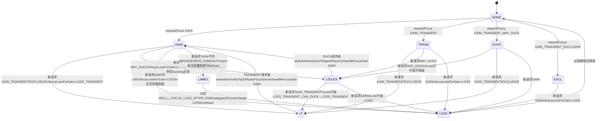
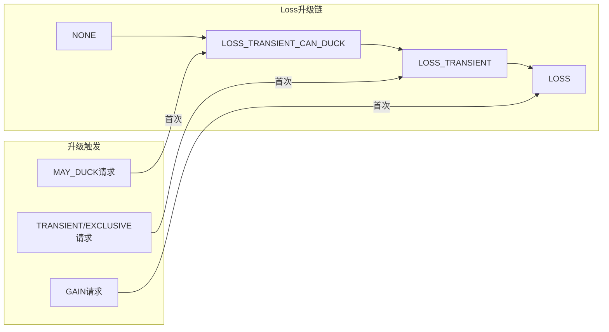
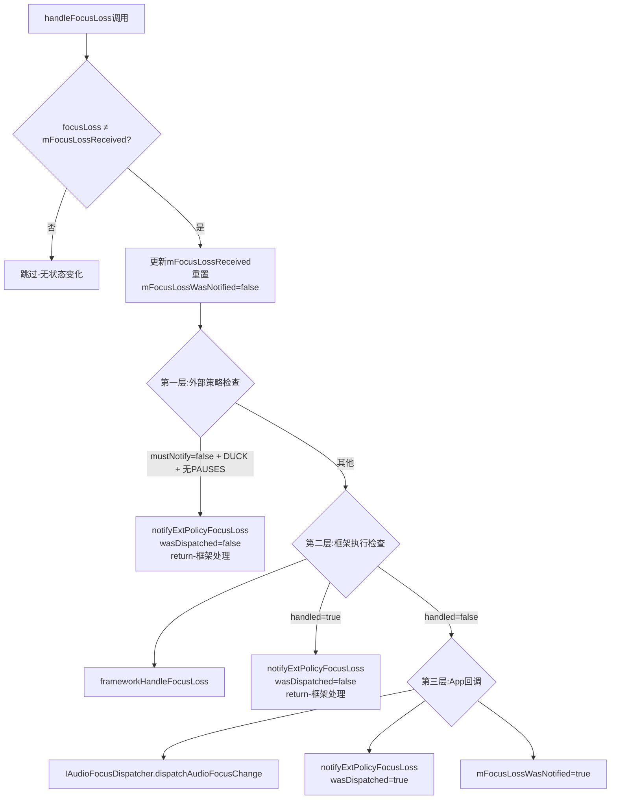
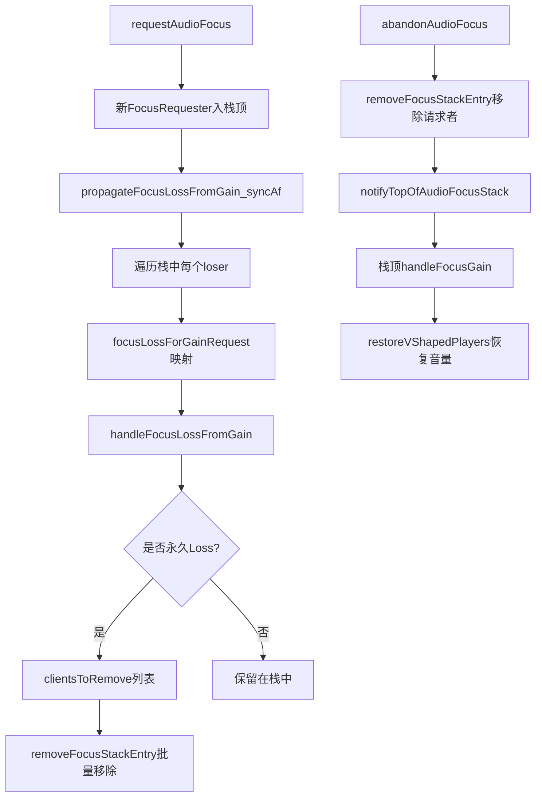
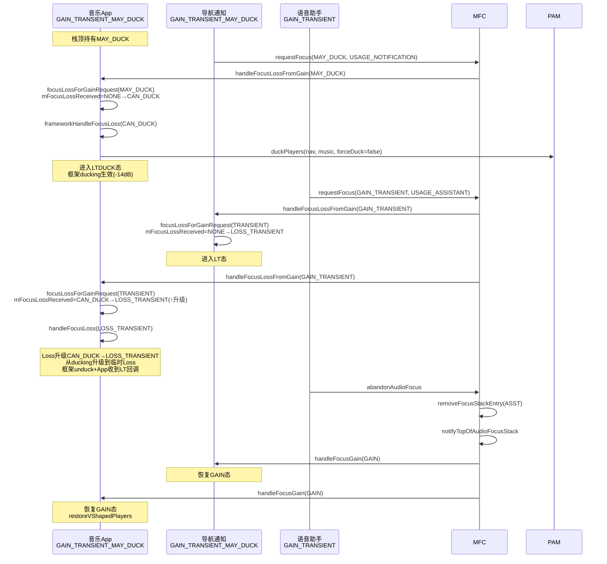

## 12.2 完整焦点状态机（含Fade Limbo状态）

> [← 上一个](12_12.1_Focus栈模型与核心数据结构.md) | [← 返回12章](README.md) | [返回导航](../README.md) | [下一个 →](12_12.3_requestAudioFocus完整流程.md)

---

焦点系统的状态转换由[`FocusRequester`](frameworks/base/services/core/java/com/android/server/audio/FocusRequester.java)的`mFocusLossReceived`和`mFocusLossFadeLimbo`两个字段驱动，配合[`focusLossForGainRequest()`](frameworks/base/services/core/java/com/android/server/audio/FocusRequester.java:288)的映射算法和[`handleFocusLoss()`](frameworks/base/services/core/java/com/android/server/audio/FocusRequester.java:369)的三层决策链，构成一个含Limbo悬停态的完整状态机。

### 12.2.1 状态机全景图



### 12.2.2 状态字段与核心数据结构

FocusRequester中驱动状态机的两个核心字段：

| 字段 | 类型 | 初始值 | 作用 | 源码位置 |
|------|------|--------|------|----------|
| [`mFocusLossReceived`](frameworks/base/services/core/java/com/android/server/audio/FocusRequester.java:74) | int | AUDIOFOCUS_NONE | 记录当前收到的Loss类型，用于Loss升级判定 | L74 |
| [`mFocusLossFadeLimbo`](frameworks/base/services/core/java/com/android/server/audio/FocusRequester.java:78) | boolean | false | Limbo悬停态标记，true时延迟派发LOSS | L78 |

**辅助字段**：
- [`mFocusLossWasNotified`](frameworks/base/services/core/java/com/android/server/audio/FocusRequester.java:76)：boolean，标记Loss是否已通过IPC通知给App。`handleFocusGain()`（L351）只在`mFocusLossWasNotified=true`时才派发GAIN回调，防止从未收到Loss的App突然收到GAIN。
- [`mFocusGainRequest`](frameworks/base/services/core/java/com/android/server/audio/FocusRequester.java:67)：int，记录请求的焦点GAIN类型，用于`focusLossForGainRequest()`映射。

### 12.2.3 focusLossForGainRequest()映射算法详解

[`focusLossForGainRequest()`](frameworks/base/services/core/java/com/android/server/audio/FocusRequester.java:288)是状态机转换的核心算法，根据**新请求者的GAIN类型**和**当前loser已收到的Loss类型**，计算loser应收到的Loss类型。

#### 映射源码（L288-322）

```java
// FocusRequester.java L288-322
private int focusLossForGainRequest(int gainRequest) {
    switch(gainRequest) {
        // 情况1: 新请求GAIN(永久焦点)
        case AUDIOFOCUS_GAIN:
            switch(mFocusLossReceived) {
                case LOSS_TRANSIENT_CAN_DUCK:  // 已在ducking态
                case LOSS_TRANSIENT:           // 已在临时失去态
                case LOSS:                     // 已在永久失去态
                case NONE:                     // 从未收到Loss
                    return AUDIOFOCUS_LOSS;    // 升级为永久Loss
            }

        // 情况2: 新请求GAIN_TRANSIENT或EXCLUSIVE
        case AUDIOFOCUS_GAIN_TRANSIENT_EXCLUSIVE:
        case AUDIOFOCUS_GAIN_TRANSIENT:
            switch(mFocusLossReceived) {
                case LOSS_TRANSIENT_CAN_DUCK:  // 已在ducking态→升级
                case LOSS_TRANSIENT:           // 已在临时失去态→保持
                case NONE:                     // 从未收到Loss→首次
                    return AUDIOFOCUS_LOSS_TRANSIENT;  // 临时Loss
                case LOSS:                     // 已在永久失去态→不能降级
                    return AUDIOFOCUS_LOSS;    // 保持永久Loss
            }

        // 情况3: 新请求MAY_DUCK(Duck焦点)
        case AUDIOFOCUS_GAIN_TRANSIENT_MAY_DUCK:
            switch(mFocusLossReceived) {
                case NONE:                     // 从未收到Loss→首次duck
                case LOSS_TRANSIENT_CAN_DUCK:  // 已在ducking态→保持
                    return AUDIOFOCUS_LOSS_TRANSIENT_CAN_DUCK;  // Duck Loss
                case LOSS_TRANSIENT:           // 已在临时失去态→不能降级
                    return AUDIOFOCUS_LOSS_TRANSIENT;  // 保持临时Loss
                case LOSS:                     // 已在永久失去态→不能降级
                    return AUDIOFOCUS_LOSS;    // 保持永久Loss
            }
    }
}
```

#### Loss升级规则

**核心原则：Loss只能升级，不能降级**。一旦收到`LOSS`（永久），后续无论什么请求类型，Loss类型都保持`LOSS`。



| 当前mFocusLossReceived | 新请求GAIN | 新请求TRANSIENT/EXCLUSIVE | 新请求MAY_DUCK |
|------------------------|-----------|--------------------------|---------------|
| NONE | LOSS | LOSS_TRANSIENT | LOSS_TRANSIENT_CAN_DUCK |
| LOSS_TRANSIENT_CAN_DUCK | LOSS(↑) | LOSS_TRANSIENT(↑) | LOSS_TRANSIENT_CAN_DUCK(=) |
| LOSS_TRANSIENT | LOSS(↑) | LOSS_TRANSIENT(=) | LOSS_TRANSIENT(=，不降级) |
| LOSS | LOSS(=) | LOSS(=，不降级) | LOSS(=，不降级) |

### 12.2.4 GAIN状态→Loss状态的转换路径

每个GAIN类型面对不同的新请求者，产生不同的Loss转换：

#### 1. GAIN（永久焦点持有者）的Loss路径

| 新请求者类型 | Loss类型 | 执行路径 | 状态转换 |
|-------------|----------|----------|----------|
| GAIN（同UID） | LOSS | App回调LOSS | GAIN→LOSS→移除 |
| GAIN（不同UID） | LOSS | 检查FadeOut资格 | GAIN→LIMBO→LOSS(2s后) |
| GAIN_TRANSIENT | LOSS_TRANSIENT | App回调LT | GAIN→LT（等待恢复） |
| GAIN_TRANSIENT_EXCLUSIVE | LOSS_TRANSIENT | App回调LT | GAIN→LT |
| GAIN_TRANSIENT_MAY_DUCK | LOSS_TRANSIENT_CAN_DUCK | 框架ducking | GAIN→LTDUCK（框架duck） |

#### 2. GAIN_TRANSIENT_MAY_DUCK（Duck焦点持有者）的Loss路径

| 新请求者类型 | Loss类型 | 升级方向 | 说明 |
|-------------|----------|----------|------|
| GAIN | LOSS | CAN_DUCK→LOSS↑ | 从ducking升级为永久Loss |
| GAIN_TRANSIENT | LOSS_TRANSIENT | CAN_DUCK→TRANSIENT↑ | 从ducking升级为临时Loss |
| GAIN_TRANSIENT_MAY_DUCK | LOSS_TRANSIENT_CAN_DUCK | CAN_DUCK=CAN_DUCK | 保持ducking，可能换duck曲线 |

#### 3. GAIN_TRANSIENT（临时焦点持有者）的Loss路径

| 新请求者类型 | Loss类型 | 说明 |
|-------------|----------|------|
| GAIN | LOSS | 升级为永久Loss |
| GAIN_TRANSIENT | LOSS_TRANSIENT | 保持临时Loss |
| GAIN_TRANSIENT_MAY_DUCK | LOSS_TRANSIENT | 不降级为CAN_DUCK |

### 12.2.5 Limbo状态：FadeOut悬停态详解

Limbo是AOSP14新增的状态，位于GAIN和LOSS之间的**过渡态**。当框架决定用FadeOut代替直接派发LOSS时，loser进入Limbo。

#### Limbo触发条件

[`frameworkHandleFocusLoss()`](frameworks/base/services/core/java/com/android/server/audio/FocusRequester.java:466)中：

```java
// FocusRequester.java L466-481
if (focusLoss == AudioManager.AUDIOFOCUS_LOSS) {
    if (!MediaFocusControl.ENFORCE_FADEOUT_FOR_FOCUS_LOSS) { return false; }
    boolean playersAreFaded = mFocusController.fadeOutPlayers(frWinner, this);
    if (playersAreFaded) {
        mFocusLossFadeLimbo = true;  // 进入Limbo
        mFocusController.postDelayedLossAfterFade(this,
                FadeOutManager.FADE_OUT_DURATION_MS);  // 延迟2s派发LOSS
        return true;  // 框架已处理，不派发给App
    }
}
```

**进入Limbo的三个前提**：
1. Loss类型为`AUDIOFOCUS_LOSS`（永久Loss）
2. `ENFORCE_FADEOUT_FOR_FOCUS_LOSS=true`
3. `fadeOutPlayers()`返回true（loser有活跃的可淡出播放器）

#### Limbo期间的行为

| Limbo期间 | 行为 |
|-----------|------|
| App回调 | **不派发**任何焦点回调给App（`handled=true`→return） |
| 播放器音量 | FadeOutManager执行FADEOUT_VSHAPE淡出曲线 |
| 焦点栈 | loser仍在栈中（未被移除） |
| 外部策略 | `notifyExtPolicyFocusLoss_syncAf(wasDispatched=false)` |

#### Limbo结束：MSG_L_FOCUS_LOSS_AFTER_FADE

2s后`mFocusHandler`处理[`MSG_L_FOCUS_LOSS_AFTER_FADE`](frameworks/base/services/core/java/com/android/server/audio/MediaFocusControl.java:1287)消息：

```java
// MediaFocusControl.java L1297-1310
case MSG_L_FOCUS_LOSS_AFTER_FADE:
    synchronized (mAudioFocusLock) {
        final FocusRequester loser = (FocusRequester) msg.obj;
        if (loser.isInFocusLossLimbo()) {  // 验证仍在Limbo
            loser.dispatchFocusChange(AUDIOFOCUS_LOSS);  // 派发永久Loss
            loser.release();  // 释放FocusRequester
            postForgetUidLater(loser.getClientUid());  // 延迟2s清理FadeOut
        }
    }
```

#### Limbo时序表

| 时间 | 事件 | 状态变化 |
|------|------|----------|
| T=0 | frameworkHandleFocusLoss返回true | mFocusLossFadeLimbo=true |
| T=0 | fadeOutPlayers执行 | 播放器开始2s淡出曲线 |
| T=0 | postDelayedLossAfterFade(2s) | MSG_L_FOCUS_LOSS_AFTER_FADE排队 |
| T=0-2s | Limbo期 | App无回调，播放器音量持续降低 |
| T=2s | MSG_L_FOCUS_LOSS_AFTER_FADE | dispatchFocusChange(LOSS)→App收到LOSS |
| T=2s | loser.release() | FocusRequester释放，从栈中移除 |
| T=2s | postForgetUidLater(2s) | MSL_L_FORGET_UID排队 |
| T=4s | MSL_L_FORGET_UID | forgetUid→unfadeOutUid清理FadeOut记录 |

#### Limbo退出场景

| 退出场景 | 触发条件 | 处理方式 |
|----------|----------|----------|
| 正常退出 | 2s后MSG到达 | dispatch LOSS + release |
| 提前恢复 | winner abandon→notifyTopOfAudioFocusStack | handleFocusGain重置mFocusLossFadeLimbo=false |
| App死亡 | DeathHandler检测到Binder死亡 | removeFocusStackEntryOnDeath清理 |
| 提前abandon | loser主动abandon | removeFocusStackEntry移除 |

### 12.2.6 Loss恢复→GAIN的转换路径

当焦点恢复时，[`notifyTopOfAudioFocusStack()`](frameworks/base/services/core/java/com/android/server/audio/MediaFocusControl.java:273)调用栈顶的`handleFocusGain()`：

```java
// FocusRequester.java L339-359
void handleFocusGain(int focusGain) {
    mFocusLossReceived = AudioManager.AUDIOFOCUS_NONE;  // 重置Loss状态
    mFocusLossFadeLimbo = false;                        // 退出Limbo
    mFocusController.notifyExtPolicyFocusGrant_syncAf(...);
    final IAudioFocusDispatcher fd = mFocusDispatcher;
    if (fd != null) {
        if (mFocusLossWasNotified) {  // 只有之前通知过Loss的才派发GAIN
            fd.dispatchAudioFocusChange(focusGain, mClientId);
        }
    }
    mFocusController.restoreVShapedPlayers(this);  // 恢复被duck/fadeout的音量
}
```

**恢复规则**：
1. **重置状态**：`mFocusLossReceived=NONE`, `mFocusLossFadeLimbo=false`
2. **条件派发**：只有`mFocusLossWasNotified=true`（App之前收到过Loss回调）时才派发GAIN
3. **音量恢复**：调用`restoreVShapedPlayers()`恢复duck/fadeout效果

#### 不同Loss状态恢复时的行为

| 恢复前的Loss状态 | mFocusLossWasNotified | 框架执行 | App回调 |
|------------------|----------------------|----------|---------|
| LTDUCK(框架duck) | false(框架处理) | unduckUid→REVERSE | 无GAIN回调 |
| LTDUCK(App duck) | true(App处理) | 无 | 派发GAIN |
| LT(临时Loss) | true | 无 | 派发GAIN |
| LIMBO(淡出悬停) | false(框架处理) | unfadeOutUid→REVERSE | 无GAIN回调 |
| LOSS(永久Loss) | true | 无 | 已从栈移除，无恢复 |

### 12.2.7 Loss升级判定：handleFocusLossFromGain()

[`handleFocusLossFromGain()`](frameworks/base/services/core/java/com/android/server/audio/FocusRequester.java:331)是`propagateFocusLossFromGain_syncAf()`遍历栈时调用的方法：

```java
// FocusRequester.java L331-336
boolean handleFocusLossFromGain(int focusGain, FocusRequester frWinner, boolean forceDuck) {
    final int focusLoss = focusLossForGainRequest(focusGain);  // 映射算法
    handleFocusLoss(focusLoss, frWinner, forceDuck);            // 执行Loss
    return (focusLoss == AudioManager.AUDIOFOCUS_LOSS);         // 是否永久Loss
}
```

**返回值语义**：
- `true`（永久Loss）→ loser将从栈中移除，由`propagateFocusLossFromGain_syncAf()`收集到`clientsToRemove`列表
- `false`（临时Loss/Duck Loss）→ loser保留在栈中，等待恢复

### 12.2.8 propagateFocusLossFromGain_syncAf()：栈遍历与移除

```java
// MediaFocusControl.java L296-325
private void propagateFocusLossFromGain_syncAf(int focusGain, FocusRequester fr, boolean forceDuck) {
    final List<String> clientsToRemove = new LinkedList<String>();
    // 遍历焦点栈，每个loser计算Loss类型
    if (!mFocusStack.empty()) {
        for (FocusRequester focusLoser : mFocusStack) {
            final boolean isDefinitiveLoss =
                    focusLoser.handleFocusLossFromGain(focusGain, fr, forceDuck);
            if (isDefinitiveLoss) {
                clientsToRemove.add(focusLoser.getClientId());
            }
        }
    }
    // 多焦点列表同步处理
    if (mMultiAudioFocusEnabled && !mMultiAudioFocusList.isEmpty()) {
        for (FocusRequester multifocusLoser : mMultiAudioFocusList) {
            final boolean isDefinitiveLoss =
                    multifocusLoser.handleFocusLossFromGain(focusGain, fr, forceDuck);
            if (isDefinitiveLoss) {
                clientsToRemove.add(multifocusLoser.getClientId());
            }
        }
    }
    // 移除永久Loss的请求者
    for (String clientToRemove : clientsToRemove) {
        removeFocusStackEntry(clientToRemove, false /*signal*/, true /*notifyFocusFollowers*/);
    }
}
```

**关键设计**：遍历顺序不影响结果——所有loser面对同一个winner，产生相同的focusGain，映射算法独立计算。

### 12.2.9 handleFocusLoss()三层决策链

[`handleFocusLoss()`](frameworks/base/services/core/java/com/android/server/audio/FocusRequester.java:369)在Loss状态变化时执行三层决策：



**三层决策详解**：

| 层级 | 条件 | 执行 | 结果 |
|------|------|------|------|
| 第一层 | `!mustNotifyFocusOwnerOnDuck` + DUCK Loss + 无PAUSES标志 | 外部策略通知(wasDispatched=false) | App不收到回调 |
| 第二层 | `frameworkHandleFocusLoss()`返回true | 框架执行Duck/FadeOut/Limbo | App不收到回调 |
| 第三层 | 前两层都未处理 | IPC派发给App | App收到Loss回调 |

### 12.2.10 状态机与焦点栈的交互



**栈与状态机的协同**：
- **入栈**：新请求者push到栈顶，栈中所有loser通过映射算法计算Loss类型
- **永久Loss移除**：收到`LOSS`的请求者被收集到移除列表，批量从栈中删除
- **临时Loss保留**：收到`LOSS_TRANSIENT`/`LOSS_TRANSIENT_CAN_DUCK`的请求者保留在栈中
- **恢复**：当栈顶请求者abandon后，notifyTopOfAudioFocusStack恢复栈顶的GAIN

### 12.2.11 状态转换完整示例

#### 场景：音乐App(MEDIA)→导航通知(NOTIFICATION)→语音助手(ASSISTANT)



### 12.2.12 特殊状态转换

#### EXCLUSIVE独占焦点

`GAIN_TRANSIENT_EXCLUSIVE`用于阻止系统录音（如语音助手录音时阻止其他录音），其Loss映射与`GAIN_TRANSIENT`相同：

```java
// FocusRequester.java L298-307
case AUDIOFOCUS_GAIN_TRANSIENT_EXCLUSIVE:
case AUDIOFOCUS_GAIN_TRANSIENT:  // 合并处理
    // 映射算法完全相同
```

#### 锁定焦点(FLAG_LOCK)

持有`AUDIOFOCUS_FLAG_LOCK`的请求者通过[`isLockedFocusOwner()`](frameworks/base/services/core/java/com/android/server/audio/FocusRequester.java:138)标记为锁定焦点，不会被`pushBelowLockedFocusOwnersAndPropagate()`移除。锁定焦点主要用于电话/铃声等系统级音频。

#### mustNotifyFocusOwnerOnDuck的Duck通知策略

[`mNotifyFocusOwnerOnDuck`](frameworks/base/services/core/java/com/android/server/audio/MediaFocusControl.java:604)控制Duck Loss时是否通知loser App：

| mNotifyFocusOwnerOnDuck值 | Duck Loss行为 | 适用场景 |
|---------------------------|---------------|----------|
| 0(NEVER_NOTIFY) | 框架ducking，App不收到CAN_DUCK | 标准Android |
| 1(ALWAYS_NOTIFY) | 框架ducking + App收到CAN_DUCK | AAOS多焦点 |
| 2(NOTIFY_ONLY_CURRENT) | 仅当前栈顶收到CAN_DUCK | AAOS特定配置 |

---

[← 上一个](12_12.1_Focus栈模型与核心数据结构.md) | [← 返回12章](README.md) | [返回导航](../README.md) | [下一个 →](12_12.3_requestAudioFocus完整流程.md)