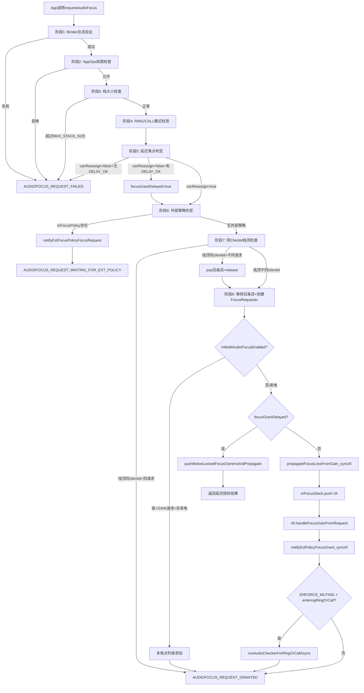
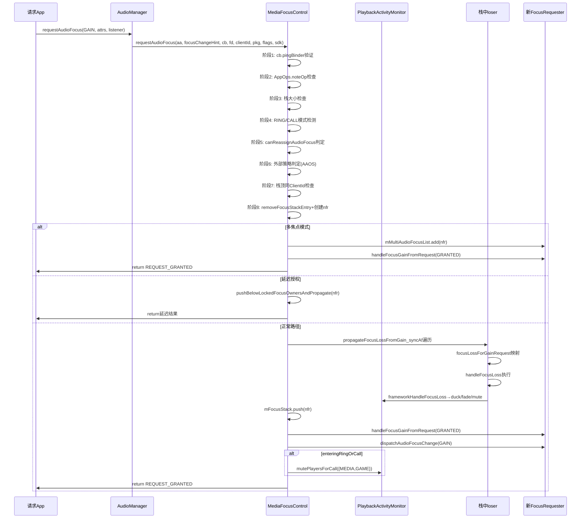
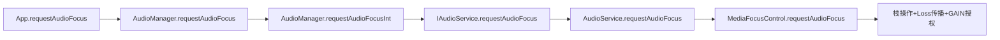

## 12.3 requestAudioFocus()完整流程

> [← 上一个](12_12.2_完整焦点状态机含Fade_Limbo状态.md) | [← 返回12章](README.md) | [返回导航](../README.md) | [下一个 →](12_12.4_焦点Loss传播与Loss类型映射.md)

---

[`requestAudioFocus()`](frameworks/base/services/core/java/com/android/server/audio/MediaFocusControl.java:952)是焦点系统的核心入口方法，从Binder存活验证、权限检查、焦点策略判定到栈操作和Loss传播，共经历9个决策阶段。本节基于源码L952-1131逐段解析。

### 12.3.1 完整流程架构图



### 12.3.2 阶段1：Binder存活验证（L981-984）

```java
// MediaFocusControl.java L981-984
if (!cb.pingBinder()) {
    Log.e(TAG, " AudioFocus DOA client for requestAudioFocus(), aborting.");
    return AudioManager.AUDIOFOCUS_REQUEST_FAILED;
}
```

**`cb`（IBinder）**是焦点请求者注册的Binder回调对象，用于：
1. 死亡监控：`linkToDeath()`注册死亡通知
2. FocusDispatcher IPC：`IAudioFocusDispatcher`通过此Binder派发焦点变化

`pingBinder()`验证客户端进程是否存活。如果进程已死亡，直接返回`REQUEST_FAILED`，避免后续创建无效的FocusRequester。

### 12.3.3 阶段2：AppOps权限检查（L986-991）

```java
// MediaFocusControl.java L986-991
if ((flags != AudioManager.AUDIOFOCUS_FLAG_TEST)
        && (mAppOps.noteOp(AppOpsManager.OP_TAKE_AUDIO_FOCUS, Binder.getCallingUid(),
                callingPackageName, attributionTag, null) != AppOpsManager.MODE_ALLOWED)) {
    return AudioManager.AUDIOFOCUS_REQUEST_FAILED;
}
```

**OP_TAKE_AUDIO_FOCUS**：AppOps操作码，控制App是否允许获取音频焦点。管理员可通过AppOps禁止特定App的焦点获取权限。

**例外**：`AUDIOFOCUS_FLAG_TEST`标志跳过AppOps检查，仅用于测试API注入虚假UID。

### 12.3.4 阶段3：栈大小检查（L993-997）

```java
// MediaFocusControl.java L993-997
synchronized(mAudioFocusLock) {
    if (mFocusStack.size() > MAX_STACK_SIZE) {
        Log.e(TAG, "Max AudioFocus stack size reached, failing requestAudioFocus()");
        return AudioManager.AUDIOFOCUS_REQUEST_FAILED;
    }
}
```

**MAX_STACK_SIZE**：焦点栈最大容量限制，防止过多焦点请求者堆积导致性能问题。超出时直接拒绝。

### 12.3.5 阶段4：RING/CALL模式检测（L999-1001）

```java
// MediaFocusControl.java L999-1001
boolean enteringRingOrCall = !mRingOrCallActive
        & (AudioSystem.IN_VOICE_COMM_FOCUS_ID.compareTo(clientId) == 0);
if (enteringRingOrCall) { mRingOrCallActive = true; }
```

**IN_VOICE_COMM_FOCUS_ID**：电话/铃声焦点请求的专用ClientId标识。当检测到此ClientId时：
1. 标记`mRingOrCallActive=true`
2. 后续触发`ENFORCE_MUTING_FOR_RING_OR_CALL`→`mutePlayersForCall()`静音MEDIA/GAME
3. 此标记会影响多焦点分支——来电时不走多焦点路径

### 12.3.6 阶段5：延迟焦点判定（L1013-1024）

```java
// MediaFocusControl.java L1013-1024
boolean focusGrantDelayed = false;
if (!canReassignAudioFocus()) {
    if ((flags & AudioManager.AUDIOFOCUS_FLAG_DELAY_OK) == 0) {
        return AudioManager.AUDIOFOCUS_REQUEST_FAILED;
    } else {
        focusGrantDelayed = true;
    }
}
```

**[`canReassignAudioFocus()`](frameworks/base/services/core/java/com/android/server/audio/MediaFocusControl.java:493)**检查当前是否存在锁定焦点持有者：

```java
// MediaFocusControl.java L493-504
private boolean canReassignAudioFocus() {
    // focus can't be reassigned if there's a locked focus owner in the stack
    for (FocusRequester fr : mFocusStack) {
        if (fr.isLockedFocusOwner()) { return false; }
    }
    return true;
}
```

**决策逻辑**：
- `canReassign=true`：无锁定焦点，可立即授权→继续正常流程
- `canReassign=false` + 无`DELAY_OK`标志：直接拒绝
- `canReassign=false` + 有`DELAY_OK`标志：延迟授权，请求者插入栈中等待

### 12.3.7 阶段6：外部焦点策略判定（L1026-1036）

```java
// MediaFocusControl.java L1026-1036
if (mFocusPolicy != null) {
    if (notifyExtFocusPolicyFocusRequest_syncAf(afiForExtPolicy, fd, cb)) {
        return AudioManager.AUDIOFOCUS_REQUEST_WAITING_FOR_EXT_POLICY;
    } else {
        return AudioManager.AUDIOFOCUS_REQUEST_FAILED;
    }
}
```

**外部焦点策略**（AAOS CarAudioFocus）接管焦点决策：
1. 构造`AudioFocusInfo`打包请求参数
2. 通过`IAudioFocusPolicy.onAudioFocusRequest()`传递给外部策略
3. 外部策略自行决定授权/拒绝，返回`REQUEST_WAITING_FOR_EXT_POLICY`
4. 后续外部策略通过`notifyAudioFocusGrant()`回调结果

### 12.3.8 阶段7：同ClientId栈顶检查（L1051-1070）

```java
// MediaFocusControl.java L1051-1070
if (!mFocusStack.empty() && mFocusStack.peek().hasSameClient(clientId)) {
    final FocusRequester fr = mFocusStack.peek();
    // 同请求类型+同flags→无需操作
    if (fr.getGainRequest() == focusChangeHint && fr.getGrantFlags() == flags) {
        cb.unlinkToDeath(afdh, 0);  // 清理死亡handler
        notifyExtPolicyFocusGrant_syncAf(fr.toAudioFocusInfo(), REQUEST_GRANTED);
        return AUDIOFOCUS_REQUEST_GRANTED;
    }
    // 不同请求类型→pop旧条目
    if (!focusGrantDelayed) {
        mFocusStack.pop();
        fr.release();
    }
}
```

**三种场景**：

| 场景 | 条件 | 处理 | 返回值 |
|------|------|------|--------|
| 重复请求 | 栈顶同clientId + 同gainRequest + 同flags | unlinkToDeath + 通知外部策略 | REQUEST_GRANTED |
| 请求升级 | 栈顶同clientId + 不同gainRequest/flags | pop旧条目 + release旧 | 继续阶段8 |
| 非延迟 | focusGrantDelayed=false | pop + release | 继续阶段8 |

### 12.3.9 阶段8：移除旧条目+创建FocusRequester（L1072-1076）

```java
// MediaFocusControl.java L1072-1076
// 移除栈中同clientId的旧条目（无论是否在栈顶）
removeFocusStackEntry(clientId, false /* signal */, false /*notifyFocusFollowers*/);

final FocusRequester nfr = new FocusRequester(aa, focusChangeHint, flags, fd, cb,
        clientId, afdh, callingPackageName, uid, this, sdk);
```

**removeFocusStackEntry**：即使栈顶已pop，栈中其他位置可能还有同clientId的旧条目（如之前被pushBelow延迟插入的），需全部移除。

**FocusRequester构造参数**：

| 参数 | 源 | 作用 |
|------|-----|------|
| aa | AudioAttributes | 音频属性（Usage/ContentType） |
| focusChangeHint | 请求参数 | GAIN类型 |
| flags | 请求参数 | 授权标志(LOCK/DELAY_OK/PAUSES_ON_DUCKABLE_LOSS) |
| fd | IAudioFocusDispatcher | IPC回调接口 |
| cb | IBinder | 客户端Binder对象 |
| clientId | 请求参数 | 客户端唯一标识 |
| afdh | AudioFocusDeathHandler | 死亡监控handler |
| callingPackageName | 请求参数 | 包名 |
| uid | Binder.getCallingUid | 调用者UID |
| this | MediaFocusControl | 焦点控制器引用 |
| sdk | 请求参数 | 目标SDK版本 |

### 12.3.10 阶段9A：多焦点分支（L1078-1103）

```java
// MediaFocusControl.java L1078-1103
if (mMultiAudioFocusEnabled
        && (focusChangeHint == AudioManager.AUDIOFOCUS_GAIN)) {
    if (enteringRingOrCall) {
        // 来电时：多焦点列表所有条目收到LOSS
        if (!mMultiAudioFocusList.isEmpty()) {
            for (FocusRequester multifr : mMultiAudioFocusList) {
                multifr.handleFocusLossFromGain(focusChangeHint, nfr, forceDuck);
            }
        }
    } else {
        // 非来电时：同UID不重复添加
        boolean needAdd = true;
        if (!mMultiAudioFocusList.isEmpty()) {
            for (FocusRequester multifr : mMultiAudioFocusList) {
                if (multifr.getClientUid() == Binder.getCallingUid()) {
                    needAdd = false; break;
                }
            }
        }
        if (needAdd) {
            mMultiAudioFocusList.add(nfr);
        }
        nfr.handleFocusGainFromRequest(AUDIOFOCUS_REQUEST_GRANTED);
        notifyExtPolicyFocusGrant_syncAf(nfr.toAudioFocusInfo(), REQUEST_GRANTED);
        return AUDIOFOCUS_REQUEST_GRANTED;  // 直接授权，不走栈
    }
}
```

**AAOS多焦点模式**（`mMultiAudioFocusEnabled`）：
- 仅对`GAIN`（永久焦点）类型生效
- 来电时：多焦点列表中所有条目收到LOSS（电话优先）
- 非来电时：同UID只保留一个条目，新请求直接授权，不经过栈传播
- 多焦点列表中的请求者**不进入焦点栈**

### 12.3.11 阶段9B：延迟授权路径（L1106-1113）

```java
// MediaFocusControl.java L1106-1113
if (focusGrantDelayed) {
    final int requestResult = pushBelowLockedFocusOwnersAndPropagate(nfr);
    if (requestResult != AUDIOFOCUS_REQUEST_FAILED) {
        notifyExtPolicyFocusGrant_syncAf(nfr.toAudioFocusInfo(), requestResult);
    }
    return requestResult;
}
```

**[`pushBelowLockedFocusOwnersAndPropagate()`](frameworks/base/services/core/java/com/android/server/audio/MediaFocusControl.java:519)**：将新请求者插入栈中锁定焦点持有者的下方位置，等待锁定焦点释放后自动获得焦点。

### 12.3.12 阶段9C：正常授权路径（L1114-1130）

```java
// MediaFocusControl.java L1114-1130
// 正常路径：先传播Loss，再入栈
propagateFocusLossFromGain_syncAf(focusChangeHint, nfr, forceDuck);
mFocusStack.push(nfr);
nfr.handleFocusGainFromRequest(AUDIOFOCUS_REQUEST_GRANTED);

notifyExtPolicyFocusGrant_syncAf(nfr.toAudioFocusInfo(), REQUEST_GRANTED);

// 通话静音检查
if (ENFORCE_MUTING_FOR_RING_OR_CALL & enteringRingOrCall) {
    runAudioCheckerForRingOrCallAsync(true);
}
```

**正常路径关键步骤**：
1. **传播Loss**：遍历栈中所有loser，计算Loss类型并执行
2. **入栈**：新FocusRequester push到栈顶
3. **通知GAIN**：`handleFocusGainFromRequest()`通知请求者获得焦点
4. **通话静音**：如果进入RING/CALL模式，异步执行mutePlayersForCall()

### 12.3.13 requestAudioFocus()返回值汇总

| 返回值 | 含义 | 触发条件 |
|--------|------|----------|
| AUDIOFOCUS_REQUEST_GRANTED | 立即授权 | 正常路径/重复请求/多焦点 |
| AUDIOFOCUS_REQUEST_FAILED | 拒绝 | Binder死亡/AppOps拒绝/栈溢出/锁定焦点+无DELAY_OK |
| AUDIOFOCUS_REQUEST_WAITING_FOR_EXT_POLICY | 等待外部策略 | mFocusPolicy存在 |

### 12.3.14 完整流程时序图



### 12.3.15 handleFocusGainFromRequest()与GAIN通知

[`handleFocusGainFromRequest()`](frameworks/base/services/core/java/com/android/server/audio/FocusRequester.java)在请求者入栈后调用：

```java
// FocusRequester.java（推断，与handleFocusGain类似逻辑）
void handleFocusGainFromRequest(int requestResult) {
    mFocusLossReceived = AudioManager.AUDIOFOCUS_NONE;
    mFocusLossFadeLimbo = false;
    // 通知外部策略焦点授权
    mFocusController.notifyExtPolicyFocusGrant_syncAf(toAudioFocusInfo(), requestResult);
    // IPC派发GAIN给App
    if (mFocusDispatcher != null) {
        mFocusDispatcher.dispatchAudioFocusChange(mFocusGainRequest, mClientId);
    }
}
```

**注意**：新请求者首次获得焦点时`mFocusLossWasNotified=false`（从未收到Loss），但`handleFocusGainFromRequest`不检查此字段，总是派发GAIN回调。这是因为首次请求者从未处于Loss状态，不需要条件判定。

### 12.3.16 从App层到服务层的完整调用链



**调用链各层职责**：

| 层级 | 类 | 职责 |
|------|-----|------|
| App层 | AudioManager | 公共API入口，参数封装 |
| IPC层 | IAudioService | Binder跨进程调用 |
| 服务层 | AudioService | 权限二次检查，转发给MediaFocusControl |
| 核心层 | MediaFocusControl | 焦点栈操作，Loss传播，授权决策 |

### 12.3.17 边界条件与异常处理

#### 1. Binder死亡处理

```java
// MediaFocusControl.java L1041-1049
AudioFocusDeathHandler afdh = new AudioFocusDeathHandler(cb);
try {
    cb.linkToDeath(afdh, 0);
} catch (RemoteException e) {
    // client has already died!
    return AUDIOFOCUS_REQUEST_FAILED;
}
```

`linkToDeath()`注册死亡监控。如果客户端进程死亡，`AudioFocusDeathHandler.binderDied()`触发`removeFocusStackEntryOnDeath()`自动清理焦点栈。

#### 2. 重复请求的优化

栈顶同ClientId+同请求类型时，直接返回`REQUEST_GRANTED`不做任何栈操作，避免不必要的Loss传播和IPC调用。

#### 3. requestAudioFocus期间的锁保护

整个过程在`mAudioFocusLock`同步块中执行（L993-1128），确保栈操作的原子性。其他线程（DeathHandler、异步消息）也需获取此锁才能操作栈。

#### 4. 来电场景的特殊处理

来电(IN_VOICE_COMM_FOCUS_ID)触发三个特殊行为：
1. `mRingOrCallActive=true`标记设置
2. 多焦点列表中所有条目收到LOSS
3. `runAudioCheckerForRingOrCallAsync(true)`异步静音MEDIA/GAME

---

[← 上一个](12_12.2_完整焦点状态机含Fade_Limbo状态.md) | [← 返回12章](README.md) | [返回导航](../README.md) | [下一个 →](12_12.4_焦点Loss传播与Loss类型映射.md)