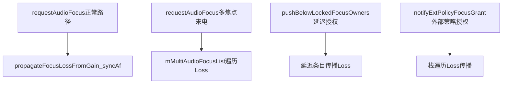
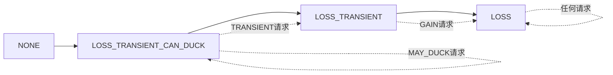
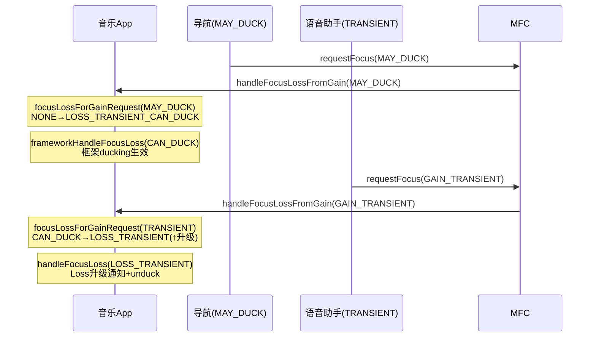
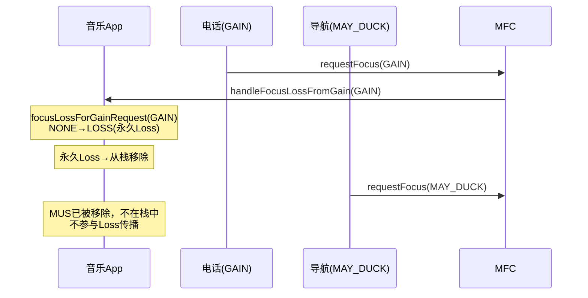
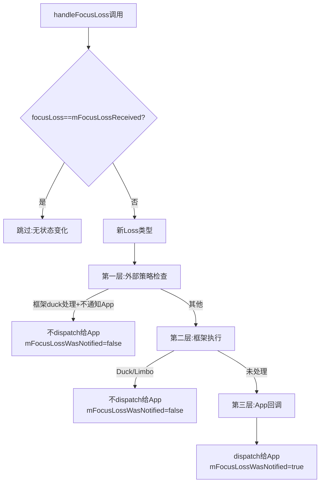
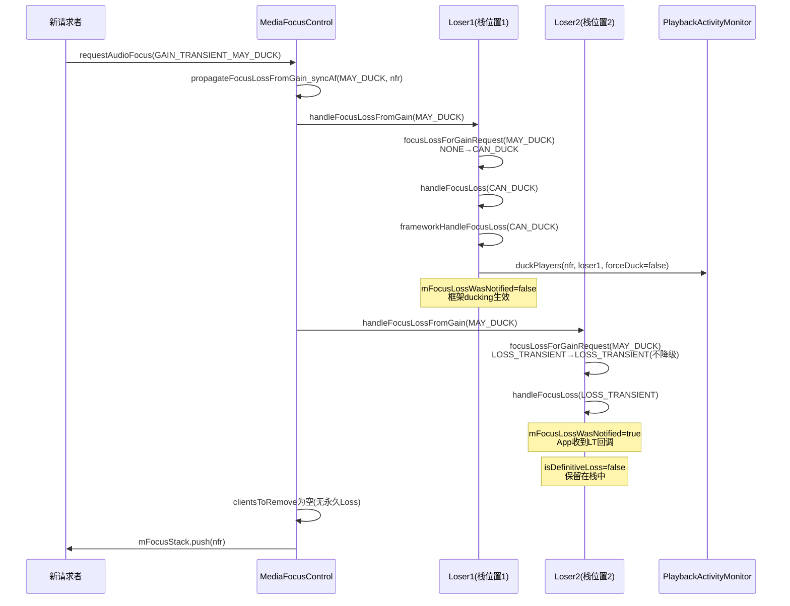

## 12.4 焦点Loss传播与Loss类型映射

> [← 上一个](12_12.3_requestAudioFocus完整流程.md) | [← 返回12章](README.md) | [返回导航](../README.md) | [下一个 →](12_12.5_框架级焦点执行机制.md)

---

焦点Loss传播是从新焦点请求者入栈那一刻开始，遍历焦点栈中所有现有请求者，通过[`focusLossForGainRequest()`](frameworks/base/services/core/java/com/android/server/audio/FocusRequester.java:288)映射算法计算每个loser应收到的Loss类型，再通过[`handleFocusLoss()`](frameworks/base/services/core/java/com/android/server/audio/FocusRequester.java:369)三层决策链执行Loss效果。本章聚焦传播流程的栈遍历机制和批量移除逻辑。

### 12.4.1 Loss传播触发时机

Loss传播在以下三个时机触发：



| 触发时机 | 方法 | 传播范围 | 移除行为 |
|----------|------|----------|----------|
| 新请求者入栈 | `propagateFocusLossFromGain_syncAf()` | mFocusStack + mMultiAudioFocusList | 永久Loss条目移除 |
| 多焦点来电 | `handleFocusLossFromGain()`遍历 | mMultiAudioFocusList仅 | 不移除（多焦点列表不同于栈） |
| 延迟授权 | `pushBelowLockedFocusOwnersAndPropagate()` | 锁定持有者下方条目 | 条目位移 |
| 外部策略授权 | 栈遍历 | mFocusStack | 永久Loss条目移除 |

### 12.4.2 propagateFocusLossFromGain_syncAf()详解

[`propagateFocusLossFromGain_syncAf()`](frameworks/base/services/core/java/com/android/server/audio/MediaFocusControl.java:296)是Loss传播的核心方法，在`requestAudioFocus()`正常路径（L1116）中调用。

#### 源码解析（L296-325）

```java
// MediaFocusControl.java L296-325
@GuardedBy("mAudioFocusLock")
private void propagateFocusLossFromGain_syncAf(int focusGain,
        final FocusRequester fr, boolean forceDuck) {
    final List<String> clientsToRemove = new LinkedList<String>();

    // 阶段1: 遍历焦点栈
    if (!mFocusStack.empty()) {
        for (FocusRequester focusLoser : mFocusStack) {
            final boolean isDefinitiveLoss =
                    focusLoser.handleFocusLossFromGain(focusGain, fr, forceDuck);
            if (isDefinitiveLoss) {
                clientsToRemove.add(focusLoser.getClientId());
            }
        }
    }

    // 阶段2: 遍历多焦点列表(AAOS)
    if (mMultiAudioFocusEnabled && !mMultiAudioFocusList.isEmpty()) {
        for (FocusRequester multifocusLoser : mMultiAudioFocusList) {
            final boolean isDefinitiveLoss =
                    multifocusLoser.handleFocusLossFromGain(focusGain, fr, forceDuck);
            if (isDefinitiveLoss) {
                clientsToRemove.add(multifocusLoser.getClientId());
            }
        }
    }

    // 阶段3: 批量移除永久Loss条目
    for (String clientToRemove : clientsToRemove) {
        removeFocusStackEntry(clientToRemove, false /*signal*/,
                true /*notifyFocusFollowers*/);
    }
}
```

**三个阶段**：

1. **栈遍历**：对焦点栈中每个loser调用`handleFocusLossFromGain()`
2. **多焦点遍历**：对多焦点列表中每个loser同样调用（AAOS场景）
3. **批量移除**：收集所有永久Loss的clientId，统一从栈中移除

### 12.4.3 handleFocusLossFromGain()：Loss映射+执行

[`handleFocusLossFromGain()`](frameworks/base/services/core/java/com/android/server/audio/FocusRequester.java:331)将映射算法和Loss执行合并为一个调用：

```java
// FocusRequester.java L331-336
boolean handleFocusLossFromGain(int focusGain, FocusRequester frWinner, boolean forceDuck) {
    final int focusLoss = focusLossForGainRequest(focusGain);  // 映射算法
    handleFocusLoss(focusLoss, frWinner, forceDuck);            // 执行Loss
    return (focusLoss == AudioManager.AUDIOFOCUS_LOSS);         // 是否永久Loss
}
```

**返回值语义**：
- `true`（永久Loss）→ loser被加入`clientsToRemove`列表，后续从栈中移除
- `false`（临时Loss/Duck Loss）→ loser保留在栈中，等待焦点恢复

### 12.4.4 Loss映射算法：focusLossForGainRequest()

[`focusLossForGainRequest()`](frameworks/base/services/core/java/com/android/server/audio/FocusRequester.java:288)的核心原则是**Loss只能升级，不能降级**。

#### 完整映射表

| loser当前mFocusLossReceived | 新请求GAIN | 新请求TRANSIENT/EXCLUSIVE | 新请求MAY_DUCK |
|-----------------------------|-----------|--------------------------|---------------|
| NONE | LOSS | LOSS_TRANSIENT | LOSS_TRANSIENT_CAN_DUCK |
| LOSS_TRANSIENT_CAN_DUCK | LOSS(↑) | LOSS_TRANSIENT(↑) | LOSS_TRANSIENT_CAN_DUCK(=) |
| LOSS_TRANSIENT | LOSS(↑) | LOSS_TRANSIENT(=) | LOSS_TRANSIENT(=，不降级) |
| LOSS | LOSS(=) | LOSS(=，不降级) | LOSS(=，不降级) |

**↑升级 = =保持 ↓降级（不允许）**

#### Loss升级链



#### 源码（L288-322）

```java
// FocusRequester.java L288-322
private int focusLossForGainRequest(int gainRequest) {
    switch(gainRequest) {
        case AUDIOFOCUS_GAIN:
            // GAIN请求→所有情况都产生永久Loss
            switch(mFocusLossReceived) {
                case LOSS_TRANSIENT_CAN_DUCK:
                case LOSS_TRANSIENT:
                case LOSS:
                case NONE:
                    return AUDIOFOCUS_LOSS;
            }
        case AUDIOFOCUS_GAIN_TRANSIENT_EXCLUSIVE:
        case AUDIOFOCUS_GAIN_TRANSIENT:
            // TRANSIENT请求→LOSS不可降级
            switch(mFocusLossReceived) {
                case LOSS_TRANSIENT_CAN_DUCK:  // 升级
                case LOSS_TRANSIENT:           // 保持
                case NONE:
                    return AUDIOFOCUS_LOSS_TRANSIENT;
                case LOSS:  // 不降级
                    return AUDIOFOCUS_LOSS;
            }
        case AUDIOFOCUS_GAIN_TRANSIENT_MAY_DUCK:
            // MAY_DUCK请求→LOSS/LOSS_TRANSIENT不可降级
            switch(mFocusLossReceived) {
                case NONE:
                case LOSS_TRANSIENT_CAN_DUCK:
                    return AUDIOFOCUS_LOSS_TRANSIENT_CAN_DUCK;
                case LOSS_TRANSIENT:  // 不降级
                    return AUDIOFOCUS_LOSS_TRANSIENT;
                case LOSS:  // 不降级
                    return AUDIOFOCUS_LOSS;
            }
        default:
            return AUDIOFOCUS_NONE;
    }
}
```

### 12.4.5 Loss升级的实例场景

#### 场景1：Duck→临时Loss升级

导航通知请求`MAY_DUCK`，音乐App收到`LOSS_TRANSIENT_CAN_DUCK`。随后语音助手请求`GAIN_TRANSIENT`，音乐App的Loss从CAN_DUCK升级为LOSS_TRANSIENT。



#### 场景2：永久Loss不降级

电话请求`GAIN`，音乐App收到`LOSS`。随后导航请求`MAY_DUCK`，音乐App已处于LOSS状态不降级。



### 12.4.6 批量移除机制：removeFocusStackEntry()

[`removeFocusStackEntry()`](frameworks/base/services/core/java/com/android/server/audio/MediaFocusControl.java:362)负责从栈中移除永久Loss的条目：

```java
// MediaFocusControl.java L362-419（简化核心逻辑）
private void removeFocusStackEntry(String clientToRemove, boolean signal,
        boolean notifyFocusFollowers) {
    // 遍历栈查找clientId
    for (FocusRequester fr : mFocusStack) {
        if (fr.hasSameClient(clientToRemove)) {
            // 如果signal=true，先通知App LOSS
            if (signal) {
                fr.dispatchFocusChange(AUDIOFOCUS_LOSS);
            }
            mFocusStack.remove(fr);
            fr.release();  // 释放资源：unlinkToDeath + 清空引用
            break;
        }
    }
    // 移除后通知栈顶获得焦点
    if (notifyFocusFollowers) {
        notifyTopOfAudioFocusStack();
    }
}
```

**移除后的恢复流程**：移除条目后调用`notifyTopOfAudioFocusStack()`，栈顶请求者通过`handleFocusGain()`恢复焦点和音量。

### 12.4.7 Loss传播中的forceDuck参数

`forceDuck`参数在`propagateFocusLossFromGain_syncAf()`中传递给每个loser，影响Duck路径的决策：

| forceDuck值 | 来源 | 影响 |
|-------------|------|------|
| false | 标准请求 | SPEECH内容/PAUSES_ON_DUCKABLE_LOSS/老SDK→不duck |
| true | 外部策略(AAOS) | 强制duck，忽略SPEECH/PAUSES/老SDK豁免 |

**forceDuck=true**的场景：AAOS的外部焦点策略(CarAudioFocus)决定duck执行，不考虑App的豁免条件。

### 12.4.8 handleFocusLoss()三层决策链中的传播行为

当`handleFocusLoss()`判定Loss类型后，执行三层决策：



**传播对App的影响**：

| Loss类型 | 框架执行 | App回调 | mFocusLossWasNotified |
|----------|----------|---------|----------------------|
| LOSS_TRANSIENT_CAN_DUCK(框架duck) | duckPlayers | 无 | false |
| LOSS_TRANSIENT_CAN_DUCK(App处理) | 无 | CAN_DUCK | true |
| LOSS_TRANSIENT | 无 | LOSS_TRANSIENT | true |
| LOSS(FadeOut) | fadeOutPlayers+Limbo | 无(延迟2s) | false(→2s后true) |
| LOSS(无FadeOut) | 无 | LOSS | true |

### 12.4.9 Loss传播完整时序



### 12.4.10 GAIN_TRANSIENT_EXCLUSIVE的特殊传播行为

`GAIN_TRANSIENT_EXCLUSIVE`在映射算法中与`GAIN_TRANSIENT`合并处理（L298-307），产生相同的Loss类型`LOSS_TRANSIENT`。但其语义不同——EXCLUSIVE阻止系统录音，会设置`AudioSystem.IN_VOICE_COMM_FOCUS_ID`。

### 12.4.11 多焦点列表中的Loss传播

AAOS多焦点模式下，`mMultiAudioFocusList`中的条目也参与Loss传播：

```java
// MediaFocusControl.java L311-319
if (mMultiAudioFocusEnabled && !mMultiAudioFocusList.isEmpty()) {
    for (FocusRequester multifocusLoser : mMultiAudioFocusList) {
        final boolean isDefinitiveLoss =
                multifocusLoser.handleFocusLossFromGain(focusGain, fr, forceDuck);
        if (isDefinitiveLoss) {
            clientsToRemove.add(multifocusLoser.getClientId());
        }
    }
}
```

**多焦点列表与栈的差异**：
- 栈中条目被移除后，栈顶获得GAIN恢复
- 多焦点列表中条目被移除后，**不触发GAIN恢复**（多焦点列表不是栈结构）
- 来电场景下，多焦点列表所有条目收到LOSS（电话优先级最高）

### 12.4.12 Loss传播中的边界条件

#### 1. 同ClientId条目的传播

如果栈中多个位置存在同ClientId的条目（理论上不应发生，因阶段8已移除），`removeFocusStackEntry`只移除第一个匹配条目。正常流程中阶段7和阶段8确保栈中无同ClientId的重复条目。

#### 2. 栈空时的传播

`mFocusStack.empty()`时`propagateFocusLossFromGain_syncAf()`的栈遍历阶段跳过，仅检查多焦点列表。`clientsToRemove`为空，无移除操作。

#### 3. Limbo条目的传播

处于Limbo状态（`mFocusLossFadeLimbo=true`）的条目仍在栈中，会被传播遍历到。如果再次收到永久Loss，`handleFocusLoss()`检测到`focusLoss==mFocusLossReceived`（已是LOSS），跳过不做任何操作。

#### 4. 锁定焦点持有者的传播

锁定焦点持有者（`isLockedFocusOwner=true`）在传播中不会被移除——因为永久Loss的`clientsToRemove`收集后通过`removeFocusStackEntry()`移除，而锁定持有者不会被`pushBelowLockedFocusOwnersAndPropagate()`移动。实际上锁定持有者在`canReassignAudioFocus()`检查时已阻止新请求者入栈，不会出现在正常传播路径中。

### 12.4.13 Loss传播与音量恢复的联动

传播结束后，如果栈顶条目发生变化（移除操作触发`notifyTopOfAudioFocusStack()`），恢复流程启动：


**恢复时机**：Loss传播（栈遍历）→ 批量移除 → 栈顶恢复 → 音量恢复，形成完整的Loss→恢复闭环。

---

[← 上一个](12_12.3_requestAudioFocus完整流程.md) | [← 返回12章](README.md) | [返回导航](../README.md) | [下一个 →](12_12.5_框架级焦点执行机制.md)