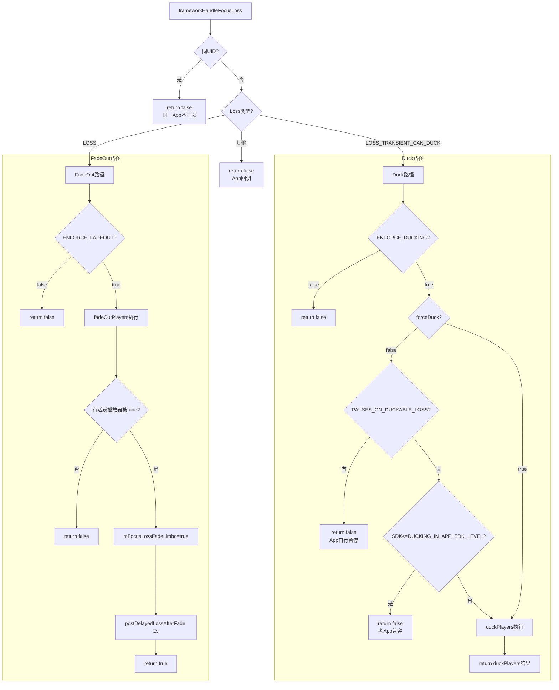
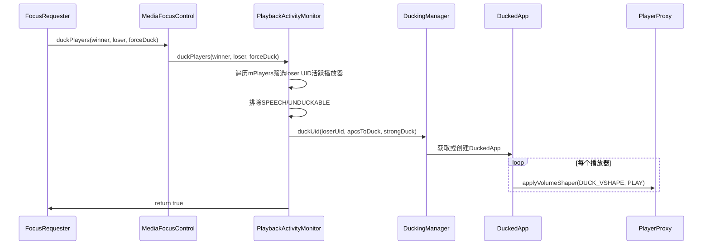
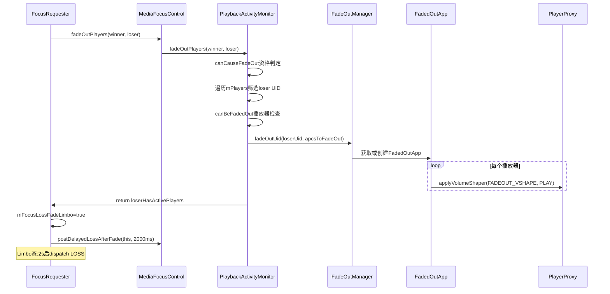
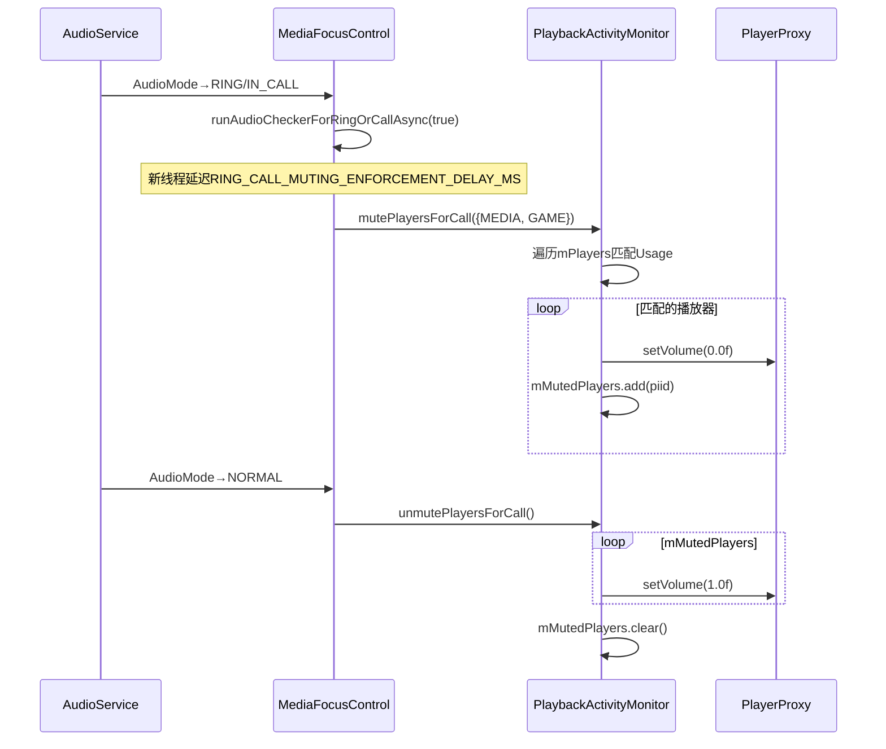
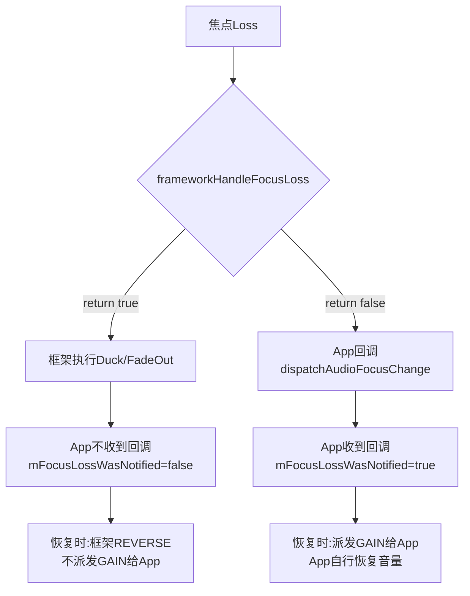
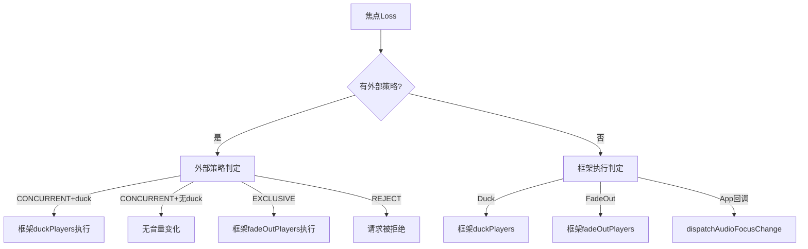

## 12.5 框架级焦点执行机制

> [← 上一个](12_12.4_焦点Loss传播与Loss类型映射.md) | [← 返回12章](README.md) | [返回导航](../README.md) | [下一个 →](12_12.6_AAOS焦点交互矩阵.md)

---

Android 14框架不再仅依赖App自行响应焦点Loss，而是通过[`frameworkHandleFocusLoss()`](frameworks/base/services/core/java/com/android/server/audio/FocusRequester.java:435)主动执行ducking/fadeout/muting。三个ENFORCE开关控制框架执行的启用状态，四个执行器（DuckingManager/FadeOutManager/mMutedPlayers/VolumeHandler）完成音量曲线应用。

### 12.5.1 三个ENFORCE开关

```java
// MediaFocusControl.java L70-92
static final boolean ENFORCE_DUCKING = true;              // 框架执行ducking
static final boolean ENFORCE_DUCKING_FOR_NEW = true;       // 仅对新SDK App执行
static final int DUCKING_IN_APP_SDK_LEVEL = Build.VERSION_CODES.N_MR1; // SDK<=N_MR1不duck
static final boolean ENFORCE_MUTING_FOR_RING_OR_CALL = true;  // 通话静音
static final boolean ENFORCE_FADEOUT_FOR_FOCUS_LOSS = true;   // 永久Loss淡出
```

| 开关 | 默认值 | 作用 | 禁用后果 |
|------|--------|------|----------|
| ENFORCE_DUCKING | true | 框架ducking生效 | 所有duck由App自行处理 |
| ENFORCE_DUCKING_FOR_NEW | true | 仅新SDK App框架duck | 所有SDK App框架duck |
| ENFORCE_MUTING_FOR_RING_OR_CALL | true | 通话静音MEDIA/GAME | 通话时媒体继续播放 |
| ENFORCE_FADEOUT_FOR_FOCUS_LOSS | true | 永久Loss先淡出 | 直接派发LOSS给App |

### 12.5.2 frameworkHandleFocusLoss()决策入口

[`frameworkHandleFocusLoss()`](frameworks/base/services/core/java/com/android/server/audio/FocusRequester.java:435)是框架执行的唯一决策入口，由`handleFocusLoss()`在第二层决策中调用。

#### 决策流程图



### 12.5.3 Duck路径：框架Ducking执行链

Duck路径是框架执行最频繁的路径，当loser收到`LOSS_TRANSIENT_CAN_DUCK`时触发。

#### 执行链



#### Duck排除条件

| 条件 | 检查位置 | 结果 |
|------|----------|------|
| 同UID | frameworkHandleFocusLoss L437 | return false，不干预 |
| ENFORCE_DUCKING=false | L444 | return false |
| PAUSES_ON_DUCKABLE_LOSS标志 | L449-454 | return false，App自行暂停 |
| SDK<=N_MR1(老App) | L456-461 | return false，兼容行为 |
| contentType==SPEECH | duckPlayers L783-790 | return false，语音不可duck |
| UNDUCKABLE_PLAYER_TYPES | duckPlayers L791-797 | return false，AAudio/JamSoundPool |

#### 强Duck(Strong Duck)

[`reqCausesStrongDuck()`](frameworks/base/services/core/java/com/android/server/audio/PlaybackActivityMonitor.java:810)判定winner是否触发强Duck：

```java
// PlaybackActivityMonitor.java L810-819
private boolean reqCausesStrongDuck(FocusRequester requester) {
    if (requester.getGainRequest() != AUDIOFOCUS_GAIN_TRANSIENT_MAY_DUCK) { return false; }
    if (requester.getAudioAttributes().getUsage() == USAGE_ASSISTANT) { return true; }
    return false;
}
```

**强Duck条件**：winner请求`MAY_DUCK` + Usage为`USAGE_ASSISTANT`（语音助手）。强Duck使用`STRONG_DUCK_VSHAPE`（-35dB）代替标准`DUCK_VSHAPE`（-14dB）。

### 12.5.4 FadeOut路径：框架淡出执行链

FadeOut路径在loser收到`AUDIOFOCUS_LOSS`（永久Loss）时触发，先淡出2s再派发Loss。

#### 执行链



#### FadeOut排除条件

| 条件 | 检查位置 | 结果 |
|------|----------|------|
| 同UID | frameworkHandleFocusLoss L437 | return false |
| ENFORCE_FADEOUT=false | L467-469 | return false |
| winner contentType==SPEECH | canCauseFadeOut L95-98 | return false |
| loser有PAUSES_ON_DUCKABLE_LOSS | canCauseFadeOut L100-103 | return false |
| 播放器type∈UNFADEABLE | canBeFadedOut L114-116 | return false(整个fadeout取消) |
| 播放器contentType==SPEECH | canBeFadedOut L118-124 | return false |
| 播放器usage∉{MEDIA,GAME} | canBeFadedOut L126-130 | return false |

### 12.5.5 Mute路径：通话静音执行链

Mute路径独立于焦点Loss传播，由AudioMode变化触发。

#### 执行链



**Mute与Duck/FadeOut的区别**：Mute使用`setVolume(0.0f)`直接置0，不使用VolumeShaper曲线，立即静音。

### 12.5.6 恢复路径：restoreVShapedPlayers()

当焦点恢复时，[`restoreVShapedPlayers()`](frameworks/base/services/core/java/com/android/server/audio/PlaybackActivityMonitor.java:822)恢复被duck/fadeout的音量：

```java
// PlaybackActivityMonitor.java L822-828
public void restoreVShapedPlayers(FocusRequester winner) {
    synchronized (mPlayerLock) {
        mDuckingManager.unduckUid(winner.getClientUid(), mPlayers);
        mFadingManager.unfadeOutUid(winner.getClientUid(), mPlayers);
    }
}
```

**MediaFocusControl层额外处理**（L134-141）：移除`MSL_L_FORGET_UID`消息，避免恢复后又被延迟forget回退。

#### 恢复机制对比

| 恢复操作 | 方法 | VolumeShaper操作 | 效果 |
|----------|------|------------------|------|
| unduckUid | DuckedApp.removeUnduckAll | REVERSE | 从-14dB/-35dB恢复到原音量 |
| unfadeOutUid | FadedOutApp.removeUnfadeAll | REVERSE | 从0反向淡入到原音量(2s) |
| unmutePlayersForCall | setVolume(1.0f) | 无 | 直接恢复原音量 |

### 12.5.7 框架执行与App回调的交互

框架执行和App回调是互斥的——`frameworkHandleFocusLoss()`返回true时，App不收到Loss回调：



**设计原则**：框架执行时App不参与，避免框架ducking和App自行ducking双重操作。App通过`OnAudioFocusChangeListener`收到的回调仅用于非框架处理的场景（如`LOSS_TRANSIENT`需要App自行暂停）。

### 12.5.8 框架执行的SDK兼容策略

`ENFORCE_DUCKING_FOR_NEW`和`DUCKING_IN_APP_SDK_LEVEL`实现SDK兼容：

| App目标SDK | 框架ducking行为 | App回调行为 |
|------------|----------------|-------------|
| <= N_MR1 (Android 7.1) | 不执行框架ducking | 收到CAN_DUCK回调，App自行duck |
| > N_MR1 (Android 8+) | 执行框架ducking | 不收到CAN_DUCK回调 |

**原因**：Android O(8.0)引入自动ducking，老App未适配框架ducking行为，保持原有回调模式确保兼容。

### 12.5.9 forceDuck参数的传播

`forceDuck`参数从`requestAudioFocus()`一路传播到`duckPlayers()`：

| 传播路径 | forceDuck值 | 来源 |
|----------|-------------|------|
| requestAudioFocus→propagate→handleFocusLoss→frameworkHandleFocusLoss→duckPlayers | false | 标准请求 |
| 外部策略notifyAudioFocusGrant→propagate→...→duckPlayers | true | AAOS CarAudioFocus |

**forceDuck=true**时，SPEECH内容类型和老SDK App的豁免条件被忽略，强制执行ducking。

### 12.5.10 框架执行完整决策矩阵

| Loss类型 | ENFORCE开关 | 豁免条件 | 框架执行 | App回调 |
|----------|-------------|----------|----------|---------|
| LOSS_TRANSIENT_CAN_DUCK | ENFORCE_DUCKING | 同UID/PAUSES/老SDK/SPEECH/UNDUCKABLE | duckPlayers | 无 |
| LOSS_TRANSIENT_CAN_DUCK | ENFORCE_DUCKING | PAUSES/老SDK | 无 | CAN_DUCK |
| LOSS_TRANSIENT_CAN_DUCK | false | - | 无 | CAN_DUCK |
| LOSS | ENFORCE_FADEOUT | 同UID/无活跃播放器/SPEECH winner/PAUSES | fadeOutPlayers+Limbo | 延迟2s |
| LOSS | ENFORCE_FADEOUT | 无活跃播放器 | 无 | LOSS |
| LOSS | false | - | 无 | LOSS |
| LOSS_TRANSIENT | 无框架执行 | - | 无 | LOSS_TRANSIENT |
| 通话模式 | ENFORCE_MUTING | - | mutePlayersForCall | 无 |

### 12.5.11 框架执行与外部策略的协同

当`mFocusPolicy`存在（AAOS CarAudioFocus）时，框架执行与外部策略协同：



**AAOS协同模式**：外部策略决定焦点交互结果（CONCURRENT/EXCLUSIVE/REJECT），框架根据结果执行对应的音量操作。DSP ducking路径通过`IAudioControl.onAudioFocusChange()`通知HAL，与框架VolumeShaper路径并行。

---

[← 上一个](12_12.4_焦点Loss传播与Loss类型映射.md) | [← 返回12章](README.md) | [返回导航](../README.md) | [下一个 →](12_12.6_AAOS焦点交互矩阵.md)