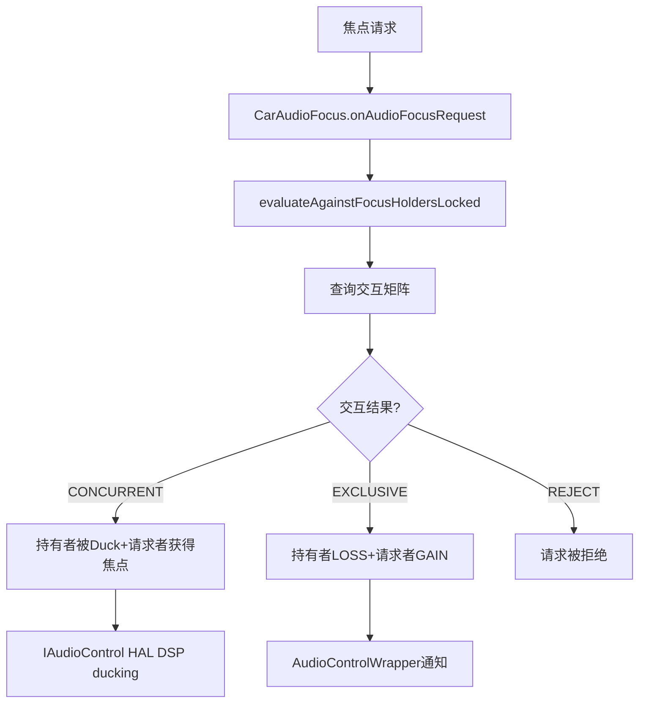

## 12.6 AAOS焦点交互矩阵

> [← 上一个](12_12.5_框架级焦点执行机制.md) | [← 返回12章](README.md) | [返回导航](../README.md) | [下一个 →](12_12.7_abandonAudioFocus流程.md)

---

AAOS车载系统中，焦点交互由CarAudioFocus通过**交互矩阵**决定，而非标准Android的焦点栈。交互矩阵定义每对Usage之间的交互结果（CONCURRENT/EXCLUSIVE/REJECT），由CarAudioPolicyConfiguration XML配置加载。

### 12.6.1 交互矩阵全景

```
              请求者 →
持有者 ↓       | EMERGENCY | SAFETY  | CALL    | NAV     | MUSIC   | NOTIF   | SYSTEM  |
EMERGENCY     | CONCURRENT| CONCUR  | CONCUR  | CONCUR  | CONCUR  | CONCUR  | CONCUR  |
SAFETY        | CONCURRENT| CONCUR  | EXCLUSIVE| CONCUR | CONCUR  | CONCUR  | CONCUR  |
CALL          | CONCURRENT| EXCLUSIVE| EXCLUSIVE| REJECT | EXCLUSIVE| REJECT | REJECT  |
NAVIGATION    | CONCURRENT| CONCUR  | EXCLUSIVE| CONCUR  | CONCUR  | CONCUR  | CONCUR  |
MUSIC         | CONCURRENT| CONCUR  | EXCLUSIVE| CONCUR  | CONCUR  | CONCUR  | CONCUR  |
NOTIFICATION  | CONCURRENT| CONCUR  | EXCLUSIVE| CONCUR  | CONCUR  | CONCUR  | CONCUR  |
SYSTEM_SOUND  | CONCURRENT| CONCUR  | EXCLUSIVE| CONCUR  | CONCUR  | CONCUR  | CONCUR  |
```

### 12.6.2 三种交互结果

| 交互结果 | 含义 | 持有者行为 | 请求者行为 | 音量操作 |
|----------|------|-----------|-----------|----------|
| CONCURRENT | 并发播放 | 保持焦点，被duck | 获得焦点，同时播放 | DuckingManager执行duck |
| EXCLUSIVE | 独占 | 失去焦点(LOSS) | 获得焦点，独占播放 | FadeOut或直接LOSS |
| REJECT | 拒绝 | 保持焦点 | 请求被拒绝 | 无音量变化 |

### 12.6.3 CarAudioFocus交互判定流程



### 12.6.4 交互矩阵规则详解

#### EMERGENCY（紧急）规则
EMERGENCY是**最高优先级**Usage，与所有Usage的交互都是CONCURRENT。紧急警报音始终可播放。

#### SAFETY（安全）规则
SAFETY vs CALL = EXCLUSIVE（安全提示中断通话），与其他并发。

#### CALL（通话）规则
CALL是最**排他性**的Usage：
- CALL vs NAV/NOTIF/SYSTEM = REJECT（通话期间拒绝非关键音频）
- CALL vs SAFETY/EMERGENCY = CONCURRENT（紧急/安全可打断通话）
- CALL vs MUSIC/CALL = EXCLUSIVE（通话独占媒体）

#### NAVIGATION/MUSIC/NOTIFICATION/SYSTEM规则
与EMERGENCY/SAFETY并发，与CALL被独占，相互之间并发。

### 12.6.5 交互矩阵与框架执行的协同

AAOS交互矩阵决定焦点结果后，框架执行对应的音量操作：

| 交互结果 | 框架执行 | HAL通知 | DSP操作 |
|----------|----------|---------|---------|
| CONCURRENT | duckPlayers | onAudioFocusChange(GAIN) | DSP ducking |
| EXCLUSIVE | fadeOutPlayers或直接LOSS | onAudioFocusChange(GAIN) | DSP fading |
| REJECT | 无 | 无 | 无 |

### 12.6.6 IAudioControl HAL路径

AAOS通过`IAudioControl`AIDL接口通知HAL焦点变化，HAL在DSP硬件层执行ducking/fading，优势：零延迟、所有音频流（含AAudio低延迟流）均可被duck。

### 12.6.7 CarAudioPolicyConfiguration XML配置

交互矩阵通过XML配置文件定义，OEM可通过修改XML自定义交互矩阵，无需修改Java代码。配置路径通常为`/vendor/etc/car_audio_policy_configuration.xml`。

### 12.6.8 AAOS vs 标准Android焦点对比

| 维度 | 标准Android | AAOS |
|------|-------------|------|
| 决策机制 | 焦点栈（后入栈者优先） | 交互矩阵（Usage对配置） |
| 并发支持 | 仅MAY_DUCK允许并发 | CONCURRENT允许任意并发 |
| 拒绝能力 | 无（新请求总是优先） | REJECT明确拒绝 |
| 外部策略 | 无 | CarAudioFocus委托 |
| DSP执行 | 无 | IAudioControl HAL |
| 多焦点 | 无 | mMultiAudioFocusEnabled |
| 配置方式 | 硬编码 | XML可配置 |

### 12.6.9 多音频区(Audio Zone)的交互

AAOS支持多音频区，每个区独立维护焦点栈和交互矩阵。不同区的焦点请求互不影响，主区通话不会导致乘客区音乐被duck。紧急/安全Usage可能跨区广播。

---

[← 上一个](12_12.5_框架级焦点执行机制.md) | [← 返回12章](README.md) | [返回导航](../README.md) | [下一个 →](12_12.7_abandonAudioFocus流程.md)