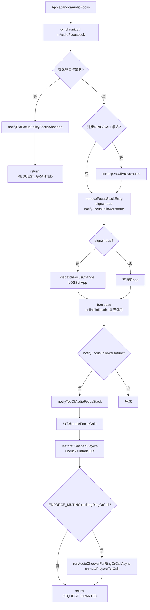

## 12.7 abandonAudioFocus()流程

> [← 上一个](12_12.6_AAOS焦点交互矩阵.md) | [← 返回12章](README.md) | [返回导航](../README.md) | [下一个 →](12_12.8_Audio_Focus全栈调用链.md)

---

[`abandonAudioFocus()`](frameworks/base/services/core/java/com/android/server/audio/MediaFocusControl.java:1136)是焦点释放的核心方法，从栈中移除请求者、通知栈顶恢复焦点、处理通话模式退出。

### 12.7.1 完整流程架构图



### 12.7.2 源码解析（L1136-1183）

```java
// MediaFocusControl.java L1136-1183
protected int abandonAudioFocus(IAudioFocusDispatcher fl, String clientId,
        AudioAttributes aa, String callingPackageName) {
    synchronized(mAudioFocusLock) {
        // 外部焦点策略处理(AAOS)
        if (mFocusPolicy != null) {
            final AudioFocusInfo afi = new AudioFocusInfo(aa, Binder.getCallingUid(),
                    clientId, callingPackageName, 0, 0, 0, 0);
            if (notifyExtFocusPolicyFocusAbandon_syncAf(afi)) {
                return AUDIOFOCUS_REQUEST_GRANTED;
            }
        }

        // 检测退出RING/CALL模式
        boolean exitingRingOrCall = mRingOrCallActive
                & (AudioSystem.IN_VOICE_COMM_FOCUS_ID.compareTo(clientId) == 0);
        if (exitingRingOrCall) { mRingOrCallActive = false; }

        // 从栈中移除（signal=true→通知App LOSS）
        removeFocusStackEntry(clientId, true /*signal*/, true /*notifyFocusFollowers*/);

        // 通话退出时解除静音
        if (ENFORCE_MUTING_FOR_RING_OR_CALL & exitingRingOrCall) {
            runAudioCheckerForRingOrCallAsync(false);
        }
    }
    return AUDIOFOCUS_REQUEST_GRANTED;
}
```

### 12.7.3 abandonAudioFocus vs requestAudioFocus的removeFocusStackEntry差异

两个方法都调用`removeFocusStackEntry()`，但参数不同：

| 调用者 | signal | notifyFocusFollowers | 含义 |
|--------|--------|---------------------|------|
| abandonAudioFocus | true | true | 通知App LOSS + 通知栈顶GAIN |
| requestAudioFocus(阶段8) | false | false | 不通知App + 不通知栈顶 |
| propagateFocusLossFromGain | false | true | 不通知App + 通知栈顶GAIN |

**signal=true**：abandon时先通过`dispatchFocusChange(LOSS)`通知被移除的App，再从栈中删除。这是App主动放弃焦点，需要确认通知。

### 12.7.4 退出RING/CALL模式的特殊处理

当`IN_VOICE_COMM_FOCUS_ID`的请求者abandon时：

1. **mRingOrCallActive=false**：标记通话/铃声模式结束
2. **unmutePlayersForCall()**：恢复被静音的MEDIA/GAME播放器
3. **异步执行**：`runAudioCheckerForRingOrCallAsync(false)`在新线程中执行unmute

### 12.7.5 栈顶恢复流程

`removeFocusStackEntry()`移除条目后，`notifyFocusFollowers=true`触发`notifyTopOfAudioFocusStack()`：

```java
// MediaFocusControl.java L273-288
private void notifyTopOfAudioFocusStack() {
    if (!mFocusStack.empty()) {
        if (canReassignAudioFocus()) {
            mFocusStack.peek().handleFocusGain(AUDIOFOCUS_GAIN);
        }
    }
    // 多焦点列表恢复
    if (mMultiAudioFocusEnabled && !mMultiAudioFocusList.isEmpty()) {
        for (FocusRequester multifr : mMultiAudioFocusList) {
            if (isLockedFocusOwner(multifr)) {
                multifr.handleFocusGain(AUDIOFOCUS_GAIN);
            }
        }
    }
}
```

**恢复条件**：`canReassignAudioFocus()`检查无锁定焦点持有者时才恢复栈顶。如果有锁定持有者，栈顶不获得GAIN。

### 12.7.6 handleFocusGain()恢复详解

栈顶的`handleFocusGain()`执行三个关键操作：

1. **重置状态**：`mFocusLossReceived=NONE`, `mFocusLossFadeLimbo=false`
2. **条件派发GAIN**：仅当`mFocusLossWasNotified=true`时派发GAIN给App
3. **音量恢复**：`restoreVShapedPlayers()`→unduckUid+unfadeOutUid

### 12.7.7 多焦点列表中的abandon

abandonAudioFocus不直接操作`mMultiAudioFocusList`。多焦点列表的条目通过`removeFocusStackEntry()`间接移除（如果clientId在栈中），或通过`updateMultiAudioFocus()`禁用时批量清理。

### 12.7.8 外部策略的abandon

当`mFocusPolicy`存在时，abandon通过`notifyExtFocusPolicyFocusAbandon_syncAf()`通知外部策略，由外部策略决定后续焦点分配。标准Android流程不再执行。

### 12.7.9 ConcurrentModificationException防护

L1174-1180捕获`ConcurrentModificationException`，这是历史遗留的防护措施，防止"Silent"通知播放时的栈并发修改崩溃。

---

[← 上一个](12_12.6_AAOS焦点交互矩阵.md) | [← 返回12章](README.md) | [返回导航](../README.md) | [下一个 →](12_12.8_Audio_Focus全栈调用链.md)