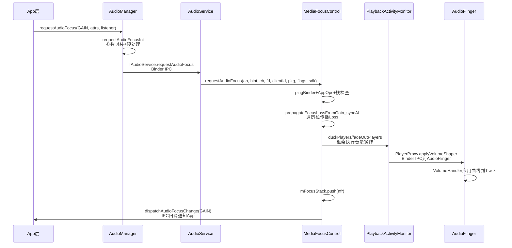
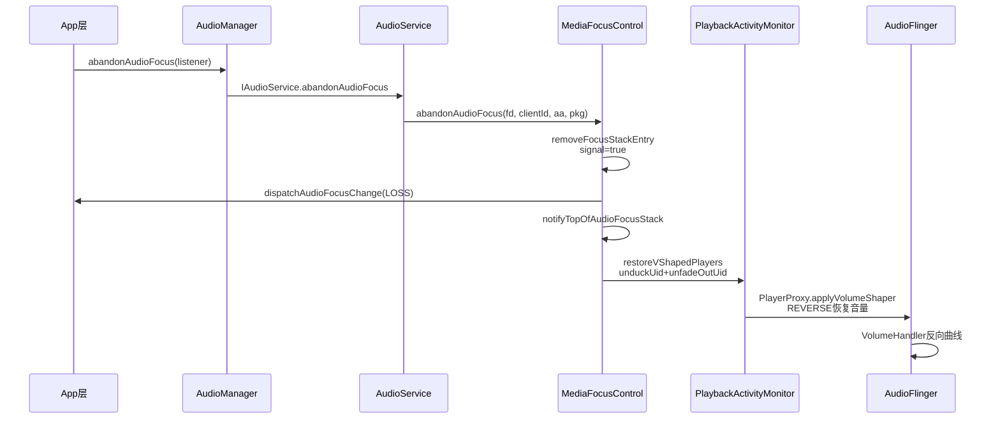
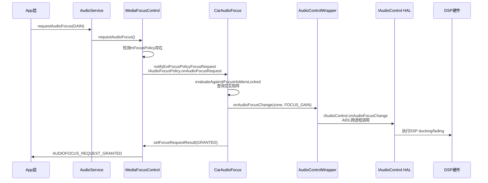
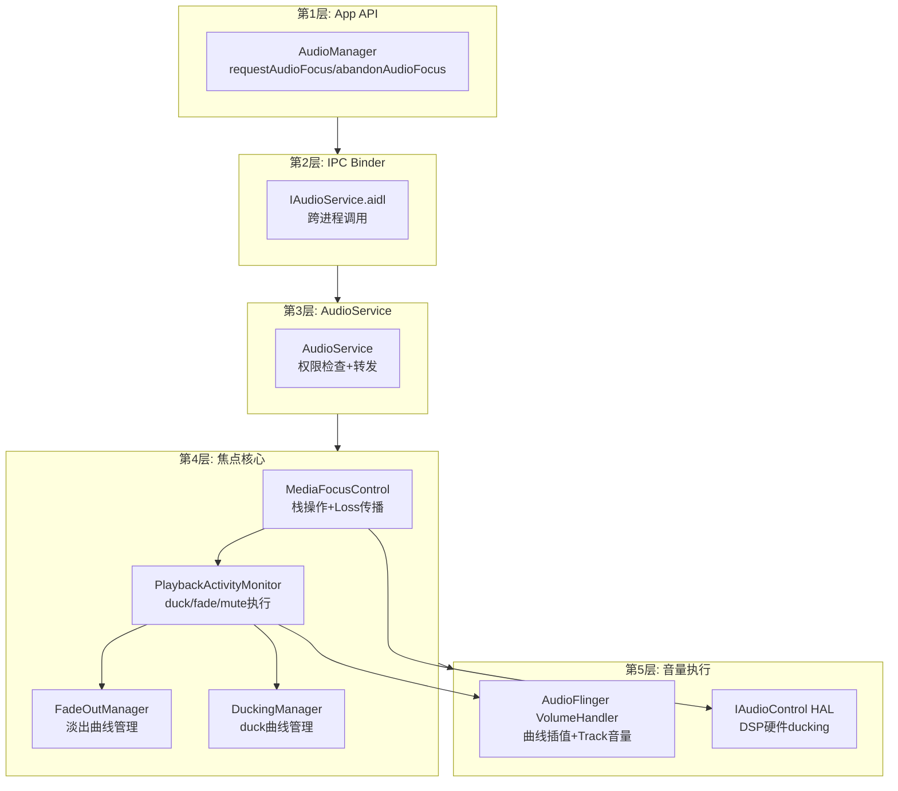

## 12.8 Audio Focus全栈调用链

> [← 上一个](12_12.7_abandonAudioFocus流程.md) | [← 返回12章](README.md) | [返回导航](../README.md) | [下一个 →](12_12.9_通话Muting机制.md)

---

Audio Focus全栈调用链从App层API到AudioFlinger音量执行，跨越5个层级。本节梳理标准Android和AAOS两条完整调用链路。

### 12.8.1 标准Android焦点请求调用链

### 12.8.2 标准Android焦点释放调用链

### 12.8.3 AAOS焦点请求调用链

### 12.8.4 五层调用链架构

### 12.8.5 各层职责与源码位置

| 层级 | 类 | 源码位置 | 核心职责 |
|------|-----|----------|----------|
| App API | AudioManager | frameworks/base/media/java/android/media/ | 公共API入口，参数封装 |
| IPC | IAudioService | frameworks/base/media/java/android/media/IAudioService.aidl | Binder跨进程接口 |
| 服务层 | AudioService | frameworks/base/services/core/java/com/android/server/audio/ | 权限检查，转发给MediaFocusControl |
| 焦点核心 | MediaFocusControl | 同上 | 焦点栈操作，Loss传播，授权决策 |
| 焦点核心 | PlaybackActivityMonitor | 同上 | duck/fade/mute执行器 |
| 焦点核心 | FadeOutManager | 同上 | 淡出曲线管理，资格判定 |
| 焦点核心 | DuckingManager | 同上(PAM内部类) | duck曲线管理，DuckedApp |
| 音量执行 | AudioFlinger | frameworks/base/services/audioflinger/ | VolumeHandler曲线插值 |
| HAL | IAudioControl | device/google/car/ | AAOS DSP硬件ducking |

### 12.8.6 Binder IPC关键接口

| 接口 | 方向 | 方法 | 用途 |
|------|------|------|------|
| IAudioService | App→Service | requestAudioFocus/abandonAudioFocus | 焦点请求/释放 |
| IAudioFocusDispatcher | Service→App | dispatchAudioFocusChange | 焦点变化通知 |
| IAudioFocusPolicy | Service→ExtPolicy | onAudioFocusRequest/onAbandon | 外部策略委托 |
| IAudioControl | Service→HAL | onAudioFocusChange | AAOS HAL焦点通知 |
| IPlayer | PAM→App | applyVolumeShaper/setVolume | 音量操作 |

### 12.8.7 全栈延迟分析

| 阶段 | 延迟来源 | 典型值 |
|------|----------|--------|
| App→AudioManager | 方法调用 | <1ms |
| AudioManager→AudioService | Binder IPC | 1-5ms |
| AudioService→MediaFocusControl | 方法调用 | <1ms |
| MediaFocusControl栈操作 | 遍历+映射 | <1ms |
| duckPlayers→VolumeShaper | Binder IPC | 1-5ms |
| VolumeShaper→AudioFlinger | 进程内调用 | <1ms |
| AudioFlinger mix()应用 | 每帧计算 | 实时 |
| **总计(框架ducking)** | | **3-12ms** |
| AAOS DSP ducking | HAL+DSP | **<1ms** |

---

[← 上一个](12_12.7_abandonAudioFocus流程.md) | [← 返回12章](README.md) | [返回导航](../README.md) | [下一个 →](12_12.9_通话Muting机制.md)