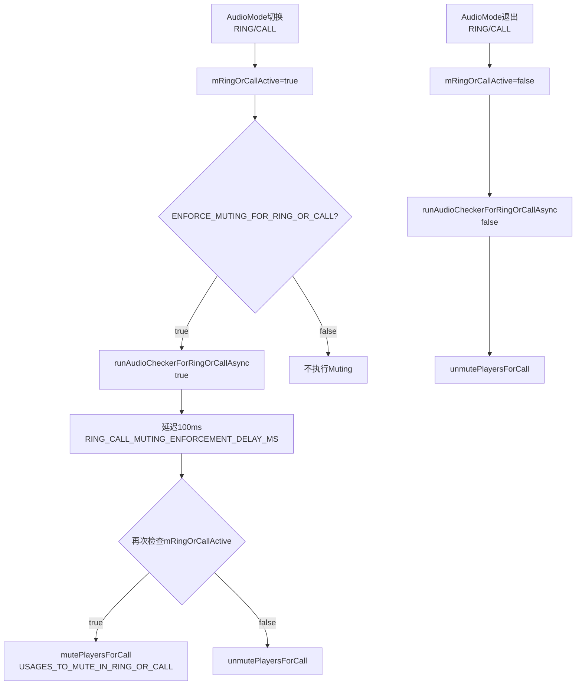
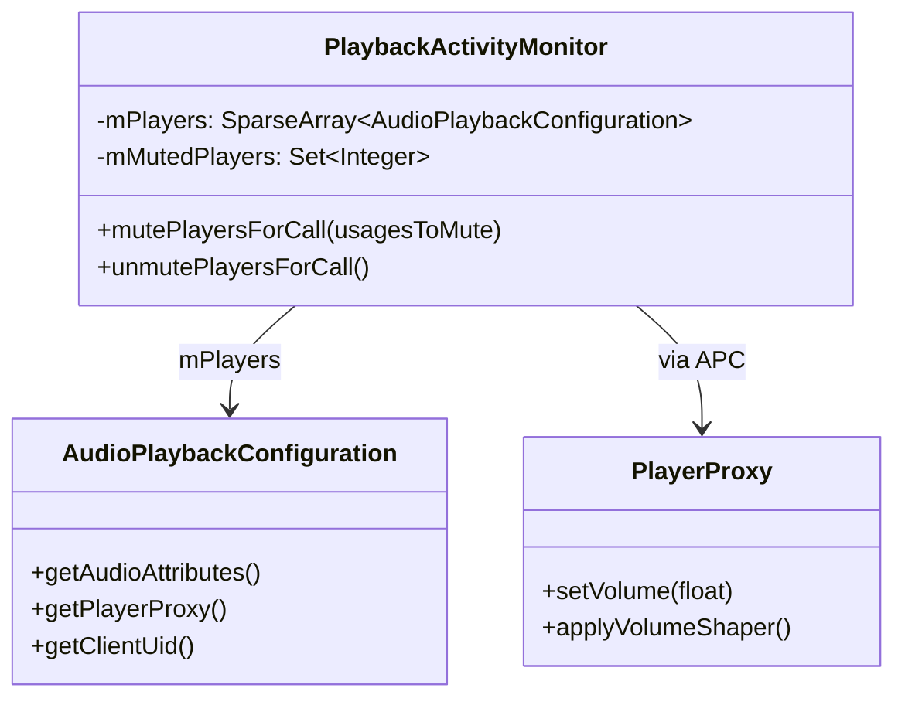
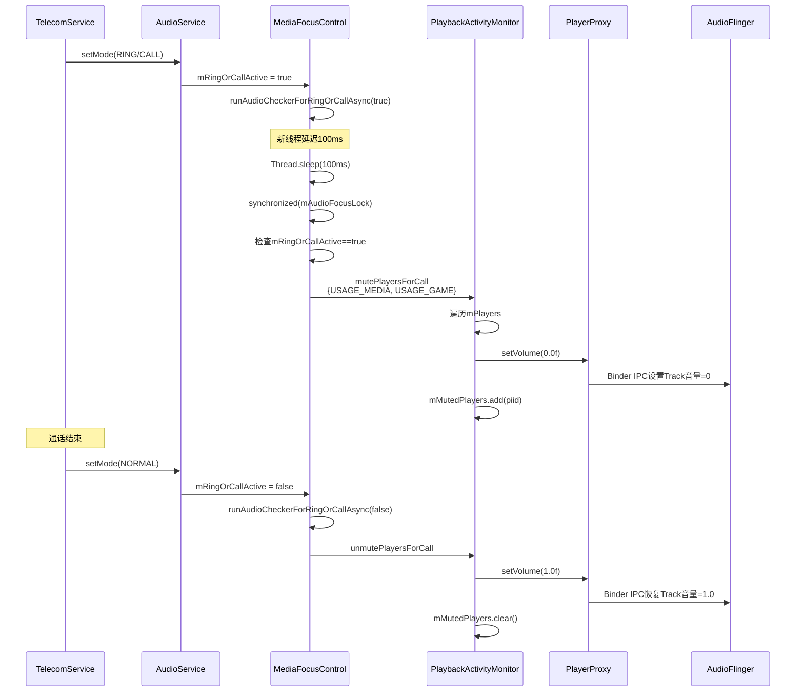

## 12.9 通话Muting机制

> [← 上一个](12_12.8_Audio_Focus全栈调用链.md) | [← 返回12章](README.md) | [返回导航](../README.md) | [下一个 →](12_12.10_FadeOutManager深度解析.md)

---

通话Muting机制是Audio Focus框架级执行的第三条路径（Duck/FadeOut/Mute），专门处理来电(RING)和通话(CALL)场景下对媒体/游戏播放的静音。与Duck的音量衰减和FadeOut的淡出不同，Mute直接将播放器音量设为0。

### 12.9.1 通话Muting触发架构



### 12.9.2 ENFORCE_MUTING_FOR_RING_OR_CALL开关

源码位置：[`MediaFocusControl.java`](frameworks/base/services/core/java/com/android/server/audio/MediaFocusControl.java:80)

```java
// L80
private static final boolean ENFORCE_MUTING_FOR_RING_OR_CALL = true;
```

| 开关值 | 行为 | 影响 |
|--------|------|------|
| true(默认) | 来电/通话时自动静音USAGE_MEDIA和USAGE_GAME播放器 | 媒体音乐在来电时被静音 |
| false | 不执行框架级Muting，完全依赖App自行响应AUDIOFOCUS_LOSS | 旧版本兼容模式 |

### 12.9.3 USAGES_TO_MUTE_IN_RING_OR_CALL

源码位置：[`MediaFocusControl.java`](frameworks/base/services/core/java/com/android/server/audio/MediaFocusControl.java:896)

```java
// L896-897
private final static int[] USAGES_TO_MUTE_IN_RING_OR_CALL =
    { AudioAttributes.USAGE_MEDIA, AudioAttributes.USAGE_GAME };
```

| Usage | 值 | 场景 | Muting行为 |
|-------|-----|------|-----------|
| USAGE_MEDIA | 1 | 音乐播放 | 来电/通话时静音 |
| USAGE_GAME | 12 | 游戏音效 | 来电/通话时静音 |

**不在Muting列表中的Usage：**

| Usage | 场景 | 原因 |
|-------|------|------|
| USAGE_NOTIFICATION | 通知 | 通话中仍需通知 |
| USAGE_VOICE_COMMUNICATION | 语音通信 | 即通话本身 |
| USAGE_ASSISTANCE_NAVIGATION_GUIDANCE | 导航 | 通话中仍需导航 |
| USAGE_ALARM | 闹钟 | 闹钟不应被静音 |
| USAGE_ASSISTANT | 助手 | 助手可能需要响应 |
| USAGE_SAFETY/EMERGENCY | 安全/紧急 | 绝对不能静音 |

### 12.9.4 runAudioCheckerForRingOrCallAsync详解

源码位置：[`MediaFocusControl.java`](frameworks/base/services/core/java/com/android/server/audio/MediaFocusControl.java:1192)

```java
// L1192-1213
private void runAudioCheckerForRingOrCallAsync(final boolean enteringRingOrCall) {
    new Thread() {
        public void run() {
            if (enteringRingOrCall) {
                try {
                    Thread.sleep(RING_CALL_MUTING_ENFORCEMENT_DELAY_MS); // L1197: 延迟100ms
                } catch (InterruptedException e) { }
            }
            synchronized (mAudioFocusLock) {
                // 重新检查mRingOrCallActive，因为状态可能已变
                if (mRingOrCallActive) {
                    mFocusEnforcer.mutePlayersForCall(USAGES_TO_MUTE_IN_RING_OR_CALL);
                } else {
                    mFocusEnforcer.unmutePlayersForCall();
                }
            }
        }
    }.start();
}
```

**关键设计要点：**

| 要点 | 说明 |
|------|------|
| 异步线程 | 避免在AudioMode切换的关键路径上阻塞 |
| 延迟100ms | 给App时间自行暂停播放，避免框架与App双重操作 |
| 重新检查 | 延迟后再次检查mRingOrCallActive，防止状态已变 |
| 持有mAudioFocusLock | 与焦点栈操作互斥，保证一致性 |
| enteringRingOrCall=false时不延迟 | 退出通话时立即unmute |

### 12.9.5 mutePlayersForCall源码解析

源码位置：[`PlaybackActivityMonitor.java`](frameworks/base/services/core/java/com/android/server/audio/PlaybackActivityMonitor.java:831)

```java
// L831-867
public void mutePlayersForCall(int[] usagesToMute) {
    synchronized (mPlayerLock) {
        final Set<Integer> piidSet = mPlayers.keySet();
        final Iterator<Integer> piidIterator = piidSet.iterator();
        while (piidIterator.hasNext()) {
            final Integer piid = piidIterator.next();
            final AudioPlaybackConfiguration apc = mPlayers.get(piid);
            if (apc == null) continue;
            final int playerUsage = apc.getAudioAttributes().getUsage();
            boolean mute = false;
            for (int usageToMute : usagesToMute) {
                if (playerUsage == usageToMute) {
                    mute = true;
                    break;
                }
            }
            if (mute) {
                apc.getPlayerProxy().setVolume(0.0f);  // L859: 直接设音量为0
                mMutedPlayers.add(new Integer(piid));   // L860: 记录已静音播放器
            }
        }
    }
}
```

**执行流程：**

1. 遍历所有活跃播放器(mPlayers)
2. 检查每个播放器的Usage是否在usagesToMute中
3. 匹配则调用`PlayerProxy.setVolume(0.0f)`直接静音
4. 将piid加入mMutedPlayers集合

### 12.9.6 unmutePlayersForCall源码解析

源码位置：[`PlaybackActivityMonitor.java`](frameworks/base/services/core/java/com/android/server/audio/PlaybackActivityMonitor.java:869)

```java
// L869-893
public void unmutePlayersForCall() {
    synchronized (mPlayerLock) {
        if (mMutedPlayers.isEmpty()) return;
        for (int piid : mMutedPlayers) {
            final AudioPlaybackConfiguration apc = mPlayers.get(piid);
            if (apc != null) {
                apc.getPlayerProxy().setVolume(1.0f);  // L884: 恢复音量为1.0
            }
        }
        mMutedPlayers.clear();
    }
}
```

**恢复特点：**

| 特点 | 说明 |
|------|------|
| 直接恢复到1.0 | 无渐变，瞬间恢复 |
| 仅恢复mMutedPlayers | 只恢复被Mute静音的播放器 |
| 播放器可能已不存在 | apc==null时跳过，不报错 |
| clear()清空记录 | unmute后mMutedPlayers为空 |

### 12.9.7 mMutedPlayers数据结构



- `mMutedPlayers`: HashSet\<Integer\>，存储被通话Mute的播放器piid
- 与`mDuckedApps`(DuckingManager)和`mFadedApps`(FadeOutManager)独立管理
- 同一播放器可能同时出现在mMutedPlayers和mDuckedApps中（但实际不会，因为通话Mute优先级更高）

### 12.9.8 通话Muting完整时序



### 12.9.9 Mute vs Duck vs FadeOut对比

| 维度 | Mute | Duck | FadeOut |
|------|------|------|---------|
| 触发场景 | 来电/通话 | 导航/助手获得焦点 | 媒体失去焦点(非Duck) |
| 音量操作 | setVolume(0.0f) | applyVolumeShaper(DUCK) | applyVolumeShaper(FADEOUT) |
| 衰减量 | 100%(静音) | 14dB或35dB | 渐变到0 |
| 恢复方式 | setVolume(1.0f)瞬间 | applyVolumeShaper(REVERSE) | applyVolumeShaper(REVERSE) |
| 延迟触发 | 100ms | 无延迟 | 无延迟 |
| 执行器 | PAM直接执行 | DuckingManager | FadeOutManager |
| 管理集合 | mMutedPlayers | mDuckedApps | mFadedApps |
| ENFORCE开关 | ENFORCE_MUTING | ENFORCE_DUCKING | ENFORCE_FADEOUT |
| 是否有Limbo | 否 | 否 | 是(2s延迟) |

### 12.9.10 RING_CALL_MUTING_ENFORCEMENT_DELAY_MS设计

```java
// L891
private static final int RING_CALL_MUTING_ENFORCEMENT_DELAY_MS = 100;
```

**100ms延迟的设计意图：**

1. **App优先响应**：App收到AUDIOFOCUS_LOSS后通常自行暂停，100ms给App处理时间
2. **避免双重操作**：如果App已暂停，框架Mute不会产生额外效果
3. **兜底保护**：如果App未响应Loss(如bug或延迟)，框架确保静音
4. **不能太长**：100ms足够短，不会让用户听到明显的媒体播放

### 12.9.11 通话Muting与AudioMode联动

| AudioMode | mRingOrCallActive | Muting行为 |
|-----------|-------------------|-----------|
| NORMAL | false | 不Mute / 执行unmute |
| RINGTONE | true | 执行mute |
| IN_CALL | true | 执行mute |
| IN_COMMUNICATION | false | 不Mute(VoIP不由框架Mute) |

**注意：** IN_COMMUNICATION模式（VoIP）不触发通话Muting，因为VoIP的焦点交互通过标准焦点Loss传播处理。

### 12.9.12 边界条件

| 条件 | 处理 |
|------|------|
| 快速进入/退出通话 | 延迟后重新检查mRingOrCallActive，可能跳过mute |
| 播放器在Mute期间结束 | unmute时apc==null，跳过 |
| 新播放器在通话中启动 | mutePlayersForCall遍历mPlayers时会覆盖新播放器 |
| 同一App多个播放器 | 按piid独立管理，每个都静音 |
| ENFORCE_MUTING=false | 完全跳过，依赖App自行响应 |

---

[← 上一个](12_12.8_Audio_Focus全栈调用链.md) | [← 返回12章](README.md) | [返回导航](../README.md) | [下一个 →](12_12.10_FadeOutManager深度解析.md)