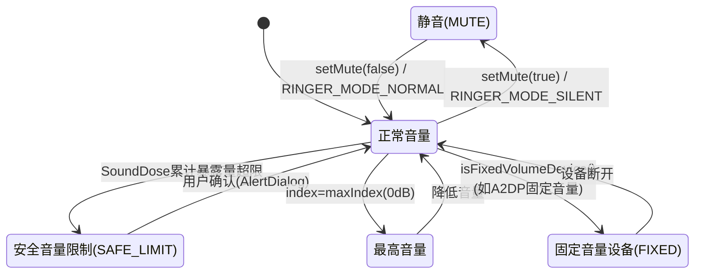
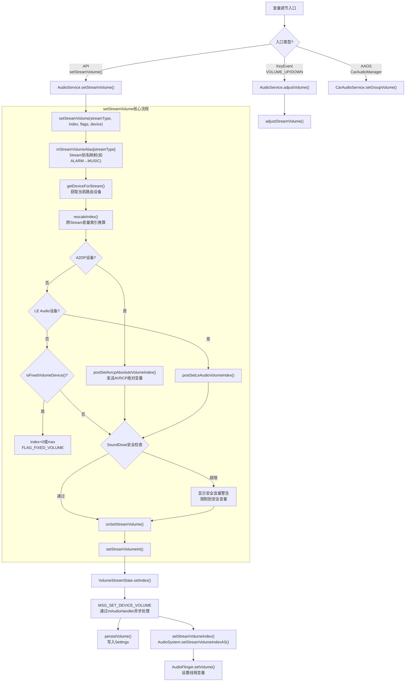
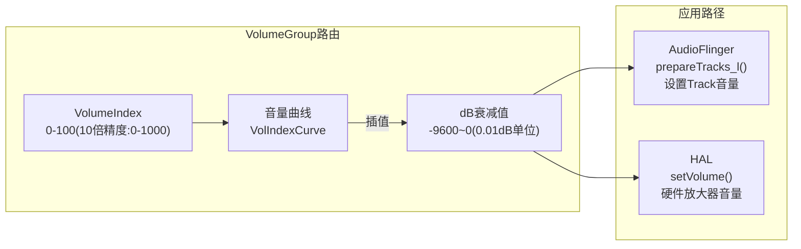
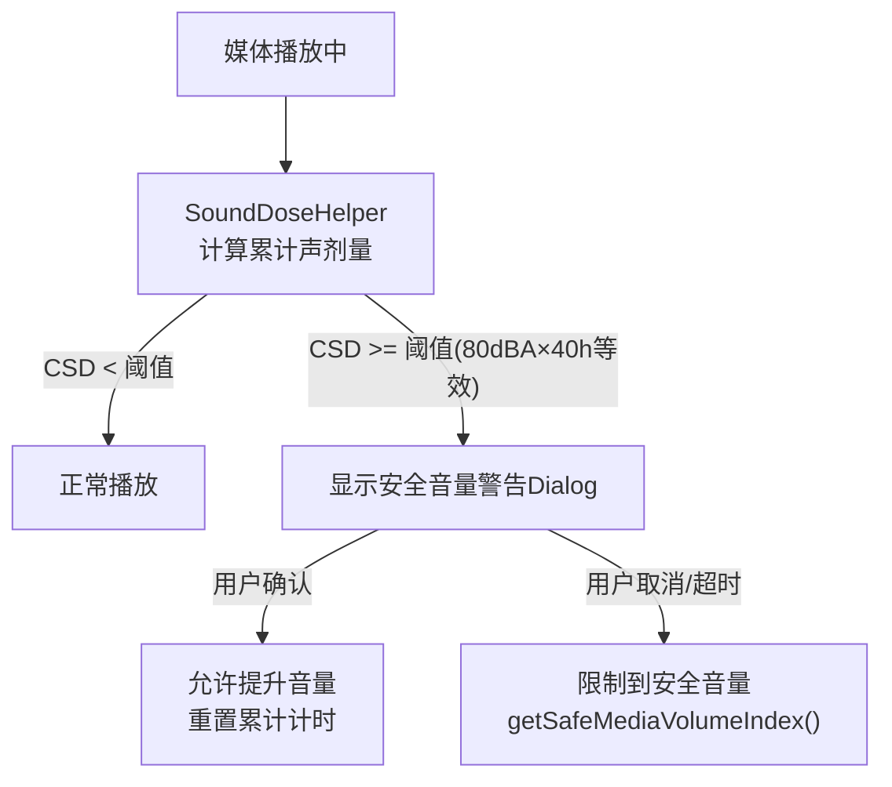
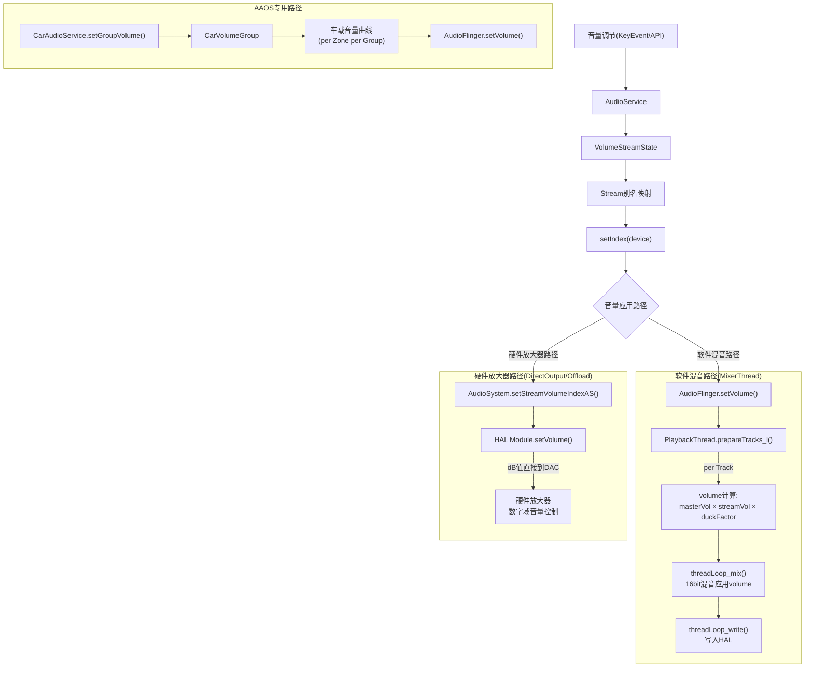
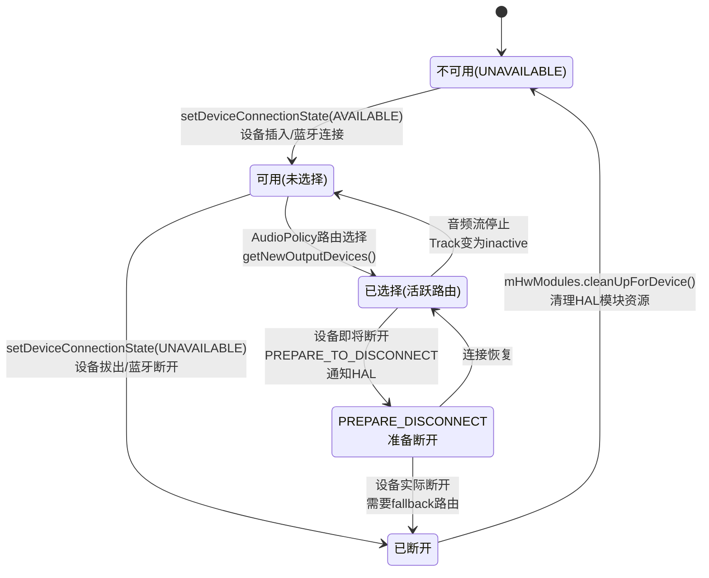
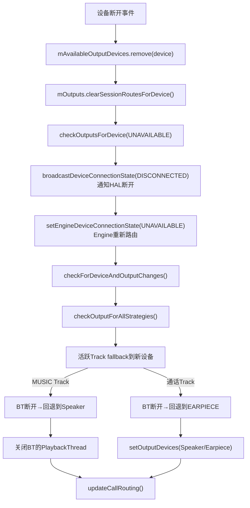
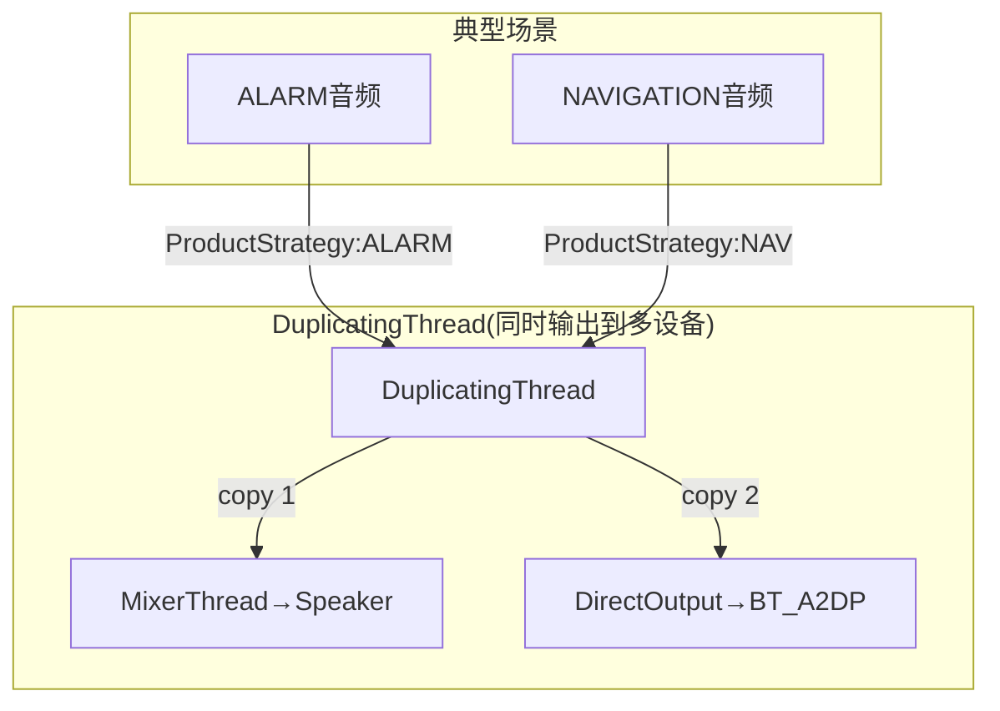

# 第十三篇：Volume & Device 深度解析

> [← 上一篇：Audio Focus](12_Audio_Focus_Deep_Dive.md) | [返回导航](README.md) | [下一篇：Bluetooth Audio →](14_Bluetooth_Audio.md)

---

音量控制和设备路由是Audio系统最复杂的交互机制之一。本篇从状态机、全栈调用链、路由迁移三个维度深度解析。

## 13.1 Volume状态机

### 13.1.1 完整音量状态机（含SoundDose安全机制）



### 13.1.2 音量调节完整流程



**关键源码位置**:
- [`AudioService.setStreamVolume()`](frameworks/base/services/core/java/com/android/server/audio/AudioService.java:4457): 音量设置入口
- [`AudioService.setStreamVolumeInt()`](frameworks/base/services/core/java/com/android/server/audio/AudioService.java:4789): 实际设置
- [`VolumeStreamState.setIndex()`](frameworks/base/services/core/java/com/android/server/audio/AudioService.java:8467): 索引更新

### 13.1.3 Stream别名映射

Android通过`mStreamVolumeAlias`实现多个Stream共享同一音量设置：

| 实际Stream | 别名映射(默认) | 别名映射(通话中) | 说明 |
|-----------|---------------|-----------------|------|
| STREAM_VOICE_CALL | STREAM_VOICE_CALL | STREAM_VOICE_CALL | 通话音量独立 |
| STREAM_SYSTEM | STREAM_MUSIC | STREAM_MUSIC | 系统音跟随媒体 |
| STREAM_RING | STREAM_RING | STREAM_RING | 铃声音量独立 |
| STREAM_MUSIC | STREAM_MUSIC | STREAM_MUSIC | 媒体音量 |
| STREAM_ALARM | STREAM_MUSIC | STREAM_ALARM | 闹钟跟随媒体(默认)/独立(通话) |
| STREAM_NOTIFICATION | STREAM_MUSIC | STREAM_NOTIFICATION | 通知跟随媒体(默认)/独立(通话) |
| STREAM_DTMF | STREAM_MUSIC | STREAM_MUSIC | DTMF跟随媒体 |
| STREAM_ASSISTANT | STREAM_MUSIC | STREAM_MUSIC | 助手跟随媒体 |

### 13.1.4 音量曲线与dB映射



**音量曲线插值规则**:
- 曲线定义在`audio_policy_volumes.xml`或`default_volume_tables.xml`
- 每个设备类别(HEADSET/SPEAKER/HEARING_AID)有独立曲线
- 曲线以`(index, dB)`键值对定义，中间值线性插值
- `0 index` = 完全静音(实际约为-9600 = -96dB)
- `MAX index` = 0dB(无衰减)

### 13.1.5 SoundDose安全音量机制

AOSP14引入CSD(Cumulative Sound Dose)安全音量机制，基于IEC 62368-1标准：



**关键参数**:
- 安全音量阈值: 80dBA等效暴露40小时
- 警告间隔: 首次超过安全音量时弹出
- 用户确认后: 允许短时超限，累计计时重新开始
- 固定音量设备(A2DP): `FLAG_FIXED_VOLUME`，音量只有0或max

### 13.1.6 Volume调节全栈调用链

```mermaid
sequenceDiagram
    participant KE, AS, APM, VG, AF, HAL
    KE->>AS: KeyEvent(VOL_UP)
    AS->>AS: adjustSuggestedStreamVolume()
    AS->>APM: setVolumeIndexForAttributes() [Binder]
    APM->>VG: VolumeGroup查找 + 曲线插值
    VG-->>APM: dB衰减值
    APM->>AF: setStreamVolume() [Binder]
    AF->>AF: PlaybackThread.setVolume()
    AF->>HAL: StreamOutHalInterface.setVolume(dB)
```

### 13.1.7 Volume如何影响Playback — 双路径应用



> **关键区别**: MixerThread在混音时应用volume(软件乘法)，DirectOutput/OffloadThread通过HAL.setVolume()直接设置硬件音量(零拷贝路径不变)

---

## 13.2 Device状态机

### 13.2.1 设备完整生命周期状态机



### 13.2.2 设备连接→路由迁移完整流程

```mermaid
sequenceDiagram
    participant HAL, APM, Engine, AF, Track1, Track2
    HAL->>APM: setDeviceConnectionState(AVAILABLE)<br/>BT_A2DP连接
    APM->>APM: mAvailableOutputDevices.add(device)
    APM->>APM: broadcastDeviceConnectionState(CONNECTED)<br/>通知HAL查询动态参数
    APM->>APM: checkOutputsForDevice()<br/>为新设备打开输出
    APM->>Engine: setEngineDeviceConnectionState(AVAILABLE)
    Engine->>Engine: 重评估所有Strategy路由
    APM->>APM: checkForDeviceAndOutputChanges()
    APM->>APM: checkOutputForAllStrategies()
    Note over APM: Track1(MUSIC)→迁移到BT<br/>Track2(ALARM)→保持Speaker
    APM->>AF: openOutput(BT_A2DP)<br/>创建新PlaybackThread
    APM->>APM: setOutputDevices(Track1→BT)<br/>force=true(强制迁移)
    APM->>AF: 为Track1创建新Track<br/>在新BT Thread上
    APM->>Track1: 迁移到新Thread<br/>无缝衔接播放
    APM->>AF: 关闭旧DirectOutput<br/>如果不再需要
    APM->>APM: updateCallRouting()<br/>更新通话路由
```

**关键源码位置**: [`AudioPolicyManager.setDeviceConnectionStateInt()`](frameworks/av/services/audiopolicy/managerdefault/AudioPolicyManager.cpp:175)

### 13.2.3 设备断开→Fallback路由流程



### 13.2.4 Device Routing全栈调用链

```mermaid
sequenceDiagram
    participant BTApp, AS, Broker, APS, APM, Eng, AF, HAL
    BTApp->>AS: setDeviceConnectionState(A2DP, AVAILABLE)
    AS->>Broker: AudioDeviceBroker入队
    Broker->>APS: setDeviceConnectionState() [Binder]
    APS->>APM: setDeviceConnectionStateInt()
    APM->>APM: mAvailableOutputDevices.add(BT)
    APM->>APM: checkOutputsForDevice()
    APM->>Eng: 重评估活跃Track路由
    Eng-->>APM: 部分Track→BT
    APM->>AF: openOutput() [Binder]
    AF->>HAL: openOutputStream(A2DP)
    HAL-->>AF: StreamOutHalInterface
    APM->>APM: 迁移活跃Track到BT输出
```

### 13.2.5 设备类型与路由优先级

| 设备类别 | 典型设备 | 路由优先级 | 说明 |
|----------|----------|-----------|------|
| 有线耳机 | HEADSET/HEADPHONES | 高(插入即用) | 3.5mm有线耳机 |
| A2DP蓝牙 | A2DP_SINK | 高(配对即用) | 经典蓝牙音频 |
| LE Audio | BLE_HEADSET/BLE_SPEAKER | 高 | 低功耗蓝牙音频 |
| USB | USB_DEVICE/USB_ACCESSORY | 中 | USB音频设备 |
| 内置扬声器 | SPEAKER/SPEAKER_SAFE | 低(默认) | 设备内置扬声器 |
| 听筒 | EARPIECE | 低(仅通话) | 手机听筒 |
| Hearing Aid | HEARING_AID | 高 | 助听器 |

> **路由选择规则**: Engine根据ProductStrategy+Usage+可用设备集合选择最佳路由。MUSIC策略优先选A2DP/BLE，CALL策略优先选EARPIECE/BT。

### 13.2.6 DuplicatingThread多设备输出



**DuplicatingThread规则**:
- 当ProductStrategy要求同时输出到多个设备时启用
- 典型场景: ALARM必须同时输出到Speaker+BT
- 数据被复制到两个下游Thread独立混音
- 每个下游Thread独立应用音量和Effect

---

## 13.3 Focus+Device+Volume联合交互场景

| 场景 | Focus变化 | Device变化 | Volume变化 | 最终效果 |
|------|-----------|-----------|-----------|---------|
| BT连接听歌 | 无变化 | MUSIC→迁移到BT | MUSIC音量→BT音量曲线 | 无缝迁移到BT输出 |
| 导航播报 | MUSIC→LOSS_TRANSIENT_CAN_DUCK | 无变化 | MUSIC被duck→-20dB | 音乐duck+导航播报 |
| 来电铃声 | MUSIC→LOSS | RING→Speaker | RING音量独立 | 音乐停止+铃声从Speaker出 |
| 紧急警报 | *→EXCLUSIVE(强制) | EMERGENCY→Speaker | EMERGENCY最大音量 | 所有其他音频停止+警报全量 |
| BT断开通话 | 无变化 | CALL→回退Earpiece | CALL音量→Earpiece曲线 | 通话无缝回退到听筒 |
| 语音助手 | MUSIC→LOSS_TRANSIENT_CAN_DUCK | ASSISTANT→保持当前 | MUSIC被duck | 音乐duck+助手语音叠加 |

---

## 13.4 外部音频设备 — USB/HDMI/有线设备管理

### 13.4.1 USB Audio设备

USB音频设备通过ALSA驱动接入，由`UsbAlsaManager`管理生命周期。

```mermaid
flowchart TB
    subgraph "USB Audio连接流程"
        USB_INSERT["USB设备插入"] --> UEVENT["内核uevent<br/>(/dev/snd/pcmCxDxp)"]
        UEVENT --> UAM["UsbAlsaManager<br/>(USB Service进程)"]
        UAM --> PARSE["AlsaCardsParser解析<br/>USB声卡信息"]
        PARSE --> DENYLIST{"设备在DenyList?"}
        DENYLIST -->|"是(如PS手柄)"| IGNORE["忽略该设备"]
        DENYLIST -->|"否"| CREATE["创建UsbAlsaDevice<br/>(card=deviceAddr, device=0)"]
        CREATE --> NOTIFY["notifyAudioDeviceAdded()<br/>→ AudioService"]
        NOTIFY --> AS["AudioService<br/>setWiredDeviceConnectionState()"]
        AS --> ADB["AudioDeviceBroker<br/>队列化处理"]
        ADB --> APS["AudioPolicyService<br/>setDeviceConnectionState()"]
        APS --> APM["AudioPolicyManager<br/>路由评估"]
        APM --> NEW_ROUTE["新路由: →USB_DEVICE"]
        NEW_ROUTE --> AF_PATCH["AudioFlinger<br/>createAudioPatch()"]
        AF_PATCH --> HAL_USB["HAL: audio.usb.xxx.so<br/>openInputStream/OutputStream"]
    end
```



**源码位置**: [`UsbAlsaManager.java`](frameworks/base/services/usb/java/com/android/server/usb/UsbAlsaManager.java)

**USB设备DenyList** — 避免非音频设备干扰:

| Vendor | Product | 阻止 | 原因 |
|--------|---------|------|------|
| Sony(0x054C) | PS4 ZCT1(0x05C4) | 输出 | 无音量控制，当作音频设备使用会出问题 |
| Sony(0x054C) | PS4 ZCT2(0x09CC) | 输出 | 同上 |
| Sony(0x054C) | PS5(0x0CE6) | 输出 | 同上 |

**多USB模式**: `ro.audio.multi_usb_mode=true`时支持同时连接多个USB音频设备，按设备类型栈管理(`mAttachedDevices`)。

### 13.4.2 有线设备与数字输出

| 设备类型 | AudioSystem常量 | 连接检测 | 路由优先级 |
|---------|----------------|---------|----------|
| 有线耳机 | `DEVICE_OUT_WIRED_HEADSET` | 内核switch/h2w | 最高 |
| 有线耳机(仅输出) | `DEVICE_OUT_WIRED_HEADPHONE` | 内核switch/h2w | 最高 |
| USB音频 | `DEVICE_OUT_USB_DEVICE` | USB uevent | 高 |
| USB附件 | `DEVICE_OUT_USB_ACCESSORY` | USB uevent | 高 |
| HDMI | `DEVICE_OUT_HDMI` | HDMI热插拔 | 中 |
| DisplayPort | `DEVICE_OUT_HDMI_ARC` | DP热插拔 | 中 |

**有线/USB设备与蓝牙的路由优先级**(AudioPolicyManager):

```
有线耳机(WIRED_HEADSET) > USB(USB_DEVICE) > 蓝牙A2DP(BT_A2DP) > 扬声器(SPEAKER)
```

> **关键交互**: 设备插入→AudioDeviceBroker接收事件→AudioPolicyManager评估路由→AudioFlinger切换Thread输出设备→可能创建/销毁AudioPatch。USB音频HAL(`audio.usb.xxx.so`)是独立模块，不与primary HAL共享。

---

> [← 上一篇：Audio Focus](12_Audio_Focus_Deep_Dive.md) | [返回导航](README.md) | [下一篇：Bluetooth Audio →](14_Bluetooth_Audio.md)