# 第十三篇：Volume & Device 深度解析

> [← 上一篇：Audio Focus](12_Audio_Focus_Deep_Dive.md) | [返回导航](README.md) | [下一篇：Bluetooth Audio →](14_Bluetooth_Audio.md)

---

音量控制和设备路由是Audio系统最复杂的交互机制之一。本篇从状态机、全栈调用链、路由迁移三个维度深度解析。

## 13.1 Volume状态机

### 13.1.1 完整音量状态机（含SoundDose安全机制）

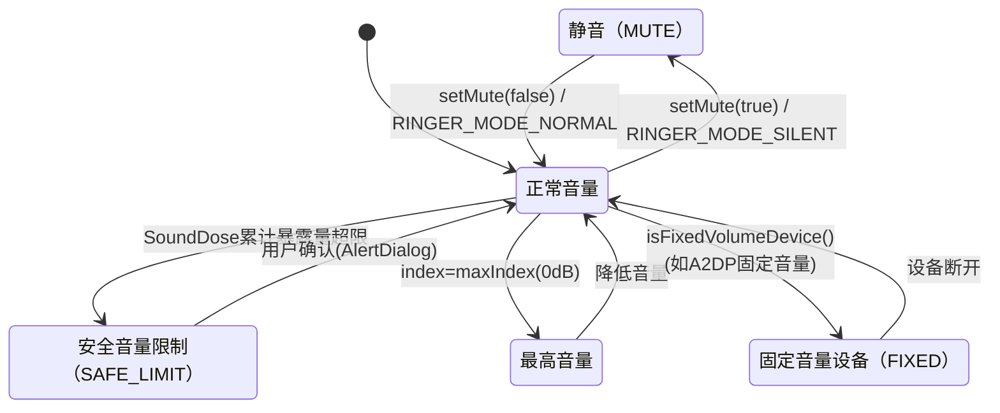

### 13.1.2 音量调节完整流程

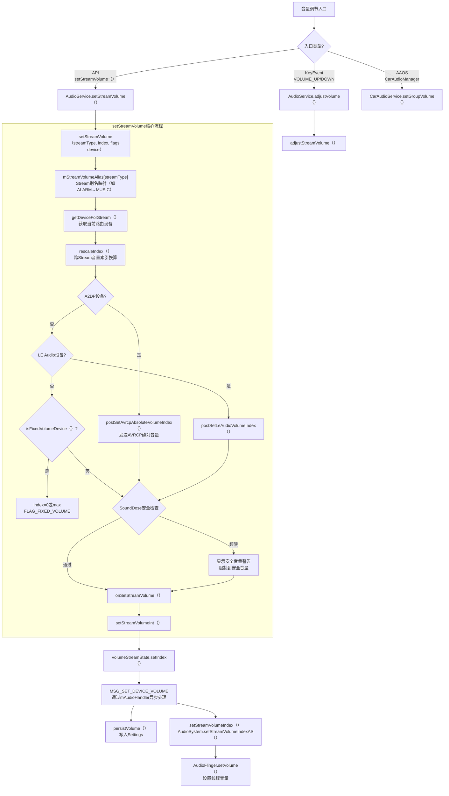

**关键源码位置**:
- [`AudioService.setStreamVolume()`](frameworks/base/services/core/java/com/android/server/audio/AudioService.java:4457): 音量设置入口
- [`AudioService.setStreamVolumeInt()`](frameworks/base/services/core/java/com/android/server/audio/AudioService.java:4789): 实际设置
- [`VolumeStreamState.setIndex()`](frameworks/base/services/core/java/com/android/server/audio/AudioService.java:8467): 索引更新

### 13.1.3 Stream别名映射

Android通过`mStreamVolumeAlias`实现多个Stream共享同一音量设置：

| 实际Stream | 别名映射(默认) | 别名映射(通话中) | 说明 |
|-----------|---------------|-----------------|------|
| STREAM_VOICE_CALL | STREAM_VOICE_CALL | STREAM_VOICE_CALL | 通话音量独立 |
| STREAM_SYSTEM | STREAM_MUSIC | STREAM_MUSIC | 系统音跟随媒体 |
| STREAM_RING | STREAM_RING | STREAM_RING | 铃声音量独立 |
| STREAM_MUSIC | STREAM_MUSIC | STREAM_MUSIC | 媒体音量 |
| STREAM_ALARM | STREAM_MUSIC | STREAM_ALARM | 闹钟跟随媒体(默认)/独立(通话) |
| STREAM_NOTIFICATION | STREAM_MUSIC | STREAM_NOTIFICATION | 通知跟随媒体(默认)/独立(通话) |
| STREAM_DTMF | STREAM_MUSIC | STREAM_MUSIC | DTMF跟随媒体 |
| STREAM_ASSISTANT | STREAM_MUSIC | STREAM_MUSIC | 助手跟随媒体 |

### 13.1.4 音量曲线与dB映射

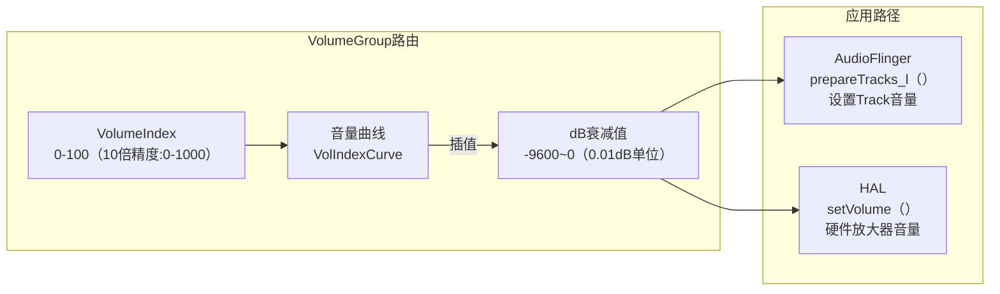

**音量曲线插值规则**:
- 曲线定义在`audio_policy_volumes.xml`或`default_volume_tables.xml`
- 每个设备类别(HEADSET/SPEAKER/HEARING_AID)有独立曲线
- 曲线以`(index, dB)`键值对定义，中间值线性插值
- `0 index` = 完全静音(实际约为-9600 = -96dB)
- `MAX index` = 0dB(无衰减)

### 13.1.5 SoundDose安全音量机制

AOSP14引入CSD(Cumulative Sound Dose)安全音量机制，基于IEC 62368-1标准：

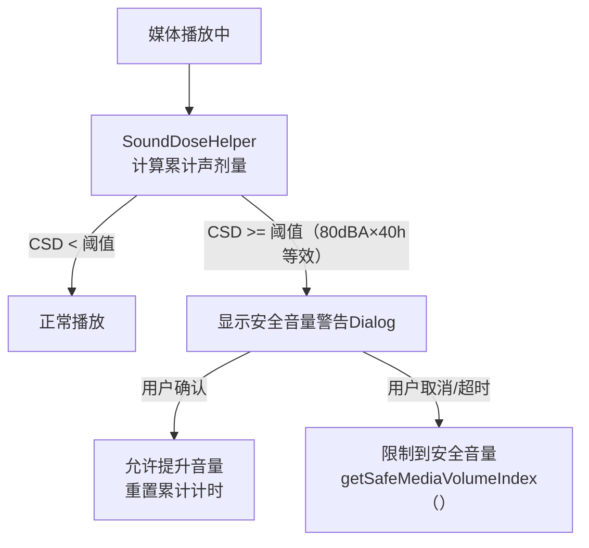

**关键参数**:
- 安全音量阈值: 80dBA等效暴露40小时
- 警告间隔: 首次超过安全音量时弹出
- 用户确认后: 允许短时超限，累计计时重新开始
- 固定音量设备(A2DP): `FLAG_FIXED_VOLUME`，音量只有0或max

### 13.1.6 Volume调节全栈调用链

```mermaid
sequenceDiagram
    participant KE, AS, APM, VG, AF, HAL
    KE->>AS: KeyEvent(VOL_UP)
    AS->>AS: adjustSuggestedStreamVolume()
    AS->>APM: setVolumeIndexForAttributes() [Binder]
    APM->>VG: VolumeGroup查找 + 曲线插值
    VG-->>APM: dB衰减值
    APM->>AF: setStreamVolume() [Binder]
    AF->>AF: PlaybackThread.setVolume()
    AF->>HAL: StreamOutHalInterface.setVolume(dB)
```

### 13.1.7 Volume如何影响Playback — 双路径应用

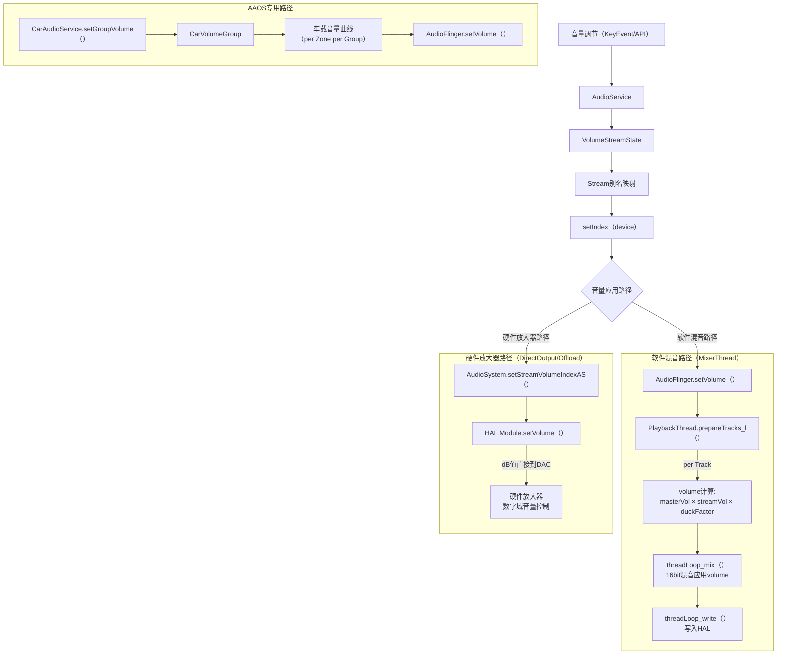

> **关键区别**: MixerThread在混音时应用volume(软件乘法)，DirectOutput/OffloadThread通过HAL.setVolume()直接设置硬件音量(零拷贝路径不变)

---

## 13.2 Device状态机

### 13.2.1 设备完整生命周期状态机

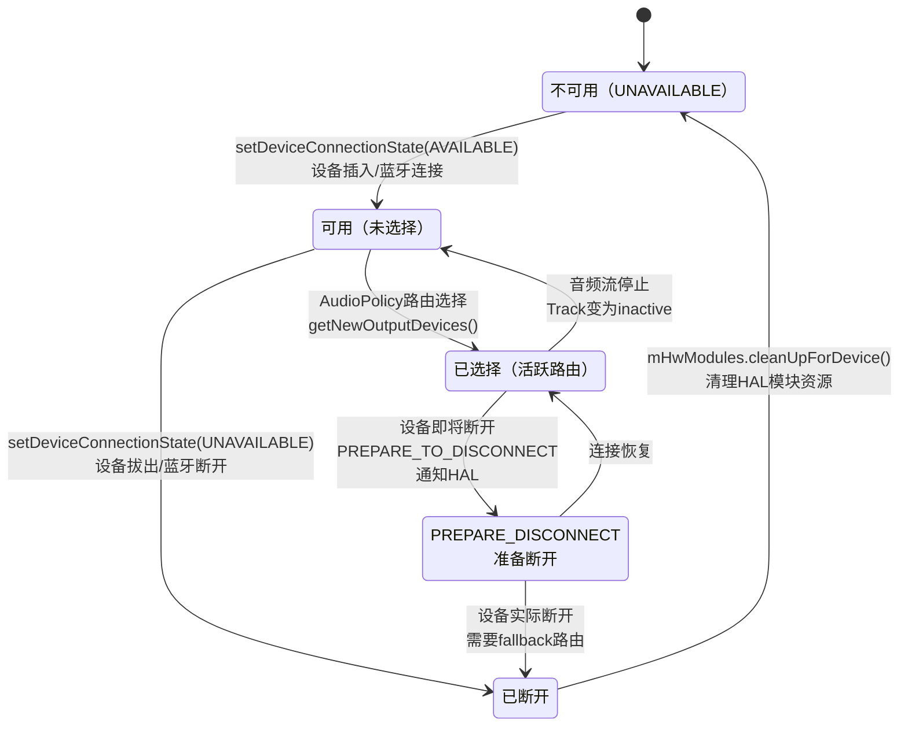

### 13.2.2 设备连接→路由迁移完整流程

```mermaid
sequenceDiagram
    participant HAL, APM, Engine, AF, Track1, Track2
    HAL->>APM: setDeviceConnectionState(AVAILABLE)<br>BT_A2DP连接
    APM->>APM: mAvailableOutputDevices.add(device)
    APM->>APM: broadcastDeviceConnectionState(CONNECTED)<br>通知HAL查询动态参数
    APM->>APM: checkOutputsForDevice()<br>为新设备打开输出
    APM->>Engine: setEngineDeviceConnectionState(AVAILABLE)
    Engine->>Engine: 重评估所有Strategy路由
    APM->>APM: checkForDeviceAndOutputChanges()
    APM->>APM: checkOutputForAllStrategies()
    Note over APM: Track1(MUSIC)→迁移到BT<br>Track2(ALARM)→保持Speaker
    APM->>AF: openOutput(BT_A2DP)<br>创建新PlaybackThread
    APM->>APM: setOutputDevices(Track1→BT)<br>force=true(强制迁移)
    APM->>AF: 为Track1创建新Track<br>在新BT Thread上
    APM->>Track1: 迁移到新Thread<br>无缝衔接播放
    APM->>AF: 关闭旧DirectOutput<br>如果不再需要
    APM->>APM: updateCallRouting()<br>更新通话路由
```

**关键源码位置**: [`AudioPolicyManager.setDeviceConnectionStateInt()`](frameworks/av/services/audiopolicy/managerdefault/AudioPolicyManager.cpp:175)

### 13.2.3 设备断开→Fallback路由流程

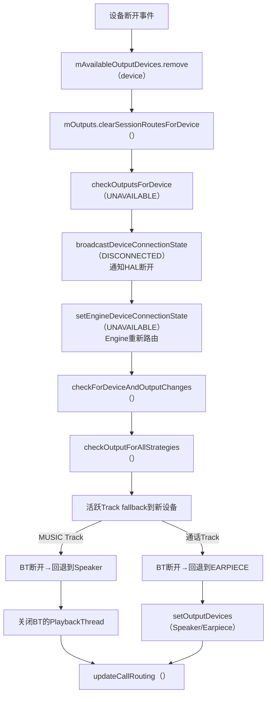

### 13.2.4 Device Routing全栈调用链

```mermaid
sequenceDiagram
    participant BTApp, AS, Broker, APS, APM, Eng, AF, HAL
    BTApp->>AS: setDeviceConnectionState(A2DP, AVAILABLE)
    AS->>Broker: AudioDeviceBroker入队
    Broker->>APS: setDeviceConnectionState() [Binder]
    APS->>APM: setDeviceConnectionStateInt()
    APM->>APM: mAvailableOutputDevices.add(BT)
    APM->>APM: checkOutputsForDevice()
    APM->>Eng: 重评估活跃Track路由
    Eng-->>APM: 部分Track→BT
    APM->>AF: openOutput() [Binder]
    AF->>HAL: openOutputStream(A2DP)
    HAL-->>AF: StreamOutHalInterface
    APM->>APM: 迁移活跃Track到BT输出
```

---

## 13.3 Focus+Device+Volume联合交互场景

| 场景 | Focus变化 | Device变化 | Volume变化 | 最终效果 |
|------|-----------|-----------|-----------|---------|
| BT连接听歌 | 无变化 | MUSIC→迁移到BT | MUSIC音量→BT音量曲线 | 无缝迁移到BT输出 |
| 导航播报 | MUSIC→LOSS_TRANSIENT_CAN_DUCK | 无变化 | MUSIC被duck→-20dB | 音乐duck+导航播报 |
| 来电铃声 | MUSIC→LOSS | RING→Speaker | RING音量独立 | 音乐停止+铃声从Speaker出 |
| 紧急警报 | *→EXCLUSIVE(强制) | EMERGENCY→Speaker | EMERGENCY最大音量 | 所有其他音频停止+警报全量 |
| BT断开通话 | 无变化 | CALL→回退Earpiece | CALL音量→Earpiece曲线 | 通话无缝回退到听筒 |
| 语音助手 | MUSIC→LOSS_TRANSIENT_CAN_DUCK | ASSISTANT→保持当前 | MUSIC被duck | 音乐duck+助手语音叠加 |

---

## 13.4 外部音频设备 — USB/HDMI/有线设备管理

### 13.4.1 USB Audio设备

USB音频设备通过ALSA驱动接入，由`UsbAlsaManager`管理生命周期。

```mermaid
flowchart TB
    subgraph "USB Audio连接流程"
        USB_INSERT["USB设备插入"] --> UEVENT["内核uevent<br>（/dev/snd/pcmCxDxp）"]
        UEVENT --> UAM["UsbAlsaManager<br>（USB Service进程）"]
        UAM --> PARSE["AlsaCardsParser解析<br>USB声卡信息"]
        PARSE --> DENYLIST{"设备在DenyList?"}
        DENYLIST -->|"是（如PS手柄）"| IGNORE["忽略该设备"]
        DENYLIST -->|"否"| CREATE["创建UsbAlsaDevice<br>（card=deviceAddr, device=0）"]
        CREATE --> NOTIFY["notifyAudioDeviceAdded（）<br>→ AudioService"]
        NOTIFY --> AS["AudioService<br>setWiredDeviceConnectionState（）"]
        AS --> ADB["AudioDeviceBroker<br>队列化处理"]
        ADB --> APS["AudioPolicyService<br>setDeviceConnectionState（）"]
        APS --> APM["AudioPolicyManager<br>路由评估"]
        APM --> NEW_ROUTE["新路由: →USB_DEVICE"]
        NEW_ROUTE --> AF_PATCH["AudioFlinger<br>createAudioPatch（）"]
        AF_PATCH --> HAL_USB["HAL: audio.usb.xxx.so<br>openInputStream/OutputStream"]
    end
```

**源码位置**: [`UsbAlsaManager.java`](frameworks/base/services/usb/java/com/android/server/usb/UsbAlsaManager.java)

**USB设备DenyList** — 避免非音频设备干扰:

| Vendor | Product | 阻止 | 原因 |
|--------|---------|------|------|
| Sony(0x054C) | PS4 ZCT1(0x05C4) | 输出 | 无音量控制，当作音频设备使用会出问题 |
| Sony(0x054C) | PS4 ZCT2(0x09CC) | 输出 | 同上 |
| Sony(0x054C) | PS5(0x0CE6) | 输出 | 同上 |

**多USB模式**: `ro.audio.multi_usb_mode=true`时支持同时连接多个USB音频设备，按设备类型栈管理(`mAttachedDevices`)。

### 13.4.2 有线设备与数字输出

| 设备类型 | AudioSystem常量 | 连接检测 | 路由优先级 |
|---------|----------------|---------|----------|
| 有线耳机 | `DEVICE_OUT_WIRED_HEADSET` | 内核switch/h2w | 最高 |
| 有线耳机(仅输出) | `DEVICE_OUT_WIRED_HEADPHONE` | 内核switch/h2w | 最高 |
| USB音频 | `DEVICE_OUT_USB_DEVICE` | USB uevent | 高 |
| USB附件 | `DEVICE_OUT_USB_ACCESSORY` | USB uevent | 高 |
| HDMI | `DEVICE_OUT_HDMI` | HDMI热插拔 | 中 |
| DisplayPort | `DEVICE_OUT_HDMI_ARC` | DP热插拔 | 中 |

**有线/USB设备与蓝牙的路由优先级**(AudioPolicyManager):

```
有线耳机(WIRED_HEADSET) > USB(USB_DEVICE) > 蓝牙A2DP(BT_A2DP) > 扬声器(SPEAKER)
```

> **关键交互**: 设备插入→AudioDeviceBroker接收事件→AudioPolicyManager评估路由→AudioFlinger切换Thread输出设备→可能创建/销毁AudioPatch。USB音频HAL(`audio.usb.xxx.so`)是独立模块，不与primary HAL共享。

---

## 13.5 SoundDose与CSD声剂量管理

### 13.5.1 标准背景与核心概念

SoundDose（声剂量）是IEC 62368-1 3rd edition / EN 50332-3标准定义的听力保护机制，用于量化用户在一段时间内累积的声暴露量。该标准引入了两个关键阈值：

| 阈值 | 默认值 | 含义 |
|------|--------|------|
| **RS1** | 80 dBA | 较低参考阈值，低于此值的声暴露不计入CSD |
| **RS2** | 100 dBA | 较高警告阈值，瞬时超过此值触发立即警告 |

**CSD（Cumulative Sound Dose）**计算公式：

```
CSD = Σ(暴露时间 × MEL²) / (7天窗口 × RS2²)
```

其中：
- **MEL**（Momentary Exposure Level）：每秒计算的瞬时声暴露值（dBA）
- 只有 MEL ≥ RS1 的值才被纳入CSD计算
- CSD归一化到 `1.f = 100% CSD`，超过100%触发听力保护
- 7天滚动窗口 = 604800秒（60s × 60m × 24h × 7d）

> **核心规则**: 瞬时MEL > RS2 → 立即触发`onMomentaryExposure`回调；7天累计CSD > 100% → 逐步降低音量并弹出警告对话框。

### 13.5.2 SoundDoseManager关键代码

源码路径：[`SoundDoseManager.h`](frameworks/av/services/audioflinger/sounddose/SoundDoseManager.h)

SoundDoseManager是AudioFlinger中管理声剂量的核心类，继承自`MelProcessor::MelCallback`，同时持有`MelAggregator`实例：

```cpp
class SoundDoseManager : public audio_utils::MelProcessor::MelCallback {
public:
    static constexpr int64_t kCsdWindowSeconds = 604800;  // 7天滚动窗口
    static constexpr float kDefaultRs2UpperBound = 100.f; // 默认RS2上限(dBA)

    SoundDoseManager()
        : mMelAggregator(sp<audio_utils::MelAggregator>::make(kCsdWindowSeconds)),
          mRs2UpperBound(kDefaultRs2UpperBound) {};
```

**关键方法**：

| 方法 | 作用 |
|------|------|
| [`getOrCreateProcessorForDevice()`](frameworks/av/services/audioflinger/sounddose/SoundDoseManager.h:57) | 为指定流和设备创建/获取MelProcessor |
| [`removeStreamProcessor()`](frameworks/av/services/audioflinger/sounddose/SoundDoseManager.h:68) | 流结束时移除对应的MelProcessor |
| [`setOutputRs2UpperBound()`](frameworks/av/services/audioflinger/sounddose/SoundDoseManager.h:76) | 设置RS2上限（80-100dBA范围） |
| [`onNewMelValues()`](frameworks/av/services/audioflinger/sounddose/SoundDoseManager.h:118) | MelCallback回调：接收新的MEL值并转发给MelAggregator |
| [`onMomentaryExposure()`](frameworks/av/services/audioflinger/sounddose/SoundDoseManager.h:121) | MelCallback回调：瞬时MEL > RS2时触发警告 |

### 13.5.3 ISoundDose AIDL接口

HAL层接口路径：[`ISoundDose.aidl`](hardware/interfaces/audio/aidl/android/hardware/audio/core/sounddose/ISoundDose.aidl)

```java
@VintfStability
interface ISoundDose {
    const int DEFAULT_MAX_RS2 = 100;  // 默认RS2上限(dBA)
    const int MIN_RS2 = 80;           // RS2最低阈值(dBA)

    void setOutputRs2UpperBound(float rs2ValueDbA);  // 设置RS2上限
    float getOutputRs2UpperBound();                   // 获取RS2上限
    void registerSoundDoseCallback(IHalSoundDoseCallback callback);  // 注册HAL回调
}
```

Framework层接口路径：[`ISoundDose.aidl`](frameworks/av/media/libaudioclient/aidl/android/media/ISoundDose.aidl)

Framework层接口提供了更多功能，包括CSD重置、衰减设置等：

| 方法 | 作用 |
|------|------|
| `setOutputRs2UpperBound(float)` | 设置RS2上限（80-100dBA） |
| `resetCsd(float, SoundDoseRecord[])` | 重置CSD值和记录 |
| `updateAttenuation(float, int)` | 更新音量衰减值 |
| `getCsd()` | 获取当前CSD百分比 |
| `setCsdEnabled(bool)` | 启用/禁用CSD功能 |

### 13.5.4 听力保护触发流程

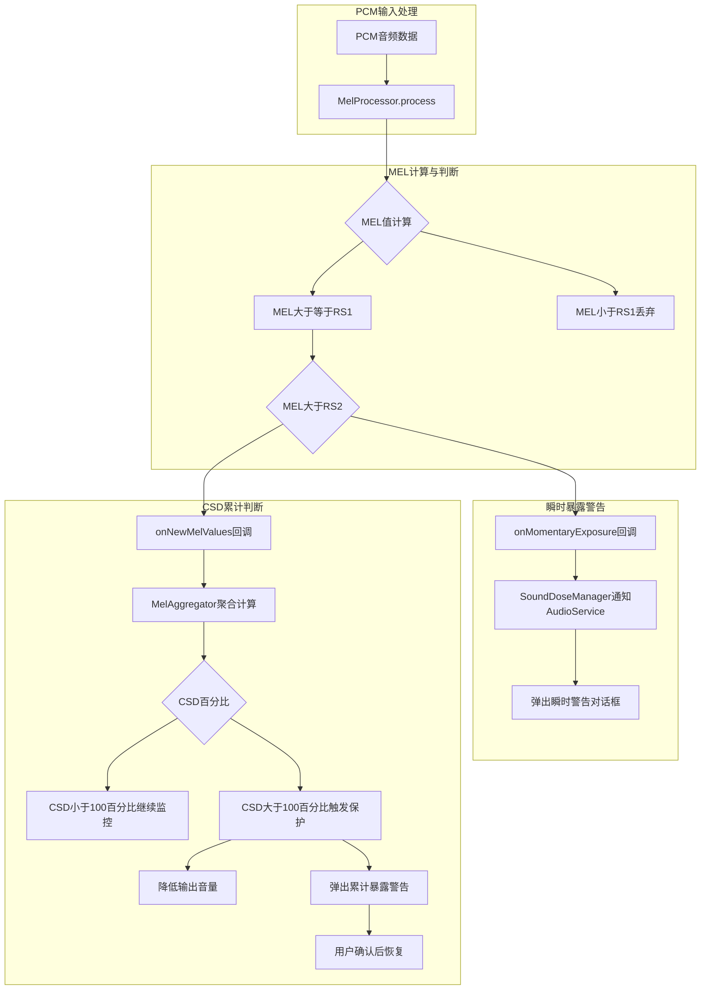

---

## 13.6 MelProcessor — MEL计算引擎

### 13.6.1 核心架构

源码路径：[`MelProcessor.h`](system/media/audio_utils/include/audio_utils/MelProcessor.h)

MelProcessor是A-weighted MEL（Momentary Exposure Level）值的核心计算器，遵循IEC 62368-1 3rd edition标准，每秒从PCM音频数据中计算一个MEL值：

```cpp
class MelProcessor : public RefBase {
public:
    static constexpr int kCascadeBiquadNumber = 3;   // 3级IIR带通滤波器模拟A-weighting
    static constexpr int32_t kMaxMelValues = 3;       // 最小增量阈值
```

**类关系图**：

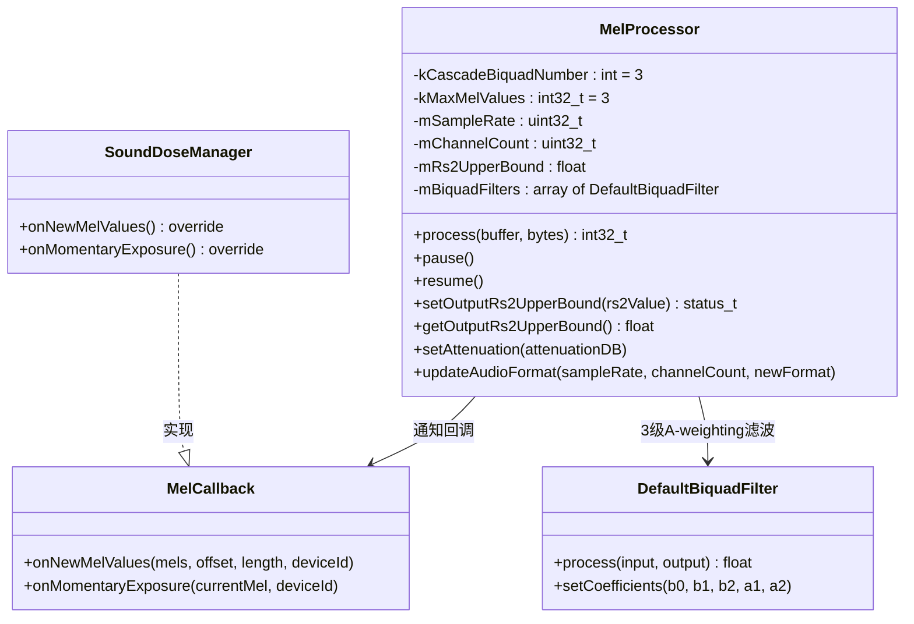

### 13.6.2 A-weighting滤波与MEL计算算法

MelProcessor使用3级级联IIR Biquad滤波器（[`BiquadFilter.h`](system/media/audio_utils/include/audio_utils/BiquadFilter.h)）来模拟A-weighting曲线，这是IEC标准中定义的频率加权方法：

**3级Biquad滤波器链**：
1. **第1级**：低频段衰减（模拟A-weighting的低频滚降特性）
2. **第2级**：中频段平坦化
3. **第3级**：高频段微衰减

每级Biquad滤波器使用Direct Form II Transpose结构（5个系数：b0, b1, b2, a1, a2），系数根据采样率预计算。

**MEL计算核心流程**：

1. **PCM输入** → 多声道混音为单声道（能量叠加）
2. **3级Biquad滤波** → A-weighted频谱
3. **能量计算** → 每秒计算1个MEL值（dBA）
4. **RS1阈值过滤** → 只有 MEL ≥ RS1(80dBA) 的值才被记录和回调
5. **RS2瞬时检测** → 任何 MEL > RS2(默认100dBA) 立即触发`onMomentaryExposure`

### 13.6.3 MelCallback接口详解

源码路径：[`MelProcessor.h:47-71`](system/media/audio_utils/include/audio_utils/MelProcessor.h:47)

```cpp
class MelCallback : public virtual RefBase {
public:
    // 批量MEL值回调：连续的MEL值（每秒1个），仅包含大于等于RS1的值
    virtual void onNewMelValues(const std::vector<float>& mels,
                                size_t offset,
                                size_t length,
                                audio_port_handle_t deviceId) const = 0;

    // 瞬时暴露回调：单个MEL值超过RS2上限时立即触发
    virtual void onMomentaryExposure(float currentMel,
                                     audio_port_handle_t deviceId) const = 0;
};
```

**回调触发条件**：
- `onNewMelValues`：当MEL缓冲区满（`kMaxMelValues = 3`个值）或出现MEL计算中断（如MEL降到RS1以下）时触发
- `onMomentaryExposure`：任何单秒的MEL值 > 当前RS2上限时立即触发

### 13.6.4 MEL计算流程图

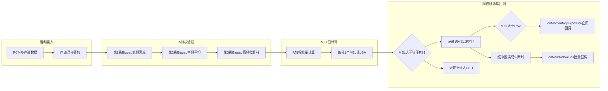

---

## 13.7 MelAggregator — CSD聚合器

### 13.7.1 核心架构

源码路径：[`MelAggregator.h`](system/media/audio_utils/include/audio_utils/MelAggregator.h)

MelAggregator负责将来自多个音频流的MEL值聚合计算CSD（Cumulative Sound Dose），支持7天滚动窗口和多流同时播放的MEL合并。

### 13.7.2 MelRecord与CsdRecord数据结构

**MelRecord**（MEL记录）：

```cpp
struct MelRecord {
    audio_port_handle_t portId;      // 音频设备端口ID
    std::vector<float> mels;         // 连续MEL值向量（大于等于RS1，每秒1个）
    int64_t timestamp;               // 第一个MEL值的时间戳

    // 检查两条MelRecord是否时间重叠
    bool overlapsEnd(const MelRecord& record) const {
        return timestamp + static_cast<int64_t>(mels.size()) > record.timestamp;
    }
};
```

**CsdRecord**（CSD记录）：

```cpp
struct CsdRecord {
    const int64_t timestamp;         // CSD值计算起始时间
    const size_t duration;           // 导致该CSD值的持续时间（秒）
    const float value;               // CSD贡献值，归一化到1.f=100%CSD
    const float averageMel;          // 导致该CSD值的平均MEL值
};
```

**类关系图**：

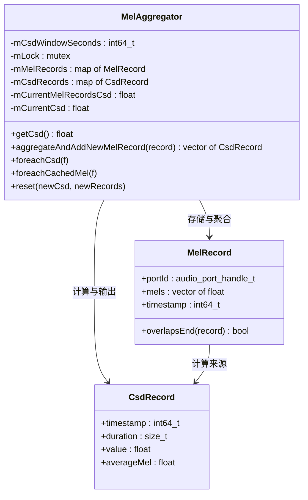

### 13.7.3 CSD聚合算法

**核心方法**：[`aggregateAndAddNewMelRecord()`](system/media/audio_utils/include/audio_utils/MelAggregator.h:114)

CSD聚合的关键步骤：

1. **多流MEL合并**：多个同时播放的音频流的MEL值按时间戳合并，相同时间戳的MEL值取能量叠加（非简单平均值）
2. **`overlapsEnd()`防重叠**：新的MelRecord与已有记录时间重叠时，裁剪旧记录的尾部，避免重复计算同一时段的声暴露
3. **7天滚动窗口裁剪**：计算CSD时，只考虑7天（604800秒）内的MelRecord，超过窗口的旧记录自动移除
4. **CSD归一化**：每条CsdRecord的`value`归一化到1.f = 100% CSD，`mCurrentCsd`为所有CsdRecord.value的累计总和

**CSD值计算公式（归一化形式）**：

```
CsdRecord.value = (duration × averageMel²) / (7天窗口 × RS2²)
```

> **重要**: 当多个流同时播放时，MelAggregator会智能合并重叠时段的MEL值。如果流A和流B在同一秒都在播放，则该秒的CSD贡献基于两个流MEL值的能量叠加。

### 13.7.4 CSD计算流程图

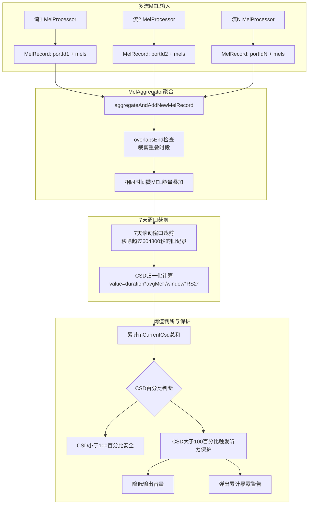

---

> [← 上一篇：Audio Focus](12_Audio_Focus_Deep_Dive.md) | [返回导航](README.md) | [下一篇：Bluetooth Audio →](14_Bluetooth_Audio.md)