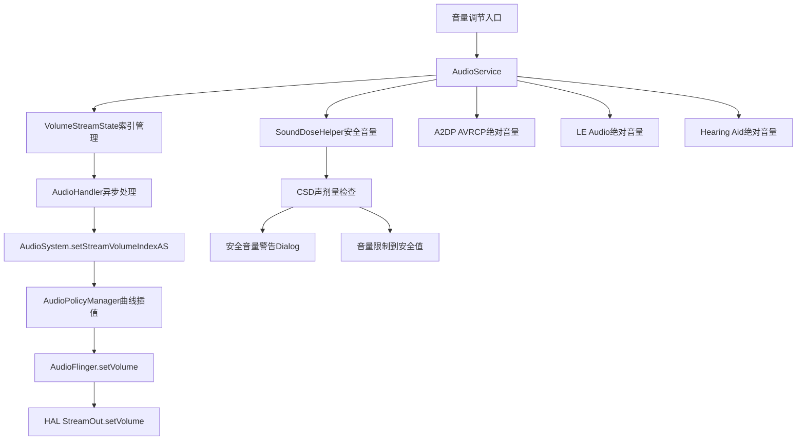
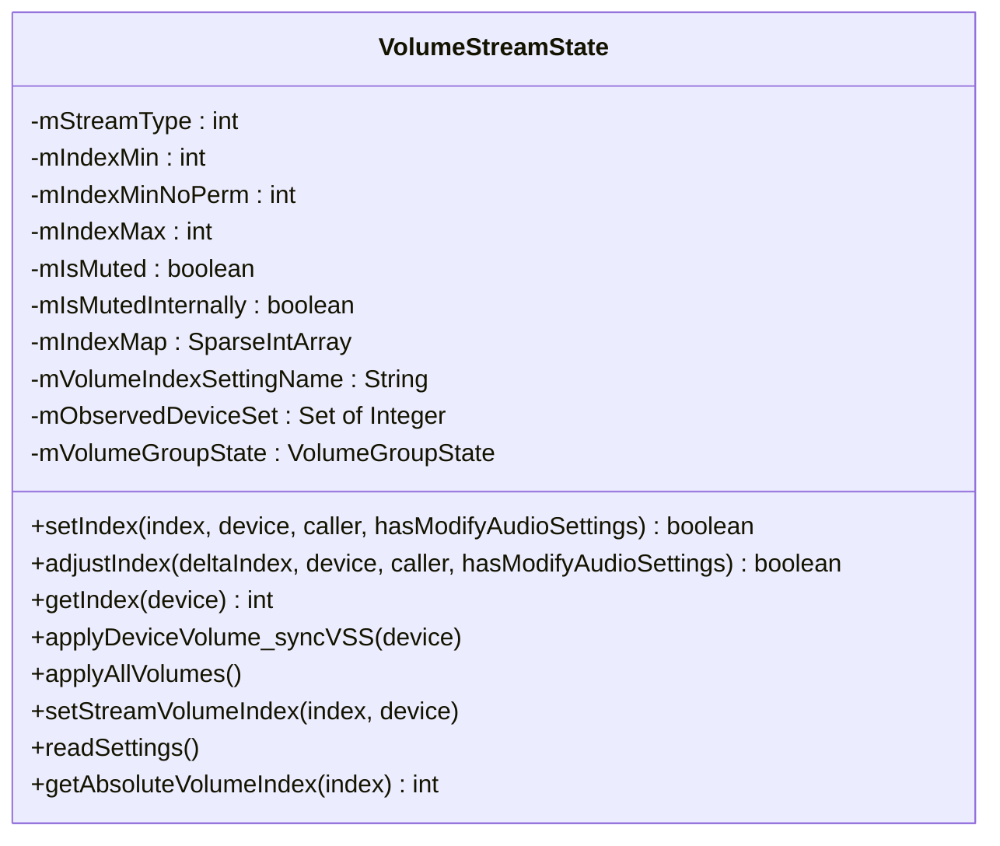
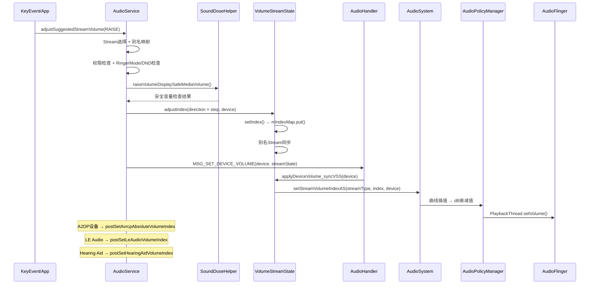
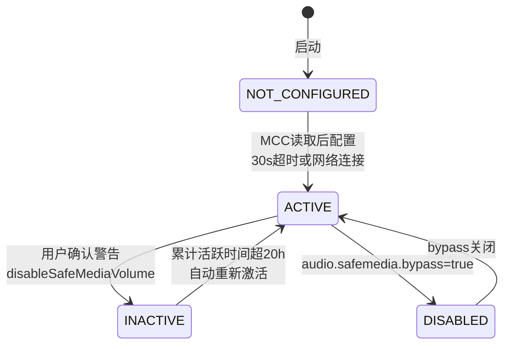
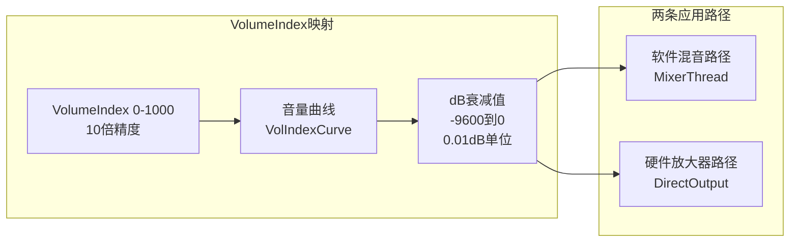
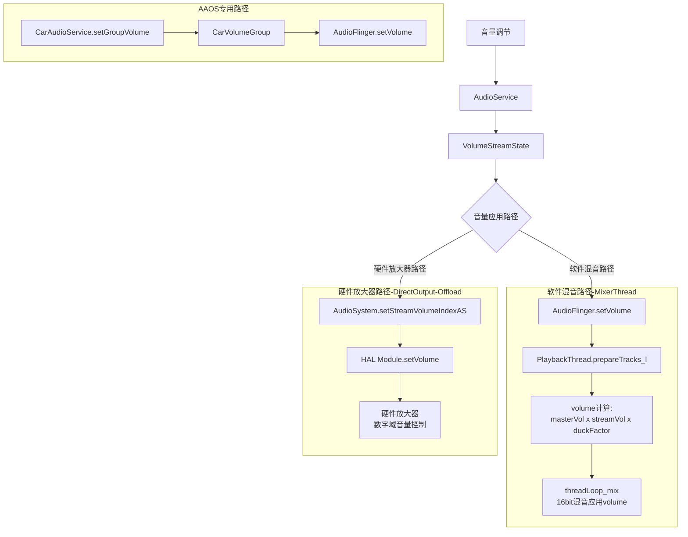

## 13.1 Volume状态机

> [← 上一篇](../12_Audio_Focus_Deep_Dive/README.md) | [返回13章](README.md) | [返回导航](../README.md) | [下一个 →](13_13.2_Device状态机.md)

---

本节深度解析AudioService中的Volume策略逻辑，包括音量调节入口、Stream别名映射、VolumeStreamState数据结构、安全音量机制、设备音量应用双路径等核心机制。VolumeController状态机已在03章3.4节详细覆盖，此处聚焦AudioService内部的Volume策略实现。

### 13.1.1 Volume策略整体架构



**核心源码文件**:
- [`AudioService.java`](frameworks/base/services/core/java/com/android/server/audio/AudioService.java:1) — 13267行，Volume/Device核心策略都在这里
- [`SoundDoseHelper.java`](frameworks/base/services/core/java/com/android/server/audio/SoundDoseHelper.java:75) — 1157行，安全音量+CSD管理

### 13.1.2 音量调节三大入口

#### adjustSuggestedStreamVolume — KeyEvent入口

[`adjustSuggestedStreamVolume()`](frameworks/base/services/core/java/com/android/server/audio/AudioService.java:3243) 是物理按键音量调节的入口方法：

```java
private void adjustSuggestedStreamVolume(int direction, int suggestedStreamType,
        int flags, String callingPackage, String caller, int uid, int pid,
        boolean hasModifyAudioSettings, int keyEventMode) {
    // 1. 检查外部音量控制器(如AAOS CarAudioPolicy)
    boolean hasExternalVolumeController = notifyExternalVolumeController(direction);
    if (hasExternalVolumeController) return;

    // 2. 决定实际调节的Stream类型
    final int streamType;
    synchronized (mForceControlStreamLock) {
        if (mUserSelectedVolumeControlStream) {
            streamType = mVolumeControlStream;  // 用户指定的Stream
        } else {
            // 动态选择当前活跃的Stream
            final int maybeActiveStreamType = getActiveStreamType(suggestedStreamType);
            final boolean activeForReal;
            if (maybeActiveStreamType == STREAM_RING || maybeActiveStreamType == STREAM_NOTIFICATION) {
                activeForReal = wasStreamActiveRecently(maybeActiveStreamType, 0);
            } else {
                activeForReal = mAudioSystem.isStreamActive(maybeActiveStreamType, 0);
            }
            streamType = activeForReal ? maybeActiveStreamType : mVolumeControlStream;
        }
    }

    // 3. Stream别名映射
    final int resolvedStream = mStreamVolumeAlias[streamType];

    // 4. VolumeController抑制检查(通知/铃声场景)
    if (mVolumeController.suppressAdjustment(resolvedStream, flags, isMute) && !mIsSingleVolume) {
        direction = 0;
        flags &= ~FLAG_PLAY_SOUND;
        flags &= ~FLAG_VIBRATE;
    }

    // 5. 调用adjustStreamVolume
    adjustStreamVolume(streamType, direction, flags, callingPackage, caller, uid, pid,
            null, hasModifyAudioSettings, keyEventMode);
}
```

**Stream动态选择逻辑**:
| 条件 | 选中的Stream |
|------|-------------|
| 用户指定VolumeControlStream | mVolumeControlStream |
| 有活跃的媒体流 | 当前活跃Stream |
| 无活跃流且默认VolumeControlStream有效 | mVolumeControlStream |
| 无活跃流 | suggestedStreamType(通常为STREAM_MUSIC) |

#### adjustStreamVolume — 核心调节方法

[`adjustStreamVolume()`](frameworks/base/services/core/java/com/android/server/audio/AudioService.java:3366) 实现音量增减的核心逻辑：

**权限检查链**:
1. `mUseFixedVolume` → 直接返回（固定音量设备）
2. 静音调节 + 非受Mute影响的Stream → 返回
3. VOICE_CALL/BLUETOOTH_SCO静音 → 需MODIFY_PHONE_STATE权限
4. STREAM_ASSISTANT → 需MODIFY_AUDIO_ROUTING权限
5. AppOp检查：`checkNoteAppOp(STREAM_VOLUME_OPS[streamTypeAlias])`

**步进计算策略**:
```java
// 固定音量设备：全范围步进(0→安全值→0切换)
if (streamTypeAlias == STREAM_MUSIC && isFixedVolumeDevice(device)) {
    flags |= FLAG_FIXED_VOLUME;
    step = mSoundDoseHelper.getSafeMediaVolumeIndex(device);
    if (step < 0) step = streamState.getMaxIndex();
} else {
    // 正常设备：10步UI步进换算
    step = rescaleStep(10, streamType, streamTypeAlias);
}
```

**RingerMode/DND交互**:
- FLAG_ALLOW_RINGER_MODES → `checkForRingerModeChange()`决定是否允许调节
- DND模式下：`volumeAdjustmentAllowedByDnd()`检查
- Zen/Ringer Mute → 不允许unmute/raise

**安全音量拦截**:
```java
// 升音量时检查安全音量
if (direction == ADJUST_RAISE
        && mSoundDoseHelper.raiseVolumeDisplaySafeMediaVolume(streamTypeAlias,
                aliasIndex + step, device, flags)) {
    // 安全音量拦截成功，显示警告
}
```

**绝对音量设备特殊处理**:
- A2DP设备 → `postSetAvrcpAbsoluteVolumeIndex()`
- LE Audio → `postSetLeAudioVolumeIndex()`
- Hearing Aid → `postSetHearingAidVolumeIndex()`
- 绝对音量设备(AbsoluteVolumeDeviceInfo) → `dispatchAbsoluteVolumeAdjusted()`

#### setStreamVolume — API入口

[`setStreamVolume()`](frameworks/base/services/core/java/com/android/server/audio/AudioService.java:4041) 是App通过AudioManager.setStreamVolume()调用的入口：

```java
public void setStreamVolume(int streamType, int index, int flags, String callingPackage) {
    // 权限检查 → setStreamVolumeWithAttribution → setStreamVolumeWithAttributionInt
}
```

[`setStreamVolumeWithAttributionInt()`](frameworks/base/services/core/java/com/android/server/audio/AudioService.java:4130) 核心逻辑：
1. Stream别名映射 → `mStreamVolumeAlias[streamType]`
2. 获取当前路由设备 → `getDeviceForStream(streamTypeAlias)`
3. 跨Stream索引换算 → `rescaleIndex(index, streamType, streamTypeAlias)`
4. 安全音量检查 → `SoundDoseHelper.checkSafeMediaVolume()`
5. 固定音量设备 → `FLAG_FIXED_VOLUME`处理
6. 调用 → `onSetStreamVolume()`

### 13.1.3 VolumeStreamState数据结构

[`VolumeStreamState`](frameworks/base/services/core/java/com/android/server/audio/AudioService.java:8219) 是AudioService中管理每个Stream音量索引的核心内部类：



**mIndexMap详解**:
`mIndexMap`是一个`SparseIntArray`，以设备类型为key、音量索引为value存储per-device音量值。索引范围为`mIndexMin(0)`到`mIndexMax(如150)`，采用**10倍精度**（即UI显示0-15，内部存储0-150）。

| 字段 | 含义 | 值域 |
|------|------|------|
| mIndexMin | 最小索引(10倍精度) | 如0 |
| mIndexMinNoPerm | 无权限最小索引 | 可高于mIndexMin |
| mIndexMax | 最大索引(10倍精度) | STREAM_MUSIC=150(15×10) |
| mIsMuted | 全静音标记 | true/false |
| mIsMutedInternally | 内部静音(如DND) | true/false |

**setIndex核心方法**:

[`setIndex()`](frameworks/base/services/core/java/com/android/server/audio/AudioService.java:8544) 实现音量索引设置和别名Stream同步：

```java
public boolean setIndex(int index, int device, String caller, boolean hasModifyAudioSettings) {
    // 1. 有效性检查: getValidIndex(index, hasModifyAudioSettings)
    // 2. 相机强制音: mCameraSoundForced → index=mIndexMax
    // 3. 存入mIndexMap: mIndexMap.put(device, index)
    // 4. 别名Stream同步: 遍历所有alias为当前Stream的其他Stream
    //    - rescaleIndex换算后设置别名Stream索引
    //    - 如果当前设备也是别名Stream的路由设备,同步设置
    // 5. RING特殊: Speaker铃声音量镜像到SCO设备
    // 6. 更新VolumeGroup索引
    // 7. 发送VOLUME_CHANGED广播
}
```

**applyDeviceVolume_syncVSS**:

[`applyDeviceVolume_syncVSS()`](frameworks/base/services/core/java/com/android/server/audio/AudioService.java:8479) 决定发送给AudioSystem的实际音量值：

```java
void applyDeviceVolume_syncVSS(int device) {
    int index;
    if (isFullyMuted()) {
        index = 0;                     // 完全静音 → 0
    } else if (isAbsoluteVolumeDevice(device) || isA2dpAbsoluteVolumeDevice(device)
            || AudioSystem.isLeAudioDeviceType(device)) {
        index = getAbsoluteVolumeIndex((getIndex(device) + 5)/10);  // 绝对音量换算
    } else if (isFullVolumeDevice(device)) {
        index = (mIndexMax + 5)/10;    // 全音量设备 → 最大值
    } else if (device == DEVICE_OUT_HEARING_AID) {
        index = (mIndexMax + 5)/10;    // Hearing Aid → 最大值
    } else {
        index = (getIndex(device) + 5)/10;  // 普通设备 → 直接取索引(四舍五入)
    }
    setStreamVolumeIndex(index, device);
}
```

**getAbsoluteVolumeIndex** — A2DP绝对音量预缩放:

[`getAbsoluteVolumeIndex()`](frameworks/base/services/core/java/com/android/server/audio/AudioService.java:8446) 处理蓝牙绝对音量的特殊缩放：

| 输入index | 输出 | 说明 |
|-----------|------|------|
| 0 | 0 | 0%音量,某些配件不会自行静音 |
| 1-3 | mIndexMax × mPrescaleAbsoluteVolume[n-1] | 预缩放:避免最低步过大 |
| 4+ | (mIndexMax+5)/10 | 全增益 |

**mPrescaleAbsoluteVolume**默认值: `[0.25, 0.5, 0.75]`，即前3步音量被缩放为25%/50%/75%。

### 13.1.4 Stream别名映射详解

[`mStreamVolumeAlias`](frameworks/base/services/core/java/com/android/server/audio/AudioService.java) 数组实现多个Stream共享同一音量设置：

| 实际Stream | 别名映射(默认) | 别名映射(通话中) | 别名映射(AAOS) |
|-----------|---------------|-----------------|---------------|
| STREAM_VOICE_CALL(0) | STREAM_VOICE_CALL | STREAM_VOICE_CALL | STREAM_VOICE_CALL |
| STREAM_SYSTEM(1) | STREAM_MUSIC | STREAM_MUSIC | STREAM_MUSIC |
| STREAM_RING(2) | STREAM_RING | STREAM_RING | STREAM_RING |
| STREAM_MUSIC(3) | STREAM_MUSIC | STREAM_MUSIC | STREAM_MUSIC |
| STREAM_ALARM(4) | STREAM_MUSIC | STREAM_ALARM | STREAM_ALARM |
| STREAM_NOTIFICATION(5) | STREAM_MUSIC | STREAM_NOTIFICATION | STREAM_NOTIFICATION |
| STREAM_DTMF(8) | STREAM_MUSIC | STREAM_MUSIC | STREAM_MUSIC |
| STREAM_ASSISTANT(9) | STREAM_MUSIC | STREAM_MUSIC | STREAM_MUSIC |

**别名切换时机**:
- 通话模式(`MODE_IN_CALL/MODE_IN_COMMUNICATION`) → ALARM和NOTIFICATION从MUSIC别名独立出来
- 正常模式 → ALARM和NOTIFICATION别名回MUSIC
- AAOS车载 → CarAudioService有自己的Zone/Group体系,不走传统别名

**rescaleIndex换算**:

跨Stream音量索引换算公式:
```
scaledIndex = index * (aliasMax / sourceMax)
```
例如: STREAM_ALARM(别名MUSIC)的maxIndex=7, MUSIC的maxIndex=15
- ALARM index=7 → rescale到MUSIC: 7 × (15/7) = 15
- MUSIC index=15 → rescale到ALARM: 15 × (7/15) = 7

### 13.1.5 音量调节全流程时序



### 13.1.6 MSG_SET_DEVICE_VOLUME异步处理

[`MSG_SET_DEVICE_VOLUME`](frameworks/base/services/core/java/com/android/server/audio/AudioService.java) 通过AudioHandler异步处理音量应用：

```java
// AudioHandler.onSetDeviceVolume()
case MSG_SET_DEVICE_VOLUME:
    VolumeStreamState streamState = (VolumeStreamState) msg.obj;
    int device = msg.arg1;
    
    streamState.applyDeviceVolume_syncVSS(device);    // 应用设备音量
    streamState.applyAllVolumes();                     // 应用所有设备音量
    
    // CSD衰减更新
    sendMsg(mAudioHandler, SoundDoseHelper.MSG_CSD_UPDATE_ATTENUATION, ...);
    
    // 持久化
    sendMsg(mAudioHandler, MSG_PERSIST_VOLUME, ...);
```

**持久化策略**:
- 音量变化后通过`MSG_PERSIST_VOLUME`写入Settings数据库
- per-device音量: `volume_music_speaker`, `volume_music_headset`等
- 延迟持久化: 音量变化后500ms才写入,避免频繁IO

### 13.1.7 安全音量机制 — 传统SafeMediaVolume

SoundDoseHelper中传统安全音量(SafeMediaVolume)基于索引阈值,不依赖CSD计算：

**安全音量状态机**:



| 状态 | 值 | 含义 |
|------|---|------|
| SAFE_MEDIA_VOLUME_NOT_CONFIGURED | 0 | 启动初始状态,等待MCC配置 |
| SAFE_MEDIA_VOLUME_DISABLED | 1 | 禁用(如bypass属性) |
| SAFE_MEDIA_VOLUME_INACTIVE | 2 | 用户已确认,不再限制 |
| SAFE_MEDIA_VOLUME_ACTIVE | 3 | 活跃限制状态 |

**关键参数**:
- [`mSafeMediaVolumeDevices`](frameworks/base/services/core/java/com/android/server/audio/SoundDoseHelper.java:175): 受安全音量限制的设备列表(WIRED_HEADSET, WIRED_HEADPHONE, USB_HEADSET, BLE_HEADSET, A2DP_HEADPHONES)
- [`mSafeMediaVolumeIndex`](frameworks/base/services/core/java/com/android/server/audio/SoundDoseHelper.java:158): 安全音量索引(对应-37dBFS → 约85dBSPL)
- [`UNSAFE_VOLUME_MUSIC_ACTIVE_MS_MAX`](frameworks/base/services/core/java/com/android/server/audio/SoundDoseHelper.java:116): 20小时累计活跃后自动重新激活安全音量

**checkSafeMediaVolume_l**:

[`checkSafeMediaVolume_l()`](frameworks/base/services/core/java/com/android/server/audio/SoundDoseHelper.java:548) 判断是否超过安全音量阈值：

```java
private boolean checkSafeMediaVolume_l(int streamType, int index, int device) {
    return (mSafeMediaVolumeState == SAFE_MEDIA_VOLUME_ACTIVE)     // 状态为ACTIVE
            && (mStreamVolumeAlias[streamType] == STREAM_MUSIC)     // 别名为MUSIC
            && safeDevicesContains(device)                          // 设备在安全列表中
            && (index > safeMediaVolumeIndex(device));              // 索引超过安全值
}
```

**willDisplayWarningAfterCheckVolume**:

当`setStreamVolume`超过安全阈值时,显示警告Dialog并暂存音量命令到`mPendingVolumeCommand`：

```java
boolean willDisplayWarningAfterCheckVolume(int streamType, int index, int device, int flags) {
    if (checkSafeMediaVolume_l(streamType, index, device)) {
        mVolumeController.postDisplaySafeVolumeWarning(flags);   // 显示警告
        mPendingVolumeCommand = new StreamVolumeCommand(streamType, index, flags, device);
        return true;
    }
    return false;
}
```

**disableSafeMediaVolume**:

用户确认警告后,切换到INACTIVE状态并执行暂存的音量命令：

```java
void disableSafeMediaVolume(String callingPackage) {
    setSafeMediaVolumeEnabled(false, callingPackage);  // 状态→INACTIVE
    if (mPendingVolumeCommand != null) {
        mAudioService.onSetStreamVolume(mPendingVolumeCommand.mStreamType,
                mPendingVolumeCommand.mIndex, ...);    // 执行暂存命令
        mPendingVolumeCommand = null;
    }
}
```

### 13.1.8 音量曲线与dB映射



**音量曲线定义位置**:
- `audio_policy_volumes.xml` 或 `default_volume_tables.xml`
- 每个设备类别(HEADSET/SPEAKER/HEARING_AID)有独立曲线
- 曲线以`(index, dB)`键值对定义,中间值线性插值

**dB值含义**:
| 值 | 含义 |
|----|------|
| 0 | 0dB = 无衰减 = 最大音量 |
| -3000 | -30dB = 约1/32功率 |
| -9600 | -96dB ≈ 完全静音 |

### 13.1.9 Volume如何影响Playback — 双路径应用



**关键区别**: 
- MixerThread在混音时对每条Track做软件乘法(`gain × sample`),音量以浮点乘法器实现
- DirectOutput/OffloadThread通过`HAL.setVolume()`直接设置硬件音量,DAC数字域控制,零拷贝路径不变
- AAOS路径: CarVolumeGroup有车载音量曲线,per Zone per Group独立管理

### 13.1.10 setStreamVolumeInt内部实现

[`setStreamVolumeInt()`](frameworks/base/services/core/java/com/android/server/audio/AudioService.java:4789) 是音量设置的最终内部方法:

```java
private void setStreamVolumeInt(int streamType, int index, int device, boolean force,
        String caller, boolean hasModifyAudioSettings) {
    VolumeStreamState streamState = mStreamStates[streamType];
    
    // 1. 固定音量设备特殊处理
    if (isFixedVolumeDevice(device) && streamType == STREAM_MUSIC) {
        index = (index == 0) ? 0 : mSoundDoseHelper.getSafeMediaVolumeIndex(device);
        if (index < 0) index = streamState.getMaxIndex();
    }
    
    // 2. 设置索引
    streamState.setIndex(index, device, caller, hasModifyAudioSettings);
    
    // 3. 异步处理设备音量
    sendMsg(mAudioHandler, MSG_SET_DEVICE_VOLUME, SENDMSG_QUEUE, device, 0, streamState, 0);
}
```

### 13.1.11 音量调节场景汇总

| 场景 | 入口 | Stream | 特殊处理 |
|------|------|--------|---------|
| 按键VOL_UP/DOWN | adjustSuggestedStreamVolume | 动态选择 | 安全音量检查 + RingerMode |
| App设置音量 | setStreamVolume | 指定Stream | 安全音量检查 + 暂存命令 |
| AAOS车载音量 | CarAudioManager.setGroupVolume | CarVolumeGroup | Zone/Group独立曲线 |
| A2DP绝对音量 | AVRCP回调 | STREAM_MUSIC | 预缩放+绝对音量同步 |
| LE Audio音量 | LE Audio回调 | STREAM_MUSIC | 绝对音量同步 |
| CSD音量降低 | postLowerVolumeToRs1 | STREAM_MUSIC | 强制降低到RS1 |
| Duck音量降低 | AudioFocus duck | STREAM_MUSIC | duckFactor乘法 |

---

[← 上一篇](../12_Audio_Focus_Deep_Dive/README.md) | [返回13章](README.md) | [返回导航](../README.md) | [下一个 →](13_13.2_Device状态机.md)