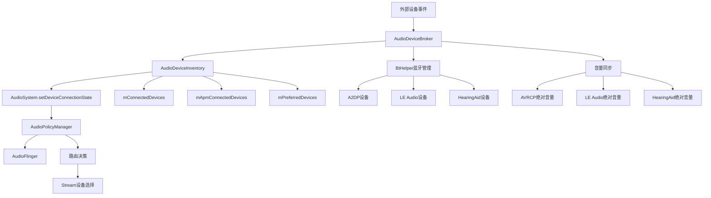
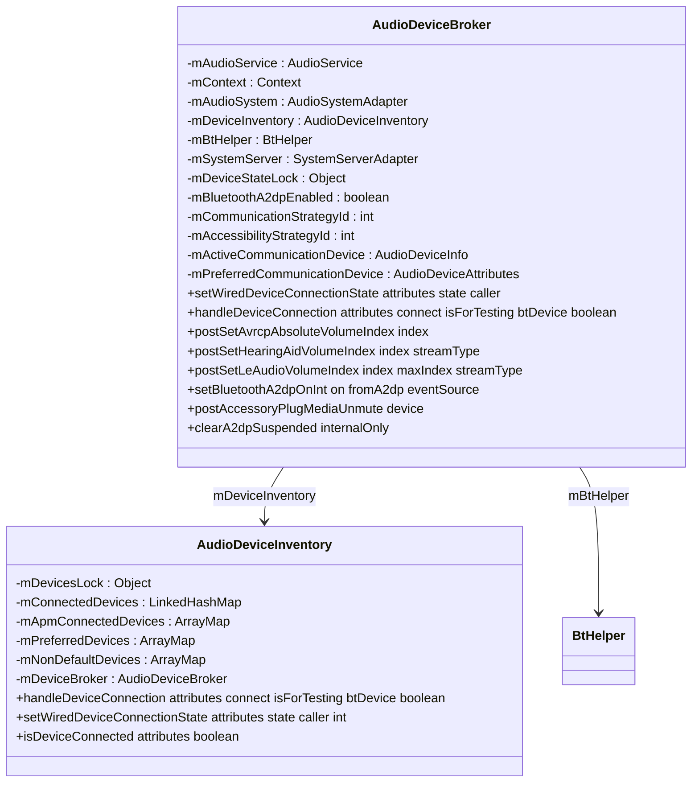
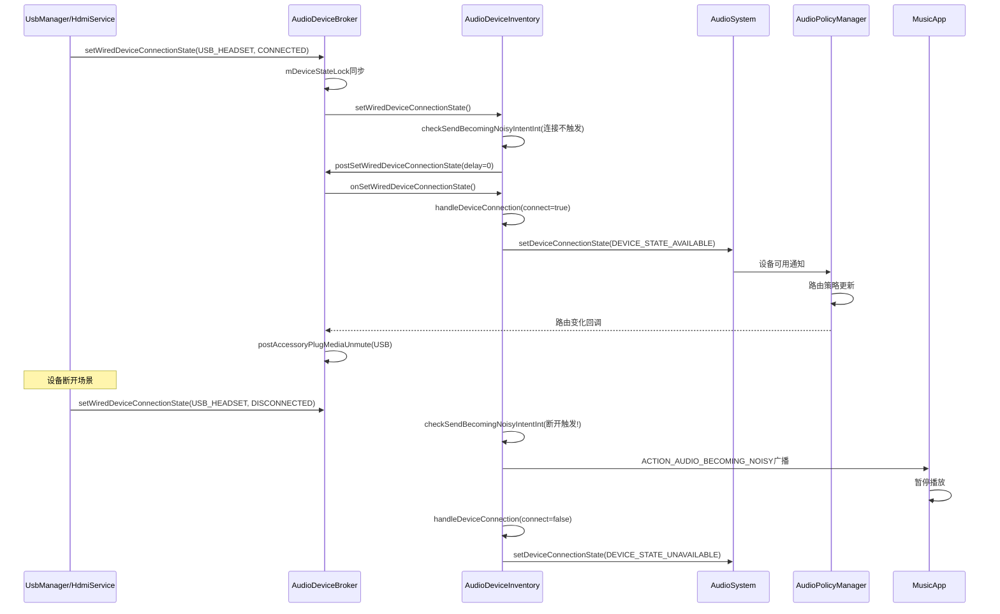
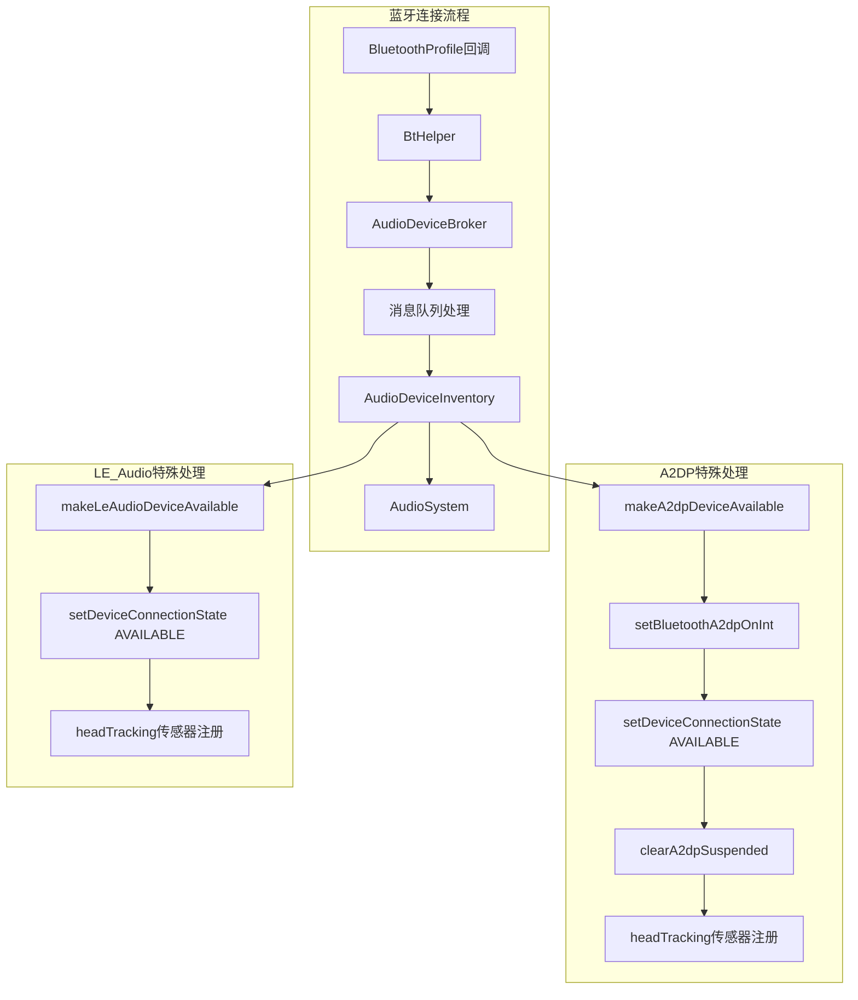
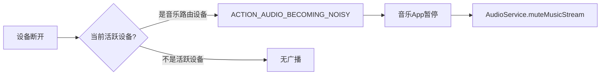
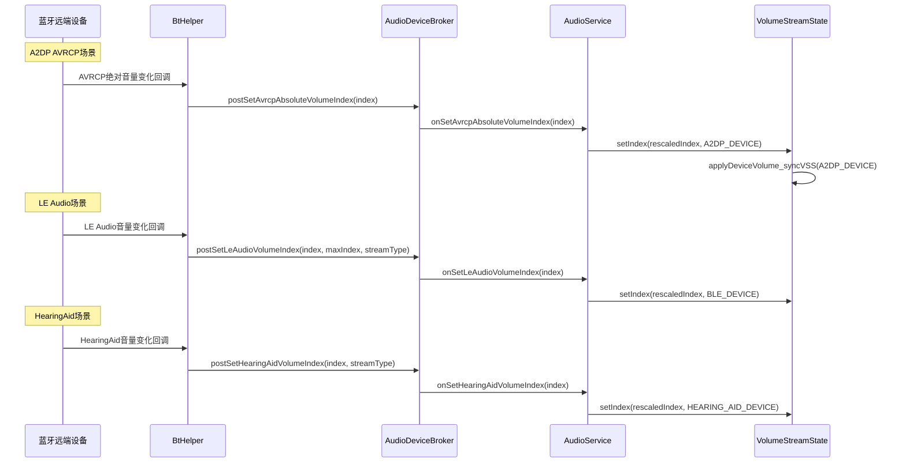
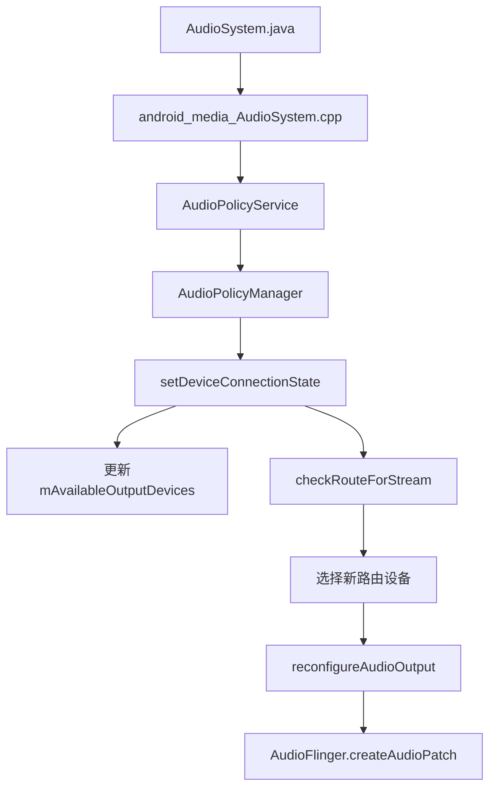
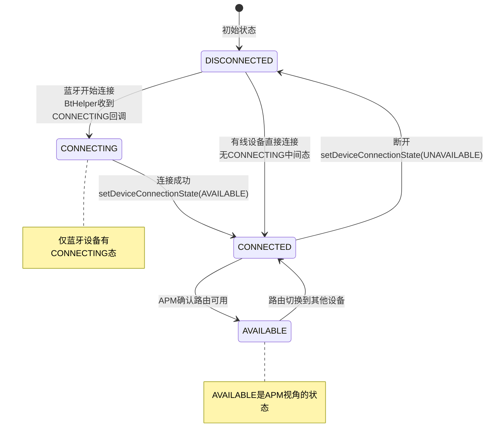

## 13.2 Device状态机

> [← 上一个](13_13.1_Volume状态机.md) | [返回13章](README.md) | [返回导航](../README.md) | [下一个 →](13_13.3_Focus+Device+Volume联合交互场景.md)

---

本节深度解析AudioDeviceBroker与AudioDeviceInventory的设备连接/断开管理机制，包括有线设备(USB/HDMI)与蓝牙设备(A2DP/LE Audio/HearingAid)的路由状态流转、BecomingNoisy意图分发、设备角色管理、绝对音量同步等核心流程。

### 13.2.1 设备管理架构总览



**核心源码文件**:
- [`AudioDeviceBroker.java`](frameworks/base/services/core/java/com/android/server/audio/AudioDeviceBroker.java:73) — 2357行，设备管理协调器
- [`AudioDeviceInventory.java`](frameworks/base/services/core/java/com/android/server/audio/AudioDeviceInventory.java:81) — 设备连接状态实际管理者
- [`BtHelper.java`](frameworks/base/services/core/java/com/android/server/audio/BtHelper.java) — 蓝牙设备交互代理

### 13.2.2 AudioDeviceBroker类结构

[`AudioDeviceBroker`](frameworks/base/services/core/java/com/android/server/audio/AudioDeviceBroker.java:73) 是AudioService与设备管理之间的协调层：



**三层职责划分**:
| 层 | 类 | 职责 |
|----|-----|------|
| 协调层 | AudioDeviceBroker | 消息队列化处理、锁管理、蓝牙音量同步、策略协调 |
| 数据层 | AudioDeviceInventory | mConnectedDevices维护、AudioSystem.setDeviceConnectionState调用、BecomingNoisy |
| 蓝牙层 | BtHelper | BluetoothProfileService交互、A2DP/LE Audio/HearingAid连接回调 |

### 13.2.3 设备连接状态数据结构

**DeviceInfo内部类**:

[`DeviceInfo`](frameworks/base/services/core/java/com/android/server/audio/AudioDeviceInventory.java:216) 是设备列表的核心存储单元：

```java
static final class DeviceInfo {
    final int mDeviceType;        // AudioSystem设备类型常量(如DEVICE_OUT_WIRED_HEADSET=0x3)
    final String mDeviceName;     // 设备名称(如"Sony WH-1000XM4")
    final String mDeviceAddress;  // 设备地址(MAC/IP/空)
    int mDeviceCodecFormat;       // 编码格式(如A2DP的AAC/SBC/LDAC)
    
    String getKey() {
        return makeDeviceListKey(mDeviceType, mDeviceAddress);
    }
    
    @NonNull static String makeDeviceListKey(int device, String deviceAddress) {
        return Integer.toHexString(device) + ":" + deviceAddress;
    }
}
```

**mConnectedDevices详解**:

[`mConnectedDevices`](frameworks/base/services/core/java/com/android/server/audio/AudioDeviceInventory.java:90) 是一个`LinkedHashMap<String, DeviceInfo>`，key为`makeDeviceListKey(type, address)`格式：

| key格式示例 | 含义 |
|------------|------|
| `3:` | DEVICE_OUT_WIRED_HEADSET,无地址(有线耳机) |
| `400:AA:BB:CC:DD:EE:FF` | DEVICE_OUT_BLUETOOTH_A2DP,MAC地址 |
| `800:00:11:22:33:44` | DEVICE_OUT_BLE_HEADSET,MAC地址 |
| `20:` | DEVICE_OUT_HDMI,无地址(HDMI) |

**LinkedHashMap特性**: 保持插入顺序，遍历时按连接时间排序，最新连接的设备在末尾。

**mApmConnectedDevices详解**:

[`mApmConnectedDevices`](frameworks/base/services/core/java/com/android/server/audio/AudioDeviceInventory.java:153) 是`ArrayMap<Integer, String>`，以设备类型为key，映射到mConnectedDevices的key。当前仅用于A2DP Sink设备，确保同一类型只有一台设备连接到APM。

### 13.2.4 有线设备连接流程

#### setWiredDeviceConnectionState入口

[`setWiredDeviceConnectionState()`](frameworks/base/services/core/java/com/android/server/audio/AudioDeviceBroker.java:677) 是有线设备(USB/HDMI/Headset)连接的入口：

```java
/*package*/ void setWiredDeviceConnectionState(AudioDeviceAttributes attributes,
        @AudioService.ConnectionState int state, String caller) {
    synchronized (mDeviceStateLock) {
        mDeviceInventory.setWiredDeviceConnectionState(attributes, state, caller);
    }
}
```

#### AudioDeviceInventory内部处理

[`setWiredDeviceConnectionState()`](frameworks/base/services/core/java/com/android/server/audio/AudioDeviceInventory.java:1502) 在Inventory中的实现：

```java
/*package*/ int setWiredDeviceConnectionState(AudioDeviceAttributes attributes,
        @AudioService.ConnectionState int state, String caller) {
    synchronized (mDevicesLock) {
        // 1. 计算BecomingNoisy延迟
        int delay = checkSendBecomingNoisyIntentInt(
                attributes.getInternalType(), state, AudioSystem.DEVICE_NONE);
        // 2. 队列化处理: postSetWiredDeviceConnectionState
        mDeviceBroker.postSetWiredDeviceConnectionState(
                new WiredDeviceConnectionState(attributes, state, caller), delay);
        return delay;
    }
}
```

**BecomingNoisy意图计算**:

[`checkSendBecomingNoisyIntentInt()`](frameworks/base/services/core/java/com/android/server/audio/AudioDeviceInventory.java) 决定是否发送`ACTION_AUDIO_BECOMING_NOISY`广播：

- 条件: 断开设备是当前活跃的媒体路由设备(即正在通过此设备播放音乐)
- 延迟: 返回BecomingNoisy广播延迟时间(ms)，确保广播在设备断开前发出
- 用途: 音乐App收到广播后暂停播放，避免突然从Speaker外放



### 13.2.5 handleDeviceConnection核心方法

[`handleDeviceConnection()`](frameworks/base/services/core/java/com/android/server/audio/AudioDeviceInventory.java:1248) 是设备连接/断开的核心实现：

```java
/*package*/ boolean handleDeviceConnection(AudioDeviceAttributes attributes, boolean connect,
        boolean isForTesting, @Nullable BluetoothDevice btDevice) {
    int device = attributes.getInternalType();
    String address = attributes.getAddress();
    String deviceName = attributes.getName();
    
    synchronized (mDevicesLock) {
        final String deviceKey = DeviceInfo.makeDeviceListKey(device, address);
        DeviceInfo di = mConnectedDevices.get(deviceKey);
        boolean isConnected = di != null;
        
        if (connect && !isConnected) {
            // === 连接分支 ===
            // 1. 调用AudioSystem通知APM
            final int res;
            if (isForTesting) {
                res = AudioSystem.AUDIO_STATUS_OK;  // 测试模式直接成功
            } else {
                res = mAudioSystem.setDeviceConnectionState(attributes,
                        AudioSystem.DEVICE_STATE_AVAILABLE,
                        AudioSystem.AUDIO_FORMAT_DEFAULT);
            }
            if (res != AudioSystem.AUDIO_STATUS_OK) {
                Slog.e(TAG, "not connecting device 0x" + Integer.toHexString(device)
                        + " due to command error " + res);
                return false;
            }
            // 2. 加入mConnectedDevices
            mConnectedDevices.put(deviceKey, new DeviceInfo(device, deviceName, address));
            // 3. 触发设备接入自动unmute
            mDeviceBroker.postAccessoryPlugMediaUnmute(device);
            status = true;
            
        } else if (!connect && isConnected) {
            // === 断开分支 ===
            // 1. 调用AudioSystem通知APM
            mAudioSystem.setDeviceConnectionState(attributes,
                    AudioSystem.DEVICE_STATE_UNAVAILABLE,
                    AudioSystem.AUDIO_FORMAT_DEFAULT);
            // 2. 移除mConnectedDevices(即使APM断开失败也移除)
            mConnectedDevices.remove(deviceKey);
            status = true;
        }
        // else: 重复操作(connect+已连接 / disconnect+已断开) → status=false
        
        if (status) {
            // SCO设备特殊处理
            if (AudioSystem.isBluetoothScoDevice(device)) {
                updateBluetoothPreferredModes_l(connect ? btDevice : null);
                if (!connect) purgeDevicesRoles_l();
            }
        }
    }
    return status;
}
```

**四条处理分支**:
| 条件 | 操作 | 返回 |
|------|------|------|
| connect && !isConnected | setDeviceConnectionState(AVAILABLE) + put + unmute | true |
| !connect && isConnected | setDeviceConnectionState(UNAVAILABLE) + remove | true |
| connect && isConnected | 重复连接 → 无操作 | false |
| !connect && !isConnected | 重复断开 → 无操作 | false |

### 13.2.6 蓝牙设备连接流程

蓝牙设备(A2DP/LE Audio/HearingAid)通过BtHelper接收BluetoothProfile Service回调，再经AudioDeviceBroker队列化处理。



**A2DP连接流程**:

[`makeA2dpDeviceAvailable()`](frameworks/base/services/core/java/com/android/server/audio/AudioDeviceInventory.java:1525):

1. `setBluetoothA2dpOnInt(true)` — 先启用A2DP路由策略
2. `setDeviceConnectionState(DEVICE_STATE_AVAILABLE, codec)` — 通知APM设备可用，携带编码格式
3. `clearA2dpSuspended(true)` — 清除A2DP挂起状态
4. `UuidUtils.uuidFromAudioDeviceAttributes()` — 注册头部追踪传感器

**A2DP编码传递**: 连接时将codec(AAC/SBC/LDAC/aptX等)作为参数传递给APM，APM根据codec选择合适的AudioProfile。

**LE Audio连接流程**:

[`makeLeAudioDeviceAvailable()`](frameworks/base/services/core/java/com/android/server/audio/AudioDeviceInventory.java) 类似A2DP，但额外处理：
- `isLeOutput`标志区分输出/输入设备
- LE Audio设备类型包含`DEVICE_OUT_BLE_HEADSET`和`DEVICE_OUT_BLE_BROADCAST`
- LE Audio音量通过`postSetLeAudioVolumeIndex()`同步

### 13.2.7 BecomingNoisy意图机制

**触发条件**: 当正在播放音乐的设备断开连接时，系统发送`ACTION_AUDIO_BECOMING_NOISY`广播，让音乐App暂停播放，避免从Speaker突然外放。



**checkSendBecomingNoisyIntentInt详解**:

1. 检查断开设备是否在`mMusicActiveDeviceSet`中(当前正在播放音乐的设备)
2. 如果是，计算延迟: `BECOMING_NOISY_DELAY_MS`(默认500ms)
3. 发送广播后，AudioService执行`handleMusicMuteByDevice()`：
   - 设置music stream为Mute
   - 启动定时器(2s后自动解除Mute)
   - 如果2s内App没有自己恢复播放，系统解除Mute但音乐已暂停

**延迟机制**: BecomingNoisy广播在设备断开**之前**发出(delay参数)，确保App有时间暂停播放。

### 13.2.8 设备连接状态枚举

AudioService定义的设备连接状态:

| 状态值 | 常量 | 含义 |
|--------|------|------|
| 0 | CONNECTION_STATE_DISCONNECTED | 设备已断开 |
| 1 | CONNECTION_STATE_CONNECTED | 设备已连接 |
| 2 | CONNECTION_STATE_CONNECTING | 设备正在连接(蓝牙) |

AudioSystem定义的设备连接状态(传给APM):

| 状态值 | 常量 | 含义 |
|--------|------|------|
| 0 | DEVICE_STATE_UNAVAILABLE | 设备不可用 |
| 1 | DEVICE_STATE_AVAILABLE | 设备可用 |

### 13.2.9 设备角色与通信策略

AudioDeviceBroker管理两种策略路由:

**通信策略(Communication Strategy)**:

[`mCommunicationStrategyId`](frameworks/base/services/core/java/com/android/server/audio/AudioDeviceBroker.java:91) 通过AudioProductStrategy查询获得：

```java
private void initRoutingStrategyIds() {
    List<AudioProductStrategy> strategies = AudioProductStrategy.getAudioProductStrategies();
    for (AudioProductStrategy strategy : strategies) {
        if (strategy.getAudioAttributesForLegacyStreamType(STREAM_VOICE_CALL) != null) {
            mCommunicationStrategyId = strategy.getId();
        }
        if (strategy.getAudioAttributesForLegacyStreamType(STREAM_ACCESSIBILITY) != null) {
            mAccessibilityStrategyId = strategy.getId();
        }
    }
}
```

**setCommunicationDevice**:

`AudioDeviceBroker.setCommunicationDevice()` 实现通信设备偏好设置：

1. 检查策略ID有效性(`mCommunicationStrategyId >= 0`)
2. `AudioSystem.setPreferredDeviceForStrategy(strategyId, device)` 设置偏好设备
3. 更新`mPreferredCommunicationDevice`
4. 更新`mActiveCommunicationDevice`状态
5. 发送`ACTION_COMMUNICATION_DEVICE_CHANGED`广播

**USE_SET_COMMUNICATION_DEVICE ChangeId**:

[`USE_SET_COMMUNICATION_DEVICE`](frameworks/base/services/core/java/com/android/server/audio/AudioDeviceBroker.java:160) (243827847L) 自Android 13起默认启用，表示通信设备选择由`setCommunicationDevice()`API控制，而非旧的强制路由方式。

### 13.2.10 绝对音量设备同步

蓝牙绝对音量设备(A2DP/LE Audio/HearingAid)的音量同步由AudioDeviceBroker负责：



**绝对音量方法详解**:

[`postSetAvrcpAbsoluteVolumeIndex()`](frameworks/base/services/core/java/com/android/server/audio/AudioDeviceBroker.java:1088):

```java
/*package*/ void postSetAvrcpAbsoluteVolumeIndex(int index) {
    sendMsg(MSG_SET_AVRCP_ABSOLUTE_VOLUME, SENDMSG_REPLACE, index, 0, null, 0);
}
```

**SENDMSG_REPLACE**: 如果队列中已有同类消息，替换为新消息。避免多个AVRCP音量更新排队执行。

[`postSetHearingAidVolumeIndex()`](frameworks/base/services/core/java/com/android/server/audio/AudioDeviceBroker.java:1092) 和 [`postSetLeAudioVolumeIndex()`](frameworks/base/services/core/java/com/android/server/audio/AudioDeviceBroker.java:1096) 同理。

### 13.2.11 mDeviceStateLock与mDevicesLock双锁机制

| 锁 | 所属类 | 保护对象 | 作用 |
|----|--------|---------|------|
| `mDeviceStateLock` | AudioDeviceBroker | mBluetoothA2dpEnabled、外部调用入口 | Broker层状态一致性 |
| `mDevicesLock` | AudioDeviceInventory | mConnectedDevices、mApmConnectedDevices | Inventory层数据一致性 |

**设计意图**: 双锁避免单一锁的竞争。外部调用先获取Broker的mDeviceStateLock，再进入Inventory时获取mDevicesLock。消息队列处理时只需mDevicesLock。

### 13.2.12 设备连接的音量恢复 — postAccessoryPlugMediaUnmute

[`postAccessoryPlugMediaUnmute()`](frameworks/base/services/core/java/com/android/server/audio/AudioDeviceBroker.java) 在设备连接成功后触发：

1. 检查是否有`mMusicMutedByDevice`标记(因BecomingNoisy而Mute)
2. 如果是 → 解除Music Stream的Mute
3. 设置新连接设备的音量(从mIndexMap读取per-device音量)
4. 通过`MSG_SET_DEVICE_VOLUME`异步应用音量

**场景**: 蓝牙耳机断开 → BecomingNoisy → Music暂停+Mute → 蓝牙耳机重新连接 → unmute恢复播放

### 13.2.13 AudioSystem.setDeviceConnectionState → APM交互

`AudioSystem.setDeviceConnectionState(attributes, state, codec)` 跨JNI调用到Native AudioPolicyManager：



**APM内部处理**:
1. 更新`mAvailableOutputDevices`集合(添加或移除设备)
2. 对每个活跃Stream执行`checkRouteForStream()`：
   - 重新评估最佳路由设备
   - 如果路由变化 → `reconfigureAudioOutput()`
3. `reconfigureAudioOutput()`:
   - 关闭旧Output的Patch
   - 创建新Output的Patch(`createAudioPatch`)
   - 更新音量曲线(新设备可能有不同音量曲线)

### 13.2.14 设备状态机 — 连接状态流转



**有线与蓝牙的区别**:
- 有线设备(USB/HDMI/Headset): 直接从DISCONNECTED→CONNECTED，无中间态
- 蓝牙设备(A2DP/LE Audio): 有CONNECTING中间态，BluetoothProfile Service异步回调

### 13.2.15 设备连接场景汇总

| 场景 | 入口 | 设备类型 | 特殊处理 |
|------|------|---------|---------|
| USB耳机插入 | UsbManager→AudioService→Broker | USB_HEADSET | 无BecomingNoisy(连接) |
| USB耳机拔出 | UsbManager→AudioService→Broker | USB_HEADSET | BecomingNoisy(若正在播放) |
| HDMI连接 | HdmiService→AudioService→Broker | HDMI | 固定音量设备 |
| A2DP耳机连接 | BtHelper→Broker→Inventory | A2DP | 编码传递+Suspend清除 |
| A2DP耳机断开 | BtHelper→Broker→Inventory | A2DP | BecomingNoisy+A2DP超时断开 |
| LE Audio连接 | BtHelper→Broker→Inventory | BLE_HEADSET | 绝对音量同步 |
| HearingAid连接 | BtHelper→Broker→Inventory | HEARING_AID | 绝对音量同步 |
| SCO连接 | BtHelper→Broker→Inventory | BLUETOOTH_SCO | updatePreferredModes |
| 通信设备切换 | AudioManager.setCommunicationDevice | 任意 | 策略偏好设备设置 |

---

[← 上一个](13_13.1_Volume状态机.md) | [返回13章](README.md) | [返回导航](../README.md) | [下一个 →](13_13.3_Focus+Device+Volume联合交互场景.md)