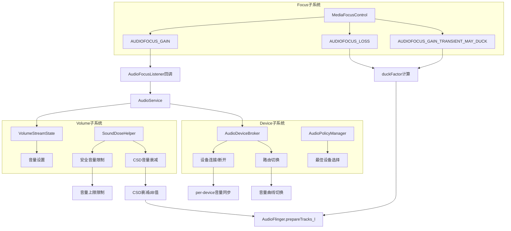
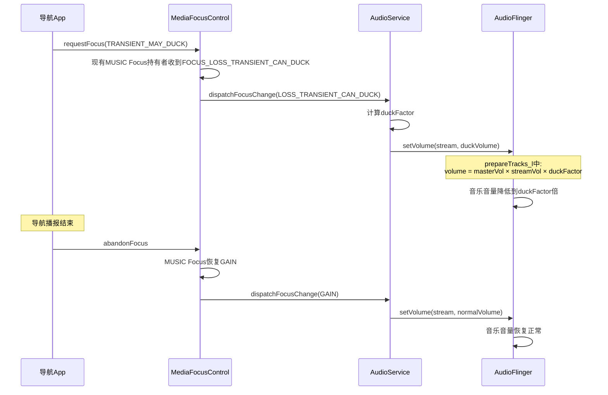
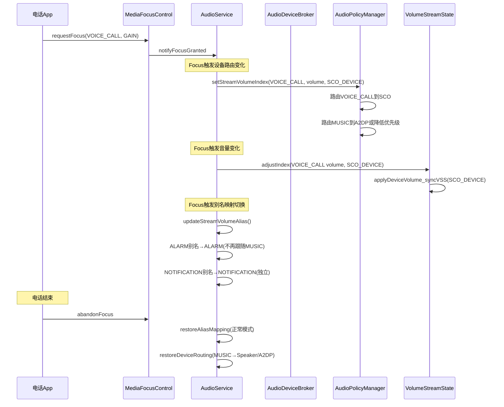
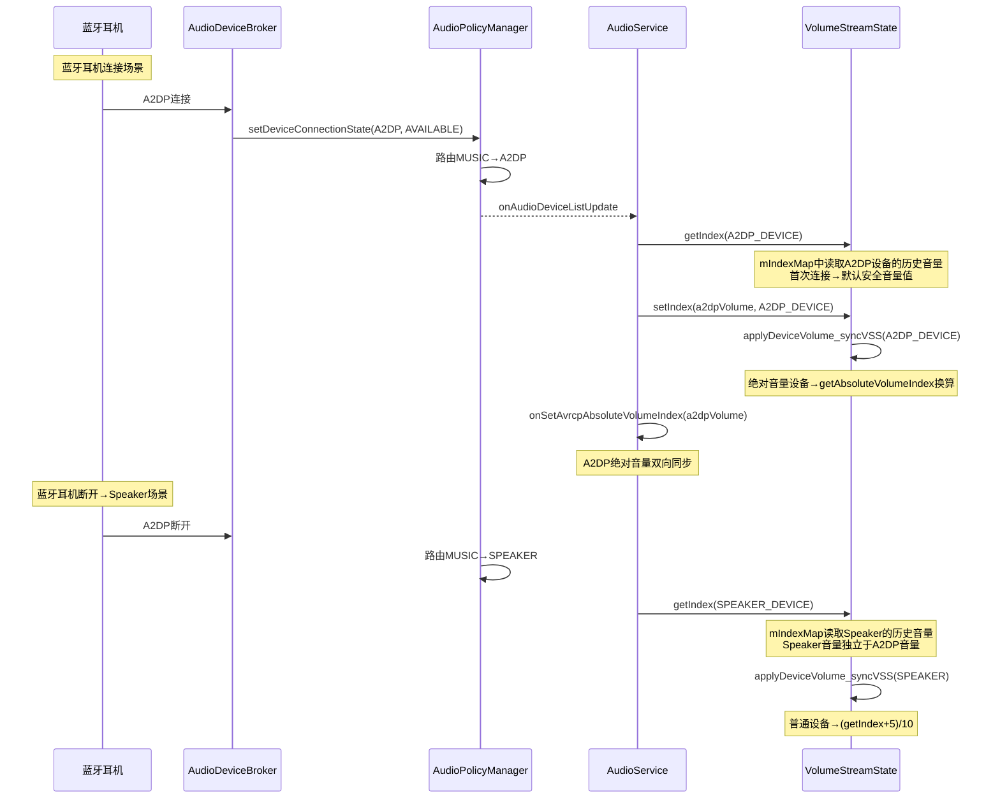
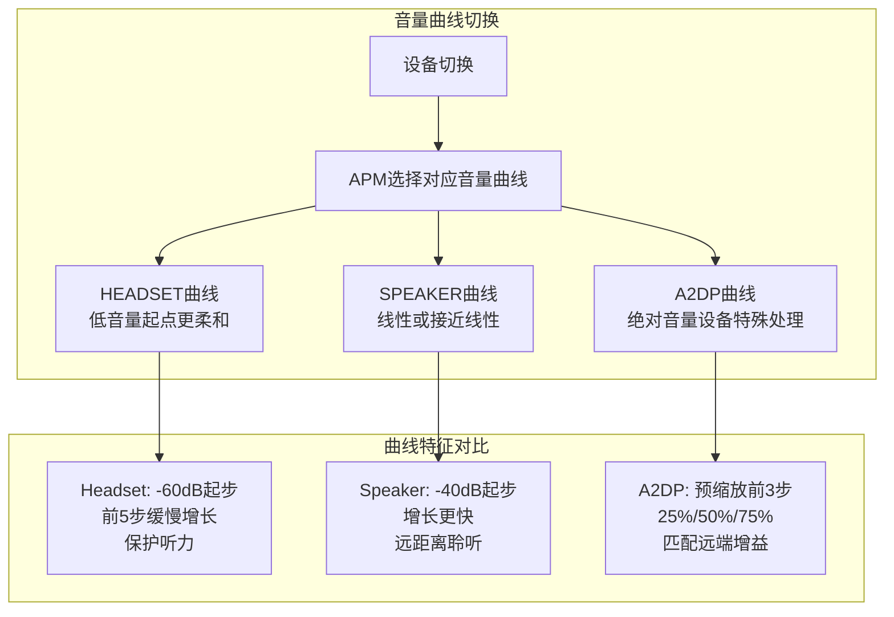
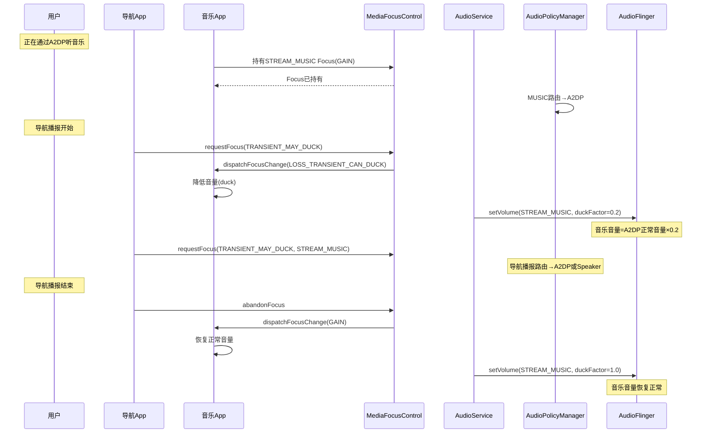
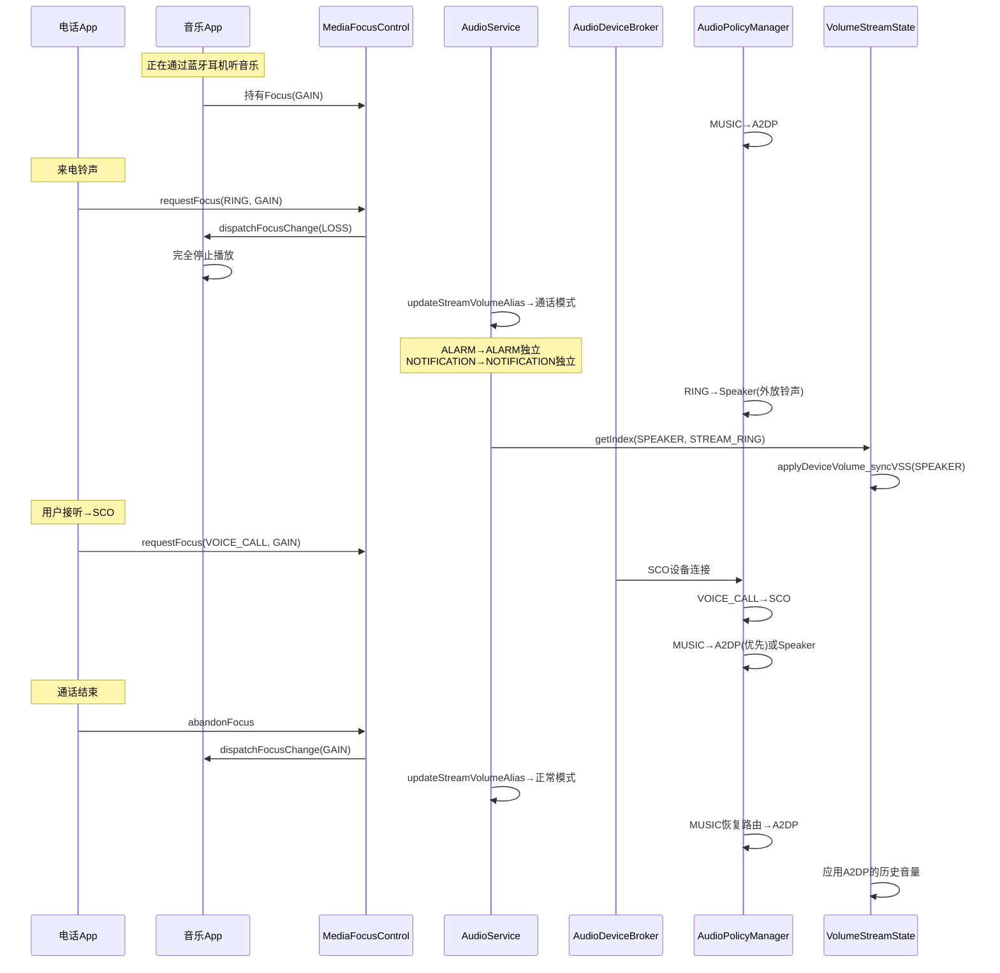
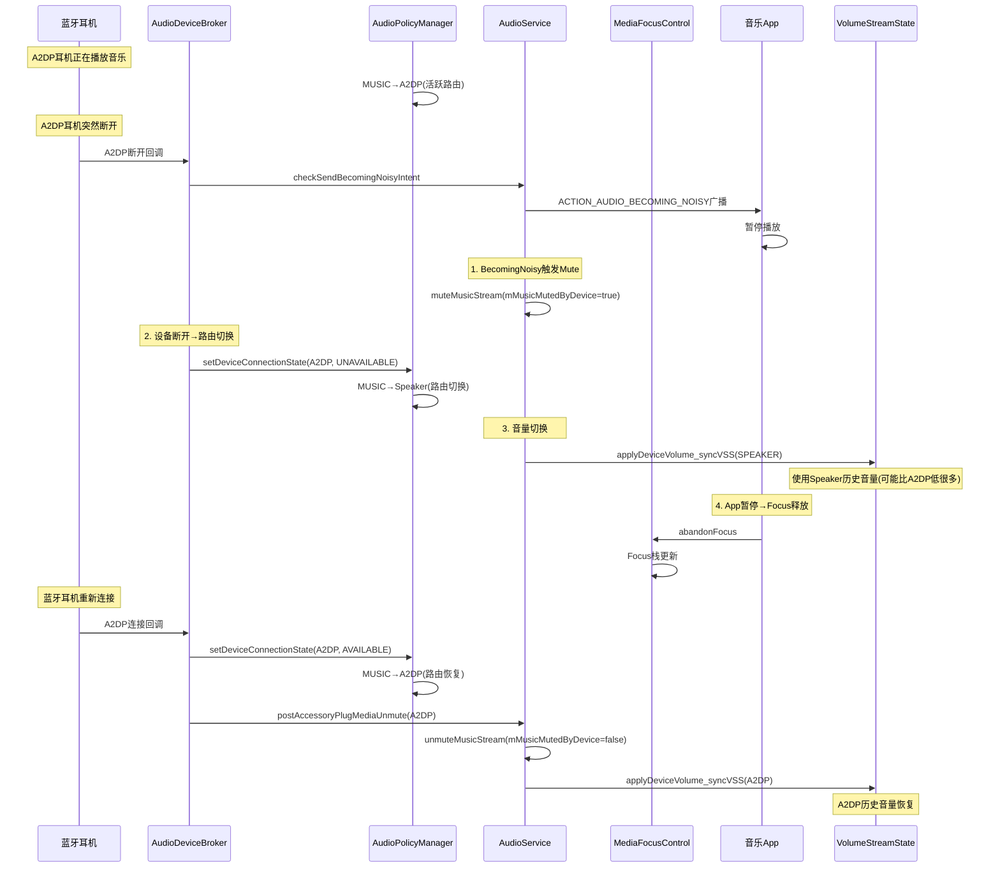
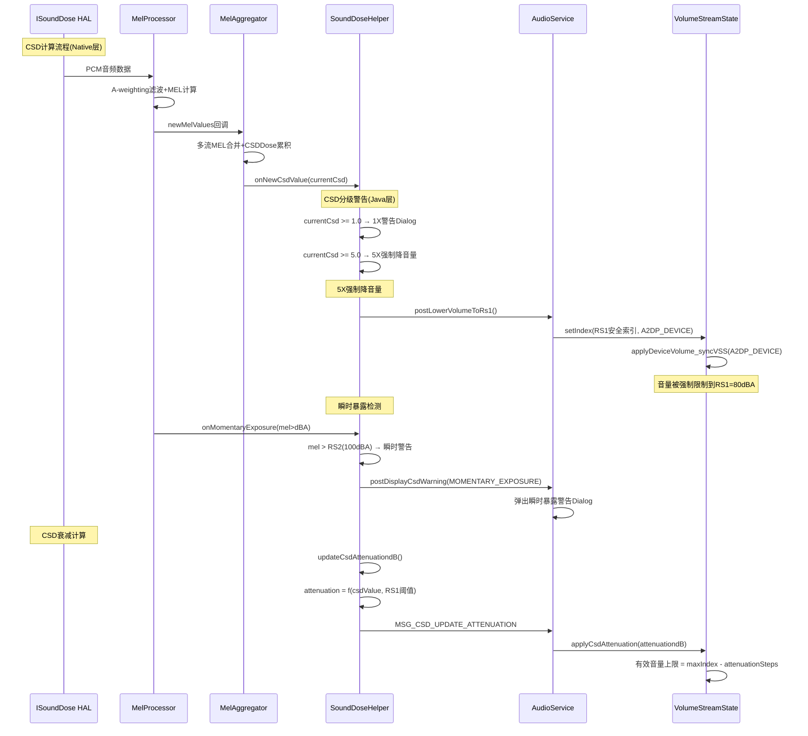

## 13.3 Focus+Device+Volume联合交互场景

> [← 上一个](13_13.2_Device状态机.md) | [返回13章](README.md) | [返回导航](../README.md) | [下一个 →](13_13.4_外部音频设备-USBHDMI有线设备管理.md)

---

本节深度分析Audio Focus、Device Routing、Volume三个子系统在实际场景中的联合交互机制。Focus决定谁可以播放、Device决定在哪播放、Volume决定播放多大声——三者在AudioService/AudioPolicyManager中紧密联动。

### 13.3.1 三子系统联动架构



**核心联动原则**:
- **Focus优先**: Focus Gain → 恢复音量; Focus Loss → 降低/静音
- **Device驱动**: 设备切换 → 音量曲线和per-device索引更新
- **Volume受制**: 安全音量/CSD → 可强制降低音量，不受Focus和Device影响

### 13.3.2 Focus→Volume联动：Duck机制

当多个App同时请求Audio Focus时，Focus系统通过Duck机制降低背景App音量，而非完全静音：



**duckFactor计算**:

AudioFlinger在[`prepareTracks_l()`](frameworks/base/services/core/java/com/android/server/audio/AudioFlinger.java)中对每条Track计算最终音量：

```
finalVolume = masterVolume × streamVolume × duckFactor × muteFactor
```

| 因子 | 来源 | 范围 |
|------|------|------|
| masterVolume | AudioService.setMasterVolume | 0.0-1.0 |
| streamVolume | VolumeStreamState.applyDeviceVolume | 0.0-1.0 |
| duckFactor | AudioFocus系统 | 0.0-1.0(通常0.1-0.3) |
| muteFactor | VolumeStreamState.mIsMuted | 0或1 |

**Duck阈值**:
- 默认duck factor: 通常为0.2(即音量降低到20%)
- Car Audio场景: CarAudioFocus使用per-zone独立duck
- 导航播报: TRANSIENT_MAY_DUCK → 音乐duck
- 通知提醒: TRANSIENT_MAY_DUCK → 音乐duck

### 13.3.3 Focus→Device联动：通信设备优先

当通信App(电话/VoIP)获取Focus时，Device路由和音量同时切换：



**通信模式下的别名切换**:

| Stream | 正常模式别名 | 通话模式别名 | 原因 |
|--------|-------------|-------------|------|
| STREAM_ALARM | STREAM_MUSIC | STREAM_ALARM | 防止闹钟音量被通话duck |
| STREAM_NOTIFICATION | STREAM_MUSIC | STREAM_NOTIFICATION | 防止通知被通话静音 |
| STREAM_DTMF | STREAM_MUSIC | STREAM_MUSIC | DTMF跟随通话音量 |
| STREAM_MUSIC | STREAM_MUSIC | STREAM_MUSIC | 背景音乐被duck |

**设备路由优先级冲突解决**:
- 通话期间: SCO设备优先用于VOICE_CALL策略，MUSIC策略路由到A2DP(如果可用)
- 无A2DP: MUSIC路由到Speaker，但可能被通话duck或完全静音
- AAOS场景: CarAudioService使用Zone隔离，通话Zone和娱乐Zone互不干扰

### 13.3.4 Device→Volume联动：per-device音量

设备切换时，VolumeStreamState的per-device音量索引(mIndexMap)独立维护每个设备的音量值：



**per-device音量独立性示例**:

| 设备 | 上次音量索引 | 当前音量 | 说明 |
|------|------------|---------|------|
| Speaker | 80/150 | 8/15 | Speaker音量偏低 |
| A2DP | 120/150 | 12/15 | A2DP音量偏高(绝对音量设备) |
| USB_HEADSET | 60/150 | 6/15 | USB耳机音量中等 |

切换设备时，音量**不会**跟随——每个设备记住自己的历史音量。这避免了"耳机音量突然很大"的问题。

### 13.3.5 Device→Volume联动：音量曲线切换

不同设备类型有独立的音量曲线，设备切换时AudioPolicyManager自动切换曲线：



**曲线定义**:
- `audio_policy_volumes.xml`: 每个设备类别定义`<volume stream="..." deviceCategory="...">`
- deviceCategory: `HEADSET`, `SPEAKER`, `HEARING_AID`, `A2DP`
- 曲线是`(index, dBAttenuation)`键值对列表

### 13.3.6 Volume→Device联动：安全音量驱动的设备限制

SoundDoseHelper的安全音量检查在音量调节和设备切换时都可能触发设备限制：

```mermaid
flowchart TB
    VOL_RAISE[音量升高请求] --> SDH_CHECK{SoundDoseHelper检查}
    SDH_CHECK -->|超安全阈值| SAFE_WARN[安全音量警告]
    SDH_CHECK -->|未超阈值| NORMAL_SET[正常音量设置]
    
    DEV_SWITCH[设备切换到耳机] --> SDH_INIT{安全音量初始化}
    SDH_INIT -->|设备在安全列表| LIMIT_VOL[限制初始音量到安全值]
    SDH_INIT -->|设备不在安全列表| NO_LIMIT[无限制]
    
    CSD_UPDATE[CSD声剂量更新] --> ATT_CALC{计算CSD衰减dB}
    ATT_CALC --> ATT_POSITIVE[衰减dB>0]
    ATT_CALC --> ATT_ZERO[衰减dB=0]
    
    ATT_POSITIVE --> APPLY_ATT[应用衰减到VolumeStreamState]
    APPLY_ATT --> NEW_MAX[新的有效音量上限]
    
    Note over SAFE_WARN: mPendingVolumeCommand暂存<br>用户确认后执行
    Note over LIMIT_VOL: 安全设备首次连接<br>默认音量=安全索引
```

**安全设备列表**（`mSafeMediaVolumeDevices`）:
- WIRED_HEADSET(0x3)
- WIRED_HEADPHONE(0x4)  
- USB_HEADSET(0x400)
- BLE_HEADSET(0x800)
- BLE_BROADCAST(0x880)
- A2DP_HEADPHONES(0x400)

**安全音量触发时机**:
1. 用户按键升高音量 → `adjustStreamVolume` → `raiseVolumeDisplaySafeMediaVolume()`
2. App调用`setStreamVolume` → `setStreamVolumeWithAttributionInt` → `willDisplayWarningAfterCheckVolume()`
3. CSD声剂量更新 → `postLowerVolumeToRs1()` → 强制降低音量到RS1(80dBA)

### 13.3.7 Focus→Volume→Device联合：导航播报场景

这是车载场景中最典型的三方联动：



**AAOS Zone隔离方案**:

在AAOS车载系统中，CarAudioService使用Zone机制隔离交互：

| Zone | 用途 | Focus策略 | Volume策略 | Device |
|------|------|----------|-----------|--------|
| Primary Zone | 主娱乐区 | 独立Focus栈 | 独立Volume Group | Speaker/A2DP |
| Navigation Zone | 导航区 | 不与主Zone竞争 | 独立Volume Group | 导航Speaker |
| Call Zone | 通话区 | 不与主Zone竞争 | 独立Volume Group | SCO |

Zone隔离意味着: 导航播报**不duck**音乐，两者独立播放到不同Speaker。

### 13.3.8 Focus→Volume→Device联合：电话来电场景



**关键联动点**:
1. **Focus切换**: RING→VOICE_CALL→MUSIC恢复
2. **Device路由**: Speaker(RING)→SCO(VOICE_CALL)→A2DP(MUSIC恢复)
3. **Volume别名**: 正常模式→通话模式→正常模式
4. **per-device音量**: 每个设备的音量独立记忆

### 13.3.9 Device→Focus→Volume联合：蓝牙耳机断开场景



**BecomingNoisy后Music Mute自动解除**:
- `postAccessoryPlugMediaUnmute()` 在设备重新连接时触发
- 如果`mMusicMutedByDevice=true` → 自动解除Mute
- App需要自己决定是否恢复播放(大多数音乐App收到BecomingNoisy后暂停，不会自动恢复)

### 13.3.10 CSD→Volume→Device联合：声剂量限制场景



**CSD音量衰减机制**:

SoundDoseHelper计算CSD衰减dB值，并将其应用到VolumeStreamState的有效音量上限：

```
effectiveMaxIndex = mIndexMax - csdAttenuationSteps
```

| CSD值 | 衰减 | 有效音量上限 |
|--------|------|------------|
| 0-0.5 | 0dB | 无限制(mIndexMax) |
| 0.5-1.0 | 渐进衰减 | 逐步降低上限 |
| 1.0(100%) | ~0dB | RS1安全索引(~80dBA) |
| 5.0(500%) | 最大衰减 | 强制降到RS1 |

### 13.3.11 三子系统联动场景汇总

| 场景 | Focus变化 | Device变化 | Volume变化 |
|------|----------|-----------|-----------|
| 导航播报+音乐 | MUSIC→DUCK | 无变化或导航Speaker | duckFactor=0.2 |
| 电话来电 | MUSIC→LOSS | A2DP→Speaker(RING) | RING独立音量 |
| 电话接听 | RING→VOICE_CALL_GAIN | Speaker→SCO | SCO音量+别名切换 |
| 蓝牙耳机断开 | MUSIC可能abandon | A2DP→Speaker | Speaker历史音量+BecomingNoisy Mute |
| 蓝牙耳机连接 | 无变化 | Speaker→A2DP | A2DP历史音量+unmute |
| CSD 1X警告 | 无变化 | 无变化 | 警告Dialog+暂存命令 |
| CSD 5X强制 | 无变化 | 无变化 | 强制降低到RS1 |
| AAOS Zone切换 | Zone内独立Focus | Zone内独立路由 | Zone Volume Group独立 |
| USB耳机插入 | 无变化 | Speaker→USB_HEADSET | USB历史音量+安全音量检查 |

---

[← 上一个](13_13.2_Device状态机.md) | [返回13章](README.md) | [返回导航](../README.md) | [下一个 →](13_13.4_外部音频设备-USBHDMI有线设备管理.md)