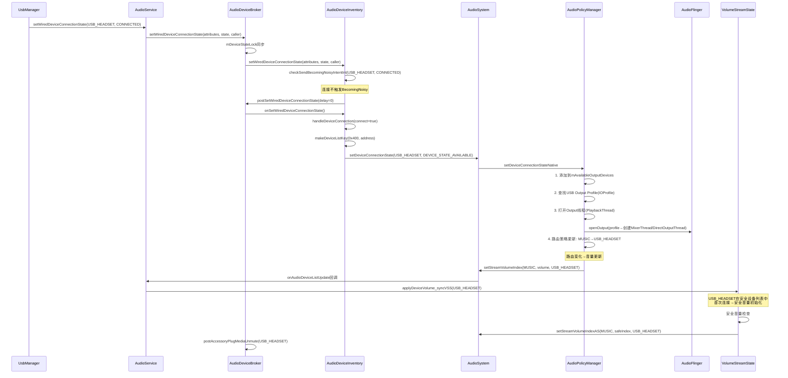
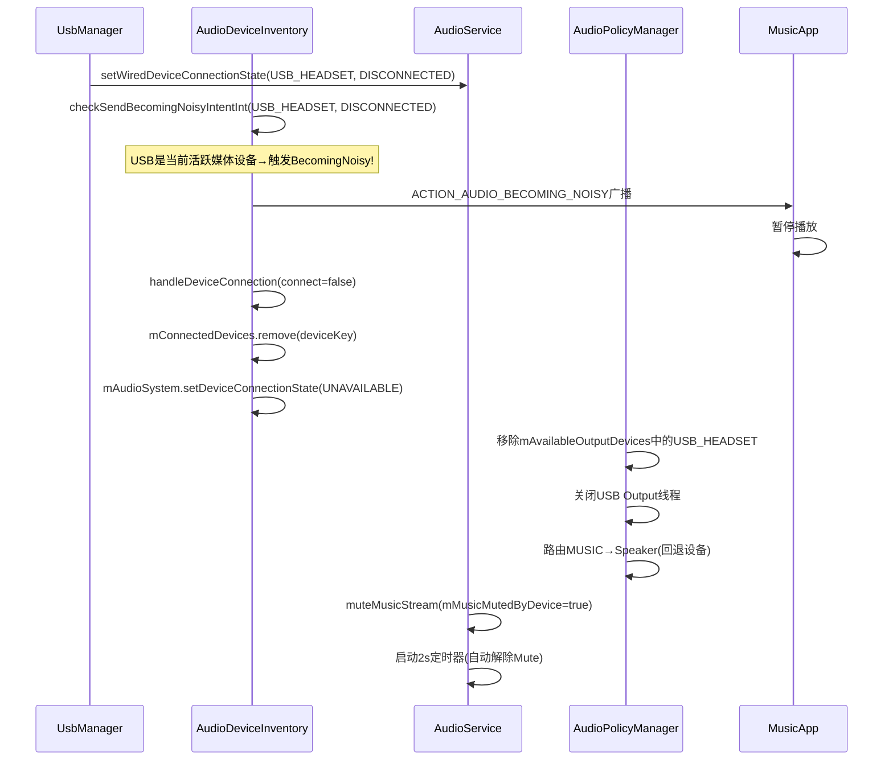
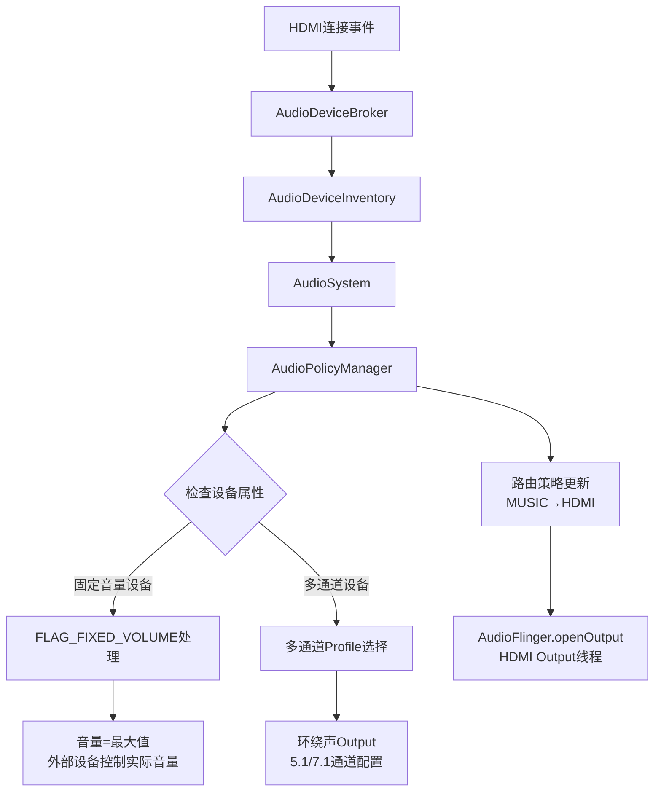
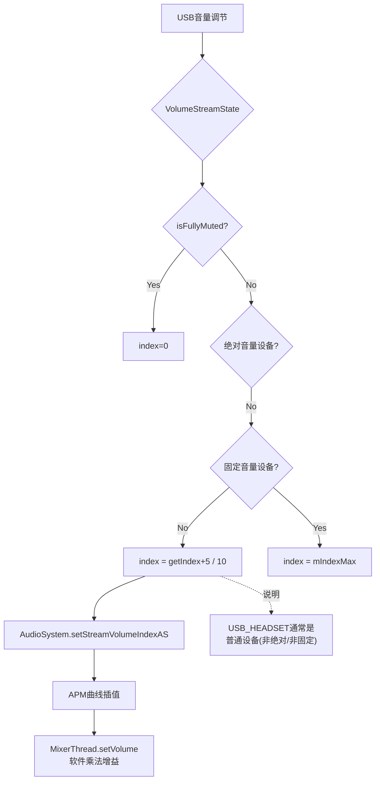
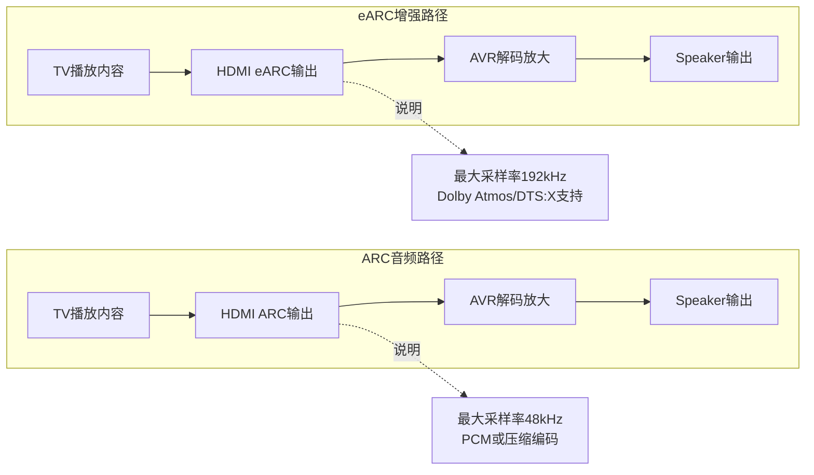
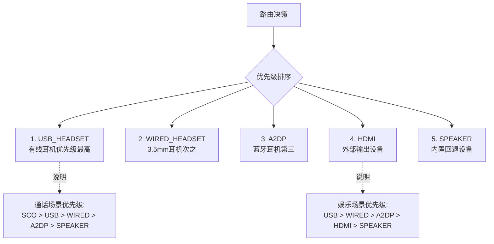
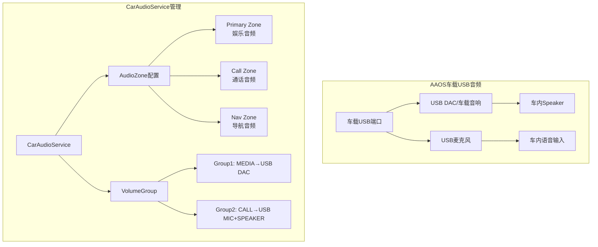

## 13.4 外部音频设备 — USB/HDMI有线设备管理

> [← 上一个](13_13.3_Focus+Device+Volume联合交互场景.md) | [返回13章](README.md) | [返回导航](../README.md) | [下一个 →](13_13.5_SoundDose与CSD声剂量管理.md)

---

本节深度解析USB和HDMI有线音频设备的连接、路由、音量管理机制。USB和HDMI设备属于有线设备类别，通过AudioDeviceBroker→AudioDeviceInventory→AudioSystem→APM链路管理，具有固定音量、多通道编码、Dolby/ARC等特殊属性。

### 13.4.1 USB音频设备类型与枚举

**AudioSystem设备常量(USB类别)**:

| 常量 | 值 | 含义 |
|------|-----|------|
| DEVICE_OUT_USB_ACCESSORY | 0x100 | USB Accessory模式(Android作为USB设备) |
| DEVICE_OUT_USB_DEVICE | 0x200 | USB Device模式(Android作为USB主机) |
| DEVICE_OUT_USB_HEADSET | 0x400 | USB耳机(带麦克风) |
| DEVICE_OUT_USB_HEADPHONE | 0x800 | USB耳机(纯输出,无麦克风) |
| DEVICE_IN_USB_ACCESSORY | 0x1000 | USB Accessory输入 |
| DEVICE_IN_USB_DEVICE | 0x2000 | USB Device输入 |
| DEVICE_IN_USB_HEADSET | 0x4000 | USB耳机麦克风 |

**USB设备分类策略**:
- USB_HEADSET(0x400): 包含输入+输出的完整USB音频设备，最常见
- USB_HEADPHONE(0x800): 纯输出USB设备(如USB DAC)
- USB_DEVICE(0x200): 一般USB输出设备
- USB_ACCESSORY(0x100): Android作为USB Device时的Accessory模式

**Android USB音频Host模式**: Android设备作为USB Host，通过USB Audio Class 1/2驱动连接外部USB DAC/耳机。USB Audio Class 2(UAC2)支持24bit/96kHz高解析度音频。

### 13.4.2 USB设备连接流程



**USB设备关键处理步骤**:
1. **设备注册**: mConnectedDevices.put(deviceKey, DeviceInfo)
2. **APM通知**: setDeviceConnectionState → APM更新可用设备集
3. **Output创建**: APM为USB设备查找匹配的IOProfile → openOutput
4. **路由切换**: MUSIC策略路由从当前设备切换到USB_HEADSET
5. **音量应用**: per-device音量(首次连接默认安全值) + 安全音量检查
6. **unmute**: 如果因之前设备断开而Mute，USB连接后自动unmute

### 13.4.3 USB设备断开流程



### 13.4.4 HDMI音频设备管理

**HDMI设备类型**:

| 常量 | 值 | 含义 |
|------|-----|------|
| DEVICE_OUT_HDMI | 0x20 | HDMI数字音频输出 |
| DEVICE_OUT_HDMI_ARC | 0x2000 | HDMI ARC(Audio Return Channel) |
| DEVICE_OUT_HDMI_EARC | 0x4000 | HDMI eARC(Enhanced ARC) |

**HDMI特殊属性**:

HDMI设备与USB耳机有本质区别：
- **固定音量设备**: HDMI通常标记为`FLAG_FIXED_VOLUME`，音量由外部TV/AVR控制
- **多通道输出**: HDMI可输出5.1/7.1环绕声，不限于2通道
- **编码传递**: HDMI可传递压缩编码(AC3/DTS/Dolby Digital)到外部解码器
- **ARC/eARC**: 音频回传通道，TV→AVR方向不需要单独路由

**HDMI连接流程**:



**固定音量机制详解**:

[`VolumeStreamState.applyDeviceVolume_syncVSS()`](frameworks/base/services/core/java/com/android/server/audio/AudioService.java:8479)对HDMI固定音量设备的处理：

```java
if (isFullVolumeDevice(device)) {
    // 固定音量设备: Android侧音量设为最大值
    // 实际音量由外部TV/AVR通过HDMI CEC控制
    index = (mIndexMax + 5) / 10;  // 最大音量索引
}
```

**为什么HDMI是固定音量?**:
1. HDMI连接的TV/AVR有自己的音量控制
2. Android设备作为源(Source)，应该输出全幅信号
3. 如果Android降低数字增益 → TV/AVR无法恢复被丢弃的动态范围
4. HDMI CEC协议允许TV/AVR向Android发送音量变化通知(但Android仅做UI同步)

### 13.4.5 USB音频UAC2高解析度支持

**UAC1 vs UAC2对比**:

| 属性 | UAC1 | UAC2 |
|------|------|------|
| 最大采样率 | 48kHz | 384kHz |
| 最大位深 | 16bit | 32bit |
| 支持格式 | PCM | PCM + 压缩格式 |
| 延迟 | ~10ms | ~2ms(ISO端点) |
| Android支持 | Android 5.0+ | Android 5.0+ |

**APM中的USB Output Profile匹配**:

AudioPolicyManager在`audio_policy_configuration.xml`中为USB设备定义Profile：

```xml
<mixPort name="usb_accessory_output" role="source">
    <profile name="" format="AUDIO_FORMAT_PCM_16_BIT" 
             samplingRates="44100,48000" 
             channelMasks="AUDIO_CHANNEL_OUT_STEREO"/>
    <profile name="" format="AUDIO_FORMAT_PCM_24_BIT_PACKED"
             samplingRates="44100,48000,88200,96000,176400,192000"
             channelMasks="AUDIO_CHANNEL_OUT_STEREO"/>
    <profile name="" format="AUDIO_FORMAT_PCM_32_BIT"
             samplingRates="44100,48000,88200,96000,176400,192000"
             channelMasks="AUDIO_CHANNEL_OUT_STEREO"/>
</mixPort>
```

**USB设备Profile动态匹配**:
1. USB设备插入时，HAL层报告设备的AudioFormat/SamplingRate/ChannelMask能力
2. APM查找mixPort中与USB设备类型匹配的Profile
3. 选择最高质量的Profile(优先32bit/192kHz→24bit/96kHz→16bit/48kHz)
4. 创建AudioPatch连接USB Output到PlaybackThread

### 13.4.6 USB设备音量管理

**USB_HEADSET在安全设备列表中**:

[`mSafeMediaVolumeDevices`](frameworks/base/services/core/java/com/android/server/audio/SoundDoseHelper.java:175) 包含USB_HEADSET(0x400)，意味着：
- 首次连接时默认音量为安全值(~85dBSPL)
- 超过安全阈值时弹出警告Dialog
- 用户确认后才能设置更高音量

**USB耳机音量应用路径**:



**USB耳机特殊音量场景**:
- USB DAC耳机: 有自己的硬件音量控制 → Android通过软件增益叠加
- USB音箱: 可能是固定音量设备 → Android设最大值,音箱硬件控制
- USB CAR Audio: AAOS场景,通过CarVolumeGroup独立管理

### 13.4.7 HDMI ARC/eARC音频回传

**HDMI ARC(Audio Return Channel)**:

ARC允许TV通过HDMI线缆向AVR发送音频，无需额外光纤/同轴连接。



**Android中ARC/eARC处理**:
- `DEVICE_OUT_HDMI_ARC(0x2000)` 和 `DEVICE_OUT_HDMI_EARC(0x4000)` 独立管理
- ARC设备通常为固定音量 → AVR控制实际音量
- eARC支持未压缩的高解析度多通道音频
- APM为ARC/eARC设备选择匹配的环绕声Profile

### 13.4.8 USB/HDMI设备路由策略

**AudioPolicyManager路由优先级(有线设备)**:



**`audio_policy_configuration.xml`设备优先级定义**:

```xml
<devicePort tagName="usb_headset" type="AUDIO_DEVICE_OUT_USB_HEADSET" 
             role="sink" address="USB">
    <profile ... />
</devicePort>
```

APM根据`attachedDevices`和`defaultOutputDevice`配置决定优先级，USB设备在`attachedDevices`中通常排在最高位。

### 13.4.9 多USB设备同时连接

Android支持同时连接多个USB音频设备(如USB DAC + USB耳机):

**AudioDeviceInventory处理**:
- mConnectedDevices以`makeDeviceListKey(type, address)`为key
- 两个USB设备地址不同 → key不同 → 可以同时存储
- APM根据策略路由选择最佳设备

**地址格式**: USB设备使用`card=device`格式作为地址(如`card=4;device=0`)

**路由选择**: APM只会将一个Stream路由到一个设备。多USB设备场景下：
- 最后连接的USB设备通常成为默认路由(除非被setPreferredDevice覆盖)
- 用户可通过`AudioManager.setPreferredDeviceForStrategy()`手动选择

### 13.4.10 USB/HDMI与AAOS车载场景

**AAOS USB音频场景**:



**AAOS USB音频特点**:
- USB DAC作为车内音响系统的主要输出设备
- CarAudioService通过Zone/VolumeGroup管理,不走传统Stream别名
- USB固定音量设备 → 车载DSP控制实际音量,Android侧设最大值
- 车载USB端口可能有多个(前排+后排),分别路由到不同Zone

### 13.4.11 USB/HDMI设备连接场景汇总

| 场景 | 设备类型 | 固定音量 | 安全音量 | 多通道 | 特殊处理 |
|------|---------|---------|---------|--------|---------|
| USB耳机插入 | USB_HEADSET | 否 | 是 | 否 | 安全音量初始化 |
| USB DAC连接 | USB_DEVICE | 可能 | 否 | 可能(2ch only) | 高解析度Profile |
| USB音箱 | USB_DEVICE | 可能 | 否 | 否 | 可能是固定音量 |
| HDMI连接 | HDMI | 是 | 否 | 是(5.1/7.1) | 外部音量控制+CEC |
| HDMI ARC | HDMI_ARC | 是 | 否 | 是 | 音频回传通道 |
| HDMI eARC | HDMI_EARC | 是 | 否 | 是(Atmos) | 高解析度回传 |
| AAOS车载USB | USB_HEADSET | 是 | 否 | 否 | CarVolumeGroup管理 |

---

[← 上一个](13_13.3_Focus+Device+Volume联合交互场景.md) | [返回13章](README.md) | [返回导航](../README.md) | [下一个 →](13_13.5_SoundDose与CSD声剂量管理.md)