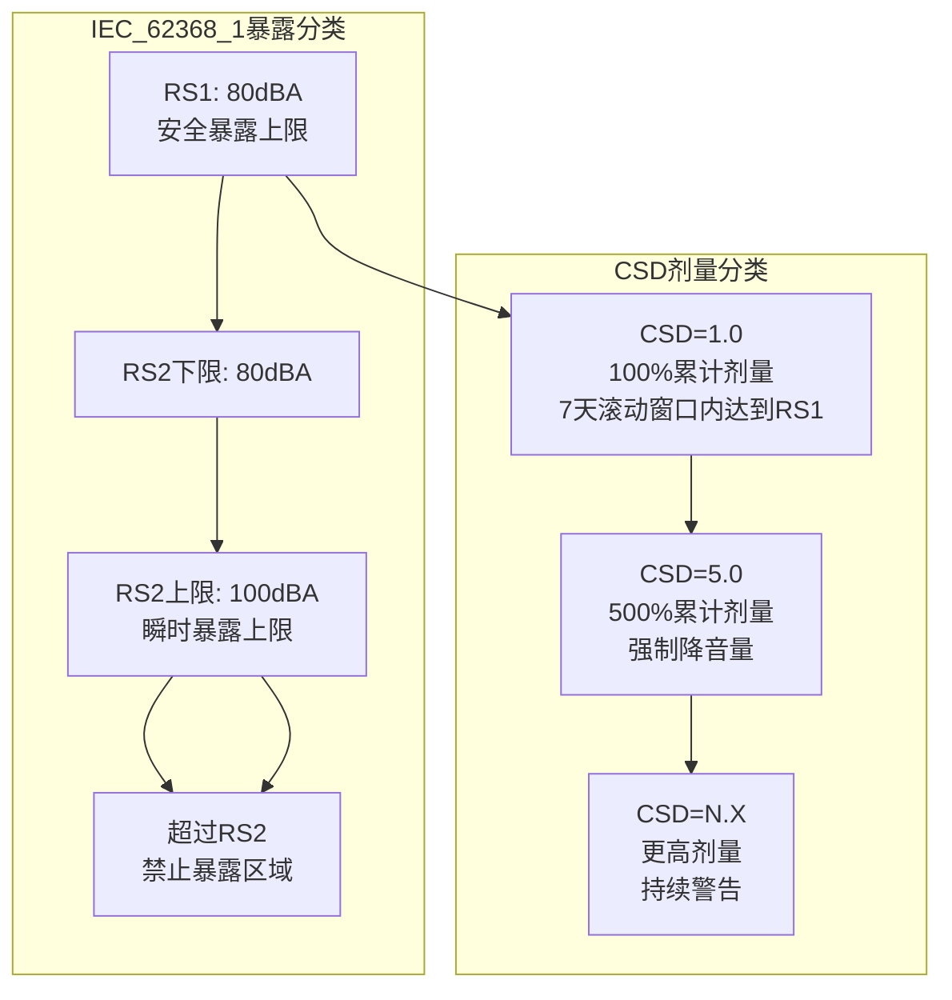
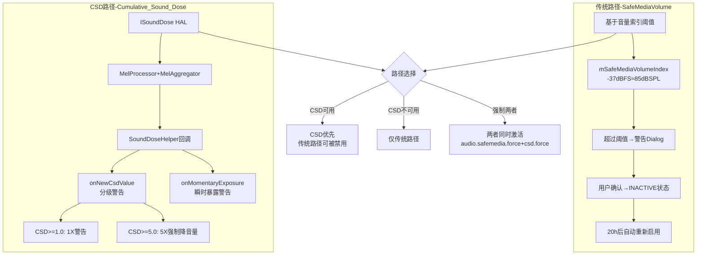
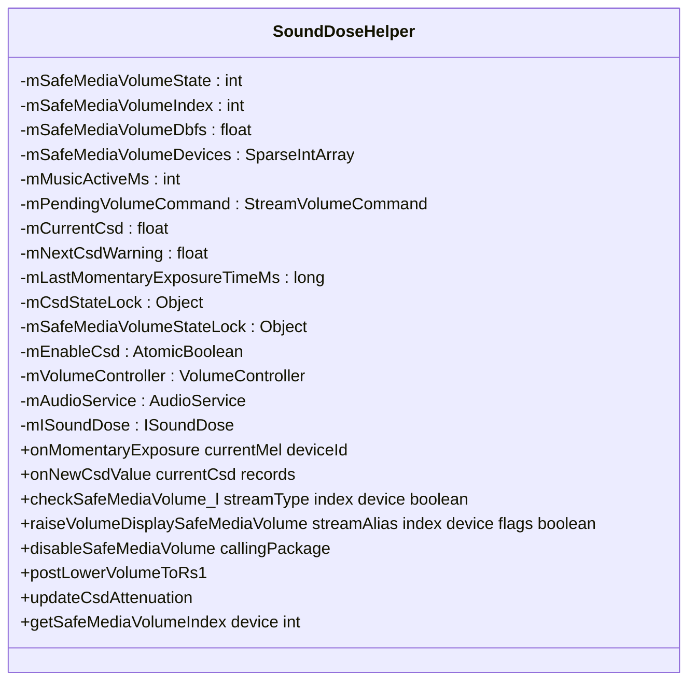
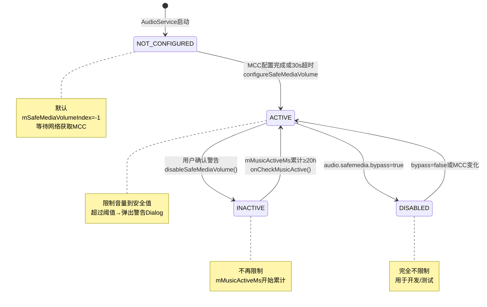
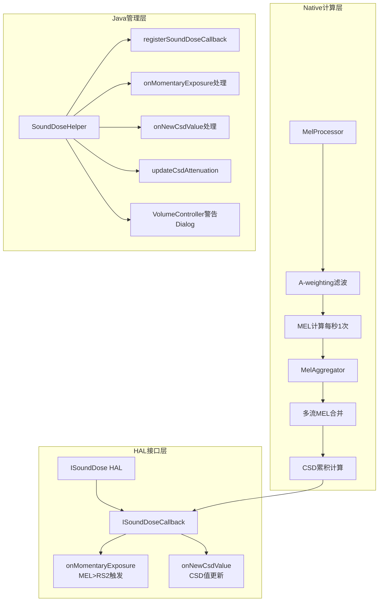
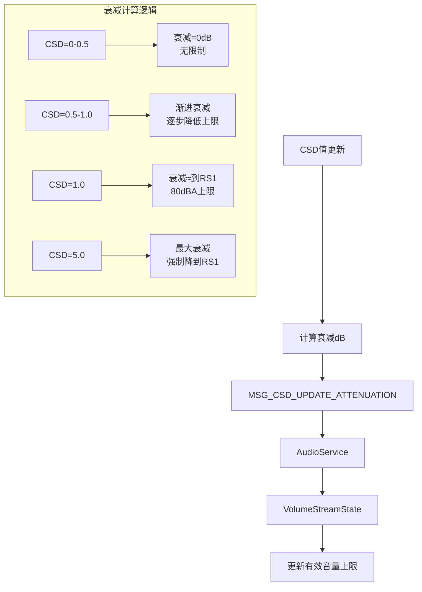
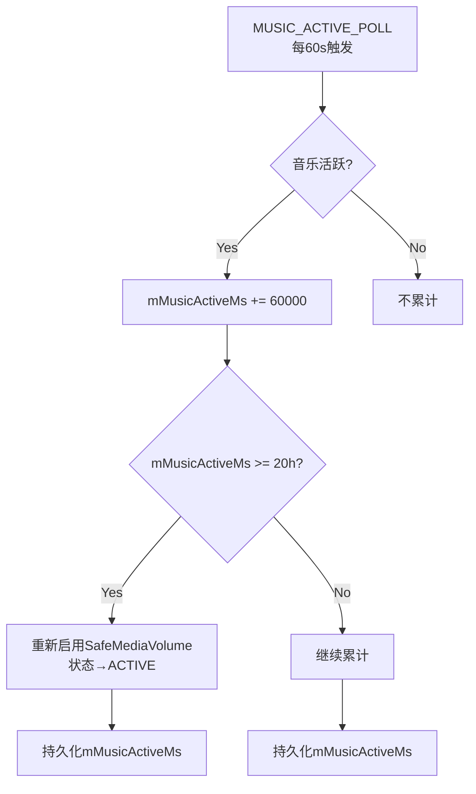
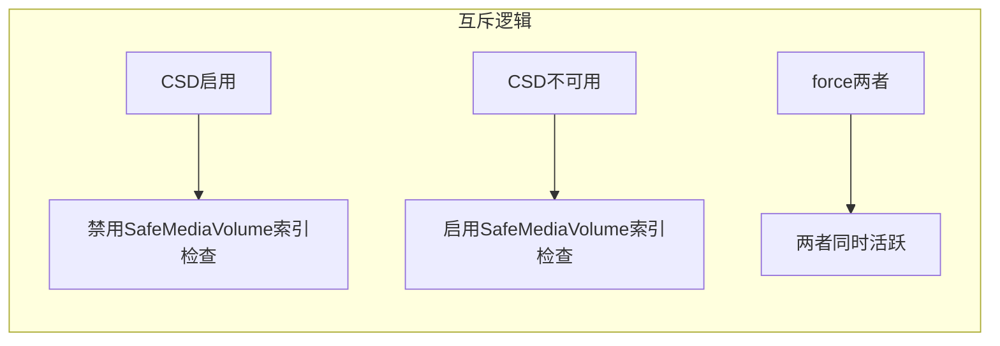
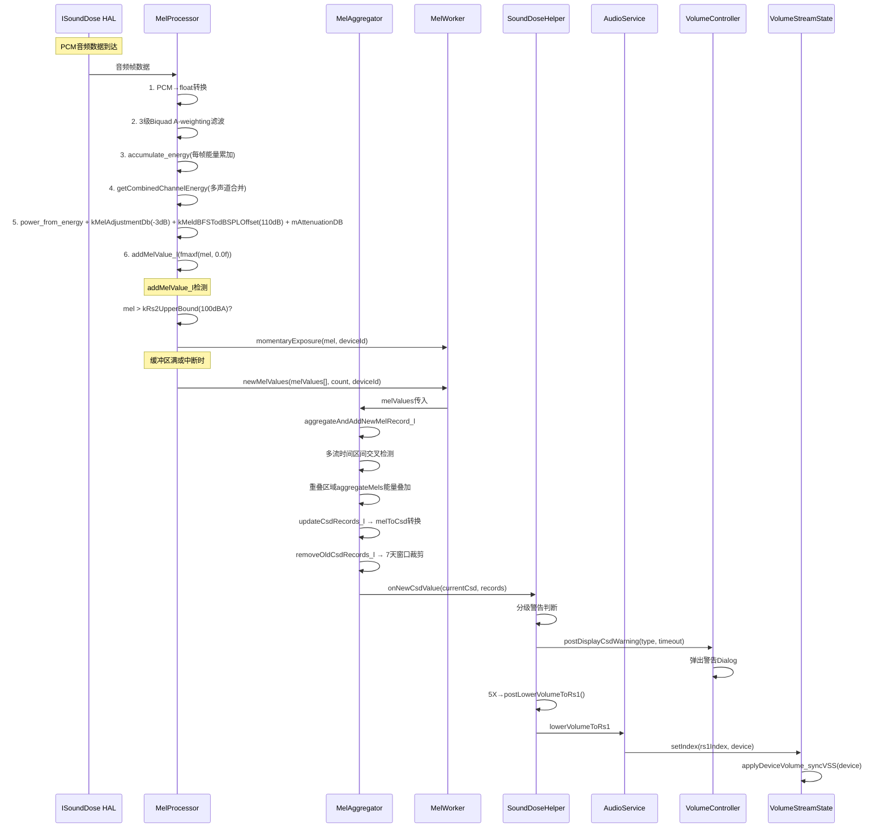

## 13.5 SoundDose与CSD声剂量管理

> [← 上一个](13_13.4_外部音频设备-USBHDMI有线设备管理.md) | [返回13章](README.md) | [返回导航](../README.md) | [下一个 →](13_13.6_MelProcessor-MEL计算引擎.md)

---

本节深度解析Android 14的SoundDose/CSD(Cumulative Sound Dose)声剂量管理系统，涵盖IEC 62368-1标准概念、双路径机制(传统SafeMediaVolume + CSD)、SoundDoseHelper Java层完整链路、ISoundDose HAL接口、CSD分级警告策略等核心机制。

### 13.5.1 IEC 62368-1标准与CSD概念

**IEC 62368-1音频安全标准**:

IEC 62368-1是国际电工委员会制定的音视频/信息技术设备安全标准，取代了旧版IEC 60065/60950。其音频暴露分类基于CSD(Cumulative Sound Dose)概念：



**核心概念定义**:

| 概念 | 定义 | 单位 |
|------|------|------|
| MEL (Momentary Exposure Level) | 瞬时暴露级别，每秒测量的A-weighted声压级 | dBA |
| CSD (Cumulative Sound Dose) | 累计声剂量，7天滚动窗口内MEL的能量积分 | Pa²·s |
| RS1 | 安全暴露上限，长时间听的安全阈值 | 80dBA |
| RS2 | 瞬时暴露上限，短时间可承受的最大声压 | 100dBA(下限80dBA) |
| CSD阈值 | CSD=1.0对应7天内在80dBA下的累计暴露量 | 1.6 Pa²·h = 5760 Pa²·s |

**A-weighting滤波**: MEL测量使用A-weighting频率加权曲线，模拟人耳对不同频率的灵敏度差异。1kHz参考频率增益为0dB，低频(<500Hz)和高频(>8kHz)被衰减。

### 13.5.2 双路径机制 — SafeMediaVolume + CSD

Android 14同时支持两种听力保护机制：



**路径切换逻辑**:

| 系统属性 | 效果 |
|---------|------|
| `audio.safemedia.force` | 强制启用传统SafeMediaVolume(即使CSD活跃) |
| `audio.safemedia.bypass` | 完全禁用SafeMediaVolume |
| `audio.safemedia.csd.force` | 强制启用CSD警告(即使HAL不支持) |

**默认行为**:
- CSD HAL可用(ISoundDose实现) → CSD路径优先，传统路径可能被禁用
- CSD HAL不可用 → 仅传统SafeMediaVolume路径
- 两者都force → 同时活跃(开发/测试用)

### 13.5.3 SoundDoseHelper类结构

[`SoundDoseHelper`](frameworks/base/services/core/java/com/android/server/audio/SoundDoseHelper.java:75) 是CSD和SafeMediaVolume的Java层管理核心：



**核心常量**:

| 常量 | 值 | 含义 |
|------|-----|------|
| SAFE_MEDIA_VOLUME_NOT_CONFIGURED | 0 | 启动初始状态，等待MCC配置 |
| SAFE_MEDIA_VOLUME_DISABLED | 1 | 禁用(bypass属性) |
| SAFE_MEDIA_VOLUME_INACTIVE | 2 | 用户已确认(不再限制) |
| SAFE_MEDIA_VOLUME_ACTIVE | 3 | 活跃限制状态 |
| UNSAFE_VOLUME_MUSIC_ACTIVE_MS_MAX | 20×3600×1000=72000000 | 20小时累计后自动重新启用 |
| SAFE_VOLUME_CONFIGURE_TIMEOUT_MS | 30000 | 启动30s后强制配置 |
| MUSIC_ACTIVE_POLL_PERIOD_MS | 60000 | 每1分钟检查音乐活跃 |
| CSD_WARNING_TIMEOUT_MS_DOSE_1X | 7000 | 1X警告Dialog超时7s |
| CSD_WARNING_TIMEOUT_MS_DOSE_5X | 5000 | 5X警告Dialog超时5s |
| CSD_WARNING_TIMEOUT_MS_MOMENTARY_EXPOSURE | 5000 | 瞬时暴露警告超时5s |
| MOMENTARY_EXPOSURE_TIMEOUT_MS | 20×3600×1000 | 20h内不重复瞬时警告 |

### 13.5.4 安全体量状态机详解



**configureSafeMediaVolume过程**:

1. 获取MCC(Mobile Country Code) → 查询国家安全音量配置
2. 计算安全音量索引: `mSafeMediaVolumeIndex`对应-37dBFS(约85dBSPL)
3. 初始化per-device安全索引: 对每个安全设备计算对应的UI索引
4. 状态设置: `SAFE_MEDIA_VOLUME_ACTIVE`
5. 应用安全音量: 限制当前MUSIC音量到安全值

**mSafeMediaVolumeDevices初始化**:

[`initSafeVolumes()`](frameworks/base/services/core/java/com/android/server/audio/SoundDoseHelper.java:317)为安全设备设置音量上限：

| 设备 | 说明 | 默认安全索引 |
|------|------|-------------|
| WIRED_HEADSET(0x3) | 3.5mm有线耳机 | 约-37dBFS对应的索引 |
| WIRED_HEADPHONE(0x4) | 3.5mm有线耳机(纯输出) | 同上 |
| USB_HEADSET(0x400) | USB耳机 | 同上 |
| BLE_HEADSET(0x800) | BLE耳机 | 同上 |
| BLE_BROADCAST(0x880) | BLE广播 | 同上 |
| A2DP_HEADPHONES(0x400) | A2DP蓝牙耳机 | 同上 |

**-37dBFS对应85dBSPL的推导**:
- 典型耳机灵敏度: 100dBSPL @ 0dBFS(1Vrms)
- -37dBFS → 100 - 37 = 63dBSPL(实际输出)
- 但考虑EQ+Bass Boost可能增加22dB增益 → 63 + 22 = 85dBSPL
- 这是EN 60950标准中的合规推算

### 13.5.5 CSD回调链路详解

#### onMomentaryExposure — 瞬时暴露回调

[`onMomentaryExposure()`](frameworks/base/services/core/java/com/android/server/audio/SoundDoseHelper.java:216) 由MelProcessor在检测到MEL > RS2(100dBA)时触发：

```java
public void onMomentaryExposure(float currentMel, int deviceId) {
    if (!mEnableCsd.get()) {
        Log.w(TAG, "onMomentaryExposure: csd not supported, ignoring callback");
        return;
    }
    
    boolean postWarning = false;
    synchronized (mCsdStateLock) {
        // 20小时去重: 同一设备20h内只警告一次
        if (mLastMomentaryExposureTimeMs < 0
                || (System.currentTimeMillis() - mLastMomentaryExposureTimeMs)
                >= MOMENTARY_EXPOSURE_TIMEOUT_MS) {
            mLastMomentaryExposureTimeMs = System.currentTimeMillis();
            postWarning = true;
        }
    }
    
    if (postWarning) {
        mVolumeController.postDisplayCsdWarning(
                AudioManager.CSD_WARNING_MOMENTARY_EXPOSURE,
                getTimeoutMsForWarning(AudioManager.CSD_WARNING_MOMENTARY_EXPOSURE));  // 5s
    }
}
```

**瞬时暴露警告特点**:
- 触发条件: MEL > RS2上限(100dBA) → 声压级极高
- 去重机制: 20小时内同一设备不重复警告(mLastMomentaryExposureTimeMs)
- Dialog超时: 5秒自动消失(CSD_WARNING_TIMEOUT_MS_MOMENTARY_EXPOSURE)
- 不降音量: 仅提示用户，不强制降低

#### onNewCsdValue — CSD剂量更新回调

[`onNewCsdValue()`](frameworks/base/services/core/java/com/android/server/audio/SoundDoseHelper.java:243) 由MelAggregator在CSD值更新时触发：

```java
public void onNewCsdValue(float currentCsd, SoundDoseRecord[] records) {
    if (!mEnableCsd.get()) {
        Log.w(TAG, "onNewCsdValue: csd not supported, ignoring value");
        return;
    }
    
    synchronized (mCsdStateLock) {
        if (mCurrentCsd < currentCsd) {
            // === 剂量增加 ===
            if ((mCurrentCsd < mNextCsdWarning) && (currentCsd >= mNextCsdWarning)) {
                if (mNextCsdWarning == 5.0f) {
                    // 500%剂量: 强制降音量到RS1
                    mVolumeController.postDisplayCsdWarning(
                            AudioManager.CSD_WARNING_DOSE_REACHED_5X, 5s);
                    mAudioService.postLowerVolumeToRs1();  // 立即降音量!
                } else {
                    // 100%/200%/300%/400%剂量: 仅警告Dialog
                    mVolumeController.postDisplayCsdWarning(
                            AudioManager.CSD_WARNING_DOSE_REACHED_1X, 7s);
                }
                mNextCsdWarning += 1.0f;  // 下一个警告阈值
            }
        } else {
            // === 剂量减少 ===
            if ((currentCsd < mNextCsdWarning - 1.0f) && (mNextCsdWarning >= 2.0f)) {
                mNextCsdWarning -= 1.0f;  // 降低下一个警告阈值
            }
        }
        mCurrentCsd = currentCsd;
        updateSoundDoseRecords_l(records, currentCsd);
    }
}
```

**CSD分级警告策略**:

| CSD值 | 警告类型 | Dialog超时 | 音量操作 |
|--------|---------|-----------|---------|
| ≥ 1.0 (100%) | CSD_WARNING_DOSE_REACHED_1X | 7s | 仅警告 |
| ≥ 2.0 (200%) | CSD_WARNING_DOSE_REACHED_1X | 7s | 仅警告 |
| ≥ 3.0 (300%) | CSD_WARNING_DOSE_REACHED_1X | 7s | 仅警告 |
| ≥ 4.0 (400%) | CSD_WARNING_DOSE_REACHED_1X | 7s | 仅警告 |
| ≥ 5.0 (500%) | CSD_WARNING_DOSE_REACHED_5X | 5s | **强制降低到RS1** |
| ≥ 6.0+ (600%+) | CSD_WARNING_DOSE_REACHED_5X | 5s | 强制降低到RS1 |

**mNextCsdWarning递增机制**:
- 初始值: 1.0
- 每次跨越一个整数阈值 → 警告 + mNextCsdWarning += 1.0
- CSD下降时：如果currentCsd < mNextCsdWarning - 1.0 → mNextCsdWarning -= 1.0
- 这避免了CSD在1.0附近波动时反复弹出警告

### 13.5.6 ISoundDose HAL接口

**ISoundDose HAL定义**:



**ISoundDose接口方法**:
- `registerSoundDoseCallback(callback)`: 注册CSD回调，开始MEL/CSD计算
- `setCsdEnabled(enabled)`: 启用/禁用CSD计算
- `setOutputDevice(device)`: 设置当前输出设备类型(影响A-weighting参数)

**ISoundDoseCallback接口**:
- `onMomentaryExposure(currentMel, deviceId)`: 瞬时暴露回调
- `onNewCsdValue(currentCsd, records)`: CSD值更新回调，携带SoundDoseRecord数组

### 13.5.7 CSD声剂量衰减机制

当CSD值增加时，SoundDoseHelper计算衰减dB值，限制有效音量上限：



**postLowerVolumeToRs1详解**:

[`postLowerVolumeToRs1()`](frameworks/base/services/core/java/com/android/server/audio/SoundDoseHelper.java) 在CSD达到5.0时触发：

1. 计算RS1安全音量索引(mSafeMediaVolumeIndex)
2. 调用`AudioService.setStreamVolumeInt(STREAM_MUSIC, rs1Index, device)`
3. 不弹出警告Dialog(已由onNewCsdValue处理)
4. 音量被强制降低，用户无法在5X警告期间升高音量

### 13.5.8 SoundDoseRecord持久化

CSD值和声剂量记录需要跨重启持久化，确保7天滚动窗口的数据完整性：

**SoundDoseRecord结构**:

```java
// SoundDoseRecord包含:
// - timestamp: 记录时间戳
// - csdValue: CSD剂量值
// - durationSeconds: 暴露持续时间
```

**持久化格式**:

[`PERSIST_CSD_RECORD_FIELD_SEPARATOR`](frameworks/base/services/core/java/com/android/server/audio/SoundDoseHelper.java:134) = ","
[`PERSIST_CSD_RECORD_SEPARATOR`](frameworks/base/services/core/java/com/android/server/audio/SoundDoseHelper.java:136) = "|"

每条记录格式: `timestamp,csdValue,durationSeconds`
多条记录以"|"分隔

**持久化时机**: `MSG_PERSIST_CSD_VALUES` → 写入Settings数据库

### 13.5.9 mMusicActiveMs累计与20h自动重新启用

[`onCheckMusicActive()`](frameworks/base/services/core/java/com/android/server/audio/SoundDoseHelper.java:599) 定期检查音乐活跃时间：



**20小时累计逻辑**:
- INACTIVE状态下: 每60秒检查MUSIC Stream是否活跃
- 活跃 → mMusicActiveMs += 60000
- mMusicActiveMs ≥ 72000000(20×3600×1000ms) → 重新启用安全音量(ACTIVE)
- 重新启用后: mMusicActiveMs清零，音乐音量被限制到安全值

### 13.5.10 CSD与SafeMediaVolume的互斥关系



**默认行为**:
- CSD HAL可用 → CSD优先 → SafeMediaVolume索引检查被绕过
- 原因: CSD基于实际声剂量计算更精确，传统索引检查是粗略估算
- 但安全音量设备列表(mSafeMediaVolumeDevices)和per-device初始音量仍然生效

**首次连接耳机时的音量限制(无论哪条路径)**:
1. 设备在mSafeMediaVolumeDevices列表中
2. 首次连接 → 音量默认为安全值(mSafeMediaVolumeIndex)
3. 这是"预防性限制"，不依赖CSD计算结果

### 13.5.11 CSD警告Dialog类型

| 警告类型 | 常量 | 超时 | 含义 | 音量操作 |
|---------|------|------|------|---------|
| CSD_WARNING_DOSE_REACHED_1X | 1 | 7s | CSD达到100%/200%/300%/400% | 仅提示 |
| CSD_WARNING_DOSE_REACHED_5X | 2 | 5s | CSD达到500% | 强制降到RS1 |
| CSD_WARNING_MOMENTARY_EXPOSURE | 3 | 5s | 瞬时MEL>100dBA | 仅提示 |
| CSD_WARNING_DOSE_ACCUMULATION_START | 4 | -1(需用户确认) | CSD开始累积 | 仅提示 |

**getTimeoutMsForWarning方法**:

```java
private int getTimeoutMsForWarning(int warningType) {
    switch (warningType) {
        case AudioManager.CSD_WARNING_DOSE_REACHED_1X:
            return CSD_WARNING_TIMEOUT_MS_DOSE_1X;      // 7s
        case AudioManager.CSD_WARNING_DOSE_REACHED_5X:
            return CSD_WARNING_TIMEOUT_MS_DOSE_5X;      // 5s(更紧急)
        case AudioManager.CSD_WARNING_MOMENTARY_EXPOSURE:
            return CSD_WARNING_TIMEOUT_MS_MOMENTARY_EXPOSURE; // 5s
        case AudioManager.CSD_WARNING_DOSE_ACCUMULATION_START:
            return CSD_WARNING_TIMEOUT_MS_ACCUMULATION_START;  // -1(需确认)
    }
}
```

### 13.5.12 CSD完整链路 — 从PCM到警告



### 13.5.13 CSD与AAOS车载场景

AAOS车载系统中，CSD声剂量管理对车内音频系统尤为重要：

**车载CSD特殊考量**:
1. **车内Speaker不算安全设备**: mSafeMediaVolumeDevices不包括SPEAKER → 车内不受SafeMediaVolume限制
2. **蓝牙耳机连接时CSD生效**: 驾驶员通过A2DP/BLE耳机听音乐 → CSD保护
3. **CSD衰减不影响车内Speaker**: Zone Volume Group独立管理 → CSD仅影响耳机Zone
4. **CarAudioService可自定义安全策略**: OEM可通过CarAudioPolicy覆盖默认行为

**车载CSD配置建议**:
- 车内Speaker: 不受限(远距离聆听、环境噪音高)
- 驾驶员耳机: 受CSD保护(近距离聆听、高声压风险)
- 后排娱乐: 可配置独立的安全音量策略

---

[← 上一个](13_13.4_外部音频设备-USBHDMI有线设备管理.md) | [返回13章](README.md) | [返回导航](../README.md) | [下一个 →](13_13.6_MelProcessor-MEL计算引擎.md)