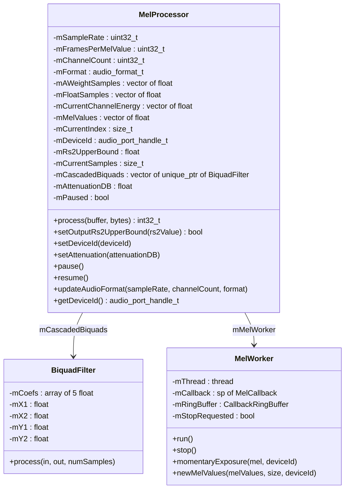
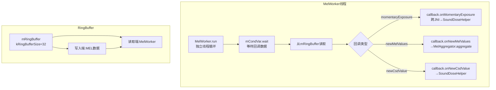

## 13.6 MelProcessor — MEL计算引擎

> [← 上一个](13_13.5_SoundDose与CSD声剂量管理.md) | [返回13章](README.md) | [返回导航](../README.md) | [下一个 →](13_13.7_MelAggregator-CSD聚合器.md)

---

本节深度解析Native层MelProcessor的MEL(Momentary Exposure Level)计算引擎，包括A-weighting Biquad滤波器实现、PCM→float转换、能量累积算法、MEL计算公式、RS2瞬时暴露检测、MelWorker异步回调机制等核心实现细节。

### 13.6.1 MelProcessor类结构

[`MelProcessor`](system/media/audio_utils/MelProcessor.cpp:60) 是Native层MEL计算的核心类，定义在`system/media/audio_utils/`目录：



**核心源码文件**:
- [`MelProcessor.cpp`](system/media/audio_utils/MelProcessor.cpp:1) — 414行，MEL计算核心实现
- [`MelProcessor.h`](system/media/audio_utils/MelProcessor.h:1) — 247行，头文件定义

### 13.6.2 核心常量详解

| 常量 | 值 | 含义 | 来源 |
|------|-----|------|------|
| kSecondsPerMelValue | 1 | 每秒计算1个MEL值 | L36 |
| kMelAdjustmentDb | -3.f | MEL调整dB值，IEC标准补偿 | L37 |
| kMeldBFSTodBSPLOffset | 110.f | dBFS→dBSPL偏移量，IEC 62368-1 Table39 | L41 |
| kRs1OutputdBFS | 80.f | RS1输出阈值(80dBA) | L43 |
| kRs2LowerBound | 80.f | RS2下限(80dBA) | L45 |
| kRs2UpperBound | 100.f | RS2上限(100dBA) | L46 |

**dBFS→dBSPL偏移量推导**:

IEC 62368-1 Table39定义:
- -30dBFS → 80dBSPL → offset = 80 + 30 = 110
- -10dBFS → 100dBSPL → offset = 100 + 10 = 110

即: `dBSPL = dBFS + 110`

这是IEC标准中假设的典型耳机灵敏度转换关系。

### 13.6.3 A-weighting Biquad滤波器实现

A-weighting滤波器由3级级联IIR Biquad滤波器组成，遵循IEC 61672:2003标准：

**Biquad系数数组**:

[`kBiquadCoefs1`](system/media/audio_utils/MelProcessor.cpp:50) — 第一级滤波器(Band-pass):

| 采样率 | b0 | b1 | b2 | a1 | a2 |
|--------|-----|-----|-----|-----|-----|
| 44.1kHz | 0.956166 | -1.319604 | 0.363438 | -1.318614 | 0.320595 |
| 48kHz | 0.965251 | -1.347302 | 0.382051 | -1.347307 | 0.349058 |

[`kBiquadCoefs2`](system/media/audio_utils/MelProcessor.cpp:53) — 第二级滤波器(Band-pass):

| 采样率 | b0 | b1 | b2 | a1 | a2 |
|--------|-----|-----|-----|-----|-----|
| 44.1kHz | 0.943171 | -1.886343 | 0.943171 | -1.885586 | 0.887099 |
| 48kHz | 0.946970 | -1.893939 | 0.946970 | -1.893871 | 0.895160 |

[`kBiquadCoefs3`](system/media/audio_utils/MelProcessor.cpp:56) — 第三级滤波器(High-pass):

| 采样率 | b0 | b1 | b2 | a1 | a2 |
|--------|-----|-----|-----|-----|-----|
| 44.1kHz | 0.697368 | -0.425528 | -0.271840 | -1.318594 | 0.320588 |
| 48kHz | 0.646665 | -0.383622 | -0.263043 | -1.347307 | 0.349058 |

**Biquad差分方程**:

```
y[n] = b0 * x[n] + b1 * x[n-1] + b2 * x[n-2] - a1 * y[n-1] - a2 * y[n-2]
```

**级联特性**: 3级Biquad串联 → 总传递函数 = H1(z) × H2(z) × H3(z)，等效于IEC 61672定义的A-weighting曲线。

**支持采样率**: 仅44.1kHz和48kHz。其他采样率不支持( [`isSampleRateSupported_l()`](system/media/audio_utils/MelProcessor.cpp:87) 返回false → process()跳过计算)。

**createBiquads_l实现**:

[`createBiquads_l()`](system/media/audio_utils/MelProcessor.cpp:96) 根据当前采样率选择系数索引(coefsIndex: 44.1kHz→0, 48kHz→1)，为每个声道创建3级BiquadFilter:

```cpp
void MelProcessor::createBiquads_l() {
    const int coefsIndex = mSampleRate == 44100 ? 0 : 1;
    mCascadedBiquads.push_back(std::make_unique<DefaultBiquadFilter>(
        mChannelCount, kBiquadCoefs1.at(coefsIndex)));
    mCascadedBiquads.push_back(std::make_unique<DefaultBiquadFilter>(
        mChannelCount, kBiquadCoefs2.at(coefsIndex)));
    mCascadedBiquads.push_back(std::make_unique<DefaultBiquadFilter>(
        mChannelCount, kBiquadCoefs3.at(coefsIndex)));
}
```

### 13.6.4 process()核心算法详解

[`process()`](system/media/audio_utils/MelProcessor.cpp:235) 是MelProcessor的核心入口方法：

```mermaid
flowchart TB
    PROCESS[process调用] --> CHECK_PAUSE{mPaused?}
    CHECK_PAUSE -->|Yes| RETURN_0[返回0,跳过计算]
    CHECK_PAUSE -->|No| CHECK_SR{采样率支持?}
    CHECK_SR -->|No| RETURN_0
    CHECK_SR -->|Yes| CALC_BYTES[计算所需样本数]
    
    CALC_BYTES --> CONVERT[PCM→float转换<br>bytes_to_float_by_format]
    CONVERT --> A_WEIGHT[applyAWeight_l<br>3级Biquad滤波]
    A_WEIGHT --> ENERGY[累积能量<br>逐帧累加到mCurrentChannelEnergy]
    ENERGY --> CHECK_COUNT{mCurrentSamples >= mFramesPerMelValue?}
    
    CHECK_COUNT -->|Yes| CALC_MEL[计算MEL值]
    CHECK_COUNT -->|No| RETURN_BYTES[返回已处理字节数]
    
    CALC_MEL --> COMBINED[getCombinedChannelEnergy_l<br>多声道能量合并]
    COMBINED --> POWER[power_from_energy<br>能量→dBFS转换]
    POWER --> OFFSET[dBFS→dBSPL<br>+kMelAdjustmentDb+kMeldBFSTodBSPLOffset+mAttenuationDB]
    OFFSET --> CLAMP[fmaxf(mel, 0.0f)]
    CLAMP --> ADD[addMelValue_l]
    
    ADD --> RS2_CHECK{mel > mRs2UpperBound?}
    RS2_CHECK -->|Yes| ME[mMelWorker.momentaryExposure]
    RS2_CHECK -->|No| RS1_CHECK{mel >= kRs1OutputdBFS?}
    RS1_CHECK -->|Yes| STORE_RS1[存入mMelValues+mCurrentIndex++]
    RS1_CHECK -->|No| STORE_ALL[存入mMelValues]
    
    STORE_RS1 --> BUFFER_CHECK{缓冲区满?}
    STORE_ALL --> BUFFER_CHECK
    BUFFER_CHECK -->|Yes| CALLBACK[mMelWorker.newMelValues]
    BUFFER_CHECK -->|No| CONTINUE[继续处理]
```

**process()完整源码解析**:

```cpp
int32_t MelProcessor::process(const void* buffer, size_t bytes) {
    if (mPaused) return 0;
    
    std::lock_guard<std::mutex> l(mLock);
    if (!isSampleRateSupported_l()) return 0;
    
    // 1. 计算本次可处理的样本数
    const size_t samplesPerByte = audio_bytes_per_sample(mFormat);
    const size_t requiredSamples = mFramesPerMelValue * mChannelCount - mCurrentSamples;
    size_t samples = std::min(bytes / samplesPerByte, requiredSamples);
    
    // 2. PCM→float转换
    memcpy_by_audio_format(mFloatSamples.data() + mCurrentSamples * mChannelCount,
            AUDIO_FORMAT_PCM_FLOAT, buffer, mFormat, samples * mChannelCount);
    
    // 3. A-weighting滤波
    applyAWeight_l(samples);
    
    // 4. 能量累积
    mCurrentSamples += samples / mChannelCount;
    for (size_t ch = 0; ch < mChannelCount; ++ch) {
        mCurrentChannelEnergy[ch] += audio_utils_accumulate_energy(
                mAWeightSamples.data() + mCurrentSamples * mChannelCount + ch,
                mChannelCount, samples / mChannelCount);
    }
    
    // 5. 达到1秒帧数 → 计算MEL
    if (mCurrentSamples >= mFramesPerMelValue) {
        float mel = audio_utils_power_from_energy(getCombinedChannelEnergy_l())
                + kMelAdjustmentDb + kMeldBFSTodBSPLOffset + mAttenuationDB;
        addMelValue_l(fmaxf(mel, 0.0f));
    }
    
    return bytes;  // 返回已处理字节数
}
```

### 13.6.5 applyAWeight_l — A-weighting滤波

[`applyAWeight_l()`](system/media/audio_utils/MelProcessor.cpp:171) 对float样本进行3级级联Biquad滤波：

```cpp
void MelProcessor::applyAWeight_l(size_t samples) {
    float* tempFloat = mFloatSamples.data() + mCurrentSamples * mChannelCount;
    // 第1级: kBiquadCoefs1 → Band-pass
    // 第2级: kBiquadCoefs2 → Band-pass  
    // 第3级: kBiquadCoefs3 → High-pass
    for (const auto& biquad : mCascadedBiquads) {
        biquad->process(tempFloat, mAWeightSamples.data() + mCurrentSamples * mChannelCount,
                samples / mChannelCount);
        tempFloat = mAWeightSamples.data() + mCurrentSamples * mChannelCount;
    }
}
```

**级联处理**: 每级Biquad处理所有声道(多声道并行滤波)，输入→输出→下一级输入。

### 13.6.6 getCombinedChannelEnergy_l — 多声道能量合并

[`getCombinedChannelEnergy_l()`](system/media/audio_utils/MelProcessor.cpp:190) 将所有声道能量合并为单一值：

```cpp
float MelProcessor::getCombinedChannelEnergy_l() {
    float combinedEnergy = 0.0f;
    for (auto& energy : mCurrentChannelEnergy) {
        combinedEnergy += energy;
    }
    return combinedEnergy / mFramesPerMelValue;  // 平均到每帧
}
```

**合并公式**: combinedEnergy = Σ(channelEnergy) / framesPerMelValue

这等效于所有声道功率的平均值(归一化到每帧)。对于立体声(L+R)，取两声道能量之和再除以帧数。

### 13.6.7 addMelValue_l — MEL值存储与回调触发

[`addMelValue_l()`](system/media/audio_utils/MelProcessor.cpp:201) 是MEL值存储和回调触发的关键方法：

```cpp
void MelProcessor::addMelValue_l(float mel) {
    mMelValues[mCurrentIndex] = mel;
    bool notifyWorker = false;
    
    // === RS2瞬时暴露检测 ===
    if (mel > mRs2UpperBound) {
        // MEL超过100dBA → 瞬时暴露回调
        mMelWorker.momentaryExposure(mel, mDeviceId);
        notifyWorker = true;
    }
    
    // === MEL值存储策略 ===
    bool reportContinuousValues = false;
    if (mMelValues[mCurrentIndex] >= kRs1OutputdBFS) {
        // MEL >= 80dBA → 仅存储高于RS1的值(过滤低值)
        ++mCurrentIndex;
        reportContinuousValues = true;
    }
    
    // === 回调触发条件 ===
    // 条件1: reportContinuousValues && 需要立即报告
    // 条件2: 缓冲区满(mCurrentIndex > mMelValues.size() - 1)
    if (reportContinuousValues || (mCurrentIndex > mMelValues.size() - 1)) {
        mMelWorker.newMelValues(mMelValues, mCurrentIndex, mDeviceId);
        notifyWorker = true;
        mCurrentIndex = 0;  // 重置缓冲区
    }
    
    if (notifyWorker) {
        mCondVar.notify_one();  // 唤醒MelWorker线程
    }
}
```

**三种触发场景**:
| 场景 | 条件 | 回调类型 |
|------|------|---------|
| RS2瞬时暴露 | mel > 100dBA | momentaryExposure + newMelValues |
| RS1过滤值 | mel >= 80dBA | 仅newMelValues(报告连续高值) |
| 缓冲区满 | index >= maxMelsCallback | newMelValues(批量报告) |

### 13.6.8 MelWorker异步回调机制

[`MelWorker`](system/media/audio_utils/MelProcessor.cpp:308) 是独立的回调处理线程，实现MEL回调的异步解耦：



**MelWorker核心特性**:
- **独立线程**: 避免在process()中直接回调 → 不阻塞音频处理
- **RingBuffer**: 容量32(kRingBufferSize)，生产者-消费者模式
- **condition_variable**: MelProcessor写入数据后notify_one唤醒MelWorker
- **stop机制**: mStopRequested标志 + notify_one唤醒 → 线程安全退出

**momentaryExposure回调路径**:

```cpp
void MelProcessor::MelWorker::momentaryExposure(float mel, audio_port_handle_t deviceId) {
    if (mRingBuffer.isFull()) {
        ALOGW("cannot add momentary exposure for port %d, MelWorker buffer is full", deviceId);
        return;
    }
    mCallbackRingBuffer.push(mCallback->promote(), {mel, 0.f, deviceId, MelCallbackData::MOMENTARY_EXPOSURE});
    mCondVar.notify_one();
}
```

**RingBuffer满时丢弃**: 如果32个回调槽位已满 → 丢弃新的瞬时暴露数据(避免阻塞音频处理线程)。

### 13.6.9 setAttenuation — CSD衰减设置

[`setAttenuation()`](system/media/audio_utils/MelProcessor.cpp:289) 设置外部衰减dB值(CSD衰减):

```cpp
void MelProcessor::setAttenuation(float attenuationDB) {
    ALOGV("setting the attenuation %f", attenuationDB);
    mAttenuationDB = attenuationDB;
}
```

**衰减dB值来源**: SoundDoseHelper计算的CSD衰减dB值，通过ISoundDose HAL传递到MelProcessor。

**衰减在MEL计算中的位置**: `mel = power_from_energy(combinedEnergy) + kMelAdjustmentDb + kMeldBFSTodBSPLOffset + mAttenuationDB`

**效果**: 衰减dB值正值 → MEL值增大(反映更高暴露风险)；负值 → MEL值减小(反映音量已被降低)。

### 13.6.10 updateAudioFormat — 音频格式更新

[`updateAudioFormat()`](system/media/audio_utils/MelProcessor.cpp:145) 支持动态更新音频参数：

```cpp
void MelProcessor::updateAudioFormat(uint32_t sampleRate, uint32_t channelCount,
        audio_format_t format) {
    std::lock_guard l(mLock);
    bool differentSampleRate = mSampleRate != sampleRate;
    bool differentChannelCount = mChannelCount != channelCount;
    
    mSampleRate = sampleRate;
    mFramesPerMelValue = sampleRate * kSecondsPerMelValue;  // 重新计算
    mChannelCount = channelCount;
    mFormat = format;
    
    // 重新分配缓冲区
    mAWeightSamples.resize(mFramesPerMelValue * mChannelCount);
    mFloatSamples.resize(mFramesPerMelValue * mChannelCount);
    mCurrentChannelEnergy.resize(channelCount);
    
    if (differentSampleRate || differentChannelCount) {
        createBiquads_l();  // 重建滤波器(采样率变化)
    }
}
```

**调用时机**: AudioFlinger Output线程切换音频格式时(如从48kHz切换到44.1kHz)，需要重建Biquad滤波器系数。

### 13.6.11 MelProcessor与AudioFlinger集成

```mermaid
flowchart TB
    subgraph AudioFlinger写入路径
        AF[AudioFlinger.write] --> HAL_WRITE[HAL StreamOut.write]
        AF --> MEL_PROC[MelProcessor.process<br>同步调用]
    end
    
    subgraph MEL计算链路
        MEL_PROC --> A_WEIGHT[A-weighting滤波]
        A_WEIGHT --> ENERGY[能量累积]
        ENERGY --> MEL_VAL[MEL值计算]
        MEL_VAL --> MEL_WORKER[MelWorker线程]
    end
    
    subgraph 回调路径
        MEL_WORKER --> SDH_CB[SoundDoseHelper.onMomentaryExposure]
        MEL_WORKER --> MA_CB[MelAggregator.onNewMelValues]
        MA_CB --> MA_AGGR[MelAggregator.aggregate]
        MA_AGGR --> SDH_CSD[SoundDoseHelper.onNewCsdValue]
    end
    
    Note over MEL_PROC: process()在AudioFlinger<br>写入线程中同步执行<br>不阻塞(只累积能量)
    Note over MEL_WORKER: 回调异步执行<br>在MelWorker独立线程
```

**process()调用时机**: AudioFlinger在`threadLoop_write()`后调用`MelProcessor.process()`，将PCM数据同步传入。process()本身不做回调(只累积能量)，回调在MelWorker线程异步执行。

### 13.6.12 MEL计算公式详解

**从PCM到MEL的完整计算链**:

```
1. PCM → float转换:
   float_sample = convert_by_format(pcm_sample, format)
   
2. A-weighting滤波:
   a_weighted = Biquad1(Biquad2(Biquad3(float_sample)))
   
3. 能量累积(每秒):
   channelEnergy = Σ(a_weighted[i]^2) for i in [0, framesPerMelValue]
   
4. 多声道合并:
   combinedEnergy = Σ(channelEnergy[j]) / framesPerMelValue
   
5. dBFS转换:
   dBFS = 10 * log10(combinedEnergy)
   
6. dBSPL转换:
   dBSPL = dBFS + kMeldBFSTodBSPLOffset(110) = dBFS + 110
   
7. MEL最终值:
   MEL = fmaxf(dBFS + 110 - 3 + mAttenuationDB, 0.0)
```

**公式简化**: `MEL = max(dBFS + 107 + attenuationDB, 0)`

| 输入dBFS | 计算MEL | 含义 |
|----------|--------|------|
| -30 | 77 | 典型安全聆听 |
| -10 | 97 | 高音量聆听 |
| 0 | 107 | 最大音量 → 超过RS2 |
| +10 | 117 | 极高音量 → 远超RS2 |

**关键**: MEL=0对应约-107dBFS，即低于-107dBFS的声音不会触发任何警告。

---

[← 上一个](13_13.5_SoundDose与CSD声剂量管理.md) | [返回13章](README.md) | [返回导航](../README.md) | [下一个 →](13_13.7_MelAggregator-CSD聚合器.md)