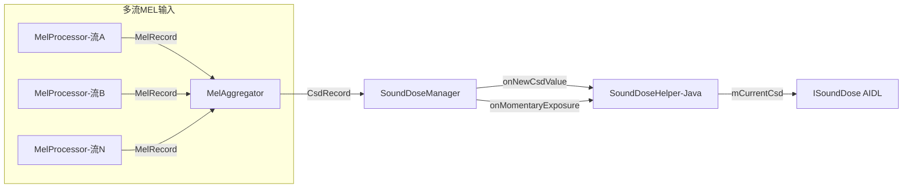
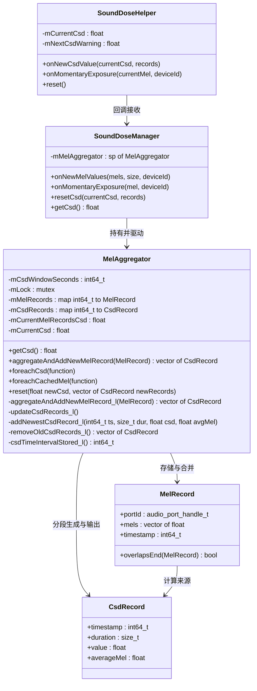
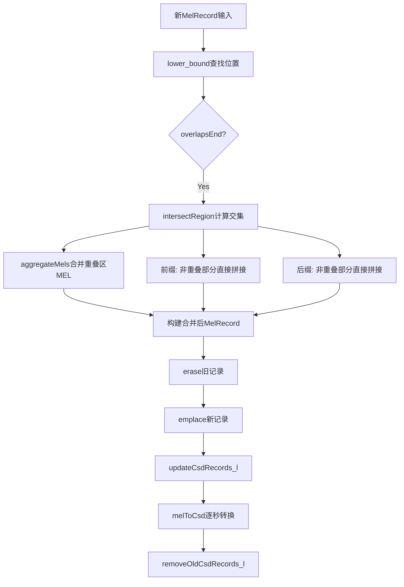
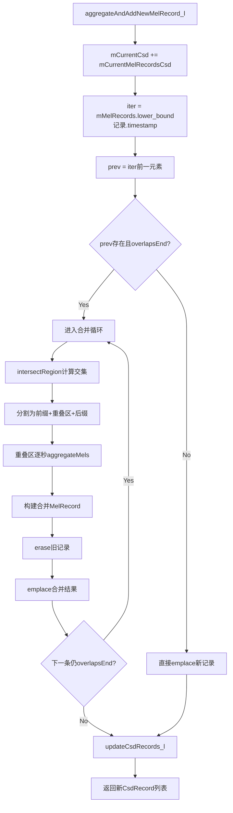
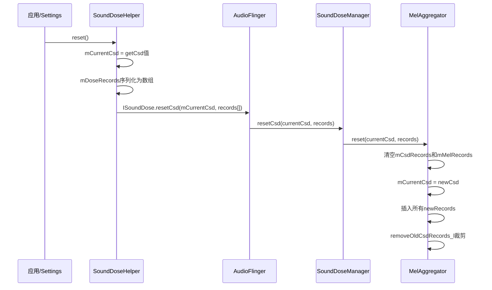
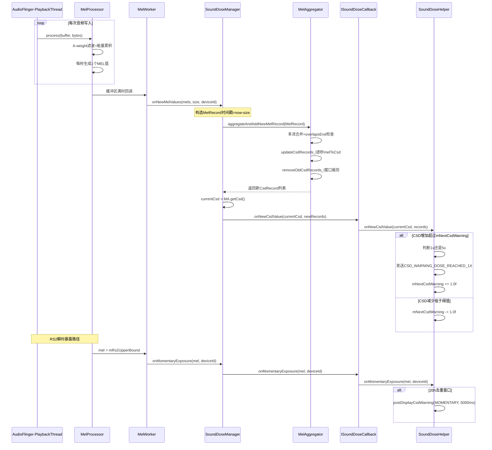

## 13.7 MelAggregator — CSD聚合器

> [← 上一个](13_13.6_MelProcessor-MEL计算引擎.md) | [返回13章](README.md) | [返回导航](../README.md) | [下一个 →](../14_Bluetooth_Audio/README.md)

---

本节深度解析Native层MelAggregator的CSD(Cumulative Sound Dose)聚合计算机制，包括MelRecord/CsdRecord数据结构、多流MEL合并算法、7天滚动窗口裁剪、CSD分段记录生成、跨重启恢复机制，以及从MelProcessor到SoundDoseHelper的完整CSD计算链路。

### 13.7.1 核心定位与架构角色

源码路径：[`MelAggregator.h`](system/media/audio_utils/include/audio_utils/MelAggregator.h) / [`MelAggregator.cpp`](system/media/audio_utils/MelAggregator.cpp)

MelAggregator在Android CSD听力保护体系中承担**多流聚合中枢**的角色：



**三大核心职责**：

1. **多流MEL合并**：当多个音频流同时播放时，相同时间段内各流MEL值按能量叠加合并为单一MEL序列
2. **CSD累计计算**：将合并后的MEL序列逐秒转换为CSD贡献值，按IEC 62368-1标准归一化
3. **7天滚动窗口**：仅保留604800秒(7天)内的CSD记录，超期自动裁剪

### 13.7.2 核心数据结构详解

**MelRecord** — MEL值记录（[`MelAggregator.h`](system/media/audio_utils/include/audio_utils/MelAggregator.h)）：

```cpp
struct MelRecord {
    audio_port_handle_t portId;   // 音频设备端口ID，标识MEL来源
    std::vector<float> mels;      // 连续MEL值向量（每秒1个，仅包含>=RS1的值）
    int64_t timestamp;            // 第一个MEL值的时间戳（秒级，单调递增）

    // 判断本记录是否与record的时间区间重叠
    // 本记录时间区间: [timestamp, timestamp + mels.size())
    bool overlapsEnd(const MelRecord& record) const {
        return timestamp + static_cast<int64_t>(mels.size()) > record.timestamp;
    }
};
```

**时间区间语义**：MelRecord的时间区间为左闭右开`[timestamp, timestamp + mels.size())`，`overlapsEnd()`判断的是**本记录是否延伸到record的起点之后**，即两个区间是否有交集。

**CsdRecord** — CSD贡献记录：

```cpp
struct CsdRecord {
    const int64_t timestamp;   // CSD值计算起始时间（秒）
    const size_t duration;     // 导致该CSD值的持续时间（秒）
    const float value;         // CSD贡献值，归一化：1.f = 100% CSD
    const float averageMel;    // 导致该CSD值的平均MEL能量（dBFS+SPL偏移后）
};
```

**CsdRecord.value归一化含义**：`value = 1.0f`代表该段MEL暴露已达到100% CSD阈值（即IEC 62368-1规定的1.6 Pa²h参考暴露），所有CsdRecord.value的累加和即为`mCurrentCsd`。

**MelAggregator类成员**：

| 成员 | 类型 | 含义 |
|------|------|------|
| `mCsdWindowSeconds` | `const int64_t` | CSD滚动窗口大小，固定604800(7天) |
| `mLock` | `mutable std::mutex` | 线程安全锁，保护所有map操作 |
| `mMelRecords` | `std::map<int64_t, MelRecord>` | 以timestamp为key的MEL记录，待合并计算 |
| `mCsdRecords` | `std::map<int64_t, CsdRecord>` | 以timestamp为key的CSD记录，已计算完毕 |
| `mCurrentMelRecordsCsd` | `float` | 当前mMelRecords中所有记录的CSD累加值 |
| `mCurrentCsd` | `float` | 全局CSD总值 = mCurrentMelRecordsCsd + mCsdRecords累加 |

**CSD总值拆分**：

```
mCurrentCsd = mCurrentMelRecordsCsd + Σ(mCsdRecords[i].value)
```

`mCurrentMelRecordsCsd`是尚未分段为CsdRecord的"半成品"CSD值，在`updateCsdRecords_l()`中被分段后清零。

### 13.7.3 类关系与交互图



### 13.7.4 核心常量与数学基础

**IEC 62368-1标准相关常量**：

| 常量 | 值 | 含义 | 来源 |
|------|-----|------|------|
| `kCsdThreshold` | 5760.0f | CSD阈值 = 1.6 Pa²h × 3600 s | IEC 62368-1 Annex C |
| `kReferenceEnergyPa` | 4e-10f | 参考声压能量 Pa² = (2e-5)² | IEC标准参考声压20μPa |
| `kMinCsdRecordToStore` | 0.01f | CsdRecord最小存储阈值 | 避免碎片化记录 |
| `kCsdWindowSeconds` | 604800 | 7天滚动窗口 | SoundDoseManager构造 |

**kCsdThreshold推导**：

IEC 62368-1定义CSD = 100%时的声暴露量为 **1.6 Pa²h**（帕斯卡平方小时），转换为帕斯卡平方秒：

```
1.6 Pa²h × 3600 s/h = 5760 Pa²s
```

**MEL→CSD转换公式**：

```cpp
float melToCsd(float mel) {
    return kReferenceEnergyPa * powf(10.f, mel / 10.f) / kCsdThreshold;
}
```

数学展开：

```
CSD(每秒) = (p²_ref × 10^(MEL/10)) / kCsdThreshold
         = ((2×10⁻⁵)² × 10^(MEL/10)) / 5760
         = (4×10⁻¹⁰ × 10^(MEL/10)) / 5760
```

其中`10^(MEL/10)`将dB值还原为能量比，乘以`p²_ref`得到帕斯卡平方能量值，除以阈值得到归一化CSD贡献。

**能量叠加公式**（多流合并）：

```cpp
float aggregateMels(float mel1, float mel2) {
    return audio_utils_power_from_energy(
        powf(10.f, mel1 / 10.f) + powf(10.f, mel2 / 10.f));
}
```

两个MEL值先转换到线性能量域相加，再转回dB域。这保证了多流同时播放时CSD的正确累加——因为声能量是线性可加的，而dB值不可直接相加。

**时间加权平均能量**：

```cpp
float averageMelEnergy(float mel1, int64_t dur1, float mel2, int64_t dur2) {
    return audio_utils_power_from_energy(
        (powf(10.f, mel1/10.f) * dur1 + powf(10.f, mel2/10.f) * dur2) / (dur1 + dur2));
}
```

按持续时间加权平均，用于CsdRecord的averageMel计算。

### 13.7.5 辅助函数源码解析

**intersectRegion** — 计算两条MelRecord的时间交集区间：

```cpp
std::pair<int64_t, int64_t> intersectRegion(
        const MelRecord& v1, const MelRecord& v2) {
    return {std::max(v1.timestamp, v2.timestamp),
            std::min(v1.timestamp + (int64_t)v1.mels.size(),
                     v2.timestamp + (int64_t)v2.mels.size())};
}
```

返回值`{start, end}`为两条记录时间区间的交集（左闭右开）。若`start >= end`则无交集。

**createRevertedRecord** — 创建反向CSD记录用于撤销：

```cpp
CsdRecord createRevertedRecord(const CsdRecord& r) {
    return {r.timestamp, r.duration, -r.value, r.averageMel};
}
```

当旧CsdRecord被新合并结果覆盖时，通过插入负值CsdRecord来"撤销"旧记录的贡献，而非直接删除。这保证了`mCurrentCsd`的增量更新正确性。

**辅助函数在合并流程中的调用关系**：



### 13.7.6 aggregateAndAddNewMelRecord_l多流合并核心算法

这是MelAggregator最复杂的方法，负责将新到达的MelRecord与已有记录合并并触发CSD更新。

**算法步骤详解**：

```
步骤1: 累加当前mMelRecords的Csd贡献到mCurrentCsd
        mCurrentCsd += mCurrentMelRecordsCsd

步骤2: 在mMelRecords中用lower_bound查找新记录的插入位置

步骤3: 检查前一条记录(prev)是否与新记录时间重叠
        若prev.overlapsEnd(newRecord)则进入合并流程

步骤4: 合并流程（循环处理所有重叠）
        对每条重叠的旧记录:
        a) intersectRegion计算交集区间 [start, end)
        b) 前缀拼接: 旧记录中start之前的部分直接保留
        c) 重叠区域: 逐秒aggregateMels合并两个MEL的能量
        d) 后缀拼接: 取较长的尾部拼接
        e) 从mMelRecords中erase旧记录
        f) 将合并结果emplace回mMelRecords
        g) 继续检查下一条是否仍然重叠

步骤5: 若无重叠，直接emplace新记录到mMelRecords

步骤6: 调用updateCsdRecords_l()重新计算CSD
```

**合并流程图**：



**合并示例**：假设旧记录A覆盖时间段[10, 20)，新记录B覆盖[15, 25)

```
旧记录A: timestamp=10, mels=[70, 72, 74, 76, 78, 80, 82, 84, 86, 88]
新记录B: timestamp=15, mels=[75, 77, 79, 81, 83, 85, 87, 89, 91, 93]

合并过程:
1) intersectRegion(A, B) = {15, 20}  重叠区[15,20)共5秒
2) 前缀: A的[10,15)部分 → mels[0:5] = [70,72,74,76,78]
3) 重叠区[15,20): 逐秒aggregateMels
   秒15: aggregateMels(A.mels[5]=80, B.mels[0]=75) = 81.2dB
   秒16: aggregateMels(A.mels[6]=82, B.mels[1]=77) = 83.2dB
   秒17: aggregateMels(A.mels[7]=84, B.mels[2]=79) = 85.2dB
   秒18: aggregateMels(A.mels[8]=86, B.mels[3]=81) = 87.2dB
   秒19: aggregateMels(A.mels[9]=88, B.mels[4]=83) = 89.2dB
4) 后缀: B的[20,25)部分 → B.mels[5:10] = [85,87,89,91,93]

合并结果:
timestamp=10, mels=[70,72,74,76,78, 81.2,83.2,85.2,87.2,89.2, 85,87,89,91,93]
               前缀(5秒)    重叠区(5秒)             后缀(5秒)
```

**关键设计点**：合并后的MelRecord时间戳取前缀起始时间，确保时间连续性。重叠区域的MEL值总是大于任一单流的MEL值（能量叠加），因此合并后的CSD贡献会增大。

### 13.7.7 updateCsdRecords_l CSD记录分段生成

`updateCsdRecords_l()`将mMelRecords中的MEL值逐秒转换为CSD贡献，并分段存储为CsdRecord。

**算法逻辑**：

```
1. 遍历mMelRecords中每条记录的每个MEL值
2. 对每个MEL值调用melToCsd()得到csdValue
3. 累加 csdAccumulator += csdValue
4. 判断分段条件:
   - 若csdAccumulator >= kMinCsdRecordToStore(0.01)
   - 且剩余待处理MEL值产生的csdValue >= kMinCsdRecordToStore
   - 则生成一条CsdRecord并addNewestCsdRecord_l
   - 重置csdAccumulator = 0
5. 处理残余: 若csdAccumulator > 0，追加到最后一条CsdRecord
6. 清空mMelRecords和mCurrentMelRecordsCsd
7. 调用removeOldCsdRecords_l()裁剪窗口
```

**分段策略的意义**：不是每秒生成一条CsdRecord（会产生海量碎片记录），而是当CSD累积到`kMinCsdRecordToStore=0.01`（1% CSD）时才分段。这大幅减少了记录数量，同时保证CSD精度。

**addNewestCsdRecord_l实现**：

```cpp
void addNewestCsdRecord_l(int64_t timestamp, size_t duration,
                          float csd, float avgMel) {
    mCsdRecords.emplace(std::piecewise_construct,
                        std::forward_as_tuple(timestamp),
                        std::forward_as_tuple(
                            CsdRecord{timestamp, duration, csd, avgMel}));
    mCurrentCsd += csd;
}
```

注意：每插入一条CsdRecord都会更新`mCurrentCsd`，确保总CSD实时准确。

### 13.7.8 removeOldCsdRecords_l 7天滚动窗口裁剪

**csdTimeIntervalStored_l计算**：

```cpp
int64_t csdTimeIntervalStored_l() {
    if (mCsdRecords.empty()) return 0;
    auto& newest = mCsdRecords.rbegin()->second;
    auto& oldest = mCsdRecords.begin()->second;
    return newest.timestamp + newest.duration - oldest.timestamp;
}
```

返回的是最旧CsdRecord起始时间到最新CsdRecord结束时间的跨度。

**裁剪算法**：

```cpp
std::vector<CsdRecord> removeOldCsdRecords_l() {
    std::vector<CsdRecord> removedRecords;
    while (csdTimeIntervalStored_l() > mCsdWindowSeconds) {
        auto it = mCsdRecords.begin();
        auto& oldest = it->second;
        mCurrentCsd -= oldest.value;  // 扣减CSD总值
        removedRecords.push_back(oldest);
        mCsdRecords.erase(it);        // 移除最旧记录
    }
    return removedRecords;
}
```

**返回值用途**：被移除的CsdRecord通过`aggregateAndAddNewMelRecord`的返回值传递给SoundDoseManager，再回调给SoundDoseHelper。SoundDoseHelper用这些记录更新本地mDoseRecords列表，确保Java层与Native层CSD记录同步。

**7天窗口的物理含义**：IEC 62368-1标准规定CSD是累积量，但长时间暴露后听力会部分恢复。7天窗口近似了听力恢复的时间常数——超过7天的暴露对当前CSD不再有贡献。

### 13.7.9 reset跨重启恢复机制

`reset()`方法实现CSD状态的跨进程重启恢复：

```cpp
void MelAggregator::reset(float newCsd,
                          const std::vector<CsdRecord>& newRecords) {
    std::lock_guard<std::mutex> l(mLock);
    mCsdRecords.clear();
    mMelRecords.clear();
    mCurrentMelRecordsCsd = 0.f;
    mCurrentCsd = newCsd;

    for (const auto& record : newRecords) {
        mCsdRecords.emplace(std::piecewise_construct,
                            std::forward_as_tuple(record.timestamp),
                            std::forward_as_tuple(record));
    }
    removeOldCsdRecords_l();
}
```

**完整恢复流程**：



**设计考量**：

1. **清空mMelRecords**：重启后旧的未合并MEL数据已无意义，只保留已计算完毕的CsdRecord
2. **直接设置mCurrentCsd**：避免重新遍历所有CsdRecord计算总值，直接使用传入值
3. **调用removeOldCsdRecords_l**：确保恢复的记录仍满足7天窗口约束

### 13.7.10 完整CSD计算链路

从MelProcessor采集PCM数据到SoundDoseHelper发出警告的完整链路：



**链路中的关键数据转换**：

| 阶段 | 数据形式 | 时间粒度 | 说明 |
|------|----------|----------|------|
| MelProcessor.process() | PCM float样本 | 采样级(如48kHz) | 原始音频帧 |
| A-weighting后 | 滤波后float样本 | 采样级 | 频率加权后 |
| 能量累积 | 合并声道能量 | 每秒1个MEL值 | dBFS+dBSPL |
| MelRecord | vector of float MEL值 | 每秒1个 | 仅>=RS1的值 |
| aggregateMels合并 | vector of float MEL值 | 每秒1个 | 多流能量叠加 |
| melToCsd转换 | 归一化CSD贡献值 | 每秒1个 | 除以5760阈值 |
| CsdRecord分段 | value+duration+avgMel | 分段(>=1%CSD) | 压缩存储 |

**SoundDoseHelper警告分级**：

| CSD范围 | 告警类型 | 动作 |
|---------|----------|------|
| mCurrentCsd >= mNextCsdWarning (首次=1.0) | CSD_WARNING_DOSE_REACHED_1X | 弹出累计暴露对话框 |
| mCurrentCsd >= 5.0 (且此前已1x) | CSD_WARNING_DOSE_REPEATED_5X | 弹出对话框+降低音量至RS1 |
| mel > RS2UpperBound | CSD_WARNING_MOMENTARY_EXPOSURE | 弹出瞬时暴露警告(5s, 20h去重) |

### 13.7.11 场景汇总表

| 场景 | MelAggregator行为 | 关键方法 | 预期CSD影响 |
|------|-------------------|----------|-------------|
| 单流播放 | MelRecord直接插入，无重叠合并 | aggregateAndAddNewMelRecord_l | CSD线型增长 |
| 多流同时播放 | 重叠时段aggregateMels能量叠加 | aggregateMels + intersectRegion | CSD增速显著加快 |
| 新流覆盖旧流部分时段 | 旧记录被裁剪并替换为合并结果 | overlapsEnd + erase + emplace | CSD重新计算可能增大 |
| 7天窗口到期 | 最旧CsdRecord被移除 | removeOldCsdRecords_l | mCurrentCsd减小 |
| 设备重启恢复 | 清空临时状态，从Java层恢复CsdRecord | reset | CSD延续重启前值 |
| 音量低于RS1 | MelProcessor不上报MEL值 | 无调用 | CSD不增长 |
| 瞬时暴露超RS2 | 不经过MelAggregator，直接回调 | SoundDoseManager::onMomentaryExposure | CSD链路无影响 |
| ISoundDose.getCsd查询 | 直接返回mCurrentCsd | getCsd | 返回实时CSD总值 |
| ISoundDose.resetCsd调用 | 通过reset重建状态 | reset | CSD置为指定值 |
| 条件分段触发 | csdAccumulator达0.01时生成CsdRecord | updateCsdRecords_l + addNewestCsdRecord_l | 分段记录压缩存储 |

---

[← 上一个](13_13.6_MelProcessor-MEL计算引擎.md) | [← 返回13章](README.md) | [返回导航](../README.md) | [下一个 →](../14_Bluetooth_Audio/README.md)