# 第十四篇：Bluetooth Audio 深度解析

> [← 上一篇：Volume & Device](13_Volume_Device_Deep_Dive.md) | [返回导航](README.md) | [下一篇：Debug & OEM →](15_Debug_and_OEM_Guide.md)

---

蓝牙音频是Android Audio系统中最复杂的设备类型之一，涉及A2DP、LE Audio、SCO/HFP、Hearing Aid四种协议，每种都有独立的HAL接口、音量模型和路由策略。

## 14.1 蓝牙音频协议总览

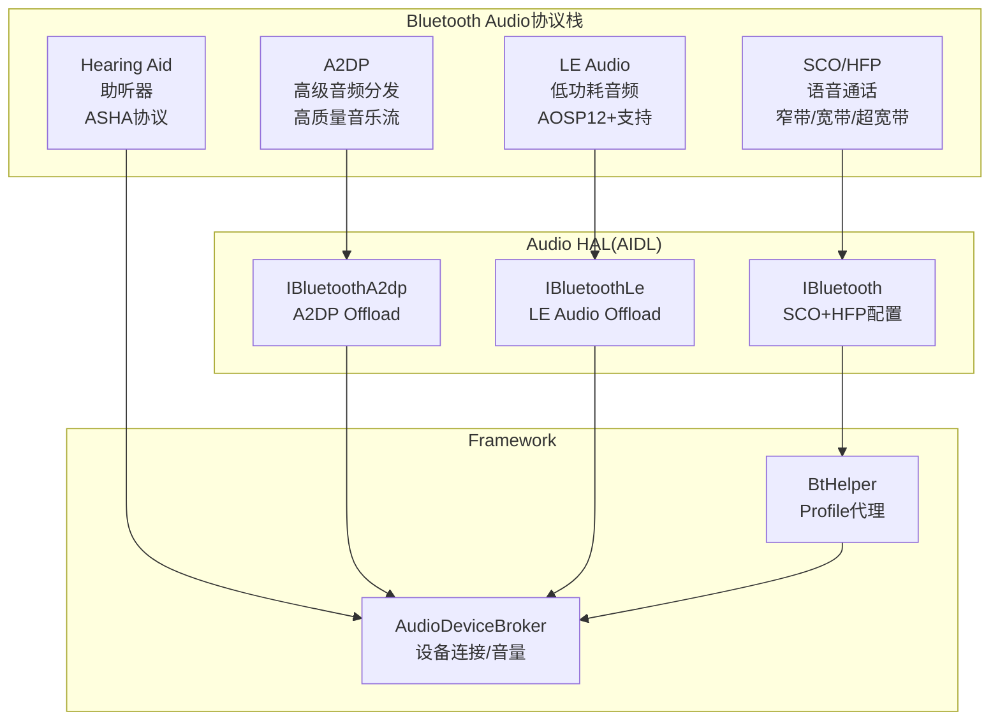

| 协议 | Audio设备类型 | 音频方向 | 用途 | 编解码 |
|------|-------------|---------|------|--------|
| A2DP | DEVICE_OUT_BLUETOOTH_A2DP | 输出 | 高质量音乐 | SBC/AAC/aptX/LDAC |
| A2DP Sink | DEVICE_IN_BLUETOOTH_A2DP | 输入 | 蓝牙录音源 | SBC |
| LE Audio | DEVICE_OUT_BLE_HEADSET / DEVICE_IN_BLE_HEADSET | 双向 | 低功耗音频 | LC3 |
| LE Broadcast | DEVICE_OUT_BLE_BROADCAST | 输出 | 广播音频 | LC3 |
| SCO | DEVICE_OUT_BLUETOOTH_SCO_HEADSET / DEVICE_IN_BLUETOOTH_SCO | 双向 | 通话语音 | CVSD/mSBC/LC3 |
| Hearing Aid | DEVICE_OUT_HEARING_AID | 输出 | 助听器 | ASHA自定义 |

## 14.2 A2DP — 高级音频分发协议

### 14.2.1 A2DP连接→Audio路由流程

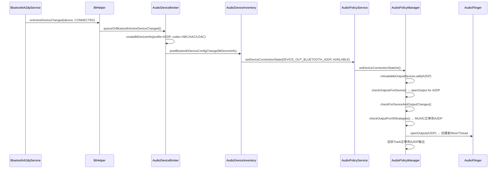

### 14.2.2 A2DP音量机制 — AVRCP绝对音量

A2DP设备使用**AVRCP绝对音量**协议，手机端音量直接映射到耳机端：

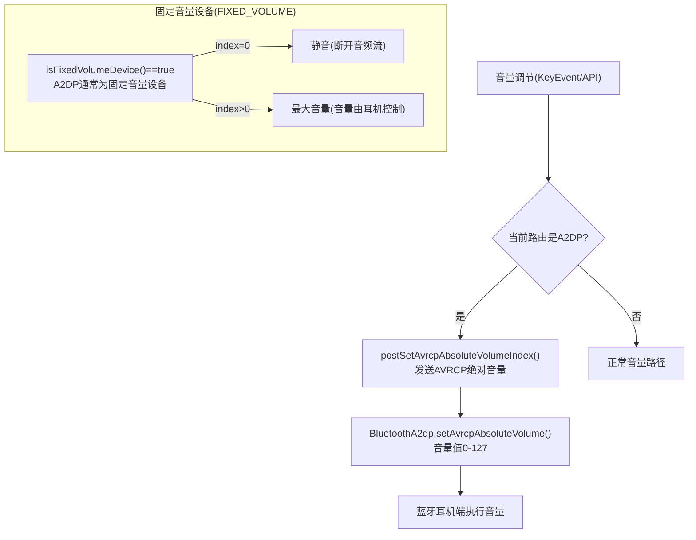

**关键源码位置**:
- [`AudioDeviceBroker.postSetAvrcpAbsoluteVolumeIndex()`](frameworks/base/services/core/java/com/android/server/audio/AudioDeviceBroker.java:1088): AVRCP音量发送
- [`AudioService`](frameworks/base/services/core/java/com/android/server/audio/AudioService.java:4516): A2DP音量路由判断

### 14.2.3 A2DP Codec协商

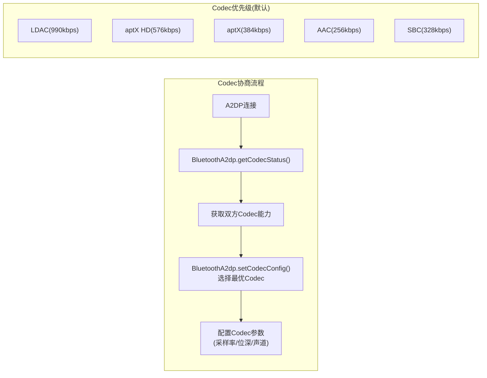

**Codec信息传递**: A2DP连接时，`BtHelper.getA2dpCodec(device)`获取当前Codec类型，传递给AudioPolicy用于配置输出流参数。

### 14.2.4 A2DP Offload

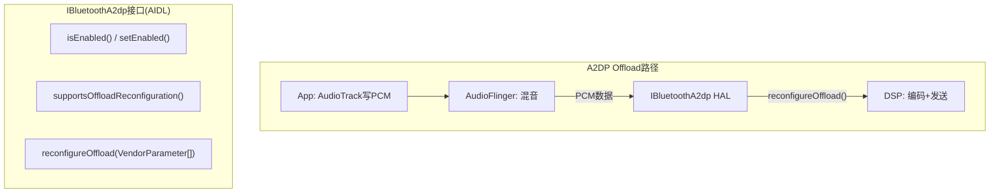

A2DP Offload将编码工作从CPU卸载到DSP，降低功耗。`reconfigureOffload()`允许运行时切换Codec参数。

### 14.2.5 A2DP Suspend机制

A2DP可以被挂起（Suspend），典型场景：SCO通话时需要暂停A2DP音频流。

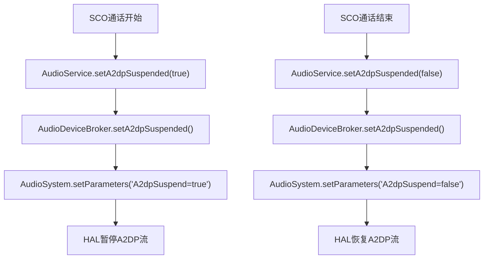

**关键源码位置**:
- [`AudioDeviceBroker.setA2dpSuspended()`](frameworks/base/services/core/java/com/android/server/audio/AudioDeviceBroker.java:1004): A2DP挂起控制
- [`AudioService.setA2dpSuspended()`](frameworks/base/services/core/java/com/android/server/audio/AudioService.java:6416): 公共API

## 14.3 LE Audio — 低功耗蓝牙音频

### 14.3.1 LE Audio架构

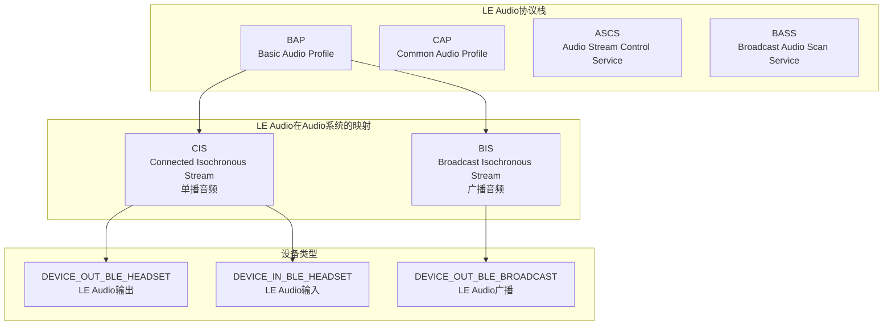

### 14.3.2 LE Audio连接→路由流程

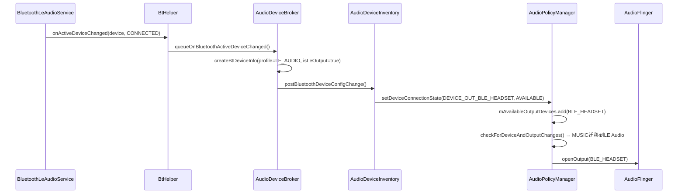

### 14.3.3 LE Audio音量机制

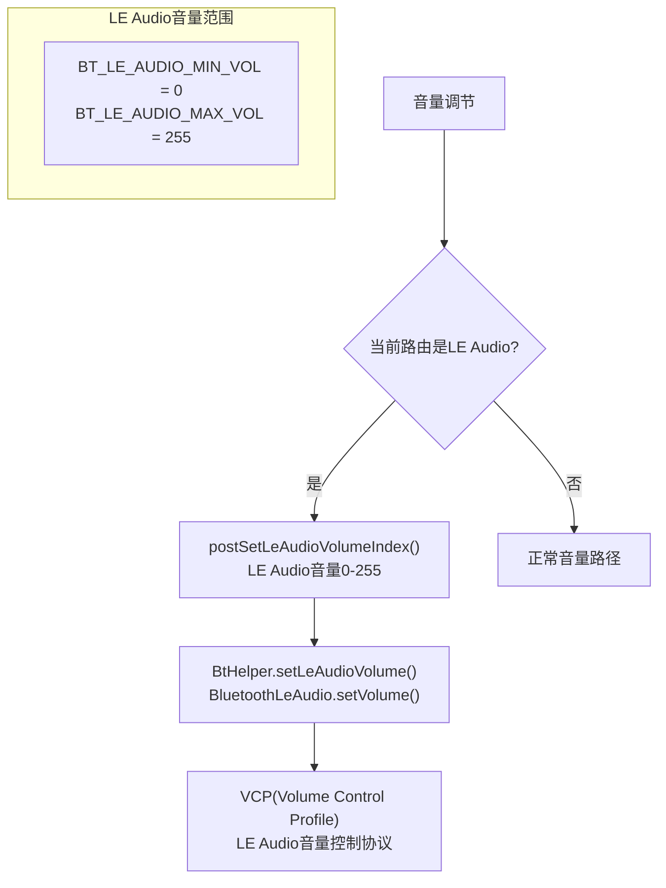

**关键源码位置**:
- [`AudioDeviceBroker.postSetLeAudioVolumeIndex()`](frameworks/base/services/core/java/com/android/server/audio/AudioDeviceBroker.java:1096): LE Audio音量发送
- [`BtHelper.setLeAudioVolume()`](frameworks/base/services/core/java/com/android/server/audio/BtHelper.java): VCP音量设置

### 14.3.4 LE Audio Suspend机制

与A2DP类似，LE Audio也支持Suspend：

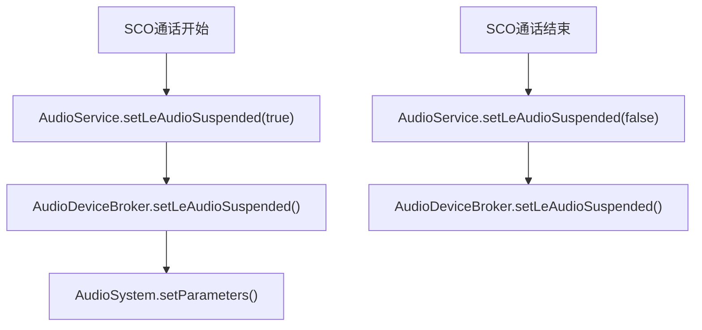

**关键源码位置**: [`AudioDeviceBroker.setLeAudioSuspended()`](frameworks/base/services/core/java/com/android/server/audio/AudioDeviceBroker.java:1034)

### 14.3.5 LE Audio Offload

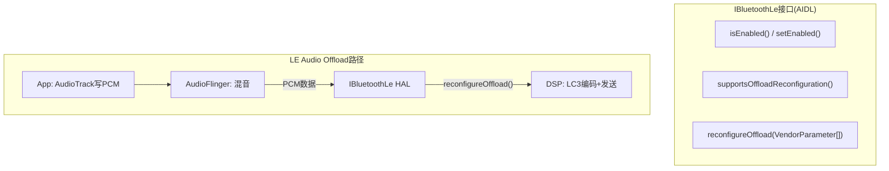

### 14.3.6 LE Audio Broadcast

LE Audio Broadcast (Auracast) 允许一个源设备向多个接收设备广播音频：

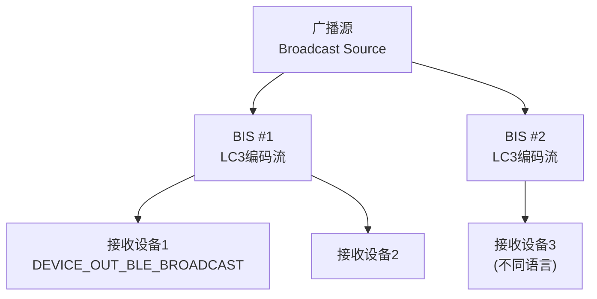

## 14.4 SCO/HFP — 通话语音

### 14.4.1 SCO音频状态机

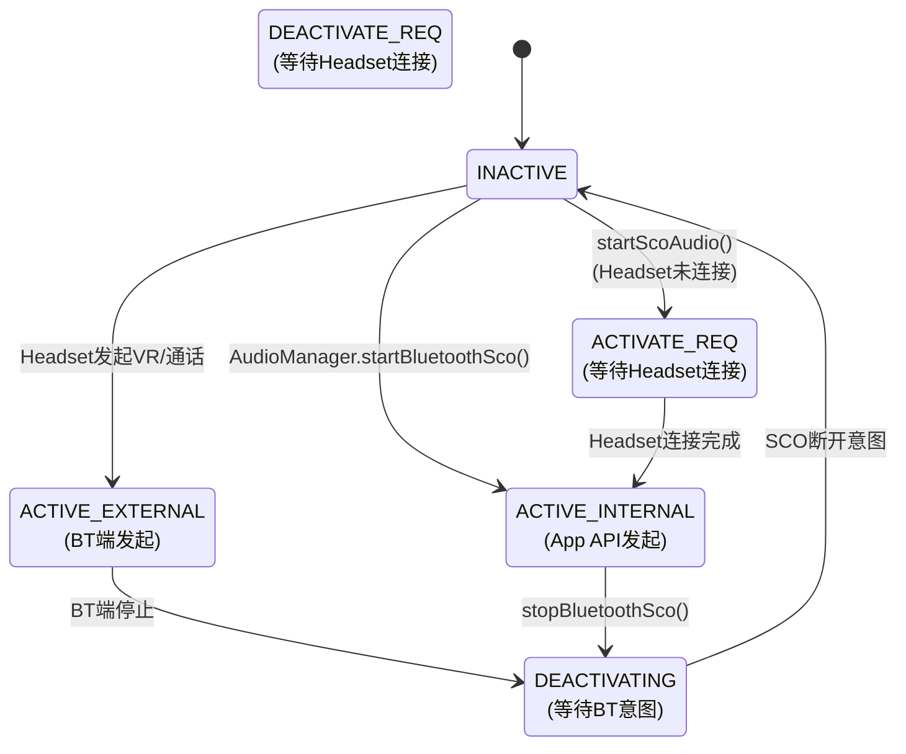

### 14.4.2 IBluetooth SCO/HFP配置(AIDL)

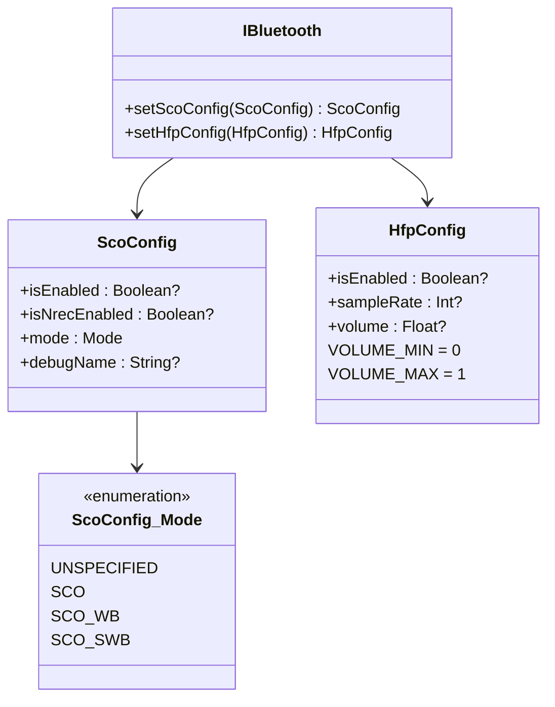

**SCO模式说明**:
| 模式 | 带宽 | 采样率 | 编解码 | 音质 |
|------|------|--------|--------|------|
| SCO (NB) | 窄带 | 8kHz | CVSD | 基本通话质量 |
| SCO_WB (WB) | 宽带 | 16kHz | mSBC | 改善通话质量 |
| SCO_SWB (SWB) | 超宽带 | 32kHz | LC3 | 高清通话质量 |

## 14.5 Hearing Aid — 助听器

### 14.5.1 ASHA协议

ASHA (Audio Streaming for Hearing Aids) 是Google专为助听器设计的蓝牙协议：

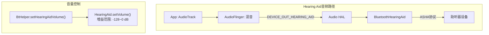

**关键参数**:
- 设备类型: `DEVICE_OUT_HEARING_AID`
- 音量范围: `BT_HEARING_AID_GAIN_MIN = -128 dB` ~ 0 dB
- 与LE Audio的关系: 未来ASHA将迁移到LE Audio的HAP (Hearing Access Profile)

## 14.6 蓝牙音频设备与AudioDeviceBroker交互

### 14.6.1 BtDeviceInfo创建

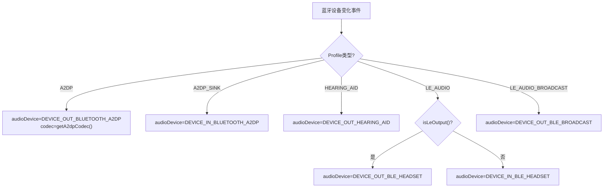

**关键源码位置**: [`AudioDeviceBroker.createBtDeviceInfo()`](frameworks/base/services/core/java/com/android/server/audio/AudioDeviceBroker.java:812)

### 14.6.2 蓝牙设备切换流程

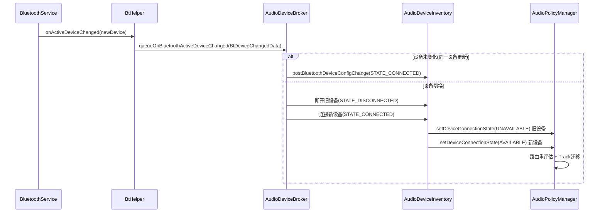

### 14.6.3 A2DP连接超时机制

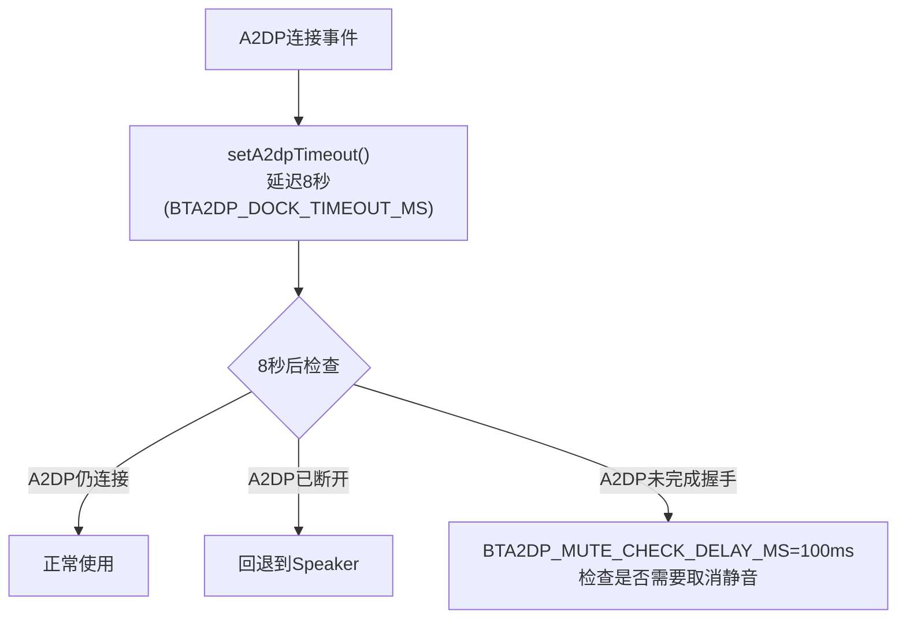

## 14.7 蓝牙音频对比总结

| 维度 | A2DP | LE Audio | SCO/HFP | Hearing Aid |
|------|------|----------|---------|-------------|
| 引入版本 | Android 1.5 | Android 12 | Android 1.5 | Android 9 |
| 音频方向 | 输出 | 双向 | 双向 | 输出 |
| 编解码 | SBC/AAC/aptX/LDAC | LC3 | CVSD/mSBC/LC3 | 自定义 |
| 延迟 | ~200ms | ~30ms | ~50ms | ~200ms |
| 音量模型 | AVRCP绝对音量(0-127) | VCP(0-255) | HFP volume(0-1) | 增益(-128~0dB) |
| HAL接口 | IBluetoothA2dp | IBluetoothLe | IBluetooth(ScoConfig) | 无专用接口 |
| Offload支持 | reconfigureOffload | reconfigureOffload | N/A | N/A |
| 固定音量设备 | 是(FLAG_FIXED_VOLUME) | 否 | 否 | 是 |
| 典型用途 | 音乐播放 | 音乐+通话+广播 | 通话语音 | 助听器 |

---

> [← 上一篇：Volume & Device](13_Volume_Device_Deep_Dive.md) | [返回导航](README.md) | [下一篇：Debug & OEM →](15_Debug_and_OEM_Guide.md)