# 第十四篇：Bluetooth Audio 深度解析

> [← 上一篇：Volume & Device](13_Volume_Device_Deep_Dive.md) | [返回导航](README.md) | [下一篇：PAL Architecture →](16_PAL_Architecture.md)

---

蓝牙音频是Android Audio系统中最复杂的设备类型之一，涉及A2DP、LE Audio、SCO/HFP、Hearing Aid四种协议，每种都有独立的HAL接口、音量模型和路由策略。

## 14.1 蓝牙音频协议总览


| 协议 | Audio设备类型 | 音频方向 | 用途 | 编解码 |
|------|-------------|---------|------|--------|
| A2DP | DEVICE_OUT_BLUETOOTH_A2DP | 输出 | 高质量音乐 | SBC/AAC/aptX/LDAC |
| A2DP Sink | DEVICE_IN_BLUETOOTH_A2DP | 输入 | 蓝牙录音源 | SBC |
| LE Audio | DEVICE_OUT_BLE_HEADSET / DEVICE_IN_BLE_HEADSET | 双向 | 低功耗音频 | LC3 |
| LE Broadcast | DEVICE_OUT_BLE_BROADCAST | 输出 | 广播音频 | LC3 |
| SCO | DEVICE_OUT_BLUETOOTH_SCO_HEADSET / DEVICE_IN_BLUETOOTH_SCO | 双向 | 通话语音 | CVSD/mSBC/LC3 |
| Hearing Aid | DEVICE_OUT_HEARING_AID | 输出 | 助听器 | ASHA自定义 |

## 14.2 A2DP — 高级音频分发协议

### 14.2.1 A2DP连接→Audio路由流程

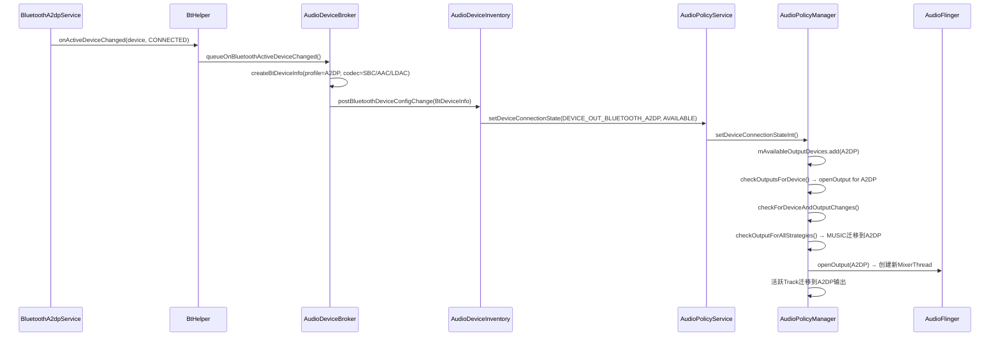

### 14.2.2 A2DP音量机制 — AVRCP绝对音量

A2DP设备使用**AVRCP绝对音量**协议，手机端音量直接映射到耳机端：

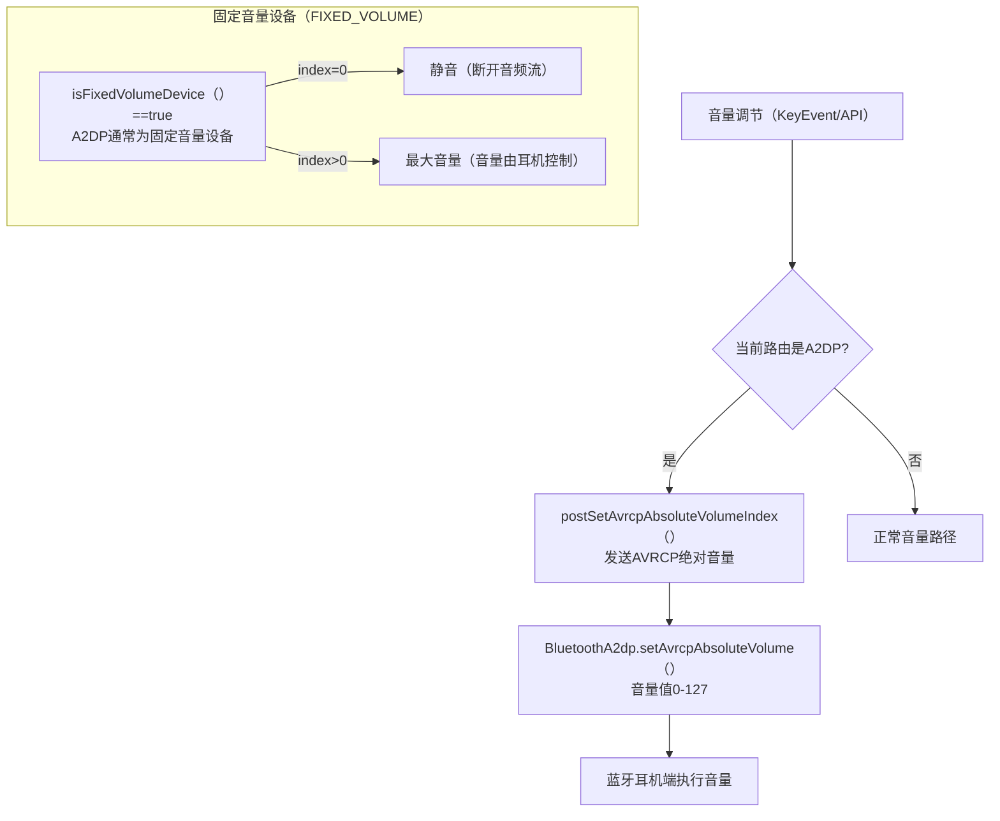

**关键源码位置**:
- [`AudioDeviceBroker.postSetAvrcpAbsoluteVolumeIndex()`](frameworks/base/services/core/java/com/android/server/audio/AudioDeviceBroker.java:1088): AVRCP音量发送
- [`AudioService`](frameworks/base/services/core/java/com/android/server/audio/AudioService.java:4516): A2DP音量路由判断

### 14.2.3 A2DP Codec协商

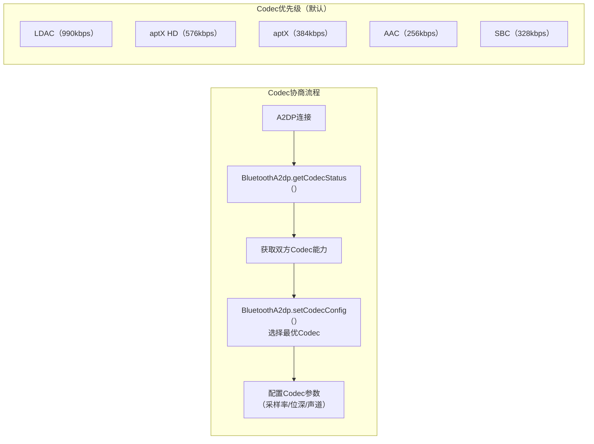

**Codec信息传递**: A2DP连接时，`BtHelper.getA2dpCodec(device)`获取当前Codec类型，传递给AudioPolicy用于配置输出流参数。

### 14.2.4 A2DP Offload

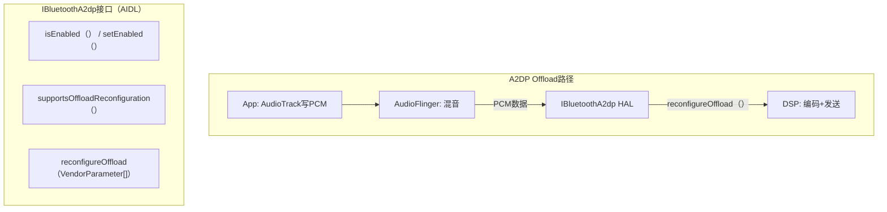

A2DP Offload将编码工作从CPU卸载到DSP，降低功耗。`reconfigureOffload()`允许运行时切换Codec参数。

### 14.2.5 A2DP Suspend机制

A2DP可以被挂起（Suspend），典型场景：SCO通话时需要暂停A2DP音频流。

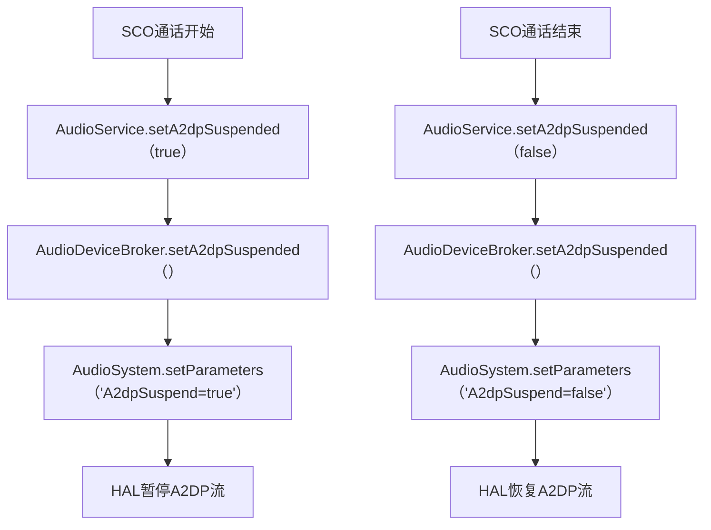

**关键源码位置**:
- [`AudioDeviceBroker.setA2dpSuspended()`](frameworks/base/services/core/java/com/android/server/audio/AudioDeviceBroker.java:1004): A2DP挂起控制
- [`AudioService.setA2dpSuspended()`](frameworks/base/services/core/java/com/android/server/audio/AudioService.java:6416): 公共API

## 14.3 LE Audio — 低功耗蓝牙音频

### 14.3.1 LE Audio架构

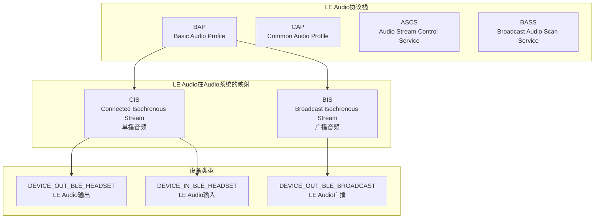

### 14.3.2 LE Audio连接→路由流程

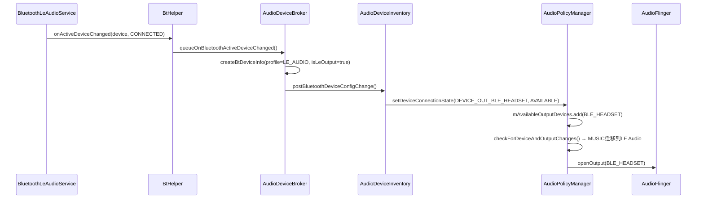

### 14.3.3 LE Audio音量机制

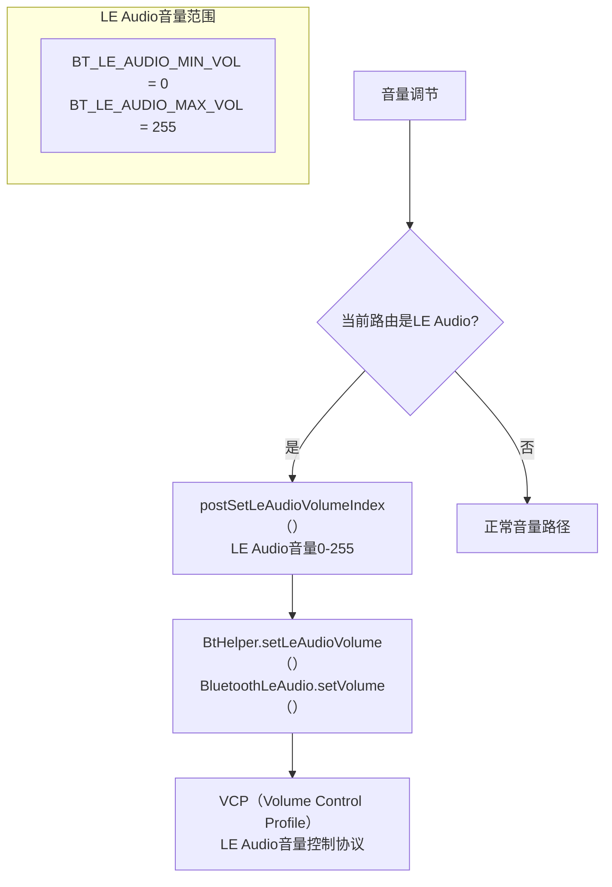

**关键源码位置**:
- [`AudioDeviceBroker.postSetLeAudioVolumeIndex()`](frameworks/base/services/core/java/com/android/server/audio/AudioDeviceBroker.java:1096): LE Audio音量发送
- [`BtHelper.setLeAudioVolume()`](frameworks/base/services/core/java/com/android/server/audio/BtHelper.java): VCP音量设置

### 14.3.4 LE Audio Suspend机制

与A2DP类似，LE Audio也支持Suspend：

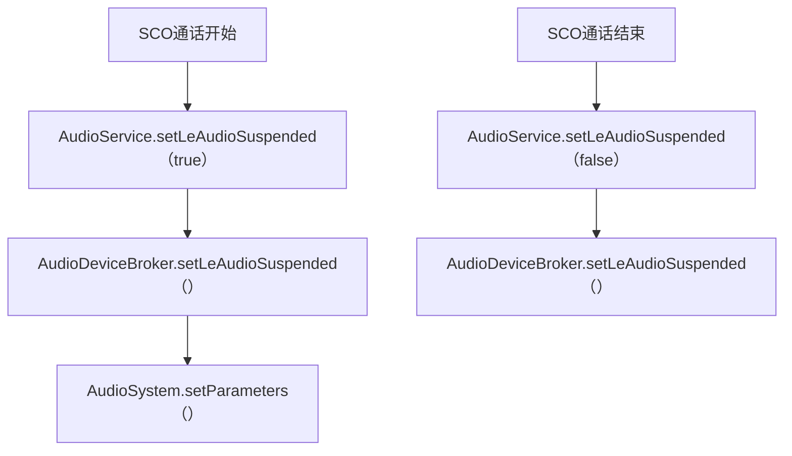

**关键源码位置**: [`AudioDeviceBroker.setLeAudioSuspended()`](frameworks/base/services/core/java/com/android/server/audio/AudioDeviceBroker.java:1034)

### 14.3.5 LE Audio Offload

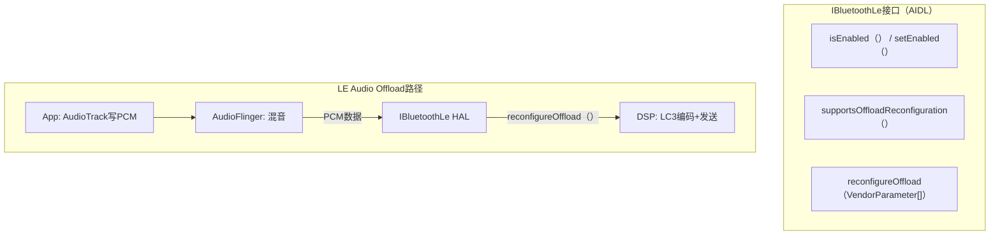

### 14.3.6 LE Audio Broadcast

LE Audio Broadcast (Auracast) 允许一个源设备向多个接收设备广播音频：

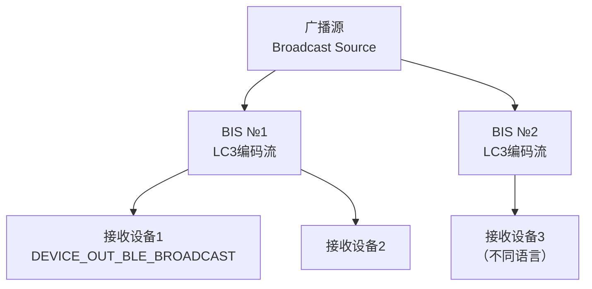

## 14.4 SCO/HFP — 通话语音

### 14.4.1 SCO音频状态机

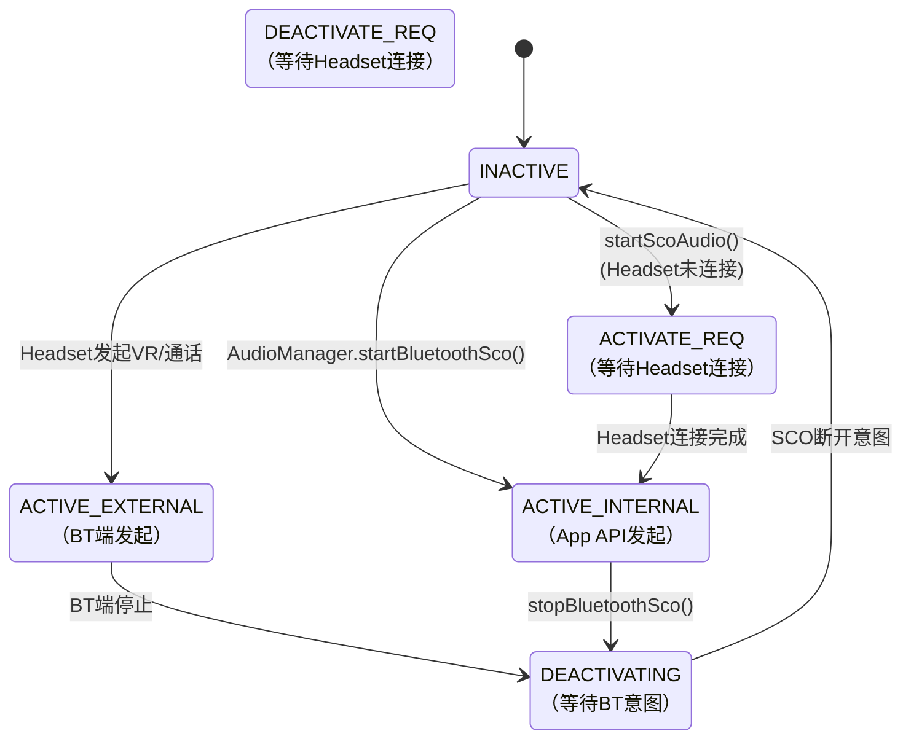

### 14.4.2 IBluetooth SCO/HFP配置(AIDL)

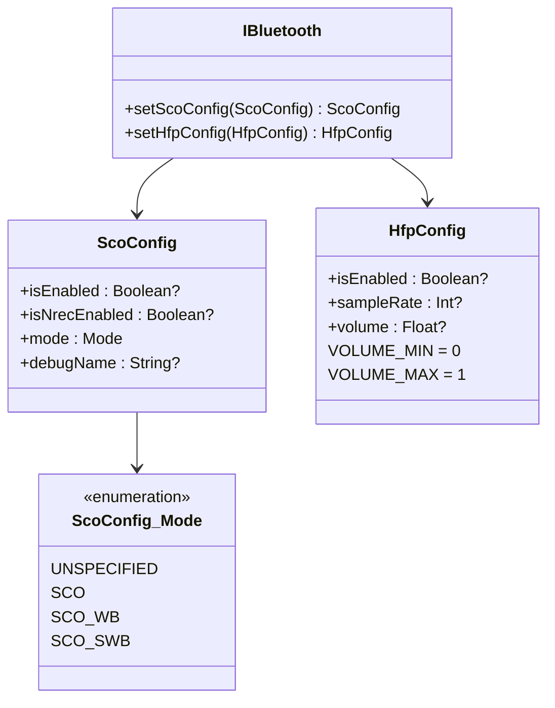

**SCO模式说明**:
| 模式 | 带宽 | 采样率 | 编解码 | 音质 |
|------|------|--------|--------|------|
| SCO (NB) | 窄带 | 8kHz | CVSD | 基本通话质量 |
| SCO_WB (WB) | 宽带 | 16kHz | mSBC | 改善通话质量 |
| SCO_SWB (SWB) | 超宽带 | 32kHz | LC3 | 高清通话质量 |

## 14.5 Hearing Aid — 助听器

### 14.5.1 ASHA协议

ASHA (Audio Streaming for Hearing Aids) 是Google专为助听器设计的蓝牙协议：

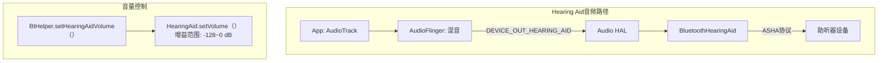

**关键参数**:
- 设备类型: `DEVICE_OUT_HEARING_AID`
- 音量范围: `BT_HEARING_AID_GAIN_MIN = -128 dB` ~ 0 dB
- 与LE Audio的关系: 未来ASHA将迁移到LE Audio的HAP (Hearing Access Profile)

## 14.6 蓝牙音频设备与AudioDeviceBroker交互

### 14.6.1 BtDeviceInfo创建

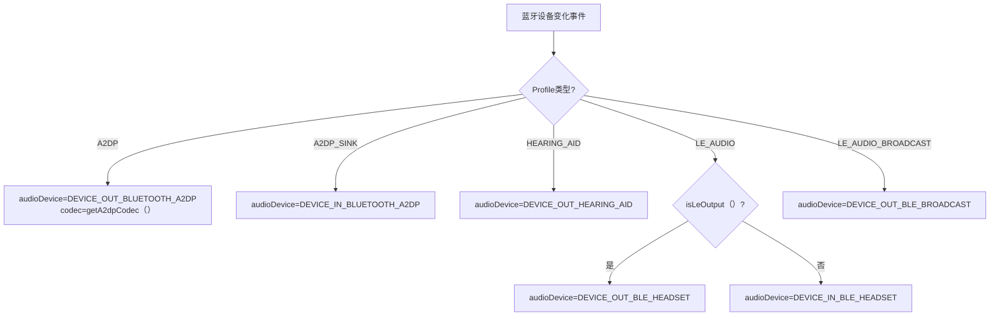

**关键源码位置**: [`AudioDeviceBroker.createBtDeviceInfo()`](frameworks/base/services/core/java/com/android/server/audio/AudioDeviceBroker.java:812)

### 14.6.2 蓝牙设备切换流程

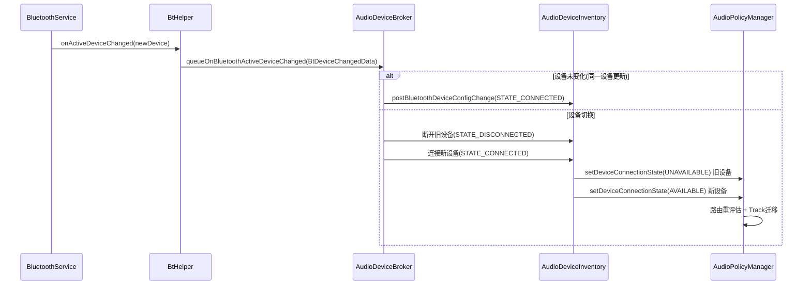

### 14.6.3 A2DP连接超时机制


## 14.7 LE Audio Profile深度解析

> 源码路径: [`packages/modules/Bluetooth/android/app/src/com/android/bluetooth/le_audio/`](packages/modules/Bluetooth/android/app/src/com/android/bluetooth/le_audio/)

LE Audio不仅仅是A2DP的低功耗替代，它定义了一套完整的Profile体系——BAP、CAP、MICP、CSIP、TMAP、VCP——覆盖了单播、广播、通话、音量控制等所有音频场景。

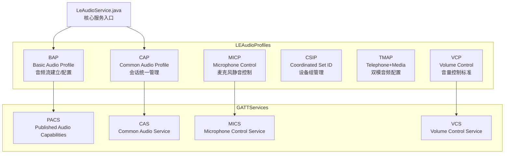

### 14.7.1 BAP (Basic Audio Profile)

BAP是LE Audio的基础Profile，定义了音频流的建立、配置和释放：

| BAP角色 | 说明 |
|---------|------|
| Unicast Server | 耳机端，提供ASE接受Client配置 |
| Unicast Client | 手机端，发现ASE发起Codec/QoS配置 |
| Broadcast Server | 广播源，创建BIG |
| Broadcast Client | 接收端，扫描并同步到BIG |

**ASE (Audio Stream Endpoint) 状态机**是BAP的核心机制，每个ASE独立维护状态：

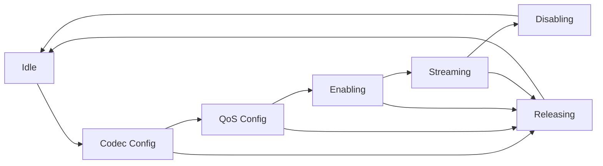

**PACS** 与BAP协同：PACS通过GATT发布设备Codec/Sink/Source能力，Client读取PACS后选择合适配置发起ASE Codec Config Request。

源码：[`LeAudioService.java`](packages/modules/Bluetooth/android/app/src/com/android/bluetooth/le_audio/LeAudioService.java:1) 管理ASE创建和状态转换；[`LeAudioNativeInterface.java`](packages/modules/Bluetooth/android/app/src/com/android/bluetooth/le_audio/LeAudioNativeInterface.java:1) 对接BAP栈回调。

### 14.7.2 CAP (Common Audio Profile)

CAP统一管理Unicast和Broadcast音频会话，确保多个ASE的配置一致性：

```mermaid
sequenceDiagram
    participant Phone as 手机-CAP Initiator
    participant EarL as 左耳-Set Member
    participant EarR as 右耳-Set Member
    participant CAS as CAS GATT Server

    Phone->>CAS: 发现CAS
    CAS-->>Phone: Set Member Array[左耳,右耳]
    Phone->>EarL: ASE Codec Config(48kHz LC3)
    Phone->>EarR: ASE Codec Config(48kHz LC3)
    EarL-->>Phone: accepted
    EarR-->>Phone: accepted
    Phone->>EarL: ASE QoS Config(SDU=120)
    Phone->>EarR: ASE QoS Config(SDU=120)
    Phone->>EarL: ASE Enable
    Phone->>EarR: ASE Enable
    Note over Phone,EarR: CIS建立，双耳同步Streaming
```

CAP Set Coordinator管理多设备组配置(Set Member Array)，典型场景是多耳机同时配对时，CAP协调所有Set Member的ASE配置，确保双耳使用相同的Codec参数和QoS设置。

### 14.7.3 MICP (Microphone Control Profile)与CSIP (Coordinated Set Identification Profile)

**MICP** 提供麦克风静音控制，MICS(Microphone Control Service)通过GATT提供mute/unmute操作。在LE Audio通话场景中，手机作为MICP Controller写入MICS的Mute特征值来控制远端麦克风。

**CSIP** 负责设备组管理，通过Set Identification特征发现和绑定同组设备：

```mermaid
flowchart TB
    DISC["CSIP Coordinator扫描"] --> FIND["发现Set Member<br>SRK匹配"]
    FIND --> BOND["绑定Set Identity"]
    BOND --> COORD["协调配置所有Member"]
    COORD --> LOCK["CSIP Lock<br>防止部分成员单独操作"]
    LOCK --> UNLOCK["释放Lock"]

    CSIP_SRV["CsipSetCoordinatorService.java"] --> CSIP_SM["CsipSetCoordinatorStateMachine.java"]


源码：[`CsipSetCoordinatorService.java`](packages/modules/Bluetooth/android/app/src/com/android/bluetooth/csip/CsipSetCoordinatorService.java:1)；[`CsipSetCoordinatorStateMachine.java`](packages/modules/Bluetooth/android/app/src/com/android/bluetooth/csip/CsipSetCoordinatorStateMachine.java:1)。

```

### 14.7.4 TMAP (Telephone and Media Audio Profile)与VCP (Volume Control Profile)

**TMAP** 定义了电话+媒体双模音频场景下BAP的配置要求，确保LE Audio设备同时支持Call和Media两个Audio Stream：

| TMAP角色 | 支持的ASE配置 | 说明 |
|----------|-------------|------|
| TMAP Call Terminal | Unicast Sink+Source, 16kHz LC3 | 双向通话流 |
| TMAP Media Terminal | Unicast Sink, 48kHz LC3 | 单向媒体流 |
| TMAP Dual Terminal | Call+Media同时支持 | 完整双模 |

**VCP** 是LE Audio的音量控制标准，包含三个子服务：

```mermaid
flowchart TB
    VCP_TOP["VCP<br>Volume Control Profile"]

    VCS["VCS<br>Volume Control Service<br>音量0-255/Mute"]
    VOCS["VOCS<br>Volume Offset Control<br>通道偏移-255~255"]
    VICS["VICS<br>Volume Internal Control<br>设备端音量上报"]

    VCP_TOP --> VCS
    VCP_TOP --> VOCS
    VCP_TOP --> VICS

    PHONE["手机(VCP Controller)"]
    EAR["耳机(VCP Server)"]

    PHONE->>VCS: 写入Volume_Setting
    PHONE->>VOCS: 写入Volume_Offset
    VICS->>PHONE: 通知Volume_Changed
```

VCP音量同步链路：手机写入VCS Volume_Setting(0-255) → GATT写入 → 耳机调整增益 → VICS上报Volume_Changed → [`VolumeControlService.java`](packages/modules/Bluetooth/android/app/src/com/android/bluetooth/vc/VolumeControlService.java:1) 回调 → AudioPolicyManager更新音量。

## 14.8 LC3编码参数与配置

> 源码路径: [`packages/modules/Bluetooth/android/app/src/com/android/bluetooth/le_audio/LeAudioCodecConfig.java`](packages/modules/Bluetooth/android/app/src/com/android/bluetooth/le_audio/LeAudioCodecConfig.java:1)

LC3 (Low Complexity Communications Codec) 是LE Audio的强制编解码器。

### 14.8.1 LC3 vs SBC对比与关键参数

| 维度 | LC3 | SBC |
|------|-----|-----|
| 采样率 | 8/11.025/16/22.05/24/32/44.1/48kHz | 16/22.05/24/32/44.1/48kHz |
| 帧长 | 7.5ms/10ms | ~22ms |
| 比特率 | 32-128(8kHz) / 48-160(16kHz) / 64-256(32kHz) / 64-320(48kHz) kbps | 128-345 kbps |
| 延迟 | ~30ms | ~200ms |
| 音质 | 相同bitrate下优于SBC约30% | 基线音质 |
| PLC | 支持(Packet Loss Concealment) | 不支持 |
| 强制性 | LE Audio强制 | A2DP强制 |
| 压缩效率 | 高(LPC+MDCT混合) | 低(子带编码) |
| 通道数 | 1/2(单播) / 1-4(通过PACS协商) | 1/2 |

LC3在相同bitrate下音质优于SBC约30%，关键原因是LC3采用了LPC(线性预测编码)+MDCT混合编码架构，而SBC仅使用简单的子带滤波+量化。

### 14.8.2 LC3 Codec配置协商流程

```mermaid
sequenceDiagram
    participant Phone as 手机-Unicast Client
    participant Ear as 耳机-Unicast Server+PACS
    participant ASE as ASE状态机

    Phone->>Ear: 读取PACS Capabilities
    Ear-->>Phone: 支持的采样率/帧长/比特率

    Phone->>ASE: ASE Codec Config(48kHz/10ms/128kbps)
    ASE->>ASE: Idle → Codec Config
    Ear-->>Phone: accepted

    Phone->>ASE: ASE QoS Config(SDU=120,PHY=2M,RTN=2)
    ASE->>ASE: Codec Config → QoS Config
    Ear-->>Phone: accepted

    Phone->>ASE: ASE Enable
    ASE->>ASE: QoS Config → Enabling
    Ear-->>Phone: Enable Response

    Phone->>ASE: CIS建立
    ASE->>ASE: Enabling → Streaming
    Note over Phone,Ear: LC3音频流传输
```

配置协商与ASE状态机联动：Codec Config协商LC3参数 → QoS Config协商CIS参数(SDU/PHY/RTN) → Enable激活CIS → Streaming开始传输。[`LeAudioCodecConfig.java`](packages/modules/Bluetooth/android/app/src/com/android/bluetooth/le_audio/LeAudioCodecConfig.java:1) 处理LTV格式Codec Capabilities的解析和构建。

## 14.9 LE Audio广播音频(Broadcast Audio)

> 码路径: [`packages/modules/Bluetooth/android/app/src/com/android/bluetooth/le_audio/LeAudioBroadcasterNativeInterface.java`](packages/modules/Bluetooth/android/app/src/com/android/bluetooth/le_audio/LeAudioBroadcasterNativeInterface.java:1)

LE Audio广播音频允许一个源设备同时向多个接收设备发送音频流，无需配对连接。

### 14.9.1 Broadcast Source架构

```mermaid
flowchart TB
    BS["Broadcast Source<br>TV/会议系统"] --> BASE["BASE<br>广播源信息描述"]
    BS --> BC_CODE["Broadcast Code<br>加密密钥"]

    BASE --> BASS_SRV["BASS<br>Broadcast Audio Scan Service"]
    BASS_SRV --> SD["Scan Delegator"]
    BASS_SRV --> BASS_CLIENT["BassClientService.java"]

    BS --> R1["接收设备1"]
    BS --> R2["接收设备2"]
    BS --> R3["接收设备3"]
```

**BASS** 是广播发现机制：Source通过Periodic Adv发布BASE信息(Codec/BIS索引)，Scan Delegator通过BASS Client添加Source，Broadcast Code提供加密保护。

源码：[`LeAudioBroadcasterNativeInterface.java`](packages/modules/Bluetooth/android/app/src/com/android/bluetooth/le_audio/LeAudioBroadcasterNativeInterface.java:1)；[`BassClientService.java`](packages/modules/Bluetooth/android/app/src/com/android/bluetooth/bass_client/BassClientService.java:1)(72KB)；[`BassClientStateMachine.java`](packages/modules/Bluetooth/android/app/src/com/android/bluetooth/bass_client/BassClientStateMachine.java:1)(91KB)。

### 14.9.2 Broadcast ISOB (Isochronous Broadcast Group)

```mermaid
flowchart TB
    BIG["BIG<br>Broadcast Isochronous Group"]
    BIG --> BIS1["BIS 1<br>左声道LC3"]
    BIG --> BIS2["BIS 2<br>右声道LC3"]
    BIG --> BIS3["BIS 3<br>元数据"]

    PA["Periodic Adv<br>携带BASE"] --> BPA["BIGInfo<br>同步参数"]
    BPA --> SYNC["接收端同步<br>PA→BIG"]
    SYNC --> BIG
```

BIG → BIS的关系：一个BIG包含多个BIS，每个BIS承载一个独立的音频流(如左声道、右声道)。接收端通过Periodic Advertisement同步到PA，从BIGInfo获取BIG同步参数，再同步到BIG并接收选定的BIS音频流。

**Unicast vs Broadcast对比表**：

| 维度 | Unicast (CIS) | Broadcast (BIS) |
|------|---------------|----------------|
| 连接数 | 点对点(1对1) | 点对多点(1对N) |
| 配对要求 | 需配对+GATT连接 | 无需配对 |
| 可靠性 | RTN重传确认 | 无重传(尽力传输) |
| 延迟 | ~30-50ms | ~20-40ms |
| 双向 | 支持Sink+Source | 仅单向 |
| 隐私 | 链路层加密 | Broadcast Code加密 |
| 典型场景 | 耳机听音乐 | TV共享/健身房/会议 |

## 14.10 LE Audio与Classic Bluetooth共存策略

### 14.10.1 双模设备切换

AOSP14支持同时Classic A2DP和LE Audio的双模设备，系统需要管理两者的切换和fallback：

```mermaid
flowchart TB
    BT_DEV["双模蓝牙设备"] --> PRIORITY{"Profile优先级判断"}
    PRIORITY -->|LE Audio可用| LE_FIRST["LE Audio优先<br>低延迟+双向+LC3"]
    PRIORITY -->|LE Audio不可用| CLASSIC_FB["Classic A2DP Fallback"]
    LE_FIRST --> LE_STREAM["建立CIS/LC3流"]
    CLASSIC_FB --> A2DP_STREAM["建立A2DP/SBC流"]
    LE_STREAM --> SWITCH{"LE Audio断开?"}
    SWITCH -->|是| CLASSIC_FB
    SWITCH -->|否| LE_STREAM

    BTH["BtHelper"] --> ADM["ActiveDeviceManager"]
    ADM --> APS["AudioPolicyService"]
    APS --> PRIORITY
```

**BtHelper双模管理逻辑**（参考 [`ActiveDeviceManager.java`](packages/modules/Bluetooth/android/app/src/com/android/bluetooth/btservice/ActiveDeviceManager.java:1)）：
1. 设备同时支持A2DP和LE Audio → 优先使用LE Audio
2. LE Audio连接失败/断开 → 自动回退到A2DP
3. LE Audio重连成功 → 从A2DP切换回LE Audio
4. 音频路由由AudioPolicyManager根据设备类型决策：DEVICE_OUT_BLE_HEADSET > DEVICE_OUT_BLUETOOTH_A2DP

### 14.10.2 AOSP14 LE Audio调试命令速查表

| 命令 | 说明 | 用途 |
|------|------|------|
| `dumpsys bluetooth_le_audio` | LE Audio服务状态dump | 查看LeAudioService内部状态、ASE配置、CIS信息 |
| `logcat -s BluetoothLeAudio` | LE Audio日志过滤 | 过滤LeAudioService/StateMachine日志 |
| `dumpsys bluetooth_manager` | 蓝牙管理器完整dump | 查看Profile连接状态、ActiveDevice信息 |
| `dumpsys audio \| grep -A5 BLE` | Audio系统中BLE设备 | 查看BLE设备路由和音量状态 |
| `adb shell settings get global ble_scan_low_latency` | BLE扫描设置 | 检查BLE扫描策略 |

**详细调试命令**：
```bash
# BAP/PACS/ASE配置查看
dumpsys bluetooth_le_audio | grep "PACS"
dumpsys bluetooth_le_audio | grep "ASE"
dumpsys bluetooth_le_audio | grep "CodecConfig"
dumpsys bluetooth_le_audio | grep "mCurrentDirection\|mCurrentState"

# LC3参数检查
dumpsys bluetooth_le_audio | grep "sampling_rate\|frame_duration\|bitrate"

# VCP音量调试
dumpsys bluetooth_manager | grep "VolumeControl"
dumpsys bluetooth_manager | grep "volume_setting"
```

---

## 14.11 蓝牙音频对比总结

| 维度 | A2DP | LE Audio | SCO/HFP | Hearing Aid |
|------|------|----------|---------|-------------|
| 引入版本 | Android 1.5 | Android 12 | Android 1.5 | Android 9 |
| 音频方向 | 输出 | 双向 | 双向 | 输出 |
| 编解码 | SBC/AAC/aptX/LDAC | LC3 | CVSD/mSBC/LC3 | 自定义 |
| 延迟 | ~200ms | ~30ms | ~50ms | ~200ms |
| 音量模型 | AVRCP绝对音量(0-127) | VCP(0-255) | HFP volume(0-1) | 增益(-128~0dB) |
| HAL接口 | IBluetoothA2dp | IBluetoothLe | IBluetooth(ScoConfig) | 无专用接口 |
| Offload支持 | reconfigureOffload | reconfigureOffload | N/A | N/A |
| 固定音量设备 | 是(FLAG_FIXED_VOLUME) | 否 | 否 | 是 |
| 典型用途 | 音乐播放 | 音乐+通话+广播 | 通话语音 | 助听器 |

---

> [← 上一篇：Volume & Device](13_Volume_Device_Deep_Dive.md) | [返回导航](README.md) | [下一篇：PAL Architecture →](16_PAL_Architecture.md)