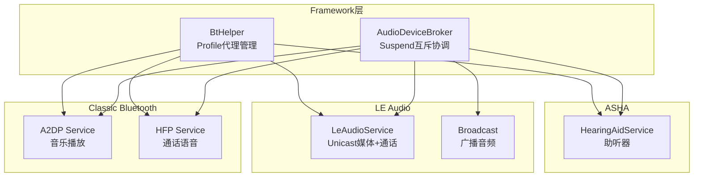
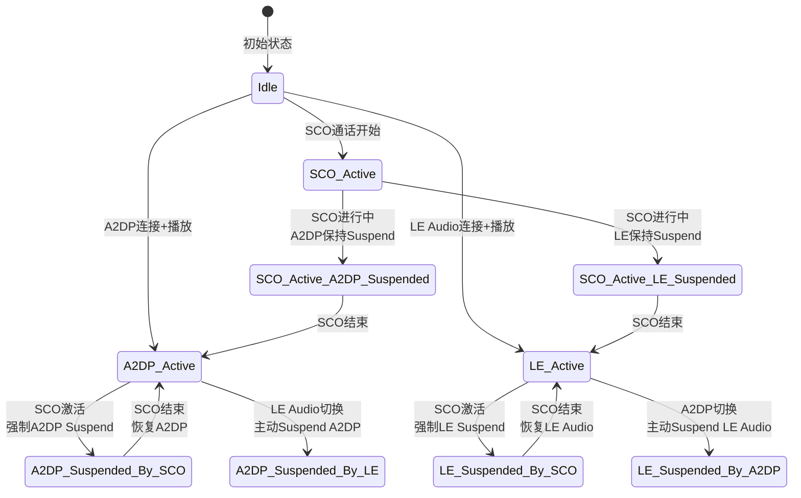
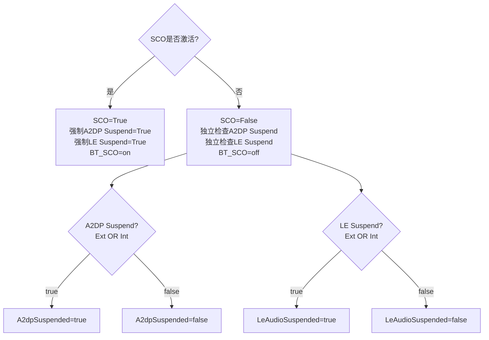
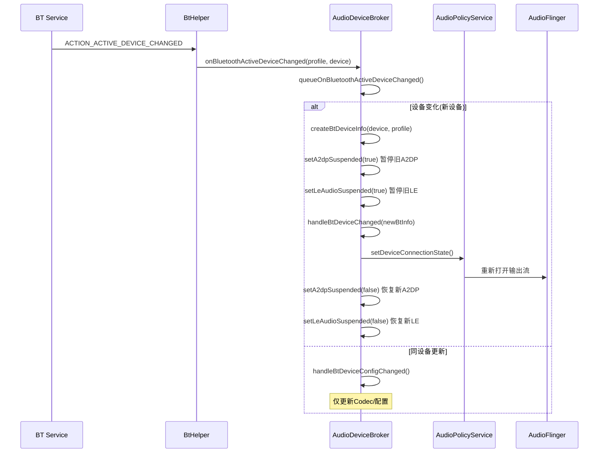
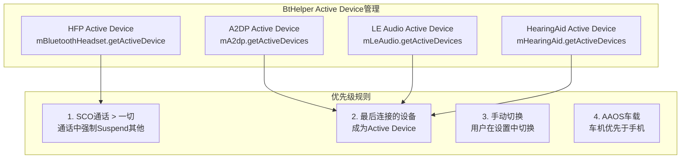
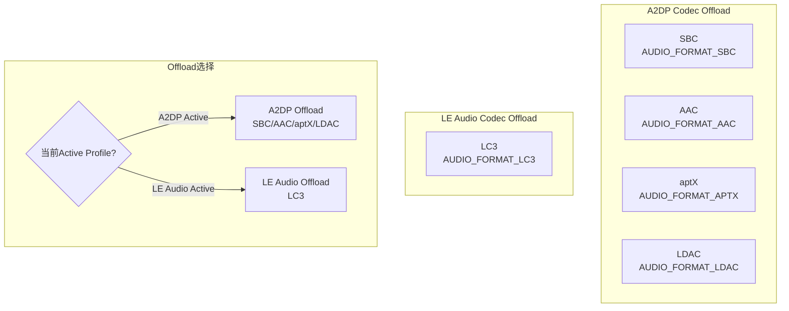
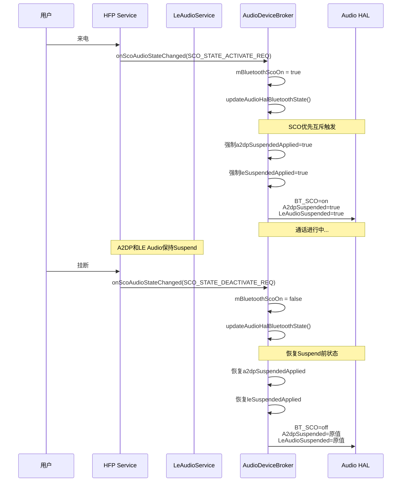
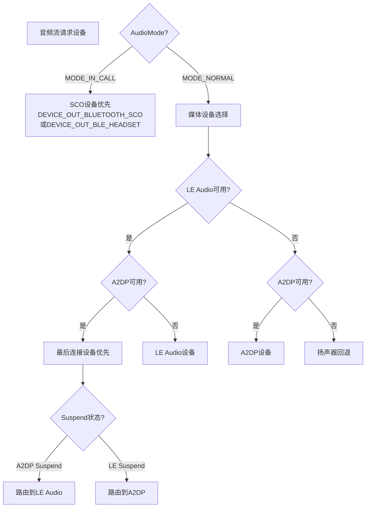

## 14.10 LE Audio与Classic Bluetooth共存策略

[← 上一个](14_14.9_LE_Audio广播音频Broadcast_Audio.md) | [← 返回14章](README.md) | [返回导航](../README.md) | [下一个 →](14_14.11_蓝牙音频对比总结.md)

---

### 14.10.1 双模共存架构概述

Android 14同时支持Classic Bluetooth(A2DP/HFP)和LE Audio，需要协调两者在设备选择、音频路由、Suspend互斥等方面的冲突。AudioDeviceBroker和BtHelper是共存策略的核心实现。

源码路径：
- [`AudioDeviceBroker.java`](frameworks/base/services/core/java/com/android/server/audio/AudioDeviceBroker.java) — Suspend互斥与设备路由
- [`BtHelper.java`](frameworks/base/services/core/java/com/android/server/audio/BtHelper.java) — Profile代理管理
- [`AudioPolicyManager.cpp`](frameworks/av/services/audiopolicy/AudioPolicyManager.cpp) — 设备选择策略



### 14.10.2 Suspend互斥机制

AudioDeviceBroker通过`mBluetoothAudioStateLock`保护的8个状态变量实现共存互斥（[`AudioDeviceBroker.java:893-921`](frameworks/base/services/core/java/com/android/server/audio/AudioDeviceBroker.java:893)）：



**8个状态变量详解**（[`AudioDeviceBroker.java:894-921`](frameworks/base/services/core/java/com/android/server/audio/AudioDeviceBroker.java:894)）：

| 变量 | 类型 | 说明 |
|------|------|------|
| mBluetoothScoOn | boolean | SCO是否激活(外部+内部) |
| mBluetoothScoOnApplied | boolean | SCO状态已同步到HAL |
| mBluetoothA2dpSuspendedExt | boolean | 外部A2DP Suspend请求 |
| mBluetoothA2dpSuspendedInt | boolean | 内部A2DP Suspend请求 |
| mBluetoothA2dpSuspendedApplied | boolean | 合并后A2DP Suspend已同步到HAL |
| mBluetoothLeSuspendedExt | boolean | 外部LE Audio Suspend请求 |
| mBluetoothLeSuspendedInt | boolean | 内部LE Audio Suspend请求 |
| mBluetoothLeSuspendedApplied | boolean | 合并后LE Audio Suspend已同步到HAL |

### 14.10.3 updateAudioHalBluetoothState互斥核心

[`updateAudioHalBluetoothState()`](frameworks/base/services/core/java/com/android/server/audio/AudioDeviceBroker.java:934) 是共存互斥的核心方法：

```
方法逻辑(行934-991):
1. synchronized(mBluetoothAudioStateLock)
2. 计算scoOnApplied = mBluetoothScoOn (SCO是否激活)
3. 计算a2dpSuspendedApplied = mBluetoothA2dpSuspendedExt || mBluetoothA2dpSuspendedInt
4. 计算leSuspendedApplied = mBluetoothLeSuspendedExt || mBluetoothLeSuspendedInt
5. if(scoOnApplied) → 强制a2dpSuspendedApplied = true, leSuspendedApplied = true
   // SCO优先级最高：通话时强制Suspend所有音乐
6. 检查状态是否变化(对比Applied值)
7. if(变化) → AudioSystem.setParameters()同步三参数:
   - BT_SCO=on/off
   - A2dpSuspended=true/false
   - LeAudioSuspended=true/false
8. 更新mBluetoothXxxApplied值
```

**SCO优先互斥规则**：



### 14.10.4 设备切换策略

当用户切换蓝牙设备时，`queueOnBluetoothActiveDeviceChanged()`(行860-890)处理路由切换：



**Profile→AudioDevice映射**（[`createBtDeviceInfo()`](frameworks/base/services/core/java/com/android/server/audio/AudioDeviceBroker.java:812)）：

| Profile | AudioDevice类型 | 说明 |
|---------|----------------|------|
| A2DP | DEVICE_OUT_BLUETOOTH_A2DP | Classic音乐 |
| HFP | DEVICE_OUT_BLUETOOTH_SCO | 通话语音 |
| LE Audio | DEVICE_OUT_BLE_HEADSET | LE音乐+通话 |
| Hearing Aid | DEVICE_OUT_HEARING_AID | ASHA助听器 |
| LE Broadcast | DEVICE_OUT_BLE_BROADCAST | LE广播 |

### 14.10.5 Active Device管理

Android 14蓝牙音频设备通过"Active Device"机制管理：



**A2DP与LE Audio切换冲突**：

| 场景 | 行为 | Suspend状态 |
|------|------|-------------|
| A2DP连接 → LE Audio连接 | LE Audio成为Active | A2DP Suspend |
| LE Audio连接 → A2DP连接 | A2DP成为Active | LE Suspend |
| A2DP+LE同时连接 | 最后连接者优先 | 另一个Suspend |
| SCO来电 | SCO接管 | A2DP+LE双Suspend |
| SCO结束 | 恢复Suspend前状态 | A2DP/LE恢复 |

### 14.10.6 Suspend API双标志机制

[`setA2dpSuspended()`](frameworks/base/services/core/java/com/android/server/audio/AudioDeviceBroker.java:1004) 和 [`setLeAudioSuspended()`](frameworks/base/services/core/java/com/android/server/audio/AudioDeviceBroker.java:1034) 使用Ext/Int双标志：

```
setA2dpSuspended(suspend, fromExternal):
  synchronized(mBluetoothAudioStateLock):
    if(fromExternal):
      mBluetoothA2dpSuspendedExt = suspend
    else:
      mBluetoothA2dpSuspendedInt = suspend
    // Ext OR Int → 合并结果
    updateAudioHalBluetoothState()

setLeAudioSuspended(suspend, fromExternal):
  synchronized(mBluetoothAudioStateLock):
    if(fromExternal):
      mBluetoothLeSuspendedExt = suspend
    else:
      mBluetoothLeSuspendedInt = suspend
    updateAudioHalBluetoothState()
```

**双标志来源**：

| 标志 | 来源 | 说明 |
|------|------|------|
| Ext(外部) | AudioService公共API | 应用/系统设置调用 |
| Int(内部) | AudioDeviceBroker内部 | SCO互斥/设备切换时自动触发 |
| OR合并 | Ext OR Int | 任一为true即Suspend |

### 14.10.7 Codec切换与Offload共存

当A2DP和LE Audio共存时，Codec Offload策略需要协调：



**BtHelper.getA2dpCodec()** 映射链（[`BtHelper.java:241-260`](frameworks/base/services/core/java/com/android/server/audio/BtHelper.java:241)）：

```
getA2dpCodec(device):
  codec = mA2dp.getCodecStatus(device).getCodecConfig()
  → bluetoothCodecToAudioFormat(codec.getCodecType())
    SBC → AUDIO_FORMAT_SBC
    AAC → AUDIO_FORMAT_AAC
    aptX → AUDIO_FORMAT_APTX
    aptX_HD → AUDIO_FORMAT_APTX_HD
    LDAC → AUDIO_FORMAT_LDAC
    LC3 → AUDIO_FORMAT_LC3
```

### 14.10.8 通话场景共存策略

通话是双模共存最复杂的场景：



**LE Audio通话 vs HFP通话**：

| 维度 | HFP通话 | LE Audio通话 |
|------|---------|-------------|
| Profile | HFP(Hands-Free) | BAP+CAP(Call Mode) |
| 编解码器 | CVSD/mSBC | LC3 |
| 音频设备 | DEVICE_OUT_BLUETOOTH_SCO | DEVICE_OUT_BLE_HEADSET |
| SCO状态机 | 6状态(行92-103) | 不使用SCO |
| 双向音频 | SCO双向CIS | CIS双向 |
| 音质 | mSBC: 16kHz/32kbps | LC3: 32kHz/64kbps |
| Suspend影响 | Suspend A2DP+LE | 不影响A2DP |

### 14.10.9 AudioPolicy设备选择策略

AudioPolicyManager在设备选择时考虑双模优先级：



### 14.10.10 AAOS车载双模共存场景

| 场景 | Classic BT | LE Audio | 共存策略 |
|------|-----------|----------|----------|
| 驾驶员手机通话 | HFP SCO | 不使用 | SCO优先 |
| 驾驶员听导航 | A2DP Suspend | LE Audio | LE优先(低延迟) |
| 乘客后排听音乐 | A2DP | 不使用 | Classic BT |
| 全车Auracast广播 | 不使用 | Broadcast | LE Broadcast |
| 助听器辅助 | 不使用 | LE Audio+ASHA | LE/ASHA独立 |
| 手机-车机双连接 | A2DP+HFP | LE Audio | 双模并存 |
| 通话导航混合 | HFP SCO | 导航LE | SCO+非Suspend混音 |

### 14.10.11 调试命令

| 命令 | 说明 |
|------|------|
| `dumpsys audio | grep -i bluetooth` | 蓝牙音频状态 |
| `dumpsys audio | grep -i suspend` | Suspend状态 |
| `dumpsys audio | grep -i sco` | SCO状态 |
| `dumpsys bluetooth_manager` | 蓝牙Profile状态 |
| `dumpsys audio | grep A2dpSuspended` | A2DP Suspend状态 |
| `dumpsys audio | grep LeAudioSuspended` | LE Audio Suspend状态 |
| `logcat -s AudioDeviceBroker` | 设备切换日志 |
| `logcat -s BtHelper` | Profile代理日志 |

---

[← 上一个](14_14.9_LE_Audio广播音频Broadcast_Audio.md) | [← 返回14章](README.md) | [返回导航](../README.md) | [下一个 →](14_14.11_蓝牙音频对比总结.md)