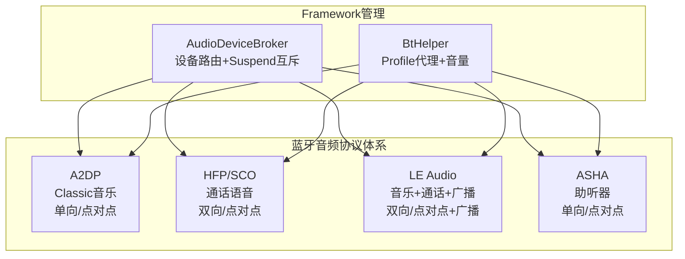
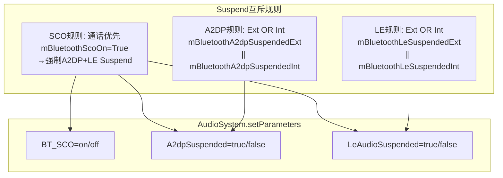
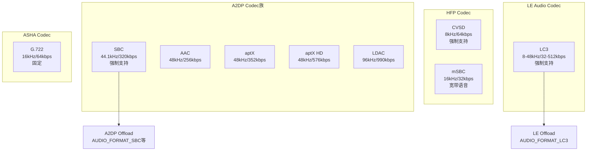
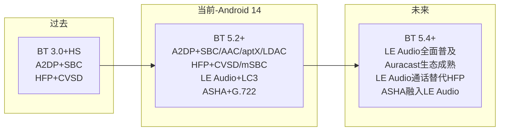

## 14.11 蓝牙音频对比总结

[← 上一个](14_14.10_LE_Audio与Classic_Bluetooth共存策略.md) | [← 返回14章](README.md) | [返回导航](../README.md)

---

### 14.11.1 四大蓝牙音频协议总览

Android 14支持四种蓝牙音频协议，每种面向不同场景：

### 14.11.2 核心参数对比

| 维度 | A2DP | HFP/SCO | LE Audio | ASHA |
|------|------|---------|----------|------|
| **蓝牙版本** | BR/EDR 2.0+ | BR/EDR 1.1+ | BLE 5.2+ | BLE 4.2+ |
| **传输层** | ACL链路 | SCO/eSCO链路 | ISO链路(CIS/BIS) | ISO链路(CIS) |
| **方向** | 单向(Sink) | 双向 | 双向+广播 | 单向(Sink) |
| **连接模式** | 点对点 | 点对点 | 点对点+点对多点 | 点对点 |
| **编解码器** | SBC/AAC/aptX/LDAC | CVSD/mSBC | LC3(强制) | G.722 |
| **采样率** | 44.1/48/96kHz | 8/16kHz | 8/16/24/32/44.1/48kHz | 16kHz |
| **比特率** | 128-990kbps | 64kbps(CVSD)/32kbps(mSBC) | 32-512kbps | 64kbps |
| **延迟** | 100-200ms | 30-50ms | 20-50ms | 20-40ms |
| **音量范围** | 0-127(AVRCP) | 0.0-1.0(float) | 0-255(VCP) | -128~0dB |
| **音量控制** | AVRCP绝对音量 | AT命令 | VCP(VCS+VOCS+AICS) | dB增益 |
| **AudioDevice** | DEVICE_OUT_BLUETOOTH_A2DP | DEVICE_OUT_BLUETOOTH_SCO | DEVICE_OUT_BLE_HEADSET | DEVICE_OUT_HEARING_AID |
| **Profile Service** | A2dpService | HeadsetService | LeAudioService | HearingAidService |
| **状态机** | A2dpStateMachine(4状态) | ScoStateMachine(6状态) | LeAudioStateMachine(4状态) | HearingAidStateMachine(4状态) |
| **最大设备数** | 1(Active) | 1(Active) | 多设备(组) | 10(MAX) |

### 14.11.3 Framework层对比

| 组件 | A2DP | HFP/SCO | LE Audio | ASHA |
|------|------|---------|----------|------|
| **BtHelper代理** | mA2dp | mBluetoothHeadset | mLeAudio | mHearingAid |
| **Active Device** | getActiveDevices | getActiveDevice | getActiveDevices | getActiveDevices |
| **Codec查询** | getA2dpCodec→bluetoothCodecToAudioFormat | N/A(固定CVSD/mSBC) | getHwOffloadFormatsSupportedForLeAudio | N/A(固定G.722) |
| **音量设置** | setAvrcpAbsoluteVolume(0-127) | setScoVolume(0.0-1.0) | setLeAudioVolume(0-255) | setHearingAidVolume(dB)→getStreamVolumeDB |
| **Suspend** | setA2dpSuspended(Ext/Int) | N/A | setLeAudioSuspended(Ext/Int) | N/A |
| **设备事件** | ACTION_ACTIVE_DEVICE_CHANGED | onScoAudioStateChanged | ACTION_ACTIVE_DEVICE_CHANGED | ACTION_ACTIVE_DEVICE_CHANGED |

### 14.11.4 AudioDeviceBroker Suspend互斥对比

**Suspend优先级**：

| 优先级 | 触发 | 影响 |
|--------|------|------|
| 1(最高) | SCO激活 | 强制A2DP+LE双Suspend |
| 2 | 外部A2DP Suspend请求 | A2DP Suspend |
| 3 | 外部LE Suspend请求 | LE Suspend |
| 4 | 内部A2DP Suspend(设备切换) | A2DP Suspend |
| 5(最低) | 内部LE Suspend(设备切换) | LE Suspend |

### 14.11.5 Codec体系对比

### 14.11.6 音量模型对比

| 协议 | 音量范围 | 控制方式 | BtHelper方法 |
|------|----------|----------|-------------|
| A2DP | 0-127 | AVRCP绝对音量 | setAvrcpAbsoluteVolumeIndex |
| HFP | 0.0-1.0 | AT+VGS/VGM | setScoVolume |
| LE Audio | 0-255 | VCP(VCS) | setLeAudioVolume |
| ASHA | -128~0dB | dB增益 | setHearingAidVolume→getStreamVolumeDB |

**音量消息投递策略**（[`AudioDeviceBroker.java:1088-1108`](frameworks/base/services/core/java/com/android/server/audio/AudioDeviceBroker.java:1088)）：

| 协议 | 消息ID | 策略 | 说明 |
|------|--------|------|------|
| A2DP | MSG_SET_AVRCP_ABSOLUTE_VOLUME | REPLACE | 只保留最新音量 |
| LE Audio | MSG_SET_LE_AUDIO_VOLUME | REPLACE | 只保留最新音量 |
| ASHA | MSG_SET_HEARING_AID_VOLUME | REPLACE | 只保留最新音量 |
| 设备变化 | MSG_BT_DEVICE_CONFIG_CHANGE | QUEUE | 设备变化需全部处理 |

### 14.11.7 状态机对比

| 协议 | 状态机类 | 状态数 | 状态列表 |
|------|----------|--------|----------|
| A2DP | A2dpStateMachine | 4 | Disconnected/Connecting/Connected/Disconnecting |
| HFP/SCO | ScoStateMachine(6常量) | 6 | INACTIVE/ACTIVATE_REQ/ACTIVE_EXT/ACTIVE_INT/DEACTIVATE_REQ/DEACTIVATING |
| LE Audio | LeAudioStateMachine | 4 | Disconnected/Connecting/Connected/Disconnecting |
| ASHA | HearingAidStateMachine | 4 | Disconnected/Connecting/Connected/Disconnecting |

### 14.11.8 设备组管理对比

| 协议 | 设备组机制 | 组标识 | 最大设备数 |
|------|-----------|--------|-----------|
| A2DP | 无组管理 | N/A | 1(Active) |
| HFP | 无组管理 | N/A | 1(Active) |
| LE Audio | CSIP设备组 | SIRK+RSI | 理论无限 |
| ASHA | HiSyncId组 | HiSyncId | 10(MAX_HEARING_AID_STATE_MACHINES) |

### 14.11.9 AAOS车载场景选择指南

| 场景 | 推荐协议 | 原因 | AudioDevice |
|------|----------|------|-------------|
| 驾驶员手机音乐 | A2DP或LE Audio | 音质优先→LDAC; 低延迟→LC3 | DEVICE_OUT_BLUETOOTH_A2DP / DEVICE_OUT_BLE_HEADSET |
| 驾驶员手机通话 | HFP或LE Audio通话 | HFP兼容性好; LE Audio音质优 | DEVICE_OUT_BLUETOOTH_SCO / DEVICE_OUT_BLE_HEADSET |
| 乘客后排娱乐 | A2DP | 成熟稳定 | DEVICE_OUT_BLUETOOTH_A2DP |
| 全车广播通知 | LE Audio Broadcast | 1对多广播 | DEVICE_OUT_BLE_BROADCAST |
| 助听器接入 | ASHA或LE Audio | ASHA专用; LE Audio通用的 | DEVICE_OUT_HEARING_AID / DEVICE_OUT_BLE_HEADSET |
| 车载语音助手 | LE Audio | 低延迟双向 | DEVICE_OUT_BLE_HEADSET |
| 多语言导游 | LE Audio Broadcast | 多SubGroup | DEVICE_OUT_BLE_BROADCAST |
| 紧急通话 | HFP SCO | 最高优先级互斥 | DEVICE_OUT_BLUETOOTH_SCO |

### 14.11.10 演进路线

**Android 14蓝牙音频特性总结**：

| 特性 | 状态 | 说明 |
|------|------|------|
| A2DP Offload | 成熟 | SBC/AAC/aptX/LDAC全部支持 |
| LE Audio Unicast | 已集成 | 音乐+通话+语音助手 |
| LE Audio Broadcast | 已集成 | Auracast广播 |
| ASHA助听器 | 已集成 | HiSyncId组管理 |
| LE Audio与A2DP共存 | 已实现 | Suspend互斥+设备切换 |
| LE Audio通话替代HFP | 部分实现 | BAP Call Mode可用 |
| 通话Handover(HFP→LE) | 规划中 | Bluetooth SIG标准制定中 |

### 14.11.11 全局调试命令

| 命令 | 说明 |
|------|------|
| `dumpsys audio | grep -i bluetooth` | 全部蓝牙音频状态 |
| `dumpsys audio | grep -i suspend` | Suspend互斥状态 |
| `dumpsys audio | grep -i sco` | SCO通话状态 |
| `dumpsys bluetooth_manager` | BT Profile连接状态 |
| `dumpsys bluetooth_le_audio` | LE Audio完整状态 |
| `dumpsys bluetooth_a2dp` | A2DP Codec+连接状态 |
| `dumpsys bluetooth_hearing_aid` | ASHA助听器状态 |
| `dumpsys bluetooth_bass_client` | Broadcast扫描状态 |
| `logcat -s AudioDeviceBroker BtHelper` | Framework层蓝牙日志 |
| `logcat -s LeAudioService A2dpService HeadsetService HearingAidService` | BT Service层日志 |

---

[← 上一个](14_14.10_LE_Audio与Classic_Bluetooth共存策略.md) | [← 返回14章](README.md) | [返回导航](../README.md)