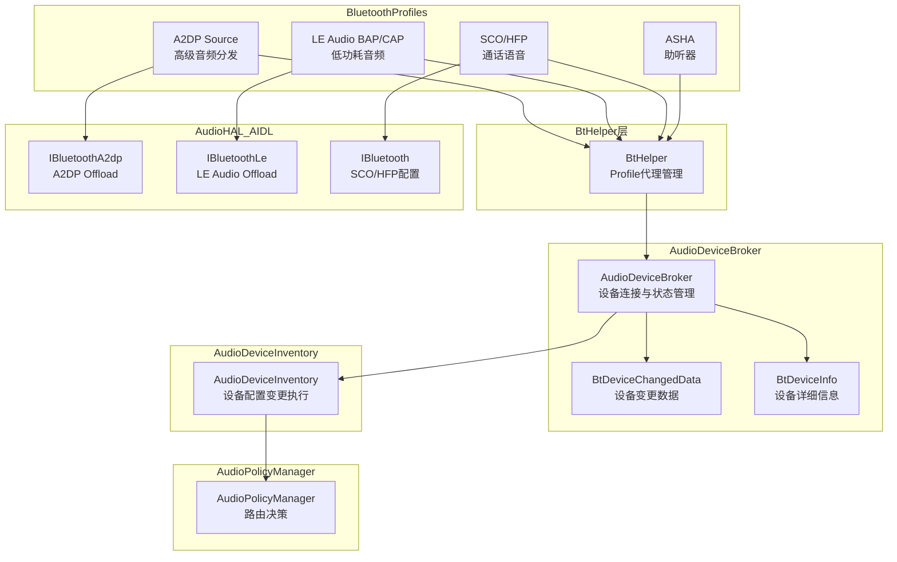
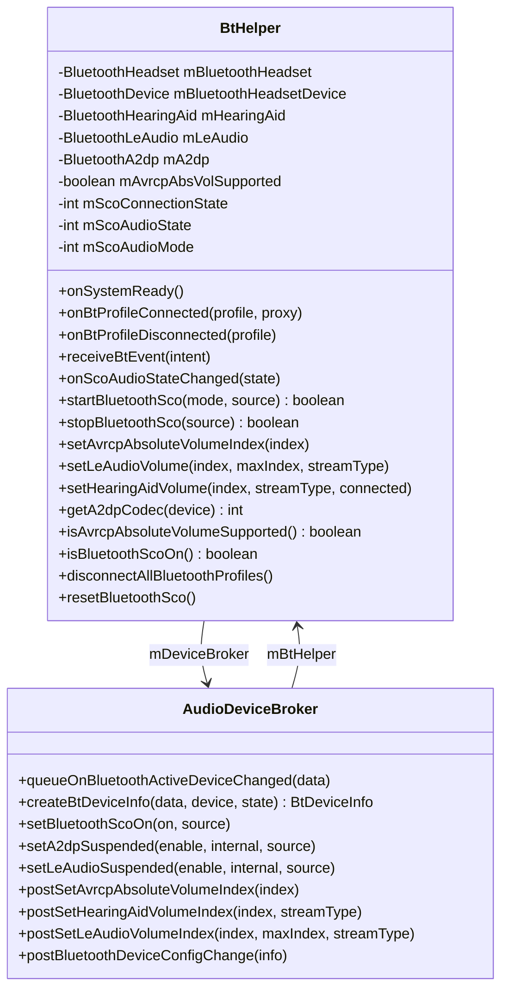
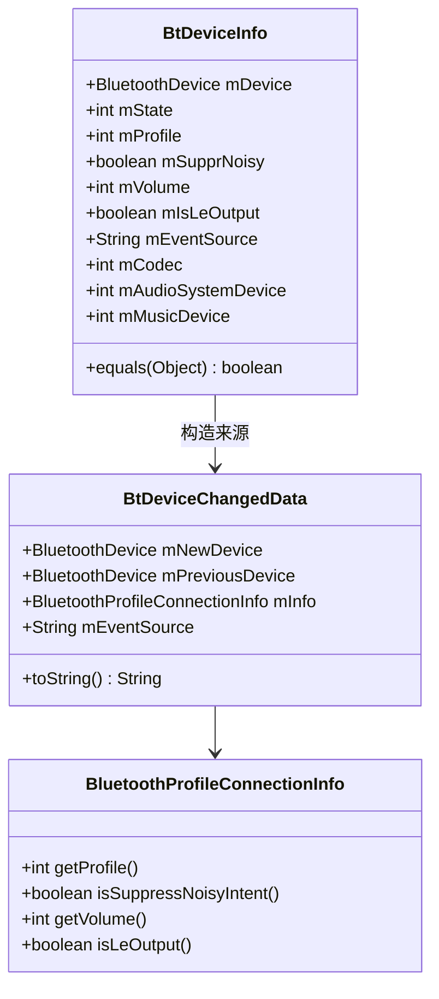
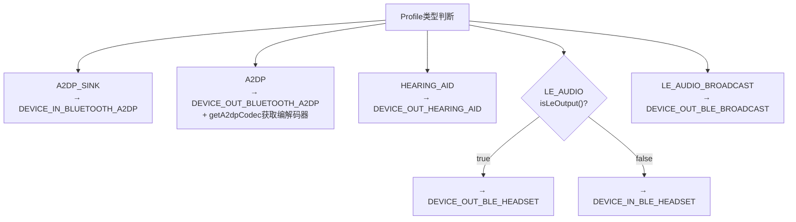
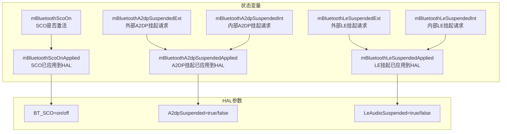
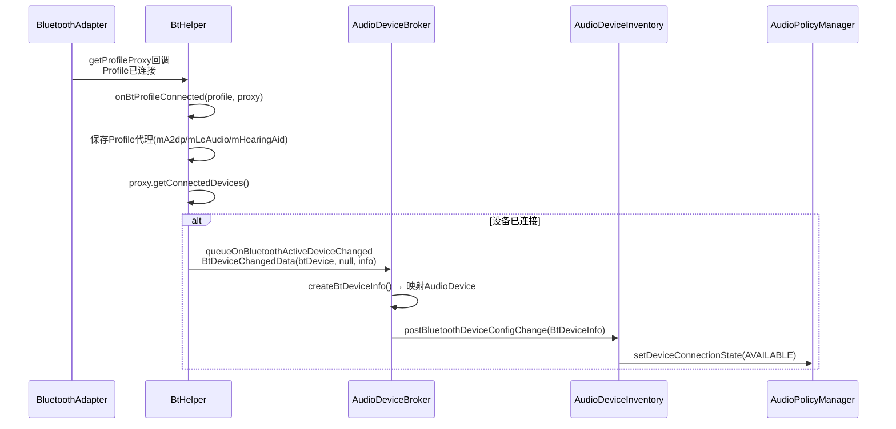
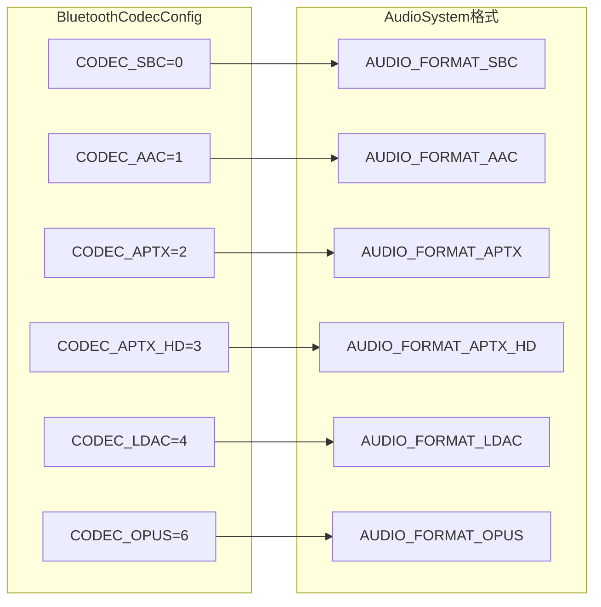
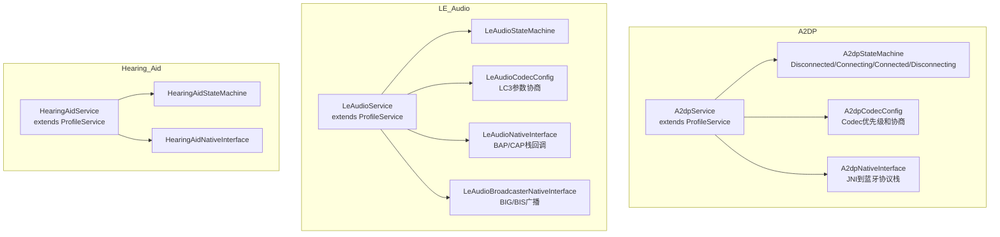

## 14.1 蓝牙音频协议总览

[← 上一篇](../13_Volume_Device_Deep_Dive/README.md) | [← 返回14章](README.md) | [返回导航](../README.md) | [下一个 →](14_14.2_A2DP-高级音频分发协议.md)

---

### 14.1.1 蓝牙音频协议栈全景

AOSP14中的蓝牙音频系统覆盖四大协议族：A2DP、LE Audio、SCO/HFP、Hearing Aid(ASHA)。每种协议通过不同的蓝牙Profile与Android Audio Framework对接，最终由[`AudioDeviceBroker`](frameworks/base/services/core/java/com/android/server/audio/AudioDeviceBroker.java:73)统一管理设备连接、路由切换和音量控制。

### 14.1.2 四大协议核心参数对比

| 维度 | A2DP | LE Audio | SCO/HFP | Hearing Aid |
|------|------|----------|---------|-------------|
| 引入版本 | Android 1.5 | Android 12 | Android 1.5 | Android 9 |
| 蓝牙Profile | BluetoothProfile.A2DP(2) | BluetoothProfile.LE_AUDIO(22) | BluetoothProfile.HEADSET(1) | BluetoothProfile.HEARING_AID(21) |
| 音频方向 | 单向输出 | 双向(输出+输入) | 双向 | 单向输出 |
| 编解码器 | SBC/AAC/aptX/aptX-HD/LDAC | LC3 | CVSD/mSBC/LC3 | ASHA自定义 |
| 典型延迟 | ~200ms | ~30ms | ~50ms | ~200ms |
| 音量模型 | AVRCP绝对音量(0-127) | VCP(0-255) | HfpConfig.volume(0.0~1.0) | 增益(-128~0dB) |
| Audio设备类型 | DEVICE_OUT_BLUETOOTH_A2DP | DEVICE_OUT_BLE_HEADSET / DEVICE_IN_BLE_HEADSET | DEVICE_OUT_BLUETOOTH_SCO_HEADSET | DEVICE_OUT_HEARING_AID |
| HAL接口 | IBluetoothA2dp | IBluetoothLe | IBluetooth(ScoConfig/HfpConfig) | 无专用接口 |
| Offload支持 | reconfigureOffload | reconfigureOffload | N/A | N/A |
| 固定音量设备 | 是(FLAG_FIXED_VOLUME) | 否 | 否 | 是 |
| 典型用途 | 音乐播放 | 音乐+通话+广播 | 通话语音 | 助听器 |
| 最大连接设备数 | MAX_A2DP_STATE_MACHINES=50 | MAX_LE_AUDIO_DEVICES=10 | 1个活动SCO | MAX_HEARING_AID_STATE_MACHINES=10 |
| AOSP服务类 | A2dpService | LeAudioService | HeadsetService | HearingAidService |

### 14.1.3 BtHelper — 蓝牙Profile代理核心

[`BtHelper`](frameworks/base/services/core/java/com/android/server/audio/BtHelper.java:54)是AudioDeviceBroker与蓝牙Profile服务之间的桥梁，持有各Profile的代理对象并封装所有蓝牙音频操作。

**BtHelper核心字段解析**（源码[`BtHelper.java:65-116`](frameworks/base/services/core/java/com/android/server/audio/BtHelper.java:65)）：

| 字段 | 类型 | 说明 |
|------|------|------|
| `mBluetoothHeadset` | BluetoothHeadset | HFP/SCO的Profile代理，用于startSco/stopSco |
| `mBluetoothHeadsetDevice` | BluetoothDevice | 当前连接的Headset设备 |
| `mA2dp` | BluetoothA2dp | A2DP的Profile代理，用于Codec查询和音量控制 |
| `mLeAudio` | BluetoothLeAudio | LE Audio的Profile代理，用于音量设置 |
| `mHearingAid` | BluetoothHearingAid | ASHA的Profile代理，用于增益设置 |
| `mAvrcpAbsVolSupported` | boolean | AVRCP绝对音量是否支持 |
| `mScoAudioState` | int | SCO音频状态机(INACTIVE/ACTIVATE_REQ/ACTIVE_EXT/ACTIVE_INT/DEACTIVATE_REQ/DEACTIVATING) |
| `mScoAudioMode` | int | SCO模式(UNDEFINED=-1/VIRTUAL_CALL=0/VR=2) |

### 14.1.4 BtDeviceInfo数据结构 — 蓝牙设备信息载体

[`BtDeviceInfo`](frameworks/base/services/core/java/com/android/server/audio/AudioDeviceBroker.java:727)是蓝牙设备在Audio系统中传递的核心数据结构，封装了设备地址、Profile类型、连接状态、Codec信息等。

**BtDeviceInfo字段详解**（源码[`AudioDeviceBroker.java:727-810`](frameworks/base/services/core/java/com/android/server/audio/AudioDeviceBroker.java:727)）：

| 字段 | 类型 | 说明 |
|------|------|------|
| `mDevice` | BluetoothDevice | 蓝牙设备地址和名称 |
| `mState` | int | 连接状态(STATE_CONNECTED/STATE_DISCONNECTED) |
| `mProfile` | int | 蓝牙Profile类型(A2DP=2/HEARING_AID=21/LE_AUDIO=22/LE_AUDIO_BROADCAST=23) |
| `mSupprNoisy` | boolean | 是否抑制AUDIO_BECOMING_NOISY广播 |
| `mVolume` | int | 设备音量 |
| `mIsLeOutput` | boolean | LE Audio是否为输出方向(区分DEVICE_OUT_BLE_HEADSET和DEVICE_IN_BLE_HEADSET) |
| `mCodec` | int | AudioSystem编解码格式枚举(AUDIO_FORMAT_DEFAULT/AUDIO_FORMAT_SBC/AUDIO_FORMAT_AAC等) |
| `mAudioSystemDevice` | int | AudioSystem设备类型(DEVICE_OUT_BLUETOOTH_A2DP/DEVICE_OUT_BLE_HEADSET等) |
| `mMusicDevice` | int | 当前音乐输出设备 |

**createBtDeviceInfo()的Profile→AudioDevice映射**（源码[`AudioDeviceBroker.java:812-842`](frameworks/base/services/core/java/com/android/server/audio/AudioDeviceBroker.java:812)）：

### 14.1.5 蓝牙音频状态管理 — Suspend与SCO互斥

[`AudioDeviceBroker`](frameworks/base/services/core/java/com/android/server/audio/AudioDeviceBroker.java:892)通过`mBluetoothAudioStateLock`保护的6个状态变量管理蓝牙音频的Suspend和SCO互斥：

**SCO与A2DP/LE Audio互斥规则**（源码[`updateAudioHalBluetoothState()`](frameworks/base/services/core/java/com/android/server/audio/AudioDeviceBroker.java:934)）：

1. **SCO激活时**：自动挂起A2DP和LE Audio（`A2dpSuspended=true` + `LeAudioSuspended=true`），然后开启SCO（`BT_SCO=on`）
2. **SCO未激活时**：A2DP Suspend由`Ext||Int`决定，LE Audio Suspend由`Ext||Int`决定
3. **初始化**：[`initAudioHalBluetoothState()`](frameworks/base/services/core/java/com/android/server/audio/AudioDeviceBroker.java:923)设置`BT_SCO=off`、`A2dpSuspended=false`、`LeAudioSuspended=false`

### 14.1.6 蓝牙Profile连接生命周期

[`BtHelper.onBtProfileConnected()`](frameworks/base/services/core/java/com/android/server/audio/BtHelper.java:488)在蓝牙Profile服务连接后，自动查询已连接设备并通知AudioDeviceBroker：

### 14.1.7 A2DP Codec → AudioSystem格式映射

[`BtHelper.getA2dpCodec()`](frameworks/base/services/core/java/com/android/server/audio/BtHelper.java:241)将蓝牙Codec类型转换为AudioSystem原生格式枚举：

转换逻辑：`btCodecConfig.getCodecType()` → [`AudioSystem.bluetoothCodecToAudioFormat()`](frameworks/base/core/java/android/media/AudioSystem.java) → 返回`@AudioFormatNativeEnumForBtCodec int`

### 14.1.8 AAOS车载场景中的蓝牙音频

在AAOS车载系统中，蓝牙音频面临特殊挑战：

| 场景 | 挑战 | 解决方案 |
|------|------|----------|
| 多乘客蓝牙连接 | 车载需同时支持驾驶员和乘客独立音频 | CarAudioService管理多Zone蓝牙路由 |
| 车载通话优先级 | 通话必须立即可用，不能有延迟 | SCO激活时自动Suspend A2DP/LE Audio |
| 后座娱乐 | A2DP输出到后座耳机+车机喇叭同时输出 | CarAudioPatchHandle创建补丁路由 |
| 助听器兼容 | 驾驶员使用ASHA助听器+车内音响 | HearingAid独立路由+DEVICE_OUT_HEARING_AID |
| LE Audio广播 | 车内多耳机同时收听导航/媒体 | LE Audio Broadcast(DEVICE_OUT_BLE_BROADCAST) |
| 蓝牙快速切换 | 驾驶员上车自动从手机切换到车载蓝牙 | ActiveDeviceManager优先级策略 |

### 14.1.9 各协议服务层类结构

### 14.1.10 蓝牙音频调试命令速查

| 命令 | 用途 |
|------|------|
| `dumpsys audio | grep -A10 Bluetooth` | Audio系统中蓝牙设备状态 |
| `dumpsys bluetooth_manager` | 蓝牙管理器完整dump |
| `dumpsys bluetooth_le_audio` | LE Audio服务状态 |
| `dumpsys bluetooth_a2dp` | A2DP服务状态 |
| `dumpsys bluetooth_hearing_aid` | ASHA服务状态 |
| `logcat -s AS.BtHelper` | BtHelper日志过滤 |
| `logcat -s A2dpService A2dpStateMachine` | A2DP日志 |
| `logcat -s LeAudioService LeAudioStateMachine` | LE Audio日志 |
| `adb shell dumpsys media.audio` | AudioFlinger中蓝牙流状态 |

---

[← 上一篇](../13_Volume_Device_Deep_Dive/README.md) | [← 返回14章](README.md) | [返回导航](../README.md) | [下一个 →](14_14.2_A2DP-高级音频分发协议.md)