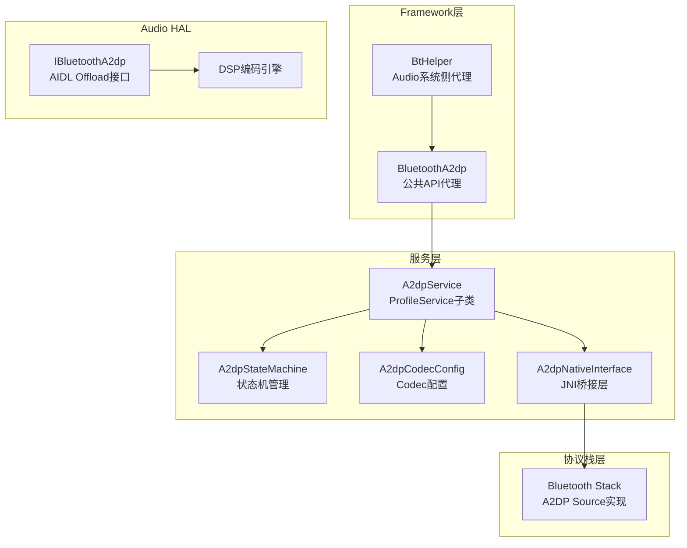
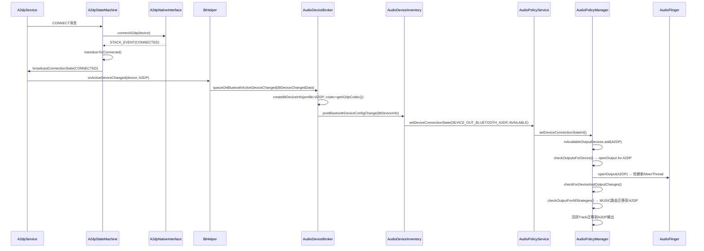
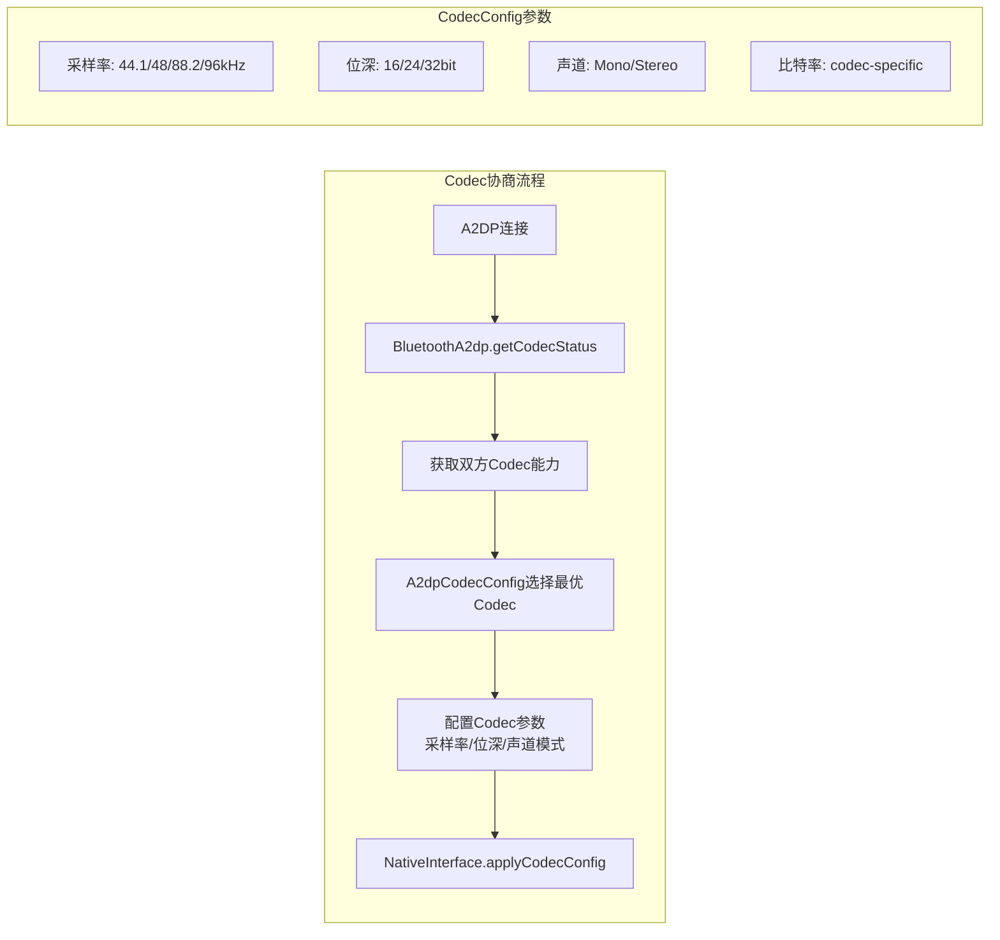
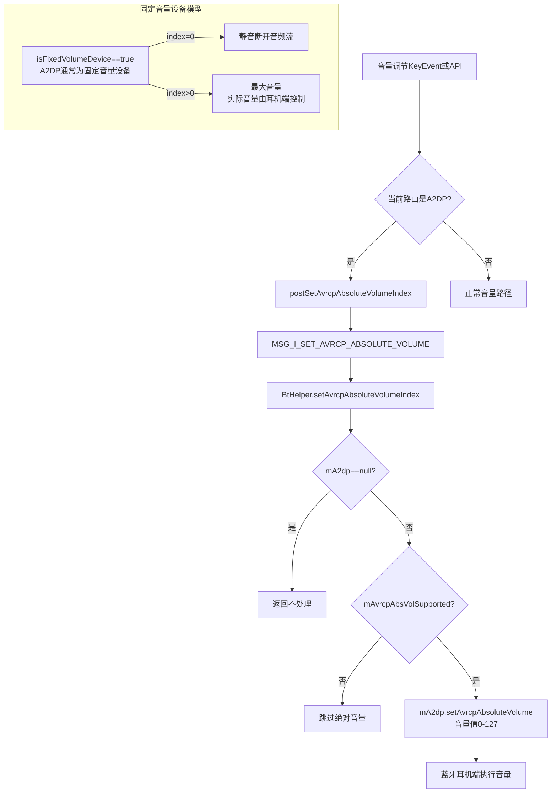
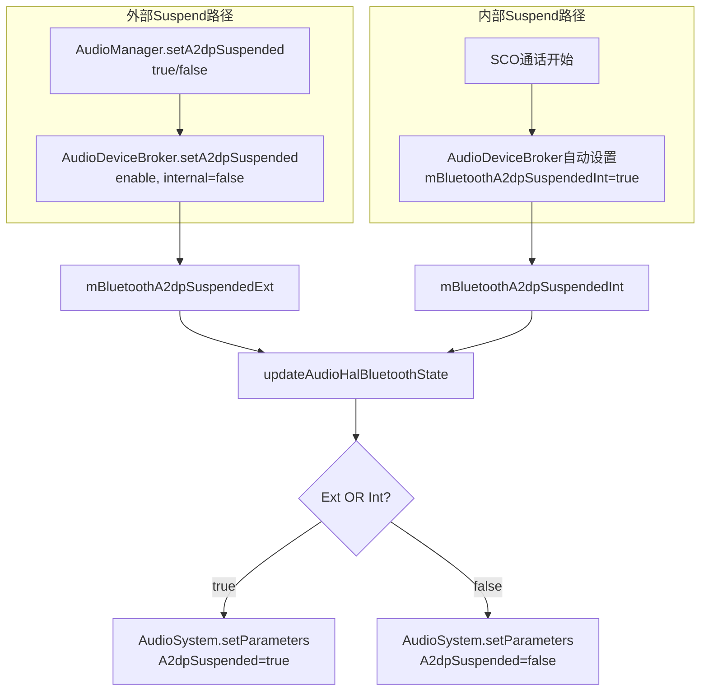
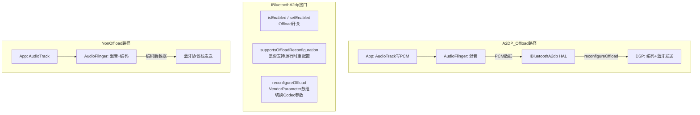
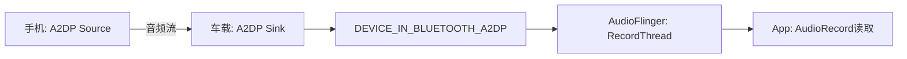
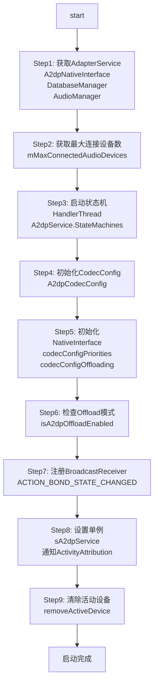

## 14.2 A2DP — 高级音频分发协议

[← 上一个](14_14.1_蓝牙音频协议总览.md) | [← 返回14章](README.md) | [返回导航](../README.md) | [下一个 →](14_14.3_LE_Audio-低功耗蓝牙音频.md)

---

### 14.2.1 A2DP服务架构

A2DP(Advanced Audio Distribution Profile)是蓝牙高质量音频传输的经典协议，由[`A2dpService`](packages/modules/Bluetooth/android/app/src/com/android/bluetooth/a2dp/A2dpService.java:77)作为核心服务入口管理所有A2DP连接和Codec协商。



**A2dpService核心字段**（源码[`A2dpService.java:84-116`](packages/modules/Bluetooth/android/app/src/com/android/bluetooth/a2dp/A2dpService.java:84)）：

| 字段 | 类型 | 说明 |
|------|------|------|
| `sA2dpService` | A2dpService | 静态单例 |
| `mAdapterService` | AdapterService | 蓝牙适配器服务 |
| `mA2dpNativeInterface` | A2dpNativeInterface | JNI桥接接口 |
| `mA2dpCodecConfig` | A2dpCodecConfig | Codec优先级和协商管理 |
| `mActiveDevice` | BluetoothDevice | 当前活动A2DP设备(@GuardedBy mStateMachines) |
| `mStateMachines` | ConcurrentMap | 设备→状态机映射 |
| `mMaxConnectedAudioDevices` | int | 最大同时连接设备数(默认1) |
| `mA2dpOffloadEnabled` | boolean | A2DP Offload是否启用 |

### 14.2.2 A2dpStateMachine状态机

[`A2dpStateMachine`](packages/modules/Bluetooth/android/app/src/com/android/bluetooth/a2dp/A2dpStateMachine.java:76)管理每个A2DP设备的连接生命周期，采用经典四状态模型：

```mermaid
stateDiagram-v2
    state Disconnected {
        [*] --> Disconnected
    }
    state Connecting {
        [*] --> Connecting
    }
    state Connected {
        [*] --> Connected
    }
    state Disconnecting {
        [*] --> Disconnecting
    }

    Disconnected --> Connecting : CONNECT消息<br>mA2dpNativeInterface.connectA2dp()
    Connecting --> Connected : STACK_EVENT:CONNECTED<br>连接成功
    Connecting --> Disconnected : CONNECT_TIMEOUT<br>30秒超时
    Connected --> Disconnecting : DISCONNECT消息
    Disconnecting --> Disconnected : STACK_EVENT:DISCONNECTED
    Connected --> Connected : STACK_EVENT:PLAYING<br>mIsPlaying=true
    Connected --> Connected : STACK_EVENT:NOT_PLAYING<br>mIsPlaying=false
```

**A2dpStateMachine关键状态处理**（源码[`A2dpStateMachine.java:80-124`](packages/modules/Bluetooth/android/app/src/com/android/bluetooth/a2dp/A2dpStateMachine.java:80)）：

| 状态 | 消息 | 行为 |
|------|------|------|
| Disconnected | CONNECT(1) | 调用`mA2dpNativeInterface.connectA2dp()`，transitionTo(Connecting) |
| Connecting | STACK_EVENT(101) | 处理连接事件，成功则transitionTo(Connected) |
| Connecting | CONNECT_TIMEOUT(201) | 30秒超时，transitionTo(Disconnected) |
| Connected | DISCONNECT(2) | 调用`mA2dpNativeInterface.disconnectA2dp()`，transitionTo(Disconnecting) |
| Connected | STACK_EVENT+PLAYING | 设置`mIsPlaying=true`，广播STATE_PLAYING |
| Connected | STACK_EVENT+NOT_PLAYING | 设置`mIsPlaying=false`，广播STATE_NOT_PLAYING |

### 14.2.3 A2DP连接→Audio路由全流程

从蓝牙A2DP连接到音频路由建立的完整流程：



**queueOnBluetoothActiveDeviceChanged()核心逻辑**（源码[`AudioDeviceBroker.java:860-890`](frameworks/base/services/core/java/com/android/server/audio/AudioDeviceBroker.java:860)）：

- **同一设备更新**（`previousDevice == newDevice`）：直接发送`STATE_CONNECTED`事件
- **设备切换**：先发送`STATE_DISCONNECTED`给旧设备，再发送`STATE_CONNECTED`给新设备
- 消息通过`MSG_L_BLUETOOTH_DEVICE_CONFIG_CHANGE`队列化处理

### 14.2.4 A2DP Codec协商机制

A2DP支持多种编解码器，协商过程由[`A2dpCodecConfig`](packages/modules/Bluetooth/android/app/src/com/android/bluetooth/a2dp/A2dpCodecConfig.java)和底层蓝牙协议栈完成。

**Codec优先级**（从高到低）：

| 优先级 | Codec | 最大比特率 | 特性 |
|--------|-------|-----------|------|
| 1 | LDAC | 990kbps | Hi-Res音频，自适应比特率 |
| 2 | aptX HD | 576kbps | 高品质音频 |
| 3 | aptX | 384kbps | 低延迟音频 |
| 4 | AAC | 256kbps | Apple生态兼容 |
| 5 | SBC | 328kbps | A2DP强制编码，基线兼容 |
| 6 | Opus | 待定 | AOSP14新增支持 |



**BtHelper.getA2dpCodec()实现**（源码[`BtHelper.java:241-260`](frameworks/base/services/core/java/com/android/server/audio/BtHelper.java:241)）：

```java
// 简化的getA2dpCodec逻辑
synchronized int getA2dpCodec(BluetoothDevice device) {
    if (mA2dp == null) return AUDIO_FORMAT_DEFAULT;
    BluetoothCodecStatus btCodecStatus = mA2dp.getCodecStatus(device);
    if (btCodecStatus == null) return AUDIO_FORMAT_DEFAULT;
    BluetoothCodecConfig btCodecConfig = btCodecStatus.getCodecConfig();
    if (btCodecConfig == null) return AUDIO_FORMAT_DEFAULT;
    return AudioSystem.bluetoothCodecToAudioFormat(btCodecConfig.getCodecType());
}
```

### 14.2.5 A2DP音量机制 — AVRCP绝对音量

A2DP设备使用AVRCP(Audio/Video Remote Control Profile)绝对音量协议，手机端音量直接映射到耳机端。



**AVRCP绝对音量关键方法**：

| 方法 | 位置 | 说明 |
|------|------|------|
| [`postSetAvrcpAbsoluteVolumeIndex()`](frameworks/base/services/core/java/com/android/server/audio/AudioDeviceBroker.java:1088) | AudioDeviceBroker | 通过MSG_I_SET_AVRCP_ABSOLUTE_VOLUME消息投递 |
| [`setAvrcpAbsoluteVolumeIndex()`](frameworks/base/services/core/java/com/android/server/audio/BtHelper.java:216) | BtHelper | 执行绝对音量设置，空指针和兼容性检查 |
| [`isAvrcpAbsoluteVolumeSupported()`](frameworks/base/services/core/java/com/android/server/audio/BtHelper.java:207) | BtHelper | 检查`mA2dp!=null && mAvrcpAbsVolSupported` |
| [`setAvrcpAbsoluteVolumeSupported()`](frameworks/base/services/core/java/com/android/server/audio/BtHelper.java:211) | BtHelper | 蓝牙端通知绝对音量能力 |

**音量范围**：AVRCP绝对音量范围0-127，AudioService内部音量索引映射到此范围。

### 14.2.6 A2DP Suspend机制

A2DP可以被挂起(Suspend)，最典型的场景是SCO通话时需要暂停A2DP音频流。



**setA2dpSuspended()方法详解**（源码[`AudioDeviceBroker.java:1004-1019`](frameworks/base/services/core/java/com/android/server/audio/AudioDeviceBroker.java:1004)）：

```java
void setA2dpSuspended(boolean enable, boolean internal, String eventSource) {
    synchronized (mBluetoothAudioStateLock) {
        if (internal) {
            mBluetoothA2dpSuspendedInt = enable;  // 内部请求(如SCO互斥)
        } else {
            mBluetoothA2dpSuspendedExt = enable;  // 外部API请求
        }
        updateAudioHalBluetoothState();  // 统一更新HAL状态
    }
}
```

**clearA2dpSuspended()清除逻辑**（源码[`AudioDeviceBroker.java:1021-1032`](frameworks/base/services/core/java/com/android/server/audio/AudioDeviceBroker.java:1021)）：

- `internalOnly=true`：仅清除`mBluetoothA2dpSuspendedInt`
- `internalOnly=false`：同时清除`Ext`和`Int`

### 14.2.7 A2DP Offload机制

A2DP Offload将编码工作从CPU卸载到DSP，降低功耗。通过AIDL接口[`IBluetoothA2dp`](hardware/interfaces/audio/aidl/default/IBluetoothA2dp.aidl)与HAL层通信。



**Offload判断**（源码[`A2dpService.java:171`](packages/modules/Bluetooth/android/app/src/com/android/bluetooth/a2dp/A2dpService.java:171)）：

```java
mA2dpOffloadEnabled = mAdapterService.isA2dpOffloadEnabled();
```

当Offload启用时，AudioFlinger将PCM数据直接传递给`IBluetoothA2dp` HAL，DSP完成编码和蓝牙发送。`reconfigureOffload()`允许运行时切换Codec参数而无需重建音频流。

### 14.2.8 A2DP Sink模式

A2DP Sink允许设备作为音频接收端(如车载蓝牙接收手机音乐)，对应Audio设备类型`DEVICE_IN_BLUETOOTH_A2DP`。



在[`createBtDeviceInfo()`](frameworks/base/services/core/java/com/android/server/audio/AudioDeviceBroker.java:817)中，A2DP_SINK Profile映射到`DEVICE_IN_BLUETOOTH_A2DP`输入设备。

### 14.2.9 A2DP服务启动流程

[`A2dpService.start()`](packages/modules/Bluetooth/android/app/src/com/android/bluetooth/a2dp/A2dpService.java:134)执行9步初始化：



### 14.2.10 AAOS车载A2DP场景

| 场景 | 实现方式 | 关键点 |
|------|----------|--------|
| 手机音乐→车载音响 | A2DP Sink接收+内部路由到Speaker | CarAudioService管理DEVICE_IN_BLUETOOTH_A2DP |
| 车载音乐→蓝牙耳机 | A2DP Source发送 | DEVICE_OUT_BLUETOOTH_A2DP，固定音量设备 |
| 多乘客独立音频 | 多A2DP连接(需mMaxConnectedAudioDevices>1) | 每个Zone独立路由 |
| 通话时暂停音乐 | SCO激活→自动Suspend A2DP | updateAudioHalBluetoothState()互斥 |
| 上车自动连接 | AutoConnect策略 | A2dpService连接优先级管理 |

### 14.2.11 A2DP调试命令

| 命令 | 说明 |
|------|------|
| `dumpsys bluetooth_a2dp` | A2DP服务完整状态 |
| `dumpsys bluetooth_a2dp | grep ActiveDevice` | 当前活动A2DP设备 |
| `dumpsys bluetooth_a2dp | grep Codec` | 当前Codec配置 |
| `dumpsys audio | grep -A5 A2DP` | Audio系统中A2DP路由状态 |
| `logcat -s A2dpService A2dpStateMachine` | A2DP日志 |
| `logcat -s AS.BtHelper | grep AVRCP` | AVRCP音量日志 |
| `dumpsys audio | grep FixedVolume` | 固定音量设备检查 |

---

[← 上一个](14_14.1_蓝牙音频协议总览.md) | [← 返回14章](README.md) | [返回导航](../README.md) | [下一个 →](14_14.3_LE_Audio-低功耗蓝牙音频.md)