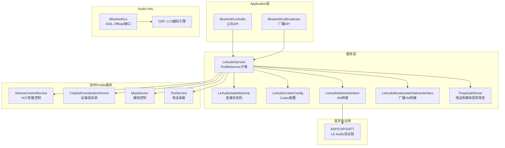
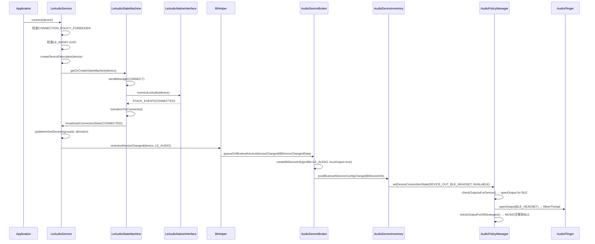
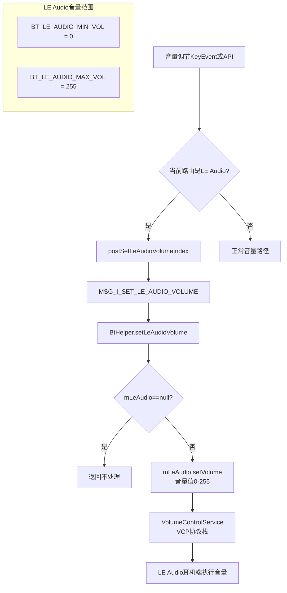
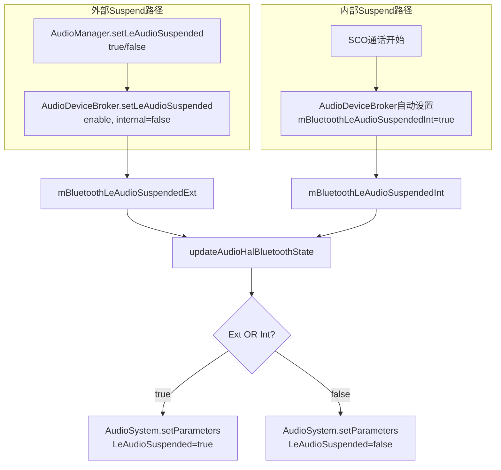
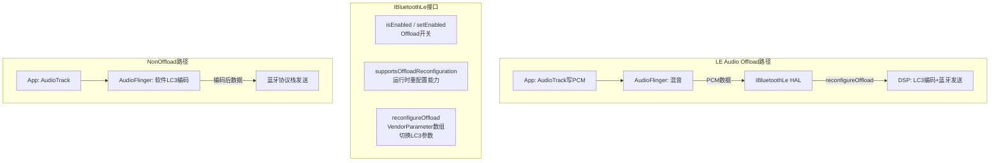
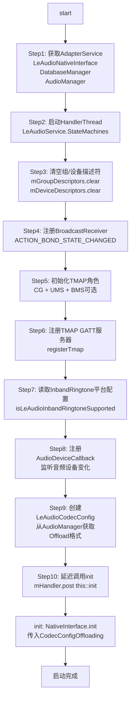
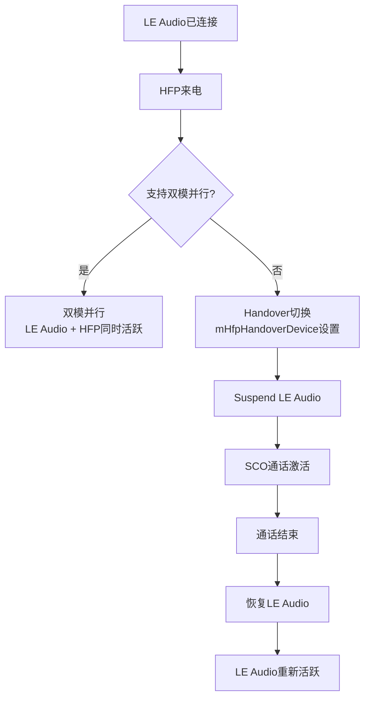
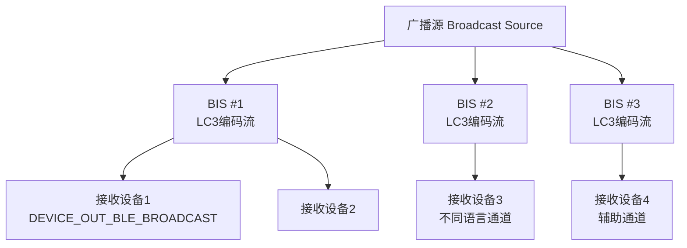

## 14.3 LE Audio — 低功耗蓝牙音频

[← 上一个](14_14.2_A2DP-高级音频分发协议.md) | [← 返回14章](README.md) | [返回导航](../README.md) | [下一个 →](14_14.4_SCOHFP-通话语音.md)

---

### 14.3.1 LE Audio协议栈架构

LE Audio是蓝牙5.2引入的新一代音频架构，基于BAP(Basic Audio Profile)和CAP(Common Audio Profile)构建，支持CIS单播和BIS广播两种传输模式。[`LeAudioService`](packages/modules/Bluetooth/android/app/src/com/android/bluetooth/le_audio/LeAudioService.java:95)是AOSP14中LE Audio的核心服务入口。



**LeAudioService核心字段**（源码[`LeAudioService.java:95-218`](packages/modules/Bluetooth/android/app/src/com/android/bluetooth/le_audio/LeAudioService.java:95)）：

| 字段 | 类型 | 说明 |
|------|------|------|
| `sLeAudioService` | LeAudioService | 静态单例 |
| `MAX_LE_AUDIO_DEVICES` | int=10 | 最大LE Audio设备数 |
| `mActiveAudioOutDevice` | volatile BluetoothDevice | 活动输出设备 |
| `mActiveAudioInDevice` | volatile BluetoothDevice | 活动输入设备 |
| `mExposedActiveDevice` | BluetoothDevice | 对外暴露的活动设备 |
| `mLeAudioCodecConfig` | LeAudioCodecConfig | Codec配置管理 |
| `mGroupLock` | Object | 组描述符操作同步锁 |
| `mGroupDescriptors` | Map(Integer, LeAudioGroupDescriptor) | 组ID→组描述符 |
| `mDeviceDescriptors` | Map(BluetoothDevice, LeAudioDeviceDescriptor) | 设备→设备描述符 |
| `mTmapGattServer` | LeAudioTmapGattServer | TMAP GATT服务器 |
| `mTmapRoleMask` | int | TMAP角色位掩码 |
| `mVolumeControlService` | VolumeControlService | VCP音量控制服务 |
| `mCsipSetCoordinatorService` | CsipSetCoordinatorService | CSIP设备组协调 |
| `mMcpService` | McpService | MCP媒体控制服务 |
| `mTbsService` | TbsService | TBS电话承载服务 |

### 14.3.2 LE Audio组与设备描述符

LE Audio引入了"组"的概念，支持左右耳等协调设备组。每个组由[`LeAudioGroupDescriptor`](packages/modules/Bluetooth/android/app/src/com/android/bluetooth/le_audio/LeAudioService.java:165)描述，每个设备由[`LeAudioDeviceDescriptor`](packages/modules/Bluetooth/android/app/src/com/android/bluetooth/le_audio/LeAudioService.java:186)描述。

**LeAudioGroupDescriptor**（源码[`LeAudioService.java:165-184`](packages/modules/Bluetooth/android/app/src/com/android/bluetooth/le_audio/LeAudioService.java:165)）：

| 字段 | 类型 | 说明 |
|------|------|------|
| `mIsConnected` | Boolean | 组内所有设备是否已连接 |
| `mIsActive` | Boolean | 是否为活动组(正在音频流) |
| `mDirection` | Integer | 音频方向位掩码(OUTPUT_BIT=0x01, INPUT_BIT=0x02) |
| `mCodecStatus` | BluetoothLeAudioCodecStatus | 当前Codec状态 |
| `mLostLeadDeviceWhileStreaming` | BluetoothDevice | 流传输中丢失的主设备 |
| `mInbandRingtoneEnabled` | Boolean | 是否启用带内铃声 |
| `mAvailableContexts` | Integer | 可用的音频上下文类型 |

**LeAudioDeviceDescriptor**（源码[`LeAudioService.java:186-200`](packages/modules/Bluetooth/android/app/src/com/android/bluetooth/le_audio/LeAudioService.java:186)）：

| 字段 | 类型 | 说明 |
|------|------|------|
| `mStateMachine` | LeAudioStateMachine | 设备连接状态机 |
| `mGroupId` | Integer | 所属组ID(LE_AUDIO_GROUP_ID_INVALID=-1表示无效) |
| `mSinkAudioLocation` | Integer | 音频接收位置(AUDIO_LOCATION_INVALID等) |
| `mDirection` | Integer | 音频方向位掩码 |
| `mDevInbandRingtoneEnabled` | Boolean | 设备级带内铃声开关 |

**音频方向常量**（源码[`LeAudioService.java:107-119`](packages/modules/Bluetooth/android/app/src/com/android/bluetooth/le_audio/LeAudioService.java:107)）：

| 常量 | 值 | 说明 |
|------|------|------|
| `AUDIO_DIRECTION_NONE` | 0x00 | 无音频方向 |
| `AUDIO_DIRECTION_OUTPUT_BIT` | 0x01 | 输出方向(播放到耳机) |
| `AUDIO_DIRECTION_INPUT_BIT` | 0x02 | 输入方向(从麦克风录音) |

### 14.3.3 LeAudioStateMachine状态机

[`LeAudioStateMachine`](packages/modules/Bluetooth/android/app/src/com/android/bluetooth/le_audio/LeAudioStateMachine.java:69)与A2DP采用相同的四状态模型，但额外支持Connecting↔Disconnecting双向转换：

```mermaid
stateDiagram-v2
    state Disconnected {
        [*] --> Disconnected
    }
    state Connecting {
        [*] --> Connecting
    }
    state Connected {
        [*] --> Connected
    }
    state Disconnecting {
        [*] --> Disconnecting
    }

    Disconnected --> Connecting : CONNECT消息
    Connecting --> Connected : STACK_EVENT:CONNECTED
    Connecting --> Disconnected : CONNECT_TIMEOUT 30秒
    Connecting --> Disconnecting : DISCONNECT请求<br>远端发起断连
    Disconnecting --> Connecting : CONNECT请求<br>远端发起连接
    Connected --> Disconnecting : DISCONNECT消息
    Disconnecting --> Disconnected : STACK_EVENT:DISCONNECTED
```

**关键差异**：与A2DP不同，LE Audio的Connecting和Disconnecting之间可以直接转换（源码注释[`LeAudioStateMachine.java:36-43`](packages/modules/Bluetooth/android/app/src/com/android/bluetooth/le_audio/LeAudioStateMachine.java:36)）。

**Disconnected状态处理**（源码[`LeAudioStateMachine.java:133-150`](packages/modules/Bluetooth/android/app/src/com/android/bluetooth/le_audio/LeAudioStateMachine.java:133)）：

- `enter()`: 设置`mConnectionState=STATE_DISCONNECTED`，广播状态变化
- `CONNECT消息`: 调用`mNativeInterface.connectLeAudio(device)`，transitionTo(Connecting)
- `STACK_EVENT(CONNECTED)`: 直接transitionTo(Connected)

### 14.3.4 LE Audio连接→Audio路由全流程



**createBtDeviceInfo中LE Audio的设备映射**（源码[`AudioDeviceBroker.java:812-842`](frameworks/base/services/core/java/com/android/server/audio/AudioDeviceBroker.java:812)）：

| 条件 | 设备类型 | Profile |
|------|----------|---------|
| isLeOutput=true | DEVICE_OUT_BLE_HEADSET | LE_AUDIO |
| isLeOutput=false | DEVICE_IN_BLE_HEADSET | LE_AUDIO |
| isLeOutput=true && isLeBroadcast=true | DEVICE_OUT_BLE_BROADCAST | LE_AUDIO_BROADCAST |

### 14.3.5 LE Audio音量机制 — VCP

LE Audio使用VCP(Volume Control Profile)进行音量控制，音量范围0-255，与A2DP的AVRCP(0-127)不同。



**BtHelper.setLeAudioVolume()实现**（源码[`BtHelper.java:369-390`](frameworks/base/services/core/java/com/android/server/audio/BtHelper.java:369)）：

```java
// 简化的setLeAudioVolume逻辑
synchronized void setLeAudioVolume(int index, int maxIndex, int streamType) {
    if (mLeAudio == null) return;
    int volume = (int) Math.round((double) index * BT_LE_AUDIO_MAX_VOL / maxIndex);
    mLeAudio.setVolume(volume);  // 0-255范围
}
```

**getAudioDeviceGroupVolume()**（源码[`LeAudioService.java:479-489`](packages/modules/Bluetooth/android/app/src/com/android/bluetooth/le_audio/LeAudioService.java:479)）：通过VolumeControlService读取VCP远端音量值。

### 14.3.6 LE Audio Suspend机制

LE Audio的Suspend机制与A2DP对称，通过独立的Int/Ext双标志控制：



**setLeAudioSuspended()方法详解**（源码[`AudioDeviceBroker.java:1034-1048`](frameworks/base/services/core/java/com/android/server/audio/AudioDeviceBroker.java:1034)）：

```java
void setLeAudioSuspended(boolean enable, boolean internal, String eventSource) {
    synchronized (mBluetoothAudioStateLock) {
        if (internal) {
            mBluetoothLeAudioSuspendedInt = enable;
        } else {
            mBluetoothLeAudioSuspendedExt = enable;
        }
        updateAudioHalBluetoothState();
    }
}
```

### 14.3.7 LE Audio Offload机制

LE Audio支持硬件Offload，通过AIDL接口[`IBluetoothLe`](hardware/interfaces/audio/aidl/android/hardware/audio/core/IBluetoothLe.aidl)将LC3编码工作卸载到DSP。



**LeAudioCodecConfig Offload配置**（源码[`LeAudioCodecConfig.java:34-55`](packages/modules/Bluetooth/android/app/src/com/android/bluetooth/le_audio/LeAudioCodecConfig.java:34)）：

```java
LeAudioCodecConfig(Context context) {
    AudioManager audioManager = mContext.getSystemService(AudioManager.class);
    // 从AudioManager获取硬件支持的Offload Codec格式列表
    mCodecConfigOffloading = audioManager.getHwOffloadFormatsSupportedForLeAudio()
                                        .toArray(mCodecConfigOffloading);
}
```

初始化时传递给NativeInterface：`nativeInterface.init(mLeAudioCodecConfig.getCodecConfigOffloading())`（源码[`LeAudioService.java:342`](packages/modules/Bluetooth/android/app/src/com/android/bluetooth/le_audio/LeAudioService.java:342)）

### 14.3.8 TMAP角色管理

[`LeAudioTmapGattServer`](packages/modules/Bluetooth/android/app/src/com/android/bluetooth/le_audio/LeAudioService.java:139)声明设备的TMAP角色，使远端设备能发现本机支持的音频用途：

| TMAP角色 | 位掩码 | 说明 |
|----------|--------|------|
| TMAP_ROLE_FLAG_CG | 位0 | Call Gateway — 电话网关(车载/手机) |
| TMAP_ROLE_FLAG_UMS | 位1 | Unicast Media Sender — 单播媒体发送 |
| TMAP_ROLE_FLAG_BMS | 位2 | Broadcast Media Sender — 广播媒体发送 |

**TMAP角色初始化**（源码[`LeAudioService.java:294-306`](packages/modules/Bluetooth/android/app/src/com/android/bluetooth/le_audio/LeAudioService.java:294)）：

```java
mTmapRoleMask = LeAudioTmapGattServer.TMAP_ROLE_FLAG_CG
              | LeAudioTmapGattServer.TMAP_ROLE_FLAG_UMS;
// 如果支持Broadcast Profile，添加BMS角色
if (broadcastProfileSupported) {
    mTmapRoleMask |= LeAudioTmapGattServer.TMAP_ROLE_FLAG_BMS;
}
mTmapStarted = registerTmap();  // 启动TMAP GATT服务器
```

### 14.3.9 LE Audio服务启动流程

[`LeAudioService.start()`](packages/modules/Bluetooth/android/app/src/com/android/bluetooth/le_audio/LeAudioService.java:255)执行完整初始化：



**延迟init的原因**（源码[`LeAudioService.java:325-327`](packages/modules/Bluetooth/android/app/src/com/android/bluetooth/le_audio/LeAudioService.java:325)）：确保TBS和MCS完全初始化后才开始接受连接请求。

### 14.3.10 LE Audio与A2DP HFP Handover

LE Audio与经典蓝牙之间存在切换场景，[`mHfpHandoverDevice`](packages/modules/Bluetooth/android/app/src/com/android/bluetooth/le_audio/LeAudioService.java:135)管理HFP切换目标设备：



### 14.3.11 LE Audio广播(Broadcast Audio)概述

LE Audio Broadcast(Auracast)允许一个源设备向多个接收设备同时广播音频：



**Broadcast关键数据结构**：

| 字段 | 类型 | 说明 |
|------|------|------|
| `mBroadcastStateMap` | Map(Integer, Integer) | 广播ID→状态映射 |
| `mBroadcastsPlaybackMap` | Map(Integer, Boolean) | 广播ID→是否正在播放 |
| `mBroadcastMetadataList` | Map(Integer, BluetoothLeBroadcastMetadata) | 广播ID→元数据 |
| `mLeAudioBroadcasterNativeInterface` | LeAudioBroadcasterNativeInterface | 广播JNI桥接 |

**Broadcast Profile启用判断**（源码[`LeAudioService.java:298-309`](packages/modules/Bluetooth/android/app/src/com/android/bluetooth/le_audio/LeAudioService.java:298)）：

```java
if ((mAdapterService.getSupportedProfilesBitMask()
        & (1 << BluetoothProfile.LE_AUDIO_BROADCAST)) != 0) {
    // 初始化广播Native接口和回调
    mBroadcastCallbacks = new RemoteCallbackList<>();
    mLeAudioBroadcasterNativeInterface = LeAudioBroadcasterNativeInterface.getInstance();
    mTmapRoleMask |= LeAudioTmapGattServer.TMAP_ROLE_FLAG_BMS;
}
```

### 14.3.12 AAOS车载LE Audio场景

| 场景 | 实现方式 | 关键点 |
|------|----------|--------|
| LE Audio耳机听导航 | CIS单播输出 | DEVICE_OUT_BLE_HEADSET，低延迟优势 |
| 车内语音助手 | CIS双向(CIS Input+Output) | mDirection=0x03，同时麦克风和播放 |
| 车站多语言广播 | BIS广播+多Subgroup | DEVICE_OUT_BLE_BROADCAST，Auracast |
| 后排娱乐LE Audio | 独立CIS组 | LeAudioGroupDescriptor组管理 |
| LE Audio与A2DP自动切换 | HFP Handover | mHfpHandoverDevice切换目标 |
| 车载LE Audio耳机+手机A2DP | 双模并存 | updateAudioHalBluetoothState互斥控制 |

### 14.3.13 LE Audio调试命令

| 命令 | 说明 |
|------|------|
| `dumpsys bluetooth_le_audio` | LE Audio服务完整状态 |
| `dumpsys bluetooth_le_audio | grep ActiveDevice` | 活动LE Audio设备 |
| `dumpsys bluetooth_le_audio | grep GroupDescriptor` | 组描述符信息 |
| `dumpsys bluetooth_le_audio | grep Codec` | 当前Codec配置 |
| `dumpsys audio | grep -A5 BLE` | Audio系统中BLE设备路由 |
| `logcat -s LeAudioService LeAudioStateMachine` | LE Audio日志 |
| `logcat -s AS.BtHelper | grep LeAudio` | BtHelper LE Audio音量日志 |
| `dumpsys bluetooth_le_audio | grep Broadcast` | 广播状态信息 |

---

[← 上一个](14_14.2_A2DP-高级音频分发协议.md) | [← 返回14章](README.md) | [返回导航](../README.md) | [下一个 →](14_14.4_SCOHFP-通话语音.md)