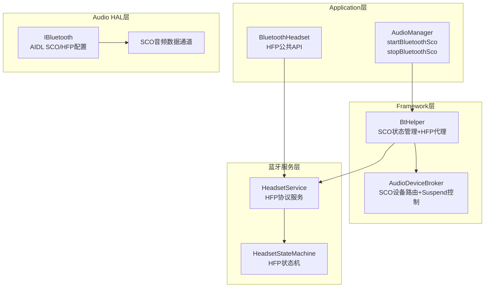
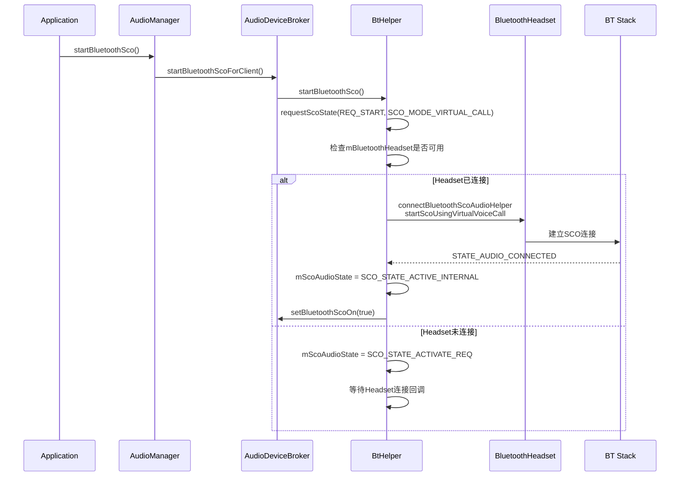
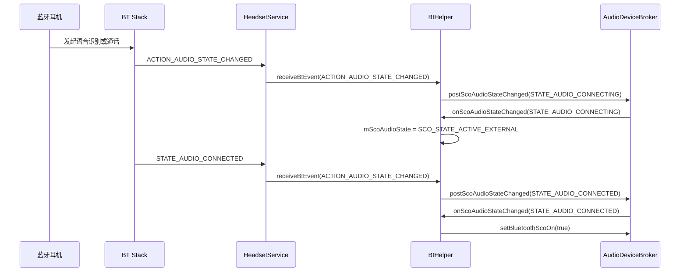
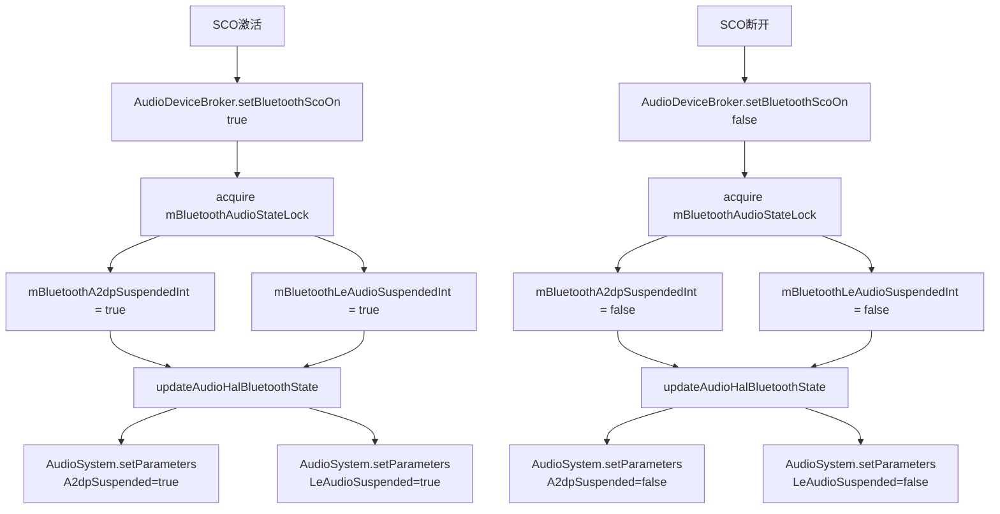
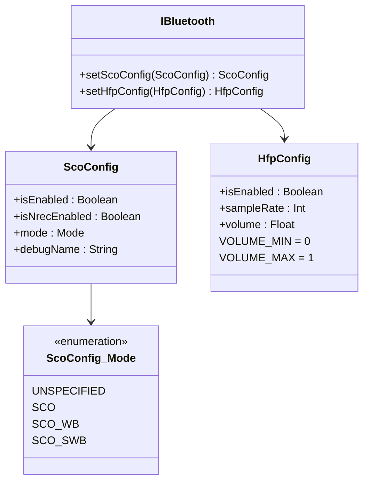
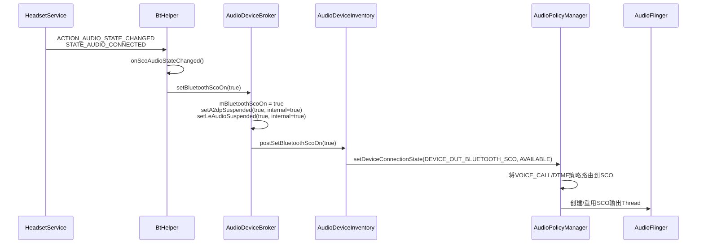

## 14.4 SCO/HFP — 通话语音

[← 上一个](14_14.3_LE_Audio-低功耗蓝牙音频.md) | [← 返回14章](README.md) | [返回导航](../README.md) | [下一个 →](14_14.5_Hearing_Aid-助听器.md)

---

### 14.4.1 SCO音频架构

SCO(Synchronous Connection-Oriented)是蓝牙通话语音的传输通道，HFP(Hands-Free Profile)建立在SCO之上管理通话状态。在AOSP14中，SCO音频由[`BtHelper`](frameworks/base/services/core/java/com/android/server/audio/BtHelper.java:65)和[`AudioDeviceBroker`](frameworks/base/services/core/java/com/android/server/audio/AudioDeviceBroker.java)协同管理。



**BtHelper SCO核心字段**（源码[`BtHelper.java:80-116`](frameworks/base/services/core/java/com/android/server/audio/BtHelper.java:80)）：

| 字段 | 类型 | 说明 |
|------|------|------|
| `mScoConnectionState` | int | SCO连接状态(由蓝牙Headset报告) |
| `mScoAudioState` | int | SCO音频状态机当前状态 |
| `mScoAudioMode` | int | SCO音频模式(VIRTUAL_CALL/VR) |
| `mBluetoothHeadset` | BluetoothHeadset | HFP Profile代理 |
| `mBluetoothHeadsetDevice` | BluetoothDevice | 当前HFP活动设备 |

### 14.4.2 SCO音频状态机

SCO音频有6个状态，由[`BtHelper.mScoAudioState`](frameworks/base/services/core/java/com/android/server/audio/BtHelper.java:85)管理：

```mermaid
stateDiagram-v2
    state INACTIVE {
        [*] --> INACTIVE
    }
    state ACTIVATE_REQ {
        [*] --> ACTIVATE_REQ
    }
    state ACTIVE_EXTERNAL {
        [*] --> ACTIVE_EXTERNAL
    }
    state ACTIVE_INTERNAL {
        [*] --> ACTIVE_INTERNAL
    }
    state DEACTIVATE_REQ {
        [*] --> DEACTIVATE_REQ
    }
    state DEACTIVATING {
        [*] --> DEACTIVATING
    }

    INACTIVE --> ACTIVATE_REQ: startScoAudio<br>Headset未连接
    INACTIVE --> ACTIVE_EXTERNAL: BT端发起VR或通话<br>STATE_AUDIO_CONNECTING
    INACTIVE --> ACTIVE_INTERNAL: AudioManager.startBluetoothSco<br>Headset已连接
    ACTIVATE_REQ --> ACTIVE_INTERNAL: Headset连接完成<br>connectBluetoothScoAudioHelper
    ACTIVE_EXTERNAL --> DEACTIVATING: BT端停止SCO
    ACTIVE_INTERNAL --> DEACTIVATING: stopBluetoothSco<br>或stopScoAudio
    DEACTIVATING --> INACTIVE: STATE_AUDIO_DISCONNECTED
    DEACTIVATING --> ACTIVATE_REQ: 有新的SCO请求排队
    ACTIVE_INTERNAL --> DEACTIVATE_REQ: 停止请求中<br>Headset未连接
```

**SCO状态常量**（源码[`BtHelper.java:92-103`](frameworks/base/services/core/java/com/android/server/audio/BtHelper.java:92)）：

| 常量 | 值 | 说明 |
|------|------|------|
| `SCO_STATE_INACTIVE` | 0 | SCO未激活 |
| `SCO_STATE_ACTIVATE_REQ` | 1 | SCO激活请求等待Headset服务连接 |
| `SCO_STATE_ACTIVE_EXTERNAL` | 2 | SCO由BT端激活(语音识别或通话) |
| `SCO_STATE_ACTIVE_INTERNAL` | 3 | SCO由AudioManager API激活 |
| `SCO_STATE_DEACTIVATE_REQ` | 4 | SCO去激活请求等待Headset服务连接 |
| `SCO_STATE_DEACTIVATING` | 5 | SCO去激活进行中，等待BT意图 |

### 14.4.3 SCO激活流程详解

#### 内部激活(App发起)

当App调用`AudioManager.startBluetoothSco()`时：



#### 外部激活(BT端发起)

当蓝牙耳机端发起语音识别或通话时：



### 14.4.4 onScoAudioStateChanged核心逻辑

[`onScoAudioStateChanged()`](frameworks/base/services/core/java/com/android/server/audio/BtHelper.java:284)是SCO状态变化的核心处理方法：

**STATE_AUDIO_CONNECTED处理**（源码[`BtHelper.java:288-298`](frameworks/base/services/core/java/com/android/server/audio/BtHelper.java:288)）：

```java
case BluetoothHeadset.STATE_AUDIO_CONNECTED:
    scoAudioState = AudioManager.SCO_AUDIO_STATE_CONNECTED;
    if (mScoAudioState != SCO_STATE_ACTIVE_INTERNAL
            && mScoAudioState != SCO_STATE_DEACTIVATE_REQ) {
        mScoAudioState = SCO_STATE_ACTIVE_EXTERNAL;  // 外部激活
    } else if (mDeviceBroker.isBluetoothScoRequested()) {
        broadcast = true;  // 内部请求已确认，广播状态
    }
    mDeviceBroker.setBluetoothScoOn(true, "BtHelper.receiveBtEvent");
    break;
```

**STATE_AUDIO_DISCONNECTED处理**（源码[`BtHelper.java:299-321`](frameworks/base/services/core/java/com/android/server/audio/BtHelper.java:299)）：

```java
case BluetoothHeadset.STATE_AUDIO_DISCONNECTED:
    mDeviceBroker.setBluetoothScoOn(false, "BtHelper.receiveBtEvent");
    // 检查是否有排队的新SCO请求
    if (mScoAudioState == SCO_STATE_ACTIVATE_REQ) {
        // 立即重新连接SCO
        if (connectBluetoothScoAudioHelper(...)) {
            mScoAudioState = SCO_STATE_ACTIVE_INTERNAL;
            broadcast = true;
            break;
        }
    }
    mScoAudioState = SCO_STATE_INACTIVE;
    break;
```

### 14.4.5 SCO音频模式

SCO支持三种音频模式（源码[`BtHelper.java:106-112`](frameworks/base/services/core/java/com/android/server/audio/BtHelper.java:106)）：

| 常量 | 值 | 说明 |
|------|------|------|
| `SCO_MODE_UNDEFINED` | -1 | 模式未定义 |
| `SCO_MODE_VIRTUAL_CALL` | 0 | 虚拟语音呼叫模式(BluetoothHeadset.startScoUsingVirtualVoiceCall) |
| `SCO_MODE_VR` | 2 | 语音识别模式(BluetoothHeadset.startVoiceRecognition) |

模式选择逻辑：
- App target API < JB MR2 → `SCO_MODE_VIRTUAL_CALL`
- App target API >= JB MR2 → `SCO_MODE_VIRTUAL_CALL`(AudioManager.startBluetoothSco)
- 语音识别场景 → `SCO_MODE_VR`

### 14.4.6 SCO与A2DP/LE Audio互斥机制

SCO激活时会自动Suspend A2DP和LE Audio，这是通过[`updateAudioHalBluetoothState()`](frameworks/base/services/core/java/com/android/server/audio/AudioDeviceBroker.java:934)实现的：



**互斥关系总结**：

| 事件 | A2DP状态 | LE Audio状态 | SCO状态 |
|------|----------|-------------|---------|
| SCO激活 | Suspended | Suspended | Active |
| SCO断开 | Resumed | Resumed | Inactive |
| A2DP活跃 | Active | 可并行或Suspended | 非活跃 |
| LE Audio活跃 | 可并行或Suspended | Active | 非活跃 |

### 14.4.7 IBluetooth SCO/HFP配置(AIDL)

AOSP14通过AIDL接口[`IBluetooth`](hardware/interfaces/audio/aidl/android/hardware/audio/core/IBluetooth.aidl)提供SCO和HFP的运行时配置：



**SCO模式说明**：

| 模式 | 带宽 | 采样率 | 编解码 | 音质 |
|------|------|--------|--------|------|
| SCO (NB) | 窄带 | 8kHz | CVSD | 基本通话质量 |
| SCO_WB (WB) | 宽带 | 16kHz | mSBC | 改善通话质量 |
| SCO_SWB (SWB) | 超宽带 | 32kHz | LC3 | 高清通话质量 |

**HfpConfig参数**：

| 参数 | 范围 | 说明 |
|------|------|------|
| `isEnabled` | boolean | HFP Offload开关 |
| `sampleRate` | 8000/16000/32000 | 采样率 |
| `volume` | 0.0-1.0 | HFP音量(归一化浮点) |

### 14.4.8 SCO音频设备类型

SCO在Audio系统中映射为多种设备类型：

| 设备类型 | 说明 | 使用场景 |
|----------|------|----------|
| DEVICE_OUT_BLUETOOTH_SCO | SCO输出 | 通话语音输出到蓝牙耳机 |
| DEVICE_OUT_BLUETOOTH_SCO_HEADSET | SCO耳机输出 | 蓝牙耳机通话 |
| DEVICE_OUT_BLUETOOTH_SCO_CARKIT | SCO车载输出 | 车载免提通话 |
| DEVICE_IN_BLUETOOTH_SCO_HEADSET | SCO麦克风输入 | 蓝牙耳机麦克风录音 |

### 14.4.9 SCO连接→Audio路由流程



### 14.4.10 AAOS车载SCO场景

| 场景 | 实现方式 | 关键点 |
|------|----------|--------|
| 车载免提通话 | SCO_WB/SCO_SWB模式 | DEVICE_OUT_BLUETOOTH_SCO_CARKIT |
| 语音识别 | SCO_MODE_VR模式 | startVoiceRecognition() |
| 通话时自动暂停媒体 | SCO激活→Suspend A2DP/LE Audio | updateAudioHalBluetoothState互斥 |
| 多麦克风阵列降噪 | HFP NREC配置 | ScoConfig.isNrecEnabled=true |
| 紧急通话优先 | SCO最高音频优先级 | AudioMode.IN_CALL强制SCO路由 |

### 14.4.11 SCO调试命令

| 命令 | 说明 |
|------|------|
| `dumpsys audio | grep -i sco` | SCO音频状态 |
| `dumpsys audio | grep BluetoothScoOn` | SCO是否激活 |
| `dumpsys bluetooth_headset` | HFP服务状态 |
| `logcat -s AS.BtHelper | grep SCO` | BtHelper SCO日志 |
| `logcat -s AudioService | grep -i sco` | AudioService SCO事件 |
| `dumpsys audio | grep Suspended` | A2DP/LE Audio Suspend状态 |

---

[← 上一个](14_14.3_LE_Audio-低功耗蓝牙音频.md) | [← 返回14章](README.md) | [返回导航](../README.md) | [下一个 →](14_14.5_Hearing_Aid-助听器.md)