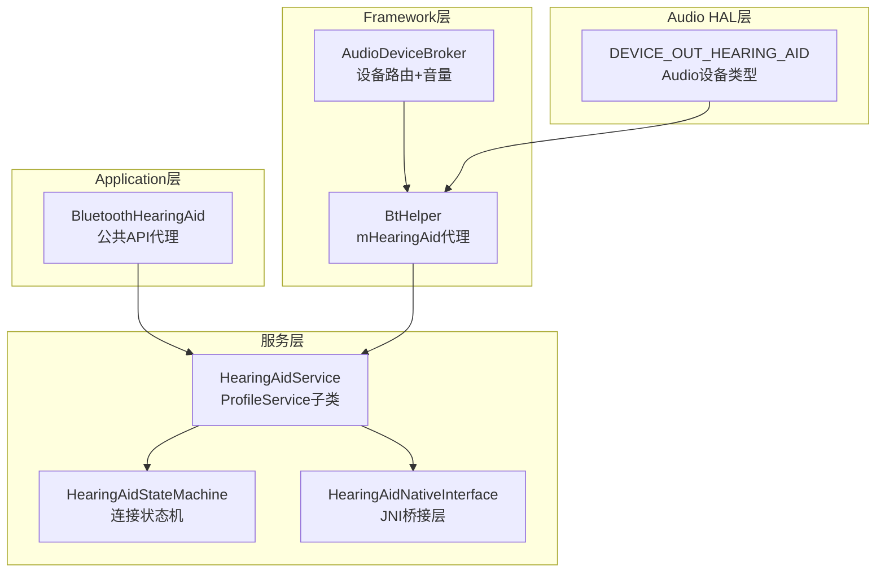
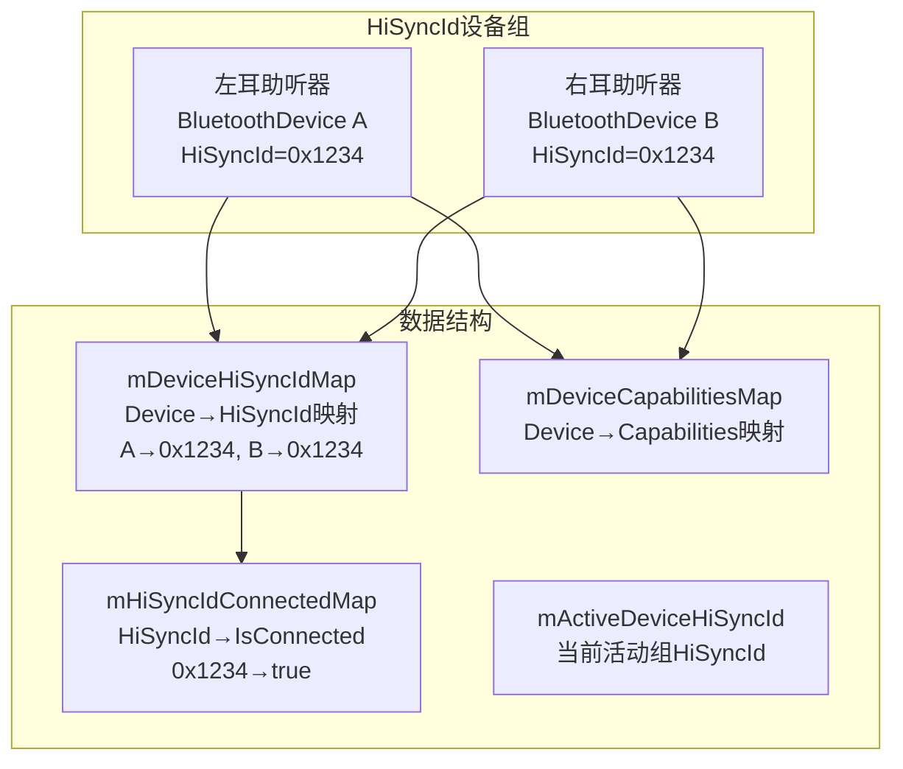
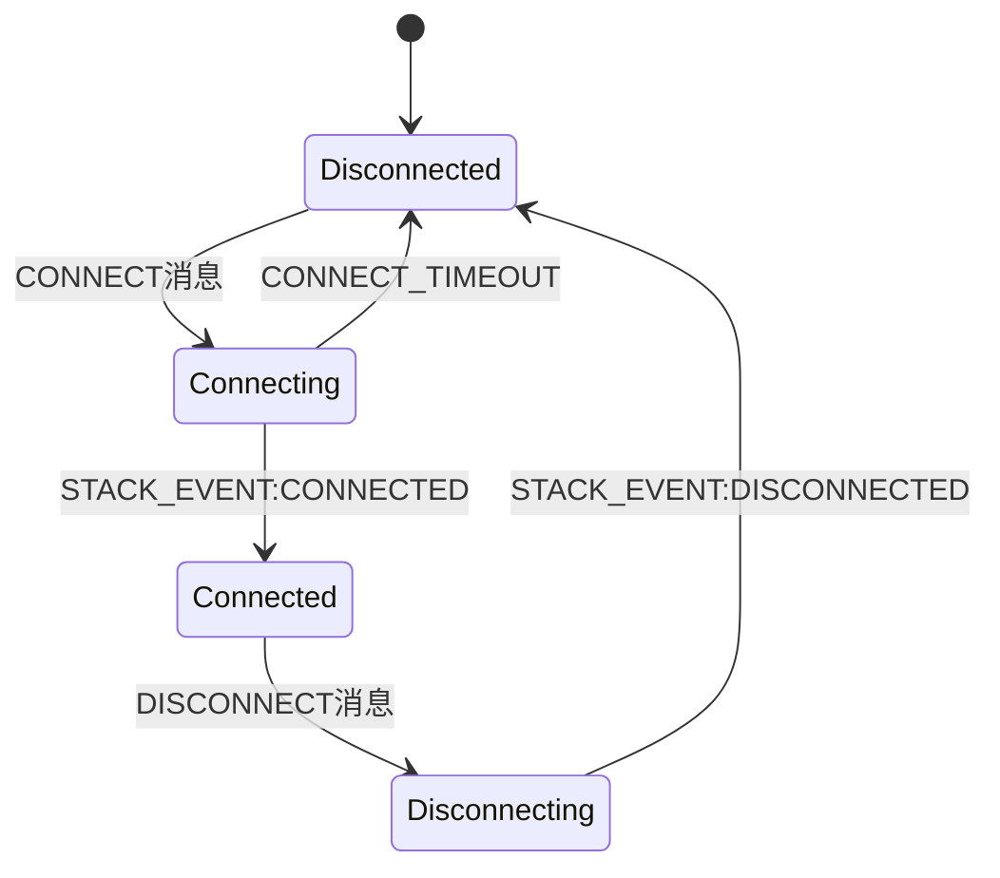
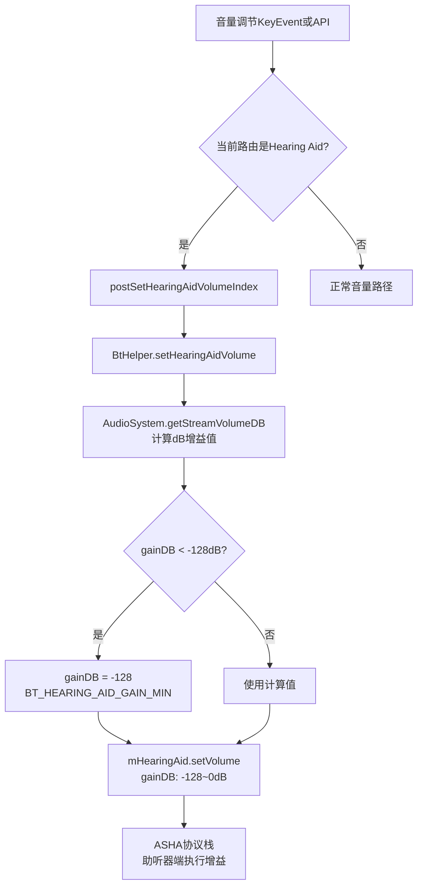
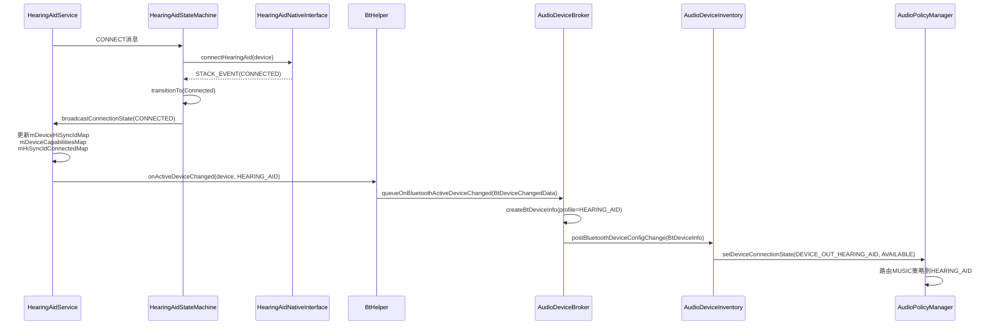
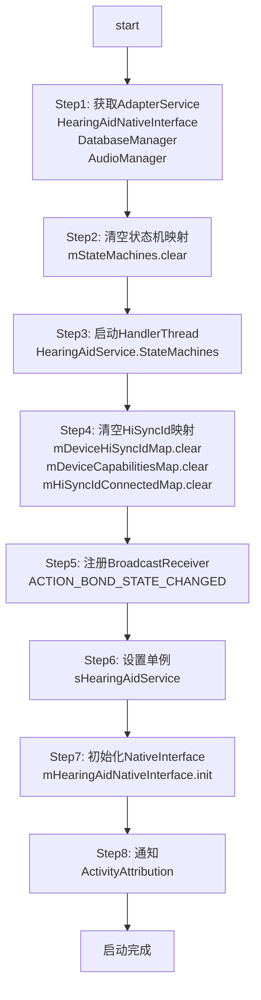
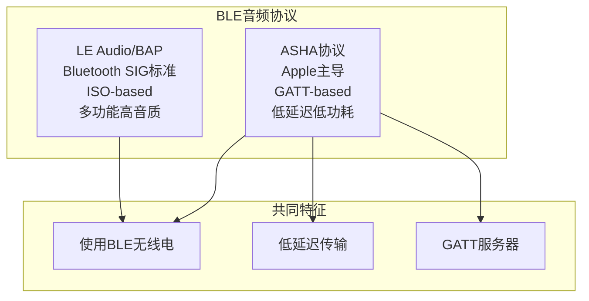
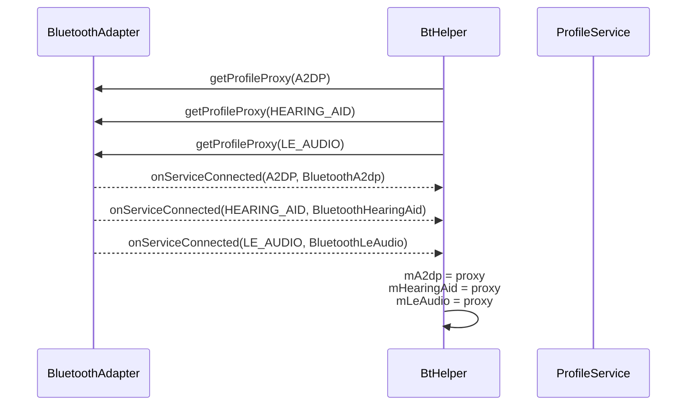

## 14.5 Hearing Aid — 助听器

[← 上一个](14_14.4_SCOHFP-通话语音.md) | [← 返回14章](README.md) | [返回导航](../README.md) | [下一个 →](14_14.6_蓝牙音频设备与AudioDeviceBroker交互.md)

---

### 14.5.1 ASHA协议架构

Hearing Aid服务基于ASHA(Audio Streaming for Hearing Aids)协议实现，由[`HearingAidService`](packages/modules/Bluetooth/android/app/src/com/android/bluetooth/hearingaid/HearingAidService.java:69)管理。ASHA是苹果主导的蓝牙低功耗助听器音频协议，Google在AOSP中提供了Central(中心/手机端)实现。



**HearingAidService核心字段**（源码[`HearingAidService.java:69-106`](packages/modules/Bluetooth/android/app/src/com/android/bluetooth/hearingaid/HearingAidService.java:69)）：

| 字段 | 类型 | 说明 |
|------|------|------|
| `sHearingAidService` | HearingAidService | 静态单例 |
| `MAX_HEARING_AID_STATE_MACHINES` | int=10 | 最大助听器设备数 |
| `mAdapterService` | AdapterService | 蓝牙适配器服务 |
| `mHearingAidNativeInterface` | HearingAidNativeInterface | JNI桥接 |
| `mAudioManager` | AudioManager | 音频管理器 |
| `mActiveDevice` | BluetoothDevice | 当前活动助听器设备 |
| `mStateMachines` | Map(BluetoothDevice, HearingAidStateMachine) | 设备→状态机映射 |
| `mDeviceHiSyncIdMap` | Map(BluetoothDevice, Long) | 设备→HiSyncId映射 |
| `mDeviceCapabilitiesMap` | Map(BluetoothDevice, Integer) | 设备→能力映射 |
| `mHiSyncIdConnectedMap` | Map(Long, Boolean) | HiSyncId→连接状态映射 |
| `mActiveDeviceHiSyncId` | long | 活动设备的HiSyncId |

### 14.5.2 HiSyncId设备组管理

ASHA协议的核心概念是HiSyncId，用于将左右耳助听器配对为一个逻辑组：



**HiSyncId关键逻辑**：

| 场景 | 行为 |
|------|------|
| 左右耳配对 | 两者具有相同HiSyncId，可同时控制 |
| 单耳使用 | 只有一个设备活跃，HiSyncId仍有效 |
| 切换活动设备 | mActiveDeviceHiSyncId更新，同组设备同步切换 |
| 断开同组设备 | mHiSyncIdConnectedMap标记为false |

**HiSyncId特殊值**：`BluetoothHearingAid.HI_SYNC_ID_INVALID`表示设备不属于任何组。

### 14.5.3 HearingAidStateMachine状态机



与A2DP/LE Audio采用相同的四状态模型，但助听器场景更注重：
- 自动重连（配对后开机自动连接）
- 双耳同步（同一HiSyncId的设备同时连接/断开）

### 14.5.4 ASHA音量机制 — 增益dB

助听器使用dB增益值而非百分比音量，范围-128dB到0dB：



**BtHelper.setHearingAidVolume()实现**（源码[`BtHelper.java:392-420`](frameworks/base/services/core/java/com/android/server/audio/BtHelper.java:392)）：

```java
synchronized void setHearingAidVolume(int index, int streamType,
        boolean isHeadAidConnected) {
    if (mHearingAid == null) return;
    // 助听器期望-128dB到0dB范围的增益值
    int gainDB = (int) AudioSystem.getStreamVolumeDB(streamType, index / 10,
            AudioSystem.DEVICE_OUT_HEARING_AID);
    if (gainDB < BT_HEARING_AID_GAIN_MIN) {
        gainDB = BT_HEARING_AID_GAIN_MIN;  // -128
    }
    mHearingAid.setVolume(gainDB);
}
```

**音量范围对比**：

| Profile | 音量范围 | 单位 | 接口方法 |
|---------|----------|------|----------|
| A2DP (AVRCP) | 0-127 | 绝对音量 | mA2dp.setAvrcpAbsoluteVolume() |
| LE Audio (VCP) | 0-255 | 绝对音量 | mLeAudio.setVolume() |
| Hearing Aid (ASHA) | -128~0 | dB增益 | mHearingAid.setVolume() |
| HFP (SCO) | 0.0-1.0 | 归一化浮点 | IBluetooth.setHfpConfig() |

### 14.5.5 Hearing Aid连接→Audio路由流程



**createBtDeviceInfo中Hearing Aid映射**（源码[`AudioDeviceBroker.java:812-842`](frameworks/base/services/core/java/com/android/server/audio/AudioDeviceBroker.java:812)）：

| Profile | 设备类型 |
|---------|----------|
| HEARING_AID | DEVICE_OUT_HEARING_AID |

### 14.5.6 HearingAidService启动流程

[`HearingAidService.start()`](packages/modules/Bluetooth/android/app/src/com/android/bluetooth/hearingaid/HearingAidService.java:124)初始化：



**ASHA启用条件**（源码[`HearingAidService.java:107-109`](packages/modules/Bluetooth/android/app/src/com/android/bluetooth/hearingaid/HearingAidService.java:107)）：

```java
public static boolean isEnabled() {
    return BluetoothProperties.isProfileAshaCentralEnabled().orElse(true);
}
```

### 14.5.7 ASHA与LE Audio的关系

ASHA和LE Audio都使用BLE传输音频，但属于不同协议：



| 特性 | ASHA | LE Audio |
|------|------|----------|
| 主导方 | Apple | Bluetooth SIG |
| 传输通道 | GATT | ISO (CIS/BIS) |
| 编解码 | G.722 (Opus可选) | LC3 |
| 延迟 | 极低(适合助听器) | 低(适合多媒体) |
| 双向音频 | 不支持 | 支持(CIS双向) |
| 广播 | 不支持 | 支持(BIS) |
| 设备类型 | DEVICE_OUT_HEARING_AID | DEVICE_OUT_BLE_HEADSET |

### 14.5.8 BtHelper Profile代理管理

[`BtHelper`](frameworks/base/services/core/java/com/android/server/audio/BtHelper.java:65)通过`mBluetoothProfileServiceListener`管理所有蓝牙Profile代理的获取：



**disconnectAllBluetoothProfiles()**（源码[`BtHelper.java:434-441`](frameworks/base/services/core/java/com/android/server/audio/BtHelper.java:434)）：

```java
synchronized void disconnectAllBluetoothProfiles() {
    mDeviceBroker.postBtProfileDisconnected(BluetoothProfile.A2DP);
    mDeviceBroker.postBtProfileDisconnected(BluetoothProfile.A2DP_SINK);
    mDeviceBroker.postBtProfileDisconnected(BluetoothProfile.HEADSET);
    mDeviceBroker.postBtProfileDisconnected(BluetoothProfile.HEARING_AID);
    mDeviceBroker.postBtProfileDisconnected(BluetoothProfile.LE_AUDIO);
    mDeviceBroker.postBtProfileDisconnected(BluetoothProfile.LE_AUDIO_BROADCAST);
}
```

### 14.5.9 AAOS车载Hearing Aid场景

| 场景 | 实现方式 | 关键点 |
|------|----------|--------|
| 驾驶员助听器导航 | DEVICE_OUT_HEARING_AID路由 | 车载导航音频传到助听器 |
| 助听器+车载扬声器并行 | 双输出路由 | 助听器和Speaker同时播放 |
| 助听器音量独立调节 | dB增益模式 | -128~0dB范围，getStreamVolumeDB映射 |
| 听障辅助系统 | ASHA协议+车载麦克风 | 车载麦克风拾音→助听器播放 |

### 14.5.10 Hearing Aid调试命令

| 命令 | 说明 |
|------|------|
| `dumpsys bluetooth_hearing_aid` | HearingAid服务完整状态 |
| `dumpsys bluetooth_hearing_aid | grep HiSyncId` | HiSyncId设备组信息 |
| `dumpsys bluetooth_hearing_aid | grep ActiveDevice` | 活动助听器设备 |
| `dumpsys audio | grep HEARING_AID` | Audio系统中助听器路由 |
| `logcat -s HearingAidService HearingAidStateMachine` | 助听器日志 |
| `logcat -s AS.BtHelper | grep HearingAid` | BtHelper助听器音量日志 |

---

[← 上一个](14_14.4_SCOHFP-通话语音.md) | [← 返回14章](README.md) | [返回导航](../README.md) | [下一个 →](14_14.6_蓝牙音频设备与AudioDeviceBroker交互.md)