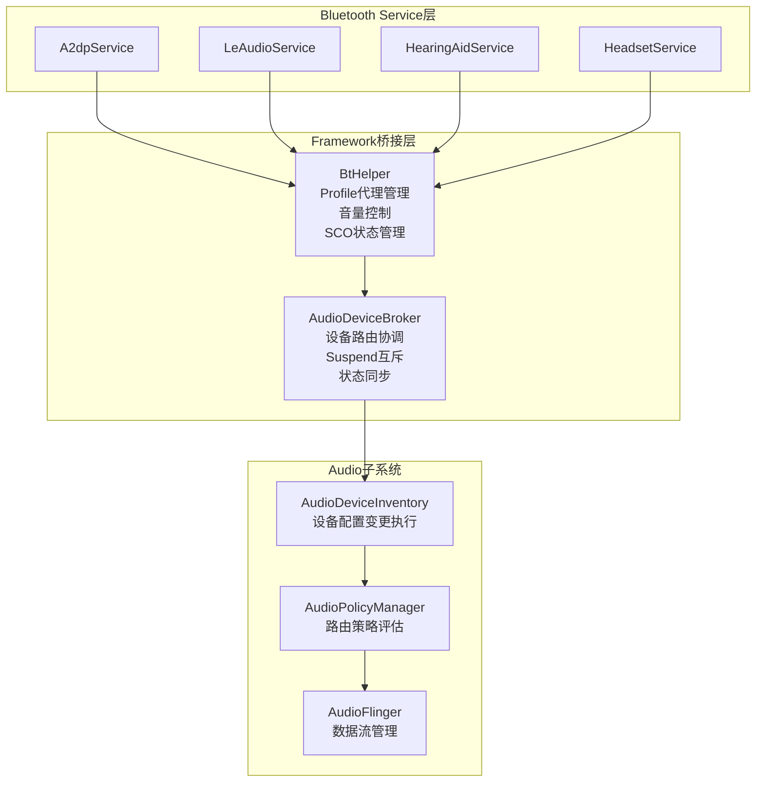
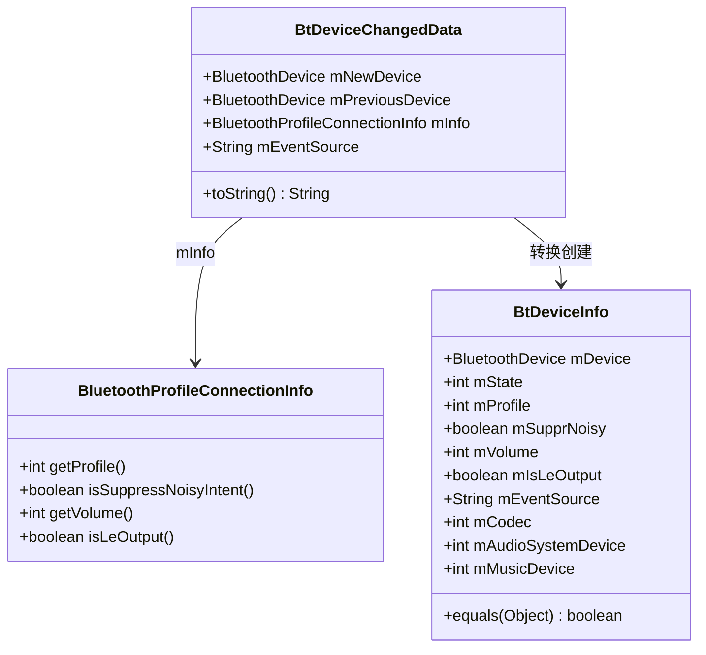
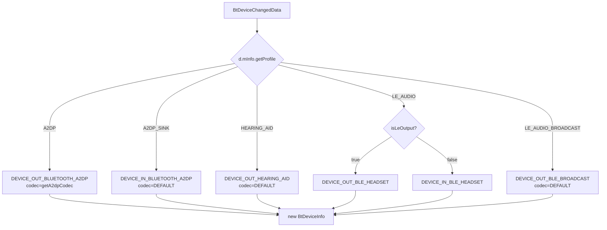
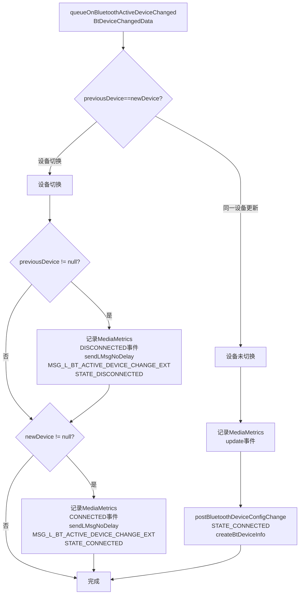
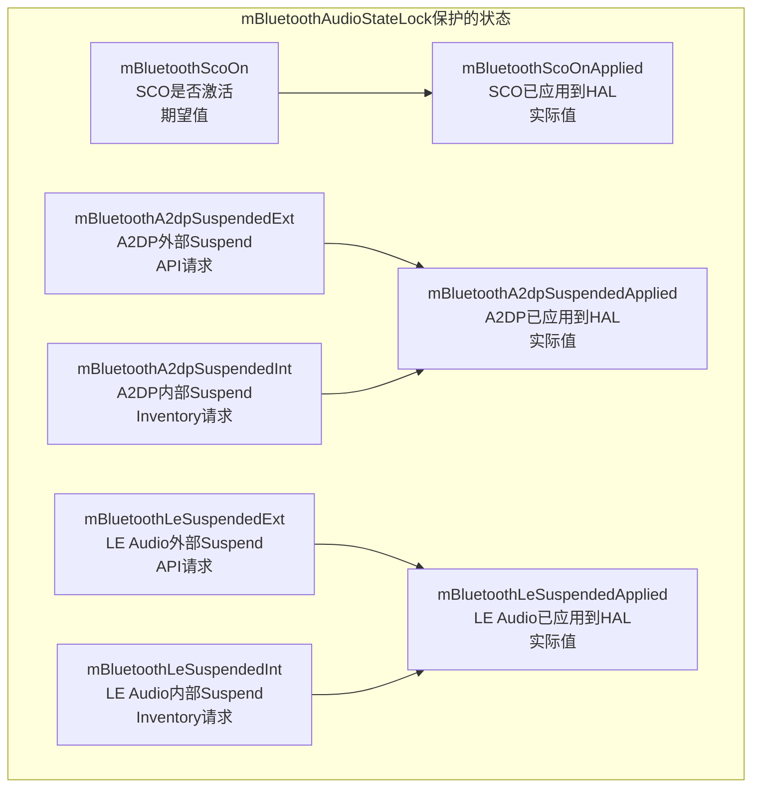
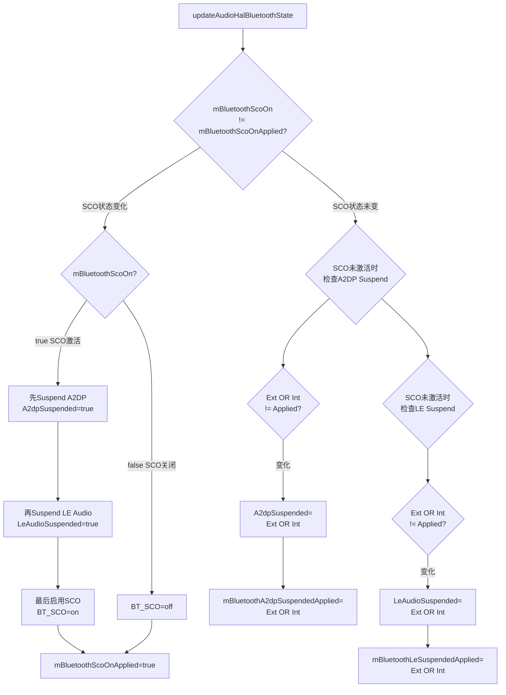
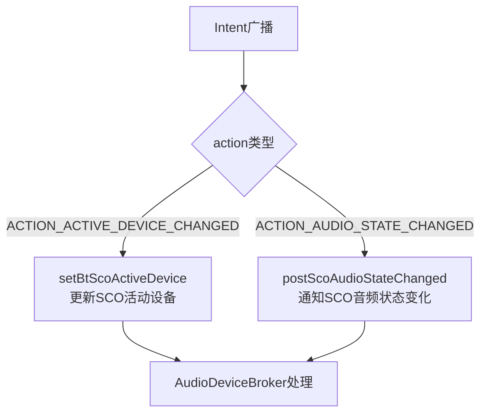
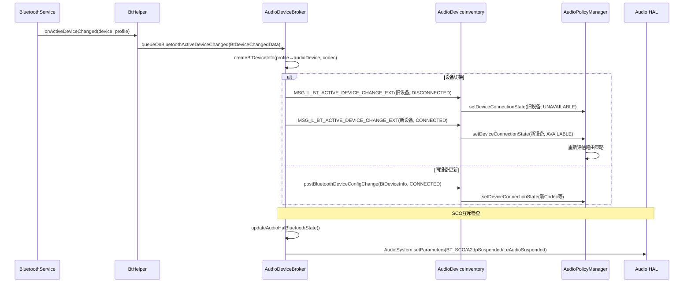

## 14.6 蓝牙音频设备与AudioDeviceBroker交互

[← 上一个](14_14.5_Hearing_Aid-助听器.md) | [← 返回14章](README.md) | [返回导航](../README.md) | [下一个 →](14_14.7_LE_Audio_Profile深度解析.md)

---

### 14.6.1 AudioDeviceBroker蓝牙交互架构

[`AudioDeviceBroker`](frameworks/base/services/core/java/com/android/server/audio/AudioDeviceBroker.java)是Audio Framework中蓝牙设备管理的核心枢纽，桥接Bluetooth Service和Audio Policy子系统：



### 14.6.2 BtDeviceChangedData数据结构

[`BtDeviceChangedData`](frameworks/base/services/core/java/com/android/server/audio/AudioDeviceBroker.java:704)封装蓝牙设备变化事件，由BtHelper产生并投递到AudioDeviceBroker：



**BtDeviceChangedData字段详解**（源码[704-725](frameworks/base/services/core/java/com/android/server/audio/AudioDeviceBroker.java:704)）：

| 字段 | 类型 | 说明 |
|------|------|------|
| `mNewDevice` | BluetoothDevice | 新活动设备（null=断开） |
| `mPreviousDevice` | BluetoothDevice | 前一活动设备（null=无旧设备） |
| `mInfo` | BluetoothProfileConnectionInfo | Profile连接元信息 |
| `mEventSource` | String | 事件来源标识，调试用 |

### 14.6.3 BtDeviceInfo完整解析

[`BtDeviceInfo`](frameworks/base/services/core/java/com/android/server/audio/AudioDeviceBroker.java:727)是AudioDeviceBroker内部蓝牙设备信息的标准载体，有4个构造函数对应不同场景：

| 构造函数 | 使用场景 | 关键参数 |
|----------|----------|----------|
| `BtDeviceInfo(BtDeviceChangedData, device, state, audioDevice, codec)` | 正常设备变化 | 全参数填充 |
| `BtDeviceInfo(device, profile)` | 消息队列查找/去重 | 仅device+profile |
| `BtDeviceInfo(device, profile, state, musicDevice, audioSystemDevice)` | 配置变更失败回退 | 保留musicDevice |
| `BtDeviceInfo(BtDeviceInfo src, int state)` | 状态覆盖（如DISCONNECTED） | 复制源信息+新状态 |

**BtDeviceInfo关键字段**（源码[727-810](frameworks/base/services/core/java/com/android/server/audio/AudioDeviceBroker.java:727)）：

| 字段 | 类型 | 说明 |
|------|------|------|
| `mDevice` | BluetoothDevice | 蓝牙设备地址 |
| `mState` | int | 连接状态(CONNECTED/DISCONNECTED) |
| `mProfile` | int(A2DP/HEARING_AID/LE_AUDIO等) | 蓝牙Profile类型 |
| `mSupprNoisy` | boolean | 是否抑制AUDIO_BECOMING_NOISY广播 |
| `mVolume` | int | 连接时的初始音量 |
| `mIsLeOutput` | boolean | LE Audio是否为输出方向 |
| `mCodec` | int(AudioFormatNativeEnumForBtCodec) | A2DP Codec格式 |
| `mAudioSystemDevice` | int | 映射到AudioSystem的设备类型 |
| `mMusicDevice` | int | 音乐流当前使用的设备 |

**equals()规则**（源码[797-809](frameworks/base/services/core/java/com/android/server/audio/AudioDeviceBroker.java:797)）：

```java
// 仅比较mProfile和mDevice，用于消息队列去重
return mProfile == ((BtDeviceInfo) o).mProfile
    && mDevice.equals(((BtDeviceInfo) o).mDevice);
```

### 14.6.4 createBtDeviceInfo — Profile到AudioDevice映射

[`createBtDeviceInfo()`](frameworks/base/services/core/java/com/android/server/audio/AudioDeviceBroker.java:812)将蓝牙Profile类型映射为AudioSystem设备类型：



**Profile→AudioSystem设备映射表**（源码[816-841](frameworks/base/services/core/java/com/android/server/audio/AudioDeviceBroker.java:816)）：

| Profile | 条件 | AudioSystem设备 | Codec |
|---------|------|----------------|-------|
| A2DP_SINK | - | DEVICE_IN_BLUETOOTH_A2DP | DEFAULT |
| A2DP | - | DEVICE_OUT_BLUETOOTH_A2DP | getA2dpCodec() |
| HEARING_AID | - | DEVICE_OUT_HEARING_AID | DEFAULT |
| LE_AUDIO | isLeOutput=true | DEVICE_OUT_BLE_HEADSET | DEFAULT |
| LE_AUDIO | isLeOutput=false | DEVICE_IN_BLE_HEADSET | DEFAULT |
| LE_AUDIO_BROADCAST | - | DEVICE_OUT_BLE_BROADCAST | DEFAULT |

**getA2dpCodec()调用链**（源码[`BtHelper.java:241-260`](frameworks/base/services/core/java/com/android/server/audio/BtHelper.java:241)）：

```java
synchronized int getA2dpCodec(BluetoothDevice device) {
    if (mA2dp == null) return AudioSystem.AUDIO_FORMAT_DEFAULT;
    BluetoothCodecStatus btCodecStatus = mA2dp.getCodecStatus(device);
    if (btCodecStatus == null) return AudioSystem.AUDIO_FORMAT_DEFAULT;
    BluetoothCodecConfig btCodecConfig = btCodecStatus.getCodecConfig();
    if (btCodecConfig == null) return AudioSystem.AUDIO_FORMAT_DEFAULT;
    return AudioSystem.bluetoothCodecToAudioFormat(btCodecConfig.getCodecType());
}
```

### 14.6.5 queueOnBluetoothActiveDeviceChanged核心流程

[`queueOnBluetoothActiveDeviceChanged()`](frameworks/base/services/core/java/com/android/server/audio/AudioDeviceBroker.java:860)处理蓝牙活动设备变化，决定设备切换或更新：



**关键行为**（源码[860-890](frameworks/base/services/core/java/com/android/server/audio/AudioDeviceBroker.java:860)）：

| 场景 | previousDevice | newDevice | 行为 |
|------|---------------|-----------|------|
| 首次连接 | null | deviceA | 连接deviceA |
| 设备切换 | deviceA | deviceB | 断开deviceA→连接deviceB |
| 断开连接 | deviceA | null | 断开deviceA |
| 同设备更新 | deviceA | deviceA | 仅更新deviceA状态 |
| Codec变化 | deviceA | deviceA | 同设备更新，createBtDeviceInfo重新获取codec |

**消息发送策略**：使用`SENDMSG_QUEUE`模式，确保蓝牙设备变更消息按顺序处理，不会丢失。

### 14.6.6 mBluetoothAudioStateLock保护的6个状态变量

[`mBluetoothAudioStateLock`](frameworks/base/services/core/java/com/android/server/audio/AudioDeviceBroker.java:893)保护的6个状态变量构成了蓝牙音频Suspend/SCO互斥机制的核心：



**状态变量详解**（源码[892-921](frameworks/base/services/core/java/com/android/server/audio/AudioDeviceBroker.java:892)）：

| 变量 | 类型 | 初始值 | 说明 |
|------|------|--------|------|
| `mBluetoothScoOn` | boolean | false | SCO当前期望状态 |
| `mBluetoothScoOnApplied` | boolean | false | SCO已应用到HAL的值 |
| `mBluetoothA2dpSuspendedExt` | boolean | false | 外部API请求的A2DP Suspend |
| `mBluetoothA2dpSuspendedInt` | boolean | false | 内部Inventory请求的A2DP Suspend |
| `mBluetoothA2dpSuspendedApplied` | boolean | false | A2DP Suspend已应用到HAL的值 |
| `mBluetoothLeSuspendedExt` | boolean | false | 外部API请求的LE Suspend |
| `mBluetoothLeSuspendedInt` | boolean | false | 内部Inventory请求的LE Suspend |
| `mBluetoothLeSuspendedApplied` | boolean | false | LE Suspend已应用到HAL的值 |

### 14.6.7 updateAudioHalBluetoothState — 状态机核心

[`updateAudioHalBluetoothState()`](frameworks/base/services/core/java/com/android/server/audio/AudioDeviceBroker.java:934)是蓝牙音频状态同步到Audio HAL的核心方法，实现了SCO优先级最高的互斥逻辑：



**互斥优先级规则**（源码[934-991](frameworks/base/services/core/java/com/android/server/audio/AudioDeviceBroker.java:934)）：

| 优先级 | 状态 | 效果 |
|--------|------|------|
| 1(最高) | SCO激活 | 强制A2DP Suspend + LE Suspend + BT_SCO=on |
| 2 | SCO未激活 + A2DP Suspend | A2dpSuspended=true, 仅影响A2DP路由 |
| 3 | SCO未激活 + LE Suspend | LeAudioSuspended=true, 仅影响LE路由 |
| 4(最低) | 无Suspend | 所有Profile正常路由 |

**AudioSystem.setParameters()参数表**：

| 参数 | 值 | 作用 |
|------|-----|------|
| `BT_SCO` | on/off | 通知HAL SCO音频状态 |
| `A2dpSuspended` | true/false | 通知HAL A2DP是否被暂停 |
| `LeAudioSuspended` | true/false | 通知HAL LE Audio是否被暂停 |

### 14.6.8 initAudioHalBluetoothState初始化

[`initAudioHalBluetoothState()`](frameworks/base/services/core/java/com/android/server/audio/AudioDeviceBroker.java:923)在AudioService启动时初始化HAL蓝牙状态：

```java
private void initAudioHalBluetoothState() {
    synchronized (mBluetoothAudioStateLock) {
        mBluetoothScoOnApplied = false;
        AudioSystem.setParameters("BT_SCO=off");
        mBluetoothA2dpSuspendedApplied = false;
        AudioSystem.setParameters("A2dpSuspended=false");
        mBluetoothLeSuspendedApplied = false;
        AudioSystem.setParameters("LeAudioSuspended=false");
    }
}
```

确保Audio HAL在启动时处于已知的默认状态：SCO关闭、A2DP未暂停、LE Audio未暂停。

### 14.6.9 Suspend API入口

**setA2dpSuspended**（源码[1004-1018](frameworks/base/services/core/java/com/android/server/audio/AudioDeviceBroker.java:1004)）：

```java
void setA2dpSuspended(boolean enable, boolean internal, String eventSource) {
    synchronized (mBluetoothAudioStateLock) {
        if (internal) {
            mBluetoothA2dpSuspendedInt = enable;  // 内部Suspend
        } else {
            mBluetoothA2dpSuspendedExt = enable;  // 外部API Suspend
        }
        updateAudioHalBluetoothState();  // 立即同步到HAL
    }
}
```

**setLeAudioSuspended**（源码[1034-1048](frameworks/base/services/core/java/com/android/server/audio/AudioDeviceBroker.java:1034)）：

```java
void setLeAudioSuspended(boolean enable, boolean internal, String eventSource) {
    synchronized (mBluetoothAudioStateLock) {
        if (internal) {
            mBluetoothLeSuspendedInt = enable;
        } else {
            mBluetoothLeSuspendedExt = enable;
        }
        updateAudioHalBluetoothState();
    }
}
```

**Suspend来源对比**：

| 来源 | internal值 | 触发场景 |
|------|-----------|----------|
| AudioManager.setA2dpSuspended() | false | 应用显式请求暂停 |
| AudioDeviceInventory内部逻辑 | true | SCO激活时自动暂停A2DP |
| AudioManager.setLeAudioSuspended() | false | 应用显式请求暂停 |
| AudioDeviceInventory内部逻辑 | true | SCO激活时自动暂停LE Audio |

### 14.6.10 蓝牙音量消息投递

AudioDeviceBroker通过Handler消息机制投递蓝牙音量命令：

| 方法 | 消息类型 | 参数 | 目标 |
|------|----------|------|------|
| `postSetAvrcpAbsoluteVolumeIndex(index)` | MSG_I_SET_AVRCP_ABSOLUTE_VOLUME | index(0-127) | BtHelper→mA2dp |
| `postSetHearingAidVolumeIndex(index, streamType)` | MSG_II_SET_HEARING_AID_VOLUME | index, streamType | BtHelper→mHearingAid |
| `postSetLeAudioVolumeIndex(index, maxIndex, streamType)` | MSG_II_SET_LE_AUDIO_OUT_VOLUME | BleVolumeInfo | BtHelper→mLeAudio |

**消息替换策略**：

| 消息 | 替换策略 | 原因 |
|------|----------|------|
| AVRCP音量 | SENDMSG_REPLACE | 只需最新音量值 |
| Hearing Aid音量 | SENDMSG_REPLACE | 只需最新音量值 |
| LE Audio音量 | SENDMSG_REPLACE | 只需最新音量值 |
| 设备变更 | SENDMSG_QUEUE | 必须按顺序处理 |

### 14.6.11 SCO通信设备管理

[`startBluetoothScoForClient()`](frameworks/base/services/core/java/com/android/server/audio/AudioDeviceBroker.java:1110)封装SCO启动请求：

```java
void startBluetoothScoForClient(IBinder cb, int pid, int scoAudioMode, String eventSource) {
    postSetCommunicationDeviceForClient(new CommunicationDeviceInfo(
        cb, pid,
        new AudioDeviceAttributes(AudioSystem.DEVICE_OUT_BLUETOOTH_SCO, ""),
        true,  // isOn=true
        scoAudioMode,  // SCO_MODE_VIRTUAL_CALL or SCO_MODE_VR
        eventSource, false));
}
```

[`stopBluetoothScoForClient()`](frameworks/base/services/core/java/com/android/server/audio/AudioDeviceBroker.java:1121)封装SCO停止请求：

```java
void stopBluetoothScoForClient(IBinder cb, int pid, String eventSource) {
    postSetCommunicationDeviceForClient(new CommunicationDeviceInfo(
        cb, pid,
        new AudioDeviceAttributes(AudioSystem.DEVICE_OUT_BLUETOOTH_SCO, ""),
        false,  // isOn=false
        BtHelper.SCO_MODE_UNDEFINED,
        eventSource, false));
}
```

### 14.6.12 BtHelper事件接收

[`BtHelper.receiveBtEvent()`](frameworks/base/services/core/java/com/android/server/audio/BtHelper.java:264)处理蓝牙广播事件：



### 14.6.13 蓝牙设备变化完整序列图



### 14.6.14 AAOS车载场景

| 场景 | AudioDeviceBroker行为 | 关键参数 |
|------|----------------------|----------|
| 车载蓝牙耳机连接 | A2DP→DEVICE_OUT_BLUETOOTH_A2DP路由 | codec=LDAC/aptX HD |
| 车载蓝牙通话 | SCO激活→自动Suspend A2DP/LE | BT_SCO=on |
| LE Audio车载耳机 | LE→DEVICE_OUT_BLE_HEADSET路由 | isLeOutput=true |
| 助听器导航 | HA→DEVICE_OUT_HEARING_AID路由 | 增益dB模式 |
| 多乘客广播音频 | BROADCAST→DEVICE_OUT_BLE_BROADCAST | Auracast |
| 通话中切媒体 | SCO→A2DP切换，Suspend互斥 | updateAudioHalBluetoothState |

### 14.6.15 调试命令

| 命令 | 说明 |
|------|------|
| `dumpsys audio | grep -A5 Bluetooth` | AudioService蓝牙设备状态 |
| `dumpsys audio | grep BtDeviceInfo` | BtDeviceInfo消息队列 |
| `dumpsys audio | grep mBluetoothScoOn` | SCO状态 |
| `dumpsys audio | grep A2dpSuspended` | A2DP Suspend状态 |
| `dumpsys audio | grep LeAudioSuspended` | LE Audio Suspend状态 |
| `logcat -s AS.AudioDeviceBroker | grep BT` | 蓝牙设备变更日志 |
| `logcat -s AS.AudioDeviceBroker | grep updateAudioHal` | HAL状态同步日志 |

---

[← 上一个](14_14.5_Hearing_Aid-助听器.md) | [← 返回14章](README.md) | [返回导航](../README.md) | [下一个 →](14_14.7_LE_Audio_Profile深度解析.md)