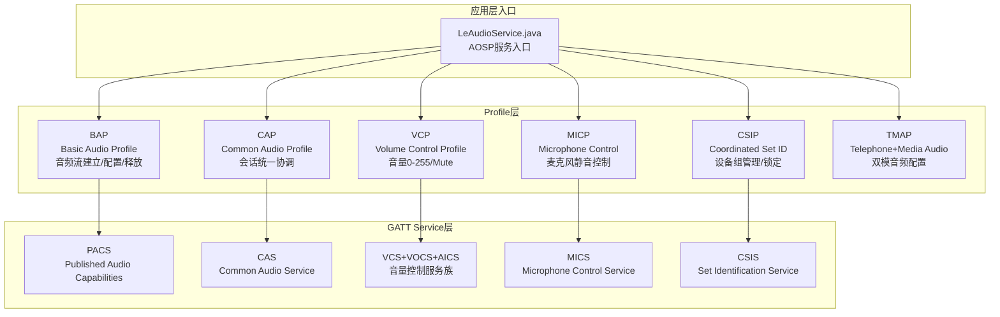
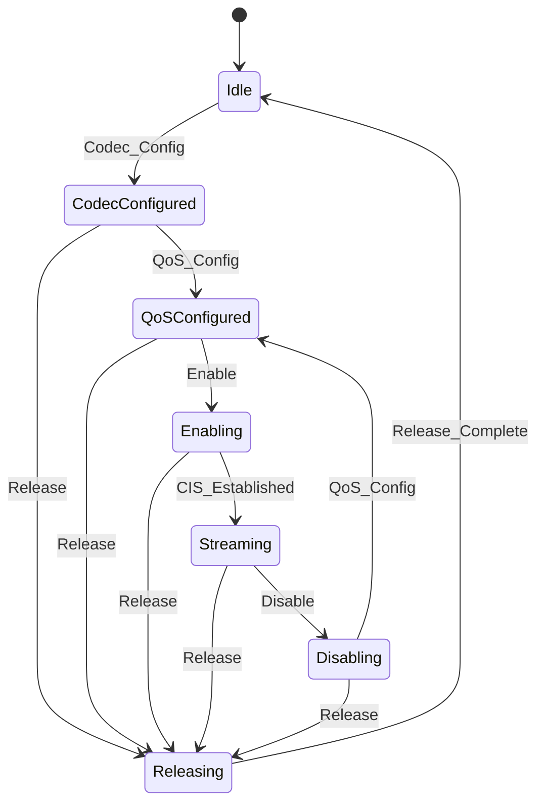
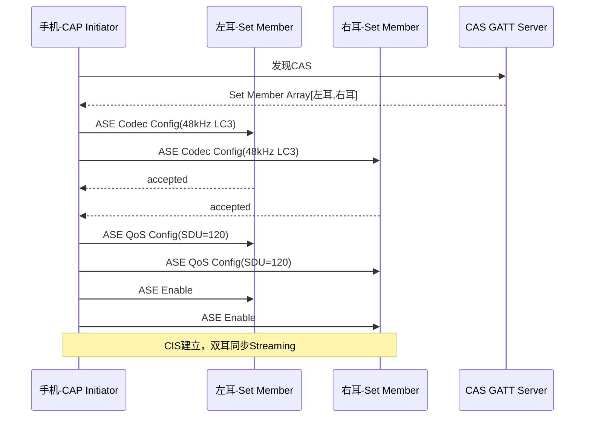
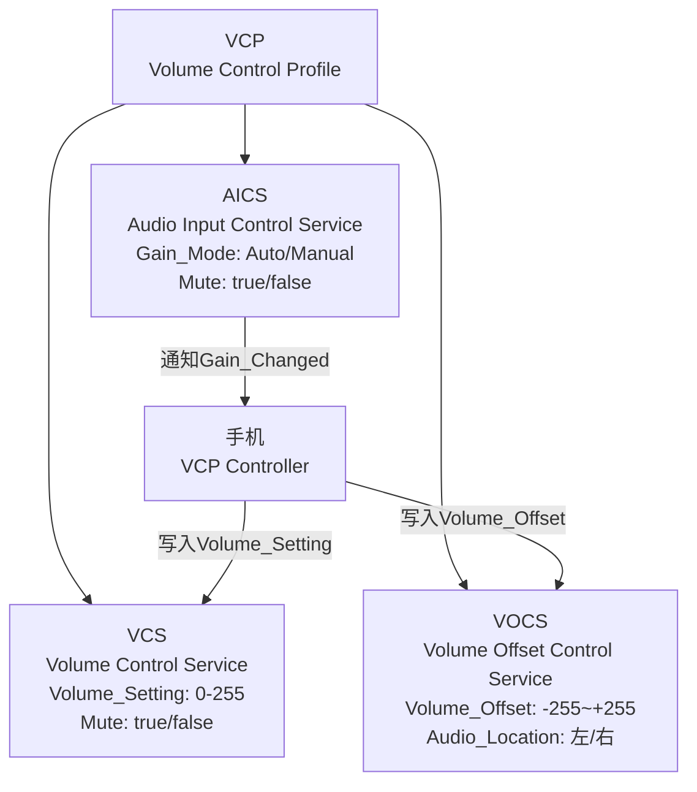
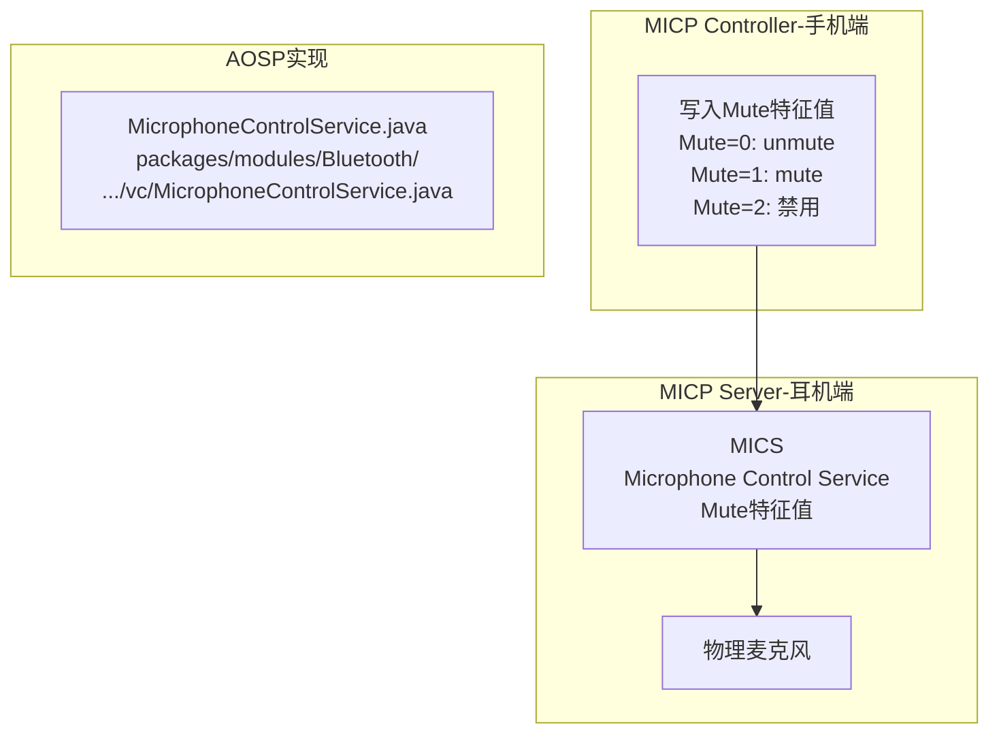
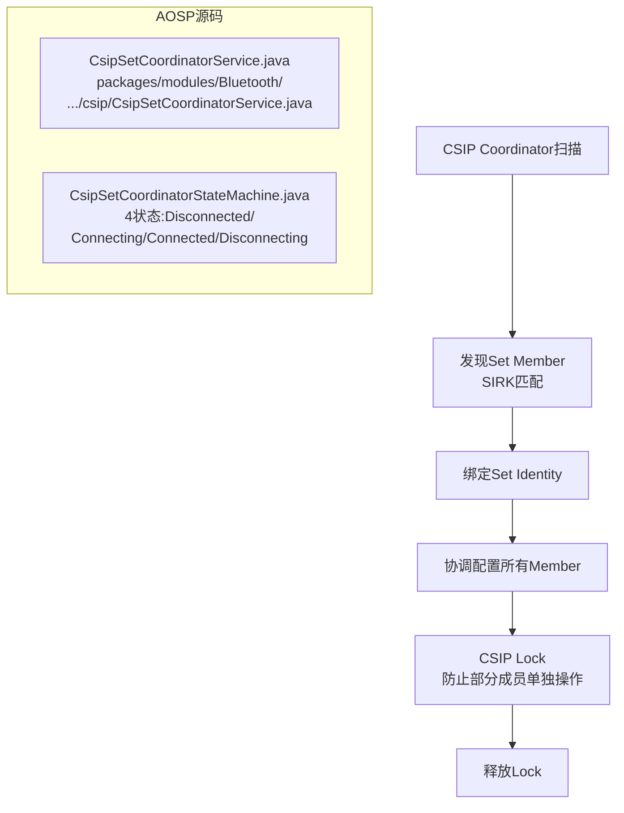
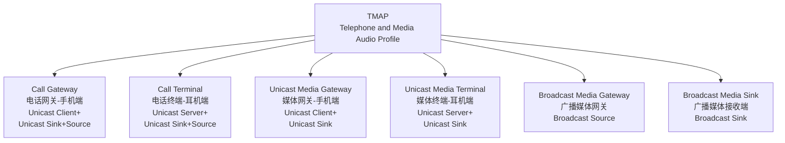
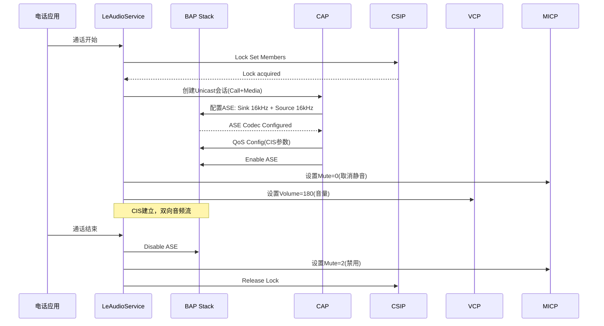
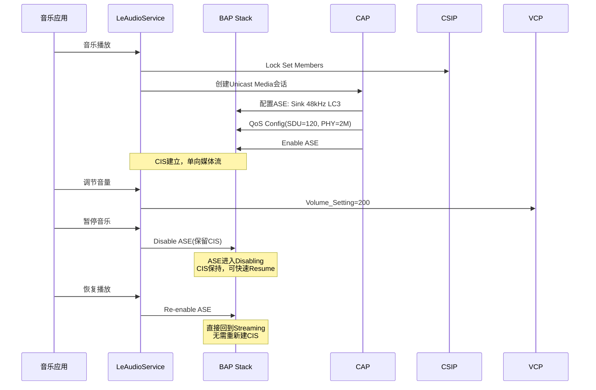

## 14.7 LE Audio Profile深度解析

[← 上一个](14_14.6_蓝牙音频设备与AudioDeviceBroker交互.md) | [← 返回14章](README.md) | [返回导航](../README.md) | [下一个 →](14_14.8_LC3编码参数与配置.md)

---

### 14.7.1 LE Audio六Profile体系架构

LE Audio定义了6个核心Profile，覆盖音频流建立、会话管理、音量控制、麦克风控制、设备组协调和双模音频：



### 14.7.2 BAP — Basic Audio Profile

BAP是LE Audio的基础Profile，定义了4种角色和ASE状态机：

**BAP角色定义**：

| 角色 | 方向 | 说明 | AOSP实现 |
|------|------|------|----------|
| Unicast Client | 手机→耳机 | 发现ASE发起Codec/QoS配置 | LeAudioService(Unicast) |
| Unicast Server | 耳机端 | 提供ASE接受配置 | 外部设备 |
| Broadcast Source | 源端 | 创建BIG广播音频 | LeAudioService(Broadcast) |
| Broadcast Sink | 接收端 | 扫描并同步到BIG | BassClientService |

**ASE(Audio Stream Endpoint)状态机**是BAP的核心：



**ASE状态详解**：

| 状态 | 说明 | 触发条件 |
|------|------|----------|
| Idle | 初始态，ASE未配置 | Release_Complete |
| Codec Configured | Codec参数已协商 | Client发送Codec_Config |
| QoS Configured | QoS参数(SDU/PHY/RTN)已协商 | Client发送QoS_Config |
| Enabling | ASE已使能，等待CIS建立 | Client发送Enable |
| Streaming | CIS已建立，音频数据传输中 | CIS_Established确认 |
| Disabling | ASE正在禁用 | Client发送Disable |
| Releasing | ASE正在释放资源 | Client发送Release |

**PACS与BAP协同**：PACS通过GATT发布设备Codec/Sink/Source能力，Client读取PACS后选择合适配置发起ASE Codec Config Request。

源码入口：[`LeAudioService.java`](packages/modules/Bluetooth/android/app/src/com/android/bluetooth/le_audio/LeAudioService.java)管理ASE创建和状态转换；[`LeAudioNativeInterface.java`](packages/modules/Bluetooth/android/app/src/com/android/bluetooth/le_audio/LeAudioNativeInterface.java)对接BAP协议栈回调。

### 14.7.3 CAP — Common Audio Profile

CAP统一管理Unicast和Broadcast音频会话，确保多个ASE的配置一致性：



**CAP核心功能**：

| 功能 | 说明 |
|------|------|
| CAS发现 | 通过GATT发现Common Audio Service，获取Set Member列表 |
| 统一配置 | 对所有Set Member使用相同Codec/QoS参数 |
| 同步启用 | 对所有Set Member同时发送Enable |
| 流程管理 | 协调Unicast/Broadcast会话的建立和释放 |

CAP Set Coordinator管理多设备组配置(Set Member Array)，典型场景是多耳机同时配对时，CAP协调所有Set Member的ASE配置，确保双耳使用相同的Codec参数和QoS设置。

### 14.7.4 VCP — Volume Control Profile

VCP是LE Audio的音量控制标准，包含三个子服务，提供比AVRCP更精细的音量管理：



**VCP音量同步链路**：

| 步骤 | 操作 | 接口 |
|------|------|------|
| 1 | 手机写入VCS Volume_Setting(0-255) | GATT Write |
| 2 | 耳机调整增益 | VCP Server内部 |
| 3 | VCS通知Volume_Changed | GATT Notification |
| 4 | VolumeControlService回调 | Java回调 |
| 5 | BtHelper.setLeAudioVolume() | 源码[BtHelper.java:369](frameworks/base/services/core/java/com/android/server/audio/BtHelper.java:369) |
| 6 | AudioPolicyManager更新音量 | APM |

**VCP vs AVRCP音量对比**：

| 特性 | VCP (LE Audio) | AVRCP (A2DP) |
|------|----------------|--------------|
| 音量范围 | 0-255 | 0-127 |
| 偏移控制 | VOCS(-255~+255) | 不支持 |
| 输入控制 | AICS(多输入源) | 不支持 |
| 静音 | VCS Mute位 | 不支持 |
| 音量步进 | 1(0-255) | 1(0-127) |

### 14.7.5 MICP — Microphone Control Profile

MICP提供麦克风静音控制，MICS通过GATT提供mute/unmute操作：



**MICP在通话场景中的应用**：

| 操作 | Mute值 | 效果 |
|------|--------|------|
| 通话开始 | 0(unmute) | 麦克风启用 |
| 用户静音 | 1(mute) | 麦克风静音 |
| 通话结束 | 2(disable) | 麦克风禁用 |

### 14.7.6 CSIP — Coordinated Set Identification Profile

CSIP负责设备组管理，通过Set Identification特征发现和绑定同组设备：



**CSIP关键概念**：

| 概念 | 说明 |
|------|------|
| SIRK (Set Identity Resolving Key) | 设备组标识密钥，同组设备共享 |
| Set Member | 组内成员设备 |
| CSIP Lock | 防止部分成员被单独操作 |
| Set Size | 组内设备总数 |
| Rank | 成员优先级排序 |

**CSIP Lock机制**：

| 场景 | Lock行为 |
|------|----------|
| 配置Codec | 对所有Set Member加Lock |
| 音量调节 | 对所有Set Member加Lock |
| 断开连接 | 先释放Lock再断开 |
| 单设备操作 | 不需要Lock |

### 14.7.7 TMAP — Telephone and Media Audio Profile

TMAP定义了电话+媒体双模音频场景下BAP的配置要求。LeAudioService在启动时初始化TMAP角色（源码[`LeAudioService.java:294-306`](packages/modules/Bluetooth/android/app/src/com/android/bluetooth/le_audio/LeAudioService.java:294)）：



**TMAP角色与ASE配置**：

| TMAP角色 | 支持的ASE配置 | 音频方向 | Codec | 典型设备 |
|----------|-------------|----------|-------|----------|
| Call Gateway | Unicast Sink+Source | 双向 | 16kHz LC3 | 手机 |
| Call Terminal | Unicast Sink+Source | 双向 | 16kHz LC3 | 耳机 |
| Unicast Media Gateway | Unicast Sink | 单向(接收) | 48kHz LC3 | 手机 |
| Unicast Media Terminal | Unicast Sink | 单向(接收) | 48kHz LC3 | 耳机 |
| Broadcast Media Gateway | Broadcast Source | 单向(发送) | 48kHz LC3 | TV |
| Broadcast Media Sink | Broadcast Sink | 单向(接收) | 48kHz LC3 | 助听器 |

**TMAP GATT Server初始化**（源码[`LeAudioService.java:139-141`](packages/modules/Bluetooth/android/app/src/com/android/bluetooth/le_audio/LeAudioService.java:139)）：

```java
private TmapGattServer mTmapGattServer;
// 在start()中初始化TMAP角色
mTmapGattServer.start(/* roles= */ TMAP_ROLE_CALL_GATEWAY | TMAP_ROLE_UNICAST_MEDIA_GATEWAY);
```

### 14.7.8 Profile协作 — 通话场景全流程

LE Audio通话场景需要BAP+CAP+VCP+MICP+CSIP+TMAP六Profile协同：



### 14.7.9 Profile协作 — 媒体播放场景



### 14.7.10 LE Audio Profile与AudioDeviceBroker的映射

| Profile | AudioSystem设备 | BtHelper代理 | 音量接口 |
|---------|----------------|-------------|----------|
| BAP(Unicast Out) | DEVICE_OUT_BLE_HEADSET | mLeAudio | mLeAudio.setVolume(0-255) |
| BAP(Unicast In) | DEVICE_IN_BLE_HEADSET | mLeAudio | - |
| BAP(Broadcast) | DEVICE_OUT_BLE_BROADCAST | mLeAudio | - |
| VCP | (通过BAP设备路由) | mLeAudio | mLeAudio.setVolume() |
| MICP | (通过BAP设备路由) | - | MICS mute控制 |
| TMAP | (定义BAP配置模板) | - | - |
| CSIP | (定义设备组逻辑) | - | - |

### 14.7.11 AAOS车载LE Audio Profile场景

| 场景 | 使用的Profile | 关键配置 |
|------|-------------|----------|
| 车载LE Audio耳机听导航 | BAP+CAP+VCP | 48kHz LC3 Sink |
| 车载蓝牙免提通话 | BAP+CAP+TMAP+VCP+MICP | 16kHz LC3双向 |
| 车载多人共享音频 | BAP+CAP+CSIP | 双Set Member |
| 车载Auracast广播 | BAP Broadcast | 48kHz LC3 BIS |
| 助听器接入车载 | BAP+TMAP+CSIP | Call Terminal角色 |
| 麦克风阵列静音 | MICP | MICS mute控制 |

### 14.7.12 LE Audio Profile调试命令

| 命令 | 说明 |
|------|------|
| `dumpsys bluetooth_le_audio` | LeAudioService完整状态 |
| `dumpsys bluetooth_le_audio | grep GroupDescriptor` | 组描述符信息 |
| `dumpsys bluetooth_le_audio | grep TMAP` | TMAP角色信息 |
| `dumpsys bluetooth_bass_client` | Broadcast扫描状态 |
| `dumpsys bluetooth_csis` | CSIP设备组信息 |
| `dumpsys bluetooth_vc` | VCP音量控制状态 |
| `logcat -s LeAudioService LeAudioStateMachine` | LE Audio日志 |
| `logcat -s LeAudioCodecConfig` | Codec协商日志 |

---

[← 上一个](14_14.6_蓝牙音频设备与AudioDeviceBroker交互.md) | [← 返回14章](README.md) | [返回导航](../README.md) | [下一个 →](14_14.8_LC3编码参数与配置.md)