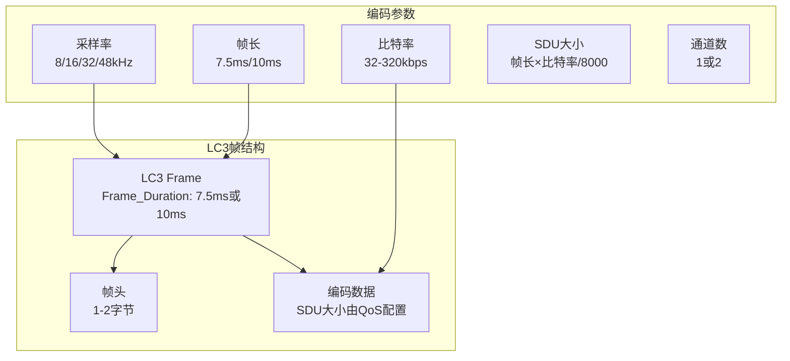
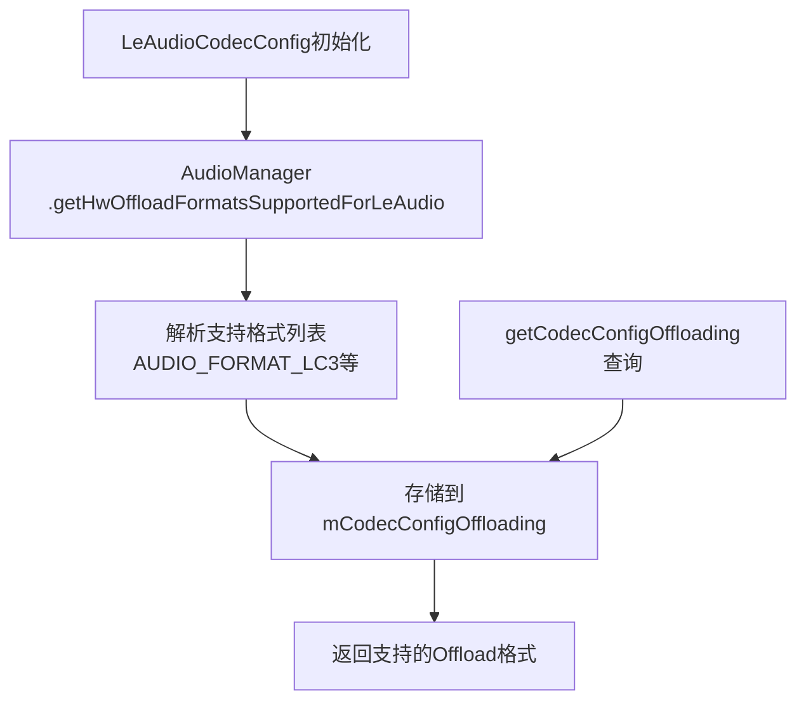
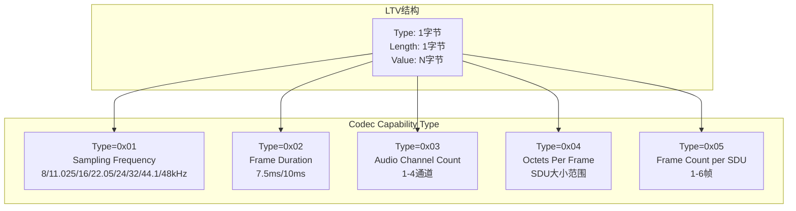
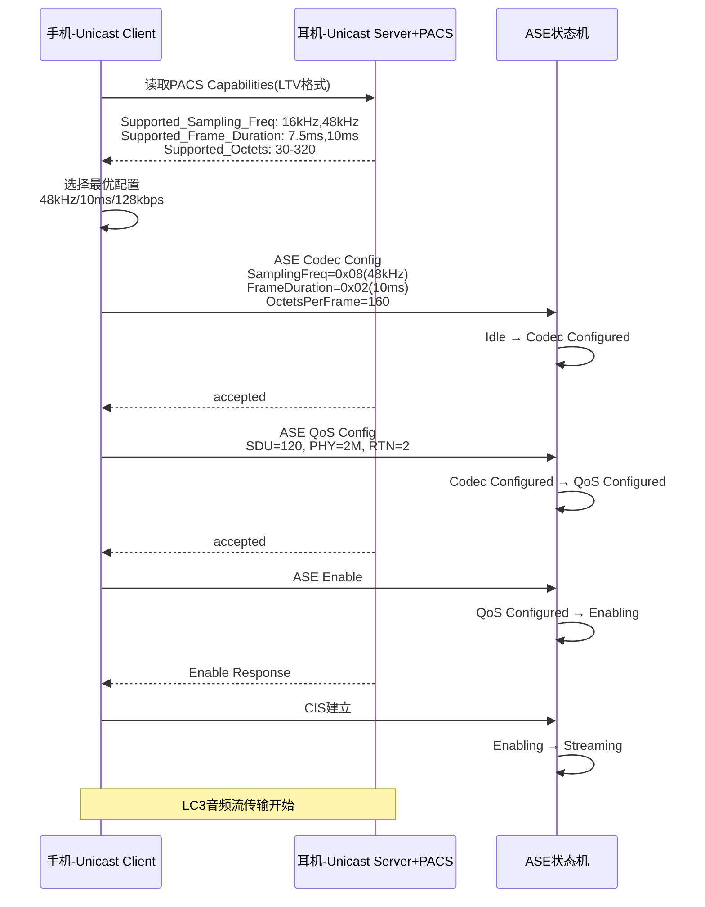
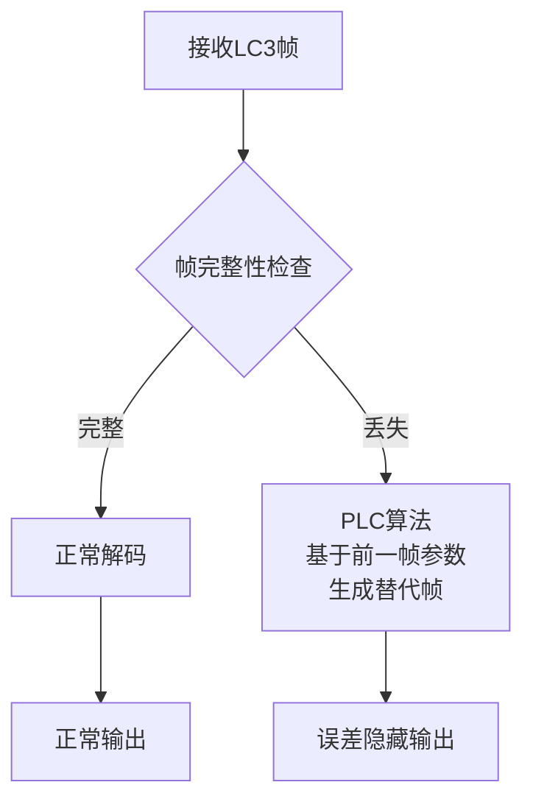

## 14.8 LC3编码参数与配置

[← 上一个](14_14.7_LE_Audio_Profile深度解析.md) | [← 返回14章](README.md) | [返回导航](../README.md) | [下一个 →](14_14.9_LE_Audio广播音频Broadcast_Audio.md)

---

### 14.8.1 LC3编解码器概述

LC3(Low Complexity Communications Codec)是Bluetooth SIG为LE Audio制定的强制编解码器，替代A2DP中的SBC。LC3采用LPC(线性预测编码)+MDCT(改进离散余弦变换)混合编码架构，在相同比特率下音质优于SBC约30%。

源码入口：[`LeAudioCodecConfig.java`](packages/modules/Bluetooth/android/app/src/com/android/bluetooth/le_audio/LeAudioCodecConfig.java)

### 14.8.2 LC3 vs SBC关键参数对比

| 维度 | LC3 | SBC |
|------|-----|-----|
| 采样率 | 8/11.025/16/22.05/24/32/44.1/48kHz | 16/22.05/24/32/44.1/48kHz |
| 帧长 | 7.5ms/10ms | ~22ms |
| 比特率(8kHz) | 32-128 kbps | 不支持 |
| 比特率(16kHz) | 48-160 kbps | 不支持 |
| 比特率(32kHz) | 64-256 kbps | 128-345 kbps |
| 比特率(48kHz) | 64-320 kbps | 128-345 kbps |
| 延迟 | ~30ms | ~200ms |
| 音质 | 相同bitrate下优于SBC约30% | 基线音质 |
| PLC | 支持(Packet Loss Concealment) | 不支持 |
| 强制性 | LE Audio强制 | A2DP强制 |
| 编码架构 | LPC+MDCT混合 | 子带编码+量化 |
| 通道数 | 1/2(单播)/1-4(PACS协商) | 1/2 |

### 14.8.3 LC3帧结构与编码参数



**LC3关键参数计算**：

| 参数 | 计算方式 | 示例 |
|------|----------|------|
| SDU大小 | Frame_Duration × Bit_Rate / 8000 | 10ms × 128kbps / 8000 = 160字节 |
| 传输间隔 | 等于Frame_Duration | 7.5ms或10ms |
| 比特率 | SDU × 8 / Frame_Duration | 160×8/10ms = 128kbps |

### 14.8.4 LC3场景化配置表

LE Audio根据音频场景定义了标准LC3配置：

| 场景 | 采样率 | 帧长 | 比特率 | SDU | 通道 | 延迟 |
|------|--------|------|--------|-----|------|------|
| 语音通话 | 16kHz | 7.5ms | 32-64kbps | 30-60B | 1(双向) | ~30ms |
| 语音识别 | 16kHz | 7.5ms | 32kbps | 30B | 1 | ~30ms |
| 标准音乐 | 48kHz | 10ms | 128kbps | 160B | 2(立体声) | ~40ms |
| 高品质音乐 | 48kHz | 10ms | 256kbps | 320B | 2(立体声) | ~40ms |
| 低延迟游戏 | 48kHz | 7.5ms | 128kbps | 120B | 2 | ~30ms |
| 广播音频 | 48kHz | 10ms | 128kbps | 160B | 2 | ~40ms |

### 14.8.5 LeAudioCodecConfig源码解析

[`LeAudioCodecConfig.java`](packages/modules/Bluetooth/android/app/src/com/android/bluetooth/le_audio/LeAudioCodecConfig.java)处理LE Audio Codec配置，核心功能是从AudioManager获取硬件Offload支持的格式：



**getHwOffloadFormatsSupportedForLeAudio()**（源码[34-55](packages/modules/Bluetooth/android/app/src/com/android/bluetooth/le_audio/LeAudioCodecConfig.java:34)）：

```java
private static @AudioFormat.AudioFormatValue int[] getHwOffloadFormatsSupportedForLeAudio() {
    // 从AudioManager获取HAL层支持的LE Audio Offload格式
    // 返回格式如: AUDIO_FORMAT_LC3
    // 如果HAL不支持Offload，返回空数组
}
```

**getCodecConfigOffloading()**（源码[57-59](packages/modules/Bluetooth/android/app/src/com/android/bluetooth/le_audio/LeAudioCodecConfig.java:57)）：

```java
public @AudioFormat.AudioFormatValue int[] getCodecConfigOffloading() {
    return mCodecConfigOffloading;
}
```

### 14.8.6 LC3 LTV格式Codec Capabilities

BAP使用LTV(Type-Length-Value)格式编码Codec Capabilities，LeAudioCodecConfig负责解析：



**Sampling Frequency LTV值映射**：

| Value | 采样率 |
|-------|--------|
| 0x01 | 8000Hz |
| 0x02 | 11025Hz |
| 0x03 | 16000Hz |
| 0x04 | 22050Hz |
| 0x05 | 24000Hz |
| 0x06 | 32000Hz |
| 0x07 | 44100Hz |
| 0x08 | 48000Hz |

### 14.8.7 LC3 Codec协商流程



### 14.8.8 LC3与A2DP Codec Offload映射

当LE Audio使用Offload模式时，LC3格式需要映射到AudioSystem的音频格式：

| LE Audio Codec | AudioSystem格式 | HAL Offload支持 |
|----------------|----------------|----------------|
| LC3 8kHz | AUDIO_FORMAT_LC3 | 检查getHwOffloadFormats |
| LC3 16kHz | AUDIO_FORMAT_LC3 | 检查getHwOffloadFormats |
| LC3 32kHz | AUDIO_FORMAT_LC3 | 检查getHwOffloadFormats |
| LC3 48kHz | AUDIO_FORMAT_LC3 | 检查getHwOffloadFormats |

**A2DP Codec→AudioSystem格式映射对比**：

| A2DP Codec | AudioSystem格式 |
|------------|----------------|
| SBC | AUDIO_FORMAT_SBC |
| AAC | AUDIO_FORMAT_AAC |
| aptX | AUDIO_FORMAT_APTX |
| aptX HD | AUDIO_FORMAT_APTX_HD |
| LDAC | AUDIO_FORMAT_LDAC |

[`AudioSystem.bluetoothCodecToAudioFormat()`](frameworks/base/media/java/android/media/AudioSystem.java)执行A2DP映射，LC3映射通过LeAudioCodecConfig.getCodecConfigOffloading()获取。

### 14.8.9 LC3 PLC(Packet Loss Concealment)

LC3内置PLC机制，在丢包时进行误差隐藏，相比SBC的无处理方案显著提升用户体验：



**PLC效果对比**：

| 丢包率 | SBC效果 | LC3+PLC效果 |
|--------|---------|-------------|
| 0% | 正常 | 正常 |
| 1% | 明显杂音 | 几乎无感知 |
| 5% | 严重断续 | 轻微质量下降 |
| 10% | 不可用 | 仍可理解 |

### 14.8.10 AAOS车载LC3配置

| 场景 | 推荐LC3配置 | 原因 |
|------|------------|------|
| 车载导航语音 | 16kHz/7.5ms/64kbps | 低延迟，语音足够 |
| 车载音乐播放 | 48kHz/10ms/256kbps | 高音质需求 |
| 车载免提通话 | 16kHz/7.5ms/32kbps双向 | 低延迟双向通话 |
| 车载Auracast | 48kHz/10ms/128kbps | 广播兼容性 |
| 车载语音助手 | 16kHz/7.5ms/32kbps | 语音识别场景 |

### 14.8.11 LC3调试命令

| 命令 | 说明 |
|------|------|
| `dumpsys bluetooth_le_audio | grep Codec` | 当前Codec配置 |
| `dumpsys bluetooth_le_audio | grep Offload` | Offload支持格式 |
| `dumpsys audio | grep LC3` | AudioSystem中LC3格式 |
| `logcat -s LeAudioCodecConfig` | Codec协商日志 |
| `logcat -s LeAudioService | grep codec` | Codec选择日志 |

---

[← 上一个](14_14.7_LE_Audio_Profile深度解析.md) | [← 返回14章](README.md) | [返回导航](../README.md) | [下一个 →](14_14.9_LE_Audio广播音频Broadcast_Audio.md)