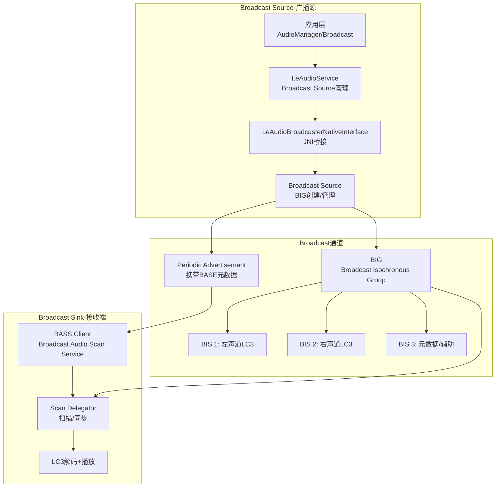
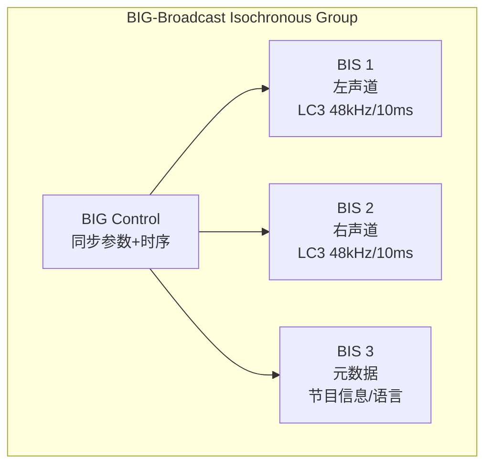
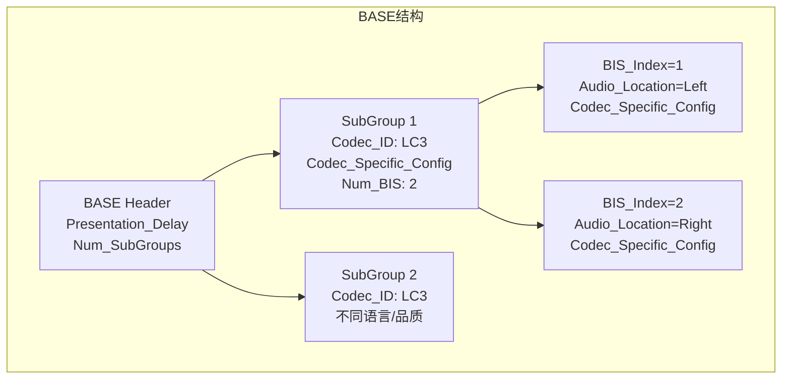
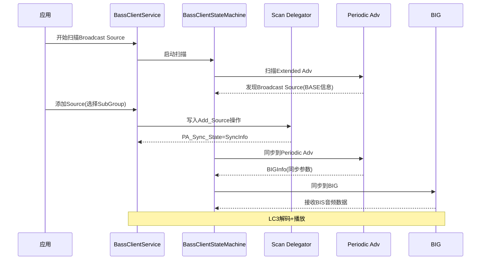
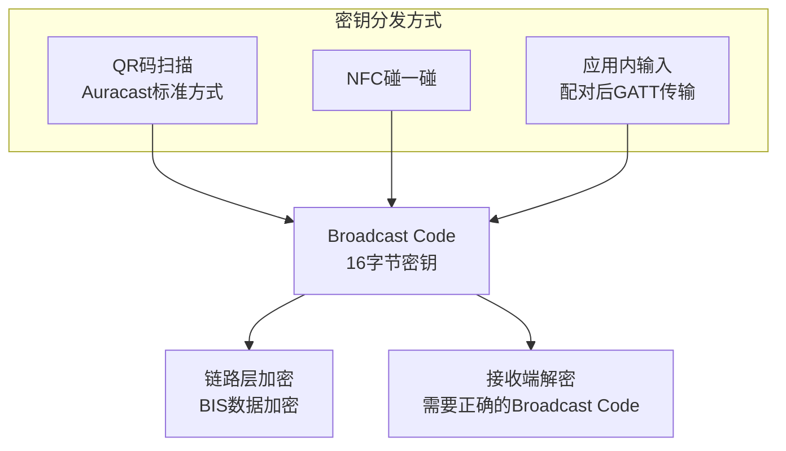
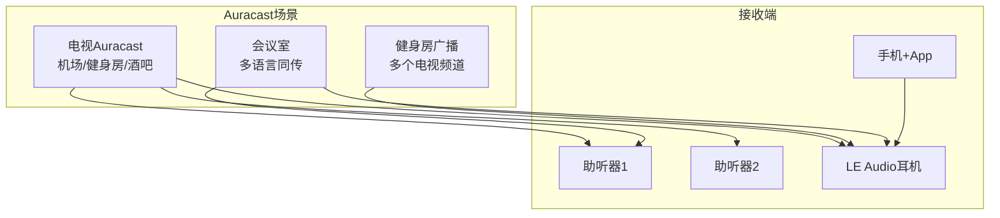
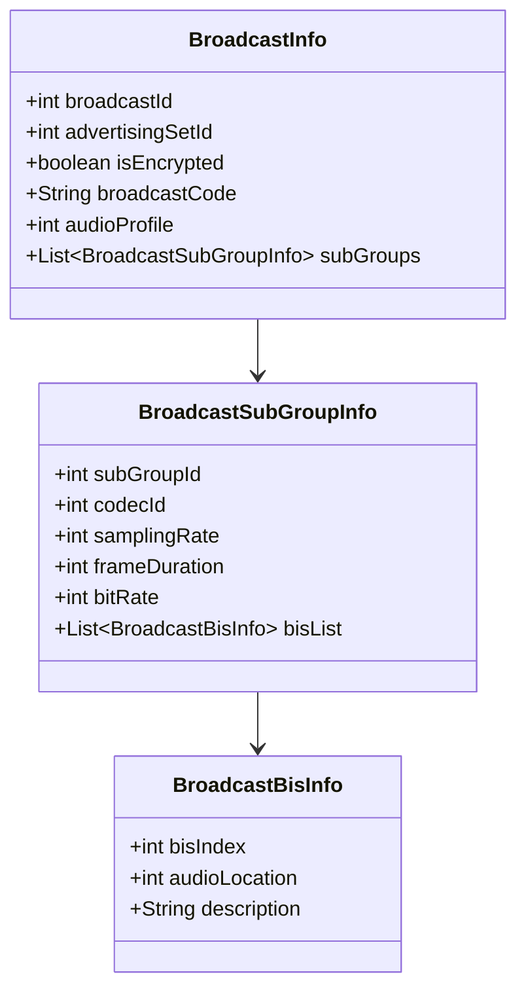
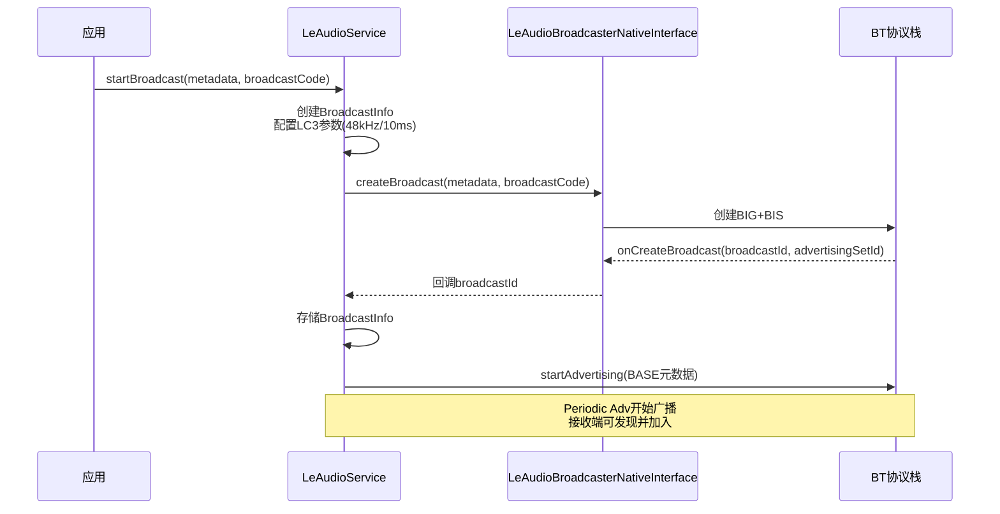

## 14.9 LE Audio广播音频(Broadcast Audio)

[← 上一个](14_14.8_LC3编码参数与配置.md) | [← 返回14章](README.md) | [返回导航](../README.md) | [下一个 →](14_14.10_LE_Audio与Classic_Bluetooth共存策略.md)

---

### 14.9.1 Broadcast Audio架构概述

LE Audio广播音频允许一个源设备同时向多个接收设备发送音频流，无需配对连接。这是Auracast技术的基础，支持TV共享、健身房、会议等场景。

源码路径：
- [`LeAudioBroadcasterNativeInterface.java`](packages/modules/Bluetooth/android/app/src/com/android/bluetooth/le_audio/LeAudioBroadcasterNativeInterface.java)
- [`BassClientService.java`](packages/modules/Bluetooth/android/app/src/com/android/bluetooth/bass_client/BassClientService.java)(72KB)
- [`BassClientStateMachine.java`](packages/modules/Bluetooth/android/app/src/com/android/bluetooth/bass_client/BassClientStateMachine.java)(91KB)

### 14.9.2 BIG与BIS数据结构

BIG(Broadcast Isochronous Group)是广播音频的核心传输结构：

**BIG/BIS关键参数**：

| 参数 | 说明 | 典型值 |
|------|------|--------|
| BIG_Handle | BIG标识 | 0-255 |
| Num_BIS | BIS数量 | 2(立体声)/3(含元数据) |
| SDU_Interval | SDU传输间隔 | 10ms |
| Max_SDU | 最大SDU大小 | 160字节(128kbps) |
| PHY | 物理层 | 2M PHY |
| RTN | 重传次数 | 2(尽力传输) |
| Framing | 帧方式 | Unframed/Framed |
| BN(Burst Number) | 突发数量 | 2-4 |

**Unicast(CIS) vs Broadcast(BIS)对比**：

| 维度 | Unicast (CIS) | Broadcast (BIS) |
|------|---------------|----------------|
| 连接模式 | 点对点(1对1) | 点对多点(1对N) |
| 配对要求 | 需配对+GATT连接 | 无需配对 |
| 可靠性 | RTN重传+确认 | 无确认(尽力传输) |
| 延迟 | ~30-50ms | ~20-40ms |
| 双向 | 支持Sink+Source | 仅单向 |
| 隐私 | 链路层加密 | Broadcast Code加密 |
| 功耗 | 较高(双向维护) | 较低(单向接收) |
| 接收者数量 | 有限(2-4) | 理论无限 |
| 典型场景 | 耳机听音乐 | TV共享/健身房/会议 |

### 14.9.3 BASE — Broadcast Audio Source Endpoint

BASE(Basic Audio Source Endpoint)描述广播源的元数据，通过Periodic Advertisement传输：

**BASE字段详解**：

| 字段 | 说明 |
|------|------|
| Presentation_Delay | 渲染延迟(us) |
| Num_SubGroups | 子组数量(不同语言/品质) |
| Codec_ID | 编解码器标识(LC3=0x06) |
| Codec_Specific_Config | LTV格式Codec参数 |
| BIS_Index | BIS编号(1-based) |
| Audio_Location | 音频位置(左/右/中心) |

### 14.9.4 BASS — Broadcast Audio Scan Service

BASS是广播发现和同步机制的核心服务：

**BASS操作类型**：

| 操作 | 说明 | 触发条件 |
|------|------|----------|
| Add_Source | 添加广播源 | 用户选择加入 |
| Modify_Source | 修改广播源配置 | 切换SubGroup |
| Set_Broadcast_Code | 设置加密密钥 | 加密广播 |
| Remove_Source | 移除广播源 | 用户离开 |

### 14.9.5 Broadcast Code加密

Broadcast Code提供广播音频的隐私保护：

**Broadcast Code安全模型**：

| 模式 | 说明 | 安全级别 |
|------|------|----------|
| 开放广播 | 无Broadcast Code | 低(任何人可接收) |
| 普通加密 | 4字节PIN | 中(简单保护) |
| 强加密 | 16字节密钥 | 高(需要密钥分发) |

### 14.9.6 Auracast — 公共广播音频

Auracast是Bluetooth SIG基于LE Audio Broadcast的商用品牌：

**Auracast与AudioDeviceBroker映射**：

| 组件 | AudioSystem设备 | 说明 |
|------|----------------|------|
| Broadcast Source | DEVICE_OUT_BLE_BROADCAST | 发送端设备类型 |
| Broadcast Sink | (通过BASS Client管理) | 接收端不直接映射 |
| LeAudioService | mActiveAudioOutDevice | 管理Broadcast状态 |

### 14.9.7 LeAudioService中Broadcast数据结构

LeAudioService内部维护Broadcast相关数据结构（源码[`LeAudioService.java:215-218`](packages/modules/Bluetooth/android/app/src/com/android/bluetooth/le_audio/LeAudioService.java:215)）：

### 14.9.8 Broadcast创建流程

### 14.9.9 AAOS车载Broadcast场景

| 场景 | 实现方式 | 关键配置 |
|------|----------|----------|
| 车载后排娱乐广播 | Auracast Source | 48kHz LC3 BIS |
| 车载多语言导游 | 多SubGroup广播 | 不同语言SubGroup |
| 车载候车室共享 | 开放广播 | 无加密 |
| 车载加密会议 | Broadcast Code加密 | 16字节密钥 |
| 助听器接入车载广播 | BassClientService | Scan Delegator |

### 14.9.10 Broadcast调试命令

| 命令 | 说明 |
|------|------|
| `dumpsys bluetooth_le_audio | grep Broadcast` | Broadcast状态 |
| `dumpsys bluetooth_bass_client` | BASS Client完整状态 |
| `dumpsys bluetooth_le_audio | grep BIG` | BIG信息 |
| `dumpsys bluetooth_le_audio | grep BIS` | BIS信息 |
| `logcat -s LeAudioService | grep Broadcast` | Broadcast日志 |
| `logcat -s BassClientService` | BASS扫描日志 |

---

[← 上一个](14_14.8_LC3编码参数与配置.md) | [← 返回14章](README.md) | [返回导航](../README.md) | [下一个 →](14_14.10_LE_Audio与Classic_Bluetooth共存策略.md)