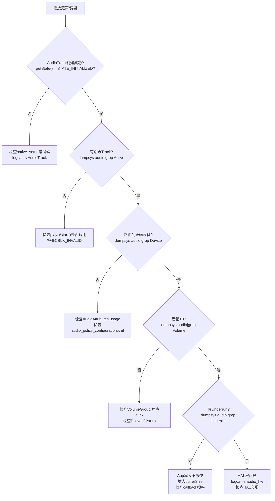

# 第十五篇：调试方法与OEM定制指南

> [← 上一篇：Bluetooth Audio](14_Bluetooth_Audio.md) | [返回导航](README.md)

---

## 15.1 dumpsys audio — 音频系统全量状态

### 基本用法

```bash
# 完整dump（输出很大，建议重定向到文件）
dumpsys audio > audio_dump.txt

# 只看特定部分
dumpsys audio | grep -A 20 "Output"
dumpsys audio | grep -A 10 "Input"
dumpsys audio | grep -A 5 "Volume"
dumpsys audio | grep -A 5 "Focus"
dumpsys audio | grep -A 10 "Ringer"
```

### dumpsys audio 关键段落

| 段落 | 包含信息 |
|------|----------|
| `AudioFlinger` | 所有Thread状态、活跃Track列表、Underrun计数、延迟 |
| `Output` | 已打开的输出流、设备、采样率、格式 |
| `Input` | 已打开的输入流、设备 |
| `Routes` | 当前音频路由配置 |
| `Volume` | 各VolumeGroup的音量指数 |
| `Focus` | 当前焦点持有者、焦点栈 |
| `Devices` | 连接的设备列表 |
| `Effects` | 活跃的音效链 |

### AudioFlinger Thread dump解读

```
Output thread 0x7f8c1234000, name MixerThread, tid 1234
  Sample rate: 48000, Format: PCM_FLOAT, Channel mask: STEREO
  Device: AUDIO_DEVICE_OUT_SPEAKER
  Active tracks: 2
  Underrun count: 3
  FastMixer: enabled, write sequence: 12345
```

### 关键dump段落与源码对应关系

| dump段落 | 生成源码 | 诊断价值 |
|----------|----------|----------|
| Output thread dump | [`Threads.cpp: PlaybackThread::dumpInternals_l()`](frameworks/av/services/audioflinger/Threads.cpp) | Thread类型/采样率/设备/underrun |
| Active Track dump | [`Threads.cpp: PlaybackThread::dumpTracks_l()`](frameworks/av/services/audioflinger/Threads.cpp) | Track状态/sessionId/帧数/underrun |
| Effect Chain dump | [`Effects.cpp: EffectChain::dump()`](frameworks/av/services/audioflinger/Effects.cpp) | 效果器状态/sessionId |
| Audio Policy dump | [`AudioPolicyManager::dump()`](frameworks/av/services/audiopolicy/AudioPolicyManager.cpp) | 路由策略/设备/VolumeGroup |
| Patch Panel dump | [`PatchPanel::dump()`](frameworks/av/services/audioflinger/PatchPanel.cpp) | 音频路由连接 |

### 播放问题完整排查流程



### AudioFlinger Track dump关键字段解读

```
Track 0x7f8c5678000, stream type MUSIC, session 12345
  State: ACTIVE                    ← Track状态(ACTIVE/PAUSED/STOPPED/FLUSHED)
  Format: PCM_16_BIT               ← 采样格式
  Sample rate: 44100               ← Track采样率
  Channel mask: STEREO             ← 声道配置
  Frame count: 2048                ← 共享内存buffer帧数
  Server position: 12345678        ← AF已消费帧数
  Client position: 12346000        ← App已写入帧数
  Underrun count: 3                ← underrun次数(关键!)
  Underrun frames: 9216            ← underrun总帧数
  Fast track: yes                  ← 是否FastMixer路径
  Volume: L:0.996 R:0.996          ← 实际音量gain
  Main buffer: 0x7f8c00000000      ← 混音buffer地址
  Aux buffer: none                 ← 辅助效果buffer
```

> **Underrun count > 0 的含义**：App写入速度不够快，PlaybackThread无数据可混音时填充0（静音），导致播放卡顿/爆音。解决方案：增大bufferSize、使用callback模式、检查App线程是否被阻塞。

---

## 15.2 logcat音频日志过滤

### 关键TAG

```bash
# AudioFlinger日志
logcat -s audioflinger

# AudioPolicy日志
logcat -s audiopolicy

# AudioService日志
logcat -s AudioService

# CarAudio日志(AAOS)
logcat -s CarAudioService CarAudioFocus CarVolumeGroup

# AudioTrack/App层日志
logcat -s AudioTrack AudioRecord AudioManager

# HAL层日志
logcat -s audio_hw audio_hw_primary

# 蓝牙音频日志
logcat -s A2dpService LeAudioService BtHelper AudioDeviceBroker
```

### 常用过滤组合

```bash
# 追踪播放问题
logcat -s audioflinger AudioTrack AudioService

# 追踪路由问题
logcat -s audiopolicy AudioService audio_hw

# 追踪焦点问题
logcat -s AudioService MediaFocusControl CarAudioFocus

# 追踪设备连接
logcat -s AudioService AudioDeviceBroker audiopolicy

# 追踪蓝牙音频
logcat -s AudioDeviceBroker BtHelper A2dpService LeAudioService
```

---

## 15.3 常见问题定位

### 播放无声

| 步骤 | 检查点 | 命令 |
|------|--------|------|
| 1 | AudioTrack是否创建成功 | `dumpsys audio \| grep "Track"` |
| 2 | 是否有活跃Track | `dumpsys audio \| grep "Active tracks"` |
| 3 | 路由到哪个设备 | `dumpsys audio \| grep "Device"` |
| 4 | 音量是否为0 | `dumpsys audio \| grep "Volume"` |
| 5 | 是否有Underrun | `dumpsys audio \| grep "Underrun"` |
| 6 | HAL是否正常写入 | `logcat -s audio_hw` |

### 焦点问题

| 步骤 | 检查点 | 命令 |
|------|--------|------|
| 1 | 谁持有焦点 | `dumpsys audio \| grep "Focus"` |
| 2 | 焦点请求是否被拒绝 | `logcat -s MediaFocusControl` |
| 3 | AAOS: 交互矩阵结果 | `logcat -s CarAudioFocus` |
| 4 | AudioControl HAL回调 | `logcat -s AudioControl` |

### 路由错误

| 步骤 | 检查点 | 命令 |
|------|--------|------|
| 1 | 当前活跃设备 | `dumpsys audio \| grep "Devices"` |
| 2 | AudioPolicy配置是否正确 | 检查`audio_policy_configuration.xml` |
| 3 | IOProfile是否匹配 | `dumpsys audio \| grep "Profile"` |
| 4 | Force Use是否影响 | `dumpsys audio \| grep "Force"` |

### 延迟过高

| 步骤 | 检查点 | 命令 |
|------|--------|------|
| 1 | 是否使用FastMixer | `dumpsys audio \| grep "Fast"` |
| 2 | Buffer大小配置 | `dumpsys audio \| grep "frameCount"` |
| 3 | Underrun频率 | `dumpsys audio \| grep "Underrun"` |
| 4 | SCHED_FIFO是否生效 | `adb shell ps -T -p <tid>` |
| 5 | 是否有EffectChain增加延迟 | `dumpsys audio \| grep "Effect"` |

### 蓝牙音频问题

| 步骤 | 检查点 | 命令 |
|------|--------|------|
| 1 | A2DP是否连接 | `dumpsys audio \| grep "A2DP"` |
| 2 | LE Audio是否路由 | `dumpsys audio \| grep "BLE"` |
| 3 | 音量是否传递到耳机 | `logcat -s AudioDeviceBroker` |
| 4 | A2DP是否被Suspend | `dumpsys audio \| grep "Suspend"` |
| 5 | Codec协商结果 | `dumpsys bluetooth_manager \| grep codec` |

---

## 15.4 OEM定制指南

### 定制Audio HAL

1. **实现AIDL Audio HAL**（推荐）
   - 继承`IModule`接口
   - 实现`openStream()`, `getAudioPort()`等
   - 在`audio_policy_configuration.xml`中声明模块

2. **实现HIDL Audio HAL**（兼容旧版）
   - 继承`IDevicesFactory`接口
   - 实现对应的IStreamOut/IStreamIn

### 定制AudioControl HAL（AAOS）

1. **实现IAudioControl AIDL**
   - `onAudioFocusChange()`: 接收焦点变化通知
   - `registerFocusListener()`: 注册外部焦点监听
   - `setMute()`: 接收静音命令

2. **自定义焦点交互矩阵**
   - 修改`CarAudioFocus`中的`INTERACTION_MATRIX`
   - 或在`car_audio_configuration.xml`中声明交互规则

### 定制路由策略

1. **修改ProductStrategy映射**
   - 编辑`audio_policy_engine_configuration.xml`
   - 添加/修改`<productStrategy>`条目

2. **自定义Engine**
   - 继承`EngineBase`
   - 覆写`getOutputDevicesForAttributes()`等方法
   - 在`audio_policy_engine_configuration.xml`中指定自定义引擎

### 定制音量曲线

1. **修改`audio_policy_volumes.xml`**
   - 调整`<point>`值改变音量曲线形状
   - 添加新的`<volume>`条目支持新设备类别

2. **添加VolumeGroup**
   - 在`audio_policy_engine_configuration.xml`中添加`<volumeGroup>`

### 添加新的音频设备

1. 在`audio_policy_configuration.xml`中：
   - 添加`<devicePort>`
   - 添加`<route>`连接mixPort和devicePort
2. 在Audio HAL中支持该设备
3. 如果是AAOS，在`car_audio_configuration.xml`中配置Bus映射

### 定制蓝牙音频

1. **A2DP Codec优先级**: 修改`/vendor/etc/bluetooth/audio_policy_config.xml`
2. **LE Audio配置**: 通过`IBluetoothLe.setEnabled()`控制LE Audio启用
3. **SCO模式**: 通过`IBluetooth.setScoConfig()`配置窄带/宽带/超宽带

---

## 15.5 性能优化建议

| 优化目标 | 方法 | 影响 |
|----------|------|------|
| 降低播放延迟 | 启用FastMixer + 小buffer | 延迟<10ms |
| 降低播放延迟 | 使用AAudio MMAP模式 | 延迟<5ms |
| 减少功耗 | Offload压缩码流到DSP | CPU使用降低50%+ |
| 减少功耗 | 空闲时standby HAL | 待机功耗降低 |
| 减少Underrun | 增大App buffer | 容错空间增大 |
| 减少Underrun | 使用MODE_STATIC | 无FIFO underrun风险 |
| 蓝牙延迟 | 使用LE Audio替代A2DP | 延迟从~200ms降至~30ms |

---

> [← 上一篇：Bluetooth Audio](14_Bluetooth_Audio.md) | [返回导航](README.md)