# 第十五篇：调试方法与OEM定制指南

> [← 上一篇：Vendor+QNX双域架构](17_Vendor_QNX_Architecture.md) | [返回导航](README.md)

---

## 15.1 dumpsys audio — 音频系统全量状态


### 基本用法

```bash
# 完整dump（输出很大，建议重定向到文件）
dumpsys audio > audio_dump.txt

# 只看特定部分
dumpsys audio | grep -A 20 "Output"
dumpsys audio | grep -A 10 "Input"
dumpsys audio | grep -A 5 "Volume"
dumpsys audio | grep -A 5 "Focus"
dumpsys audio | grep -A 10 "Ringer"
```

### dumpsys audio 关键段落

| 段落 | 包含信息 |
|------|----------|
| `AudioFlinger` | 所有Thread状态、活跃Track列表、Underrun计数、延迟 |
| `Output` | 已打开的输出流、设备、采样率、格式 |
| `Input` | 已打开的输入流、设备 |
| `Routes` | 当前音频路由配置 |
| `Volume` | 各VolumeGroup的音量指数 |
| `Focus` | 当前焦点持有者、焦点栈 |
| `Devices` | 连接的设备列表 |
| `Effects` | 活跃的音效链 |

### AudioFlinger Thread dump解读

```
Output thread 0x7f8c1234000, name MixerThread, tid 1234
  Sample rate: 48000, Format: PCM_FLOAT, Channel mask: STEREO
  Device: AUDIO_DEVICE_OUT_SPEAKER
  Active tracks: 2
  Underrun count: 3
  FastMixer: enabled, write sequence: 12345
```

### 关键dump段落与源码对应关系

| dump段落 | 生成源码 | 诊断价值 |
|----------|----------|----------|
| Output thread dump | [`Threads.cpp: PlaybackThread::dumpInternals_l()`](frameworks/av/services/audioflinger/Threads.cpp) | Thread类型/采样率/设备/underrun |
| Active Track dump | [`Threads.cpp: PlaybackThread::dumpTracks_l()`](frameworks/av/services/audioflinger/Threads.cpp) | Track状态/sessionId/帧数/underrun |
| Effect Chain dump | [`Effects.cpp: EffectChain::dump()`](frameworks/av/services/audioflinger/Effects.cpp) | 效果器状态/sessionId |
| Audio Policy dump | [`AudioPolicyManager::dump()`](frameworks/av/services/audiopolicy/AudioPolicyManager.cpp) | 路由策略/设备/VolumeGroup |
| Patch Panel dump | [`PatchPanel::dump()`](frameworks/av/services/audioflinger/PatchPanel.cpp) | 音频路由连接 |

### 播放问题完整排查流程

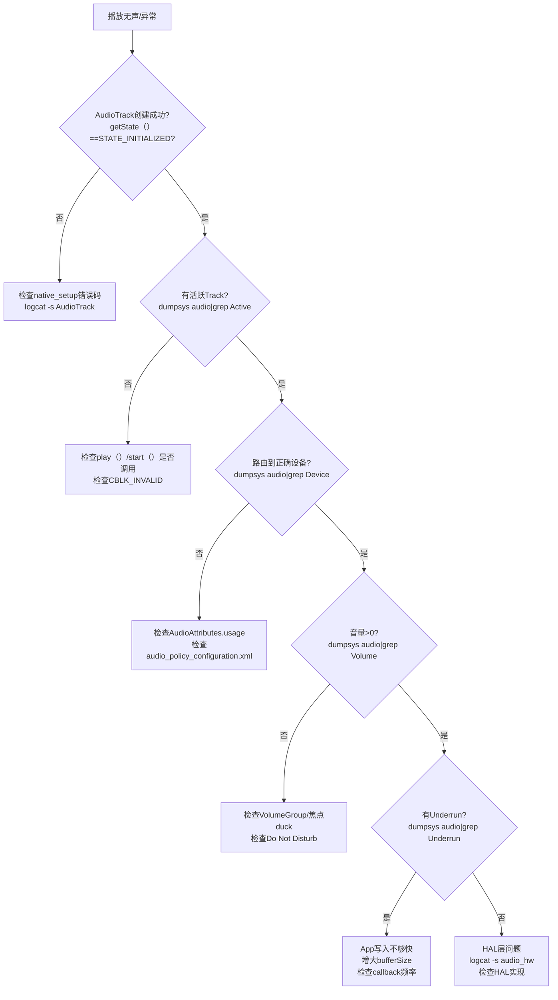

### AudioFlinger Track dump关键字段解读

```
Track 0x7f8c5678000, stream type MUSIC, session 12345
  State: ACTIVE                    ← Track状态(ACTIVE/PAUSED/STOPPED/FLUSHED)
  Format: PCM_16_BIT               ← 采样格式
  Sample rate: 44100               ← Track采样率
  Channel mask: STEREO             ← 声道配置
  Frame count: 2048                ← 共享内存buffer帧数
  Server position: 12345678        ← AF已消费帧数
  Client position: 12346000        ← App已写入帧数
  Underrun count: 3                ← underrun次数(关键!)
  Underrun frames: 9216            ← underrun总帧数
  Fast track: yes                  ← 是否FastMixer路径
  Volume: L:0.996 R:0.996          ← 实际音量gain
  Main buffer: 0x7f8c00000000      ← 混音buffer地址
  Aux buffer: none                 ← 辅助效果buffer
```

> **Underrun count > 0 的含义**：App写入速度不够快，PlaybackThread无数据可混音时填充0（静音），导致播放卡顿/爆音。解决方案：增大bufferSize、使用callback模式、检查App线程是否被阻塞。

---

## 15.2 logcat音频日志过滤

### 关键TAG

```bash
# AudioFlinger日志
logcat -s audioflinger

# AudioPolicy日志
logcat -s audiopolicy

# AudioService日志
logcat -s AudioService

# CarAudio日志(AAOS)
logcat -s CarAudioService CarAudioFocus CarVolumeGroup

# AudioTrack/App层日志
logcat -s AudioTrack AudioRecord AudioManager

# HAL层日志
logcat -s audio_hw audio_hw_primary

# 蓝牙音频日志
logcat -s A2dpService LeAudioService BtHelper AudioDeviceBroker
```

### 常用过滤组合

```bash
# 追踪播放问题
logcat -s audioflinger AudioTrack AudioService

# 追踪路由问题
logcat -s audiopolicy AudioService audio_hw

# 追踪焦点问题
logcat -s AudioService MediaFocusControl CarAudioFocus

# 追踪设备连接
logcat -s AudioService AudioDeviceBroker audiopolicy

# 追踪蓝牙音频
logcat -s AudioDeviceBroker BtHelper A2dpService LeAudioService
```

---

## 15.3 常见问题定位

### 播放无声

| 步骤 | 检查点 | 命令 |
|------|--------|------|
| 1 | AudioTrack是否创建成功 | `dumpsys audio \| grep "Track"` |
| 2 | 是否有活跃Track | `dumpsys audio \| grep "Active tracks"` |
| 3 | 路由到哪个设备 | `dumpsys audio \| grep "Device"` |
| 4 | 音量是否为0 | `dumpsys audio \| grep "Volume"` |
| 5 | 是否有Underrun | `dumpsys audio \| grep "Underrun"` |
| 6 | HAL是否正常写入 | `logcat -s audio_hw` |

### 焦点问题

| 步骤 | 检查点 | 命令 |
|------|--------|------|
| 1 | 谁持有焦点 | `dumpsys audio \| grep "Focus"` |
| 2 | 焦点请求是否被拒绝 | `logcat -s MediaFocusControl` |
| 3 | AAOS: 交互矩阵结果 | `logcat -s CarAudioFocus` |
| 4 | AudioControl HAL回调 | `logcat -s AudioControl` |

### 路由错误

| 步骤 | 检查点 | 命令 |
|------|--------|------|
| 1 | 当前活跃设备 | `dumpsys audio \| grep "Devices"` |
| 2 | AudioPolicy配置是否正确 | 检查`audio_policy_configuration.xml` |
| 3 | IOProfile是否匹配 | `dumpsys audio \| grep "Profile"` |
| 4 | Force Use是否影响 | `dumpsys audio \| grep "Force"` |

### 延迟过高

| 步骤 | 检查点 | 命令 |
|------|--------|------|
| 1 | 是否使用FastMixer | `dumpsys audio \| grep "Fast"` |
| 2 | Buffer大小配置 | `dumpsys audio \| grep "frameCount"` |
| 3 | Underrun频率 | `dumpsys audio \| grep "Underrun"` |
| 4 | SCHED_FIFO是否生效 | `adb shell ps -T -p <tid>` |
| 5 | 是否有EffectChain增加延迟 | `dumpsys audio \| grep "Effect"` |

### 蓝牙音频问题

| 步骤 | 检查点 | 命令 |
|------|--------|------|
| 1 | A2DP是否连接 | `dumpsys audio \| grep "A2DP"` |
| 2 | LE Audio是否路由 | `dumpsys audio \| grep "BLE"` |
| 3 | 音量是否传递到耳机 | `logcat -s AudioDeviceBroker` |
| 4 | A2DP是否被Suspend | `dumpsys audio \| grep "Suspend"` |
| 5 | Codec协商结果 | `dumpsys bluetooth_manager \| grep codec` |

---

## 15.4 OEM定制指南

### 定制Audio HAL

1. **实现AIDL Audio HAL**（推荐）
   - 继承`IModule`接口
   - 实现`openStream()`, `getAudioPort()`等
   - 在`audio_policy_configuration.xml`中声明模块

2. **实现HIDL Audio HAL**（兼容旧版）
   - 继承`IDevicesFactory`接口
   - 实现对应的IStreamOut/IStreamIn

### 定制AudioControl HAL（AAOS）

1. **实现IAudioControl AIDL**
   - `onAudioFocusChange()`: 接收焦点变化通知
   - `registerFocusListener()`: 注册外部焦点监听
   - `setMute()`: 接收静音命令

2. **自定义焦点交互矩阵**
   - 修改`CarAudioFocus`中的`INTERACTION_MATRIX`
   - 或在`car_audio_configuration.xml`中声明交互规则

### 定制路由策略

1. **修改ProductStrategy映射**
   - 编辑`audio_policy_engine_configuration.xml`
   - 添加/修改`<productStrategy>`条目

2. **自定义Engine**
   - 继承`EngineBase`
   - 覆写`getOutputDevicesForAttributes()`等方法
   - 在`audio_policy_engine_configuration.xml`中指定自定义引擎

### 定制音量曲线

1. **修改`audio_policy_volumes.xml`**
   - 调整`<point>`值改变音量曲线形状
   - 添加新的`<volume>`条目支持新设备类别

2. **添加VolumeGroup**
   - 在`audio_policy_engine_configuration.xml`中添加`<volumeGroup>`

### 添加新的音频设备

1. 在`audio_policy_configuration.xml`中：
   - 添加`<devicePort>`
   - 添加`<route>`连接mixPort和devicePort
2. 在Audio HAL中支持该设备
3. 如果是AAOS，在`car_audio_configuration.xml`中配置Bus映射

### 定制蓝牙音频

1. **A2DP Codec优先级**: 修改`/vendor/etc/bluetooth/audio_policy_config.xml`
2. **LE Audio配置**: 通过`IBluetoothLe.setEnabled()`控制LE Audio启用
3. **SCO模式**: 通过`IBluetooth.setScoConfig()`配置窄带/宽带/超宽带

---

## 15.5 性能优化建议

| 优化目标 | 方法 | 影响 |
|----------|------|------|
| 降低播放延迟 | 启用FastMixer + 小buffer | 延迟<10ms |
| 降低播放延迟 | 使用AAudio MMAP模式 | 延迟<5ms |
| 减少功耗 | Offload压缩码流到DSP | CPU使用降低50%+ |
| 减少功耗 | 空闲时standby HAL | 待机功耗降低 |
| 减少Underrun | 增大App buffer | 容错空间增大 |
| 减少Underrun | 使用MODE_STATIC | 无FIFO underrun风险 |
| 蓝牙延迟 | 使用LE Audio替代A2DP | 延迟从~200ms降至~30ms |

---

## 15.6 systrace/perfetto音频追踪

> 音频系统的性能问题（延迟、underrun、调度抖动）往往跨越多个层级，单靠日志难以定位。AOSP14在AudioFlinger、AAudio等关键路径植入了ATRACE追踪点，配合perfetto工具可实现纳秒级全链路性能分析。

### 15.6.1 ATRACE机制概述

ATRACE是Android内核ftrace在用户空间的封装，通过`atrace`命令或perfetto采集后，可在perfetto UI（ui.perfetto.dev）可视化分析。

**ATRACE API分类**（定义在[`include/utils/Trace.h`](system/core/libutils/include/utils/Trace.h)）：

| API | 类型 | 说明 | perfetto中的表现 |
|-----|------|------|-----------------|
| `ATRACE_NAME(name)` | Slice | 自动作用域的切片，出作用域自动结束 | slice表中一条记录，dur=作用域时长 |
| `ATRACE_BEGIN(name)` / `ATRACE_END()` | Slice | 手动配对的切片 | 同上，需手动保证BEGIN/END配对 |
| `ATRACE_INT(name, value)` | Counter | 整数计数器 | counter表中一条记录，可画折线图 |
| `ATRACE_ENABLED()` | 检查 | 返回trace是否启用 | 用于条件追踪，减少不必要开销 |

**音频ATRACE TAG**：所有音频相关源码统一使用`ATRACE_TAG_AUDIO`，在atrace抓取时需启用`audio`分类：

```bash
# 使用atrace抓取音频trace（5秒）
atrace -t 5 audio freq idle am wm view sync

# 使用perfetto抓取（推荐，更灵活）
adb shell perfetto -c - --txt \
  buffers: { size_kb: 65536 } \
  data_sources: { config { name: "linux.ftrace" ftrace_config { 
    ftrace_events: "sched/sched_switch" 
    ftrace_events: "power/cpu_frequency"
    atrace_categories: "audio" 
    atrace_categories: "sched" 
  }}} \
  -o /data/misc/perfetto-traces/audio_trace.pb

# 拉取trace文件
adb pull /data/misc/perfetto-traces/audio_trace.pb
```

### 15.6.2 AudioFlinger PlaybackThread Trace点

AudioFlinger的MixerThread/DirectOutputThread在`threadLoop()`主循环中植入ATRACE点，覆盖混音准备、数据写入、underrun检测三大关键阶段。

**MixerThread threadLoop trace全链路**（源码：[`Threads.cpp`](frameworks/av/services/audioflinger/Threads.cpp)）：

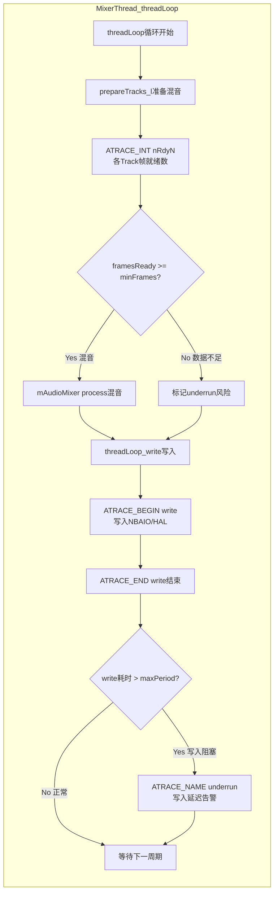

**PlaybackThread核心trace点详细说明**：

| Trace点 | API | 源码位置 | 触发条件 | perfetto中的解读 |
|---------|-----|----------|----------|-----------------|
| `"nRdy"` + TrackId | `ATRACE_INT` | [`Threads.cpp:5697-5699`](frameworks/av/services/audioflinger/Threads.cpp:5697) | prepareTracks_l中每个活跃Track | 值=帧就绪数，持续为0=App未写入 |
| `"nRdy"` + TrackId (Direct) | `ATRACE_INT` | [`Threads.cpp:6661-6663`](frameworks/av/services/audioflinger/Threads.cpp:6661) | DirectPlaybackThread prepareTracks_l | 同上，Direct线程使用 |
| `"write"` | `ATRACE_BEGIN/END` | [`Threads.cpp:3437-3449`](frameworks/av/services/audioflinger/Threads.cpp:3437) | MixerThread写入NBAIO MonoPipe | dur=写入耗时，过长=HAL阻塞 |
| `"write"` (Direct) | `ATRACE_BEGIN/END` | [`Threads.cpp:3471-3475`](frameworks/av/services/audioflinger/Threads.cpp:3471) | DirectThread写入HAL | dur=HAL write耗时 |
| `"underrun"` | `ATRACE_NAME` | [`Threads.cpp:4367`](frameworks/av/services/audioflinger/Threads.cpp:4367) | write耗时超过maxPeriod | 出现=严重写入延迟 |

> **nRdy计数器命名规则**：`nRdy` + TrackId数字，如`nRdy5`、`nRdy12`。同一Track的nRdy计数器持续下降趋向0表示App端数据供给不足，即将发生underrun。

### 15.6.3 FastMixer/FastThread Trace点

FastMixer是低延迟播放的核心路径，使用SCHED_FIFO实时调度，其trace点更精细地追踪周期时间和CPU负载。

**FastThread核心trace点**（源码：[`FastThread.cpp`](frameworks/av/services/audioflinger/FastThread.cpp)）：

| Trace点 | API | 源码位置 | 含义 |
|---------|-----|----------|------|
| `"underrun"` | `ATRACE_NAME` | [`FastThread.cpp:270`](frameworks/av/services/audioflinger/FastThread.cpp:270) | Fast路径underrun：上一cycle耗时 > mUnderrunNs阈值 |
| `mCycleMs` | `ATRACE_INT` | [`FastThread.cpp:354`](frameworks/av/services/audioflinger/FastThread.cpp:354) | 每cycle实际耗时(ms)，正常值=bufferDuration |
| `mLoadUs` | `ATRACE_INT` | [`FastThread.cpp:355`](frameworks/av/services/audioflinger/FastThread.cpp:355) | 每cycle CPU负载(μs)，loadUs/cycleNs = CPU占用比 |

**FastMixer特有trace点**（源码：[`FastMixer.cpp`](frameworks/av/services/audioflinger/FastMixer.cpp)）：

| Trace点 | API | 源码位置 | 含义 |
|---------|-----|----------|------|
| `"fRdy"` + TrackIndex | `ATRACE_INT` | [`FastMixer.cpp:424-428`](frameworks/av/services/audioflinger/FastMixer.cpp:424) | Fast Track帧就绪数，命名如fRdy0、fRdy1 |
| `"write"` | `ATRACE_BEGIN/END` | [`FastMixer.cpp:503-505`](frameworks/av/services/audioflinger/FastMixer.cpp:503) | 写入NBAIO sink的时刻和耗时 |

**FastCapture trace点**（源码：[`FastCapture.cpp`](frameworks/av/services/audioflinger/FastCapture.cpp)）：

| Trace点 | API | 源码位置 | 含义 |
|---------|-----|----------|------|
| `"read"` | `ATRACE_BEGIN/END` | [`FastCapture.cpp:185-187`](frameworks/av/services/audioflinger/FastCapture.cpp:185) | 从HAL输入源读取数据，dur=读取耗时 |

> **FastMixer与MixerThread trace区别**：MixerThread使用`nRdy`前缀，FastMixer使用`fRdy`前缀。在perfetto中通过计数器名称前缀即可区分数据来自哪条路径。

**FastMixer周期性能分析示意图**：

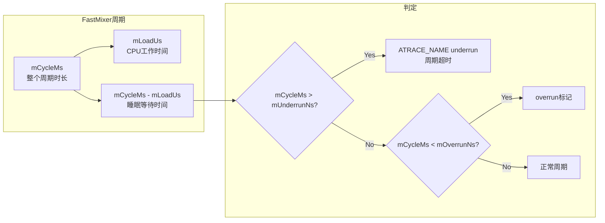

### 15.6.4 Track/PatchTrack层Trace点

Track层trace点追踪数据从App端共享内存到AudioFlinger内部管道的流转过程。

**PlaybackThread::PatchTrack trace点**（源码：[`Tracks.cpp`](frameworks/av/services/audioflinger/Tracks.cpp)）：

| Trace点 | API | 源码位置 | 含义 |
|---------|-----|----------|------|
| `"PTnReq"` + TrackId | `ATRACE_INT` | [`Tracks.cpp:2327-2329`](frameworks/av/services/audioflinger/Tracks.cpp:2327) | PatchTrack请求的帧数 |
| `"PTnObt"` + TrackId | `ATRACE_INT` | [`Tracks.cpp:2335-2337`](frameworks/av/services/audioflinger/Tracks.cpp:2335) | PatchTrack实际获得的帧数 |

**RecordThread::PatchRecord trace点**：

| Trace点 | API | 源码位置 | 含义 |
|---------|-----|----------|------|
| `"PRnObt"` + TrackId | `ATRACE_INT` | [`Tracks.cpp:2928-2930`](frameworks/av/services/audioflinger/Tracks.cpp:2928) | PatchRecord获得的帧数 |
| `"read"` | `ATRACE_NAME` | [`Tracks.cpp:3023`](frameworks/av/services/audioflinger/Tracks.cpp:3023) | PassthruPatchRecord从HAL读取数据 |

> **PTnReq vs PTnObt差异分析**：当`PTnReq` > `PTnObt`时，表示管道中数据不足，Upstream Thread写入速度不够快。如果持续出现，需要检查上游MixerThread是否存在underrun。

### 15.6.5 AudioPolicy间接追踪方法

AudioPolicy Service在AOSP14中未植入ATRACE点（`frameworks/av/services/audiopolicy/`目录无ATRACE调用），但可通过以下方式间接追踪其行为：

**方法一：MediaMetrics事件**

AudioPolicy通过mediametrics记录关键事件（源码：[`AudioPolicyInterfaceImpl.cpp:872`](frameworks/av/services/audiopolicy/service/AudioPolicyInterfaceImpl.cpp:872)），可通过`dumpsys media.metrics`查看：

```bash
# 查看AudioPolicy相关metrics
dumpsys media.metrics | grep -A 5 "audio_policy"
```

**方法二：logcat关键事件追踪**

| 事件 | logcat过滤 | 说明 |
|------|-----------|------|
| 设备连接/断开 | `logcat -s audiopolicy` | setDeviceConnectionState调用 |
| 路由决策 | `logcat -s audiopolicy AudioPolicyService` | getOutputForAttr/getInputForAttr结果 |
| 焦点变更 | `logcat -s AudioFocus MediaFocusControl` | requestAudioFocus/abandonAudioFocus |
| 音量调整 | `logcat -s AudioService` | setStreamVolume调整 |

**方法三：perfetto + logcat联动**

在perfetto抓取时同步录制logcat，通过时间戳对齐分析AudioPolicy事件与AudioFlinger trace的因果关系：

```bash
# perfetto + logcat同步采集
adb logcat -v epoch -s audiopolicy AudioService > audio_log.txt &
adb shell perfetto -c - --txt \
  buffers: { size_kb: 65536 } \
  data_sources: { config { name: "linux.ftrace" ftrace_config { 
    atrace_categories: "audio" 
  }}} \
  -t 5s -o /data/misc/perfetto-traces/audio_trace.pb
```

### 15.6.6 AAudio/Oboe Trace点

AAudio客户端库（libaaudio）在播放和录制路径上植入了详细的trace点，用于分析低延迟音频流的数据流状态。

**AAudio播放路径trace点**（源码：[`AudioStreamInternalPlay.cpp`](frameworks/av/media/libaaudio/src/client/AudioStreamInternalPlay.cpp)）：

| Trace点 | API | 源码位置 | 含义 |
|---------|-----|----------|------|
| `"aaWrNow"` | `ATRACE_BEGIN/END` | [`AudioStreamInternalPlay.cpp:137-226`](frameworks/av/media/libaaudio/src/client/AudioStreamInternalPlay.cpp:137) | 非阻塞写数据全过程，dur=写数据处理耗时 |
| `"aaUnderRuns"` | `ATRACE_INT` | [`AudioStreamInternalPlay.cpp:173`](frameworks/av/media/libaaudio/src/client/AudioStreamInternalPlay.cpp:173) | AAudio播放流underrun累计计数 |
| `"aaWrote"` | `ATRACE_INT` | [`AudioStreamInternalPlay.cpp:183`](frameworks/av/media/libaaudio/src/client/AudioStreamInternalPlay.cpp:183) | 本轮实际写入帧数，持续减少=buffer快满 |

**AAudio录制路径trace点**（源码：[`AudioStreamInternalCapture.cpp`](frameworks/av/media/libaaudio/src/client/AudioStreamInternalCapture.cpp)）：

| Trace点 | API | 源码位置 | 含义 |
|---------|-----|----------|------|
| `"aaOverRuns"` | `ATRACE_INT` | [`AudioStreamInternalCapture.cpp:121`](frameworks/av/media/libaaudio/src/client/AudioStreamInternalCapture.cpp:121) | AAudio录制流overrun累计计数 |
| `"aaRead"` | `ATRACE_INT` | [`AudioStreamInternalCapture.cpp:131`](frameworks/av/media/libaaudio/src/client/AudioStreamInternalCapture.cpp:131) | 本轮实际读取帧数 |

**AAudio通用处理路径trace点**（源码：[`AudioStreamInternal.cpp`](frameworks/av/media/libaaudio/src/client/AudioStreamInternal.cpp)）：

| Trace点 | API | 源码位置 | 含义 |
|---------|-----|----------|------|
| `"aaProc"` | `ATRACE_BEGIN/END` | [`AudioStreamInternal.cpp:792-870`](frameworks/av/media/libaaudio/src/client/AudioStreamInternal.cpp:792) | 完整processData流程（含阻塞等待），dur=总处理耗时 |
| `"aaRdy"` | `ATRACE_INT` | [`AudioStreamInternal.cpp:795`](frameworks/av/media/libaaudio/src/client/AudioStreamInternal.cpp:795) | FIFO中可用帧数，用于判断数据充裕度 |
| `"aaSlpNs"` | `ATRACE_INT` | [`AudioStreamInternal.cpp:855`](frameworks/av/media/libaaudio/src/client/AudioStreamInternal.cpp:855) | 等待唤醒前的睡眠时间(ns)，过大=调度延迟 |

**AAudio服务端（oboeservice）trace点**（源码：[`AAudioMixer.cpp`](frameworks/av/services/oboeservice/AAudioMixer.cpp)）：

| Trace点 | API | 源码位置 | 含义 |
|---------|-----|----------|------|
| `"aaMix"` | `ATRACE_BEGIN/END` | [`AAudioMixer.cpp:54`](frameworks/av/services/oboeservice/AAudioMixer.cpp:54) | AAudio服务端混音过程 |
| `"aaMixRdy#"` + 字母 | `ATRACE_INT` | [`AAudioMixer.cpp:61-64`](frameworks/av/services/oboeservice/AAudioMixer.cpp:61) | 各Stream在FIFO中的就绪帧数（aaMixRdyA, aaMixRdyB...） |

**AAudio MMAP策略配置**（源码：[`PropertyUtils.cpp`](frameworks/av/services/audioflinger/PropertyUtils.cpp)）：

| Property | 默认值 | 说明 | 影响trace表现 |
|----------|--------|------|--------------|
| `aaudio.mmap_policy` | NEVER(1) | MMAP默认策略 | AUTO/ALWAYS时出现MmapThread |
| `aaudio.mmap_exclusive_policy` | UNSPECIFIED | MMAP Exclusive策略 | ALWAYS时AAudio走exclusive路径 |
| `aaudio.mixer_bursts` | 2 | AAudio Mixer burst数 | 影响aaMix触发频率 |
| `aaudio.hw_burst_min_usec` | 1000 | 硬件burst最小时长(μs) | 影响MMAP buffer大小 |

```bash
# 查看当前AAudio property配置
adb shell getprop aaudio.mmap_policy
adb shell getprop aaudio.mmap_exclusive_policy
adb shell getprop aaudio.mixer_bursts
adb shell getprop aaudio.hw_burst_min_usec

# 启用MMAP AUTO模式（需重启audioserver）
adb shell setprop aaudio.mmap_policy 2
adb shell killall audioserver
```

**AAudio完整数据流trace链路图**：

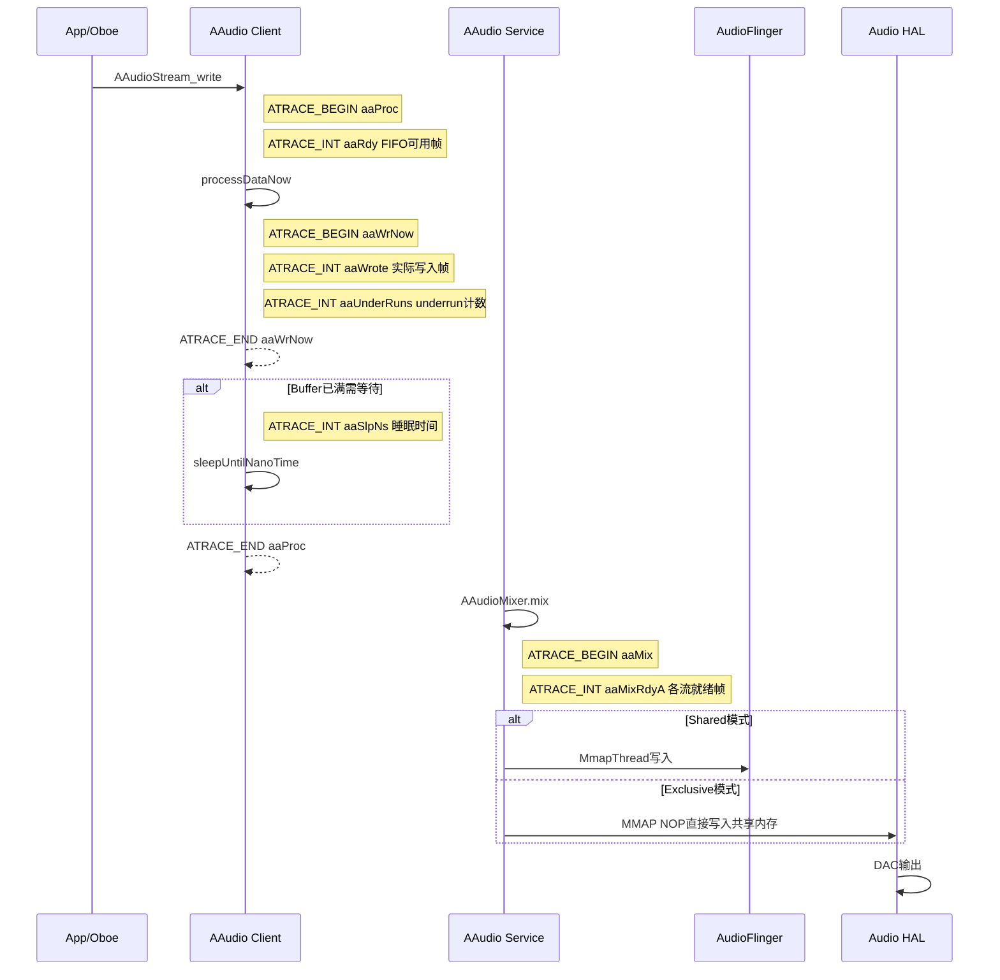

使用perfetto UI（ui.perfetto.dev）分析音频trace时，SQL查询是核心分析手段。以下提供针对音频各子系统的实用查询模板。

**查询1：AudioFlinger线程调度分析**

```sql
-- 查看AudioFlinger各线程的运行/调度状态
SELECT 
  ts,
  dur / 1e6 AS dur_ms,
  name,
  track_id
FROM slice
WHERE name IN ('write', 'underrun')
  OR name LIKE 'nRdy%'
ORDER BY ts
LIMIT 100;
```

**查询2：FastMixer周期性能统计**

```sql
-- FastMixer cycle时间和CPU负载分析
SELECT 
  ts / 1e9 AS time_sec,
  name,
  value
FROM counter
WHERE name IN ('FastMixerCycleMs', 'FastMixerLoadUs')
  OR name LIKE 'fRdy%'
ORDER BY ts
LIMIT 200;
```

**查询3：AAudio流状态追踪**

```sql
-- AAudio播放流关键指标
SELECT 
  ts / 1e9 AS time_sec,
  name,
  value
FROM counter
WHERE name IN ('aaRdy', 'aaWrote', 'aaUnderRuns', 'aaSlpNs')
ORDER BY ts
LIMIT 200;
```

**查询4：underrun事件关联分析**

```sql
-- 查找underrun slice，关联前后的nRdy计数器变化
WITH underrun_events AS (
  SELECT ts, dur, track_id
  FROM slice
  WHERE name = 'underrun'
  ORDER BY ts
  LIMIT 20
)
SELECT 
  u.ts / 1e9 AS underrun_time_sec,
  u.dur / 1e6 AS underrun_dur_ms,
  c.name AS counter_name,
  c.value AS counter_value_before_underrun
FROM underrun_events u
JOIN counter c ON c.ts BETWEEN u.ts - 100000000 AND u.ts
WHERE c.name LIKE 'nRdy%'
ORDER BY u.ts, c.name;
```

**查询5：音频线程唤醒延迟分析**

```sql
-- 分析AudioFlinger线程的调度延迟
SELECT
  ts,
  dur / 1e6 AS sched_latency_ms,
  name
FROM slice
WHERE track_id IN (
  SELECT id FROM thread_track 
  WHERE name LIKE '%AudioFlinger%' OR name LIKE '%FastMixer%'
)
AND dur > 1000000
ORDER BY dur DESC
LIMIT 50;
```

**查询6：AAudio写入性能统计**

```sql
-- AAudio aaProc完整处理时间分布
SELECT
  name,
  COUNT(*) AS count,
  AVG(dur / 1e6) AS avg_ms,
  MIN(dur / 1e6) AS min_ms,
  MAX(dur / 1e6) AS max_ms,
  P50(dur / 1e6) AS p50_ms,
  P99(dur / 1e6) AS p99_ms
FROM slice
WHERE name IN ('aaProc', 'aaWrNow', 'aaMix', 'write')
GROUP BY name;
```

### 15.6.7 播放延迟全链路Trace分析流程图

以下流程图展示从App写入到DAC输出的完整trace链路，标注了各层ATRACE点的位置和含义：

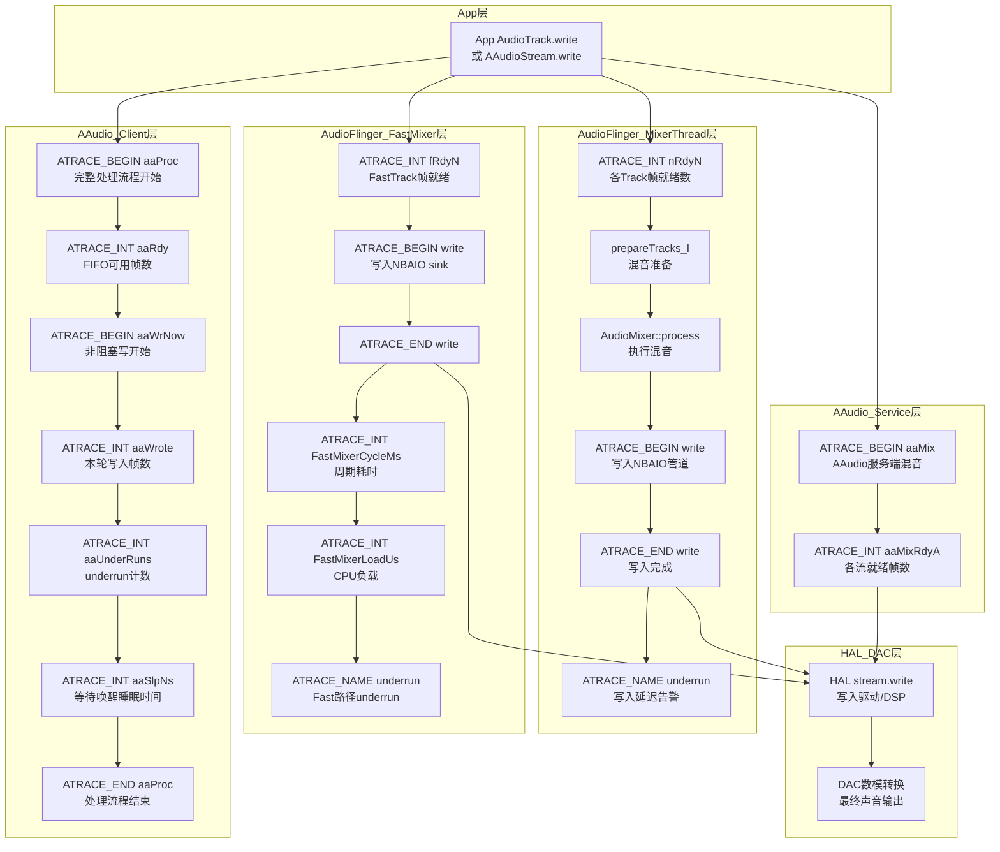

### 15.6.8 延迟分析实战：从trace到根因

**场景：音乐播放出现间歇性卡顿**

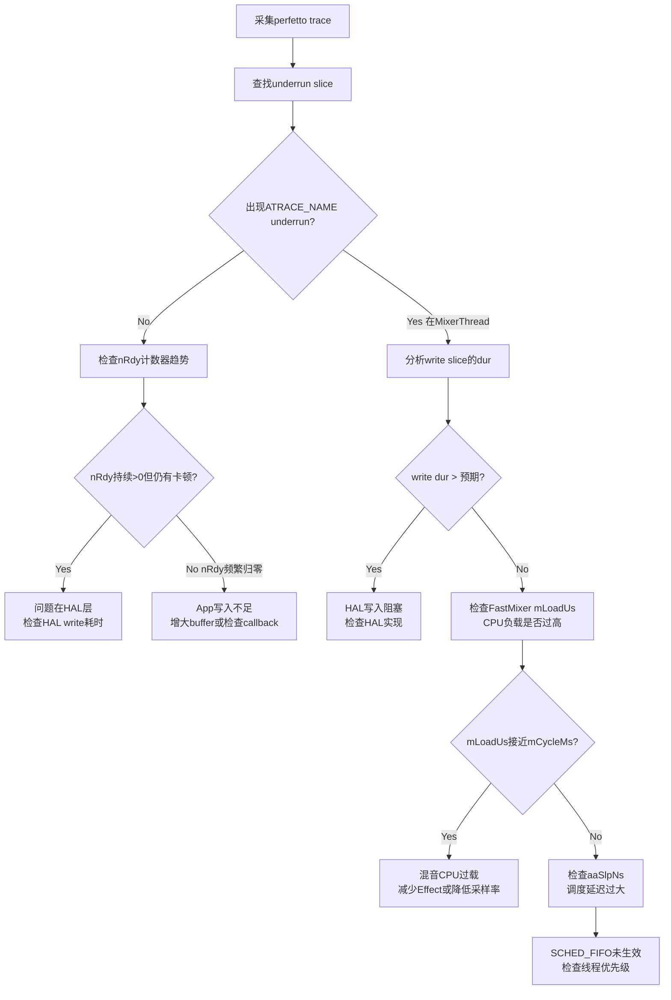

**根因分析快速参考表**：

| 症状 | 关键trace指标 | 可能根因 | 修复建议 |
|------|-------------|----------|----------|
| 偶发卡顿 | `nRdy`间歇归零 | App写入不及时 | 增大bufferSize，使用callback模式 |
| 持续卡顿 | `underrun`频繁出现 | 系统级调度问题 | 检查SCHED_FIFO，关闭CPU省电模式 |
| FastMixer underrun | `mCycleMs` > 预期 | HAL write阻塞 | 检查HAL实现，减少write耗时 |
| AAudio高延迟 | `aaSlpNs`过大 | 调度唤醒延迟 | 启用MMAP exclusive模式 |
| 混音CPU过载 | `mLoadUs`接近`mCycleMs` | Effect过多 | 减少Effect Chain，使用Offload |

---

## 15.7 AudioFlinger详细dump解读

### 15.7.1 dump调用链与层次结构

AudioFlinger的dump由`dumpsys audio`触发，整体调用链如下：

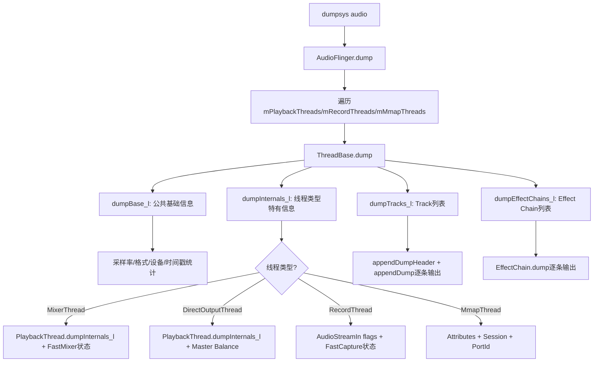

**dump入口源码**（[`Threads.cpp:945-981`](frameworks/av/services/audioflinger/Threads.cpp:945)）：

```cpp
void AudioFlinger::ThreadBase::dump(int fd, const Vector<String16>& args) {
    dprintf(fd, "\n%s thread %p, name %s, tid %d, type %d (%s):\n",
            isOutput() ? "Output" : "Input",
            this, mThreadName, getTid(), type(), threadTypeToString(type()));
    bool locked = AudioFlinger::dumpTryLock(mLock);
    if (!locked) {
        dprintf(fd, "  Thread may be deadlocked\n");  // 关键：死锁告警
    }
    dumpBase_l(fd, args);       // 公共基础字段
    dumpInternals_l(fd, args);  // 子类特有字段
    dumpTracks_l(fd, args);     // Track列表
    dumpEffectChains_l(fd, args); // Effect Chain列表
    // ...
    mLocalLog.dump(fd, "   " /* prefix */, 40 /* lines */); // 最近40条本地日志
}
```

> **调试要点**：如果dump输出中出现`Thread may be deadlocked`，说明该线程持有mLock超过3秒，极有可能存在死锁问题，需结合`mLocalLog`最后几条记录定位。

### 15.7.2 dumpBase_l公共字段详解

所有Thread类型共享的基础字段（[`Threads.cpp:983-1054`](frameworks/av/services/audioflinger/Threads.cpp:983)）：

| 字段 | 含义 | 正常参考值 | 异常关注点 |
|------|------|-----------|-----------|
| I/O handle | 线程唯一io_handle | 正整数 | 用于跨服务定位线程 |
| Standby | 是否待机 | 活跃时=no | 活跃播放时应=no |
| Sample rate | 线程采样率 | 48000 Hz | 与HAL配置一致 |
| HAL frame count | HAL缓冲区帧数 | 960/1920 | 影响延迟 |
| HAL format | HAL音频格式 | 0x5 (PCM_FLOAT) | 与Device能力匹配 |
| HAL buffer size | HAL缓冲区字节 | 7680 | =frameCount×frameSize |
| Channel count | 通道数 | 2(立体声) | 与Channel mask对应 |
| Channel mask | 通道掩码 | 0x3(STEREO) | 影响混音路径 |
| Processing format | 内部处理格式 | 0x5 (PCM_FLOAT) | MixerThread固定PCM_FLOAT |
| Processing frame size | 处理帧字节 | 8(2ch×4B) | =chCount×bytesPerSample |
| Output devices | 输出设备类型 | SPEAKER等 | 音频路由目标 |
| Input device | 输入设备类型 | BUILTIN_MIC等 | 录音源 |
| Audio source | 音频源 | VOICE_RECOGNITION等 | 影响HAL预处理 |
| Timestamp stats | 时间戳统计 | variance小 | 方差大=时钟漂移 |
| Last write/read occurred | 最近IO时间(ms) | <50ms | >500ms可能线程卡住 |
| Process time ms stats | 处理耗时统计 | mean<5ms | mean>10ms=CPU负载高 |
| Hal write/read jitter ms | HAL IO抖动统计 | std<2ms | std>5ms=调度不稳定 |
| Threadloop latency stats | 线程循环延迟 | mean<20ms | mean>40ms=延迟过高 |
| Monopipe pipe depth stats | 管道深度统计 | mean接近0 | 深度大=Fast路径瓶颈 |

> **关键统计字段**：`Process time ms stats`和`Hal jitter ms stats`是AOSP14新增的统计字段，格式为`n=N, mean=X.X, min=X.X, max=X.X, variance=X.X`，方差(variance)是判断系统稳定性的重要指标。

### 15.7.3 各线程类型dumpInternals_l差异

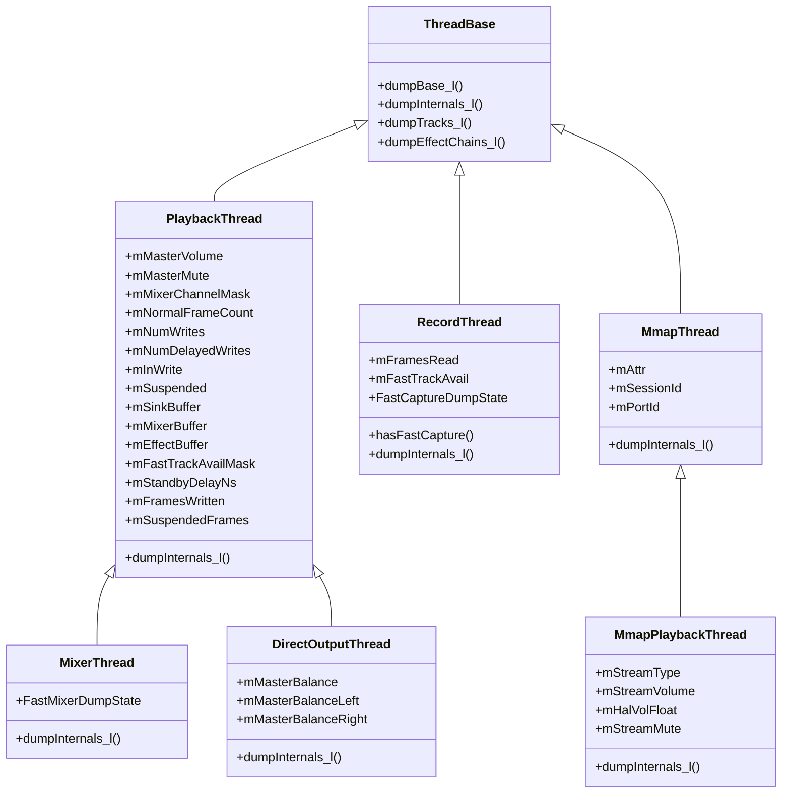

**PlaybackThread特有字段**（[`Threads.cpp:2283-2316`](frameworks/av/services/audioflinger/Threads.cpp:2283)）：

| 字段 | 含义 | 调试关注点 |
|------|------|-----------|
| Master volume | 主音量值(0.0-1.0) | 为0时所有Track静音 |
| Master mute | 主静音状态(on/off) | on时所有Track静音 |
| Mixer channel Mask | 混音通道掩码 | 影响下混策略 |
| Haptic channel mask | 触觉通道掩码 | 非NONE时有触觉通道 |
| Normal frame count | 正常模式帧数 | 960=20ms@48kHz |
| Total writes | threadLoop总写入次数 | 持续增长=线程正常 |
| Delayed writes | 延迟写入次数 | >0表示写入跟不上 |
| Blocked in write | 当前是否写阻塞 | yes=线程卡在HAL写入 |
| Suspend count | 挂起计数 | >0=线程被挂起 |
| Sink buffer | 混音输出buffer指针 | 用于内存诊断 |
| Mixer buffer | 混音工作buffer指针 | 非NULL=使用float混音 |
| Effect buffer | Effect工作buffer指针 | 非NULL=有Effect处理 |
| Fast track availMask | 可用Fast Track位图 | 0xFF=8个Fast Track全可用 |
| Standby delay ns | 待机超时(纳秒) | 通常3秒 |
| Frames written | 已写入总帧数 | 用于计算播放时长 |
| Suspended frames | 挂起期间丢失帧数 | >0=有播放中断 |
| PipeSink frames written | 管道写入帧数 | FastMixer管道指标 |
| AudioStreamOut flags | HAL输出流标志 | 含FAST=支持低延迟 |

**DirectOutputThread额外字段**（[`Threads.cpp:6457-6462`](frameworks/av/services/audioflinger/Threads.cpp:6457)）：

| 字段 | 含义 | 调试关注点 |
|------|------|-----------|
| Master balance | 主平衡值(-1.0~1.0) | 0=居中 |
| Left | 左声道增益 | 受balance影响 |
| Right | 右声道增益 | 受balance影响 |

**RecordThread特有字段**（[`Threads.cpp:9125-9151`](frameworks/av/services/audioflinger/Threads.cpp:9125)）：

| 字段 | 含义 | 调试关注点 |
|------|------|-----------|
| AudioStreamIn flags | HAL输入流标志 | FAST=低延迟录制 |
| Frames read | 已读取总帧数 | 用于计算录制时长 |
| Fast capture thread | 是否有FastCapture | yes=低延迟录制路径 |
| Fast track available | Fast Track是否可用 | no=Fast路径被占用 |

**MmapThread特有字段**（[`Threads.cpp:10604-10612`](frameworks/av/services/audioflinger/Threads.cpp:10604)）：

| 字段 | 含义 | 调试关注点 |
|------|------|-----------|
| Attributes content type | 内容类型 | SPEECH/MUSIC等 |
| Attributes usage | 用途 | MEDIA/VOICE_COMMUNICATION等 |
| Attributes source | 音频源 | MIC/VOICE_COMMUNICATION等 |
| Session | Session ID | 与AAudio流对应 |
| Port Id | Audio Port ID | 路由标识 |

**MmapPlaybackThread额外字段**（[`Threads.cpp:10912-10919`](frameworks/av/services/audioflinger/Threads.cpp:10912)）：

| 字段 | 含义 | 调试关注点 |
|------|------|-----------|
| Stream type | 流类型 | 通常MUSIC |
| Stream volume | 流音量 | 0.0-1.0 |
| HAL volume | HAL侧音量 | 与Stream volume不同=HAL控制 |
| Stream mute | 流静音 | true=该流静音 |

### 15.7.4 Track dump完整字段说明

Track dump格式由[`Tracks.cpp:790-927`](frameworks/av/services/audioflinger/Tracks.cpp:790)定义，采用定宽列格式输出。

**Track dump输出结构**：

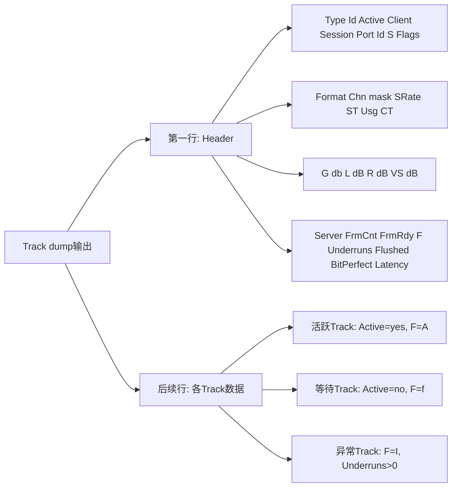

**Header格式**：
```
Type Id Active Client Session Port Id S Flags   Format Chn mask SRate
ST Usg CT  G db L dB R dB VS dB   Server FrmCnt FrmRdy F Underruns Flushed BitPerfect Latency
```

**字段详解**（源码：[`Tracks.cpp:878-927`](frameworks/av/services/audioflinger/Tracks.cpp:878)）：

| 字段 | 含义 | 输出格式 | 调试关注点 |
|------|------|---------|-----------|
| Type | Track类型 | S=Static,P=Patch,F=Fast | Fast=低延迟路径 |
| Id | Track唯一ID | %6u | 定位特定Track |
| Active | 是否活跃 | yes/no | 活跃Track应被混合 |
| Client | 客户端PID | %7u | 确认是哪个App |
| Session | 音频Session ID | %7u | 关联Effect Chain |
| Port Id | Audio Port ID | %7u | 路由到特定设备 |
| S | Track状态码 | 2字符 | 见下方状态码表 |
| Flags | CBLK mFlags | 0x03X | 含underrun标志 |
| Format | 音频格式 | 0xXXXXXXXX | 不匹配=重采样 |
| Chn mask | 通道掩码 | 0xXXXXXXXX | 不匹配=重采样 |
| SRate | 采样率 | %6u | ≠线程采样率=重采样 |
| ST | Stream Type | %2u | 音频流类型 |
| Usg | AudioAttributes.usage | %3x | 用途属性(hex) |
| CT | content_type | %2x | 内容类型(hex) |
| G db | 最终增益 | %5.2g dB | -inf=被静音 |
| L dB | 左声道客户端音量 | %5.2g dB | 客户端侧音量 |
| R dB | 右声道客户端音量 | %5.2g dB | 客户端侧音量 |
| VS dB | VolumeShaper音量 | %5.2g dB+标记 | A=VolumeShaper活跃 |
| Server | CBLK mServer位置 | %08X | 服务端写位置(hex) |
| FrmCnt | Buffer帧数 | %6zu+修饰符 | r=缩减,e=错误 |
| FrmRdy | 帧就绪数 | %6zu | 0=underrun风险 |
| F | 填充状态 | 单字符 | 见下方填充状态表 |
| Underruns | underrun帧计数 | %9u+修饰符 | >0=数据饥饿 |
| Flushed | flush帧计数 | %7u | 频繁flush=播放中断 |
| BitPerfect | BitPerfect模式 | true/false | 直通模式标志 |
| Latency | 延迟值 | %7.2lf+来源标记 | t=track时间戳,k=kernel |

**Track状态码（S字段）**：

| 状态码 | 含义 | 说明 |
|--------|------|------|
| ID | IDLE | Track已创建但未启动 |
| R | RESUMING | 从暂停恢复中 |
| ST | STARTED | Track已启动 |
| PA | PAUSING | 正在暂停 |
| ST | STOPPED | Track已停止 |
| FL | FLUSHED | Track已刷新 |
| JR | JITTER_UNDERRUN | 轻微数据不足 |
| UR | UNDERRUN | 严重数据不足 |

**填充状态（F字段）**（[`Tracks.cpp:840-858`](frameworks/av/services/audioflinger/Tracks.cpp:840)）：

| 状态码 | 枚举值 | 含义 |
|--------|--------|------|
| f | FS_FILLING | 正在填充，数据不足 |
| F | FS_FILLED | 填充完成 |
| A | FS_ACTIVE | 活跃播放中 |
| I | FS_INVALID | 无效状态，需关注 |

**Latency来源标记**（[`Tracks.cpp:915-925`](frameworks/av/services/audioflinger/Tracks.cpp:915)）：

| 标记 | 含义 | 精度 |
|------|------|------|
| t | 从track时间戳计算 | 最精确，基于HAL presentation时间 |
| k | 从kernel估算 | 精度较低，基于write位置 |
| unavail | 不可用 | mServer!=0但计算失败 |
| new | 新Track | mServer==0，尚未播放 |

> **实战解读示例**：
> ```
>   F   2 yes   12345  10001  42  ID 0x000 00000005 00000003  48000  3   1  2  -2.1 -4.2 -4.2 -1.5A 00001000   960  480 A         0         0    false    3.42 t
> ```
> 解读：Fast Track, ID=2, 活跃, PID=12345, Session=10001, Port=42, 状态IDLE(?),
> PCM_FLOAT格式(0x5), STEREO(0x3), 48kHz, StreamType=3, usage=1, contentType=2,
> 最终增益-2.1dB, 左右声道-4.2dB, VolumeShaper-1.5dB(活跃),
> Server位置0x1000, FrmCnt=960, FrmRdy=480(半满), 填充状态Active,
> 无underrun, 无flush, 非BitPerfect, 延迟3.42ms(来自track时间戳)

### 15.7.5 Effect Chain dump解读

Effect Chain dump格式（源码：[`Effects.cpp:2704-2741`](frameworks/av/services/audioflinger/Effects.cpp:2704)）：

```
N effects for session S
  In buffer [frameInfo]   Out buffer [frameInfo]   Active tracks: M
  Effect N: [uuid] [name] [state] [framesIn] [framesOut]
```

**Effect Chain与Track的绑定关系**：

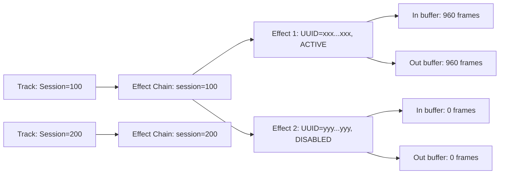

**关键字段解读**：

| 字段 | 含义 | 调试关注点 |
|------|------|-----------|
| session | 音频Session ID | 必须与Track Session ID对应 |
| Active tracks | 被处理的活跃Track数 | =0时Effect Chain应进入idle |
| In buffer | 输入buffer帧信息和格式 | 格式=Effect输入要求 |
| Out buffer | 输出buffer帧信息和格式 | 格式≠In buffer=有格式转换 |
| Effect UUID | Effect唯一标识 | 用于确认Effect类型 |
| Effect name | Effect名称 | 直观识别Effect类型 |
| Effect state | 处理状态 | 只有ACTIVE才处理音频 |
| framesIn/framesOut | Effect帧计数 | 差异=Effect引入延迟 |

**Effect状态枚举**：

| 状态 | 含义 | 音频处理 |
|------|------|---------|
| ACTIVE | 活跃 | 正在处理音频 |
| INITIALIZED | 已初始化 | 不处理，等待激活 |
| DISABLED | 已禁用 | 不处理，被App禁用 |
| UNINITIALIZED | 未初始化 | 不可用 |

> **延迟诊断**：如果framesIn和framesOut持续不等（差异>0），说明Effect引入了额外延迟。对于低延迟场景（如VoIP），需评估是否应绕过Effect Chain。

### 15.7.6 Patch Panel dump解读

Patch Panel dump（源码：[`PatchPanel.cpp:912-946`](frameworks/av/services/audioflinger/PatchPanel.cpp:912)）展示当前所有Audio Patch连接：

```
Patches:
  Patch handle N: [source ports] -> [sink ports] [type]
Tracked inserted modules:
  Module: [name] [handle] [streams]
```

**Audio Patch类型与数据流**：

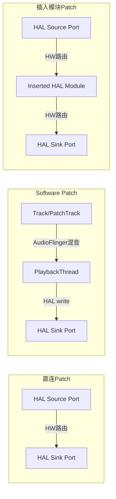

**关键字段解读**：

| 字段 | 含义 | 调试关注点 |
|------|------|-----------|
| Patch handle | Patch唯一句柄 | 用于跨服务追踪 |
| Source ports | Patch源端口列表 | 含Audio Port ID和设备类型 |
| Sink ports | Patch目的端口列表 | 含Audio Port ID和设备类型 |
| Patch type | 类型标识 | Software=需线程转发 |
| Inserted modules | 插入的HAL模块 | 影响音频路径和延迟 |

**Software Patch vs 直连Patch**：
- **直连Patch**：HAL内部路由，零额外延迟，AudioFlinger仅创建路由不参与数据传输
- **Software Patch**：需要AudioFlinger内部线程（PatchTrack→PlaybackThread）转发数据，存在混音延迟
- **判断方法**：dump中标注`software`字样或source/sink涉及软件端口

> **实战场景**：AAOS中多Zone音频通常使用Software Patch，通过PatchTrack将一个Zone的输出转发到另一个Zone的输入，需关注PatchTrack的FrmRdy和Underruns字段。

### 15.7.7 MelReporter/SoundDose dump解读

MelReporter负责CSD（Cumulative Sound Dose）计算，用于EU听力保护合规（源码：[`MelReporter.cpp`](frameworks/av/services/audioflinger/MelReporter.cpp)）：

```
Sound Dose:
  CSD enabled: true/false
  Use HAL Sound Dose: true/false
  MEL values: [list of MEL recordings]
  CSD value: X (cumulative dose)
```

**听力保护数据流**：

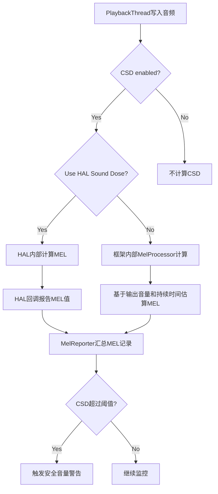

**关键字段解读**：

| 字段 | 含义 | 调试关注点 |
|------|------|-----------|
| CSD enabled | 是否启用听力保护 | EU设备应为true |
| Use HAL Sound Dose | HAL是否负责MEL计算 | true=HAL计算更精确 |
| MEL values | 瞬时声音暴露级别记录 | 每条记录含时间和MEL值 |
| CSD value | 累积声音暴露值 | 超过阈值触发警告 |

> **OEM注意**：EU标准EN 50332-3要求CSD合规。如果`Use HAL Sound Dose=false`，框架基于输出音量估算MEL，精度较低。建议HAL实现ISoundDose接口提供精确MEL值。

### 15.7.8 dump解析决策树

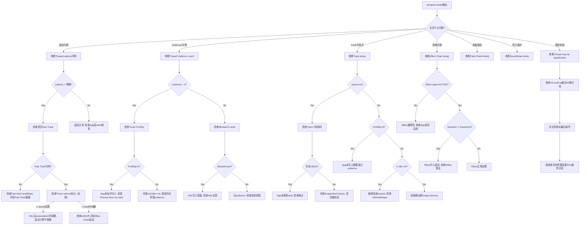

### 15.7.9 dump实战分析案例

**案例1：音乐播放underrun诊断**

```
Output thread 0x7f8c1234000, name AudioOut_D, tid 1234, type 0 (MixerThread):
  ...
  Total writes: 123456
  Delayed writes: 47           ← 延迟写入47次
  Blocked in write: yes        ← 当前写阻塞
  ...
  2 Tracks of which 2 are active
    F   1 yes  10123  1001  10  ID 0x000 00000005 00000003  48000 ...
       ... 00005000   960     0 f        15         0    false   28.50 t
                                                                    ↑ FrmRdy=0  ↑ underrun
```

**诊断步骤**：
1. `Blocked in write: yes` → HAL写入阻塞，threadLoop卡在`mOutput->write()`
2. `FrmRdy=0` + `F=f` → Track数据饥饿，App未及时写入
3. `Underruns=15` → 已发生15次underrun
4. `Latency=28.50 t` → 延迟28.5ms，高于Fast路径典型值(<10ms)
5. **根因**：App写入线程优先级不够或被GC暂停

**案例2：录音无数据诊断**

```
Input thread 0x7f8c5678000, name AudioIn_1, tid 5678, type 1 (RecordThread):
  AudioStreamIn: 0x7f8c1111111 flags 0x1 (FAST)
  Frames read: 0               ← 未读取任何帧
  No active record clients     ← 无活跃录音客户端
  Fast capture thread: yes
  Fast track available: yes
```

**诊断步骤**：
1. `Frames read: 0` → HAL未提供任何数据
2. `No active record clients` → 无活跃RecordTrack
3. **根因**：App创建了AudioRecord但未调用start()，或焦点未获得

**案例3：AAOS多Zone音频路由诊断**

```
Patches:
  Patch handle 15: [port 3 (bus_100_media_out)] -> [port 7 (bus_200_zone2_in)] [software]
  Patch handle 16: [port 4 (bus_101_nav_out)] -> [port 8 (bus_201_zone2_nav_in)] [software]
```

**诊断步骤**：
1. 两个Patch都是`[software]` → 通过AudioFlinger PatchTrack转发
2. 如果Zone2听不到导航声：
   - 检查Patch handle 16的PatchTrack FrmRdy是否为0
   - 检查Zone2的PlaybackThread是否活跃
   - 检查CarVolumeGroup中Navigation Context的音量

---

## 15.8 AAOS CarAudio调试

### 15.8.1 CarAudioFocus调试

AAOS音频焦点通过CarAudioFocus管理，调试时需检查焦点栈和交互规则。

**焦点调试命令**：

```bash
# 查看当前焦点栈
adb shell dumpsys car_audio focus

# 查看焦点历史记录
adb shell dumpsys car_audio focus_history

# 监听焦点变化
adb logcat -s CarAudioFocus
```

**CarAudioFocus dump输出结构**：

```
Car Audio Focus:
  Focus stack size: N
  Focus entries:
    Entry 1: [clientId] [attribute] [focusGain] [lostFocus]
    Entry 2: [clientId] [attribute] [focusGain] [lostFocus]
    ...
  Rejected focus: [clientId] [attribute] [focusRequest]
  Pending focus: [clientId] [attribute] [focusRequest]
```

**焦点交互矩阵验证**：

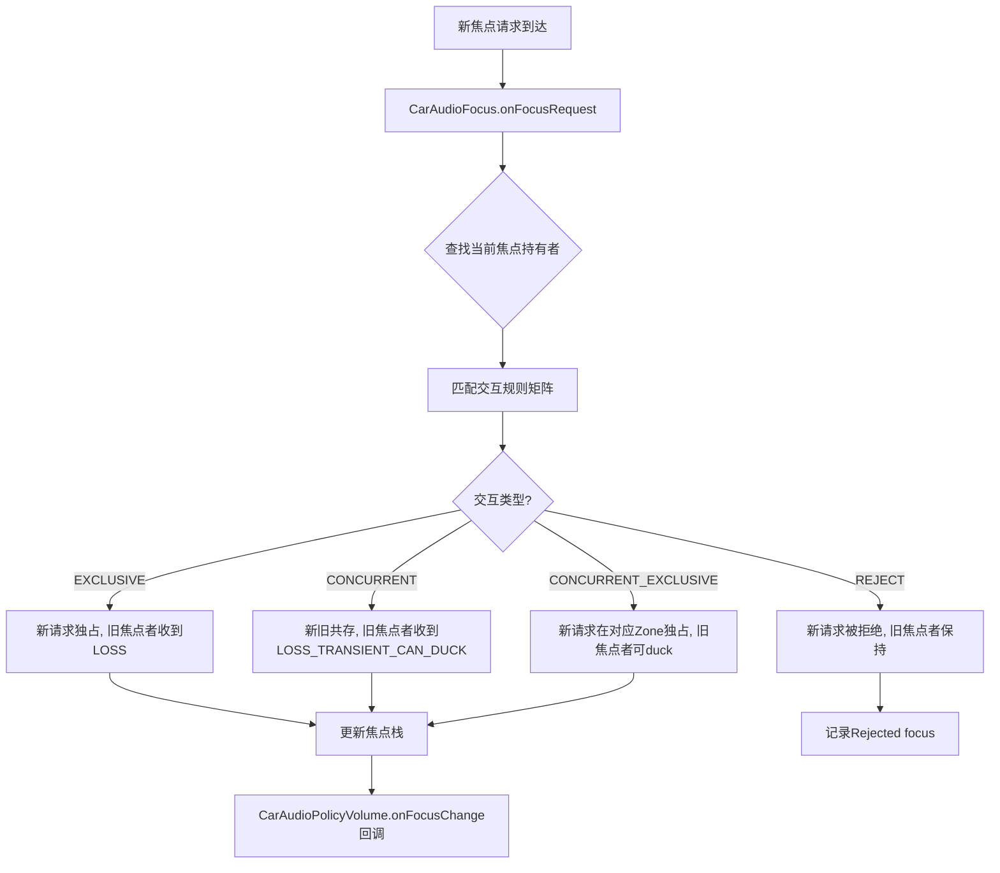

> **常见焦点问题**：
> 1. 导航播报无法打断媒体 → 检查交互规则中NAVIGATION vs MEDIA的配置
> 2. 电话铃声无焦点 → 检查RING电话属性是否在焦点交互矩阵中
> 3. 多Zone焦点冲突 → 每个Zone有独立焦点栈，检查Zone间焦点转发逻辑

### 15.8.2 CarVolumeGroup调试

CarVolumeGroup管理音量分组和增益曲线。

**音量调试命令**：

```bash
# 查看所有Volume Group配置
adb shell dumpsys car_audio volume_groups

# 查看当前音量设置
adb shell dumpsys car_audio volumes

# 设置Zone 0的Media音量组到50%
adb shell cmd car_audio set_volume_zone_id 0 group_id 0 index 50

# 获取增益曲线配置
adb shell dumpsys car_audio gain_curve
```

**CarVolumeGroup dump输出**：

```
Car Volume Groups:
  Zone 0:
    Volume Group 0 (Media):
      Contexts: MUSIC, AUDIO_FOCUS
      Devices: bus_0_media_out
      Min gain: -80dB  Max gain: 0dB  Step: 1dB
      Current index: 70/100  Volume: -10dB
      Muted: false
      Gain curve: linear (min=-80dB, max=0dB, steps=100)
    Volume Group 1 (Navigation):
      Contexts: NAVIGATION
      Devices: bus_1_navigation_out
      ...
  Zone 1:
    Volume Group 0 (Media):
      ...
```

**增益曲线类型与适用场景**：

| 曲线类型 | 特征 | 适用场景 | 配置方法 |
|----------|------|---------|---------|
| Linear | 线性映射 | 通用场景 | 默认配置 |
| Logarithmic | 对数映射 | 人耳感知线性 | `car_volume_config.xml` |
| Exponential | 指数映射 | 低音量精细控制 | `car_volume_config.xml` |
| Piecewise | 分段线性 | 自定义映射 | `car_volume_config.xml` |

> **OEM定制要点**：
> 1. 增益曲线应在`car_volume_config.xml`中配置，而非硬编码
> 2. 每个Volume Group的Min/Max增益需与HAL bus设备增益范围匹配
> 3. 建议Navigation和Emergency组使用较陡的曲线，确保低音量时可听

### 15.8.3 CarAudioZone调试

CarAudioZone管理多区域音频路由，每个Zone有独立的PlaybackThread和Volume Group。

**Zone调试命令**：

```bash
# 查看所有Zone配置
adb shell dumpsys car_audio zones

# 查看Zone间音频路由
adb shell dumpsys car_audio routing

# 将音频流路由到Zone 1
adb shell cmd car_audio route_stream_zone_id MUSIC 1

# 查看当前Zone的活跃PlaybackThread
adb shell dumpsys audio | grep "AudioOut_" | grep "zone"
```

**CarAudioZone dump输出**：

```
Car Audio Zones:
  Zone 0 (Primary Zone):
    Zone Id: 0
    Occupant Zone Ids: [0]
    Audio Zones: [0]
    Volume Groups: [0, 1, 2, 3, 4]
    Input Audio Devices: [bus_100_media_in]
    Output Audio Devices: [bus_0_media_out, bus_1_navigation_out, ...]
    Playback Threads: [AudioOut_D, AudioOut_11]
  Zone 1 (Secondary Zone):
    Zone Id: 1
    Occupant Zone Ids: [1]
    Volume Groups: [0, 1]
    Input Audio Devices: [bus_200_zone2_in]
    Output Audio Devices: [bus_10_zone2_out, bus_11_zone2_nav_out]
    Playback Threads: [AudioOut_17, AudioOut_18]
```

**多Zone音频路由流程**：

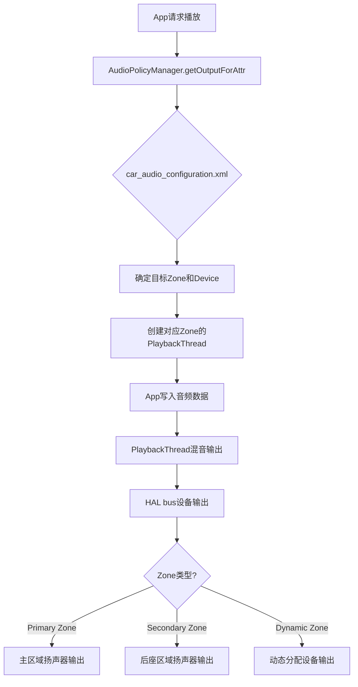

> **常见Zone问题**：
> 1. Zone 1无法播放 → 检查PlaybackThread是否创建，HAL bus是否可用
> 2. 音频串Zone → 检查car_audio_configuration.xml中Zone和Device绑定是否正确
> 3. 焦点跨Zone → 每个Zone独立焦点栈，检查CarAudioFocus的Zone间转发逻辑

### 15.8.4 AudioControl HAL调试

AudioControl HAL是AAOS特有的HAL接口，负责车辆音频焦点请求和音量控制。

**AudioControl HAL版本对比**：

| 版本 | 接口 | 主要功能 | AOSP14支持 |
|------|------|---------|-----------|
| V1.0 | IAudioControl | 短暂焦点、音量变化 | 已弃用 |
| V2.0 | IAudioControl | 焦点请求+duck、音量变化 | 兼容模式 |
| V3.0 | IAudioControl | Zone感知焦点、音量调节 | 推荐使用 |

**AudioControl HAL调试命令**：

```bash
# 查看AudioControl HAL状态
adb shell dumpsys car_audio audio_control_hal

# 查看HAL焦点请求记录
adb shell dumpsys car_audio hal_focus_requests

# 监听HAL焦点回调
adb logcat -s AudioControlHal AudioControl

# 测试HAL焦点请求
adb shell cmd car_audio request_hal_focus NAVIGATION PERMANENT zone_id=0

# 测试HAL音量变化通知
adb shell cmd car_audio notify_hal_volume_change 0 0 50
```

**AudioControl HAL焦点请求流程**：

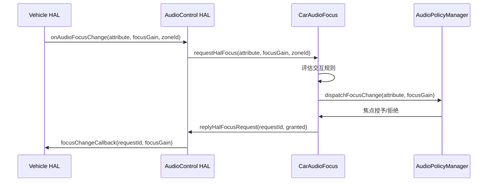

**关键调试点**：

| 检查项 | 方法 | 正常期望 | 异常处理 |
|--------|------|---------|---------|
| HAL是否加载 | `dumpsys car_audio audio_control_hal` | 显示V3.0版本 | 检查HAL模块配置 |
| 焦点请求是否到达 | `logcat -s AudioControlHal` | 收到onAudioFocusChange | 检查VHAL是否发送焦点请求 |
| 焦点授予回调 | `dumpsys car_audio hal_focus_requests` | requestId匹配 | 检查replyHalFocusRequest是否调用 |
| 音量通知是否工作 | `cmd car_audio notify_hal_volume_change` | 音量变化生效 | 检查CarVolumeGroup回调 |
| Duck是否触发 | `dumpsys car_audio duck_state` | 被duck的Stream静音 | 检查duck交互规则 |

> **OEM注意**：AudioControl HAL V3.0新增了zoneId参数，OEM需确保HAL实现正确传递zoneId。如果zoneId=-1（无效值），CarAudioFocus会拒绝请求。

### 15.8.5 CarAudio综合调试决策树

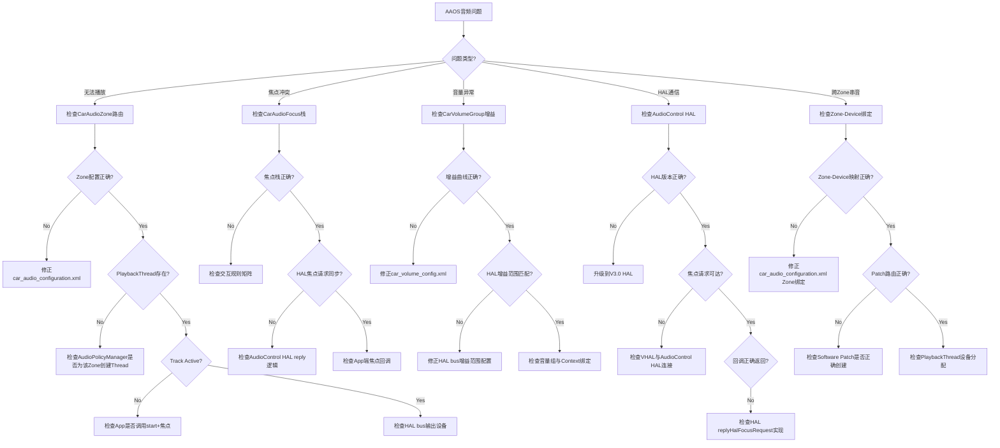

### 15.8.6 AAOS音频调试命令速查表

| 命令 | 功能 | 关键参数 |
|------|------|---------|
| `dumpsys car_audio` | CarAudio全量状态 | 无 |
| `dumpsys car_audio focus` | 焦点栈详情 | 无 |
| `dumpsys car_audio volume_groups` | 音量组配置 | zone_id |
| `dumpsys car_audio zones` | Zone配置详情 | 无 |
| `dumpsys car_audio routing` | 音频路由详情 | 无 |
| `dumpsys car_audio audio_control_hal` | HAL状态 | 无 |
| `cmd car_audio set_volume_zone_id` | 设置音量 | zone_id, group_id, index |
| `cmd car_audio request_hal_focus` | 测试HAL焦点 | attribute, duration, zone_id |
| `cmd car_audio notify_hal_volume_change` | 测试HAL音量通知 | zone_id, group_id, index |
| `dumpsys audio \| grep AudioOut` | 查看PlaybackThread | 无 |
| `dumpsys audio \| grep AudioIn` | 查看RecordThread | 无 |
| `logcat -s CarAudioFocus CarAudioPolicyVolume` | 监听焦点/音量日志 | 无 |
| `logcat -s AudioControlHal AudioControl` | 监听HAL日志 | 无 |

---

## 15.9 AudioPolicy配置验证

### 15.9.1 audio_policy_configuration.xml验证

AudioPolicy配置文件是音频系统的核心配置，定义了设备、路由、格式等规则。

**配置验证方法**：

```bash
# 方法1：检查AudioPolicyManager加载日志
adb logcat -s AudioPolicyManager AudioPolicyConfig

# 方法2：查看已加载的配置摘要
adb shell dumpsys audio | head -100

# 方法3：直接查看配置文件
adb shell cat /vendor/etc/audio_policy_configuration.xml

# 方法4：验证配置是否被正确解析
adb shell dumpsys audio policy_rules
```

**配置文件关键验证点**：

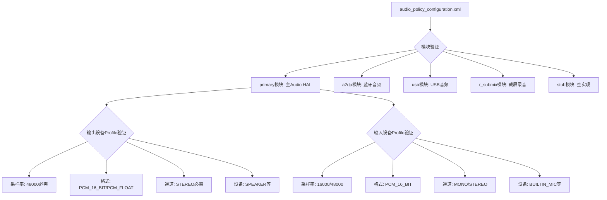

**常见配置错误与修复**：

| 错误类型 | 症状 | 诊断方法 | 修复方案 |
|----------|------|---------|---------|
| 缺少必需采样率 | 某格式播放失败 | 检查Profile的sampleRates | 添加48000Hz |
| 缺少必需格式 | AudioTrack创建失败 | 检查Profile的formats | 添加PCM_16_BIT |
| 通道掩码不匹配 | 单/双声道路由错误 | 检查Profile的channelMasks | 添加STEREO |
| 设备未声明 | 音频无法路由到设备 | 检查attachedDevices | 添加设备到列表 |
| 缺少defaultOutputDevice | 无默认输出 | 检查defaultOutputDevice | 设置SPEAKER |
| module版本不匹配 | HAL加载失败 | 检查halVersion | 匹配HAL实现版本 |
| 地址缺失 | USB/A2DP无法路由 | 检查address属性 | 添加MAC/USB地址 |

> **AOSP14变化**：AIDL Audio HAL要求module版本为`3.0`或更高，HIDL版本为`2.0`。如果配置文件halVersion与实际HAL实现不匹配，AudioFlinger会拒绝加载该模块。

### 15.9.2 car_audio_configuration.xml验证

AAOS特有的CarAudio配置文件，定义Zone、Volume Group和Device绑定。

**配置验证命令**：

```bash
# 查看CarAudio配置加载日志
adb logcat -s CarAudioService CarAudioConfiguration

# 查看已加载的CarAudio配置
adb shell dumpsys car_audio

# 查看原始配置文件
adb shell cat /vendor/etc/car_audio_configuration.xml

# 验证Zone与设备绑定
adb shell dumpsys car_audio zones
```

**car_audio_configuration.xml结构验证**：

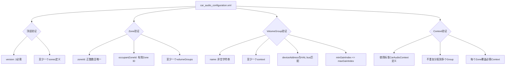

**AAOS配置常见错误**：

| 错误类型 | 症状 | 诊断方法 | 修复方案 |
|----------|------|---------|---------|
| Zone ID冲突 | Zone无法初始化 | 检查zoneId唯一性 | 修改重复的zoneId |
| Context分配冲突 | 音频路由到错误Zone | 检查Context在VolumeGroup间分配 | 确保Context唯一归属 |
| Device Address不匹配 | HAL bus找不到 | 对比配置与HAL bus列表 | 修正deviceAddress |
| 缺少必需Context | 某音频流无法路由 | 检查EMERGENCY/SAFETY等 | 添加缺失Context |
| Volume步骤为0 | 音量无法调节 | 检查step值 | 设置>=1的步长 |
| version字段缺失 | 配置解析失败 | 检查根元素version属性 | 添加version="2" |
| OccupantZoneId无效 | 乘客音频无法路由 | 检查OccupantZone分配 | 确保Zone ID有效 |

> **OEM定制要点**：
> 1. `version="2"`是AAOS CarAudio V2配置格式的必需属性
> 2. 每个VolumeGroup必须绑定一个HAL bus设备地址
> 3. EMERGENCY和SAFETY Context建议分配到独立VolumeGroup
> 4. 动态Zone（Dynamic Audio Zone）需在配置中声明`isDynamic="true"`

### 15.9.3 配置验证自动化脚本

```bash
#!/bin/bash
# audio_policy_validator.sh — AudioPolicy配置验证脚本
# 用法: ./audio_policy_validator.sh [device_serial]

DEVICE=${1:-""}
ADB="adb ${DEVICE:+-s $DEVICE}"

echo "=== AudioPolicy配置验证 ==="

# 1. 检查配置文件是否存在
echo "[1] 检查配置文件..."
for f in \
  /vendor/etc/audio_policy_configuration.xml \
  /vendor/etc/car_audio_configuration.xml \
  /vendor/etc/audio_policy_volumes.xml \
  /vendor/etc/default_volume_tables.xml; do
  if $ADB shell test -f $f && echo "$f: EXISTS" || echo "$f: MISSING"; then
    :
  fi
done

# 2. 验证primary模块
echo -e "\n[2] 验证primary模块..."
$ADB shell cat /vendor/etc/audio_policy_configuration.xml | \
  grep -q '<module name="primary"' && echo "primary module: OK" || echo "primary module: MISSING!"

# 3. 检查必需输出设备
echo -e "\n[3] 检查必需输出设备..."
for dev in SPEAKER; do
  $ADB shell cat /vendor/etc/audio_policy_configuration.xml | \
    grep -q "$dev" && echo "$dev: OK" || echo "$dev: MISSING!"
done

# 4. 验证采样率
echo -e "\n[4] 验证48kHz采样率支持..."
$ADB shell cat /vendor/etc/audio_policy_configuration.xml | \
  grep -q '48000' && echo "48kHz: OK" || echo "48kHz: MISSING!"

# 5. AAOS配置验证
echo -e "\n[5] 验证CarAudio配置..."
$ADB shell cat /vendor/etc/car_audio_configuration.xml | \
  grep -q 'version="2"' && echo "CarAudio V2: OK" || echo "CarAudio V2: MISSING or WRONG VERSION!"

# 6. Zone验证
echo -e "\n[6] Zone验证..."
ZONE_COUNT=$($ADB shell cat /vendor/etc/car_audio_configuration.xml | \
  grep -c '<zone ')
echo "Zone数量: $ZONE_COUNT"
if [ "$ZONE_COUNT" -lt 1 ]; then
  echo "WARNING: 至少需要一个Zone定义!"
fi

# 7. Context覆盖验证
echo -e "\n[7] Context覆盖验证..."
for ctx in MUSIC NAVIGATION VOICE_COMMAND CALL_RING ALARMS NOTIFICATION SYSTEM SAFETY EMERGENCY; do
  $ADB shell cat /vendor/etc/car_audio_configuration.xml | \
    grep -q "$ctx" && echo "$ctx: OK" || echo "$ctx: MISSING!"
done

echo -e "\n=== 验证完成 ==="
```

---

## 15.10 延迟调试深度指南

### 15.10.1 延迟组成与测量

**Android音频延迟分层模型**：

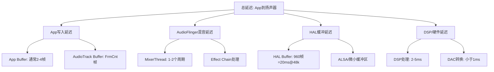

**各层延迟参考值**：

| 延迟层 | 典型值 | Fast路径值 | MMAP路径值 | 影响因素 |
|--------|--------|-----------|-----------|---------|
| App写入 | 2-5ms | 1-2ms | <1ms | Buffer大小 |
| AudioFlinger混音 | 10-20ms | 2-4ms | 0ms(绕过) | 线程周期数 |
| HAL缓冲 | 10-20ms | 2-4ms | <3ms | HAL buffer配置 |
| DSP/硬件 | 2-5ms | 2-5ms | 2-5ms | 硬件实现 |
| **总计** | **24-50ms** | **7-15ms** | **<10ms** | - |

### 15.10.2 FastMixer延迟优化

FastMixer是Android低延迟音频的核心组件，运行在SCHED_FIFO实时线程上。

**FastMixer工作原理**：

```mermaid
sequenceDiagram
    participant App as App Thread
    participant AT as AudioTrack
    participant NM as Normal Mixer
    participant FM as FastMixer
    participant HAL as Audio HAL
    
    App->>AT: write() 音频数据
    AT->>AT: 写入共享内存Pipe
    NM->>AT: 读取Normal Track数据
    NM->>NM: float混音
    NM->>HAL: write() 混音结果
    
    Note over AT,FM: Fast路径
    AT->>FM: Fast Track通过PipeSink直接读取
    FM->>FM: 精简混音(无重采样/无Effect)
    FM->>HAL: write() 低延迟输出
```

**FastMixer启用条件**（全部满足）：

| 条件 | 检查方法 | 不满足时后果 |
|------|---------|------------|
| AudioTrack set PERFORMANCE_MODE_LOW_LATENCY | 检查App代码 | 回退到Normal Mixer |
| 采样率=线程采样率 | dumpsys audio | 回退到Normal Mixer |
| 格式=PCM_FLOAT或PCM_16_BIT | dumpsys audio | 回退到Normal Mixer |
| 通道=STEREO或MONO | dumpsys audio | 回退到Normal Mixer |
| 无Effect绑定到该Session | dumpsys audio Effect Chain | 回退到Normal Mixer |
| Fast Track槽位可用 | dumpsys audio availMask | 等待槽位释放 |
| HAL支持AUDIO_OUTPUT_FLAG_FAST | 检查HAL实现 | FastMixer不创建 |

**FastMixer dump关键字段**：

```
FastMixer status: active
Max phase increment: 0 (no SRC)
SquaredHopCount: 0
Measured latency: 8.5ms
Measured warmup: 2ms
```

| 字段 | 含义 | 正常值 | 异常关注 |
|------|------|--------|---------|
| status | FastMixer状态 | active | standby=idle, idle=未激活 |
| Max phase increment | 最大相位增量 | 0=无重采样 | >0=有SRC, 增加延迟 |
| SquaredHopCount | 跳帧计数 | 0 | >0=数据供应不及时 |
| Measured latency | 实测延迟 | <10ms | >20ms=延迟过高 |
| Measured warmup | 预热耗时 | <3ms | >5ms=调度不及时 |

### 15.10.3 MMAP低延迟路径

MMAP（Memory Map）模式是AAudio的低延迟模式，绕过AudioFlinger直接与HAL/DSP通信。

**MMAP vs Legacy路径对比**：

```mermaid
flowchart LR
    subgraph Legacy路径
        A1[App] -->|AudioTrack| A2[AudioFlinger]
        A2 -->|Normal/FastMixer| A3[HAL]
        A3 --> A4[DSP]
    end
    
    subgraph MMAP路径
        B1[App] -->|直接内存读写| B2[共享内存]
        B2 -->|零拷贝| B3[DSP]
    end
```

**MMAP启用条件**：

| 条件 | 检查方法 | 说明 |
|------|---------|------|
| HAL支持MMAP | `dumpsys audio \| grep MMAP` | 检查audio_policy_configuration.xml |
| AAudio使用LOW_LATENCY | App代码 | `setPerformanceMode(PERFORMANCE_MODE_LOW_LATENCY)` |
| DSP支持共享内存 | HAL实现 | 需HAL实现IMMAP接口 |
| 独占模式可用 | `AAudio_isMMapSupported()` | 检查系统属性 |

**MMAP调试命令**：

```bash
# 检查MMAP是否支持
adb shell dumpsys audio | grep -i mmap

# 查看MMAP Thread状态
adb shell dumpsys audio | grep -A20 "MmapThread"

# 检查AAudio MMAP策略
adb shell getprop aaudio.mmap_policy

# 检查MMAP共享内存
adb shell cat /proc/asound/card*/pcm*/sub*/hw_params

# 强制MMAP策略
adb shell setprop aaudio.mmap_policy 2  # 0=never, 1=auto, 2=always
```

**MMAP策略属性**：

| 属性值 | 策略 | 行为 |
|--------|------|------|
| 0 | NEVER | 永不使用MMAP |
| 1 | AUTO | 系统自动选择（默认） |
| 2 | ALWAYS | 优先使用MMAP |

### 15.10.4 AAudio延迟优化

AAudio是Android低延迟音频API，支持共享和独占模式。

**AAudio延迟优化清单**：

```mermaid
flowchart TB
    A[AAudio低延迟优化] --> B[App层优化]
    A --> C[系统层优化]
    A --> D[HAL层优化]
    
    B --> B1[使用PERFORMANCE_MODE_LOW_LATENCY]
    B --> B2[设置SHARING_MODE_EXCLUSIVE]
    B --> B3[使用回调模式而非阻塞读/写]
    B --> B4[减小Buffer大小至burstSize]
    B --> B5[设置SCHED_FIFO优先级]
    B --> B6[避免在回调中做IO/锁/分配]
    
    C --> C1[启用MMAP策略]
    C --> C2[配置FastMixer]
    C --> C3[减少Effect Chain]
    C --> C4[优化音频焦点策略]
    
    D --> D1[HAL实现AUDIO_OUTPUT_FLAG_FAST]
    D --> D2[减少HAL缓冲区大小]
    D --> D3[支持MMAP No IRQ模式]
    D --> D4[DSP低延迟配置]
```

**AAudio性能模式对比**：

| 模式 | 延迟 | CPU | 兼容性 | 适用场景 |
|------|------|-----|--------|---------|
| PERFORMANCE_MODE_NONE | 20-50ms | 低 | 高 | 普通播放 |
| PERFORMANCE_MODE_LOW_LATENCY | 10-20ms | 中 | 中 | 音乐App |
| PERFORMANCE_MODE_LOW_LATENCY+EXCLUSIVE | <10ms | 高 | 低 | 专业音频/游戏 |

**AAudio延迟测量API**：

```java
// 获取输出延迟估计
AudioStream stream = ...;
AudioStreamState state = stream.getState();
if (state == AudioStreamState.OPEN) {
    // 获取框架延迟（App到AudioFlinger）
    int frameworkLatency = stream.getFramesWritten() - stream.getFramesRead();
    // 获取HAL延迟
    // 注：AAudio不直接提供HAL延迟，需通过timestamp计算
}
```

### 15.10.5 延迟问题调试决策树

```mermaid
flowchart TB
    A[延迟过高问题] --> B{延迟范围?}
    B -->|>100ms| C[严重延迟, 检查阻塞]
    B -->|50-100ms| D[较高延迟, 检查路径]
    B -->|20-50ms| E[Normal延迟, 优化为Fast]
    B -->|<20ms| F[已优化, 检查是否可MMAP]
    
    C --> C1{Blocked in write?}
    C1 -->|Yes| C2[HAL写入阻塞, 检查HAL实现和DSP]
    C1 -->|No| C3[检查App是否及时write, GC暂停?]
    
    D --> D1{Fast Track使用?}
    D1 -->|No| D2[检查FastMixer启用条件]
    D2 --> D2a{哪个条件不满足?}
    D2a -->|Effect绑定| D2b[移除Effect或使用Offload]
    D2a -->|采样率不匹配| D2c[App使用线程采样率]
    D2a -->|无FAST标志| D2d[HAL需支持FAST flag]
    D2a -->|槽位已满| D2e[等待Fast Track释放]
    D1 -->|Yes| D3[检查Effect Chain是否引入延迟]
    
    E --> E1{MMAP可用?}
    E1 -->|Yes| E2[启用AAudio EXCLUSIVE+MMAP]
    E1 -->|No| E3[检查HAL MMAP支持]
    E3 --> E3a{HAL不支持MMAP?}
    E3a -->|Yes| E3b[要求HAL实现IMMAP接口]
    E3a -->|No| E3c[检查audio_policy_configuration.xml MMAP配置]
    
    F --> F1{延迟可接受?}
    F1 -->|Yes| F2[优化完成]
    F1 -->|No| F3[进一步减少buffer大小, 使用burstSize回调]
```

---

## 15.11 录音问题调试

### 15.11.1 AudioRecord创建与权限

录音问题通常从AudioRecord创建开始排查。

**AudioRecord创建流程与常见故障点**：

```mermaid
flowchart TB
    A[App: new AudioRecord] --> B[AudioSystem.getInputForAttr]
    B --> C{权限检查}
    C -->|RECORD_AUDIO未授予| C1[SecurityException: 缺少录音权限]
    C -->|权限OK| D[AudioPolicyManager.getInputForAttr]
    D --> E{输入设备可用?}
    E -->|No| E1[IllegalArgumentException: 无可用输入设备]
    E -->|Yes| F{录音策略允许?}
    F -->|被隐私指示器阻止| F1[录音被系统策略拒绝]
    F -->|策略OK| G[AudioFlinger.openInput]
    G --> H{HAL打开成功?}
    H -->|No| H1[HAL返回错误, 检查HAL实现]
    H -->|Yes| I[创建RecordThread+RecordTrack]
    I --> J[AudioRecord初始化完成]
```

**录音权限检查清单**：

| 权限/策略 | 检查方法 | 失败症状 |
|-----------|---------|---------|
| RECORD_AUDIO权限 | `adb shell dumpsys package <pkg> \| grep RECORD_AUDIO` | SecurityException |
| 后台录音权限 | `adb shell appops get <pkg> RECORD_AUDIO` | 后台无法录音 |
| 隐私指示器 | `adb shell dumpsys audio \| grep "hotword\|privacy"` | 录音被静默拒绝 |
| Doze模式限制 | `adb shell deviceidle whitelist +<pkg>` | Doze期间无法录音 |
| AppOps模式 | `adb shell appops set <pkg> RECORD_AUDIO allow` | AppOps拒绝录音 |

### 15.11.2 录音仲裁与并发

Android 14引入了录音并发仲裁机制，多个App同时录音时需遵循优先级规则。

**录音仲裁优先级**（从高到低）：

| 优先级 | 音频源 | 说明 |
|--------|--------|------|
| 1 | VOICE_COMMUNICATION | VoIP通话，最高优先 |
| 2 | CAMCORDER | 相机录像 |
| 3 | VOICE_RECOGNITION | 语音助手 |
| 4 | MIC | 通用录音 |
| 5 | UNPROCESSED | 原始音频 |
| 6 | HOTWORD_DETECTION | 热词检测 |

**录音并发仲裁流程**：

```mermaid
flowchart TB
    A[新录音请求到达] --> B[AudioPolicyManager]
    B --> C{当前有无其他录音?}
    C -->|No| D[直接授予, 创建RecordTrack]
    C -->|Yes| E{新请求优先级 >= 现有?}
    E -->|Yes| F[共存录音: 两者可同时录制]
    E -->|No| G{仲裁策略?}
    G -->|Preempt| H[低优先级录音被MUTE或STOP]
    G -->|Duck| I[低优先级录音被Duck(降低增益)]
    G -->|Reject| J[新请求被拒绝]
```

**录音仲裁调试命令**：

```bash
# 查看当前活跃录音
adb shell dumpsys audio | grep -A10 "RecordThread"

# 查看录音Track详情
adb shell dumpsys audio | grep -A5 "Active Record"

# 查看录音仲裁日志
adb logcat -s AudioPolicyManager AudioFlinger | grep -i "capture\|record\|preempt"

# 查看App录音权限
adb shell dumpsys package <package> | grep RECORD_AUDIO
```

### 15.11.3 SCO音频调试

SCO（Synchronous Connection-Oriented）是蓝牙耳机语音通话的链路类型。

**SCO音频路径**：

```mermaid
flowchart LR
    A[App: VOICE_COMMUNICATION] --> B[AudioFlinger RecordThread]
    B --> C[Bluetooth SCO Input]
    C --> D[BT Headset Mic]
    
    E[App: VOICE_COMMUNICATION] --> F[AudioFlinger PlaybackThread]
    F --> G[Bluetooth SCO Output]
    G --> H[BT Headset Speaker]
    
    I[Telecom: CALL_AUDIO_MODE] --> J[AudioPolicyManager]
    J --> K[setMode(MODE_IN_COMMUNICATION)]
    K --> L[激活SCO链路]
```

**SCO调试命令**：

```bash
# 查看当前蓝牙音频模式
adb shell dumpsys bluetooth_manager | grep -i "sco\|audio"

# 查看音频模式
adb shell dumpsys audio | grep -i "mode\|sco\|bluetooth"

# 强制激活SCO
adb shell am broadcast -a android.bluetooth.headset.profile.action.CONNECTION_STATE_CHANGED

# 查看SCO音频路由
adb shell dumpsys audio | grep -A5 "Bluetooth"

# 监听SCO日志
adb logcat -s AudioPolicyManager BluetoothAudioManager | grep -i sco
```

**SCO常见问题与诊断**：

| 问题 | 症状 | 诊断 | 修复 |
|------|------|------|------|
| SCO未激活 | 通话无声 | 检查setMode是否为IN_COMMUNICATION | 确保Telecom正确设置模式 |
| SCO音频质量差 | 通话有杂音 | 检查SCO编码格式(PCM/CVSD) | 使用WBS(mSBC)编码 |
| SCO录音失败 | App无法通过BT录音 | 检查SCO Input设备 | 确保A2DP关闭后再开SCO |
| SCO路由错误 | 通话从Speaker输出 | 检查AudioPolicy路由规则 | 确保SCO设备优先级正确 |

### 15.11.4 LE Audio调试

LE Audio（Low Energy Audio）是蓝牙5.2+的新音频标准，支持LC3编码和多流。

**LE Audio音频路径**：

```mermaid
flowchart TB
    A[App: MUSIC/VOICE_COMM] --> B[AudioFlinger PlaybackThread]
    B --> C{LE Audio可用?}
    C -->|Yes| D[LE Audio Output: LC3编码]
    D --> E[BT LE Audio Earbuds]
    C -->|No| F[Classic A2DP/SCO]
    
    G[BT LE Audio Earbuds] --> H[LE Audio Input: LC3编码]
    H --> I[AudioFlinger RecordThread]
    I --> J[App: VOICE_COMMUNICATION]
```

**LE Audio调试命令**：

```bash
# 查看LE Audio支持状态
adb shell dumpsys bluetooth_manager | grep -i "le_audio\|bass\|cap"

# 查看LE Audio音频路由
adb shell dumpsys audio | grep -i "le_audio\|hearing_aid\|a2dp"

# 查看LC3编码配置
adb shell dumpsys bluetooth_manager | grep -i "lc3\|codec"

# 查看LE Audio连接状态
adb shell dumpsys bluetooth_manager | grep -i "csip\|bass\|volume"

# 监听LE Audio日志
adb logcat -s BluetoothLeAudio BluetoothAudioManager | grep -i "le_audio\|lc3"
```

**LE Audio关键系统属性**：

| 属性 | 值 | 说明 |
|------|-----|------|
| `ro.bluetooth.leaudio.enable` | true/false | LE Audio开关 |
| `persist.bluetooth.leaudio.enabled` | 0/1 | 持久化LE Audio状态 |
| `bluetooth.core.le.audio.enabled` | true/false | 运行时LE Audio状态 |

**LE Audio vs Classic Audio对比**：

| 特性 | Classic A2DP | Classic SCO | LE Audio |
|------|-------------|-------------|----------|
| 编码 | SBC/AAC/LDAC | CVSD/mSBC | LC3 |
| 延迟 | 100-200ms | 30-50ms | 20-40ms |
| 音质 | 高 | 低 | 中高 |
| 功耗 | 高 | 中 | 低 |
| 多流 | 不支持 | 不支持 | 支持 |
| 广播 | 不支持 | 不支持 | 支持(Auracast) |

### 15.11.5 录音问题综合调试决策树

```mermaid
flowchart TB
    A[录音问题] --> B{AudioRecord创建成功?}
    B -->|No| C{错误类型?}
    B -->|Yes| D{录音数据有效?}
    
    C -->|SecurityException| C1[缺少RECORD_AUDIO权限]
    C -->|IllegalArgumentException| C2[无可用输入设备/参数无效]
    C -->|DeadObjectException| C3[AudioFlinger崩溃/重启]
    
    D -->|全是0或静音| D1{录音权限被限制?}
    D1 -->|Yes| D1a[检查AppOps和隐私指示器]
    D1 -->|No| D1b{HAL是否提供数据?}
    D1b -->|No| D1c[检查HAL Input Stream和Mic状态]
    D1b -->|Yes| D1d[检查RecordThread和Track增益]
    
    D -->|有数据但质量差| D2{问题类型?}
    D2 -->|噪音大| D2a[检查Audio Source, VOICE_RECOGNITION有HAL预处理]
    D2 -->|断断续续| D2b[检查overrun计数和线程调度]
    D2 -->|回声| D2c[检查AEC(Acoustic Echo Canceler)是否启用]
    D2 -->|音量低| D2d[检查AudioSource增益和HAL预处理]
    
    D -->|开始后无数据| D3{start()调用成功?}
    D3 -->|No| D3a[检查焦点和权限]
    D3 -->|Yes| D3b{被高优先级录音抢占?}
    D3b -->|Yes| D3c[检查录音仲裁, 查看dumpsys audio]
    D3b -->|No| D3d[检查RecordThread是否活跃]
    
    D -->|蓝牙录音问题| D4{蓝牙类型?}
    D4 -->|Classic SCO| D4a[检查SCO链路激活和音频模式]
    D4 -->|LE Audio| D4b[检查LE Audio连接状态和LC3编码]
    D4 -->|A2DP| D4c[A2DP不支持录音, 需切换到SCO/LE]
```

---

---

## 15.12 HAL层调试

### 15.12.1 AIDL HAL Debug日志

AOSP14音频HAL以AIDL接口为主（`hardware/interfaces/audio/core/`），调试时需启用详细日志。

```bash
# 启用AIDL Audio HAL详细日志
adb shell setprop persist.vendor.audio.hal.debug 2

# 启用Core Module debug
adb shell setprop persist.vendor.audio.core.debug 1

# 查看HAL服务状态
adb shell dumpsys android.hardware.audio.core.IModule/default

# 查看所有音频HAL服务
adb shell lshal | grep audio
```

**AIDL HAL关键日志标签**：

| 日志标签 | 含义 | 过滤命令 |
|----------|------|----------|
| `AudioCore` | Core Module主逻辑 | `logcat -s AudioCore` |
| `AudioStreamIn` | 输入流操作 | `logcat -s AudioStreamIn` |
| `AudioStreamOut` | 输出流操作 | `logcat -s AudioStreamOut` |
| `AudioPolicy` | 策略决策 | `logcat -s AudioPolicy` |
| `Module` | HAL Module管理 | `logcat -s Module` |

### 15.12.2 HIDL HAL Debug方法

对于仍使用HIDL的遗留设备（`android.hardware.audio@7.x`）：

```bash
# HIDL HAL debug dump
adb shell lshal --debug android.hardware.audio@7.0::IDevicesFactory/default

# 启用HIDL HAL详细日志
adb shell setprop persist.vendor.audio.hal.debug 3

# 直接调用HAL debug接口
adb shell dumpsys media.audio_flinger | grep "Hal stream dump"
```

### 15.12.3 StreamDescriptor状态Dump

AIDL HAL中StreamDescriptor定义了音频流状态机（源码路径：`hardware/interfaces/audio/aidl/android/hardware/audio/core/`）：

**输入流状态机**（源码：[`stream-in-sm.gv`](hardware/interfaces/audio/aidl/android/hardware/audio/core/stream-in-sm.gv)）：

```
STANDBY → IDLE (start)
IDLE → ACTIVE (burst)
ACTIVE → PAUSED (pause)
ACTIVE → DRAINING (drain)
PAUSED → ACTIVE (burst)
PAUSED → STANDBY (flush)
DRAINING → ACTIVE (start)
DRAINING → STANDBY (buffer empty)
任何状态 → ERROR (hardware failure)
```

**StreamDescriptor dump关键字段**：

| 字段 | 含义 | 调试关注点 |
|------|------|------------|
| State | 当前状态(STANDBY/IDLE/ACTIVE/PAUSED/DRAINING/ERROR) | 非预期状态表示异常 |
| Frames | 已处理帧数 | 用于确认数据流是否流动 |
| LatencyMs | HAL延迟 | 与AF层延迟对比 |
| ConnectedDevices | 连接设备 | 确认设备路由正确 |
| AudioGain | 当前增益值 | 音量/静音问题排查 |

### 15.12.4 AudioGain调试

```bash
# 查看所有AudioGain配置
adb shell dumpsys audio | grep -A 5 "Gain"

# 查看特定Port的Gain
adb shell dumpsys audio | grep -B 2 -A 10 "gain"

# 设置Gain（需要root）
adb shell "echo <mode> <channelMask> <value> > /sys/class/audio/gain"
```

**AudioGain常见问题**：

| 问题 | 原因 | 解决方法 |
|------|------|----------|
| 音量不可调 | Gain范围配置错误 | 检查min/max/step值 |
| 静音不生效 | Gain mode缺少MUTE标志 | 检查gain mode位掩码 |
| 只有一个声道有声音 | Channel mask不匹配 | 检查gain channelMask |
| 音量突变 | Step size过大 | 减小step值，增加级数 |

### 15.12.5 HAL Crash/Hung诊断

```bash
# 查看HAL crash日志
adb logcat -b all | grep -E "audio.*crash|audio.*died|audio.*tombstone"

# 检查HAL服务是否存活
adb shell lshal | grep audio

# 检查tombstone
adb shell ls /data/tombstones/ | grep audio

# 监控HAL health
adb shell hal_health -s android.hardware.audio.core.IModule/default
```

**HAL hung诊断步骤**：

1. 确认HAL服务是否响应：`adb shell lshal --debug`
2. 检查是否有死锁：查看`logcat`中`AudioFlinger`的"lock"相关日志
3. 检查HAL线程状态：`adb shell debuggerd -b <pid>`
4. 确认是否是write阻塞：检查AF Thread "Blocked in write"状态

### 15.12.6 HAL调试流程图

```mermaid
flowchart TB
    A[HAL层问题] --> B{问题类型?}
    B -->|Crash| C[检查tombstone和logcat]
    B -->|Hung/无响应| D[检查HAL服务状态]
    B -->|音频数据异常| E[检查StreamDescriptor状态]
    B -->|音量问题| F[检查AudioGain配置]
    B -->|设备路由错误| G[检查Module Device列表]
    
    C --> C1{有tombstone?}
    C1 -->|Yes| C2[分析crash栈和信号]
    C1 -->|No| C3[检查logcat HAL错误日志]
    
    D --> D1{lshal显示alive?}
    D1 -->|No| D2[HAL已死, 重启服务或检查SELinux]
    D1 -->|Yes| D3[检查是否有死锁或write阻塞]
    
    E --> E1{State=ACTIVE?}
    E1 -->|No| E2[检查为何未进入ACTIVE状态]
    E1 -->|Yes| E3{Frames在增长?}
    E3 -->|No| E4[HAL未处理数据, 检查HAL实现]
    E3 -->|Yes| E5[数据流正常, 检查格式/采样率]
    
    F --> F1{Gain范围正确?}
    F1 -->|No| F2[修正audio_policy_configuration中Gain配置]
    F1 -->|Yes| F3[检查Gain mode和channelMask]
    
    G --> G1{ConnectedDevices正确?}
    G1 -->|No| G2[检查setDeviceConnectionState调用]
    G1 -->|Yes| G3[检查Patch路由配置]
```

---

## 15.13 音效调试

### 15.13.1 EffectChain Dump解读

EffectChain dump格式（源码：[`Effects.cpp:2704`](frameworks/av/services/audioflinger/Effects.cpp:2704)）：

```
N effects for session S
  In buffer [sizeInFrames x format]   Out buffer [sizeInFrames x format]   Active tracks: M
  Effect 0: [uuid] [name] [state] [N in] [N out] [processFrames]
```

**Effect状态枚举**：

| 状态 | 值 | 含义 |
|------|-----|------|
| ACTIVE | 运行中 | 正常处理音频数据 |
| INITIALIZED | 已初始化 | 已创建但未启用 |
| DISABLED | 已禁用 | App主动禁用 |
| UNINITIALIZED | 未初始化 | 尚未创建 |

### 15.13.2 常见音效问题

**1. 音效无效果**

| 排查项 | 检查方法 | 常见原因 |
|--------|----------|----------|
| Effect状态 | dump查看state字段 | state非ACTIVE |
| Session匹配 | 检查Effect与Track的Session ID | Session不匹配 |
| 音效参数 | 检查Effect参数设置 | 参数值异常 |
| 输入输出buffer | 检查In/Out buffer帧数 | buffer为0或未连接 |
| 音频格式 | 检查Effect支持的格式 | 格式不兼容导致bypass |

**2. 音效导致延迟增加**

```bash
# 测量音效延迟
adb shell dumpsys audio | grep -A 3 "Effect"
# 对比framesIn和framesOut差值
```

**3. 音效导致爆音**

| 原因 | 表现 | 解决方法 |
|------|------|----------|
| Gain过大 | 爆音伴随音量过大 | 降低Effect输出增益 |
| 格式溢出 | PCM_16_BIT截断 | 使用PCM_FLOAT内部处理 |
| 参数突变 | 参数变化时出现杂音 | 参数渐变过渡 |
| Buffer underrun | 间歇性爆音 | 增大Effect buffer |

### 15.13.3 AEC/NS调试方法

AEC（Acoustic Echo Cancelation）和NS（Noise Suppression）是语音通信的关键音效。

```bash
# 查看AEC/NS效果状态
adb shell dumpsys audio | grep -A 5 "echo_cancel\|noise_suppression"

# 启用AEC debug日志
adb shell setprop persist.audio.fx.aec.debug 1

# 强制启用AEC/NS
adb shell setprop audioflinger.enable_aec 1
```

**AEC调试要点**：

| 检查项 | 说明 | 预期 |
|--------|------|------|
| 回声参考信号 | 播放Track是否连接到AEC | 播放信号应作为参考 |
| 延迟对齐 | 播放和录音延迟差 | 延迟差应<Effect可处理范围 |
| 采样率匹配 | 播放和录音采样率一致 | 16kHz最优 |
| Session绑定 | AEC与播放/录音同一Session | Session ID必须一致 |

### 15.13.4 Spatializer调试

AOSP14的Spatializer支持空间音频（源码：`frameworks/av/services/audioflinger/Spatializer.cpp`）：

```bash
# 查看Spatializer状态
adb shell dumpsys audio | grep -A 10 "Spatializer"

# 检查是否支持Spatializer
adb shell dumpsys media.audio_flinger | grep "spatializer"

# 启用/禁用Spatializer
adb shell settings put system spatial_audio_enabled 1
```

**Spatializer关键调试点**：

| 字段 | 含义 | 调试关注点 |
|------|------|------------|
| Level | 空间音频级别(NONE/SPATIALIZER) | 确认功能是否激活 |
| HeadTracking | 头部追踪状态 | 蓝牙LE头部追踪器连接 |
| Channel Mask | 输出通道掩码 | 确认支持多声道输出 |
| Output stream | 关联的输出流 | 确认路由到正确设备 |

### 15.13.5 LoudnessEnhancer调试

LoudnessEnhancer用于提升感知响度：

```bash
# 查看LoudnessEnhancer状态
adb shell dumpsys audio | grep -A 5 "loudness_enhancer"

# 检查目标增益值
adb shell dumpsys media.audio_flinger | grep "LoudnessEnhancer"
```

**LoudnessEnhancer参数**：

| 参数 | 含义 | 典型值 |
|------|------|--------|
| Target gain(mB) | 目标增益(毫贝) | 3000-6000 (3-6dB) |
| Enabled | 是否启用 | true/false |

### 15.13.6 音效调试决策树

```mermaid
flowchart TB
    A[音效问题] --> B{问题类型?}
    B -->|无效果| C[检查Effect状态]
    B -->|延迟增加| D[检查Effect处理帧差]
    B -->|爆音| E[检查增益和格式]
    B -->|AEC回声| F[检查参考信号和延迟对齐]
    B -->|空间音频| G[检查Spatializer状态]
    
    C --> C1{State=ACTIVE?}
    C1 -->|No| C2[检查App是否启用Effect]
    C1 -->|Yes| C3{Session ID匹配?}
    C3 -->|No| C4[修正Session绑定]
    C3 -->|Yes| C5[检查Effect参数是否正确]
    
    D --> D1{framesOut - framesIn > 0?}
    D1 -->|Yes| D2[Effect引入算法延迟]
    D1 -->|No| D3[检查是否有额外buffer拷贝]
    D2 --> D4[评估是否可替换低延迟Effect]
    
    E --> E1{Gain > 0dB?}
    E1 -->|Yes| E2[降低Effect输出增益]
    E1 -->|No| E3{格式为PCM_16BIT?}
    E3 -->|Yes| E4[切换为PCM_FLOAT内部处理]
    E3 -->|No| E5[检查参数突变和buffer状态]
    
    F --> F1{回声参考信号连接?}
    F1 -->|No| F2[确保播放Track绑定同一Session]
    F1 -->|Yes| F3{播放录音延迟对齐?}
    F3 -->|No| F4[调整延迟补偿或减小buffer]
    F3 -->|Yes| F5[检查AEC参数和采样率]
    
    G --> G1{Level=SPATIALIZER?}
    G1 -->|No| G2[检查设备是否支持多声道]
    G1 -->|Yes| G3[检查HeadTracking和输出路由]
```

---

## 15.14 OEM深度定制实战

### 15.14.1 自定义EngineConfigurable引擎

OEM可通过Parameter Framework自定义AudioPolicy引擎（源码：`frameworks/av/services/audiopolicy/engineconfigurable/`）。

**EngineConfigurable架构**（基于Parameter Framework）：

| 组件 | 配置文件 | 说明 |
|------|----------|------|
| PFW配置 | `ParameterFrameworkConfigurationPolicy.xml` | Parameter Framework主配置 |
| Criteria | `PolicyCriterion.xml` | 决策条件定义 |
| CriterionTypes | `PolicyCriterionTypes.xml` | 条件类型定义（自动生成） |
| Strategies | `PolicyStrategy.xml` | 路由策略规则 |
| Domains | `PolicyDomain.xml` | 策略域定义 |

**自定义步骤**：

1. **创建PFW配置目录**：在`vendor/<oem>/audio/policy/`下创建配置文件
2. **定义Criterion**：添加OEM特有的音频属性条件
3. **定义Strategy**：编写路由策略规则XML
4. **编译集成**：修改Android.bp将OEM配置文件打包

```xml
<!-- 示例：自定义Criterion - 车辆状态 -->
<Criterion name="VehicleState">
    <CriterionType name="VehicleStateType" type="inclusive">
        <ValuePair literal="Parking" numerical="0"/>
        <ValuePair literal="Driving" numerical="1"/>
        <ValuePair literal="Reverse" numerical="2"/>
    </CriterionType>
</Criterion>
```

### 15.14.2 自定义VolumeCurve

VolumeCurve定义音量索引到衰减值的映射关系（源码：[`VolumeCurve.cpp`](frameworks/av/services/audiopolicy/engine/common/src/VolumeCurve.cpp)）。

**默认VolumeCurve分类**：

| 类别 | 设备类型 | 曲线特点 |
|------|----------|----------|
| DEVICECATEGORY_HEADSET | 耳机 | 低音量起点高，斜率缓 |
| DEVICECATEGORY_SPEAKER | 扬声器 | 低音量起点低，斜率陡 |
| DEVICECATEGORY_EARPIECE | 听筒 | 中间斜率 |
| DEVICECATEGORY_HEARING_AID | 助听器 | 类似HEADSET |
| DEVICECATEGORY_EXT_MEDIA | 外部媒体 | 线性映射 |

**自定义VolumeCurve方法**：

在`audio_policy_configuration.xml`中定义：

```xml
<volume streamType="AUDIO_STREAM_MUSIC">
    <deviceCategory category="DEVICECATEGORY_SPEAKER">
        <!-- index:minAttenuationInDb ... maxIndex:maxAttenuationInDb -->
        <point>0:-9000</point>   <!-- 最小音量: -90dB -->
        <point>33:-3600</point>  <!-- 1/3音量: -36dB -->
        <point>66:-1600</point>  <!-- 2/3音量: -16dB -->
        <point>100:0</point>     <!-- 最大音量: 0dB -->
    </deviceCategory>
</volume>
```

### 15.14.3 自定义ProductStrategy

ProductStrategy定义音频产品的路由优先级和策略（源码路径：`frameworks/av/services/audiopolicy/engineconfigurable/`）。

**内置ProductStrategy列表**：

| Strategy | 用途 | 优先级 |
|----------|------|--------|
| STRATEGY_MEDIA | 媒体播放 | 低 |
| STRATEGY_PHONE | 电话通话 | 高 |
| STRATEGY_SONIFICATION | 通知/铃声 | 高 |
| STRATEGY_ENFORCED_AUDIBLE | 强制发声 | 最高 |
| STRATEGY_DTMF | DTMF音 | 中 |
| STRATEGY_TRANSMITTED_THROUGH_SPEAKER | 强制扬声器 | 高 |
| STRATEGY_ACCESSIBILITY | 无障碍 | 中 |
| STRATEGY_REROUTING | 重路由 | 低 |
| STRATEGY_CALL_ASSISTANT | 通话助手 | 中 |

**自定义Strategy**：在`PolicyStrategy.xml`中添加OEM策略规则：

```xml
<Strategy name="OemNavigationStrategy" type="compound">
    <SelectionCriterion ref="VehicleState"/>
    <SelectionCriterion ref="StreamType"/>
    <Component type="OemNavRule_Parking"/>
    <Component type="OemNavRule_Driving"/>
</Strategy>
```

### 15.14.4 自定义FocusInteraction矩阵

FocusInteraction矩阵定义不同音频流之间的焦点交互规则（AAOS特有，源码：[`FocusInteraction.java`](packages/services/Car/service/src/com/android/car/audio/FocusInteraction.java)）。

**交互类型**：

| 交互类型 | 含义 | 示例 |
|----------|------|------|
| REJECT | 拒绝焦点请求 | 导航不能打断电话 |
| DUCK | 降低音量让出焦点 | 音乐被通知duck |
| PAUSE | 暂停让出焦点 | 音乐被通话暂停 |
| EXTERNAL_LOSS | 外部焦点丢失 | HAL主动接管焦点 |
| NONE | 无交互 | 两个流可同时播放 |

**自定义矩阵示例**：

```java
// 在FocusInteraction中自定义交互规则
// 矩阵格式: [requester][holder] = interaction
setInteraction(AUDIO_CONTEXT_MUSIC, AUDIO_CONTEXT_NAVIGATION, INTERACTION_DUCK);
setInteraction(AUDIO_CONTEXT_MUSIC, AUDIO_CONTEXT_CALL, INTERACTION_PAUSE);
setInteraction(AUDIO_CONTEXT_NAVIGATION, AUDIO_CONTEXT_CALL, INTERACTION_PAUSE);
setInteraction(AUDIO_CONTEXT_CALL, AUDIO_CONTEXT_MUSIC, INTERACTION_REJECT);
```

### 15.14.5 多音频Zone配置实战

AAOS14支持多音频Zone，允许不同座位独立播放音频。

**配置步骤**：

1. **定义car_audio_configuration.xml**：

```xml
<audioZoneConfiguration version="2.0">
    <zones>
        <zone name="primary" isPrimary="true" occupantZoneId="1">
            <zoneConfigs>
                <zoneConfig name="primary_default" isDefault="true">
                    <volumeGroups>
                        <group name="Media" deviceId="bus_1000">
                            <context context="music"/>
                        </group>
                        <group name="Navigation" deviceId="bus_1001">
                            <context context="navigation"/>
                        </group>
                    </volumeGroups>
                </zoneConfig>
            </zoneConfigs>
        </zone>
        <zone name="rear" isPrimary="false" occupantZoneId="2">
            <zoneConfigs>
                <zoneConfig name="rear_default" isDefault="true">
                    <volumeGroups>
                        <group name="RearMedia" deviceId="bus_2000">
                            <context context="music"/>
                        </group>
                    </volumeGroups>
                </zoneConfig>
            </zoneConfigs>
        </zone>
    </zones>
</audioZoneConfiguration>
```

2. **HAL层配置对应Bus设备**：确保每个zoneConfig中的deviceId在HAL层有对应实现
3. **Occupant Zone映射**：将物理座位映射到音频Zone
4. **验证配置**：使用`cmd car_service validate-car-audio-config`验证

### 15.14.6 BitPerfect模式配置

BitPerfect模式在AOSP14中新增，允许音频数据不经重采样/格式转换直接输出到DAC。

**配置方法**：

在`audio_policy_configuration.xml`中为output profile添加BitPerfect标志：

```xml
<mixPort name="bitperfect_output" role="source"
         flags="AUDIO_OUTPUT_FLAG_BIT_PERFECT">
    <profile name="" format="AUDIO_FORMAT_PCM_24_BIT_PACKED"
             samplingRates="96000,192000"
             channelMasks="AUDIO_CHANNEL_OUT_STEREO"/>
</mixPort>
```

**BitPerfect约束**：

| 约束 | 说明 |
|------|------|
| 采样率必须匹配 | 不执行重采样，源和输出采样率必须一致 |
| 格式必须匹配 | 不执行格式转换 |
| 独占使用 | BitPerfect Track独占输出线程，其他Track被mute |
| 音量控制受限 | 只能通过HAL增益控制，不能在AF层调整 |

### 15.14.7 完整OEM定制流程

```mermaid
sequenceDiagram
    participant OEM as OEM厂商
    participant Config as 音频配置文件
    participant PFW as Parameter Framework
    participant APE as AudioPolicy Engine
    participant AF as AudioFlinger
    participant HAL as Audio HAL
    
    OEM->>Config: 1. 编写audio_policy_configuration.xml
    OEM->>Config: 2. 编写audio_policy_engine_configuration.xml
    OEM->>Config: 3. 编写car_audio_configuration.xml（AAOS）
    OEM->>PFW: 4. 定义自定义Criteria和Strategy
    OEM->>PFW: 5. 定义VolumeCurve
    OEM->>PFW: 6. 定义FocusInteraction矩阵
    
    Note over Config,PFW: 编译阶段
    Config->>APE: 配置文件被解析加载
    PFW->>APE: PFW规则编译为策略引擎
    
    Note over APE,HAL: 运行时
    APE->>APE: 根据Strategy决策路由
    APE->>AF: openOutput/openInput
    AF->>HAL: 打开音频流
    HAL->>AF: 返回StreamDescriptor
    APE->>AF: setVolume应用音量曲线
    AF->>HAL: 设置AudioGain
    APE->>AF: 焦点决策结果
    AF->>AF: 执行duck/pause/mute
```

---

## 15.15 AudioFlinger Tunable参数

### 15.15.1 Property调试开关列表

AudioFlinger通过system property控制运行时行为（源码：[`Threads.cpp`](frameworks/av/services/audioflinger/Threads.cpp)、[`PropertyUtils.cpp`](frameworks/av/services/audioflinger/PropertyUtils.cpp)）。

**核心调试Property**：

| Property | 默认值 | 说明 | 源码位置 |
|----------|--------|------|----------|
| `af.fast_track_multiplier` | 无(代码计算) | Fast Track数量倍数 | [`Threads.cpp:296`](frameworks/av/services/audioflinger/Threads.cpp:296) |
| `af.thread.throttle` | true | 线程节流开关 | [`Threads.cpp:3175`](frameworks/av/services/audioflinger/Threads.cpp:3175) |
| `af.patch_park` | false | Patch暂停调试 | [`Threads.cpp:4740`](frameworks/av/services/audioflinger/Threads.cpp:4740) |
| `af.tee` | 0(非debugable) | NBAIO Tee数据记录 | [`NBAIO_Tee.h:182`](frameworks/av/services/audioflinger/NBAIO_Tee.h:182) |
| `ro.audio.max_fast_tracks` | 无 | 最大Fast Track数 | [`FastMixerState.cpp:75`](frameworks/av/services/audioflinger/FastMixerState.cpp:75) |
| `ro.audio.flinger_standbytime_ms` | 无 | AF待机超时(ms) | [`AudioFlinger.cpp:395`](frameworks/av/services/audioflinger/AudioFlinger.cpp:395) |
| `ro.af.client_heap_size_kbyte` | 0(默认) | 客户端堆大小(KB) | [`AudioFlinger.cpp:2798`](frameworks/av/services/audioflinger/AudioFlinger.cpp:2798) |
| `ro.audio.silent` | 0 | 静音模式(调试用) | [`Threads.cpp:3411`](frameworks/av/services/audioflinger/Threads.cpp:3411) |
| `ro.audio.offload_wakelock` | true | Offload wakelock开关 | [`Threads.cpp:7114`](frameworks/av/services/audioflinger/Threads.cpp:7114) |

**AAudio相关Property**：

| Property | 默认值 | 说明 | 源码位置 |
|----------|--------|------|----------|
| `aaudio.mmap_policy` | NEVER(1) | MMAP策略(1=NEVER,2=AUTO,3=ALWAYS) | [`PropertyUtils.cpp:33`](frameworks/av/services/audioflinger/PropertyUtils.cpp:33) |
| `aaudio.mmap_exclusive_policy` | UNSPECIFIED | MMAP Exclusive策略 | [`PropertyUtils.cpp:35`](frameworks/av/services/audioflinger/PropertyUtils.cpp:35) |
| `aaudio.mixer_bursts` | 2 | AAudio Mixer burst数 | [`PropertyUtils.cpp:83`](frameworks/av/services/audioflinger/PropertyUtils.cpp:83) |
| `aaudio.hw_burst_min_usec` | 1000 | 硬件burst最小时长(μs) | [`PropertyUtils.cpp:95`](frameworks/av/services/audioflinger/PropertyUtils.cpp:95) |

**HAL调试Property**：

| Property | 默认值 | 说明 |
|----------|--------|------|
| `persist.vendor.audio.hal.debug` | 0 | HAL debug级别(0-3) |
| `persist.vendor.audio.core.debug` | 0 | Core Module debug开关 |
| `vendor.audio.hal.open.trace` | false | HAL open/close追踪 |
| `vendor.audio.hal.write.trace` | false | HAL write/read追踪 |

### 15.15.2 配置文件可调参数

**audio_policy_configuration.xml关键可调参数**：

| 参数 | 位置 | 说明 | 调优建议 |
|------|------|------|----------|
| `samplingRates` | mixPort profile | 线程采样率 | 包含48000即可满足大多数场景 |
| `format` | mixPort profile | 线程格式 | PCM_FLOAT最高精度 |
| `channelMasks` | mixPort profile | 通道掩码 | STEREO最常用 |
| `flags` | mixPort | 输出标志 | FAST标志启用低延迟路径 |
| `minDurationMs` | offload profile | Offload最小时长 | 太小导致频繁开关Offload |
| `gain` | devicePort | 增益配置 | 确保覆盖实际硬件范围 |

**audio_policy_engine_configuration.xml关键可调参数**：

| 参数 | 说明 | 调优建议 |
|------|------|----------|
| ProductStrategy顺序 | 策略优先级 | 高优先级策略优先路由 |
| VolumeGroup映射 | 音量组到Strategy映射 | 确保每组有合理曲线 |
| Criteria定义 | 策略决策条件 | OEM可扩展自定义条件 |

### 15.15.3 性能调优参数表

| 优化目标 | Property/参数 | 推荐值 | 效果 |
|----------|---------------|--------|------|
| 降低播放延迟 | `aaudio.mmap_policy` | 2(AUTO)或3(ALWAYS) | 启用MMAP低延迟路径 |
| 降低播放延迟 | `aaudio.mixer_bursts` | 1 | 减少buffer倍数，降低延迟 |
| 降低播放延迟 | mixPort flags添加FAST | AUDIO_OUTPUT_FLAG_FAST | 启用FastMixer路径 |
| 减少Underrun | 增大App buffer | 2-4倍burst size | 容错空间增大 |
| 减少功耗 | 启用Offload | 配置compress_offload profile | CPU使用降低 |
| 减少功耗 | `ro.audio.offload_wakelock` | true | Offload时持有wakelock |
| 调试Tee数据 | `af.tee` | 3(输入+输出) | 记录音频数据用于分析 |
| 调试Fast Track | `af.fast_track_multiplier` | 增大值 | 允许更多Fast Track |
| 调试线程节流 | `af.thread.throttle` | false | 禁用节流用于延迟测试 |

### 15.15.4 参数调整效果对比

**延迟优化对比**（以48kHz/2ch/16bit为例）：

| 配置 | Buffer Size | 延迟 | 说明 |
|------|-------------|------|------|
| Normal Mixer (burst=2) | 960 frames | ~20ms | 默认配置 |
| Normal Mixer (burst=1) | 480 frames | ~10ms | 减半buffer |
| Fast Mixer (burst=2) | 480 frames | ~10ms | Fast路径+小buffer |
| Fast Mixer (burst=1) | 240 frames | ~5ms | 极低延迟 |
| AAudio MMAP Exclusive | 96 frames | ~2ms | 硬件直通 |

**功耗优化对比**：

| 配置 | CPU占用 | 说明 |
|------|---------|------|
| PCM Normal Mixer | 基准100% | 所有混合在CPU执行 |
| PCM Fast Mixer | ~80% | Fast路径减少拷贝 |
| Offload Compressed | ~5% | DSP解码，CPU仅控制 |
| MMAP Exclusive | ~10% | 绕过AF混合 |

> [← 上一篇：Vendor+QNX双域架构](17_Vendor_QNX_Architecture.md) | [返回导航](README.md)