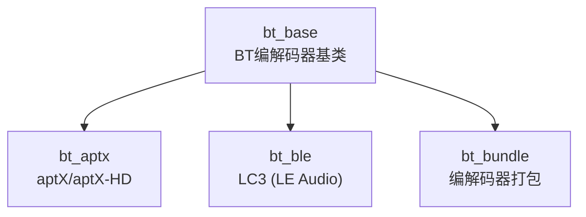
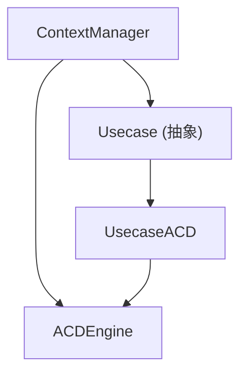
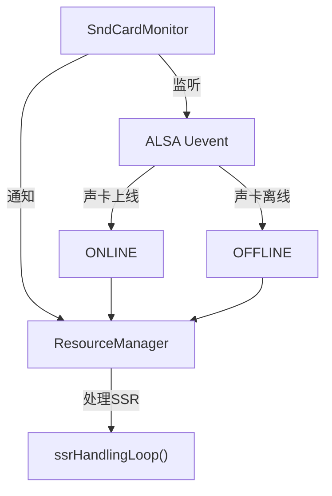
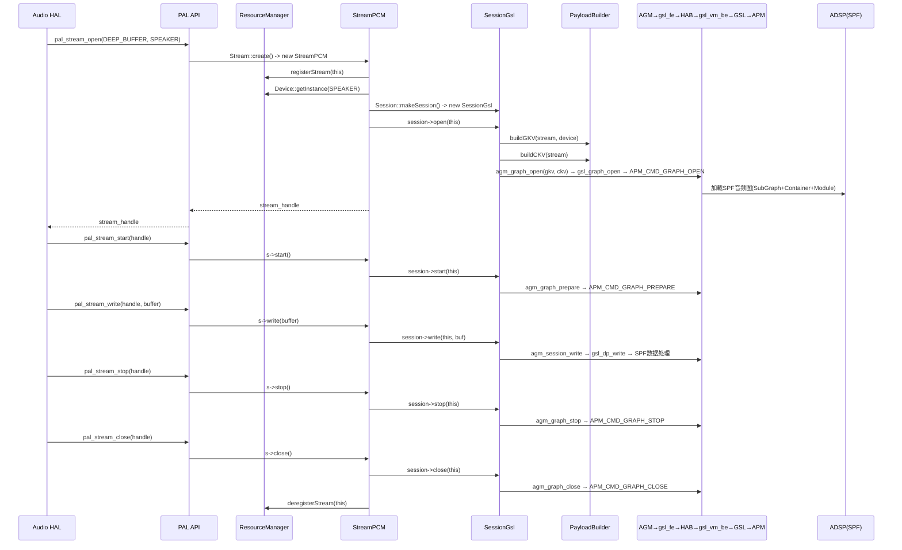
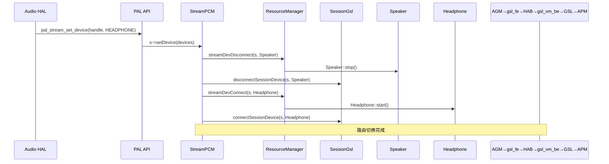
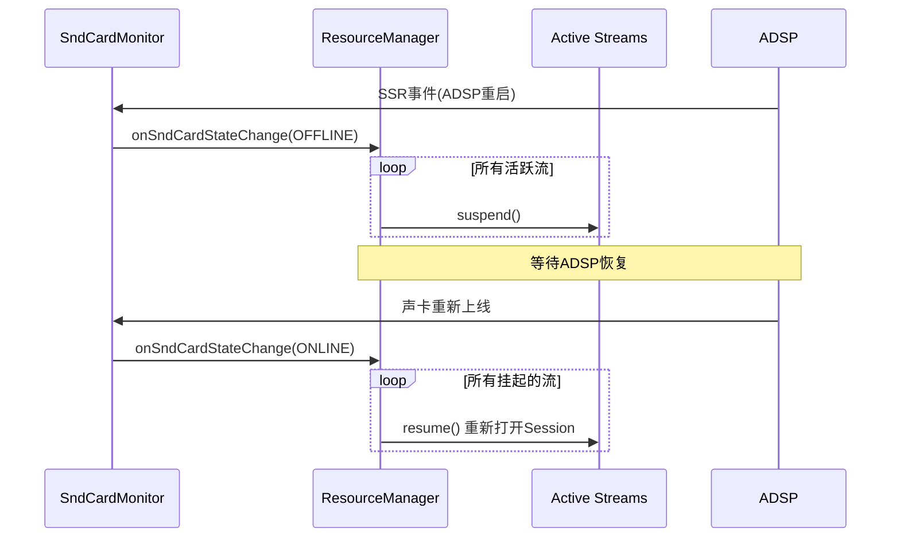
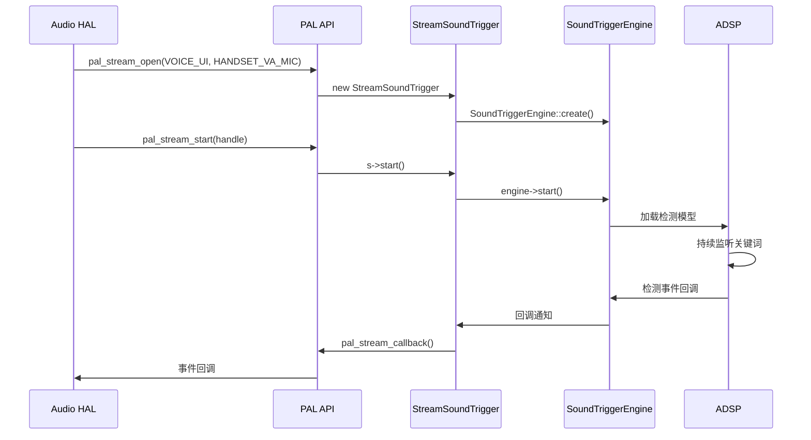
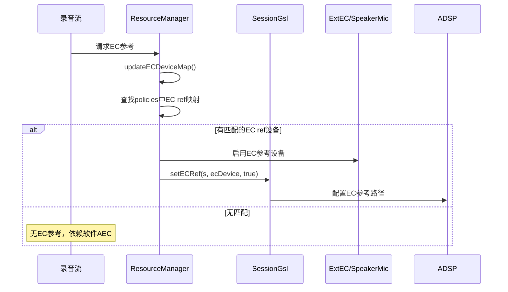

## 15.11 编解码器插件 (plugins/codecs/)

> [← 上一个](15_10.1_架构.md) | [返回目录](README.md) | [下一个 →](15_12.1_QC_audio-alsa_ALSA层实现.md)

---

### 15.11.1 编解码器插件 (plugins/codecs/)

| 目录 | 说明 |
|------|------|
| `plugins/codecs/bt_aptx/` | aptX/aptX-HD 编解码器实现 |
| `plugins/codecs/bt_base/` | BT编解码器基类 |
| `plugins/codecs/bt_ble/` | BLE Audio (LC3) 编解码器实现 |
| `plugins/codecs/bt_bundle/` | BT编解码器打包 |



### 15.11.2 控制插件 (plugins/controls/)

| 文件 | 说明 |
|------|------|
| `plugins/controls/PluginControlIntf.h` | 控制插件接口定义 |
| `plugins/controls/defaultPluginControls.cpp` | 默认控制实现 |

---

M.14 Utils 工具集

> 源码路径：`utils/`

| 工具 | 源码 | 说明 |
|------|------|------|
| PalRingBuffer | `utils/PalRingBuffer.h/cpp` | PAL环形缓冲区，流数据缓冲 |
| ChargerListener | `utils/ChargerListener.h/cpp` | 充电器状态监听，影响音频路由 |
| SoundTriggerPlatformInfo | `utils/SoundTriggerPlatformInfo.h/cpp` | ST平台信息，SVA模型和引擎配置 |
| XmlParser | `utils/XmlParser.h/cpp` | 通用XML解析工具 |
| ACDPlatformInfo | `utils/ACDPlatformInfo.h/cpp` | ACD平台信息，ACD场景和模型配置 |
| SoundTriggerUtils | `utils/SoundTriggerUtils.h/cpp` | ST工具函数，模型加载/卸载等 |

### PalRingBuffer
环形缓冲区用于流数据中间缓冲：`写入端(Stream.write) → [RingBuffer] → 读取端(Session.write/AGM→gsl_fe→HAB→gsl_vm_be→GSL)`。支持多读者单写者模式，无锁设计。

### ChargerListener
监听充电状态变化，通过uevent监听充电事件，回调通知ResourceManager更新路由。

---

M.15 ContextManager 上下文管理

> 源码路径：`context_manager/`



- **ContextManager**：上下文管理器，协调用例和引擎
- **Usecase**：用例抽象基类，定义检测场景
- **UsecaseACD**：ACD用例实现

---

M.16 SndCardMonitor 声卡监控

> 源码路径：`resource_manager/inc/SndCardMonitor.h`

M.1 核心功能



M.2 SSR 处理流程

1. SndCardMonitor 监听 `/dev/snd/` 下的 uevent
2. 检测到 ADSP/CDSP 子系统重启事件（声卡OFFLINE）
3. 通知 ResourceManager 触发 SSR 处理
4. RM执行：暂停所有活跃流 → 等待声卡重新上线 → 重新打开和恢复所有流

M.3 关键接口

```cpp
class SndCardMonitor {
    void startMonitor();
    void stopMonitor();
    void onSndCardStateChange(snd_card_state_t state);
};
```

声卡状态：`SND_CARD_STATE_ONLINE`(在线)、`SND_CARD_STATE_OFFLINE`(离线/SSR)

---

M.17 核心流程分析

M.17.1 播放流完整生命周期



M.17.2 设备路由切换流程



M.17.3 SSR 处理流程



M.17.4 语音触发(SVA)流程



M.17.5 EC回声消除参考设置流程



---

