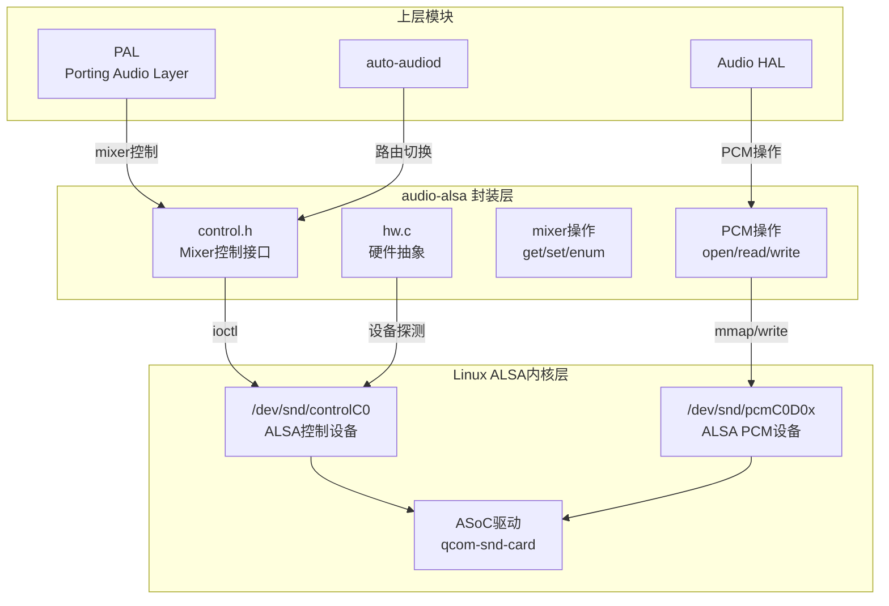
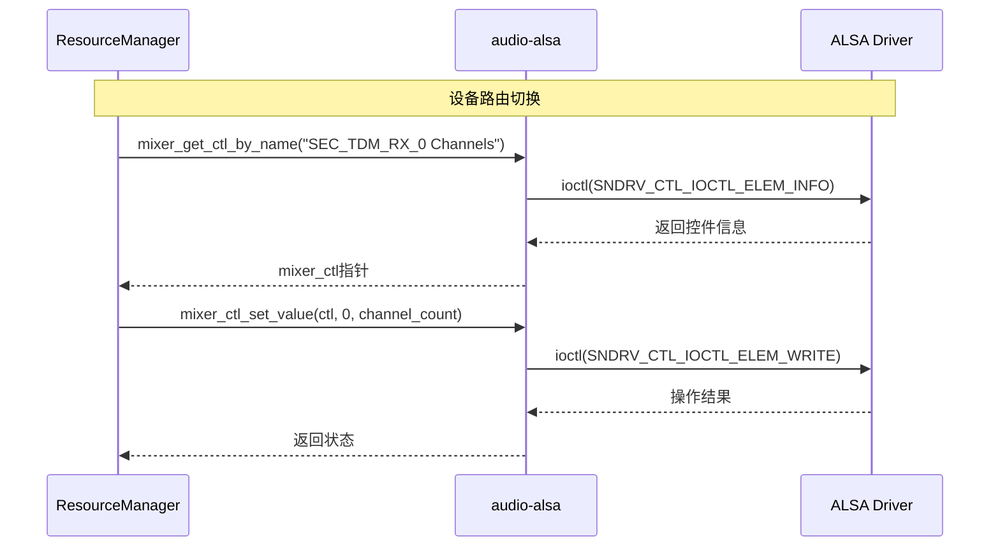

## 15.12 QC audio-alsa：ALSA用户空间封装层

> [← 上一个](15_11.1_编解码器插件_pluginscodecs.md) | [返回目录](README.md) | [下一个 →](15_13.1_QC_GEF_通用音效框架.md)

---

## 14.1 模块概述

`audio-alsa` 是 Qualcomm 音频子系统的 ALSA 用户空间封装层，为上层模块（PAL、Audio HAL、auto-audiod 等）提供对 Linux ALSA 子系统的统一访问接口。它封装了 ALSA mixer 控件操作和 PCM 设备操作，屏蔽了内核 ALSA driver 的底层细节。

在 AudioReach 架构中，PAL 通过 `audio-alsa` 操控 ALSA mixer 控件来实现设备路由切换、音量设置、TDM 通道配置等功能，而无需直接操作 `/dev/snd/` 设备节点。

> **源码路径**：`vendor/qcom/proprietary/mm-audio/audio-alsa/`
>
> **Legacy参考路径**（AOSP开源部分）：`hardware/qcom/audio/legacy/libalsa-intf/`

## 14.2 架构定位



| 层次 | 组件 | 说明 |
|------|------|------|
| 上层调用者 | PAL ResourceManager | 通过 `audio-alsa` 操作 mixer 控件完成路由切换 |
| 上层调用者 | auto-audiod | 通过 mixer 控件配置 TDM 通道和路由 |
| **封装层** | **audio-alsa** | 提供统一的 mixer/PCM 用户空间接口 |
| 内核层 | ALSA driver (ASoC) | 驱动 SoC 音频硬件 |

## 14.3 核心接口

### 15.12.3.1 Mixer 控制接口 (control.h)

`control.h` 定义了 ALSA mixer 控件的核心操作接口：

```c
// Mixer 打开/关闭
struct mixer *mixer_open(unsigned int card);
void mixer_close(struct mixer *mixer);

// Mixer 控件访问
unsigned int mixer_get_num_ctls(struct mixer *mixer);
struct mixer_ctl *mixer_get_ctl(struct mixer *mixer, unsigned int id);
struct mixer_ctl *mixer_get_ctl_by_name(struct mixer *mixer, const char *name);
struct mixer_ctl *mixer_get_ctl_by_name_and_index(struct mixer *mixer,
                                                   const char *name,
                                                   unsigned int index);

// 控件值设置
int mixer_ctl_set_value(struct mixer_ctl *ctl, unsigned int id, int value);
int mixer_ctl_set_array(struct mixer_ctl *ctl, const void *array, size_t count);

// 控件值获取
int mixer_ctl_get_value(struct mixer_ctl *ctl, unsigned int id);
int mixer_ctl_get_array(struct mixer_ctl *ctl, void *array, size_t count);

// 控件类型和范围查询
enum mixer_ctl_type mixer_ctl_get_type(struct mixer_ctl *ctl);
const char *mixer_ctl_get_name(struct mixer_ctl *ctl);
unsigned int mixer_ctl_get_num_values(struct mixer_ctl *ctl);
int mixer_ctl_get_range_min(struct mixer_ctl *ctl);
int mixer_ctl_get_range_max(struct mixer_ctl *ctl);
```

### 15.12.3.2 硬件探测接口 (hw.c)

`hw.c` 提供声卡和 PCM 设备的探测功能：

```c
// 声卡信息查询
int mixer_get_card_number(struct mixer *mixer);
const char *mixer_get_name(struct mixer *mixer);

// PCM 设备操作
struct pcm *pcm_open(unsigned int card, unsigned int device,
                     unsigned int flags, struct pcm_config *config);
void pcm_close(struct pcm *pcm);
int pcm_start(struct pcm *pcm);
int pcm_stop(struct pcm *pcm);

// PCM 数据读写
int pcm_write(struct pcm *pcm, const void *data, unsigned int count);
int pcm_read(struct pcm *pcm, void *data, unsigned int count);

// PCM 状态查询
int pcm_is_ready(struct pcm *pcm);
unsigned int pcm_get_buffer_size(struct pcm *pcm);
```

## 14.4 关键数据结构

### 15.12.4.1 struct mixer

```c
struct mixer {
    int fd;                     // /dev/snd/controlCX 文件描述符
    struct snd_ctl_card_info *card_info;
    struct mixer_ctl *ctl;      // 控件数组
    unsigned int count;         // 控件总数
    void *events;               // 事件回调
};
```

### 15.12.4.2 struct mixer_ctl

```c
struct mixer_ctl {
    struct mixer *mixer;        // 所属 mixer
    struct snd_ctl_elem_info *info;  // 控件信息
    char **ename;               // 枚举名称数组
    void *pdata;                // 私有数据
};
```

### 15.12.4.3 struct pcm

```c
struct pcm {
    int fd;                     // /dev/snd/pcmCXDX 文件描述符
    int timer_fd;               // 定时器fd
    unsigned rate;              // 采样率
    unsigned channels;          // 通道数
    unsigned flags;             // 打开标志(PCM_OUT/PCM_IN等)
    unsigned format;            // PCM格式
    unsigned running;           // 运行状态
    unsigned buffer_size;       // 缓冲区大小
    unsigned period_size;       // 周期大小
    void *addr;                 // mmap地址
    int card_no;                // 声卡号
    int device_no;              // 设备号
};
```

### 15.12.4.4 PCM 配置结构

```c
struct pcm_config {
    unsigned int channels;      // 通道数
    unsigned int rate;          // 采样率
    unsigned int period_size;   // 周期大小
    unsigned int period_count;  // 周期数
    enum pcm_format format;     // PCM格式
    unsigned int start_threshold;  // 启动阈值
    unsigned int stop_threshold;   // 停止阈值
    unsigned int silence_threshold; // 静默阈值
};
```

## 14.5 与上下游模块的交互

### 15.12.5.1 PAL → audio-alsa 交互

PAL 的 `ResourceManager` 通过 `audio-alsa` 的 mixer 接口完成以下操作：



### 15.12.5.2 典型调用场景

| 场景 | 调用链 | mixer 控件示例 |
|------|--------|---------------|
| 设备路由切换 | PAL→ResourceManager→audio-alsa→ALSA driver | `SEC_TDM_RX_0 Channel Map`, `SEC_TDM_RX_0 Format` |
| 音量设置 | PAL→ResourceManager→audio-alsa→ALSA driver | `TDM RX0 Volume` |
| TDM通道配置 | auto-audiod→audio-alsa→ALSA driver | `PRI_TDM_RX_0 Channels` |
| PCM流打开 | PAL→Session→audio-alsa→ALSA driver | pcm_open(card, device, flags, config) |

### 15.12.5.3 audio-alsa 在 SA8295 双域架构中的角色

在 SA8295 虚拟化架构下：
- **QNX 域 (PVM)**：auto-audiod 通过 audio-alsa 操作 QNX ALSA driver，配置 TDM 路由和通道
- **Android 域 (GVM)**：PAL 通过 audio-alsa 操作 Android ALSA driver（前端设备），DSP 图配置通过 AGM→gsl_fe→MM-HAB→QNX 侧 GSL 完成

> **注意**：Android 域的 audio-alsa 仅控制前端 PCM/Mixer 设备，后端路由由 QNX 域的 auto-audiod 统一管理。

## 14.6 与 Legacy libalsa-intf 的关系

AOSP 中保留了旧版 ALSA 封装层 `libalsa-intf`（路径：`hardware/qcom/audio/legacy/libalsa-intf/`），包含：

| 文件 | 功能 |
|------|------|
| `alsa_audio.h` | PCM/Mixer 核心数据结构定义 |
| `alsa_mixer.c` | Mixer 控件操作实现 |
| `alsa_pcm.c` | PCM 读写操作实现 |
| `alsa_ucm.c/h` | ALSA Use Case Manager 封装 |

`audio-alsa` 是 `libalsa-intf` 的演进版本，增加了对高通平台特定控件（如 TDM 通道映射、Compress offload）的支持。

## 14.7 调试参考

```bash
# 查看声卡信息
cat /proc/asound/cards

# 列出所有 mixer 控件
tinymix -D 0

# 设置 mixer 控件值
tinymix -D 0 "SEC_TDM_RX_0 Channels" 8

# 查看 PCM 设备
cat /proc/asound/pcm

# 查看音频路由状态
tinypcminfo
```