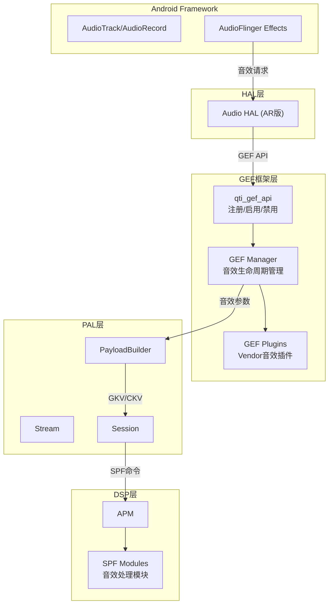
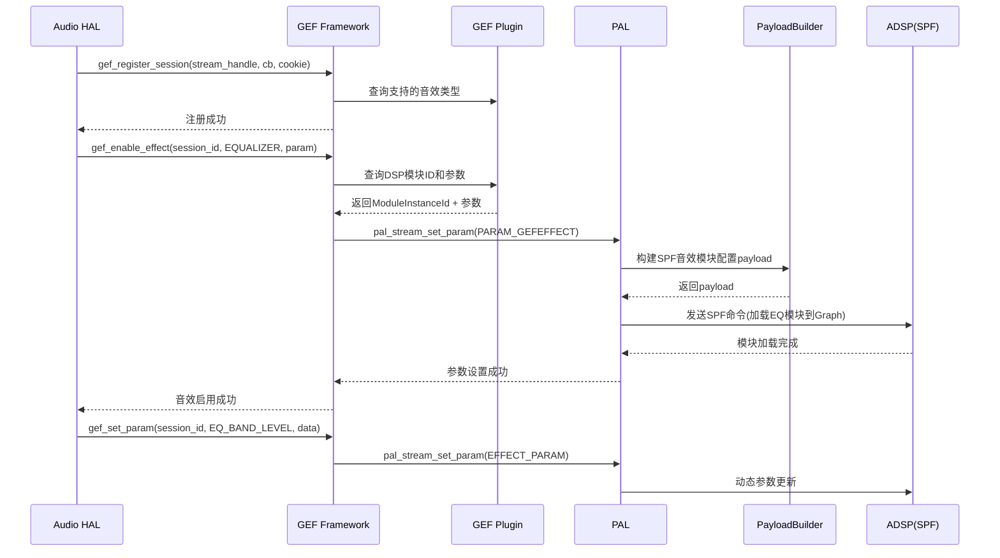

## 15.13 QC GEF：通用音效框架 (Generic Effect Framework)

> [← 上一个](15_12.1_QC_audio-alsa_ALSA层实现.md) | [返回目录](README.md) | [下一个 →](15_14.1_QC_audio-parsers_音频解析器.md)

---

## 15.1 模块概述

GEF (Generic Effect Framework) 是 Qualcomm 为 AudioReach 架构设计的通用音效框架，为 Vendor 音效插件提供统一的注册、管理和调度接口。GEF 充当音效插件与 PAL/Audio HAL 之间的中间层，使第三方音效处理模块能够以插件形式集成到音频处理链中。

在 AudioReach 架构下，GEF 替代了 Legacy 架构中直接通过 ADM/ASM IOCTL 加载音效的方式，改为通过 SPF (Signal Processing Framework) 的 Module 加载机制集成音效处理。

> **源码路径**：`vendor/qcom/proprietary/mm-audio/audio-generic-effect-framework-ar/`
>
> **关键文件**：
> - `api/qti_gef_api.h` — GEF 公共 API 头文件
> - `api/qti_gef_datatypes.h` — GEF 数据类型定义
> - `src/qti_gef_api.c` — GEF API 实现

## 15.2 架构定位



## 15.3 核心 API

### 15.13.3.1 会话管理 API

```c
/**
 * gef_register_session() — 注册GEF会话
 * @session_id:  音频会话ID（对应PAL stream handle）
 * @effects_cb:  音效事件回调函数
 * @cookie:      调用者私有数据
 *
 * 返回：0成功，负数失败
 */
int gef_register_session(uint64_t session_id,
                         gef_effects_callback_t effects_cb,
                         void *cookie);

/**
 * gef_deregister_session() — 注销GEF会话
 * @session_id:  音频会话ID
 */
int gef_deregister_session(uint64_t session_id);
```

### 15.13.3.2 音效控制 API

```c
/**
 * gef_enable_effect() — 启用音效
 * @session_id:   会话ID
 * @effect_type:  音效类型（GEF_EFFECT_TYPE_xxx）
 * @effect_param: 音效参数
 *
 * 启用指定类型的音效处理，GEF框架会加载对应的
 * DSP模块到SPF音频图中
 */
int gef_enable_effect(uint64_t session_id,
                      gef_effect_type_t effect_type,
                      gef_effect_param_t *effect_param);

/**
 * gef_disable_effect() — 禁用音效
 * @session_id:   会话ID
 * @effect_type:  音效类型
 */
int gef_disable_effect(uint64_t session_id,
                       gef_effect_type_t effect_type);
```

### 15.13.3.3 参数设置 API

```c
/**
 * gef_set_param() — 设置音效参数
 * @session_id:  会话ID
 * @param_id:    参数ID
 * @param_data:  参数数据
 * @param_size:  参数数据大小
 */
int gef_set_param(uint64_t session_id,
                  uint32_t param_id,
                  void *param_data,
                  size_t param_size);

/**
 * gef_get_param() — 获取音效参数
 */
int gef_get_param(uint64_t session_id,
                  uint32_t param_id,
                  void *param_data,
                  size_t *param_size);
```

## 15.4 关键数据类型

### 15.13.4.1 音效类型枚举 (qti_gef_datatypes.h)

```c
typedef enum {
    GEF_EFFECT_TYPE_BASS_BOOST,         // 低音增强
    GEF_EFFECT_TYPE_VIRTUALIZER,        // 虚拟环绕声
    GEF_EFFECT_TYPE_EQUALIZER,          // 均衡器
    GEF_EFFECT_TYPE_REVERB,             // 混响
    GEF_EFFECT_TYPE_VOLUME,             // 音量控制
    GEF_EFFECT_TYPE_LOUDNESS_ENHANCER,  // 响度增强
    GEF_EFFECT_TYPE_DYNAMICS_PROCESSING,// 动态处理
    GEF_EFFECT_TYPE_MAX
} gef_effect_type_t;
```

### 15.13.4.2 音效参数结构

```c
typedef struct gef_effect_param {
    gef_effect_type_t type;     // 音效类型
    uint32_t param_id;          // 参数ID
    uint32_t param_size;        // 参数数据大小
    void *param_data;           // 参数数据指针
} gef_effect_param_t;
```

### 15.13.4.3 回调函数类型

```c
/**
 * gef_effects_callback_t — GEF事件回调
 * @session_id:  触发事件的会话ID
 * @event_id:    事件ID
 * @event_data:  事件数据
 * @cookie:      注册时传入的私有数据
 */
typedef void (*gef_effects_callback_t)(uint64_t session_id,
                                       uint32_t event_id,
                                       void *event_data,
                                       void *cookie);
```

## 15.5 GEF 工作流程

### 15.13.5.1 音效启用流程



### 15.13.5.2 与 Legacy 音效框架的对比

| 特性 | GEF (AudioReach) | Legacy Effect |
|------|-------------------|---------------|
| 音效加载方式 | SPF Module 动态加载 | ADM/ASM IOCTL |
| 音效注册 | `gef_register_session()` | 直接通过 HAL 创建 |
| 参数传递 | PAL API → PayloadBuilder → SPF | HAL → IOCTL → ADM |
| 支持DSP离线处理 | 是（SPF Module可独立运行） | 有限 |
| Vendor插件扩展 | 支持（GEF Plugin接口） | 有限（需修改HAL） |

## 15.6 与上下游模块的交互

### 15.13.6.1 上游：Audio HAL → GEF

Audio HAL (AR版) 通过 GEF API 管理音效生命周期：
- 流创建时调用 `gef_register_session()` 注册
- 音效启用时调用 `gef_enable_effect()` 加载 DSP 音效模块
- 参数调整时调用 `gef_set_param()` 更新音效参数
- 流销毁时调用 `gef_deregister_session()` 注销

### 15.13.6.2 下游：GEF → PAL

GEF 通过 PAL API 将音效配置下发到 DSP：
- `pal_stream_set_param()` — 设置音效参数（Module Instance ID、参数payload）
- 参数通过 `PayloadBuilder` 转换为 SPF 可识别的格式
- SPF 在 Graph 中动态插入/移除音效处理模块

### 15.13.6.3 横向：GEF Plugin

GEF Plugin 是 Vendor 提供的音效实现库，遵循 GEF 插件接口规范：
- 查询支持的音效类型和 DSP 模块 ID
- 提供默认参数配置
- 处理音效参数转换（Android Effect 参数 → DSP Module 参数）

## 15.7 调试参考

```bash
# 查看GEF相关日志
logcat -s GEF qti_gef

# 检查GEF音效注册状态
# 查看PAL stream参数设置日志
logcat -s PAL PayloadBuilder

# 检查SPF模块加载
logcat -s APM GSL
```