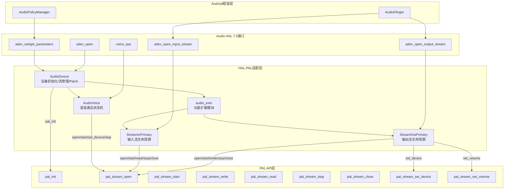
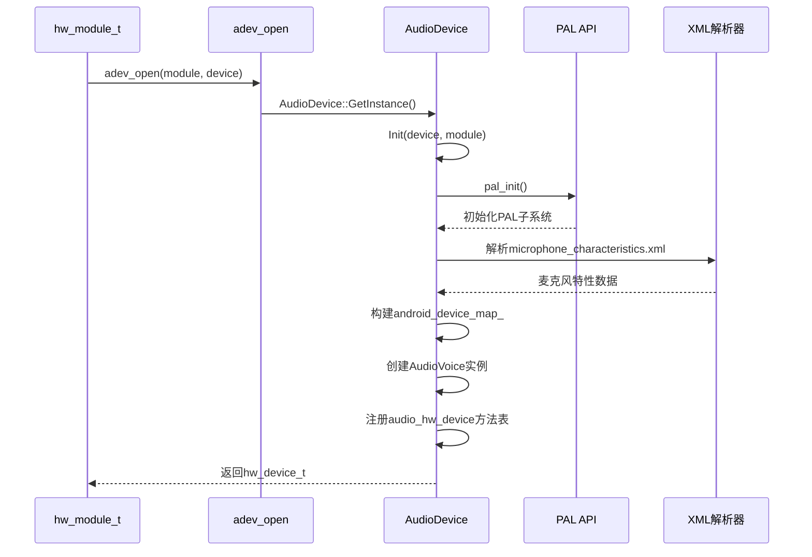
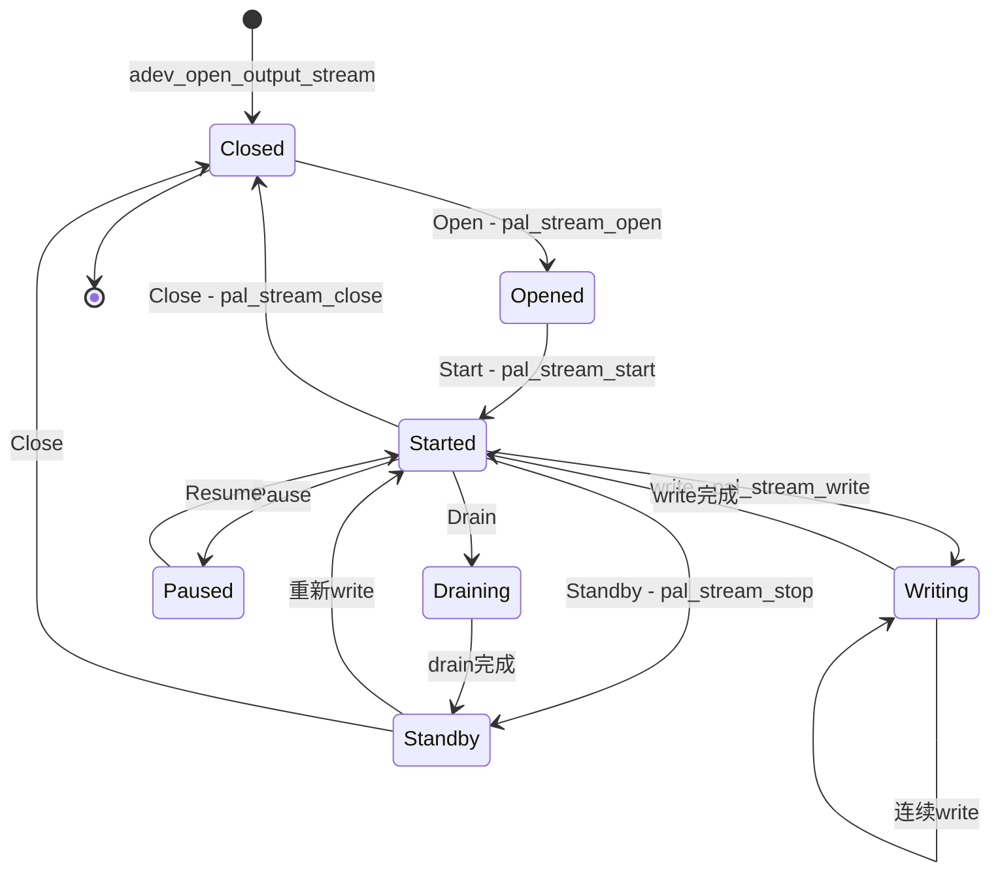
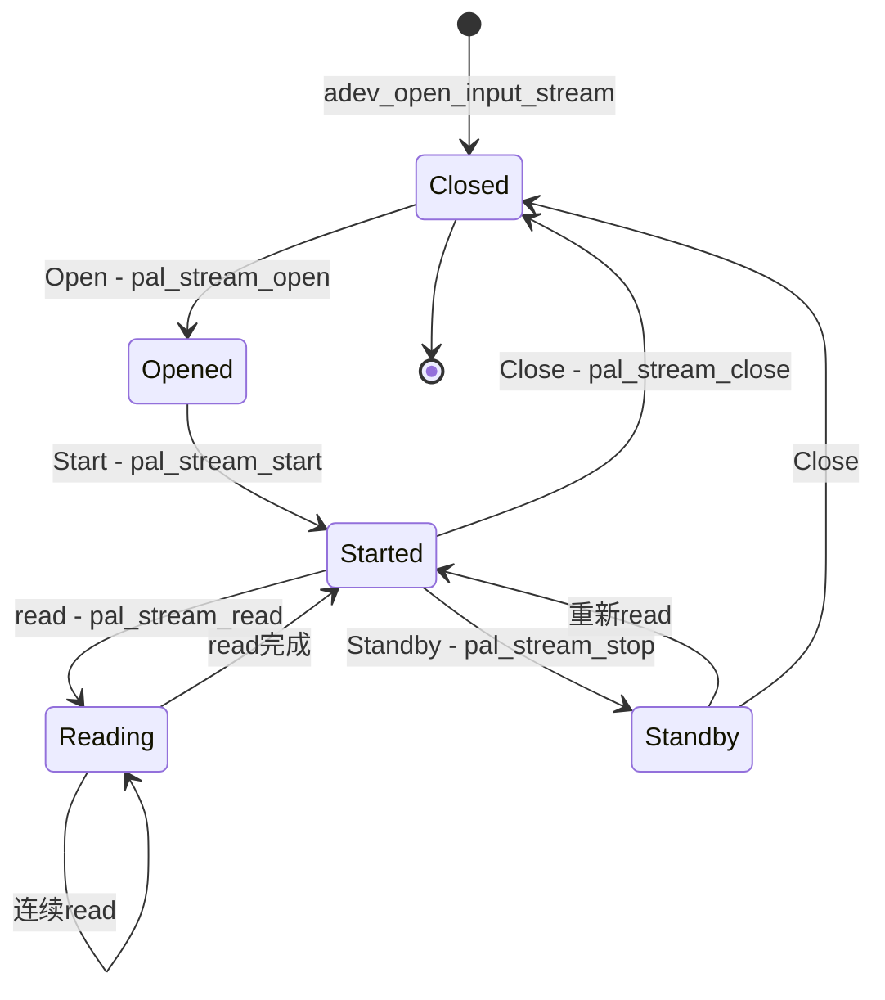
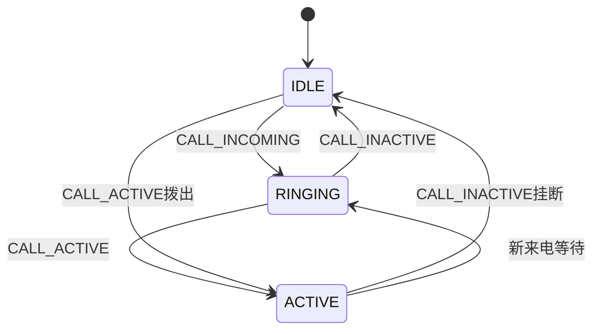
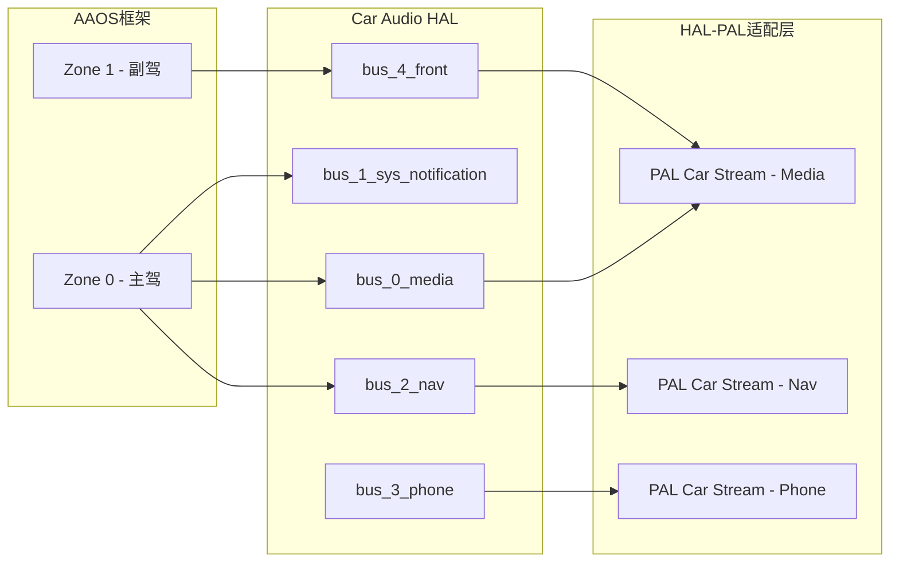
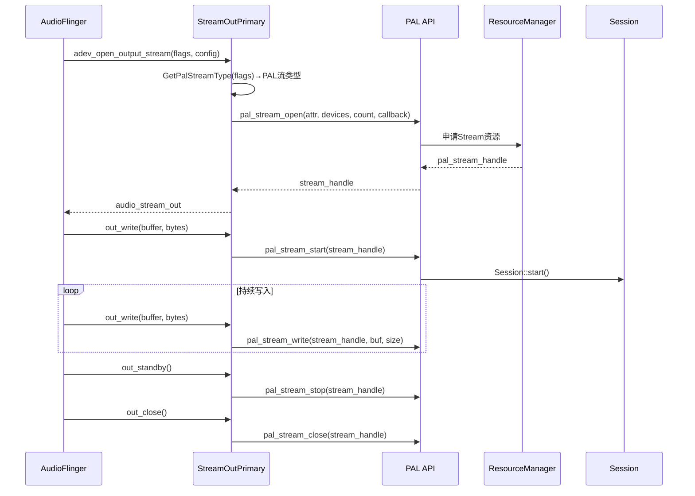
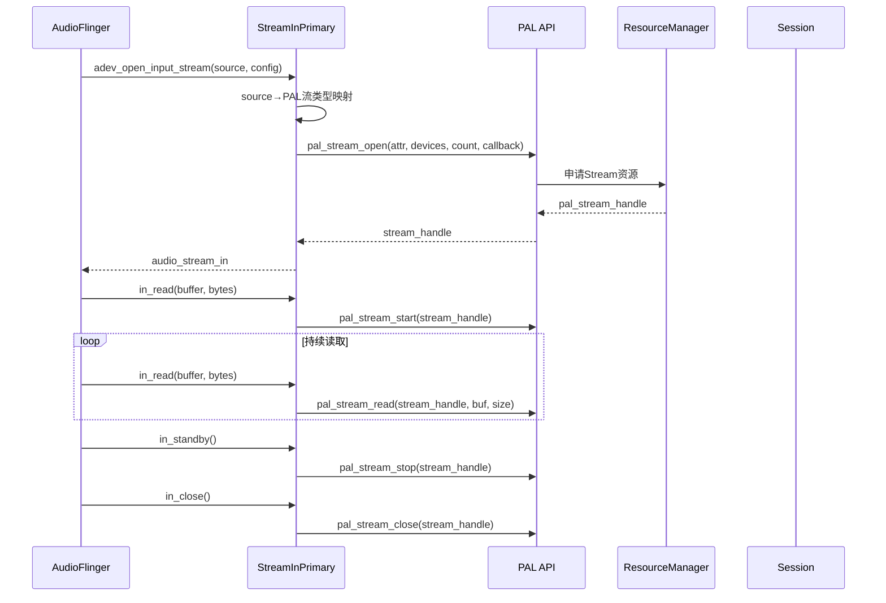
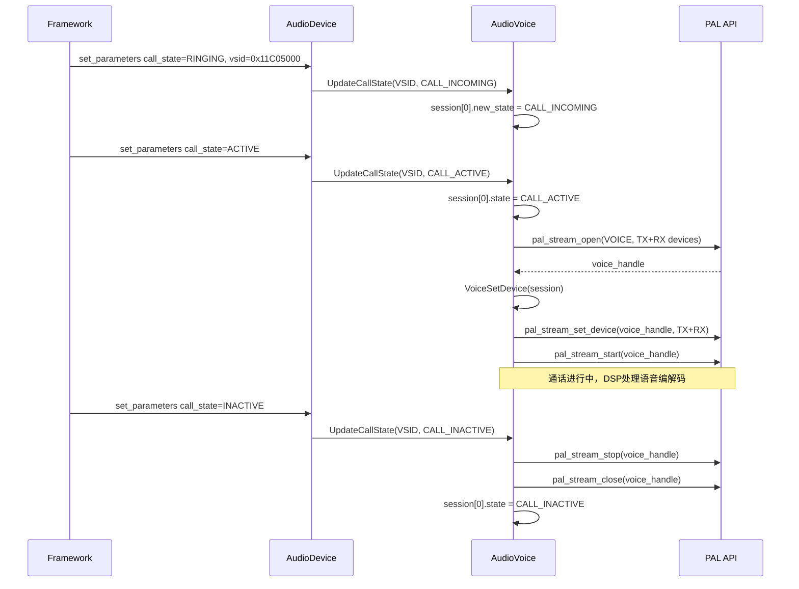

## 15.10 HAL-PAL适配层架构

> [← 上一个](15_15.9_配置文件列表.md) | [← 返回15章](README.md) | [返回导航](../README.md) | [下一个 →](15_15.11_编解码器插件_pluginscodecs.md)

---

HAL-PAL适配层是Audio HAL 7.0与PAL API之间的桥梁，将Android框架的音频语义（audio_hw_device、audio_stream_out/in接口）转换为PAL的Stream/Device/Session抽象。源码位于`vendor/qcom/opensource/audio-hal-ar/primary-hal/hal-pal/`，由AudioDevice、StreamOutPrimary、StreamInPrimary、AudioVoice等核心类和audio_extn扩展模块构成。

> **⚠️ 源码核实（勘误）**：核心类名以真实源码为准（`AudioStream.h`）：
> - 输出流类为 **`StreamOutPrimary`**（`AudioStream.h:477`，`class StreamOutPrimary : public StreamPrimary`），**非** "AudioStreamOut"
> - 输入流类为 **`StreamInPrimary`**（`AudioStream.h:561`，`class StreamInPrimary : public StreamPrimary`），**非** "AudioStreamIn"
> - 两者共同继承基类 **`StreamPrimary`**（`AudioStream.h:434`），文件名为 **`AudioStream.cpp/.h`**（非 AudioStreamOut/In.cpp）
> - `AudioDevice`（`AudioDevice.h:129`）、`AudioPatch`（`AudioDevice.h:109`）、`AudioVoice`（`AudioVoice.h:69`）类名属实
> - `AudioDevice` 真实方法：`GetInstance()`、`CreateStreamOut()`/`CloseStreamOut()`、`CreateStreamIn()`/`CloseStreamIn()`、`CreateAudioPatch()`/`ReleaseAudioPatch()`、`SetParameters()`、`GetPalDeviceIds()`；成员 `android_device_map_`、`patch_map_`、`stream_out_list_`/`stream_in_list_`
> - `StreamOutPrimary`/`StreamInPrimary` 真实方法：`Open()`/`Start()`/`Stop()`/`Standby()`/`Pause()`/`Resume()`/`Drain()`/`Flush()`/`GetFrames()`；成员 `streamAttributes_`、`pal_stream_handle_`
> - `AudioVoice` 真实方法：`RouteStream()`、`SetMode()`、`VoiceStart()`/`VoiceStop()`、`UpdateCalls()`、`SetMicMute()`、`SetVoiceVolume()`

### 15.10.1 整体架构



### 15.10.2 AudioDevice类详解

AudioDevice是Primary HAL的核心管理类，实现`audio_hw_device`接口，负责设备初始化、流创建/销毁、Audio Patch管理和麦克风特性解析。

#### 初始化流程：adev_open()



**初始化关键步骤**：
1. **单例获取**：通过`AudioDevice::GetInstance()`获取全局唯一实例
2. **PAL初始化**：调用`pal_init()`初始化PAL子系统（ResourceManager、Session、Device等）
3. **XML解析**：通过Expat解析器解析`microphone_characteristics.xml`，将PAL设备ID映射到`audio_microphone_characteristic_t`结构体
4. **设备映射构建**：建立`android_device_map_`（`audio_devices_t → pal_device_id_t`映射表）
5. **AudioVoice创建**：初始化语音通话管理实例
6. **方法表注册**：填充`audio_hw_device`方法表（open_output_stream、set_parameters等）

#### 核心数据结构

```cpp
class AudioDevice {
public:
    static std::shared_ptr<AudioDevice> GetInstance();
    int Init(hw_device_t **device, const hw_module_t *module);
    // 流管理
    std::shared_ptr<StreamOutPrimary> CreateStreamOut(...);
    void CloseStreamOut(std::shared_ptr<StreamOutPrimary> stream);
    std::shared_ptr<StreamInPrimary> CreateStreamIn(...);
    void CloseStreamIn(std::shared_ptr<StreamInPrimary> stream);
    // Audio Patch
    int CreateAudioPatch(audio_patch_handle_t* handle,
                         const std::vector<struct audio_port_config>& sources,
                         const std::vector<struct audio_port_config>& sinks);
    int ReleaseAudioPatch(audio_patch_handle_t handle);
    // 设备映射
    int GetPalDeviceIds(const std::set<audio_devices_t>& hal_device_id,
                        pal_device_id_t* pal_device_id);
    // 参数控制
    int SetParameters(const char *kvpairs);
    char* GetParameters(const char *keys);
    int SetMode(const audio_mode_t mode);
    int SetVoiceVolume(float volume);
    int SetMicMute(bool state);
    // 麦克风特性
    static microphone_characteristics_t microphones;
    static snd_device_to_mic_map_t microphone_maps[PAL_MAX_INPUT_DEVICES];
protected:
    std::shared_ptr<AudioVoice> voice_;
    std::vector<std::shared_ptr<StreamOutPrimary>> stream_out_list_;
    std::vector<std::shared_ptr<StreamInPrimary>> stream_in_list_;
    std::map<audio_devices_t, pal_device_id_t> android_device_map_;
    std::map<audio_patch_handle_t, AudioPatch*> patch_map_;
};
```

#### AudioPatch类

AudioDevice通过AudioPatch管理设备间路由，支持3种Patch类型：

| PatchType | 说明 | 典型场景 |
|-----------|------|----------|
| PATCH_PLAYBACK | 播放Patch（源→输出设备） | AudioFlinger混音输出 |
| PATCH_CAPTURE | 录音Patch（输入设备→源） | 麦克风录音 |
| PATCH_DEVICE_LOOPBACK | 设备间Loopback | 音频环路测试、FM到扬声器 |

#### 参数管理：set_parameters/get_parameters

AudioDevice的`SetParameters()`是Android框架向HAL传递运行时参数的核心通道，采用key=value对格式：

| 参数Key | 说明 | HAL-PAL处理 |
|---------|------|-------------|
| AUDIO_PARAMETER_KEY_VSID | 语音VSID标识 | 传递给AudioVoice |
| AUDIO_PARAMETER_KEY_CALL_STATE | 通话状态变更 | 触发Voice状态机更新 |
| AUDIO_PARAMETER_KEY_DEVICE_MUTE | 设备静音 | 映射为pal_device_mute_t |
| AUDIO_PARAMETER_KEY_DIRECTION | 麦克风/扬声器方向 | TX/RX设备路由 |
| AUDIO_PARAMETER_KEY_VOLUME_BOOST | 音量增强 | voice_session_t标志 |
| AUDIO_PARAMETER_KEY_SLOWTALK | 慢速通话 | voice_session_t标志 |
| AUDIO_PARAMETER_KEY_HD_VOICE | HD语音 | voice_session_t标志 |
| AUDIO_PARAMETER_KEY_TTY_MODE | TTY模式 | tty_off/vco/hco/full |
| AUDIO_PARAMETER_KEY_SCREEN_STATE | 屏幕状态 | 功耗策略调整 |
| AUDIO_PARAMETER_KEY_BT_SCO | BT SCO状态 | audio_extn/hfp处理 |

### 15.10.3 StreamOutPrimary详解

StreamOutPrimary继承自StreamPrimary基类，实现`audio_stream_out`接口，负责输出流的完整生命周期管理。

#### 输出流生命周期



#### PAL流类型映射

StreamOutPrimary通过`GetPalStreamType()`将Android的`audio_output_flags_t`映射为PAL流类型：

| audio_output_flags_t | pal_stream_type_t | 说明 |
|----------------------|-------------------|------|
| AUDIO_OUTPUT_FLAG_DIRECT | PAL_STREAM_COMPRESSED | 压缩直出（Offload） |
| AUDIO_OUTPUT_FLAG_DIRECT \| AUDIO_OUTPUT_FLAG_COMPRESS_OFFLOAD | PAL_STREAM_COMPRESSED | Offload播放 |
| AUDIO_OUTPUT_FLAG_VOIP_RX | PAL_STREAM_VOIP_RX | VoIP接收 |
| AUDIO_OUTPUT_FLAG_FAST | PAL_STREAM_LOW_LATENCY | 低延迟播放 |
| AUDIO_OUTPUT_FLAG_MMAP_NOIRQ | PAL_STREAM_ULTRA_LOW_LATENCY | MMAP播放 |
| AUDIO_OUTPUT_FLAG_DEEP_BUFFER | PAL_STREAM_DEEP_BUFFER | Deep Buffer播放 |
| 无标志 | PAL_STREAM_DEEP_BUFFER | 默认Deep Buffer |
| 车载标志 | PAL_STREAM_PCM_CALL / CAR_STREAM | 车载音频流 |

#### 缓冲区参数与延迟

| 常量 | 值 | 说明 |
|------|-----|------|
| LOW_LATENCY_PLAYBACK_PERIOD_SIZE | 240帧（5ms@48kHz） | 低延迟播放周期 |
| LOW_LATENCY_PLAYBACK_PERIOD_COUNT | 2 | 低延迟周期数 |
| DEEP_BUFFER_PLAYBACK_PERIOD_SIZE | 1920帧（40ms@48kHz） | Deep Buffer周期 |
| DEEP_BUFFER_PLAYBACK_PERIOD_COUNT | 2 | Deep Buffer周期数 |
| MMAP_PERIOD_SIZE | 48帧（1ms@48kHz） | MMAP周期 |
| MMAP_PERIOD_COUNT_DEFAULT | 512 | MMAP周期数 |
| ULL_PERIOD_SIZE | 48帧（1ms@48kHz） | ULL周期 |
| ULL_PERIOD_COUNT_DEFAULT | 512 | ULL周期数 |
| DEFAULT_OUTPUT_SAMPLING_RATE | 48000 | 默认输出采样率 |

| 延迟类型 | 值（ms） | 说明 |
|----------|----------|------|
| LOW_LATENCY_PLATFORM_DELAY | 13 | 低延迟播放延迟 |
| DEEP_BUFFER_PLATFORM_DELAY | 70 | Deep Buffer延迟 |
| PCM_OFFLOAD_PLATFORM_DELAY | 30 | PCM Offload延迟 |
| MMAP_PLATFORM_DELAY | 3 | MMAP延迟 |
| ULL_PLATFORM_DELAY | 4 | Ultra Low Latency延迟 |

#### 核心方法

```cpp
class StreamOutPrimary : public StreamPrimary {
public:
    ssize_t write(const void *buffer, size_t bytes);  // PCM数据写入→pal_stream_write
    int Open();                                        // pal_stream_open+属性配置
    int Standby();                                     // pal_stream_stop
    int SetVolume(float left, float right);            // pal_stream_set_volume
    int Pause()/Resume();                              // pal_stream_pause/resume
    int Drain(audio_drain_type_t type);                // pal_stream_drain
    int Flush();                                       // pal_stream_flush
    int RouteStream(const std::set<audio_devices_t>&); // 路由切换→pal_stream_set_device
    static pal_stream_type_t GetPalStreamType(
        audio_output_flags_t halStreamFlags, char *address);
    int64_t GetRenderLatency(audio_output_flags_t flags, char *address);
    // Offload Effects
    int StartOffloadEffects(audio_io_handle_t, pal_stream_handle_t*);
    int StopOffloadEffects(audio_io_handle_t, pal_stream_handle_t*);
    // MMAP支持
    int CreateMmapBuffer(int32_t min_size_frames, struct audio_mmap_buffer_info *info);
    int GetMmapPosition(struct audio_mmap_position *position);
protected:
    pal_stream_handle_t* pal_stream_handle_;
    struct pal_stream_attributes streamAttributes_;
    audio_output_flags_t flags_;
};
```

#### 格式映射表（Android→PAL）

| Android格式 | PAL格式 | 说明 |
|-------------|---------|------|
| AUDIO_FORMAT_PCM_16_BIT | PAL_AUDIO_FMT_PCM_S16_LE | 16位PCM |
| AUDIO_FORMAT_PCM_24_BIT_PACKED | PAL_AUDIO_FMT_PCM_S24_3LE | 24位打包PCM |
| AUDIO_FORMAT_PCM_8_24_BIT | PAL_AUDIO_FMT_PCM_S24_LE | 8+24位PCM |
| AUDIO_FORMAT_PCM_32_BIT | PAL_AUDIO_FMT_PCM_S32_LE | 32位PCM |
| AUDIO_FORMAT_MP3 | PAL_AUDIO_FMT_MP3 | MP3压缩格式 |
| AUDIO_FORMAT_AAC | PAL_AUDIO_FMT_AAC | AAC压缩格式 |
| AUDIO_FORMAT_FLAC | PAL_AUDIO_FMT_FLAC | FLAC无损压缩 |
| AUDIO_FORMAT_ALAC | PAL_AUDIO_FMT_ALAC | ALAC无损压缩 |
| AUDIO_FORMAT_APE | PAL_AUDIO_FMT_APE | APE无损压缩 |

### 15.10.4 StreamInPrimary详解

StreamInPrimary继承自StreamPrimary基类，实现`audio_stream_in`接口，负责录音流的完整生命周期管理。

#### 录音流生命周期



#### 录音PAL流类型映射

| audio_input_flags_t | pal_stream_type_t | 说明 |
|---------------------|-------------------|------|
| AUDIO_INPUT_FLAG_NONE | PAL_STREAM_RECORD | 普通录音 |
| AUDIO_INPUT_FLAG_FAST | PAL_STREAM_LOW_LATENCY_RECORD | 低延迟录音 |
| AUDIO_INPUT_FLAG_MMAP_NOIRQ | PAL_STREAM_ULTRA_LOW_LATENCY | MMAP录音 |
| AUDIO_INPUT_FLAG_VOIP_TX | PAL_STREAM_VOIP_TX | VoIP发送 |
| AUDIO_INPUT_FLAG_HW_HOTWORD | PAL_STREAM_VOICE_UI | 热词检测 |

#### 录音缓冲区参数

| 常量 | 值 | 说明 |
|------|-----|------|
| LOW_LATENCY_CAPTURE_PERIOD_SIZE | 240帧（5ms@48kHz） | 低延迟录音周期 |
| LOW_LATENCY_CAPTURE_PERIOD_COUNT | 2 | 低延迟周期数 |
| DEEP_BUFFER_CAPTURE_PERIOD_SIZE | 1024帧（21ms@48kHz） | Deep Buffer录音周期 |
| DEEP_BUFFER_CAPTURE_PERIOD_COUNT | 2 | Deep Buffer周期数 |
| VOIP_CAPTURE_PERIOD_SIZE | 240帧 | VoIP录音周期 |
| MMAP_CAPTURE_PERIOD_SIZE | 48帧（1ms@48kHz） | MMAP录音周期 |

#### 录音核心方法

```cpp
class StreamInPrimary : public StreamPrimary {
public:
    ssize_t read(void *buffer, size_t bytes);          // PCM数据读取→pal_stream_read
    int Open();                                        // pal_stream_open+录音属性配置
    int Standby();                                     // pal_stream_stop
    int SetGain(float gain);                           // 增益设置
    int RouteStream(const std::set<audio_devices_t>&); // 路由切换
    // MMAP支持
    int CreateMmapBuffer(int32_t min_size_frames, struct audio_mmap_buffer_info *info);
    int GetMmapPosition(struct audio_mmap_position *position);
    // 声学回声消除参考
    int SetECRef(pal_stream_handle_t* pal_stream_handle);
protected:
    pal_stream_handle_t* pal_stream_handle_;
    struct pal_stream_attributes streamAttributes_;
    audio_input_flags_t flags_;
};
```

#### 录音源映射

| audio_source_t | PAL流类型 | 说明 |
|----------------|-----------|------|
| AUDIO_SOURCE_DEFAULT | PAL_STREAM_RECORD | 默认录音源 |
| AUDIO_SOURCE_MIC | PAL_STREAM_RECORD | 麦克风 |
| AUDIO_SOURCE_VOICE_UPLINK | PAL_STREAM_RECORD | 通话上行录音 |
| AUDIO_SOURCE_VOICE_DOWNLINK | PAL_STREAM_RECORD | 通话下行录音 |
| AUDIO_SOURCE_VOICE_CALL | PAL_STREAM_RECORD | 双向通话录音 |
| AUDIO_SOURCE_CAMCORDER | PAL_STREAM_RECORD | 摄像机录音 |
| AUDIO_SOURCE_VOICE_RECOGNITION | PAL_STREAM_VOICE_UI | 语音识别 |
| AUDIO_SOURCE_VOICE_COMMUNICATION | PAL_STREAM_VOIP_TX | VoIP通话 |
| AUDIO_SOURCE_ECHO_REFERENCE | PAL_STREAM_ECHO_REF | 回声参考 |

### 15.10.5 AudioVoice详解

AudioVoice管理语音通话的完整生命周期，包括VSID映射、通话状态机、双SIM支持和设备路由。

#### 语音通话状态机



**状态机核心逻辑**：
1. **IDLE→RINGING**：收到来电，`UpdateCallState()`更新VSID对应的`new_state`为CALL_INCOMING
2. **RINGING→ACTIVE**：接听来电，`new_state`变更为CALL_ACTIVE，触发`VoiceStart()`
3. **ACTIVE→IDLE**：挂断通话，`new_state`变更为CALL_INACTIVE，触发`VoiceStop()`
4. **IDLE→ACTIVE**：拨出电话直接进入ACTIVE状态

#### VSID与双SIM支持

| 常量 | 值 | 说明 |
|------|-----|------|
| VOICEMMODE1_VSID | 0x11C05000 | SIM1语音会话标识 |
| VOICEMMODE2_VSID | 0x11DC5000 | SIM2语音会话标识 |
| MAX_VOICE_SESSIONS | 2 | 最大语音会话数 |
| CALL_INACTIVE | 1 | 通话未激活 |
| CALL_ACTIVE | 2 | 通话激活 |

#### 语音会话数据结构

```cpp
struct voice_session_t {
    call_state_t state;           // current_/new_通话状态
    uint32_t vsid;                // VSID标识(SIM1/SIM2)
    uint32_t tty_mode;            // TTY模式(tty_off/vco/hco/full)
    pal_stream_handle_t* pal_voice_handle;  // PAL语音流句柄
    bool volume_boost;            // 音量增强标志
    bool slow_talk;               // 慢速通话标志
    bool hd_voice;                // HD语音标志
    struct pal_volume_data *pal_vol_data;  // PAL音量数据
    pal_device_mute_t device_mute;         // 设备静音状态
};
```

#### AudioVoice核心方法

```cpp
class AudioVoice {
public:
    int VoiceStart(voice_session_t *session);    // pal_stream_open+start
    int VoiceStop(voice_session_t *session);     // pal_stream_stop+close
    int VoiceSetDevice(voice_session_t *session); // pal_stream_set_device(TX+RX)
    int UpdateCallState(uint32_t vsid, int call_state); // 状态机驱动
    int SetMicMute(bool mute);                   // TX设备静音
    int SetVoiceVolume(float volume);            // pal_stream_set_volume
    int RouteStream(const std::set<audio_devices_t>&);  // 语音路由切换
    int GetMatchingTxDevices(...);                // RX→TX设备匹配
    pal_device_id_t pal_voice_tx_device_id_;     // 当前TX PAL设备ID
    pal_device_id_t pal_voice_rx_device_id_;     // 当前RX PAL设备ID
};
```

### 15.10.6 HAL-PAL参数映射

#### 设备映射：audio_devices_t ↔ pal_device_id_t

| audio_devices_t | pal_device_id_t | 说明 |
|-----------------|-----------------|------|
| AUDIO_DEVICE_OUT_EARPIECE | PAL_DEVICE_OUT_HANDSET | 听筒输出 |
| AUDIO_DEVICE_OUT_SPEAKER | PAL_DEVICE_OUT_SPEAKER | 扬声器输出 |
| AUDIO_DEVICE_OUT_WIRED_HEADSET | PAL_DEVICE_OUT_WIRED_HEADSET | 有线耳机输出 |
| AUDIO_DEVICE_OUT_WIRED_HEADPHONE | PAL_DEVICE_OUT_WIRED_HEADPHONE | 有线耳机（无麦） |
| AUDIO_DEVICE_OUT_BLUETOOTH_SCO | PAL_DEVICE_OUT_BLUETOOTH_SCO | BT SCO输出 |
| AUDIO_DEVICE_OUT_BLUETOOTH_A2DP | PAL_DEVICE_OUT_BLUETOOTH_A2DP | BT A2DP输出 |
| AUDIO_DEVICE_OUT_AUX_DIGITAL | PAL_DEVICE_OUT_HDMI | HDMI输出 |
| AUDIO_DEVICE_OUT_USB_DEVICE | PAL_DEVICE_OUT_USB_DEVICE | USB输出 |
| AUDIO_DEVICE_OUT_TELEPHONY_TX | PAL_DEVICE_OUT_VOICE_TX | 通话TX |
| AUDIO_DEVICE_IN_BUILTIN_MIC | PAL_DEVICE_IN_HANDSET_MIC | 内置麦克风 |
| AUDIO_DEVICE_IN_WIRED_HEADSET | PAL_DEVICE_IN_WIRED_HEADSET | 有线耳机麦克风 |
| AUDIO_DEVICE_IN_BLUETOOTH_SCO_HEADSET | PAL_DEVICE_IN_BLUETOOTH_SCO | BT SCO麦克风 |
| AUDIO_DEVICE_IN_USB_DEVICE | PAL_DEVICE_IN_USB_DEVICE | USB麦克风 |
| AUDIO_DEVICE_IN_TELEPHONY_RX | PAL_DEVICE_IN_VOICE_RX | 通话RX |

> **映射查找流程**：AudioDevice::GetPalDeviceIds()遍历`android_device_map_`，将`std::set<audio_devices_t>`转换为`pal_device_id_t[]`数组，每个HAL设备ID对应一个PAL设备ID。

### 15.10.7 audio_extn扩展模块详解

HAL-PAL适配层通过`audio_extn/`目录下的扩展模块支持各种增强功能。这些模块通过函数指针或直接调用方式与核心类交互。

> **⚠️ 源码核实（勘误）**：真实 `audio_extn/` 目录仅包含以下扩展模块，文件后缀为 **`.cpp`**（非 `.c`），且统一由 `AudioExtn.cpp`/`AudioExtn.h`（大写驼峰）聚合封装。此前列出的 `a2dp`、`custom_compress`、`spatial_audio`、`display_port`、`keep_alive`、`incall_music`、`compressor` 等模块在本源码树中**不存在**，属虚构，已删除。

| 扩展模块（真实源码文件） | 说明 | HAL-PAL交互方式 |
|----------|------|-----------------|
| `auto_hal.cpp` | 车载音频区域管理 | Car Stream→PAL Car Stream映射 |
| `battery_listener.cpp` | 电池状态监听 | 影响PA供电和功耗策略 |
| `FM.cpp` | FM收音机 | FM Tuner→PAL Stream |
| `Hfp.cpp` | HFP蓝牙通话 | SCO→PAL Voice Session |
| `soundtrigger.cpp` | 语音触发 | PAL SVA/Hotword Stream |
| `Gef.cpp` | Generic Effect Framework | Offload Effect Plugin |
| `Gain.cpp` | 增益控制 | PAL Volume Control |
| `AudioExtn.cpp`/`AudioExtn.h` | 扩展模块统一聚合封装层 | 各扩展的函数指针加载与分派 |

> 说明：A2DP/蓝牙音频 Offload 在本平台由 PAL 侧（`Device`/`Session` 与 BT 编解码映射，见 15.9 `bt_codecs` 与 15章 Device 层）处理，HAL-PAL 侧 `audio_extn/` 未提供独立的 a2dp 扩展文件。

#### 旋屏处理

设备旋转时需要调整麦克风阵列的声学参考方向：
1. 框架通过`set_parameters("rotation=X")`通知旋转角度
2. HAL-PAL解析旋转参数→更新PAL设备的声道映射
3. 对于立体声麦克风，需要交换左右声道以匹配设备方向

#### 听筒校准

听筒（Handset Receiver）的声学特性需要定期校准：
1. 从`/vendor/etc/acdbdata/`加载校准数据
2. 通过`pal_stream_set_device()`的device_config传递校准参数
3. 支持AAC/AANC（Active Ambient Noise Cancellation）校准

### 15.10.8 SA8295车机特化

SA8295平台是高通车规级SoC，HAL-PAL适配层针对车载场景进行了多项特化设计。

#### 多区域音频

AAOS采用多区域音频架构，每个音频区域对应独立的音量控制和路由策略：

| 车载流类型 | 常量值 | PAL流类型 | 说明 |
|-----------|--------|-----------|------|
| CAR_AUDIO_STREAM_MEDIA | 0 | PAL_STREAM_PCM_CALL | 媒体流 |
| CAR_AUDIO_STREAM_SYS_NOTIFICATION | 1 | PAL_STREAM_PCM_CALL | 系统通知流 |
| CAR_AUDIO_STREAM_NAV_GUIDANCE | 2 | PAL_STREAM_PCM_CALL | 导航流 |
| CAR_AUDIO_STREAM_PHONE | 3 | PAL_STREAM_PCM_CALL | 电话流 |
| CAR_AUDIO_STREAM_FRONT_PASSENGER | 8 | PAL_STREAM_PCM_CALL | 前排乘客流 |
| CAR_AUDIO_STREAM_REAR_SEAT | 16 | PAL_STREAM_PCM_CALL | 后排座椅流 |
| MAX_CAR_AUDIO_STREAMS | 32 | - | 最大车载流数 |

#### Bus Device映射

车载音频使用bus device模型，每个bus对应一个物理输出通道：



#### AudioControl HAL集成点

HAL-PAL与AudioControl HAL（AAOS车载HAL）的集成关系：

1. **音频焦点委托**：AudioControl HAL将车载焦点请求转发给Android AudioPolicyManager
2. **ducking控制**：导航提示音ducking通过AudioControl HAL→AudioPolicy→AudioFlinger→HAL-PAL路径实现
3. **音量同步**：车载音量旋钮变更通过AudioControl HAL→CarAudioService→AudioFlinger→HAL-PAL路径同步

### 15.10.9 关键数据流

#### Playback完整流程



#### Recording完整流程



#### Voice Call完整流程



### 15.10.10 UseCase枚举完整映射

HAL-PAL适配层通过UseCase枚举标识不同的音频场景，每个UseCase对应唯一的字符串标识和PAL流配置：

| 分类 | UseCase枚举 | 字符串标识 | PAL流类型 |
|------|-------------|-----------|-----------|
| 播放 | USECASE_AUDIO_PLAYBACK_DEEP_BUFFER | deep-buffer-playback | PAL_STREAM_DEEP_BUFFER |
| 播放 | USECASE_AUDIO_PLAYBACK_LOW_LATENCY | low-latency-playback | PAL_STREAM_LOW_LATENCY |
| 播放 | USECASE_AUDIO_PLAYBACK_ULL | audio-ull-playback | PAL_STREAM_ULTRA_LOW_LATENCY |
| 播放 | USECASE_AUDIO_PLAYBACK_MMAP | mmap-playback | PAL_STREAM_ULTRA_LOW_LATENCY |
| 播放 | USECASE_AUDIO_PLAYBACK_OFFLOAD(0-9) | compress-offload-playback(0-9) | PAL_STREAM_COMPRESSED |
| 播放 | USECASE_AUDIO_PLAYBACK_VOIP | audio-playback-voip | PAL_STREAM_VOIP_RX |
| 录音 | USECASE_AUDIO_RECORD | audio-record | PAL_STREAM_RECORD |
| 录音 | USECASE_AUDIO_RECORD_LOW_LATENCY | low-latency-record | PAL_STREAM_LOW_LATENCY_RECORD |
| 录音 | USECASE_AUDIO_RECORD_VOIP | audio-record-voip | PAL_STREAM_VOIP_TX |
| 录音 | USECASE_AUDIO_RECORD_MMAP | mmap-record | PAL_STREAM_ULTRA_LOW_LATENCY |
| 语音 | USECASE_VOICEMMODE1_CALL | voicemmode1-call | PAL_STREAM_VOICE_CALL |
| 语音 | USECASE_VOICEMMODE2_CALL | voicemmode2-call | PAL_STREAM_VOICE_CALL |
| 车载 | USECASE_AUDIO_PLAYBACK_MEDIA | media-playback | PAL_STREAM_PCM_CALL |
| 车载 | USECASE_AUDIO_PLAYBACK_SYS_NOTIFICATION | sys-notification-playback | PAL_STREAM_PCM_CALL |
| 车载 | USECASE_AUDIO_PLAYBACK_NAV_GUIDANCE | nav-guidance-playback | PAL_STREAM_PCM_CALL |
| 车载 | USECASE_AUDIO_PLAYBACK_PHONE | phone-playback | PAL_STREAM_PCM_CALL |
| FM | USECASE_AUDIO_PLAYBACK_FM | play-fm | PAL_STREAM_FM |
| HFP | USECASE_AUDIO_HFP_SCO | hfp-sco | PAL_STREAM_HFP |
| 通话录音 | USECASE_INCALL_REC_UPLINK | incall-rec-uplink | PAL_STREAM_RECORD |

### 15.10.11 HAL-PAL适配层关键常量

#### VoIP缓冲区大小

| 常量 | 值（字节） | 说明 |
|------|-----------|------|
| COMPRESS_VOIP_IO_BUF_SIZE_NB | 320 | VoIP窄带缓冲区 |
| COMPRESS_VOIP_IO_BUF_SIZE_WB | 640 | VoIP宽带缓冲区 |
| COMPRESS_VOIP_IO_BUF_SIZE_SWB | 1280 | VoIP超宽带缓冲区 |
| COMPRESS_VOIP_IO_BUF_SIZE_FB | 1920 | VoIP全频带缓冲区 |

#### 音量常量

| 常量 | 值 | 说明 |
|------|-----|------|
| MIN_VOLUME_VALUE_MB | -6000 | 最小音量（millibels） |
| MAX_VOLUME_VALUE_MB | 0 | 最大音量（millibels） |

---

[← 上一个](15_15.9_配置文件列表.md) | [← 返回15章](README.md) | [返回导航](../README.md) | [下一个 →](15_15.11_编解码器插件_pluginscodecs.md)