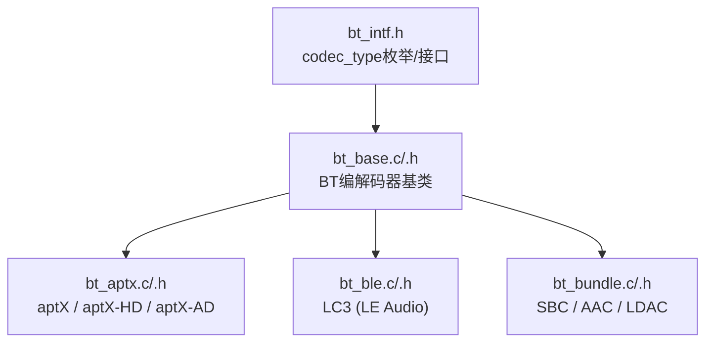
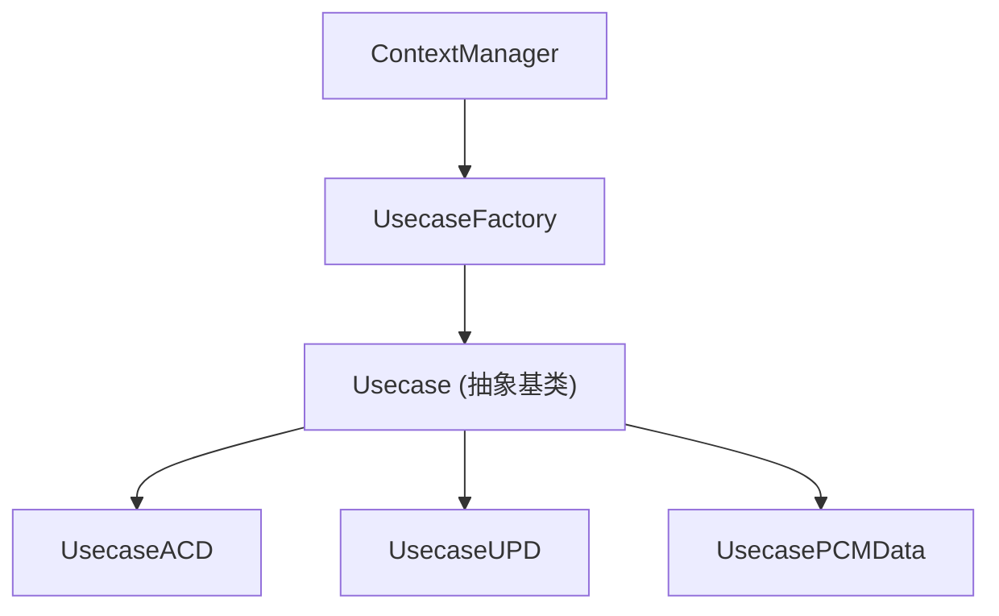
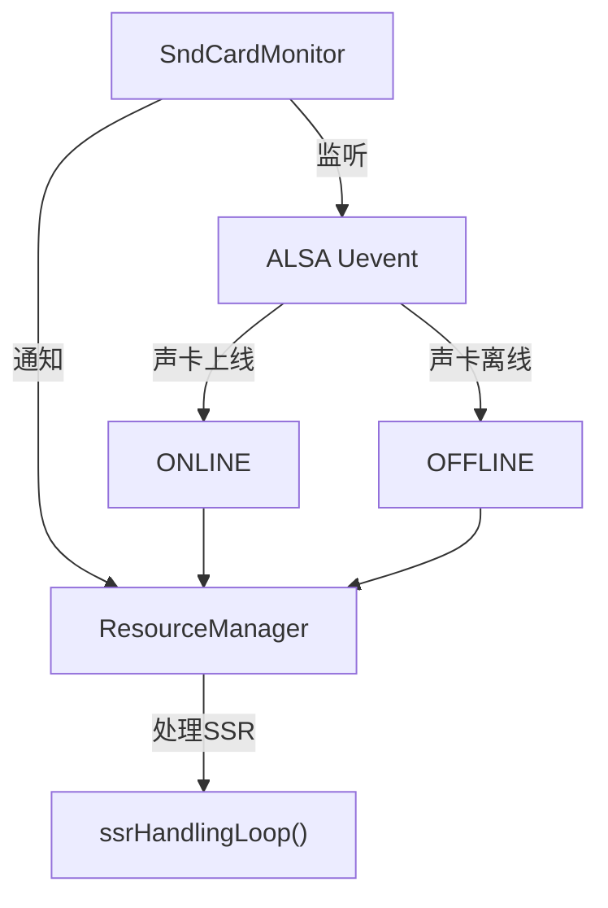
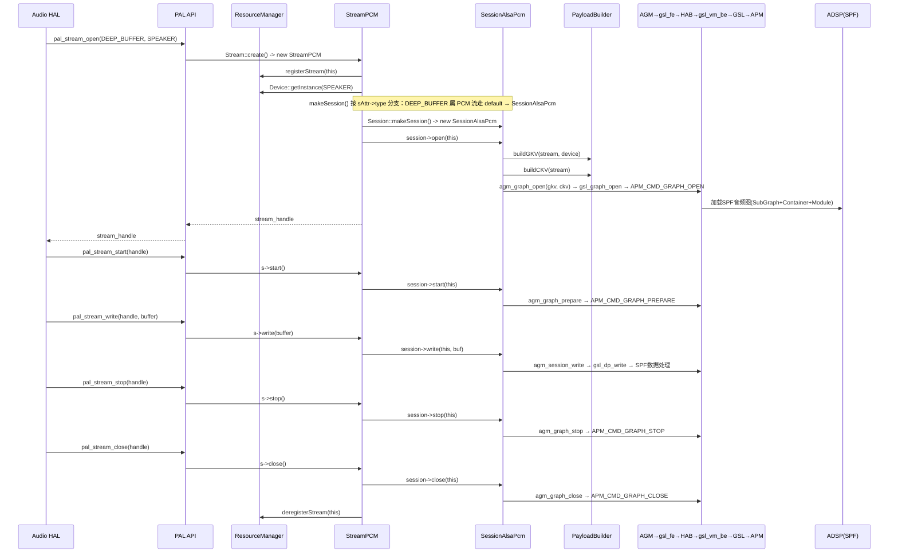
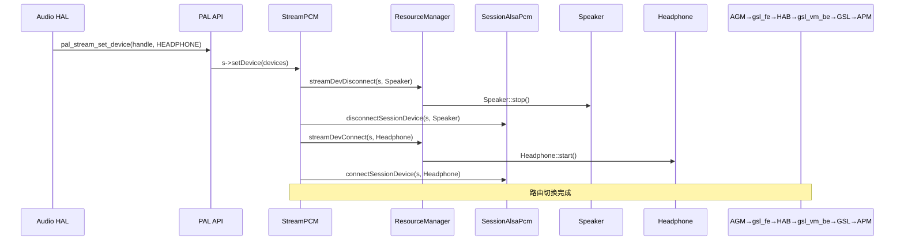
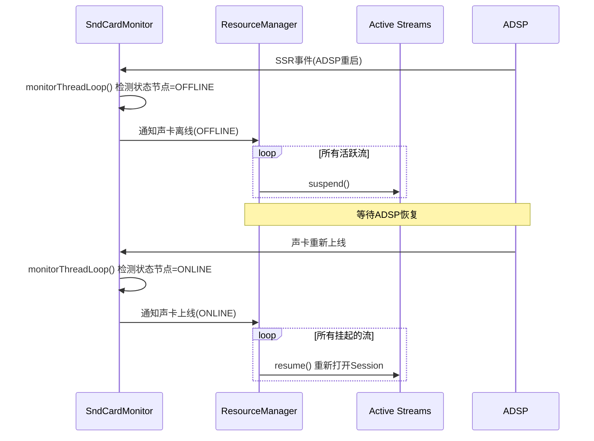
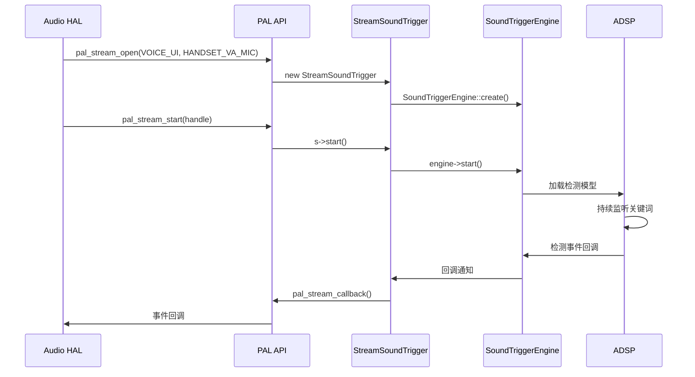
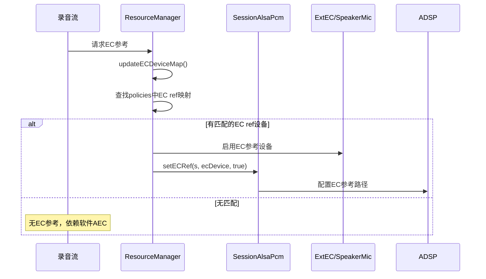

## 15.11 编解码器插件 (plugins/codecs/)

> [← 上一个](15_15.10_HAL-PAL适配层架构.md) | [返回目录](README.md) | [下一个 →](15_15.12_QC_audio-alsa_ALSA层实现.md)

---

### 15.11.1 编解码器插件 (plugins/codecs/)

> 说明：`plugins/codecs/` 下**均为蓝牙 (BT/BLE) 音频编解码器插件**，用于 A2DP/LE Audio 场景下的编解码参数封装，并非通用音频编解码器。实际以 `.c/.h` 文件对形式存在（非子目录）。

| 源码文件 | 说明 |
|------|------|
| `plugins/codecs/bt_base.c/.h` | BT 编解码器基类/公共封装 |
| `plugins/codecs/bt_aptx.c/.h` | aptX / aptX-HD / aptX-Adaptive 等 aptX 家族编解码器 |
| `plugins/codecs/bt_ble.c/.h` | BLE (LE Audio) LC3 编解码器 |
| `plugins/codecs/bt_bundle.c/.h` | SBC / AAC / LDAC 等经典 A2DP 编解码器打包 |
| `plugins/codecs/bt_intf.h` | 编解码器类型枚举与公共接口定义 |

> 源码印证 `bt_intf.h` 中 `codec_type` 枚举，实际支持的编解码器类型包括：`CODEC_TYPE_AAC`、`CODEC_TYPE_SBC`、`CODEC_TYPE_APTX`、`CODEC_TYPE_APTX_HD`、`CODEC_TYPE_APTX_DUAL_MONO`、`CODEC_TYPE_LDAC`、`CODEC_TYPE_APTX_AD`、`CODEC_TYPE_APTX_AD_SPEECH`、`CODEC_TYPE_LC3`。



### 15.11.2 控制插件 (plugins/controls/)

| 文件 | 说明 |
|------|------|
| `plugins/controls/PluginControlIntf.h` | 控制插件接口定义 |
| `plugins/controls/defaultPluginControls.cpp` | 默认控制实现 |

---

### 15.11.3 Utils 工具集

> 源码路径：`utils/`，真实为 **`inc/`（头文件）+ `src/`（实现）分层结构**（如 `utils/inc/PalRingBuffer.h` + `utils/src/PalRingBuffer.cpp`）。

> **⚠️ 源码核实（勘误）**：真实 `utils/inc` 与 `utils/src` 仅包含以下 6 个工具（成对 .h/.cpp）：`PalRingBuffer`、`ChargerListener`、`ACDPlatformInfo`、`SoundTriggerPlatformInfo`、`SoundTriggerUtils`、**`SoundTriggerXmlParser`**。此前列出的通用 `utils/XmlParser.h/cpp` **不存在**（真实名为 `SoundTriggerXmlParser`，专用于 ST/ACD平台信息 XML 解析），已修正。

| 工具 | 源码 | 说明 |
|------|------|------|
| PalRingBuffer | `utils/inc(src)/PalRingBuffer.h/cpp` | PAL环形缓冲区，流数据缓冲 |
| ChargerListener | `utils/inc(src)/ChargerListener.h/cpp` | 充电器状态监听，影响音频路由 |
| SoundTriggerPlatformInfo | `utils/inc(src)/SoundTriggerPlatformInfo.h/cpp` | ST平台信息，SVA模型和引擎配置 |
| SoundTriggerXmlParser | `utils/inc(src)/SoundTriggerXmlParser.h/cpp` | ST/ACD 平台信息 XML 解析工具 |
| ACDPlatformInfo | `utils/inc(src)/ACDPlatformInfo.h/cpp` | ACD平台信息，ACD场景和模型配置 |
| SoundTriggerUtils | `utils/inc(src)/SoundTriggerUtils.h/cpp` | ST工具函数，模型加载/卸载等 |

#### PalRingBuffer
环形缓冲区用于流数据中间缓冲：`写入端(Stream.write) → [RingBuffer] → 读取端(Session.write/AGM→gsl_fe→HAB→gsl_vm_be→GSL)`。支持多读者单写者模式，无锁设计。

#### ChargerListener
监听充电状态变化，通过uevent监听充电事件，回调通知ResourceManager更新路由。

---

### 15.11.4 ContextManager 上下文管理

> 源码路径：`context_manager/`，真实为 `inc/ContextManager.h` + `src/ContextManager.cpp`（单一文件包含全部类定义）。



> **⚠️ 源码核实**：真实 `ContextManager.h` 定义的类为 `ContextManager`、`Usecase`（抽象基类）、`UsecaseACD`、**`UsecaseUPD`**、**`UsecasePCMData`**（均继承 Usecase）以及 **`UsecaseFactory`** 工厂类。

- **ContextManager**：上下文管理器，协调用例
- **UsecaseFactory**：用例工厂，按类型创建 Usecase 实例
- **Usecase**：用例抽象基类，定义检测场景
- **UsecaseACD**：ACD（声学上下文检测）用例实现
- **UsecaseUPD**：UPD（超声波接近检测）用例实现
- **UsecasePCMData**：原始 PCM 数据用例实现

---

### 15.11.5 SndCardMonitor 声卡监控

> 源码路径：`resource_manager/inc/SndCardMonitor.h`

#### 核心功能



#### SSR 处理流程

1. SndCardMonitor 监听 `/dev/snd/` 下的 uevent
2. 检测到 ADSP/CDSP 子系统重启事件（声卡OFFLINE）
3. 通知 ResourceManager 触发 SSR 处理
4. RM执行：暂停所有活跃流 → 等待声卡重新上线 → 重新打开和恢复所有流

#### 关键接口

> **⚠️ 源码核实（勘误）**：`SndCardMonitor` 真实类体极简（`resource_manager/inc/SndCardMonitor.h:41`），**仅有构造/析构函数与一个私有监听线程**，此前列出的 `startMonitor()`/`stopMonitor()`/`onSndCardStateChange(snd_card_state_t)` 三个公有方法**均不存在**，属虚构，已修正为真实接口。监听在构造时启动内部线程 `monitorThreadLoop()`，析构时停止。

```cpp
class SndCardMonitor {
private:
    std::thread mThread;                 // 内部监听线程
#ifdef PLATFORM_AUTO
    char* readState(int fd);             // 车载平台：读取声卡状态节点
#endif
    void monitorThreadLoop();            // 监听线程主循环（uevent/状态轮询）
public:
    SndCardMonitor(int sndNum);          // 构造时按声卡号启动监听线程
    ~SndCardMonitor();                   // 析构时停止线程
};
```

声卡状态：`SND_CARD_STATE_ONLINE`(在线)、`SND_CARD_STATE_OFFLINE`(离线/SSR)

---

### 15.11.6 核心流程分析

#### 播放流完整生命周期



#### 设备路由切换流程



#### SSR 处理流程



#### 语音触发(SVA)流程



#### EC回声消除参考设置流程



---

