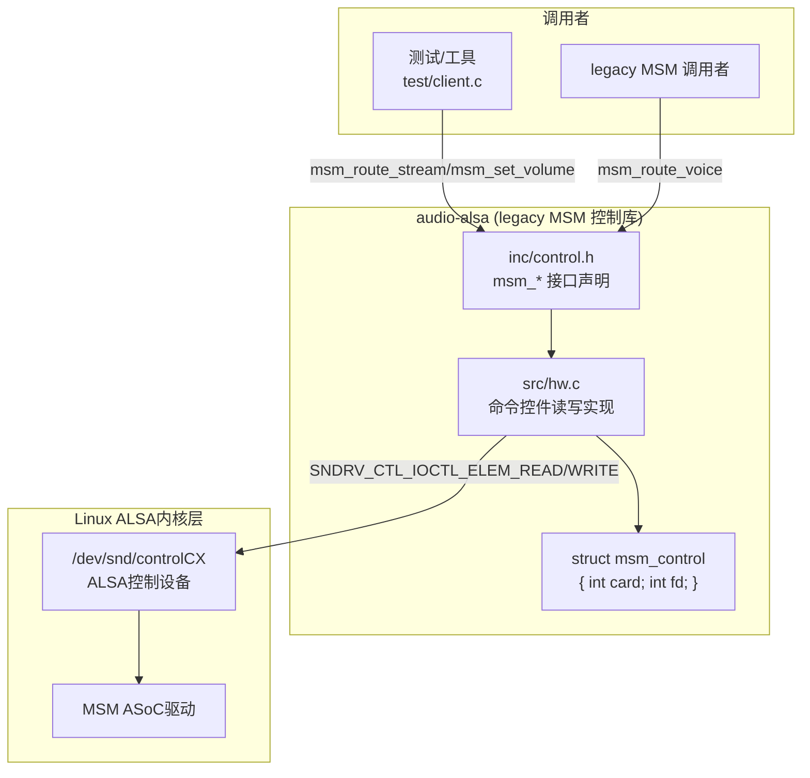
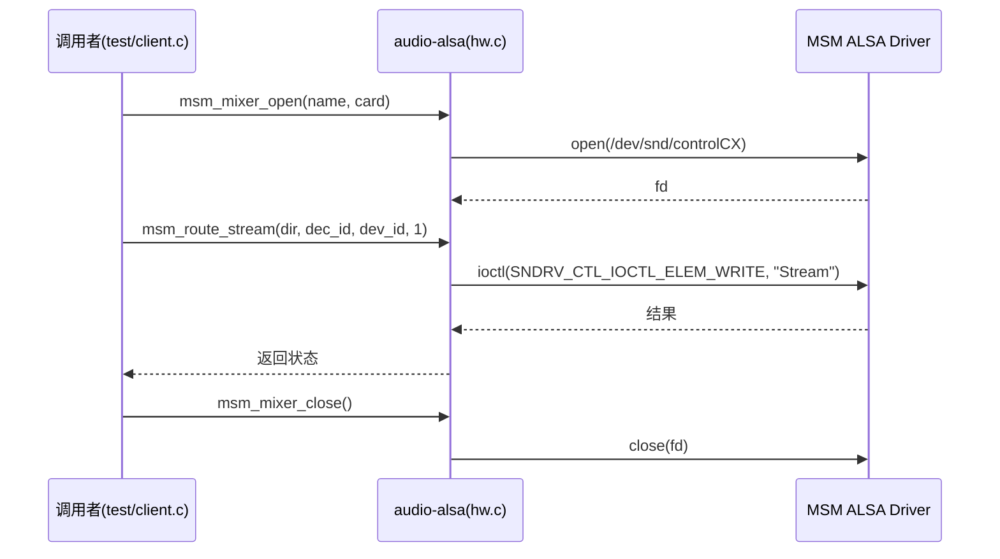

## 15.12 QC audio-alsa：ALSA用户空间封装层

> [← 上一个](15_15.11_编解码器插件_pluginscodecs.md) | [返回目录](README.md) | [下一个 →](15_15.13_QC_GEF_通用音效框架.md)

---

## 15.12.1 模块概述

> **⚠️ 源码核实（重大勘误）**：经核对真实源码，`audio-alsa` **并非** tinyalsa 风格的通用 mixer/PCM 封装层，而是一份高通 **legacy MSM 音频路由控制库**（版权头 `2009-2011, 2022`）。它通过一套 `msm_*` 命令控件（Count/Stream/Voice/Volume 等固定名字的 mixer 控件）对老式 MSM ALSA driver 进行路由/音量/语音控制，**不提供** `mixer_open`/`mixer_ctl_set_value`/`pcm_open`/`pcm_write` 等接口，也**不存在** `struct mixer`/`struct pcm`/`struct pcm_config`。此前文档描述的 tinyalsa 风格 API 与数据结构、以及 `libalsa-intf` legacy 章节均属虚构，已按真实源码重写。

`audio-alsa` 是 Qualcomm 早期的 ALSA 用户空间控制库，通过打开 `/dev/snd/controlCX` 并读写一组具名 mixer 命令控件（如 `"Stream"`、`"Voice"`、`"Volume"`、`"Device_Mute"`），实现音频**设备路由、流路由、语音通话、音量/静音**等控制。它以极简的 `struct msm_control { int card; int fd; }` 持有已打开的控制设备句柄。

> **源码路径**：`vendor/qcom/proprietary/mm-audio/audio-alsa/`
>
> **真实目录结构**：
> - `inc/control.h` —— 唯一头文件，声明全部 `msm_*` 接口与 `struct msm_control`
> - `src/hw.c` —— 唯一实现文件（约 736 行）
> - `test/client.c` —— 测试客户端
> - `Android.mk` / `Makefile.am` / `configure.ac` / `autogen.sh` 等构建脚本
>
> **说明**：SA8295 AudioReach 主音频路径由 PAL + AGM + GSL 承担（见 15.3~15.10），此 legacy `audio-alsa` 库在现代路径中作用有限，主要作为 MSM 时代兼容/工具库保留。

## 15.12.2 架构定位



| 层次 | 组件 | 说明 |
|------|------|------|
| 调用者 | test/client.c 等 | 通过 `msm_*` 接口下发路由/音量/语音命令 |
| **控制库** | **audio-alsa** | 打开 controlCX，读写具名命令控件 |
| 内核层 | MSM ALSA driver (ASoC) | 解析命令控件并驱动 SoC 音频硬件 |

## 15.12.3 核心接口 (inc/control.h)

> 真实 `control.h` 全部为 `msm_*` C 接口，围绕"命令控件"设计——每类操作对应一个具名 mixer 控件（`"Stream"`/`"Voice"`/`"Volume"`/`"Device_Mute"` 等，命令名定义在 `hw.c`）。

### 15.12.3.1 控制设备打开/关闭与计数

```c
struct msm_control {
    int card;   // 声卡号
    int fd;     // /dev/snd/controlCX 文件描述符
};

int msm_mixer_count(void);                 // 返回 mixer 控件总数
int msm_mixer_open(const char *name, int card);  // 打开控制设备
int msm_mixer_close(void);                 // 关闭控制设备
```

### 15.12.3.2 设备查询与路由

```c
int msm_get_device(const char *name);      // 按名称获取设备ID
int msm_get_device_class(int device_id);   // 查询设备类别
int msm_get_device_capability(int device_id); // 查询设备能力
const char **msm_get_device_list(void);    // 获取设备名列表
int msm_get_device_count(void);            // 设备数量
int msm_en_device(int dev_id, int set);    // 使能/禁用设备
int msm_route_stream(int dir, int dec_id, int dev_id, int set); // 流路由
int msm_reset_all_device(void);            // 复位所有设备
```

### 15.12.3.3 语音通话控制

```c
int msm_route_voice(int rx_dev_id, int tx_dev_id, int set); // 语音路由
int msm_start_voice(void);               // 启动语音
int msm_end_voice(void);                   // 结束语音
int msm_start_voice_ext(int session_id);   // 多会话：启动
int msm_end_voice_ext(int session_id);     // 多会话：结束
int msm_set_voice_tx_mute(int mute);       // TX静音
int msm_set_voice_tx_mute_ext(int mute, int session_id);
int msm_set_voice_rx_vol(int volume);      // RX音量
int msm_set_voice_rx_vol_ext(int volume, int session_id);
int msm_get_voc_session(const char *name); // 获取语音会话("Voice session"/"VoIP session")
```

### 15.12.3.4 音量、静音与其他

```c
int msm_set_volume(int dec_id, float volume);   // 流音量
int msm_set_device_volume(int dev_id, int volume); // 设备音量
int msm_device_mute(int dev_id, int mute);      // 设备静音
int msm_enable_anc(int dev_id, int enable);     // ANC 使能
int msm_set_dual_mic_config(int enc_session_id, int config); // 双麦配置
int msm_snd_dev_loopback(int rx_dev_id, int tx_dev_id, int set); // 设备回环
```

## 15.12.4 关键数据结构与实现要点

### 15.12.4.1 struct msm_control（唯一公开结构体）

```c
struct msm_control {
    int card;   // 声卡号
    int fd;     // /dev/snd/controlCX 文件描述符
};
```

> **⚠️ 源码核实**：`control.h` 中**唯一**对外结构体即 `struct msm_control`。此前文档列出的 `struct mixer`/`struct mixer_ctl`/`struct pcm`/`struct pcm_config` 在本模块源码中**均不存在**，属虚构。

### 15.12.4.2 命令控件模型（hw.c 内部）

`hw.c` 打开控制设备后，通过内部静态函数 `msm_mixer_elem_info()` / `msm_mixer_elem_read()` / `msm_mixer_elem_write()`（基于 `SNDRV_CTL_IOCTL_ELEM_*` ioctl）读写以下具名命令控件：

| 命令控件名 | 常量 | 用途 |
|------|------|------|
| `"Count"` | `COUNT_CMD_NAME` | 控件计数 |
| `"Stream"` | `STREAM_CMD_NAME` | 流路由 |
| `"Record"` | `RECORD_CMD_NAME` | 录音路由 |
| `"Voice"` | `VOICE_CMD_NAME` | 语音路由 |
| `"Volume"` | `VOLUME_CMD_NAME` | 流音量 |
| `"VoiceMute"` | `VOICEMUTE_CMD_NAME` | 语音静音 |
| `"VoiceVolume"` | `VOICEVOLUME_CMD_NAME` | 语音音量 |
| `"Voice Call"` | `VOICECALL_CMD_NAME` | 语音通话 |
| `"Device_Volume"` | `DEVICEVOLUME_CMD_NAME` | 设备音量 |
| `"Device_Mute"` | `DEVICEMUTE_CMD_NAME` | 设备静音 |
| `"ANC"` | `ANC_CMD_NAME` | 主动降噪 |
| `"Reset"` | `RESET_CMD_NAME` | 复位 |
| `"DualMic Switch"` | `DUALMICSWITCH_CMD_NAME` | 双麦切换 |
| `"Sound Device Loopback"` | `LOOPBACK_CMD_NAME` | 设备回环 |
| `"Voice session"` / `"VoIP session"` | `VOICE_SESSION_NAME` / `VOIP_SESSION_NAME` | 语音会话选择 |

`hw.c` 主要实现函数：`msm_mixer_count`、`msm_mixer_open`、`msm_mixer_close`、`msm_get_device*`、`msm_en_device`、`msm_route_stream`、`msm_route_voice`、`msm_set_volume`、`msm_set_voice_tx_mute(_ext)`、`msm_set_voice_rx_vol(_ext)`、`msm_start_voice(_ext)`、`msm_end_voice(_ext)`、`msm_set_device_volume`、`msm_enable_anc`、`msm_reset_all_device`、`msm_set_dual_mic_config`、`msm_snd_dev_loopback`、`msm_device_mute`、`msm_get_voc_session`。

## 15.12.5 与上下游模块的交互

### 15.12.5.1 典型调用场景

| 场景 | 接口 | 说明 |
|------|------|------|
| 打开控制设备 | `msm_mixer_open(name, card)` | 打开 `/dev/snd/controlCX` |
| 设备使能 | `msm_en_device(dev_id, set)` | 使能/禁用某设备 |
| 流路由 | `msm_route_stream(dir, dec_id, dev_id, set)` | 将解码流路由到设备 |
| 语音路由 | `msm_route_voice(rx, tx, set)` | 建立语音 RX/TX 路由 |
| 流音量 | `msm_set_volume(dec_id, volume)` | 设置解码流音量 |
| 设备静音 | `msm_device_mute(dev_id, mute)` | 静音某设备 |



### 15.12.5.2 audio-alsa 在 SA8295 架构中的定位

> **⚠️ 源码核实**：`audio-alsa` 为 legacy MSM 时代控制库，SA8295 现代音频路径以 **PAL + AGM + GSL**（AudioReach，见 15.3~15.10）为主，路由/图配置通过 `AGM→gsl_fe→MM-HAB→QNX 侧 GSL` 完成，并不依赖此库进行 mixer 路由。此前"Android 域 PAL 通过 audio-alsa 操作前端设备、后端由 auto-audiod 统一管理"的描述系基于虚构 API 推演，不成立。

## 15.12.6 调试参考

```bash
# 查看声卡信息
cat /proc/asound/cards

# 查看 PCM 设备
cat /proc/asound/pcm

# 查看某声卡的控件列表（用于确认命令控件是否存在）
cat /proc/asound/card0/id
```

> **说明**：`audio-alsa` 依赖 MSM ALSA driver 暴露的具名命令控件（`"Stream"`、`"Voice"` 等）。若目标平台驱动未注册这些控件，`msm_*` 接口将失败——这也是该 legacy 库在 AudioReach 平台上作用有限的原因之一。