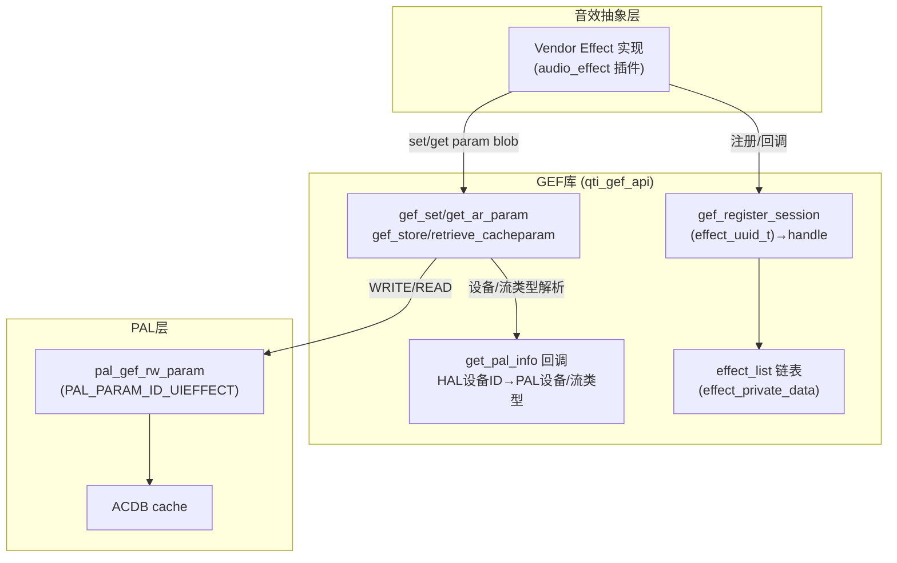
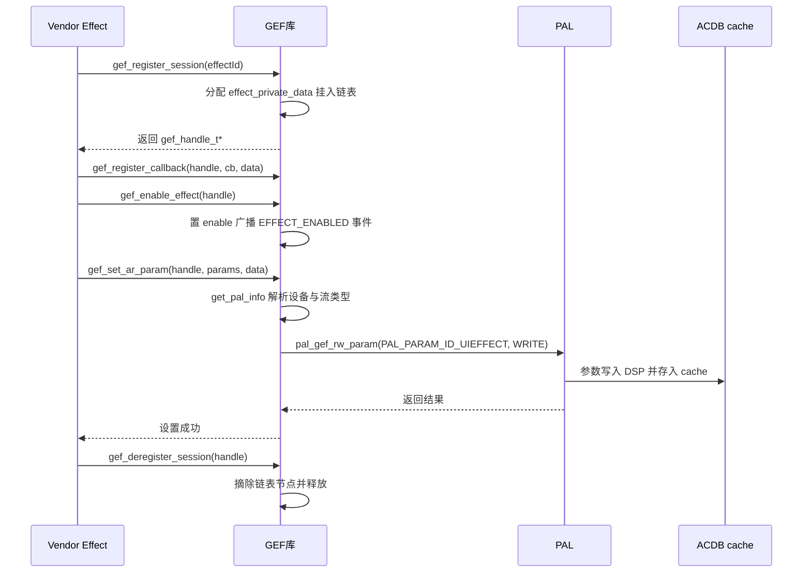

## 15.13 QC GEF：通用音效框架 (Generic Effect Framework)

> [← 上一个](15_15.12_QC_audio-alsa_ALSA层实现.md) | [返回目录](README.md) | [下一个 →](15_15.14_QC_audio-parsers_音频解析器.md)

---

> ## ⚠️ 源码核实（重大勘误）
>
> 本章原内容（`session_id` + `gef_effects_callback_t` 回调 + `cookie` 的会话模型 API、`gef_effect_type_t` 音效类型枚举、`gef_set_param/gef_get_param`、"加载 DSP 模块到 SPF Graph / PayloadBuilder 构建 GKV/CKV"等描述）**与本地真实源码完全不符，系推演虚构**。已按本地真实源码整章重写。
>
> **核实依据**（`vendor/qcom/proprietary/mm-audio/audio-generic-effect-framework-ar/`）：
> - `api/qti_gef_api.h`（140 行）、`api/qti_gef_datatypes.h`（142 行）、`src/qti_gef_api.c`（822 行）
> - 真实 GEF 是**句柄（handle）模型**：`gef_register_session(effect_uuid_t)` 返回不透明句柄 `gef_handle_t*`，**不是** `session_id`；音效身份由 Android 标准 `effect_uuid_t` 标识，**没有** `gef_effect_type_t` 枚举。
> - 真实下发路径是 `pal_gef_rw_param(PAL_PARAM_ID_UIEFFECT, ...)`，参数以二进制 blob（`struct acdb_effect_param`，含 TKV/CKV）直接写入 PAL 并存入 ACDB cache，**没有** PayloadBuilder 构建 GKV / SPF Module 动态加载 Graph 的逻辑（这些属 PAL/GSL 内部行为，不在 GEF 层）。

## 15.13.1 模块概述

GEF (Generic Effect Framework) 是 Qualcomm 为 AudioReach 架构提供的**音效参数中转/校准库**。它向"Vendor 音效抽象层"（effect implementation，如 Android `audio_effect` 插件）提供统一 C 接口，将音效参数（以 blob 形式）经 PAL 下发到 DSP 并存入 ACDB cache。

真实职责非常聚焦：**维护一个音效会话链表 + 通过 PAL API 读写 UI 音效参数**。它**不**做 DSP 模块加载、图（Graph）编排或 payload 构建——这些由 PAL/GSL 内部完成。GEF 只负责把二进制参数 blob 透传给 `pal_gef_rw_param()`。

> **源码路径**：`vendor/qcom/proprietary/mm-audio/audio-generic-effect-framework-ar/`
>
> **关键文件**：
> - `api/qti_gef_api.h` — GEF 公共 API（句柄模型）
> - `api/qti_gef_datatypes.h` — 数据类型（`gef_handle_t`、`event_type`、`effect_config_params`、`acdb_effect_param`…）
> - `src/qti_gef_api.c` — GEF 实现（会话链表 + PAL 读写）

## 15.13.2 架构定位



## 15.13.3 核心 API（真实句柄模型，qti_gef_api.h）

### 15.13.3.1 会话注册/注销

```c
/* 注册会话：以 Android 标准音效 UUID 标识，返回不透明句柄 */
gef_handle_t* gef_register_session(effect_uuid_t effectId);   // 失败返回 NULL
int gef_deregister_session(gef_handle_t* handle);
```

### 15.13.3.2 启用/禁用与版本查询

```c
/* enable/disable 仅需句柄；用于向已注册的其他效果广播 EFFECT_ENABLED 事件 */
int gef_enable_effect(gef_handle_t* handle);
int gef_disable_effect(gef_handle_t* handle);

int gef_query_version(int *majorVersion, int *minorVersion);
```

### 15.13.3.3 回调注册

```c
/* 独立注册回调（非注册会话时传入）；GEF 在以下情况回调：
 * 1) 校准下发出错  2) 另一 GEF 效果被启用  3) 设备连接（含通道映射） */
int gef_register_callback(gef_handle_t* handle, gef_func_ptr cb, void* data);
```

### 15.13.3.4 参数读写（AudioReach，直连 PAL）

```c
/* set：参数下发 DSP 并自动存入 ACDB cache */
int gef_set_ar_param(gef_handle_t* handle,
                     effect_config_params* params,
                     effect_data_in* data);

/* get：从 DSP 取回整块参数二进制（调用方需预分配缓冲） */
int gef_get_ar_param(const gef_handle_t* handle,
                     effect_config_params* params,
                     effect_data_out* data);

/* store：仅存入 ACDB（不下发 DSP） */
int gef_store_ar_cacheparam(gef_handle_t* handle,
                            effect_config_params* params,
                            effect_data_in* data);

/* retrieve：目前未支持，始终返回 ENOSYS */
int gef_retrieve_ar_cacheparam(const gef_handle_t* handle,
                               effect_config_params* params,
                               effect_data_out* data);
```

## 15.13.4 关键数据类型（qti_gef_datatypes.h）

### 15.13.4.1 句柄与事件类型

```c
typedef void gef_handle_t;          // 不透明句柄（内部即 effect_private_data*）

/* 回调事件类型：仅两种，无音效种类枚举 */
typedef enum {
    EFFECT_ENABLED,     // 另一效果被启用
    DEVICE_CONNECTED    // 设备连接（device/channel_mask/sample_rate 有效）
} event_type;

/* 回调函数原型 */
typedef void (*gef_func_ptr)(void*, event_type, event_value);
```

### 15.13.4.2 事件值与参数配置

```c
typedef struct {
    int                  value;         // EFFECT_ENABLED 时表示开/关
    effect_uuid_t        effect_uuid;   // 被启用效果的 UUID
    audio_devices_t      device;        // 连接的设备
    audio_channel_mask_t channel_mask;  // 通道映射
    int                  sample_rate;
    int                  stream_type;
} event_value;

/* 参数适用范围（生成 CKV 用） */
typedef struct {
    int  stream_type;
    int  device_id;
    int  sample_rate;   // 非 0 则按采样率生成 CKV
    bool persist;       // 已废弃，改用 gef_store_ar_cacheparam
} effect_config_params;
```

### 15.13.4.3 参数二进制载荷

```c
typedef struct { void* const data; const int length; } effect_data_in;
typedef struct { void* data;       int       length; } effect_data_out;

/* 实际下发/存储的 AudioReach 参数结构（TKV 或 CKV + payload） */
struct acdb_effect_param {
    bool     isTKV;       // true=TKV, false=CKV
    uint32_t tag;         // 模块 tag
    uint32_t num_kvs;     // KV 数量
    uint32_t blob_size;   // kv + payload 大小
    uint8_t  blob[];      // param id + param value
};
```

## 15.13.5 GEF 工作流程

### 15.13.5.1 内部实现要点（src/qti_gef_api.c）

- **懒初始化**：`pthread_once` → `gef_lib_init()`，初始化 `effect_list` 链表、互斥锁/条件变量。
- **会话表**：每次 `gef_register_session()` 分配一个 `effect_private_data`（含 `effect_uuid_t uuid` / `enable` / `cb` / `data`），挂入全局 `gef_global_handle.effect_list`。句柄即该节点指针。
- **设备/流解析**：参数读写时通过 `get_pal_info` 回调（`audio_extn_gef_get_pal_info` 函数指针，由 HAL 注册），把 `audio_devices_t` HAL 设备 ID 解析为 `pal_device_id_t` 与 `pal_stream_type_t`。
- **车机总线映射**：`gef_lib_get_bus_address_name()` 将地址映射到 AAOS 多区总线名——`BUS00_MEDIA` / `BUS01_SYS_NOTIFICATION` / `BUS02_NAV_GUIDANCE` / `BUS03_PHONE` / `BUS04_TTS` / `BUS05_Mirroring` / `BUS08_FRONT_PASSENGER` / `BUS16_REAR_SEAT`（体现 SA8295 车机分区音频场景）。
- **参数下发**：最终统一调用 `pal_gef_rw_param(PAL_PARAM_ID_UIEFFECT, data, length, pal_device_id, pal_stream_type, GEF_PARAM_WRITE/READ, address)`。
- **调试属性**：`vendor.audio.gef.debug.flags`（打开日志）、`vendor.audio.gef.enable.traces`（打开 ATRACE）。

### 15.13.5.2 音效参数设置流程



### 15.13.5.3 与 Legacy 音效框架的对比

| 特性 | GEF (AudioReach) | Legacy Effect |
|------|-------------------|---------------|
| 会话标识 | `effect_uuid_t` → `gef_handle_t*` 句柄 | 直接由 HAL 管理 |
| 参数下发 | `gef_set_ar_param()` → `pal_gef_rw_param(UIEFFECT)` | HAL → IOCTL → ADM |
| 参数载荷 | `acdb_effect_param`（TKV/CKV blob） | 私有结构 |
| ACDB 存储 | 自动存入 cache（set/store 接口） | 无 |
| 设备解析 | `get_pal_info` 回调（HAL 设备→PAL） | HAL 内部 |

## 15.13.6 与上下游模块的交互

### 15.13.6.1 上游：Vendor Effect 抽象层 → GEF

音效实现（Android `audio_effect` 插件）通过 GEF C 接口管理生命周期：
- `gef_register_session(effect_uuid_t)` 注册并取得句柄
- `gef_register_callback()` 注册回调（接收 `EFFECT_ENABLED`/`DEVICE_CONNECTED` 事件）
- `gef_enable_effect()`/`gef_disable_effect()` 切换启用态
- `gef_set_ar_param()`/`gef_get_ar_param()` 读写参数 blob
- `gef_deregister_session()` 注销

### 15.13.6.2 下游：GEF → PAL

GEF 仅通过 **一个** PAL 接口下发/读取：
- `pal_gef_rw_param(PAL_PARAM_ID_UIEFFECT, ...)`，方向由 `GEF_PARAM_WRITE`/`GEF_PARAM_READ` 决定
- 参数以 `struct acdb_effect_param`（TKV/CKV + payload）二进制 blob 透传
- GKV 构建、SPF 模块图编排等由 **PAL/GSL 内部**完成，GEF 不参与

### 15.13.6.3 横向：HAL 注册的 get_pal_info 回调

GEF 依赖 HAL 在初始化时注册 `get_pal_info` 回调，用于将 `audio_devices_t`（如车机各 BUS 输出）解析为 PAL 设备 ID 与流类型，从而把音效参数定向到正确的物理设备。

## 15.13.7 调试参考

```bash
# 打开 GEF 调试日志 / traces（属性）
setprop vendor.audio.gef.debug.flags 1
setprop vendor.audio.gef.enable.traces true

# 查看相关日志（GEF 使用 ALOGD_IF）
logcat | grep -i gef

# 结合 PAL / ACDB 参数下发日志排查 UIEFFECT
logcat -s PAL ACDB
```