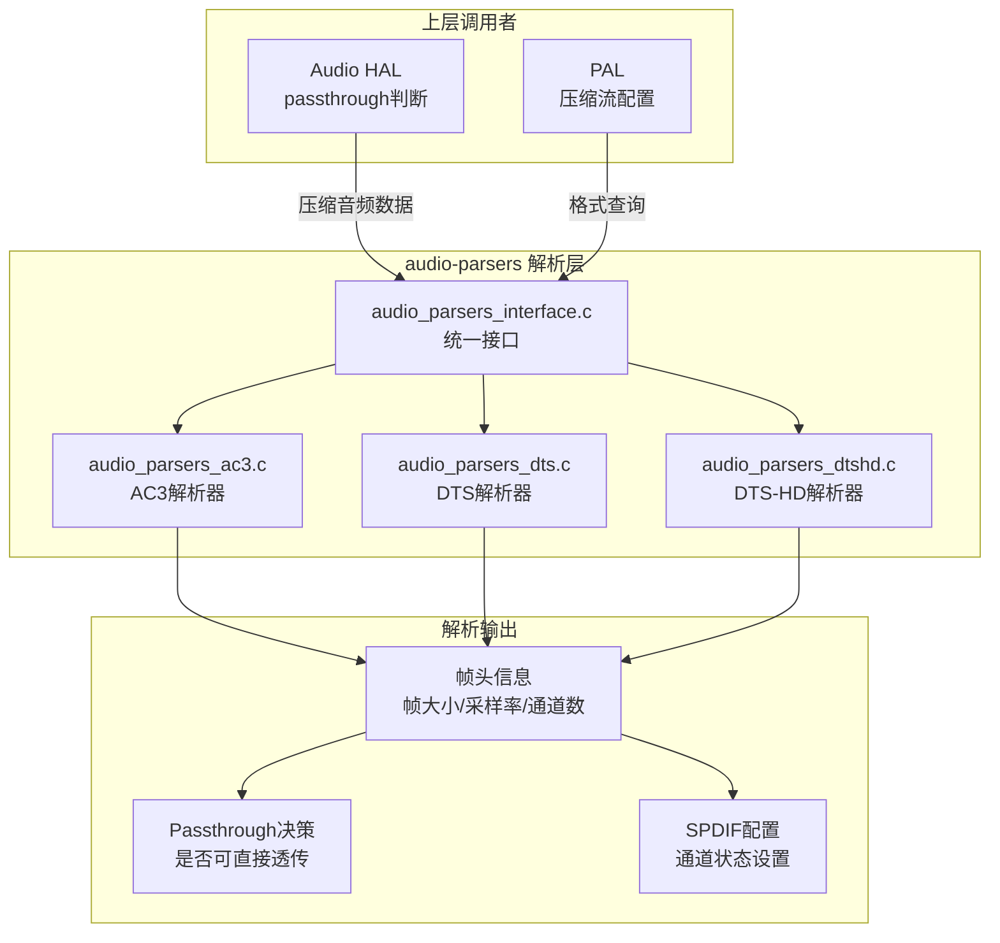
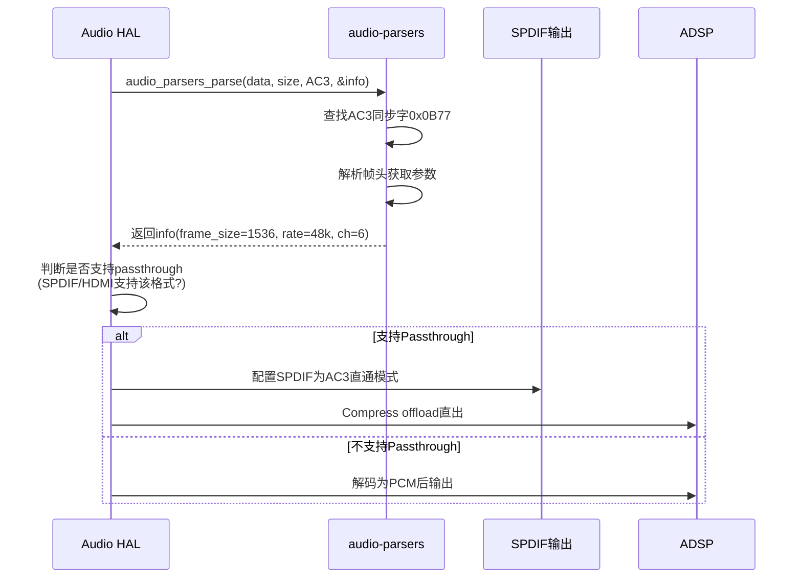

## 15.14 QC audio-parsers：音频帧格式解析器

> [← 上一个](15_15.13_QC_GEF_通用音效框架.md) | [返回目录](README.md) | [下一个 →](15_15.15_QC_CAPIv2_编解码接口.md)

---

## 16.1 模块概述

`audio-parsers` 是 Qualcomm 音频子系统中的音频帧格式解析器模块，负责解析压缩音频数据（AC3、DTS、DTS-HD 等）的帧头信息，提取帧大小、采样率、通道数、比特率等关键参数。这些参数在 HAL 层用于判断是否可以进行 passthrough（直通）输出，以及配置 SPDIF/HDMI 的输出格式。

在车载场景中，audio-parsers 对于处理外部音源（如 HDMI-CEC 输入的 AC3/DTS 音频）和决定音频路由策略至关重要。

> **源码路径**：`vendor/qcom/proprietary/mm-audio/audio-parsers/`
>
> **关键文件**：
> - `inc/audio_parsers.h` — 解析器公共接口头文件
> - `src/audio_parsers_ac3.c` — AC3/Dolby Digital 帧解析
> - `src/audio_parsers_dts.c` — DTS 帧解析
> - `src/audio_parsers_dtshd.c` — DTS-HD 帧解析
> - `src/audio_parsers_interface.c` — 统一接口层

## 16.2 架构定位



## 16.3 核心接口

### 15.14.3.1 统一解析接口 (audio_parsers.h)

```c
/**
 * audio_parsers_parse() — 解析音频帧
 * @data:      音频数据缓冲区指针
 * @data_size: 数据大小
 * @format:    音频格式（AUDIO_FORMAT_AC3/DTS/DTS_HD等）
 * @out_info:  输出解析结果
 *
 * 返回：0成功，负数失败
 */
int audio_parsers_parse(const void *data,
                        size_t data_size,
                        audio_format_t format,
                        struct audio_parser_info *out_info);

/**
 * audio_parsers_get_frame_size() — 获取帧大小
 * @data:      音频数据缓冲区
 * @data_size: 数据大小
 * @format:    音频格式
 *
 * 返回：帧字节数，负数表示失败
 */
int audio_parsers_get_frame_size(const void *data,
                                  size_t data_size,
                                  audio_format_t format);

/**
 * audio_parsers_get_sample_rate() — 获取采样率
 * @data:      音频数据缓冲区
 * @data_size: 数据大小
 * @format:    音频格式
 *
 * 返回：采样率Hz，负数表示失败
 */
int audio_parsers_get_sample_rate(const void *data,
                                   size_t data_size,
                                   audio_format_t format);

/**
 * audio_parsers_get_channels() — 获取通道数
 * 返回：通道数，负数表示失败
 */
int audio_parsers_get_channels(const void *data,
                                size_t data_size,
                                audio_format_t format);
```

## 16.4 关键数据结构

### 15.14.4.1 解析结果结构

```c
struct audio_parser_info {
    uint32_t frame_size;        // 帧大小（字节）
    uint32_t sample_rate;       // 采样率（Hz）
    uint32_t channels;          // 通道数
    uint32_t bit_rate;          // 比特率（bps）
    audio_format_t format;      // 实际音频格式
    uint32_t samples_per_frame; // 每帧采样数
    bool is_compressed;         // 是否压缩格式
};
```

### 15.14.4.2 AC3 帧同步字

```c
#define AC3_SYNC_WORD       0x0B77    // AC3帧同步字
#define AC3_SAMPLE_RATE_TBL {48000, 44100, 32000}  // AC3采样率表
#define AC3_FRAME_SIZE_CODE_MAX 38     // 帧大小码最大值
```

### 15.14.4.3 DTS 帧同步字

```c
#define DTS_SYNC_WORD       0x7FFE8001  // DTS帧同步字（16-bit模式）
#define DTS_SYNC_WORD_14BE  0x1FFFE800  // DTS帧同步字（14-bit大端）
#define DTS_SYNC_WORD_14LE  0xFF1F00E8  // DTS帧同步字（14-bit小端）
```

### 15.14.4.4 DTS-HD 帧同步字

```c
#define DTSHD_SYNC_WORD     0x64582025  // DTS-HD帧同步字
```

## 16.5 各格式解析详情

### 15.14.5.1 AC3 解析器 (audio_parsers_ac3.c)

AC3 (Dolby Digital) 帧结构解析：

| 字段 | 位数 | 说明 |
|------|------|------|
| Sync Word | 16 | 固定值 `0x0B77` |
| CRC1 | 16 | 第一段CRC校验 |
| Sample Rate Code | 2 | 采样率：0=48k, 1=44.1k, 2=32k |
| Frame Size Code | 6 | 帧大小索引 |
| Audio Coding Mode | 3 | 声道模式（1+1/2/0, 3/0等） |
| LFE Channel | 1 | 低频效果通道标志 |
| Bit Stream ID | 5 | 比特流版本标识 |
| Dialog Normalization | 5 | 对白归一化级别 |

**AC3帧大小计算**：根据 `sample_rate_code` 和 `frame_size_code` 查表得到，典型值：
- 48kHz, 384kbps → 1536 bytes/frame
- 48kHz, 448kbps → 1792 bytes/frame

### 15.14.5.2 DTS 解析器 (audio_parsers_dts.c)

DTS 帧结构解析：

| 字段 | 位数 | 说明 |
|------|------|------|
| Sync Word | 32 | `0x7FFE8001` |
| Frame Type | 1 | 帧类型（正常/终止） |
| Deficit Sample Count | 5 | 缺损采样计数 |
| CRC Present | 1 | CRC标志 |
| Sample Blocks | 7 | 每帧采样块数（通常32） |
| Frame Size | 14 | 帧大小 |
| Channel Configuration | 6 | 通道配置 |
| Sample Rate | 4 | 采样率索引 |
| Bit Rate | 5 | 比特率索引 |

### 15.14.5.3 DTS-HD 解析器 (audio_parsers_dtshd.c)

DTS-HD 是 DTS 的扩展格式，支持更高采样率和更多通道：

| 子格式 | 采样率 | 通道数 | 说明 |
|--------|--------|--------|------|
| DTS-HD Master Audio | 最高192kHz | 最多7.1 | 无损压缩 |
| DTS-HD High Resolution | 最高192kHz | 最多7.1 | 有损压缩 |
| DTS-HD Master Audio ES | 最高192kHz | 最多7.1 | 扩展环绕 |

DTS-HD 解析器先查找 DTS 核心帧同步字，再查找 DTS-HD 扩展帧同步字，分别解析核心流和扩展流参数。

## 16.6 与上下游模块的交互

### 15.14.6.1 Passthrough 判断流程



### 15.14.6.2 HAL 层调用场景

| 场景 | 调用模块 | 用途 |
|------|----------|------|
| HDMI-CEC音频输入 | Audio HAL | 解析输入格式，决定路由 |
| Compress offload播放 | PAL StreamCompress | 配置DSP压缩解码器 |
| SPDIF直通输出 | Audio HAL | 配置SPDIF通道状态 |
| 蓝牙A2DP压缩传输 | PAL BT插件 | 格式能力协商 |

## 16.7 与 PAL 的交互

PAL 在处理压缩音频流（`PAL_STREAM_COMPRESSED`）时，需要使用 audio-parsers 提供的信息：

1. **StreamOpen 阶段**：根据压缩格式选择合适的 Session 类型（SessionAlsaCompress）
2. **DeviceConnect 阶段**：根据解析结果配置 SPDIF/HDMI 输出参数
3. **流参数设置**：将采样率、通道数等信息传递给 PayloadBuilder 构建 CKV

## 16.8 调试参考

```bash
# 查看音频解析器日志
logcat -s audio_parsers

# 检查SPDIF直通状态
cat /proc/asound/card0/pcm*p/sub0/hw_params

# 检查AC3/DTS数据流
# 使用spdif-debug工具
tinymix -D 0 "PRI_TDM_TX_0 Format" "S24_LE"

# 检查compress offload设备
ls -la /dev/snd/comprC*
```