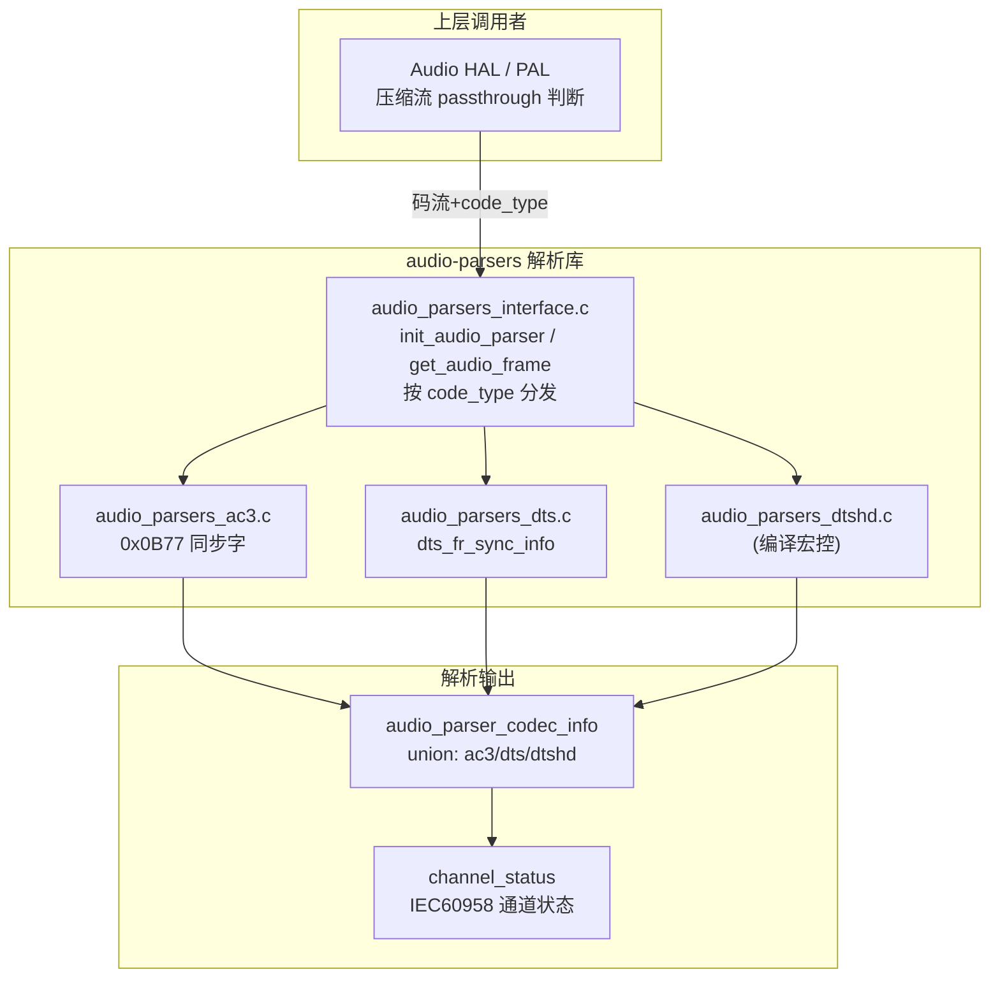
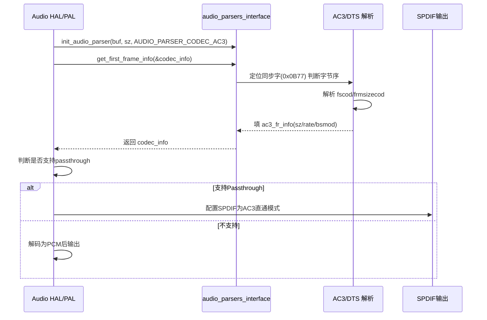

## 15.14 QC audio-parsers：音频帧格式解析器

> [← 上一个](15_15.13_QC_GEF_通用音效框架.md) | [返回目录](README.md) | [下一个 →](15_15.15_QC_CAPIv2_编解码接口.md)

---

> ## ⚠️ 源码核实（重大勘误）
>
> 本章原内容（`audio_parsers_parse` / `audio_parsers_get_frame_size` / `audio_parsers_get_sample_rate` / `audio_parsers_get_channels` 接口、`struct audio_parser_info`、`AC3_SYNC_WORD` / `DTS_SYNC_WORD 0x7FFE8001` / `DTSHD_SYNC_WORD 0x64582025` 等宏名、以及部分标题误编为 16.x）**与本地真实源码不符，系推演虚构**。已按真实源码整章重写。
>
> **核实依据**（`vendor/qcom/proprietary/mm-audio/audio-parsers/`，版权 2011/2017）：
> - 真实 API 是 **AC3/DTS/DTS-HD IEC61937 码流解析** 接口：`init_audio_parser` / `get_audio_frame` / `get_first_frame_info` / `get_ac3_frame` / `get_dts_frame` / `get_iec61937_info` / `get_channel_status` 等（见 `inc/audio_parsers.h`）。
> - 真实结果结构是 `struct audio_parser_codec_info`（含 union `ac3_fr_info` / `dts_fr_info` / `dtshd_tr_info`），**不是** `audio_parser_info`。
> - AC3 同步字 `0x0B77` 确为内联字面量（另检测 `0x770B` 反字节序 → `reverse_bytes`），但**没有** `AC3_SYNC_WORD` 宏；DTS 用 `struct dts_fr_sync_info`（sync_word + 6bit ext + reverse_bytes 大小端检测），**没有** `DTS_SYNC_WORD` / `DTSHD_SYNC_WORD` 宏。

## 15.14.1 模块概述

`audio-parsers` 是 Qualcomm 用于解析 **IEC61937 封装的压缩音频码流**（AC3/Dolby Digital、DTS、DTS-HD）的静态解析库。它从码流中定位同步字、解析帧头，提取帧大小、采样率、DTS 类型等参数，并可生成 IEC60958/61937 通道状态位。

在车载场景中，这些参数供上层（HAL/PAL）判断能否 passthrough（直通）到 SPDIF/HDMI，以及配置压缩流输出格式。

> **源码路径**：`vendor/qcom/proprietary/mm-audio/audio-parsers/`
>
> **关键文件**：
> - `inc/audio_parsers.h` — 公共接口与数据结构
> - `src/audio_parsers_interface.c` — 统一接口层（按 codec 类型分发）
> - `src/audio_parsers_ac3.c` — AC3 解析
> - `src/audio_parsers_dts.c` — DTS 解析
> - `src/audio_parsers_dtshd.c` — DTS-HD 解析（`DTSHD_PARSER_ENABLED` 宏控，未启用时接口返回 `-ENOSYS`）

## 15.14.2 架构定位



## 15.14.3 核心接口（真实，audio_parsers.h）

### 15.14.3.1 统一接口层

```c
/* codec 类型：仅三种 */
enum audio_parser_code_type {
    AUDIO_PARSER_CODEC_AC3   = 1,
    AUDIO_PARSER_CODEC_DTS   = 2,
    AUDIO_PARSER_CODEC_DTSHD = 3,
};

/* 初始化：绑定码流缓冲区与 codec 类型 */
int init_audio_parser(unsigned char *audio_stream_data,
                      unsigned int audio_stream_sz,
                      enum audio_parser_code_type);

/* 取下一帧（按初始化时的 codec 类型分发） */
int get_audio_frame(unsigned char *frame, unsigned int sz,
                    struct audio_parser_codec_info *audio_parser_codec_info);

/* 取首帧信息 */
int get_first_frame_info(struct audio_parser_codec_info *audio_codec_info);

/* IEC61937 信息 / 静音帧 / 通道状态 */
int  get_iec61937_info(struct audio_parser_codec_info *audio_codec_info);
void get_silent_frame(unsigned char *silent_frame);
int  get_channel_status(unsigned char *channel_status,
                        enum audio_parser_code_type code_type);
```

### 15.14.3.2 各格式专用接口

```c
/* AC3 */
void init_audio_parser_ac3(unsigned char *data, unsigned int sz);
int  get_ac3_frame(unsigned char *frame, unsigned int sz,
                   struct audio_parser_codec_info *info);
int  get_ac3_first_frame_info(struct audio_parser_codec_info *info);
int  get_channel_status_ac3(unsigned char *channel_status);

/* DTS */
void init_audio_parser_dts(unsigned char *data, unsigned int sz);
int  get_dts_frame(unsigned char *frame, unsigned int sz,
                   struct audio_parser_codec_info *info);
int  get_dts_first_frame_info(struct audio_parser_codec_info *info);
int  get_channel_status_dts(unsigned char *channel_status);

/* DTS-HD（仅 DTSHD_PARSER_ENABLED 时有实现，否则宏映射为 -ENOSYS / 0） */
int  get_dtshd_iec61937_info(struct audio_parser_codec_info *info);
void init_audio_parser_dtshd(unsigned char *data, unsigned int sz);
```

## 15.14.4 关键数据结构（真实）

### 15.14.4.1 解析结果（union 结构）

```c
struct audio_parser_codec_info {
    enum audio_parser_code_type codec_type;
    union {
        struct ac3_frame_info      ac3_fr_info;
        struct dts_frame_info      dts_fr_info;
        struct dtshd_iec61937_info dtshd_tr_info;
    } codec_config;
};

struct ac3_frame_info {
    unsigned int  ac3_fr_sz_16bit;
    unsigned char bsmod;
    unsigned int  sample_rate;
    unsigned int  reverse_bytes;   // 字节序检测结果
};

struct dts_frame_info {
    unsigned int  dts_fr_sz_8bit;
    unsigned int  sample_rate;
    unsigned char dts_type;        // DTS_TYPE_1/2/3/4 = 11/12/13/17
    unsigned int  reverse_bytes;
};

struct dtshd_iec61937_info {
    uint32_t sample_rate;
    uint32_t num_channels;
};
```

### 15.14.4.2 通道状态结构（IEC60958）

```c
struct audio_parser_channel_staus {   // 注意：源码即此拼写
    unsigned char data_type, copyright, format_info, category_code;
    unsigned char source_num, channel_num, sample_rate, clock_accu;
    unsigned char word_len, bit_rate, cgmsa;
};

enum hmdi_data_type { pcm_linear, non_linear };   // 源码即此拼写
```

### 15.14.4.3 关键常量（真实宏）

```c
#define AC3_SYNC_INFO_SZ        6      /* bytes */
#define NUM_AC3_FR_SIZES        38
#define AC3_MAX_FSCOD           3
#define DTS_SYNC_INFO_SZ        5      /* 32bit sync + 6bit ext */
#define DTSHD_FRA_SZ            36864
#define DTS_TYPE_1 11  /* DTS_TYPE_2=12  DTS_TYPE_3=13  DTS_TYPE_4=17 */
```

## 15.14.5 各格式解析详情

### 15.14.5.1 AC3 解析器 (audio_parsers_ac3.c)

AC3 (Dolby Digital) 帧结构解析（源码使用内联字面量，无 `AC3_SYNC_WORD` 宏）：

| 字段 | 说明 |
|------|------|
| Sync Word | `0x0B77`（正常）/ `0x770B`（反序 → `reverse_bytes=1`） |
| fscod | 采样率码 → 48000 / 44100 / 32000（非法返回 -1） |
| frmsizecod | 帧大小索引（`NUM_AC3_FR_SIZES=38`） |
| bsmod | 比特流模式 |

输出写入 `ac3_frame_info`：`ac3_fr_sz_16bit`（以 16bit 字为单位）、`bsmod`、`sample_rate`、`reverse_bytes`。

### 15.14.5.2 DTS 解析器 (audio_parsers_dts.c)

DTS 帧结构解析：源码使用 `struct dts_fr_sync_info`（`sync_word` 32bit + `sync_word_ext` 6bit + `reverse_bytes` 大小端检测 + `dts_type`），**无 `DTS_SYNC_WORD` 宏**。

| 项 | 说明 |
|------|------|
| sync_word | 32bit 同步字（逐 16bit 检测并按需反字节序） |
| sync_word_ext | 额外 6bit 扩展 |
| DTS_SYNC_INFO_SZ | 5 |
| dts_type | `DTS_TYPE_1=11` / `2=12` / `3=13` / `4=17` |

输出写入 `dts_frame_info`：`dts_fr_sz_8bit`、`sample_rate`、`dts_type`、`reverse_bytes`。

### 15.14.5.3 DTS-HD 解析器 (audio_parsers_dtshd.c)

DTS-HD 解析器受编译宏 `DTSHD_PARSER_ENABLED` 控制：

| 项 | 说明 |
|--------|------|
| 未启用 | `get_dtshd_iec61937_info()` 返回 `-ENOSYS`，`init_audio_parser_dtshd()` 返回 `0` |
| 启用输出 | `dtshd_iec61937_info`：`sample_rate` + `num_channels` |
| DTSHD_FRA_SZ | 36864（帧缓冲上限） |

启用时先查找 DTS 核心帧同步字，再查找 DTS-HD 扩展帧，解析核心流与扩展流参数。

## 15.14.6 与上下游模块的交互

### 15.14.6.1 Passthrough 判断流程



### 15.14.6.2 HAL 层调用场景

| 场景 | 调用模块 | 用途 |
|------|----------|------|
| HDMI-CEC音频输入 | Audio HAL | 解析输入格式，决定路由 |
| Compress offload播放 | PAL StreamCompress | 配置DSP压缩解码器 |
| SPDIF直通输出 | Audio HAL | 配置SPDIF通道状态 |
| 蓝牙A2DP压缩传输 | PAL BT插件 | 格式能力协商 |

## 15.14.7 与 PAL 的交互

audio-parsers 是**独立静态解析库**，不直接依赖 PAL。上层（HAL 或 PAL 压缩流路径）在处理压缩音频流（`PAL_STREAM_COMPRESSED`）时调用其接口：

1. **StreamOpen 阶段**：根据解析出的压缩格式选择合适的 Session 类型
2. **DeviceConnect 阶段**：根据解析结果配置 SPDIF/HDMI 输出参数与 IEC60958 通道状态

> GKV/CKV 构建、SPF 图配置等由 PAL 内部完成，不属于本库职责。

## 15.14.8 调试参考

```bash
# DTS 解析调试宏（源码内 DBG_DTS_PARSER）随编译开关输出
# 检查压缩/直通(compress offload)设备
ls -la /dev/snd/comprC*

# 查看 SPDIF/HDMI pcm 硬件参数
cat /proc/asound/card0/pcm*p/sub0/hw_params
```