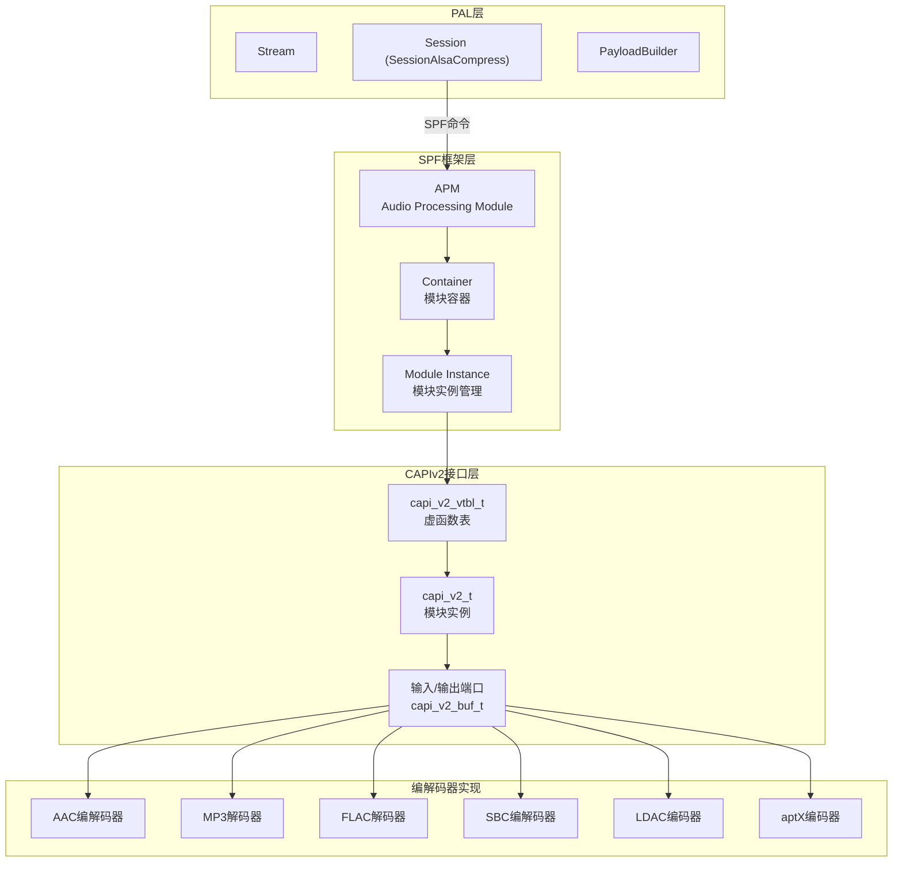
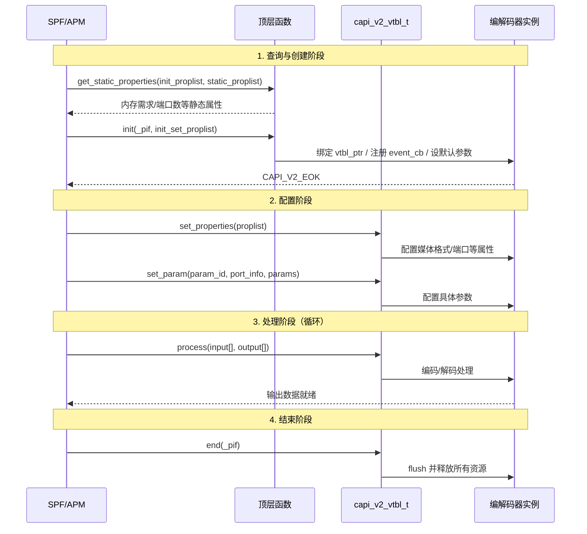

## 15.15 QC CAPIv2：编解码器统一接口标准

> [← 上一个](15_15.14_QC_audio-parsers_音频解析器.md) | [返回目录](README.md) | [下一个 →](15_15.16_QC_CASA_校准配置工具.md)

---

## 15.15.1 模块概述

CAPIv2 (Codec API Version 2) 是 Qualcomm DSP 音频编解码器的统一接口标准。在 AudioReach 架构中，所有运行在 ADSP 上的编解码器（包括 AAC、MP3、FLAC、SBC、LDAC、aptX 等）必须实现 CAPIv2 接口，才能被 SPF (Signal Processing Framework) 框架加载和管理。

CAPIv2 定义了编解码器的标准生命周期（打开→初始化→处理→关闭）和统一的数据交互模型（输入/输出端口、参数配置、事件回调），使不同厂商的编解码器实现可以无缝集成到 SPF 音频图中。

> **源码路径**：`vendor/qcom/proprietary/mm-audio/capiv2_api/`
>
> **关键文件**：
> - `capi_v2.h` — CAPIv2 核心接口定义
> - `capi_v2_types.h` — 基础类型定义
> - `capi_v2_properties.h` — 属性/参数定义
> - `capi_v2_events.h` — 事件回调定义
> - `capi_v2_extn.h` — 扩展接口
> - `mmdefs.h` — 通用宏和类型

## 15.15.2 架构定位



## 15.15.3 核心接口

> **⚠️ 源码核实（重大勘误）**：本节此前描述的 vtbl 成员（`handle`/`init`/`deinit`/`get_static_properties`/`set_static_properties`）以及 `process` 带 `input_len/output_len` 的签名与真实源码 `capi_v2.h` 不符。真实 `capi_v2_vtbl_t` **仅含 6 个成员**：`process`/`end`/`set_param`/`get_param`/`set_properties`/`get_properties`。`init` 与 `get_static_properties` 是**顶层函数指针类型**（`capi_v2_init_f`/`capi_v2_get_static_properties_f`），**不是 vtbl 成员**，且其参数为属性列表 `capi_v2_proplist_t*`，而非 event_cb/init_config。以下已按真实源码重写。

### 15.15.3.1 capi_v2_vtbl_t — 虚函数表（真实，capi_v2.h）

CAPIv2 采用 C 语言面向对象设计，通过虚函数表实现多态。真实 vtbl 仅 6 个成员：

```c
struct capi_v2_vtbl_t {
    // 数据处理（编解码核心）：输入/输出为 stream_data 数组
    capi_v2_err_t (*process)(capi_v2_t *_pif,
                             capi_v2_stream_data_t *input[],
                             capi_v2_stream_data_t *output[]);

    // 释放模块分配的内存；调用后 _pif 不再有效
    capi_v2_err_t (*end)(capi_v2_t *_pif);

    // 按 param_id 设置参数（可带 port_info）
    capi_v2_err_t (*set_param)(capi_v2_t *_pif,
                               uint32_t param_id,
                               const capi_v2_port_info_t *port_info_ptr,
                               capi_v2_buf_t *params_ptr);

    // 按 param_id 获取参数
    capi_v2_err_t (*get_param)(capi_v2_t *_pif,
                               uint32_t param_id,
                               const capi_v2_port_info_t *port_info_ptr,
                               capi_v2_buf_t *params_ptr);

    // 设置属性列表
    capi_v2_err_t (*set_properties)(capi_v2_t *_pif,
                                    capi_v2_proplist_t *proplist_ptr);

    // 获取属性列表
    capi_v2_err_t (*get_properties)(capi_v2_t *_pif,
                                    capi_v2_proplist_t *proplist_ptr);
};
```

### 15.15.3.2 顶层入口函数（真实，非 vtbl 成员）

模块创建与静态属性查询由两个**顶层函数指针类型**完成，参数均为属性列表 `capi_v2_proplist_t*`：

```c
// 查询静态属性（如内存需求 CAPI_V2_INIT_MEMORY_REQUIREMENT 等），实例无关
typedef capi_v2_err_t (*capi_v2_get_static_properties_f)(
    capi_v2_proplist_t *init_set_proplist,
    capi_v2_proplist_t *static_proplist);

// 实例化模块：建立 vtbl，初始化状态（客户端已按内存需求分配 _pif）
typedef capi_v2_err_t (*capi_v2_init_f)(
    capi_v2_t *_pif,
    capi_v2_proplist_t *init_set_proplist);
```

### 15.15.3.3 capi_v2_t — 模块实例（真实）

```c
struct capi_v2_t {
    const capi_v2_vtbl_t *vtbl_ptr;  // 虚函数表指针（真实字段名 vtbl_ptr）
};
```

每个编解码器实例以 `capi_v2_t` 作为第一个成员，实现 C 语言的“继承”：

```c
// 示例：解码器实例
struct some_dec_t {
    capi_v2_t vtbl;   // 首成员为 capi_v2_t（其内含 vtbl_ptr）
    // ... 私有数据（采样率/通道/内部状态等）
};
```

## 15.15.4 关键数据类型

### 15.15.4.1 数据缓冲区 (capi_v2_buf_t)

```c
typedef struct capi_v2_buf_t {
    int8_t  *data_ptr;      // 数据指针
    uint32_t actual_data_len; // 实际数据长度
    uint32_t max_data_len;    // 最大缓冲区长度
} capi_v2_buf_t;
```

### 15.15.4.2 端口信息 (capi_v2_port_info_t)

```c
struct capi_v2_port_info_t {
    bool_t   is_valid;       // port_index 是否有效
    bool_t   is_input_port;  // TRUE=输入端口, FALSE=输出端口
    uint32_t port_index;     // 端口索引（输入/输出各自从 0 起顺序编号）
};
```

> 媒体格式由 `capi_v2_standard_data_format_t` / `capi_v2_set_get_media_format_t` 等结构描述（见 capi_v2_types.h），并非此前文档虚构的 `capi_v2_media_fmt_t`。

### 15.15.4.3 初始化 / 静态属性

CAPIv2 无 `capi_v2_init_config_t` 结构；初始化参数通过属性列表 `capi_v2_proplist_t` 传入 `capi_v2_init_f`（见 15.15.3.2）。端口数、内存需求等以属性 ID（如 `CAPI_V2_PORT_NUM_INFO`、`CAPI_V2_INIT_MEMORY_REQUIREMENT`）形式承载。

### 15.15.4.4 错误码 (capi_v2_err_t)

真实错误码为 **位标志（bit-flag）**，可用 `CAPI_V2_IS_ERROR_CODE_SET` 检测（源码 capi_v2_types.h）：

```c
typedef uint32_t capi_v2_err_t;
#define CAPI_V2_EOK          0
#define CAPI_V2_EFAILED      ((uint32_t)1)          // 一般性失败
#define CAPI_V2_EBADPARAM    (((uint32_t)1) << 1)   // 错误参数
#define CAPI_V2_EUNSUPPORTED (((uint32_t)1) << 2)   // 不支持
#define CAPI_V2_ENOMEMORY    (((uint32_t)1) << 3)   // 内存不足
#define CAPI_V2_ENEEDMORE    (((uint32_t)1) << 4)   // 需要更多数据/空间

#define CAPI_V2_FAILED(x)    (CAPI_V2_EOK != (x))
#define CAPI_V2_SUCCEEDED(x) (CAPI_V2_EOK == (x))
```

> ⚠️ 此前文档的 `CAPI_V2_SUCCESS` / `EBADHANDLE` / `ENOTREADY` / `EREADONLY` / `EPORT_NOT_READY` 均为虚构，真实成功码是 `CAPI_V2_EOK`。

## 15.15.5 事件回调机制 (capi_v2_events.h)

> **⚠️ 源码核实（重大勘误）**：此前文档的事件枚举（`KPPS_CHANGE`/`CODECMODE_CHANGE`/`MEDIA_FMT_CHANGE`/`GET_CHANNEL_MAPPING`/`GET_DELAY`/`GET_BUF_SIZE`/`ACDB_GET_CAL`）与回调签名（`capi_v2_event_cb_t`）均与真实源码 `capi_v2_events.h` 不符，以下按真实源码重写。

### 15.15.5.1 事件类型 (capi_v2_event_id_t)

```c
typedef enum capi_v2_event_id_t {
    CAPI_V2_EVENT_KPPS,                       // 上报 KPPS（计算负载）
    CAPI_V2_EVENT_BANDWIDTH,                  // 上报带宽需求
    CAPI_V2_EVENT_DATA_TO_DSP_CLIENT,         // 数据发往 DSP 客户端
    CAPI_V2_EVENT_DATA_TO_OTHER_MODULE,       // 数据发往其他模块
    CAPI_V2_EVENT_OUTPUT_MEDIA_FORMAT_UPDATED,// 输出媒体格式更新
    CAPI_V2_EVENT_PROCESS_STATE,              // 使能/旁路处理
    CAPI_V2_EVENT_ALGORITHMIC_DELAY,          // 算法延迟上报
    CAPI_V2_EVENT_HEADROOM,                   // headroom 上报
    CAPI_V2_EVENT_PORT_DATA_THRESHOLD_CHANGE, // 端口数据阈值变化
    CAPI_V2_EVENT_METADATA_AVAILABLE,         // 元数据可用
    CAPI_V2_EVENT_DATA_TO_DSP_SERVICE,        // 数据发往 DSP 服务
    CAPI_V2_EVENT_GET_LIBRARY_INSTANCE,       // 获取库实例
    CAPI_V2_EVENT_GET_DLINFO,                 // 获取动态加载信息
    CAPI_V2_MAX_EVENT
} capi_v2_event_id_t;
```

### 15.15.5.2 事件回调函数 (capi_v2_event_cb_f)

```c
/**
 * capi_v2_event_cb_f —模块事件回调（真实签名）
 * @context_ptr:    注册时传入的上下文指针
 * @id:             事件 ID（capi_v2_event_id_t）
 * @event_info_ptr: 事件信息（capi_v2_event_info_t*，内含 port_info + payload buf）
 * 返回:            capi_v2_err_t
 */
typedef capi_v2_err_t (*capi_v2_event_cb_f)(
    void*                context_ptr,
    capi_v2_event_id_t   id,
    capi_v2_event_info_t *event_info_ptr);
```

> 回调返回 `capi_v2_err_t`（非 void），事件负载统一由 `capi_v2_event_info_t`（含 `port_info` 与 `payload` buf）承载，而非此前文档的分散 payload/size 参数。

## 15.15.6 CAPIv2 编解码器生命周期



## 15.15.7 与上下游模块的交互

### 15.15.7.1 PAL → CAPIv2 交互路径

PAL 通过以下路径间接使用 CAPIv2 编解码器：

```
PAL StreamCompress → SessionAlsaCompress → AGM → gsl_fe → HAB → gsl_vm_be → GSL → APM → Container → CAPIv2 Module
```

PAL 侧的操作：
1. **StreamOpen**：指定编解码格式（如 `PAL_AUDIO_FMT_AAC`），由 PayloadBuilder 选择对应的 CAPIv2 模块
2. **StreamStart**：AGM 打开 Graph，APM 加载对应 CAPIv2 编解码器到 Container
3. **StreamWrite**：压缩数据通过 `gsl_dp_write()` 传入 CAPIv2 模块的输入端口
4. **SetParam**：通过 `agm_session_set_params()` 传递编解码参数到 CAPIv2 模块

### 15.15.7.2 PayloadBuilder 与 CAPIv2 模块ID映射

| PAL 编解码格式 | CAPIv2 模块ID | 说明 |
|---------------|--------------|------|
| `PAL_AUDIO_FMT_AAC` | MODULE_ID_AAC_DEC | AAC解码器 |
| `PAL_AUDIO_FMT_MP3` | MODULE_ID_MP3_DEC | MP3解码器 |
| `PAL_AUDIO_FMT_FLAC` | MODULE_ID_FLAC_DEC | FLAC解码器 |
| `PAL_AUDIO_FMT_SBC` | MODULE_ID_SBC_ENC/DEC | SBC编解码器 |
| `PAL_AUDIO_FMT_LDAC` | MODULE_ID_LDAC_ENC | LDAC编码器 |
| `PAL_AUDIO_FMT_APTX` | MODULE_ID_APTX_ENC | aptX编码器 |

## 15.15.8 与 PAL plugins/codecs 的关系

PAL 的 `plugins/codecs/` 目录（参见[第13节](15_15.11_编解码器插件_pluginscodecs.md)）包含 **BT 侧编解码器**（aptX、LC3 等）的 Host 侧实现，这些编解码器运行在 ARM 上，不经过 CAPIv2。

而 CAPIv2 编解码器运行在 **ADSP** 上，由 SPF 框架管理。两者的关系：

| 特性 | CAPIv2 编解码器 | PAL plugins/codecs |
|------|----------------|-------------------|
| 运行位置 | ADSP (DSP) | ARM (Host) |
| 接口标准 | CAPIv2 | PAL BT编解码器接口 |
| 用途 | Compress offload, 硬件加速 | BT A2DP/LE Audio 编码 |
| 管理框架 | SPF/APM | PAL SessionBT |

## 15.15.9 调试参考

```bash
# 查看SPF模块加载日志
logcat -s APM GSL

# 查看CAPIv2编解码器初始化
logcat -s capi_v2

# 检查ADSP上的模块列表
logcat -s ADSP

# 查看Compress offload流状态
cat /proc/asound/card0/compr*
```