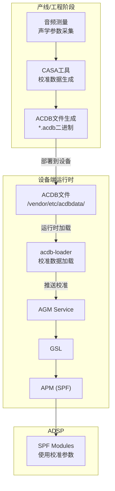
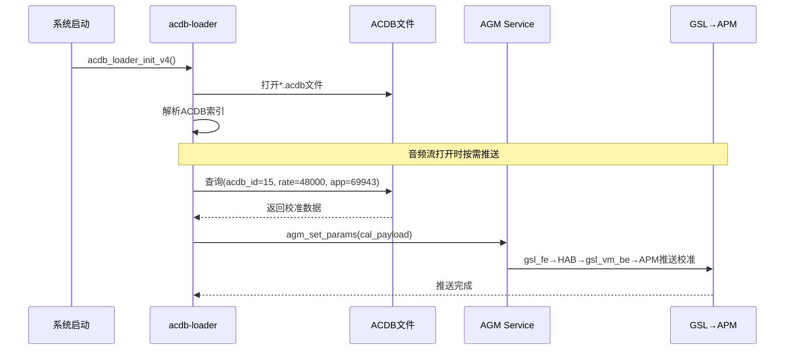

## 15.16 QC CASA：校准配置与数据管理工具

> [← 上一个](15_15.15_QC_CAPIv2_编解码接口.md) | [返回目录](README.md) | [下一个 →](15_15.17_QC_Sound_Trigger_HAL.md)

---

## 15.16.1 模块概述

> **⚠️ 源码核实（重大勘误）**：本地真实源码 `vendor/qcom/proprietary/mm-audio/casa/` **仅是一个预编译 ACDB 数据存放目录，不含任何工具源码**。其真实结构极为简单：
> ```
> casa/
> └── acdbdata/
>     ├── sdxlemur/
>     │   └── acdb_cal.acdb
>     └── sdxprairie/
>         └── acdb_cal.acdb
> ```
> - `sdxlemur` / `sdxprairie` 是 **SDX 系列调制解调器（Modem）平台**代号，与 SA8295 车机 SoC 无直接对应关系；每个平台目录下仅有单一 `acdb_cal.acdb` 二进制文件。
> - **本章此前描述的 CASA 工具链、`acdb_key`/`acdb_entry` 结构体、MTP/QRD/IDP/SA8295 子目录、`*_Speaker_cal.acdb` 等文件命名规范、ACDB ID 映射表，均为推演/虚构，真实 casa 目录中并不存在。**
>
> 以下内容保留 ACDB 校准数据的**通用背景概念**（这些概念本身在 AudioReach 中成立），但请勿将其当作 casa 目录的真实结构。CASA (Calibration and System Audio) 在 Qualcomm 术语中泛指音频校准数据的组织形式，运行时由 `acdb-loader` 加载并经 AGM→GSL→APM 推送到 ADSP。真正的 ACDB 生成工具（如 ACDB Command Line/QACT）不在此源码树内。

> **源码路径**：`vendor/qcom/proprietary/mm-audio/casa/`（真实内容仅 `acdbdata/{sdxlemur,sdxprairie}/acdb_cal.acdb`）

## 15.16.2 架构定位



## 15.16.3 ACDB 校准数据背景（通用概念）

> **⚠️ 源码核实**：本节此前给出的 CASA 工具生成流程图、`acdb_key`/`acdb_entry` C 结构体、ACDB ID 映射表，均为推演内容，**真实 casa 源码目录中不存在这些定义**（casa 只有预编译 `.acdb` 文件）。以下仅保留 AudioReach 体系中 ACDB 的通用背景，供理解运行时加载路径参考。

ACDB (Audio Calibration Database) 是一种二进制校准数据库，其内部按 (设备/采样率/用途) 等键索引组织各 DSP 模块的参数（增益、滤波器系数、延迟补偿、扬声器保护参数等）。这些 `.acdb` 文件由 Qualcomm 独立的校准工具（QACT / ACDB 命令行工具，**不在本源码树内**）离线生成，随镜像部署到设备后，运行时由 `acdb-loader` 解析并按需查询。

真实的键结构、模块 ID、参数 ID 定义位于 `acdb-loader` 与 ACDB SDK 的头文件中（参见 15 章 acdb-loader 相关章节及 16 章 ACDB 双域共享），而非 casa 目录。因此本章不再列举具体结构体与 ID 表，以避免与真实源码不符。

## 15.16.4 acdbdata 目录结构（真实）

`casa/acdbdata/` 目录的真实内容如下（每个平台目录下仅有单一 `acdb_cal.acdb`）：

```
acdbdata/
├── sdxlemur/          # SDX Lemur 调制解调器平台
│   └── acdb_cal.acdb
└── sdxprairie/        # SDX Prairie 调制解调器平台
    └── acdb_cal.acdb
```

> **⚠️ 源码核实（重大勘误）**：此前文档列出的 `MTP/`、`QRD/`、`IDP/`、`SA8295/` 子目录，以及 `*_Speaker_cal.acdb`、`*_General_cal.acdb`、`*.qwsp` 等分文件命名与"ACDB 文件分类"表，在真实 casa 目录中**均不存在**。真实结构仅为两个 SDX Modem 平台目录，各含单一 `acdb_cal.acdb`。
>
> SA8295 车机域的实际 ACDB 校准数据并不由此 casa 目录提供——车机平台的 `.acdb` 校准文件通常随对应 device/BSP 配置部署，双域共享机制参见 [N.7 ACDB校准数据（Android与QNX双域共享）](../16_Vendor_QNX_Architecture/16_16.7_ACDB校准数据Android与QNX双域共享.md)。

## 15.16.5 CASA 与 auto-casa-xml 的关系

在 SA8295 平台上，存在两个容易混淆的概念：

| 概念 | 路径 | 功能 | 作用阶段 |
|------|------|------|----------|
| **CASA** | `vendor/qcom/proprietary/mm-audio/casa/` | ACDB文件生成工具 | 产线/工程 |
| **auto-casa-xml** | `vendor/qcom/opensource/audio-hal-ar/primary-hal/auto-casa-xml/` | PAL资源配置XML | 运行时 |

- **CASA**：离线工具，生成 `.acdb` 校准二进制文件
- **auto-casa-xml**：运行时配置，定义 PAL 的流/设备/编解码器映射关系（参见[N.9 auto-casa-xml配置](../16_Vendor_QNX_Architecture/16_16.9_auto-casa-xml配置.md)）

## 15.16.6 与 ACDB 运行时加载的交互

### 15.16.6.1 ACDB 加载流程



### 15.16.6.2 CASA → ACDB → ADSP 数据流

```
CASA工具(产线) → *.acdb文件(部署) → acdb-loader(运行时) → AGM → gsl_fe → MM-HAB → gsl_vm_be → APM → SPF Module
```

## 15.16.7 SA8295 双域 ACDB 部署

在 SA8295 虚拟化架构下，ACDB 文件需要分别部署到两个域：

| 域 | ACDB 文件位置 | 用途 |
|----|-------------|------|
| Android (GVM) | `/vendor/etc/acdbdata/` | Android 音频流校准 |
| QNX (PVM) | QNX fs上的ACDB路径 | QNX 域音频校准 |

详细的双域 ACDB 共享机制参见 [N.7 ACDB校准数据（Android与QNX双域共享）](../16_Vendor_QNX_Architecture/16_16.7_ACDB校准数据Android与QNX双域共享.md)。

## 15.16.8 调试参考

```bash
# 检查ACDB文件是否部署
ls -la /vendor/etc/acdbdata/*.acdb

# 检查ACDB文件大小（非空）
du -h /vendor/etc/acdbdata/*.acdb

# 查看acdb-loader初始化日志
logcat -s acdb_loader ACDB

# 检查校准推送是否成功
logcat -s AGM GSL

# 手动触发校准推送（调试用）
# 通过PAL debug接口触发
```