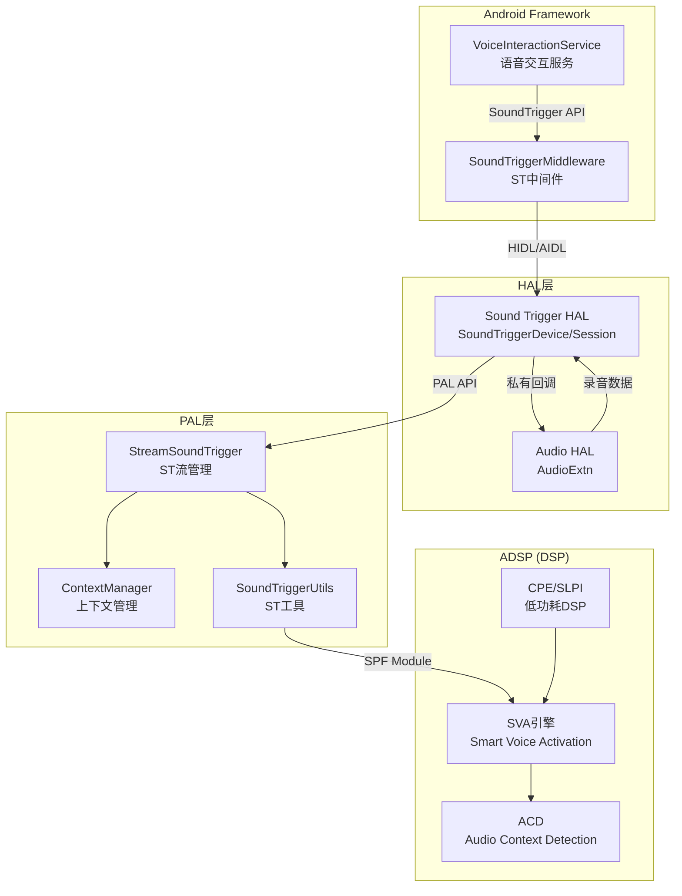
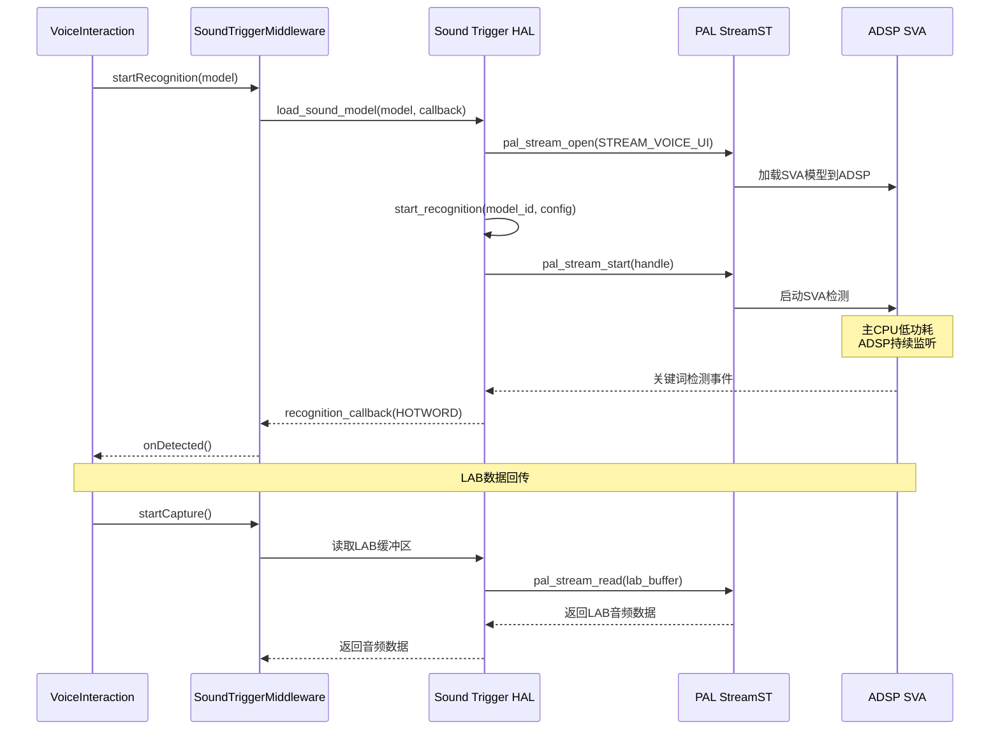

## 15.17 QC Sound Trigger HAL：语音触发HAL实现

> [← 上一个](15_15.16_QC_CASA_校准配置工具.md) | [返回目录](README.md) | [下一个 →](15_15.99_附录_Stream-Session-Device映射关系.md)

---

## 15.17.1 模块概述

Sound Trigger HAL 是 Qualcomm 平台的语音触发硬件抽象层实现，提供基于 DSP 的离线语音关键词检测（Key Phrase Detection）功能。该模块实现了 Android SoundTrigger HAL 接口，使得 Android Framework 的 SoundTriggerMiddleware 可以通过标准 HAL 接口加载语音模型、启动/停止识别，而实际的语音检测运算由 ADSP 上的 SVA (Smart Voice Activation) 引擎完成，主 CPU 处于低功耗状态。

在车载场景中，Sound Trigger HAL 用于实现"你好，XX"等语音唤醒功能，确保在车辆熄火待机状态下也能通过语音激活系统，同时最小化功耗。

> ⚠️ **源码核实（重大勘误）**：SA8295 采用 AudioReach 架构，Sound Trigger HAL 实际使用 **`vendor/qcom/opensource/audio-hal-ar/st-hal/`（C++ 实现，经 PAL）**，而非旧版 `audio-hal/st-hal/`（legacy C 实现，走 GCS/LSM/PCM，不经 PAL）。本文以真实的 AudioReach C++ 版为准。
>
> **源码路径**：`vendor/qcom/opensource/audio-hal-ar/st-hal/`
>
> **真实关键文件**（经本地源码核实）：
> - `SoundTriggerDevice.cpp/.h` — `SoundTriggerDevice` 类，封装标准 `sound_trigger_hw_device`，管理会话列表
> - `SoundTriggerSession.cpp/.h` — `SoundTriggerSession` 类，单个语音模型会话，通过 PAL 打开 `PAL_STREAM_VOICE_UI` 流
> - `SoundTriggerPropIntf.h` — AHAL-STHAL 私有接口（`audio_event_type_t` / `audio_event_info` / STHAL_PROP_API 版本）
>
> 该目录**不含** legacy 版的 `sound_trigger_hw.c`、`sound_trigger_platform.c/h`、`ListenSoundModelLib.h`、`st_hw_session_gcs/lsm/pcm.c`。

## 15.17.2 架构定位



## 15.17.3 核心 HAL 接口

AudioReach 版 STHAL 由两个 C++ 类构成：`SoundTriggerDevice`（设备/模块级，管理会话列表）与 `SoundTriggerSession`（单个语音模型会话，经 PAL 打开 ST 流）。二者对外仍封装 Android 标准的 `sound_trigger_hw_device` C 接口供 SoundTriggerMiddleware 调用。

### 15.17.3.1 SoundTriggerDevice（设备类，`SoundTriggerDevice.h`）

```cpp
class SoundTriggerDevice {
 public:
    static std::shared_ptr<SoundTriggerDevice> GetInstance();
    static std::shared_ptr<SoundTriggerDevice> GetInstance(
        const hw_device_t *device);
    static std::shared_ptr<SoundTriggerDevice> GetInstance(
        const struct sound_trigger_hw_device *st_device);

    int Init(hw_device_t **device, const hw_module_t *module);
    int LoadAudioHal();          // dlopen 加载 Audio HAL 以获取回调
    int PlatformInit();          // 平台/属性初始化
    SoundTriggerSession* GetSession(sound_model_handle_t handle);
    int RegisterSession(SoundTriggerSession* session);
    int DeregisterSession(SoundTriggerSession* session);

    audio_hw_call_back_t ahal_callback_;   // Audio HAL 回调
    volatile int session_id_;
    bool conc_capture_supported_;          // 并发录音支持

 protected:
    static std::shared_ptr<SoundTriggerDevice> stdev_;
    static std::shared_ptr<struct sound_trigger_hw_device> device_;
    struct sound_trigger_properties *hw_properties_;
    std::vector<SoundTriggerSession *> session_list_;   // 会话列表
    std::mutex mutex_;
    audio_devices_t available_devices_;
    void *ahal_handle_;
    unsigned int sthal_prop_api_version_;
};
```

### 15.17.3.2 SoundTriggerSession（会话类，`SoundTriggerSession.h`）

每个已加载语音模型对应一个会话，会话内部通过 PAL 打开 `PAL_STREAM_VOICE_UI` 流：

```cpp
typedef enum {
    IDLE, LOADED, ACTIVE, DETECTED, BUFFERING, STOPPING, STOPPED,
} session_state_t;

class SoundTriggerSession {
 public:
    SoundTriggerSession(sound_model_handle_t handle,
                        audio_hw_call_back_t callback);
    int LoadSoundModel(struct sound_trigger_sound_model *sound_model);
    int UnloadSoundModel();
    int StartRecognition(const struct sound_trigger_recognition_config *config,
                         recognition_callback_t callback, void *cookie,
                         uint32_t version);
    int StopRecognition();
    sound_model_handle_t GetSoundModelHandle();
    int GetCaptureHandle();
    int GetModuleVersion(char version[]);
    void *GetCookie();
    void GetRecognitionCallback(recognition_callback_t *callback);

 protected:
    int OpenPALStream(pal_stream_type_t stream_type);       // pal_stream_open
    bool IsACDSoundModel(struct sound_trigger_sound_model *sound_model);
    void RegisterHalEvent(bool is_register);
    static int pal_callback(pal_stream_handle_t *stream_handle,
                            uint32_t event_id, uint32_t *event_data,
                            uint32_t event_size, uint64_t cookie);
    int StopRecognition_l();

    session_state_t state_;
    sound_model_handle_t sm_handle_;
    pal_stream_handle_t *pal_handle_;                 // PAL 流句柄
    recognition_callback_t rec_callback_;
    pal_param_payload *rec_config_payload_;
    struct pal_st_recognition_config *rec_config_;    // PAL ST 识别配置
    audio_hw_call_back_t hal_callback_;
    void *cookie_;
    std::mutex ses_mutex_;
};
```

> ⚠️ **勘误**：AudioReach 版**没有** legacy 的 `sound_trigger_hw.c` 里那套 vtable 直填实现、`st_hw_session_gcs/lsm/pcm`、`ListenSoundModelLib`。会话直接通过 `OpenPALStream()` → `pal_stream_open(PAL_STREAM_VOICE_UI)` 交由 PAL 管理，检测事件经 `pal_callback` 静态回调上报。

### 15.17.3.3 标准 `sound_trigger_hw_device`（AOSP 通用接口）

`SoundTriggerDevice::Init()` 会填充并返回一个标准 `sound_trigger_hw_device`（定义于 AOSP `hardware/sound_trigger.h`），供 SoundTriggerMiddleware 调用。其函数指针最终转发到上述 C++ 类：

```c
struct sound_trigger_hw_device {
    struct hw_device_t common;

    /**
     * get_properties() — 获取ST硬件属性
     * @dev:     HAL设备指针
     * @props:   输出属性结构
     */
    int (*get_properties)(const struct sound_trigger_hw_device *dev,
                          struct sound_trigger_properties *props);

    /**
     * load_sound_model() — 加载语音模型
     * @dev:       HAL设备指针
     * @model:     语音模型数据
     * @callback:  识别结果回调
     * @cookie:    回调上下文
     * @model_id:  输出模型ID
     */
    int (*load_sound_model)(const struct sound_trigger_hw_device *dev,
                            struct sound_trigger_sound_model *model,
                            sound_model_callback_t callback,
                            void *cookie,
                            sound_model_handle_t *model_id);

    /**
     * unload_sound_model() — 卸载语音模型
     */
    int (*unload_sound_model)(const struct sound_trigger_hw_device *dev,
                              sound_model_handle_t model_id);

    /**
     * start_recognition() — 启动识别
     * @dev:       HAL设备指针
     * @model_id:  模型ID
     * @config:    识别配置
     * @callback:  事件回调
     * @cookie:    回调上下文
     */
    int (*start_recognition)(const struct sound_trigger_hw_device *dev,
                             sound_model_handle_t model_id,
                             const struct sound_trigger_recognition_config *config,
                             recognition_callback_t callback,
                             void *cookie);

    /**
     * stop_recognition() — 停止识别
     */
    int (*stop_recognition)(const struct sound_trigger_hw_device *dev,
                            sound_model_handle_t model_id);

    /**
     * stop_all_recognitions() — 停止所有识别
     */
    int (*stop_all_recognitions)(const struct sound_trigger_hw_device *dev);
};
```

### 15.17.3.2 语音模型类型

```c
// 关键词语音模型
struct sound_trigger_phrase_sound_model {
    struct sound_trigger_sound_model common;
    unsigned int num_phrases;           // 关键短语数量
    struct sound_trigger_phrase *phrases; // 关键短语数组
};

// 通用语音模型（Vendor自定义）
struct sound_trigger_sound_model {
    sound_model_handle_t handle;        // 模型句柄
    unsigned int type;                   // 模型类型
    unsigned int vendor_uuid;           // Vendor UUID
    unsigned int data_size;             // 模型数据大小
    unsigned int data_offset;           // 模型数据偏移
};
```

## 15.17.4 AHAL-STHAL 私有接口

Audio HAL 和 Sound Trigger HAL 之间存在私有接口（真实头文件 `SoundTriggerPropIntf.h` + `audio_extn/audio_extn.h`），用于协调录音和语音检测的交互。

### 15.17.4.1 私有接口定义

```c
// STHAL → AHAL 事件（audio_extn.h，共5项）
typedef enum {
    ST_EVENT_SESSION_REGISTER,          // 会话注册
    ST_EVENT_SESSION_DEREGISTER,        // 会话注销
    ST_EVENT_START_KEEP_ALIVE,          // 启动保活
    ST_EVENT_STOP_KEEP_ALIVE,           // 停止保活
    ST_EVENT_UPDATE_ECHO_REF            // 更新回声参考
} sound_trigger_event_type_t;

// AHAL → STHAL 事件类型（SoundTriggerPropIntf.h，共18项）
enum audio_event_type {
    AUDIO_EVENT_CAPTURE_DEVICE_INACTIVE,
    AUDIO_EVENT_CAPTURE_DEVICE_ACTIVE,
    AUDIO_EVENT_PLAYBACK_STREAM_INACTIVE,
    AUDIO_EVENT_PLAYBACK_STREAM_ACTIVE,
    AUDIO_EVENT_STOP_LAB,
    AUDIO_EVENT_SSR,                        // 子系统重启
    AUDIO_EVENT_NUM_ST_SESSIONS,
    AUDIO_EVENT_READ_SAMPLES,
    AUDIO_EVENT_DEVICE_CONNECT,
    AUDIO_EVENT_DEVICE_DISCONNECT,
    AUDIO_EVENT_SVA_EXEC_MODE,
    AUDIO_EVENT_SVA_EXEC_MODE_STATUS,
    AUDIO_EVENT_CAPTURE_STREAM_INACTIVE,
    AUDIO_EVENT_CAPTURE_STREAM_ACTIVE,
    AUDIO_EVENT_BATTERY_STATUS_CHANGED,
    AUDIO_EVENT_GET_PARAM,
    AUDIO_EVENT_UPDATE_ECHO_REF,
    AUDIO_EVENT_SCREEN_STATUS_CHANGED
};
typedef enum audio_event_type audio_event_type_t;

// AHAL 调用 STHAL 的回调（STHAL 注册）
typedef int (*sound_trigger_hw_call_back_t)(enum audio_event_type,
                                            struct audio_event_info*);
// STHAL 调用 AHAL 的回调（AHAL 注册）
typedef void (*audio_hw_call_back_t)(sound_trigger_event_type_t event,
                                     sound_trigger_event_info_t* config);
```

> ⚠️ **勘误**：真实 `sound_trigger_event_type_t` 有 **5 项**（旧文档仅列 2 项）；`audio_event_type_t` 有 **18 项**（旧文档仅列 11 项）。回调有两个方向：`sound_trigger_hw_call_back_t`（AHAL→STHAL）与 `audio_hw_call_back_t`（STHAL→AHAL）。

### 15.17.4.2 会话信息

真实定义（`audio_extn.h`）非常精简，**不含** legacy 版的 `struct pcm*`/`pcm_config`（AudioReach 版录音由 PAL 管理）：

```c
struct sound_trigger_session_info {
    void* p_ses;           // 不透明 st_session 对象指针
    int capture_handle;    // 录音流句柄
};

struct sound_trigger_event_info {
    struct sound_trigger_session_info st_ses;
    bool st_ec_ref_enabled;   // 回声参考是否使能
};
```

## 15.17.5 SoundTrigger 平台配置

> ⚠️ **勘误**：AudioReach 版 STHAL 目录**没有** `sound_trigger_platform.c/h`（含 `sound_trigger_platform_info` 结构的 `sva_exec_mode/max_sound_models/max_key_phrases/lab_enable/acd_enable` 等字段）以及 `ListenSoundModelLib.h`（`listen_sound_model_load/unload/start/stop/get_param/set_param` 接口）——这些均属旧版 legacy C 实现（`audio-hal/st-hal/`），AR 版不使用。

### 15.17.5.1 真实平台配置来源：PAL 层

在 AudioReach 架构中，SVA/ACD 的平台参数由 **PAL 层**解析（XML 配置），而非 STHAL 侧的 C 结构体：

| 组件 | 真实源码路径 | 功能 |
|------|-------------|------|
| `SoundTriggerPlatformInfo` | `pal/utils/inc/SoundTriggerPlatformInfo.h`、`pal/utils/src/SoundTriggerPlatformInfo.cpp` | 解析 ST 平台 XML 配置（模型/引擎/缓冲等参数） |
| `StreamSoundTrigger` | `pal/stream/inc/StreamSoundTrigger.h`、`pal/stream/src/StreamSoundTrigger.cpp` | PAL 侧 ST 流实现，承接 STHAL 的 `PAL_STREAM_VOICE_UI` |

STHAL（`SoundTriggerSession`）只负责把 Android 语音模型/识别配置转换为 PAL 参数并通过 `pal_stream_open/start` 下发，具体 SVA 引擎选择、LAB 缓冲、执行模式等均由 PAL 及其 XML 配置和 ADSP 侧决定。

### 15.17.5.2 模型加载路径（真实）

STHAL 不再直接调 `listen_sound_model_*`，而是：

```cpp
// SoundTriggerSession::LoadSoundModel → OpenPALStream → pal_stream_open
int SoundTriggerSession::OpenPALStream(pal_stream_type_t stream_type) {
    // stream_type = PAL_STREAM_VOICE_UI
    // 构造 pal_stream_attributes，调用 pal_stream_open(&attr, ..., pal_callback, ..., &pal_handle_)
}
```

语音模型数据与识别配置（`pal_st_recognition_config`）作为 PAL 参数下发，模型的实际加载/运算由 ADSP 上的 SVA 引擎完成。

## 15.17.6 语音唤醒工作流程

### 15.17.6.1 完整识别流程



### 15.17.6.2 SVA 执行模式

| 模式 | 执行DSP | 功耗 | 延迟 | 适用场景 |
|------|---------|------|------|----------|
| CPE模式 | CPE/SLPI (低功耗DSP) | 极低 | 较高 | 待机语音唤醒 |
| ADSP模式 | ADSP (主DSP) | 中等 | 较低 | 充电/活跃状态唤醒 |

在 SA8295 车载平台上，由于 ADSP 始终处于活跃状态，通常使用 ADSP 模式运行 SVA。

## 15.17.7 与上下游模块的交互

### 15.17.7.1 上游：Android Framework

- `VoiceInteractionService` 通过 `SoundTriggerManager` 发起语音识别请求
- `SoundTriggerMiddleware` 通过 HIDL/AIDL 调用 Sound Trigger HAL
- 识别结果通过 `recognition_callback` 回调通知 Framework

### 15.17.7.2 下游：PAL

Sound Trigger HAL 通过 PAL API 管理 ST 流：

| STHAL 操作 | PAL API | 说明 |
|-----------|---------|------|
| 加载模型 | `pal_stream_open(STREAM_VOICE_UI)` | 创建ST流 |
| 启动识别 | `pal_stream_start()` | 启动SVA检测 |
| 读取LAB | `pal_stream_read()` | 读取Look-Ahead Buffer |
| 停止识别 | `pal_stream_stop()` | 停止SVA检测 |
| 卸载模型 | `pal_stream_close()` | 关闭ST流 |
| 设置参数 | `pal_stream_set_param()` | 配置SVA参数 |

### 15.17.7.3 横向：Audio HAL

Audio HAL 的 `soundtrigger.c` 扩展模块与 STHAL 通过私有接口交互：

- **录音协调**：当 STHAL 检测到关键词后，Audio HAL 需要提供 LAB 缓冲区的录音数据
- **并发管理**：当有其他录音流活跃时，通知 STHAL 避免冲突
- **SSR 通知**：ADSP 重启事件需要通知 STHAL 重新加载模型

## 15.17.8 PAL 中的 SoundTrigger 相关组件

PAL 内部有专门的 ST 管理组件（详见[第13节](15_15.11_编解码器插件_pluginscodecs.md)的 Utils 和 ContextManager 部分）：

| 组件 | 源码路径 | 功能 |
|------|----------|------|
| `StreamSoundTrigger` | `pal/stream/src/StreamSoundTrigger.cpp` | ST流管理 |
| `SessionStGsl` | `pal/session/src/SessionStGsl.cpp` | ST GSL会话 |
| `ContextManager` | `pal/context_manager/` | 上下文管理（ACD/SVA） |
| `SoundTriggerPlatformInfo` | `pal/utils/` | ST平台信息配置 |
| `ACDPlatformInfo` | `pal/utils/` | ACD平台信息配置 |
| `SoundTriggerUtils` | `pal/utils/` | ST工具函数 |

## 15.17.9 调试参考

```bash
# 查看SoundTrigger HAL日志
logcat -s sound_trigger SoundTriggerHAL

# 查看PAL ST流日志
logcat -s PAL StreamSoundTrigger

# 查看SVA引擎状态
logcat -s SVA ACD

# 检查ST HAL库
ls -la /vendor/lib*/hw/sound_trigger.primary.*

# 查看语音模型加载状态
dumpsys audio | grep -i "sound trigger"

# 检查ADSP SVA模块
logcat -s APM GSL | grep -i sva
```