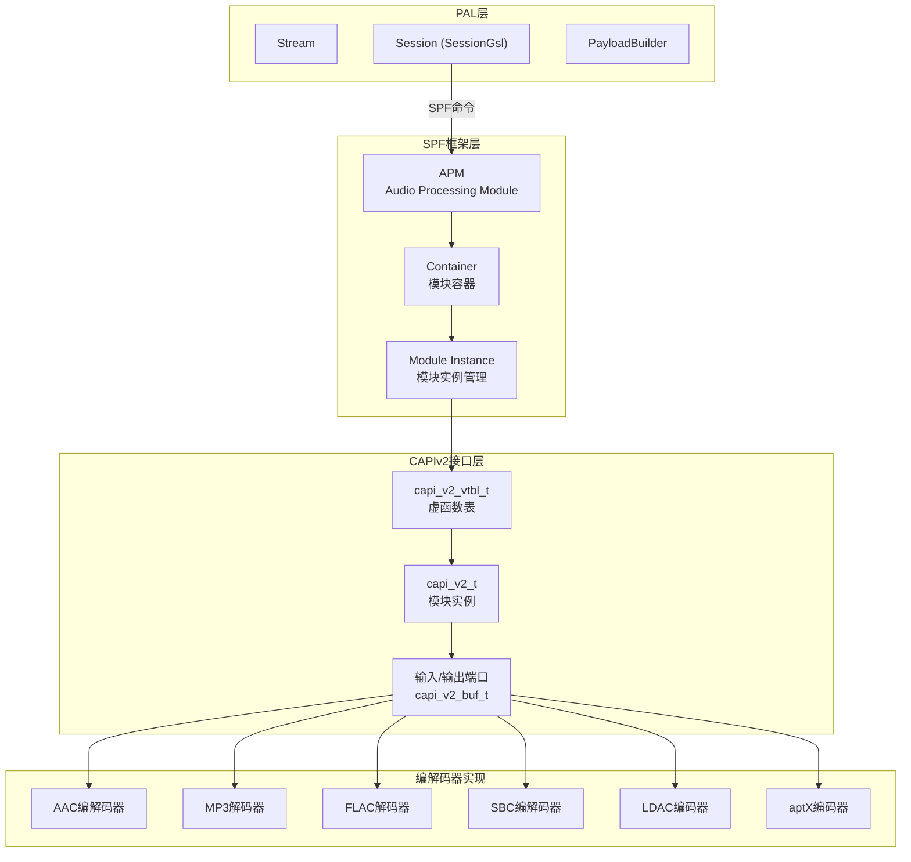
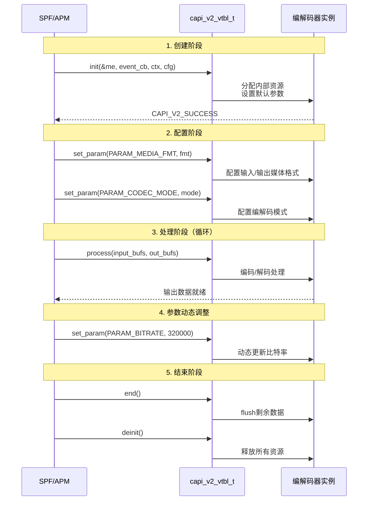

## 15.15 QC CAPIv2：编解码器统一接口标准

> [← 上一个](15_14.1_QC_audio-parsers_音频解析器.md) | [返回目录](README.md) | [下一个 →](15_16.1_QC_CASA_校准配置工具.md)

---

## 17.1 模块概述

CAPIv2 (Codec API Version 2) 是 Qualcomm DSP 音频编解码器的统一接口标准。在 AudioReach 架构中，所有运行在 ADSP 上的编解码器（包括 AAC、MP3、FLAC、SBC、LDAC、aptX 等）必须实现 CAPIv2 接口，才能被 SPF (Signal Processing Framework) 框架加载和管理。

CAPIv2 定义了编解码器的标准生命周期（打开→初始化→处理→关闭）和统一的数据交互模型（输入/输出端口、参数配置、事件回调），使不同厂商的编解码器实现可以无缝集成到 SPF 音频图中。

> **源码路径**：`vendor/qcom/proprietary/mm-audio/capiv2_api/`
>
> **关键文件**：
> - `capi_v2.h` — CAPIv2 核心接口定义
> - `capi_v2_types.h` — 基础类型定义
> - `capi_v2_properties.h` — 属性/参数定义
> - `capi_v2_events.h` — 事件回调定义
> - `capi_v2_extn.h` — 扩展接口
> - `mmdefs.h` — 通用宏和类型

## 17.2 架构定位



## 17.3 核心接口

### 15.15.3.1 capi_v2_vtbl_t — 虚函数表

CAPIv2 采用 C 语言面向对象设计，通过虚函数表（vtable）实现多态。每个编解码器必须实现以下函数：

```c
struct capi_v2_vtbl_t {
    /**
     * process() — 数据处理（编解码核心）
     * @me:       模块实例指针
     * @input:    输入缓冲区数组
     * @input_len:输入缓冲区数量
     * @output:   输出缓冲区数组
     * @output_len:输出缓冲区数量
     *
     * 返回：CAPI_V2_SUCCESS等
     */
    capi_v2_err_t (*process)(capi_v2_t *me,
                             capi_v2_buf_t *input[],
                             uint32_t input_len,
                             capi_v2_buf_t *output[],
                             uint32_t output_len);

    /**
     * handle() — 事件处理
     * @me:      模块实例指针
     * @event:   事件ID
     * @payload: 事件数据
     * @size:    数据大小
     */
    capi_v2_err_t (*handle)(capi_v2_t *me,
                            capi_v2_event_id_t event,
                            void *payload,
                            uint32_t size);

    /**
     * set_param() — 设置参数
     * @me:        模块实例指针
     * @param_id:  参数ID
     * @param_data:参数数据
     * @param_size:参数大小
     */
    capi_v2_err_t (*set_param)(capi_v2_t *me,
                               uint32_t param_id,
                               const void *param_data,
                               uint32_t param_size);

    /**
     * get_param() — 获取参数
     */
    capi_v2_err_t (*get_param)(capi_v2_t *me,
                               uint32_t param_id,
                               void *param_data,
                               uint32_t *param_size);

    /**
     * end() — 结束处理（flush）
     */
    capi_v2_err_t (*end)(capi_v2_t *me);

    /**
     * init() — 初始化（静态方法，创建实例）
     * @me:         输出模块实例
     * @event_cb:   事件回调函数
     * @event_ctx:  回调上下文
     * @cfg:        初始化配置
     */
    capi_v2_err_t (*init)(capi_v2_t *me,
                          capi_v2_event_cb_t event_cb,
                          void *event_ctx,
                          const capi_v2_init_config_t *cfg);

    /**
     * deinit() — 反初始化
     */
    capi_v2_err_t (*deinit)(capi_v2_t *me);

    /**
     * get_static_properties() — 获取静态属性
     */
    capi_v2_err_t (*get_static_properties)(capi_v2_prop_t *prop);

    /**
     * set_static_properties() — 设置静态属性
     */
    capi_v2_err_t (*set_static_properties)(const capi_v2_prop_t *prop);
};
```

### 15.15.3.2 capi_v2_t — 模块实例

```c
struct capi_v2_t {
    const capi_v2_vtbl_t *vtbl;  // 虚函数表指针
};
```

每个编解码器实例以 `capi_v2_t` 作为第一个成员，实现 C 语言的"继承"：

```c
// 示例：AAC解码器实例
struct aac_dec_t {
    capi_v2_t api;              // 必须为第一个成员
    // ... AAC解码器私有数据
    capi_v2_event_cb_t event_cb;
    void *event_ctx;
    uint32_t sample_rate;
    uint32_t channels;
    // ...
};
```

## 17.4 关键数据类型

### 15.15.4.1 数据缓冲区 (capi_v2_buf_t)

```c
typedef struct capi_v2_buf_t {
    int8_t  *data_ptr;      // 数据指针
    uint32_t actual_data_len; // 实际数据长度
    uint32_t max_data_len;    // 最大缓冲区长度
} capi_v2_buf_t;
```

### 15.15.4.2 端口配置 (capi_v2_port_info_t)

```c
typedef struct capi_v2_port_info_t {
    uint32_t port_index;    // 端口索引
    bool is_input;          // true=输入端口, false=输出端口
} capi_v2_port_info_t;

typedef struct capi_v2_media_fmt_t {
    capi_v2_port_info_t port_info;
    uint32_t sample_rate;   // 采样率
    uint32_t channels;      // 通道数
    uint32_t bit_width;     // 位宽
    uint32_t format;        // 数据格式
} capi_v2_media_fmt_t;
```

### 15.15.4.3 初始化配置 (capi_v2_init_config_t)

```c
typedef struct capi_v2_init_config_t {
    uint32_t max_in_port;       // 最大输入端口数
    uint32_t max_out_port;      // 最大输出端口数
    capi_v2_event_cb_t event_cb; // 事件回调
    void *event_ctx;            // 回调上下文
    bool is_inband;             // 是否带内模式
} capi_v2_init_config_t;
```

### 15.15.4.4 错误码 (capi_v2_err_t)

```c
typedef uint32_t capi_v2_err_t;
#define CAPI_V2_SUCCESS           0
#define CAPI_V2_EFAILED          1  // 一般性失败
#define CAPI_V2_ENOMEMORY        2  // 内存不足
#define CAPI_V2_EUNSUPPORTED     3  // 不支持的操作
#define CAPI_V2_EBADPARAM        4  // 错误参数
#define CAPI_V2_EBADHANDLE       5  // 无效句柄
#define CAPI_V2_ENOTREADY        6  // 未就绪
#define CAPI_V2_EREADONLY        7  // 只读
#define CAPI_V2_EPORT_NOT_READY  8  // 端口未就绪
```

## 17.5 事件回调机制 (capi_v2_events.h)

### 15.15.5.1 事件类型

```c
typedef enum {
    CAPI_V2_EVENT_KPPS_CHANGE,          // KPPS变化（计算负载）
    CAPI_V2_EVENT_CODECMODE_CHANGE,     // 编解码模式变化
    CAPI_V2_EVENT_MEDIA_FMT_CHANGE,     // 媒体格式变化
    CAPI_V2_EVENT_PORT_DATA_THRESHOLD_CHANGE, // 数据阈值变化
    CAPI_V2_EVENT_NUM_INPUT_OUTPUT_CHANGE,    // 端口数量变化
    CAPI_V2_EVENT_GET_CHANNEL_MAPPING,  // 通道映射查询
    CAPI_V2_EVENT_GET_DELAY,            // 延迟查询
    CAPI_V2_EVENT_GET_BUF_SIZE,         // 缓冲区大小查询
    CAPI_V2_EVENT_ACDB_GET_CAL,         // ACDB校准数据获取
} capi_v2_event_id_t;
```

### 15.15.5.2 事件回调函数

```c
/**
 * capi_v2_event_cb_t — 模块事件回调
 * @event_id:   事件ID
 * @event_info: 事件数据
 * @payload:    回调payload
 * @size:       payload大小
 * @ctx:        注册时传入的上下文
 */
typedef void (*capi_v2_event_cb_t)(capi_v2_event_id_t event_id,
                                    capi_v2_event_info_t *event_info,
                                    void *payload,
                                    uint32_t size,
                                    void *ctx);
```

## 17.6 CAPIv2 编解码器生命周期



## 17.7 与上下游模块的交互

### 15.15.7.1 PAL → CAPIv2 交互路径

PAL 通过以下路径间接使用 CAPIv2 编解码器：

```
PAL StreamCompress → SessionGsl → AGM → gsl_fe → HAB → gsl_vm_be → GSL → APM → Container → CAPIv2 Module
```

PAL 侧的操作：
1. **StreamOpen**：指定编解码格式（如 `PAL_AUDIO_FMT_AAC`），由 PayloadBuilder 选择对应的 CAPIv2 模块
2. **StreamStart**：AGM 打开 Graph，APM 加载对应 CAPIv2 编解码器到 Container
3. **StreamWrite**：压缩数据通过 `gsl_dp_write()` 传入 CAPIv2 模块的输入端口
4. **SetParam**：通过 `agm_session_set_params()` 传递编解码参数到 CAPIv2 模块

### 15.15.7.2 PayloadBuilder 与 CAPIv2 模块ID映射

| PAL 编解码格式 | CAPIv2 模块ID | 说明 |
|---------------|--------------|------|
| `PAL_AUDIO_FMT_AAC` | MODULE_ID_AAC_DEC | AAC解码器 |
| `PAL_AUDIO_FMT_MP3` | MODULE_ID_MP3_DEC | MP3解码器 |
| `PAL_AUDIO_FMT_FLAC` | MODULE_ID_FLAC_DEC | FLAC解码器 |
| `PAL_AUDIO_FMT_SBC` | MODULE_ID_SBC_ENC/DEC | SBC编解码器 |
| `PAL_AUDIO_FMT_LDAC` | MODULE_ID_LDAC_ENC | LDAC编码器 |
| `PAL_AUDIO_FMT_APTX` | MODULE_ID_APTX_ENC | aptX编码器 |

## 17.8 与 PAL plugins/codecs 的关系

PAL 的 `plugins/codecs/` 目录（参见[第13节](15_11.1_编解码器插件_pluginscodecs.md)）包含 **BT 侧编解码器**（aptX、LC3 等）的 Host 侧实现，这些编解码器运行在 ARM 上，不经过 CAPIv2。

而 CAPIv2 编解码器运行在 **ADSP** 上，由 SPF 框架管理。两者的关系：

| 特性 | CAPIv2 编解码器 | PAL plugins/codecs |
|------|----------------|-------------------|
| 运行位置 | ADSP (DSP) | ARM (Host) |
| 接口标准 | CAPIv2 | PAL BT编解码器接口 |
| 用途 | Compress offload, 硬件加速 | BT A2DP/LE Audio 编码 |
| 管理框架 | SPF/APM | PAL SessionBT |

## 17.9 调试参考

```bash
# 查看SPF模块加载日志
logcat -s APM GSL

# 查看CAPIv2编解码器初始化
logcat -s capi_v2

# 检查ADSP上的模块列表
logcat -s ADSP

# 查看Compress offload流状态
cat /proc/asound/card0/compr*
```